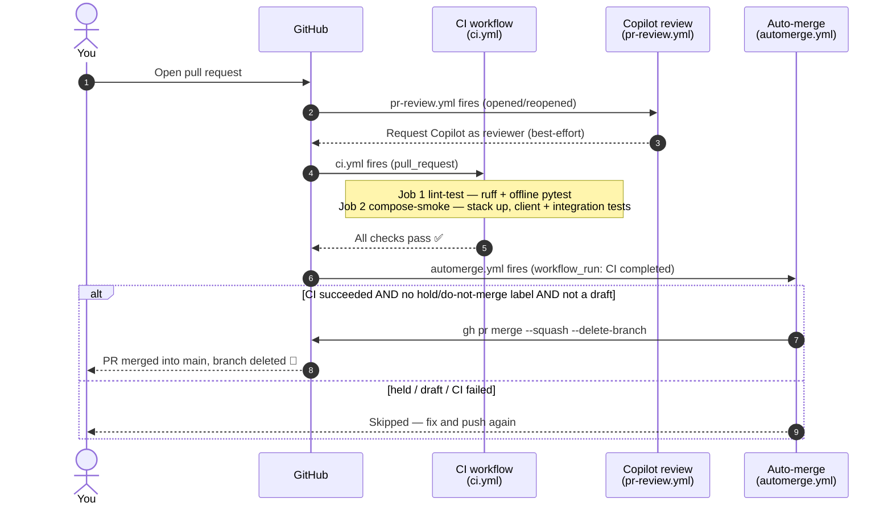

# 🤝 Contributing to `nasa-api-first-poc`

[Home](README.md) > **Contributing**

> [!WARNING]
> **Illustrative reference · sample/synthetic data only · not an official NASA
> document.** Everything in this repository — including the procurement records the demo
> queries — is **synthetic**. See **[docs/DISCLAIMER.md](docs/DISCLAIMER.md)** before
> sharing or adapting any part of it. Please keep contributions synthetic-data-safe
> (no real vendor, program, or pricing data).

> [!NOTE]
> **TL;DR — the whole loop in six lines.**
>
> ```bash
> git clone <repo> && cd nasa-api-first-poc
> cp .env.example .env                 # config (no secrets); never commit .env
> python -m venv .venv && source .venv/bin/activate
> pip install -e ".[dev]"              # host tooling: ruff + pytest + client/test deps
> git config core.hooksPath .githooks  # turn on the pre-push safety net (once per clone)
> make lint && make test               # green before you push
> ```
>
> Then branch, make a **conventional commit**, open a PR. **CI** runs, **Copilot**
> reviews, and once CI is green the PR **auto-merges** (unless you label it `hold`).
> Any Markdown you touch must ship polished — visually consistent with the rest of the docs.

---

## 📑 Contents

- [Why this guide exists](#-why-this-guide-exists)
- [Before you start: the mental model](#-before-you-start-the-mental-model)
- [Set up your dev loop](#-set-up-your-dev-loop)
- [The inner loop: lint and test](#-the-inner-loop-lint-and-test)
- [The pre-push hook (local branch protection)](#-the-pre-push-hook-local-branch-protection)
- [Conventional commits](#-conventional-commits)
- [The PR → CI → auto-merge → Copilot flow](#-the-pr--ci--auto-merge--copilot-flow)
- [Documentation style](#-documentation-style)
- [Gotchas and troubleshooting](#-gotchas-and-troubleshooting)
- [Where to next](#-where-to-next)

---

## 🎯 Why this guide exists

> **In plain terms:** this page teaches you how to make a change *land safely* in this
> repository, even if you have never used Python packaging, GitHub Actions, or git hooks
> before.

This project is a **proof-of-concept (POC)** — a small, runnable demonstration that an
enterprise pattern works end to end. Its primary story is *Azure*: deploy the stack to
Azure Government to show "the full art of the possible." The local Docker Compose stack
you will run on your laptop is the **dev/test loop** — the fast, free, offline way to
develop and validate a change before it is ever shown on Azure.

A POC lives or dies on being *reproducible*. A reviewer must be able to clone it, run two
commands, and see the demo work. That is only possible if every contributor follows the
same small set of conventions: the same dependency install, the same linter, the same
test command, the same commit style, and the same documentation polish. This guide is
that shared contract. Follow it and your change will pass [continuous integration
(**CI**)](#-the-pr--ci--auto-merge--copilot-flow) — the automated build-and-test pipeline
that runs on every pull request — on the first try.

> **Why this matters:** the enterprise narrative ("data never moves; the gateway brokers
> every call") is only credible because the repo *proves* it with tests on every change.
> Your discipline as a contributor is what keeps the proof honest.

---

## 🧠 Before you start: the mental model

You do not need to understand the whole architecture to contribute, but two facts shape
*how you work*:

1. **The repo runs as scripts, not as an installed library.** There is no importable
   `nasa_api_first_poc` package. The Python code lives in `client/`, `tools/`,
   `services/`, and `tests/`, and you run it directly (`python client/query_supply_risk.py`).
   This is spelled out in [`pyproject.toml`](pyproject.toml): `pip install -e .` installs
   only the *dependencies*, not a package. That is why you see `py-modules = []` there —
   it tells Python's packaging tools "there is no module to import, just install the deps."

2. **Two test speeds.** Most tests are *offline* and run in milliseconds. A handful are
   marked `@pytest.mark.integration` and need the full Docker Compose stack running. CI
   runs the offline tests in one job and the integration tests in a second job that first
   brings the stack up. You can run either set locally (shown [below](#-the-inner-loop-lint-and-test)).

> **In plain terms:** "offline tests" check the Python logic in isolation; "integration
> tests" check that the real services (Postgres, the gateway, etc.) talk to each other
> correctly. You can develop most changes against the offline tests alone.

If you want the bigger picture before diving in, read
[`docs/ARCHITECTURE.md`](docs/ARCHITECTURE.md) and
[`docs/ZERO-MOVE.md`](docs/ZERO-MOVE.md). They are optional for a first contribution.

---

## 🛠️ Set up your dev loop

You need three things on your machine: **Python 3.11+**, **git**, and **Docker** (only if
you plan to run the integration tests or the full demo). Everything else is installed by
the commands below.

### Step 1 — Clone and create your config file

```bash
git clone <your-fork-or-this-repo-url>
cd nasa-api-first-poc
cp .env.example .env
```

`.env.example` is the *template* for configuration — host ports, image tags, demo
credentials for the synthetic stack. It contains **no real secrets**. Copying it to
`.env` gives you a local, **git-ignored** copy you can edit freely.

> [!WARNING]
> **Never commit `.env`.** It is git-ignored on purpose, and the pre-commit
> `detect-private-key` hook will block obvious key material. The synthetic stack's demo
> tokens are issued at runtime by the local identity service — there are no long-lived
> secrets to store.

> [!TIP]
> **Local port collisions.** Some dev machines already bind ports `8000`, `8001`, `8080`,
> and `3000`. If `make up` fails with "port is already allocated," remap the host ports in
> your `.env` (the `*_PORT` variables) to free ones — the container-internal ports never
> change, so nothing else breaks.

### Step 2 — Create a virtual environment (recommended)

A *virtual environment* is an isolated Python sandbox so this project's packages do not
collide with anything else on your machine.

```bash
python -m venv .venv
source .venv/bin/activate        # Windows PowerShell: .venv\Scripts\Activate.ps1
```

### Step 3 — Install the tooling and dependencies

```bash
pip install -e ".[dev]"
```

**What this command does, piece by piece:**

| Part | Meaning |
|---|---|
| `pip install` | Install Python packages. |
| `-e` | *Editable* install — your local code is used directly, so edits take effect with no reinstall. |
| `.` | Install *this* project (reads [`pyproject.toml`](pyproject.toml)). |
| `[dev]` | Also install the **optional `dev` extras**: `ruff` (linter/formatter) and `pytest` (test runner). |

Without `[dev]` you would get only the runtime dependencies (`httpx`, `pyjwt`, `pyyaml`,
`mcp`) — enough to *run* the client, but not to *lint* or *test*. CI uses
`pip install -e ".[dev]"` for exactly this reason (see
[`.github/workflows/ci.yml`](.github/workflows/ci.yml)), so installing the same thing
locally means you reproduce CI's environment.

> [!NOTE]
> Each containerized service pins its own dependencies in `services/*/requirements.txt`.
> The host-level `pip install` above is only what the **client, tools, tests, and the MCP
> smoke test** need to run on your machine — not what runs inside the Docker images.

### Step 4 — Turn on the pre-push hook (once per clone)

```bash
git config core.hooksPath .githooks
```

This is a one-time setup that activates the local safety net described
[below](#-the-pre-push-hook-local-branch-protection). Do it now so it is in place before
your first push.

### Step 5 — (Optional) install pre-commit

If you want the formatter and basic file checks to run automatically *as you commit*:

```bash
pip install pre-commit
pre-commit install
```

This wires up [`.pre-commit-config.yaml`](.pre-commit-config.yaml), which runs `ruff`
(with `--fix`), `ruff-format`, and a few hygiene checks (`end-of-file-fixer`,
`trailing-whitespace`, `check-yaml`, `check-json`, large-file and private-key guards) on
the files in each commit. It is optional but saves round-trips with CI.

---

## 🔁 The inner loop: lint and test

Two commands gate every change. Run them before you push; CI runs the same checks.

### Lint and format

```bash
make lint
```

This runs, in order:

```bash
ruff format --check .   # fail if any file is not auto-formatted
ruff check .            # fail on lint errors (unused imports, bad sorting, etc.)
```

**[`ruff`](https://docs.astral.sh/ruff/)** is a fast Python linter *and* formatter. The
`--check` flag means "tell me if anything is mis-formatted, but do not change it" — that
is what CI does. To actually *fix* formatting locally, run `ruff format .` (no `--check`).

The rules live in [`pyproject.toml`](pyproject.toml) under `[tool.ruff]`: line length
100, target Python 3.11, and the rule sets `E, F, I, UP, B, C4` (pycodestyle, pyflakes,
import-sorting, pyupgrade, bugbear, comprehensions). The `frontend`, `infra`, and
`databricks` directories are excluded from Ruff.

**Expected output when clean:**

```text
ruff format --check .
3 files would be left unchanged
ruff check .
All checks passed!
```

If `ruff check` reports a fixable issue, run `ruff check --fix .` and re-run `make lint`.

### Tests

```bash
make test
```

This runs `python -m pytest -q` (the `-q` is "quiet" — concise output). By default it runs
the **offline** suite and *skips* the integration tests, because those need the live
stack. Test discovery is configured in [`pyproject.toml`](pyproject.toml)
(`testpaths = ["tests"]`).

**Expected output (offline run):**

```text
........................                                          [100%]
24 passed in 1.42s
```

To run the **integration** tests — the ones that exercise the real services — bring the
stack up first, then select that marker:

```bash
make up                       # docker compose --profile core up -d + wait-for-healthy
pytest -q -m integration      # run ONLY the @pytest.mark.integration tests
make down                     # tear down + remove volumes when finished
```

The `integration` marker is registered in [`pyproject.toml`](pyproject.toml), and CI runs
this exact `pytest -q -m integration` step in its `compose-smoke` job after the stack is
healthy. The test files themselves live in
[`tests/`](tests/) — e.g. [`test_zero_move.py`](tests/test_zero_move.py) proves Postgres
and DAB are unreachable from the client network, and
[`test_gateway_auth.py`](tests/test_gateway_auth.py) proves no-token → 401, valid → 200,
over-limit → 429.

> **Why this matters:** the integration tests are the machine-checked version of the demo
> promise. If they pass, the "zero-move, gateway-brokered" claim is *true*, not just
> documented.

---

## 🪝 The pre-push hook (local branch protection)

> **In plain terms:** a *git hook* is a script git runs automatically at a certain moment.
> A *pre-push* hook runs right before `git push` actually sends commits to GitHub, and can
> refuse the push if something looks wrong.

This repo ships [`.githooks/pre-push`](.githooks/pre-push) and asks you to point git at it
with `git config core.hooksPath .githooks` (Step 4 above). Once enabled, it refuses two
dangerous operations against the protected branches (`main` / `master`):

- **Deleting** the protected branch.
- **Force-pushing** (a non-fast-forward push) to it, which would rewrite shared history.

**Why a hook instead of GitHub branch protection?** GitHub requires a paid plan (Pro) to
enable server-side branch-protection rules on a **private** repository. This hook is the
client-side stand-in: it enforces the essentials from *your* machine.

**Worked example — the hook doing its job:**

```bash
$ git push --force origin main
pre-push: BLOCKED — refusing non-fast-forward (force) push to 'main'.
          Open a PR, or bypass deliberately with: git -c core.hooksPath= push
error: failed to push some refs to '...'
```

The push was stopped *before* anything reached GitHub. The intended workflow is: branch,
push the branch, open a PR — never push straight to `main`.

> [!TIP]
> **Bypass (rare, deliberate).** If you genuinely must override it:
> `git -c core.hooksPath= push ...` or `git push --no-verify`. Use this only when you
> know exactly why. The hook is client-side only — it guards *your* machine, not the
> server.

---

## 📝 Conventional commits

Commits in this repo follow **[Conventional Commits](https://www.conventionalcommits.org/)**:
a short, structured prefix that says *what kind* of change this is. The format is:

```text
<type>(<optional scope>): <short imperative summary>
```

**Why:** machine-readable commit history. The project's build process commits
*per phase* with these prefixes, [Dependabot](.github/dependabot.yml) already raises its
PRs with `chore(deps)` / `chore(ci)` prefixes, and a consistent history makes changelogs
and `git log` skimming trivial.

| Type | Use it for | Example |
|---|---|---|
| `feat` | A new capability | `feat(catalog): add classification to product entry` |
| `fix` | A bug fix | `fix(gateway): correct rate-limit window to per-minute` |
| `docs` | Docs only | `docs(zero-move): clarify network isolation diagram` |
| `chore` | Tooling / deps / housekeeping | `chore(deps): bump httpx to 0.27.2` |
| `test` | Tests only | `test(auth): add 429 over-limit assertion` |
| `refactor` | Behavior-preserving code change | `refactor(seeder): extract CSV loader` |
| `ci` | CI/workflow config | `ci: cache pip in lint-test job` |

**Worked example:**

```bash
git commit -m "feat(client): print gateway correlation id in the supply-risk answer"
```

Keep the summary in the imperative mood ("add", not "added"), under ~72 characters, and
put any longer rationale in the commit body.

---

## 🚦 The PR → CI → auto-merge → Copilot flow

Here is what happens from the moment you open a pull request. All of it is wired in
[`.github/workflows/`](.github/workflows/).



### 1. You open a PR

Push your branch and open a pull request against `main`. (The pre-push hook keeps you from
pushing to `main` directly, so a PR is the path.)

### 2. Copilot is asked to review — [`pr-review.yml`](.github/workflows/pr-review.yml)

On `opened` / `ready_for_review` / `reopened` (and only for non-draft PRs), the workflow
requests **GitHub Copilot** as a code reviewer. This is **best-effort**: if Copilot is not
enabled for the repo, the step prints a notice and does nothing — it never fails the build.
You can always request it manually via *PR → Reviewers → Copilot*.

### 3. CI runs — [`ci.yml`](.github/workflows/ci.yml)

CI runs on every `pull_request` (and on pushes to `main`) and has **two jobs**:

| Job | What it does |
|---|---|
| **`lint-test`** | `pip install -e ".[dev]"` → `ruff format --check .` → `ruff check .` → `pytest -q` (offline tests; integration tests skip without the stack). |
| **`compose-smoke`** | `cp .env.example .env` → `docker compose --profile core up -d --build` → `wait-for-healthy.sh` → run `client/query_supply_risk.py` and assert it returned rows **and** carried a `correlation-id=` (proof it went through Kong) → `pytest -q -m integration` → tear down. |

> **Why this matters:** `compose-smoke` is CI literally *running the demo*. If your change
> breaks the end-to-end "answer the mission question through the gateway" path, CI catches
> it before a reviewer ever looks.

### 4. CI is green → the PR auto-merges — [`automerge.yml`](.github/workflows/automerge.yml)

This workflow triggers on `workflow_run` — that is, **after the CI workflow completes** —
and only when CI's conclusion was `success` and it ran for a pull request. It then
squash-merges the PR and deletes the branch, **unless**:

- the PR carries a **`hold`** or **`do-not-merge`** label, or
- the PR is a **draft**.

> [!IMPORTANT]
> **Auto-merge is the gate.** Because branch protection with required status checks needs
> a paid plan on private repos, this workflow *is* the merge gate — it runs only after CI
> succeeds. If you are not ready for your PR to land the moment CI goes green, **open it as
> a draft** or add the **`hold`** label. Remove the label / mark ready when you want it to
> merge.

[Dependabot](.github/dependabot.yml) relies on exactly this: it opens weekly dependency
PRs, CI runs, and the green ones auto-merge with no clicks.

### 5. (Reference only) Azure deploy — [`deploy.yml`](.github/workflows/deploy.yml)

There is also a `deploy-azure` workflow, but it is **manual dispatch only**
(`workflow_dispatch`) and never runs on push or PR, so it can never deploy unexpectedly.
It exists to demonstrate the Azure Container Apps / APIM deployment path and requires
pre-wired Azure OIDC secrets. You will not touch it for a normal contribution.

---

## 📐 Documentation style

> [!WARNING]
> **Every Markdown change in this repo must ship polished and visually consistent with
> the rest of the docs.** This is a hard project rule — not a suggestion.

Whenever you create or substantially edit *any* Markdown file — `README.md`, anything
under `docs/`, `data/README.md`, a service `README.md`, this file, etc. — format it so the
docs stay visually consistent across the repo. That means:

- icon / emoji section markers and badges where useful;
- **mermaid** diagrams for flows, architecture, and sequences;
- tables for comparisons and structured data;
- callouts / admonitions (`> [!NOTE]`, `> [!TIP]`, `> [!WARNING]`) for asides;
- a table of contents for longer documents;
- consistent headings, spacing, and link hygiene; and
- a correct breadcrumb at the top for the file's location.

Two non-negotiables beyond formatting:

1. **Accuracy.** Docs must reflect the *actual* codebase, architecture, and deployment
   state. If you change behavior, update the docs that describe it in the same PR. When in
   doubt, verify against the code rather than guessing.
2. **The synthetic-data disclaimer** must stay present where relevant (see
   [`docs/DISCLAIMER.md`](docs/DISCLAIMER.md)). Never imply the data is real.

> **In plain terms:** if your diff includes a `.md` file and you did not polish it,
> the change is not ready. A reviewer (human or Copilot) will send it back.

---

## 🧯 Gotchas and troubleshooting

| Symptom | Likely cause | Fix |
|---|---|---|
| `ruff format --check .` fails in CI but you "didn't touch formatting" | A file is not auto-formatted | Run `ruff format .` locally, commit, push. |
| `make test` shows tests *skipped* | Those are `integration` tests; the stack is not up | That is expected offline. To run them: `make up && pytest -q -m integration`. |
| `pytest -m integration` errors with connection refused | Stack not healthy yet, or ports remapped | Run `make up` and wait for `wait-for-healthy.sh`; check your `.env` port overrides. |
| `make up` → "port is already allocated" | Local port collision (`8000/8001/8080/3000`) | Remap the `*_PORT` vars in `.env` to free ports. |
| `git push` blocked by `pre-push` | You are force-pushing or deleting `main`/`master` | Push a branch and open a PR instead. |
| PR went green but did **not** merge | It is a draft, or has a `hold`/`do-not-merge` label | Mark it ready / remove the label. |
| Copilot review never appeared | Copilot not enabled for the repo (best-effort step) | Request manually: *PR → Reviewers → Copilot*. |
| `pip install -e ".[dev]"` can't find a package | Wrong Python or no virtualenv active | Use Python 3.11+, activate `.venv`, retry. |
| A reviewer flagged your `.md` as "not polished" | Skipped the documentation-style rule | Polish the file to match the rest of the docs, re-push. |

---

## 🧭 Where to next

- **[`README.md`](README.md)** — the project's one-paragraph frame and 60-second quickstart.
- **[`PRP.md`](PRP.md)** — the complete, self-contained build spec (mission, phases,
  per-file contracts, Definition of Done).
- **[`docs/ARCHITECTURE.md`](docs/ARCHITECTURE.md)** — components, data flow, and the
  Azure ↔ OSS mapping (Kong → API Management, identity issuer → Entra ID, DAB → Container
  Apps, Prometheus/Grafana → Azure Monitor).
- **[`docs/ZERO-MOVE.md`](docs/ZERO-MOVE.md)** — how the "data never moves" claim is
  *proven* by [`tests/test_zero_move.py`](tests/test_zero_move.py).
- **[`docs/DEMO-SCRIPT.md`](docs/DEMO-SCRIPT.md)** — the ~10-minute live demo a presenter
  follows.
- **[`docs/AZURE-DEPLOYMENT.md`](docs/AZURE-DEPLOYMENT.md)** — the managed Azure-Government
  target the local stack maps onto.
- **[`docs/DISCLAIMER.md`](docs/DISCLAIMER.md)** — the synthetic-data notice (read it
  before sharing anything).

> Thank you for contributing. Keep the loop green, keep the docs beautiful, and keep the
> data synthetic.
