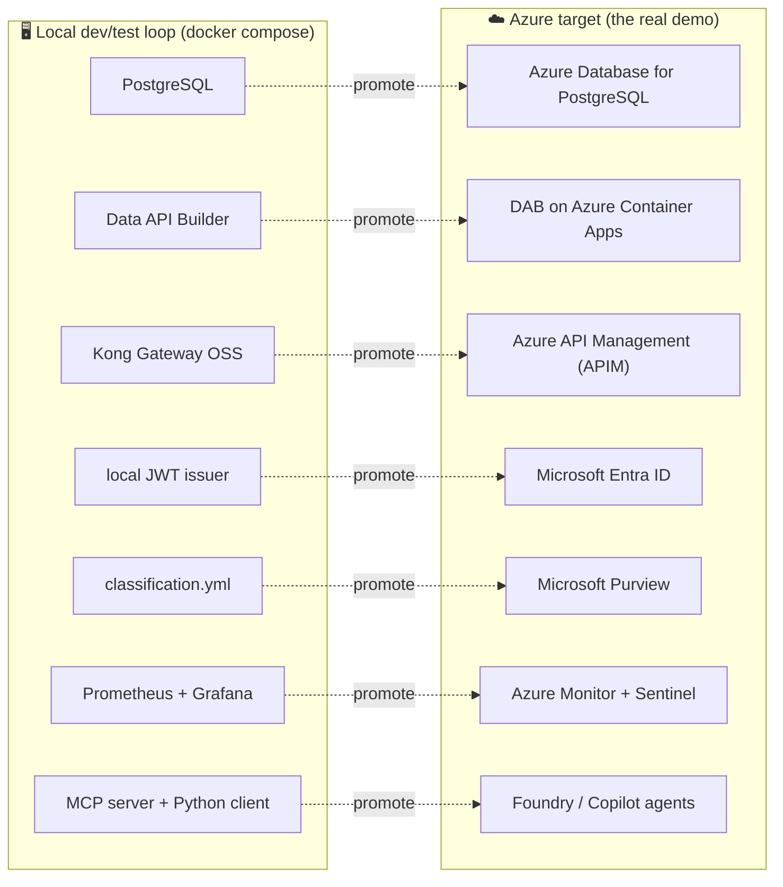
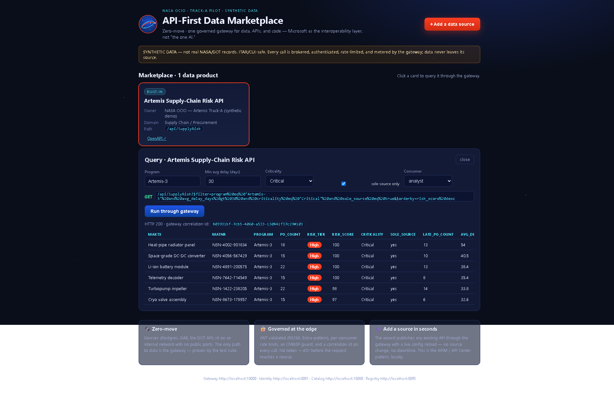
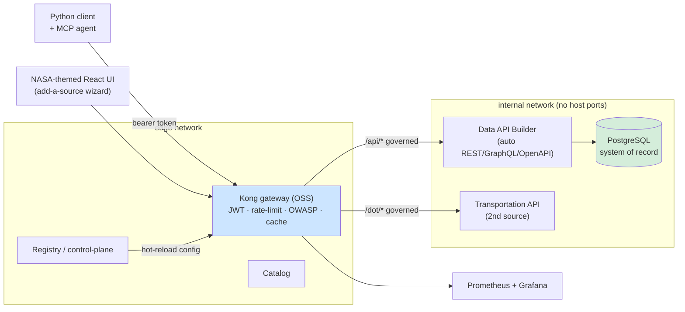

# nasa-api-first-poc

> **One platform for data, APIs, and code — Microsoft as the secure interoperability
> layer, not "the one AI."** An enterprise proof-of-concept (POC) of the API-first,
> **zero-move** data-marketplace pattern: keep mission data in its system of record,
> put a governed API gateway in front of it, make the data product discoverable, and
> let people *and* AI agents answer real questions **through the gateway** — with a
> documented, one-swap path to the **Azure / Azure-Government** managed equivalents.


-orange)


> [!IMPORTANT]
> ### 👉 New here? **Start with the Teaching Manual → [`docs/README.md`](docs/README.md)**
> The manual is the front door. It gives you a one-paragraph orientation and **four
> guided learning paths** — for an **executive**, an **architect**, a **first-time
> developer**, and a **demo presenter** — each an ordered "start here → next → next"
> reading list. If you have never used an API gateway, JWT, Data API Builder, or
> Azure, read the **[Concept primers](docs/concepts/README.md)** first; every term is
> also defined in the **[Glossary](docs/GLOSSARY.md)**.

---

> [!NOTE]
> ## TL;DR
> This is an **enterprise POC whose primary story is Azure** — *"here is the full art
> of the possible when you deploy this to the cloud."* You **deploy it to Azure** to
> demo it for real; you **run it locally with `docker compose`** as the develop-and-test
> loop. Every open-source piece you run on a laptop is a faithful stand-in for an Azure
> managed service, so promoting the POC to Azure is a **swap, not a rewrite**.
>
> - **Run the dev loop now:** `cp .env.example .env && pip install -e . && make demo`
>   brings the whole stack up healthy and prints the Artemis-3 supply-risk answer
>   sourced *through the gateway* (with a correlation id).
> - **Deploy the real demo to Azure:** see **[AZURE-LIVE-DEPLOYMENT.md](docs/AZURE-LIVE-DEPLOYMENT.md)**
>   (live Container Apps + Entra) and **[APIM-EDITION.md](docs/APIM-EDITION.md)** (managed
>   Azure API Management).
> - **The complete build spec** is in **[`PRP.md`](PRP.md)**.

> [!WARNING]
> **Synthetic data only — not real NASA data.** Every vendor, material, and figure is
> generated by a seeded script and is ITAR/CUI-safe. See [`docs/DISCLAIMER.md`](docs/DISCLAIMER.md).


---

## 📑 Table of Contents

- [Why this exists (the enterprise story)](#-why-this-exists-the-enterprise-story)
- [Azure-first: deploy for the real demo](#️-azure-first-deploy-for-the-real-demo)
- [What it demonstrates](#-what-it-demonstrates)
- [Architecture at a glance (Azure → local mapping)](#️-architecture-at-a-glance-azure--local-mapping)
- [The local dev/test loop (Quickstart)](#-the-local-devtest-loop-quickstart)
- [Repo layout](#-repo-layout)
- [Where to go next (learning paths)](#-where-to-go-next-learning-paths)
- [How it maps to Azure Government](#-how-it-maps-to-azure-government)
- [Constraints](#️-constraints-enforced-see-prpmd-9)
- [Software assurance](#️-software-assurance-github-native)
- [Local branch protection](#️-local-branch-protection)
- [License](#-license)

---

## 🛰️ Why this exists (the enterprise story)

Large organizations sit on valuable data locked inside **systems of record (SoR)** —
the databases that *run* the business and that nobody is allowed to copy carelessly.
The moment you copy that data somewhere "to make it usable," you create three problems:
a second copy to secure, a second access control to govern, and a freshness gap to keep
in sync. Multiply that across an enterprise and compliance can no longer reason about
where the data is or who can see it.

**The API-first, zero-move pattern solves this by never moving the data.** Instead of
copying the database, you put a thin, governed *door* in front of it: the data stays in
its SoR, a tool auto-generates a web API over it, an API gateway enforces who may call
and how often, a catalog makes the data product discoverable, and consumers — a script
or an **AI agent** — answer real questions by calling *through the gateway*, never the
database.

> **In plain terms:** the data never leaves home. Everyone knocks on the same front
> door, the door checks their ID, and the door keeps the visitor log. That door is the
> gateway.

> **Why this matters:** for the federal mission-data marketplace this POC models,
> "zero-move" is not a slogan — it is the difference between a defensible, auditable,
> single-source-of-truth architecture and a sprawl of copies. This repo **proves**
> zero-move with an automated test (`tests/test_zero_move.py`), not just a diagram.
> See [`docs/ZERO-MOVE.md`](docs/ZERO-MOVE.md).

---

## ☁️ Azure-first: deploy for the real demo

This is an **enterprise POC**, and its headline is *"deploy to Azure to show the full
art of the possible."* The local Docker stack exists so engineers can build and test on
a laptop at zero cloud cost — but the real demo, and the real architecture, is the
**Azure** column on the right. Each local open-source component is the faithful analogue
of an Azure managed service, so the architecture is identical and promotion is a *swap*.



The reference infrastructure-as-code is under [`infra/azure/`](infra/azure/) (Bicep),
the **live** deploy is documented in [`docs/AZURE-LIVE-DEPLOYMENT.md`](docs/AZURE-LIVE-DEPLOYMENT.md),
and the managed-gateway edition (APIM + Developer Portal) is in
[`docs/APIM-EDITION.md`](docs/APIM-EDITION.md). The full Azure-Government posture —
FedRAMP High, and the one place the managed Databricks/Unity-Catalog gap applies — is in
[`docs/AZURE-DEPLOYMENT.md`](docs/AZURE-DEPLOYMENT.md).

> [!TIP]
> **CI never needs an Azure subscription.** The Azure assets are reference Bicep + docs;
> the laptop dev loop and the test suite run entirely locally.

---

## ✨ What it demonstrates

1. **Zero data movement** — the system-of-record data never leaves its database; the
   gateway brokers every call. *Azure: same SoR (Azure Database for PostgreSQL), same
   guarantee.*
2. **Auto-generated API over the system of record** — REST + GraphQL + OpenAPI without
   hand-writing an API (the **Microsoft Data API Builder** pattern). *Azure: DAB on
   Container Apps, identical config.*
3. **A governed gateway in front** — an OSS gateway (**Kong**) that authenticates
   (JWT/OAuth2), rate-limits, and meters per-consumer. *Azure: Azure API Management.*
4. **A discoverable catalog** — the API + its OpenAPI contract, owner, classification,
   and request path, findable without tribal knowledge. *Azure: APIM Developer Portal /
   API Center.*
5. **A consumer answers a real question through the gateway** — *"which Critical,
   sole-source materials on Artemis-3 are slipping > 30 days?"* — via a Python client
   **and** an **MCP** tool an agent can call. *Azure: Foundry / Copilot agents over MCP.*
6. **Observability** — per-consumer call/latency metrics on a Grafana dashboard.
   *Azure: Azure Monitor + Microsoft Sentinel.*
7. **Multi-source federation + onboarding wizard** — a NASA-themed marketplace UI with
   an "add a data source" wizard that publishes an existing API (e.g. a Transportation
   /DOT Data API Builder endpoint) through the same gateway **live, with no restart** —
   driven by the `registry` control-plane service. *Azure: API Management / API Center.*
   See [`docs/ADD-A-SOURCE.md`](docs/ADD-A-SOURCE.md).
8. **Lakehouse path (Databricks)** — a zero-move medallion notebook consumes a data
   product, lands Bronze→Silver→Gold **Delta in Unity Catalog**, and serves a Databricks
   SQL → **Power BI** report. See [`docs/DATABRICKS-WALKTHROUGH.md`](docs/DATABRICKS-WALKTHROUGH.md)
   + [`docs/POWERBI-GUIDE.md`](docs/POWERBI-GUIDE.md).
9. **Live in Azure** — the full stack deployed to Container Apps over Azure Postgres,
   with a **public landing page + Microsoft (Entra) sign-in** (deferred auth — no
   auto-redirect). See [`docs/AZURE-LIVE-DEPLOYMENT.md`](docs/AZURE-LIVE-DEPLOYMENT.md).
10. **A grounded AI agent over MCP** — an in-UI chat agent that answers supply-chain
    questions **only** from the governed data product: it calls the MCP server's tools
    (which reach data only through the gateway), **cites its source** (MCP tool + gateway
    correlation id), renders cards/charts in-chat, and sass-refuses off-topic questions.
    The "AI grounded on governed data over the open MCP standard" story. *Azure: the same
    tools a Foundry / Copilot agent would call.* See [`docs/concepts/07-mcp-and-agents.md`](docs/concepts/07-mcp-and-agents.md).
11. **Drill-down detail via nested calls** — click any result row to compose a full
    product record (Material → SupplyRisk → PurchaseOrder → Vendor) through several
    governed gateway calls, with the cost fields **redacted at the gateway**.

### NASA-themed marketplace UI

The browser UI (`make ui`) opens on a **public landing page** (sign in with Microsoft or
explore), lists each data product, runs the mission query **through the gateway** —
showing the HTTP status, gateway correlation id, and ranked high-risk parts — and lets you
**click a row to drill in** or **ask the grounded mission agent** (synthetic data):



---

## 🏗️ Architecture at a glance (Azure → local mapping)

Read the **Azure** column as the real target; the POC builds the **local** column as its
open-source analogue, so the same architecture deploys to Azure by swapping the gateway,
catalog, and identity for their managed equivalents. The deepest treatment is in
[`docs/ARCHITECTURE.md`](docs/ARCHITECTURE.md) and [`PRP.md`](PRP.md) §2.



| Azure target (the real demo) | POC local analogue (what you run) |
|---|---|
| System of record (SAP procurement) | PostgreSQL (synthetic SAP-shaped tables) |
| Expose data as an API (no code) | **Microsoft Data API Builder** over Postgres |
| Azure API Management | **Kong Gateway OSS** (DB-less) |
| Microsoft Entra ID | local OIDC/JWT issuer |
| Enterprise API catalog | FastAPI catalog service |
| API Center / control-plane (live publish) | `registry` service (hot-reloads Kong config) |
| Microsoft Purview (classify) | `data/classification.yml` applied at seed |
| Foundry/Copilot agent (MCP) | local MCP server + Python client |
| Azure Monitor / Sentinel | Prometheus + Grafana |

> [!NOTE]
> **Data platform note.** For the federal customer this POC models, the managed data
> platform (Azure Databricks with managed Unity Catalog + Databricks SQL + Delta Lake
> + Delta Sharing on ADLS Gen2) runs in **commercial Azure at FedRAMP High** — the
> open-source-rooted formats keep it divestable. **Microsoft Fabric / OneLake are
> excluded** (not in Azure Gov/GCC). Details in [`docs/AZURE-DEPLOYMENT.md`](docs/AZURE-DEPLOYMENT.md).

---

## 🚀 The local dev/test loop (Quickstart)

> [!NOTE]
> This is the **develop-and-test loop**, not the headline. Run it to build and verify on
> a laptop; deploy to **Azure** (above) for the real demo. Requires only **Docker** +
> **Python 3.11+** on the host.

```bash
cp .env.example .env
pip install -e .          # host deps for the client + tests (httpx, pyjwt, pyyaml, mcp)
make demo                 # up → wait-for-healthy → seed → client → MCP smoke → answer
```

`make demo` brings the whole stack up, seeds the synthetic Artemis data, and prints the
supply-risk answer sourced **through the gateway** with a gateway **correlation id**
(your proof the data never left Postgres). Other targets:

```bash
make test        # full suite incl. zero-move / auth (401/200/429) / discovery
make obs         # Prometheus + Grafana (per-consumer dashboard at :3000)
make ui          # optional browser catalog UI (Vite SPA at :5173)
make pricing     # live, dated Azure Retail Prices for the managed-target services
make diagram     # re-render docs/architecture.png
make down        # stop + remove volumes
```

The **catalog UI** (`make ui`, then <http://localhost:5173>) lists the data product,
shows its OpenAPI paths + classification, and runs the supply-risk query through Kong
from the browser — displaying the gateway correlation id with each answer.

> [!WARNING]
> **Port collisions are the #1 first-run snag.** The demo publishes Kong on `:8000`,
> Kong Admin on `:8001`, Kong Manager on `:8002`, catalog on `:8080`, identity on
> `:8081`, MCP on `:8090`, registry on `:8095`, the UI on `:5173`, Prometheus on
> `:9090`, and Grafana on `:3000`. If any collide on your machine, override in `.env`
> (e.g. `KONG_PROXY_PORT=18000`) and re-run. Full troubleshooting is in
> [`docs/LOCAL-DEV.md`](docs/LOCAL-DEV.md).

---

## 📁 Repo layout

```text
PRP.md                  # the complete build spec — read this first
.githooks/              # pre-push guard (block force-push/delete of main) — see note below
data/                   # synthetic Artemis generator + classification manifest
docs/                   # the Teaching Manual: README (learning paths) + concepts/ primers
                        #   + GLOSSARY + ARCHITECTURE / ZERO-MOVE / SECURITY / DEMO-* /
                        #   ADD-A-SOURCE / GRAPHQL / AZURE-* / APIM-* / DATABRICKS / POWERBI
services/               # seeder · dab · gateway(kong) · identity · catalog · registry · mcp · transportation
frontend/               # NASA-themed marketplace UI + onboarding wizard (Vite/React)
databricks/             # zero-move medallion notebook + Databricks SQL (Unity Catalog → Power BI)
client/                 # Python CLI that queries the gateway
tools/                  # azure_pricing.py (live Azure Retail Prices helper)
observability/          # prometheus + grafana
infra/azure/            # Bicep + Azure-Gov deployment reference (not required to run)
scripts/                # demo.sh, wait-for-healthy.sh, azure-deploy-*.sh, gen-architecture-diagram.py
tests/                  # zero-move / gateway-auth / discovery / supply-risk / no-fabric
```

---

## 🧭 Where to go next (learning paths)

The **[Teaching Manual home](docs/README.md)** routes you by role. In short:

| You are a… | Start here | Then |
|---|---|---|
| 🧭 **Executive / decision-maker** | [`docs/README.md`](docs/README.md) → Path 1 | [ARCHITECTURE](docs/ARCHITECTURE.md) → [AZURE-DEPLOYMENT](docs/AZURE-DEPLOYMENT.md) → [APIM-CAPABILITIES](docs/APIM-CAPABILITIES.md) → `make pricing` |
| 🏛️ **Architect** | [`docs/README.md`](docs/README.md) → Path 2 | [ARCHITECTURE](docs/ARCHITECTURE.md) → [ZERO-MOVE](docs/ZERO-MOVE.md) → [SECURITY](docs/SECURITY.md) → [AZURE-LIVE-DEPLOYMENT](docs/AZURE-LIVE-DEPLOYMENT.md) |
| 💻 **First-time developer** | [Concept primers](docs/concepts/README.md), then the [Quickstart](#-the-local-devtest-loop-quickstart) | [LOCAL-DEV](docs/LOCAL-DEV.md) → service READMEs in data-flow order |
| 🎬 **Demo presenter** | [DEMO-SCRIPT](docs/DEMO-SCRIPT.md) (~10 min local) | [DEMO-DAY](docs/DEMO-DAY.md) → [DEMO-COMPLETE](docs/DEMO-COMPLETE.md) |

> [!TIP]
> New to API gateways, JWT, Data API Builder, or Azure? Read the
> **[Concept primers](docs/concepts/README.md)** first — each teaches one idea
> why-then-what, then run the demo. Every acronym is in the
> **[Glossary](docs/GLOSSARY.md)**.

---

## 🌐 How it maps to Azure Government

The local stack is the OSS analogue of the managed Azure-Gov target; promote it by
swapping each component (Kong → API Management, the issuer → Microsoft Entra ID, DAB →
DAB on Container Apps / Dataverse, `classification.yml` → Microsoft Purview,
Prometheus/Grafana → Azure Monitor). Reference Bicep is under [`infra/azure/`](infra/azure/);
the full discussion (FedRAMP High, the Azure-Gov managed-Unity-Catalog caveat) is in
[`docs/AZURE-DEPLOYMENT.md`](docs/AZURE-DEPLOYMENT.md). The complete build spec is
[`PRP.md`](PRP.md); the live demo walkthrough is [`docs/DEMO-SCRIPT.md`](docs/DEMO-SCRIPT.md).

---

## ⚠️ Constraints (enforced; see [`PRP.md`](PRP.md) §9)

- No Microsoft Fabric / OneLake as a component (not in Azure Gov/GCC).
- Zero-move is real, not just claimed (Postgres/DAB network-isolated from clients).
- Azure prices are pulled **live** from the Azure Retail Prices API with a dated source
  note — never hardcoded or invented. No staffing/services dollar figures.
- All data is **synthetic** and clearly flagged. ITAR/CUI-safe.

---

## 🛡️ Software assurance (GitHub-native)

Beyond the *application* security model ([`SECURITY.md`](SECURITY.md)), the repo secures
its **software supply chain** with GitHub's built-in stack and maps every control to
**NIST SSDF · SLSA · EO 14028 · CISA Secure by Design**. Full detail —
**[`docs/SOFTWARE-ASSURANCE.md`](docs/SOFTWARE-ASSURANCE.md)**.

| Surface | Capability |
|---|---|
| **Code** | CodeQL SAST (`security-extended`) + Copilot Autofix |
| **Dependencies** | Dependabot + Dependency Review PR gate |
| **Build / artifacts** | Trivy (deps · IaC · secrets), SPDX **SBOM**, **SLSA** build provenance |
| **Pipeline** | Least-privilege tokens, zizmor workflow SAST, OpenSSF Scorecard |
| **Governance** | CODEOWNERS, signed-commit branch ruleset, PR security checklist, private vuln reporting |

All findings surface in the repository's **Security** tab. A one-time
[enablement checklist](docs/SOFTWARE-ASSURANCE.md#-one-time-enablement-checklist) covers
the settings-based pieces (secret scanning, push protection, Copilot Autofix). For a
file-by-file tour and a 5-minute demo script, see
**[`docs/GITHUB-FEATURES.md`](docs/GITHUB-FEATURES.md)**.

---

## 🛡️ Local branch protection

GitHub server-side branch protection needs GitHub Pro on a private repo, so this repo
ships a **client-side pre-push guard** that refuses to **force-push** or **delete**
`main`. Enable it once per clone:

```bash
git config core.hooksPath .githooks
```

> [!NOTE]
> Client-side only (guards pushes from your machine). Bypass deliberately with
> `git -c core.hooksPath= push`. For server-enforced protection, import the ready-made
> ruleset in [`.github/rulesets/`](.github/rulesets/) (PR-only, required checks, Code Owner
> review, signed commits, linear history).

---

## 📄 License

MIT — see [`LICENSE`](LICENSE).
</content>
</invoke>
