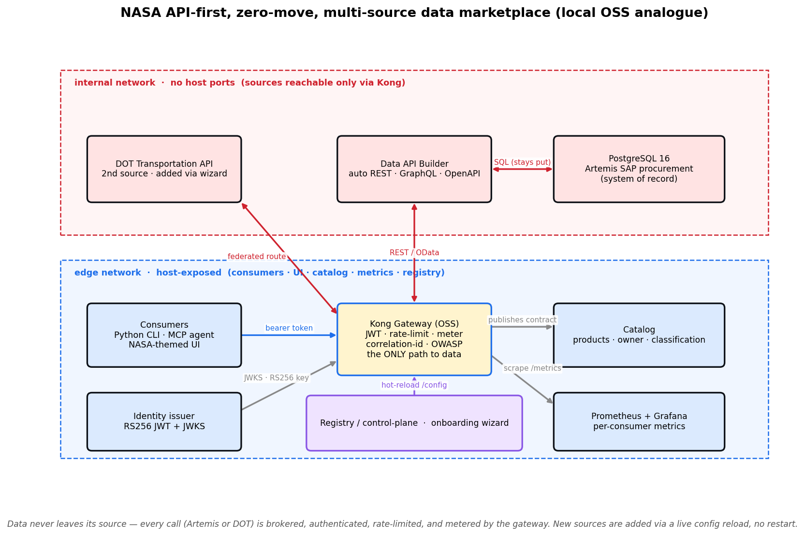
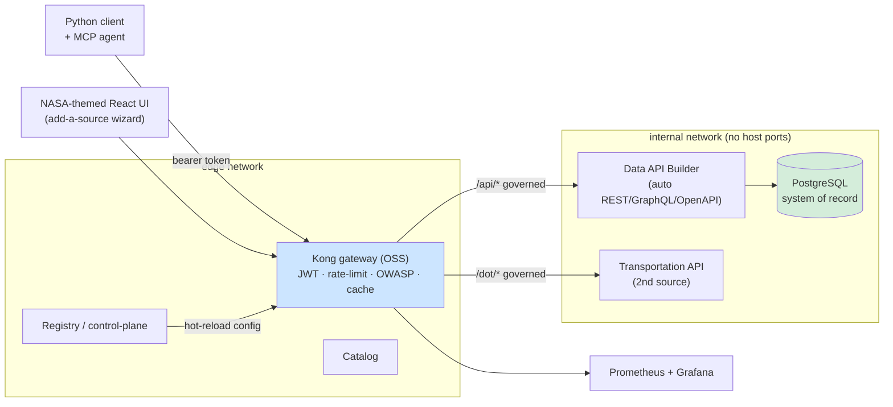

# nasa-api-first-poc

> **One platform for data, APIs, and code — Microsoft as the secure interoperability
> layer, not "the one AI."** A fully local, `docker compose up` proof-of-concept of
> the API-first, **zero-move** data-marketplace pattern, proven on a synthetic
> **Artemis supply-chain (SAP procurement)** dataset.

This repo is the runnable evidence behind the Microsoft → NASA OCIO API-first
white-paper set: mission data stays in its system of record, an open-source gateway
governs an auto-generated API in front of it, the data product is discoverable in a
catalog, and an agent answers a real supply-chain question **through the gateway** —
with a documented, one-swap path to the Azure-Government managed equivalents.

> **Status: implemented + runnable.** `cp .env.example .env && make demo` brings the
> whole stack up healthy and prints the Artemis-3 supply-risk answer sourced through the
> gateway (with a correlation id). The complete build spec is in `PRP.md`; the program
> narrative is in `docs/whitepapers/`.



---

## 📑 Table of Contents

- [What it demonstrates](#-what-it-demonstrates)
- [Architecture at a glance (Azure → local mapping)](#️-architecture-at-a-glance-azure--local-mapping)
- [Quickstart](#-quickstart)
- [Repo layout](#-repo-layout)
- [How it maps to Azure Government](#-how-it-maps-to-azure-government)
- [Constraints](#️-constraints-enforced-see-claudemd--prpmd-9)
- [License](#-license)

---

## ✨ What it demonstrates

1. **Zero data movement** — the system-of-record data never leaves its database; the
   gateway brokers every call.
2. **Auto-generated API over the system of record** — REST + GraphQL + OpenAPI
   without hand-writing an API (the Microsoft Data API Builder pattern).
3. **A governed gateway in front** — an OSS gateway (Kong) that authenticates
   (JWT/OAuth2), rate-limits, and meters per-consumer — the Azure-API-Management
   pattern in its open-source analogue.
4. **A discoverable catalog** — the API + its OpenAPI contract, owner, classification,
   and request path, findable without tribal knowledge.
5. **A consumer answers a real question through the gateway** — "which Critical,
   sole-source materials on Artemis-3 are slipping > 30 days?" — via a Python client
   **and** an MCP tool an agent can call.
6. **Observability** — per-consumer call/latency metrics on a Grafana dashboard.
7. **Multi-source federation + onboarding wizard** — a NASA-themed marketplace UI with
   an "add a data source" wizard that publishes an existing API (e.g. a DOT
   Data API Builder endpoint) through the same gateway **live, with no restart** — the
   API-Management / API-Center pattern. See `docs/ADD-A-SOURCE.md`.
8. **Lakehouse path (Databricks)** — a zero-move medallion notebook consumes a data
   product, lands Bronze→Silver→Gold **Delta in Unity Catalog**, and serves a Databricks
   SQL → **Power BI** report. See `docs/DATABRICKS-WALKTHROUGH.md` + `docs/POWERBI-GUIDE.md`.
9. **Live in Azure** — the auto-API deployed to Container Apps over Azure Postgres,
   tenant-locked with Entra (the DOT pattern). See `docs/AZURE-LIVE-DEPLOYMENT.md`.

---

## 🏗️ Architecture at a glance (Azure → local mapping)

The POC builds the local/open analogue of each Azure-Government target service, so
the same architecture deploys to Azure later by swapping the gateway, catalog, and
identity for their managed equivalents. Full table in `PRP.md` §2 and
`docs/ARCHITECTURE.md`.



| Azure target | POC local analogue |
|---|---|
| System of record (SAP procurement) | PostgreSQL (synthetic SAP-shaped tables) |
| Expose data as an API (no code) | **Microsoft Data API Builder** over Postgres |
| Azure API Management | **Kong Gateway OSS** (DB-less) |
| Microsoft Entra ID | local OIDC/JWT issuer |
| Enterprise API catalog | FastAPI catalog service |
| Microsoft Purview (classify) | `data/classification.yml` applied at seed |
| Foundry/Copilot agent (MCP) | local MCP server + Python client |
| Azure Monitor / App Insights | Prometheus + Grafana |

> [!NOTE]
> **Data platform note:** for the federal customer this POC models, the managed data
> platform (Azure Databricks with managed Unity Catalog + Databricks SQL + Delta
> Lake + Delta Sharing on ADLS Gen2) runs in **commercial Azure at FedRAMP High** —
> the open-source-rooted formats keep it divestable. Microsoft Fabric / OneLake are
> excluded (not in Azure Gov/GCC). Details in `docs/AZURE-DEPLOYMENT.md`.

---

## 🚀 Quickstart

Requires only Docker + Python 3.11+ on the host.

```bash
cp .env.example .env
pip install -e .          # host deps for the client + tests (httpx, pyjwt, pyyaml, mcp)
make demo                 # up → wait-for-healthy → seed → client → MCP smoke → answer
```

`make demo` brings the whole stack up, seeds the synthetic Artemis data, and prints
the supply-risk answer sourced **through the gateway** with a gateway correlation id
(proving the data never left Postgres). Other targets:

```bash
make test        # full suite incl. zero-move / auth (401/200/429) / discovery
make obs         # Prometheus + Grafana (per-consumer dashboard at :3000)
make ui          # optional browser catalog UI (Vite SPA at :5173)
make pricing     # live, dated Azure Retail Prices for the managed-target services
make diagram     # re-render docs/architecture.png
make down        # stop + remove volumes
```

The **catalog UI** (`make ui`, then <http://localhost:5173>) lists the data product,
shows its OpenAPI paths + classification, and runs the supply-risk query through Kong
from the browser — displaying the gateway correlation id with each answer.

> [!TIP]
> **Port note:** the demo publishes Kong on `:8000`, identity on `:8081`, catalog on
> `:8080`, MCP on `:8090`, Kong Manager on `:8002`, Grafana on `:3000`. If any collide on your machine, override
> in `.env` (e.g. `KONG_PROXY_PORT=18000`).

---

## 📁 Repo layout

```text
PRP.md                  # the complete build spec — read this first
CLAUDE.md               # project rules for the Claude Code build session
.claude/                # Claude Code config (settings, skills)
data/                   # synthetic Artemis generator + classification manifest
docs/                   # ARCHITECTURE / DEMO-SCRIPT / ZERO-MOVE / SECURITY / ADD-A-SOURCE / AZURE-DEPLOYMENT + whitepapers/
services/               # seeder · dab · gateway(kong) · identity · catalog · mcp · transportation · registry
frontend/               # NASA-themed marketplace UI + onboarding wizard (Vite/React)
databricks/             # zero-move medallion notebook + Databricks SQL (Unity Catalog → Power BI)
client/                 # Python CLI that queries the gateway
tools/                  # azure_pricing.py (live Azure Retail Prices helper)
observability/          # prometheus + grafana
infra/azure/            # Bicep + Azure-Gov deployment reference (not required to run)
scripts/                # demo.sh, wait-for-healthy.sh, gen-architecture-diagram.py
tests/                  # zero-move / gateway-auth / discovery / supply-risk / no-fabric
```

---

## 🌐 How it maps to Azure Government

The local stack is the OSS analogue of the managed Azure-Gov target; promote it by
swapping each component (Kong → API Management, the issuer → Microsoft Entra ID, DAB →
DAB on Container Apps / Dataverse, `classification.yml` → Microsoft Purview,
Prometheus/Grafana → Azure Monitor). Reference Bicep is under `infra/azure/`; the full
discussion (FedRAMP High, the Azure-Gov managed-Unity-Catalog caveat) is in
`docs/AZURE-DEPLOYMENT.md`. The complete build spec is `PRP.md`; the live demo walkthrough
is `docs/DEMO-SCRIPT.md`.

---

## ⚠️ Constraints (enforced; see `CLAUDE.md` + `PRP.md` §9)

- No Microsoft Fabric / OneLake as a component (not in Azure Gov/GCC).
- Zero-move is real, not just claimed (Postgres/DAB network-isolated from clients).
- Azure prices are pulled **live** from the Azure Retail Prices API with a dated
  source note — never hardcoded or invented. No staffing/services dollar figures.
- All data is **synthetic** and clearly flagged. ITAR/CUI-safe.

---

## 📄 License

MIT — see `LICENSE`.
