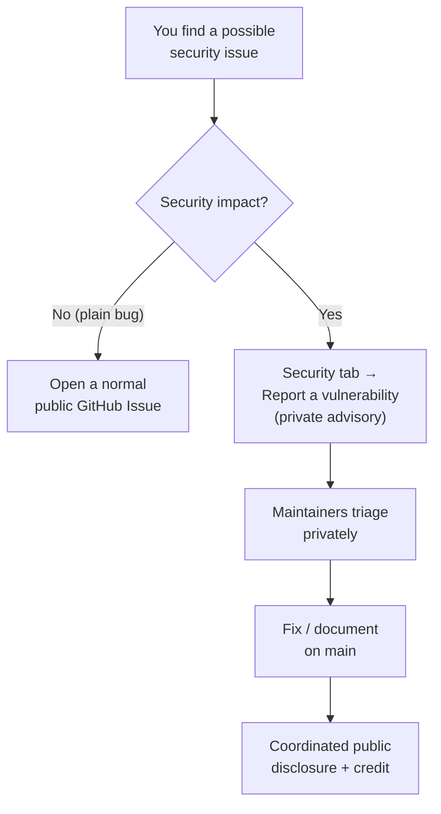

# 🔐 Security Policy

[Home](README.md) > **Security Policy**

> [!NOTE]
> **TL;DR** — This is a **self-contained, synthetic-data proof-of-concept** (a demo you
> run locally with `docker compose up`, or deploy to Azure to show the full pattern). It
> processes **no real or sensitive data**. This page is the short, standard policy GitHub
> looks for — **what's in scope, how to report a problem, and where the full security
> model lives**. The complete, in-depth security model is in
> [`docs/SECURITY.md`](docs/SECURITY.md).

> [!WARNING]
> **Illustrative reference · synthetic data only · not an official NASA document.**
> Every vendor, price, part, and supply-risk figure is fabricated by
> [`data/synthetic_data.py`](data/synthetic_data.py). See [`docs/DISCLAIMER.md`](docs/DISCLAIMER.md).

---

## 📚 Contents

- [🎯 Why this file exists](#-why-this-file-exists)
- [📦 What's in scope (supported versions)](#-whats-in-scope-supported-versions)
- [🐞 Reporting a vulnerability](#-reporting-a-vulnerability)
- [🛡️ What we already do (the short version)](#️-what-we-already-do-the-short-version)
- [🗄️ A note on the data](#️-a-note-on-the-data)
- [➡️ Where to next](#️-where-to-next)

---

## 🎯 Why this file exists

When a repository has a `SECURITY.md` at its root, GitHub surfaces it in the **Security**
tab and links to it from the *"Report a vulnerability"* button. So this file does two
jobs at once:

1. It tells a **security researcher** who finds a flaw exactly how to tell us, privately,
   without opening a public issue that could tip off bad actors before a fix exists. This
   is called **coordinated** (or **responsible**) **disclosure** — the reporter and the
   maintainer agree to keep the details quiet until a fix ships.
2. It tells a **first-time reader** what this project is and what kind of security
   guarantees it makes (and, just as importantly, the ones it deliberately does *not*).

> **In plain terms:** a `SECURITY.md` is the front door for "I think I found a problem."
> Everything past this page — the threat model, the gateway controls, the identity flow —
> lives in [`docs/SECURITY.md`](docs/SECURITY.md). This file is the doorbell; that file is
> the house tour.

---

## 📦 What's in scope (supported versions)

This repository is a **single-version demonstration**, not a released product with a
support matrix. There are no `v1.2`/`v1.3` branches to patch independently — there is one
living `main`.

| What | Supported? | Notes |
|---|---|---|
| **Latest `main`** | ✅ Yes | The only supported state. Fixes land here. |
| Older commits / forks | ❌ No | Pull the latest `main` and rebuild (`docker compose up --build`). |
| Your own adaptation with **real data** | ⚠️ Out of scope | If you replace the synthetic data with real data, **you** own that deployment's security (see [the data note](#️-a-note-on-the-data)). |

> [!TIP]
> Because the whole stack is rebuilt from source on every `docker compose up`, "upgrading"
> is just `git pull` + rebuild. There is no long-lived install to patch in place.

**Why this matters:** a researcher needs to know *which* code we'll act on. The honest
answer for a POC is "the current `main`, as it stands today" — so that's what we state,
rather than inventing a version table that doesn't reflect how the project actually ships.

---

## 🐞 Reporting a vulnerability

If you believe you've found a security vulnerability in **this repository's code or
configuration** (for example: the local JWT issuer, the Kong gateway config, the Data API
Builder permissions, the seeder, or the reference Bicep), please report it privately.

### Preferred: GitHub private vulnerability reporting

Use GitHub's built-in **"Report a vulnerability"** button on the repository's
**Security → Advisories** tab. This opens a **private** advisory visible only to you and
the maintainers — the report stays confidential while we work on a fix.

> **In plain terms:** this is the equivalent of a sealed envelope. Unlike a normal GitHub
> Issue (which is public the moment you click submit), a private advisory is not visible to
> the world, so the flaw can be fixed before anyone can weaponize it.

### What to include

A good report lets us reproduce the issue fast:

- **Where** — the file, service, or endpoint (e.g. `services/gateway/kong.yml`, the
  `/token` route on the identity issuer, a specific test that should have caught it).
- **What** — a clear description of the weakness and the impact you think it has.
- **How** — minimal steps or a snippet to reproduce it. The exact command and the output
  you saw is ideal.
- **Version** — the commit SHA you were on (`git rev-parse HEAD`).

### What to expect

This is a community-maintained demonstration repository, not a staffed product team, so
there is **no formal SLA** (service-level agreement — a contractual response deadline).
We aim to acknowledge a credible report within a few days and to fix or document confirmed
issues on `main`. We'll credit reporters who want credit and coordinate timing before any
public disclosure.

> [!IMPORTANT]
> **Please do not open a public GitHub Issue for a suspected vulnerability.** Public issues
> are world-readable immediately and defeat the purpose of coordinated disclosure. Use the
> private advisory flow above. Functional bugs that have *no* security impact are fine as
> normal public issues.

---

## 🛡️ What we already do (the short version)

You don't need to read the full model to get the gist. The pattern this POC demonstrates
is **defense in depth** — several independent controls, so no single mistake exposes data:

- **Identity at the edge.** Clients present short-lived **RS256 JWTs** (RSA-signed JSON
  Web Tokens — a tamper-evident bearer credential) from a local issuer that stands in for
  **Microsoft Entra ID** (Azure's cloud identity service, formerly Azure AD). The signing
  key is generated at runtime and **never committed**.
- **A gateway that says no.** **Kong** (the open-source API gateway; the **Azure API
  Management** analogue) validates every token, meters per consumer, rate-limits, and caps
  over-broad pulls. No token → **401**; over limit → **429**; nothing reaches the database
  directly.
- **Zero-move isolation.** PostgreSQL and Data API Builder sit on an `internal` Docker
  network with **no host ports** — the *only* path to data is through the gateway. This is
  proven by [`tests/test_zero_move.py`](tests/test_zero_move.py), not just asserted.
- **Classify before you expose.** Confidential columns (unit cost, net price) are labelled
  in [`data/classification.yml`](data/classification.yml) and **redacted at the data API**
  for marketplace consumers — verified by [`tests/test_redaction.py`](tests/test_redaction.py).
- **No secrets in the repo.** Local config lives in a gitignored `.env`; a
  **`detect-private-key`** pre-commit hook ([`.pre-commit-config.yaml`](.pre-commit-config.yaml))
  blocks key material from ever being committed. On Azure, the DB connection string lives
  in **Key Vault** and is read via managed identity, never inlined.

> **Why this matters:** the enterprise story this repo tells is *"open the data without
> moving it, and govern every request at the gateway."* The full mapping of these controls
> to the **OWASP API Security Top 10** — the industry's standard list of the ten most
> common API weaknesses — and to their Azure managed equivalents is in
> [`docs/SECURITY.md`](docs/SECURITY.md).

---

## 🗄️ A note on the data

> [!WARNING]
> This repository contains **only synthetic, fabricated data**. There is **no real NASA,
> ITAR, EAR, CUI, procurement-sensitive, or otherwise controlled information** anywhere in
> it, and there are no real-data ingestion paths. Vendor names carry a `(SYNTHETIC)` suffix.

That design choice is itself a security control: a leak of this repository leaks *nothing
sensitive*, because there is nothing sensitive to leak. If you adapt this pattern for real
data, that becomes **your** security boundary — apply the appropriate classification,
isolation, and handling controls **before** introducing any controlled data. See
[`docs/DISCLAIMER.md`](docs/DISCLAIMER.md) for the full statement.

---

## ➡️ Where to next

| Go here | For |
|---|---|
| [`docs/SECURITY.md`](docs/SECURITY.md) | The **full security model** — identity/token flow, OWASP API Top 10 controls, field-level redaction, secrets handling, and Azure SIEM. |
| [`docs/ZERO-MOVE.md`](docs/ZERO-MOVE.md) | How network isolation is proven (no host ports + the tests that enforce it). |
| [`docs/DISCLAIMER.md`](docs/DISCLAIMER.md) | The legal notice and synthetic-data statement. |
| [`docs/ARCHITECTURE.md`](docs/ARCHITECTURE.md) | The components, the zero-move flow, and the OSS ↔ Azure managed-service mapping. |
| [`README.md`](README.md) | Quickstart and what the demo shows. |
