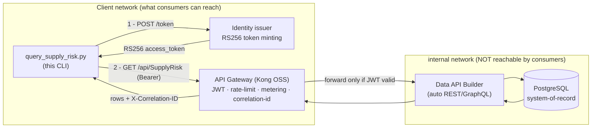
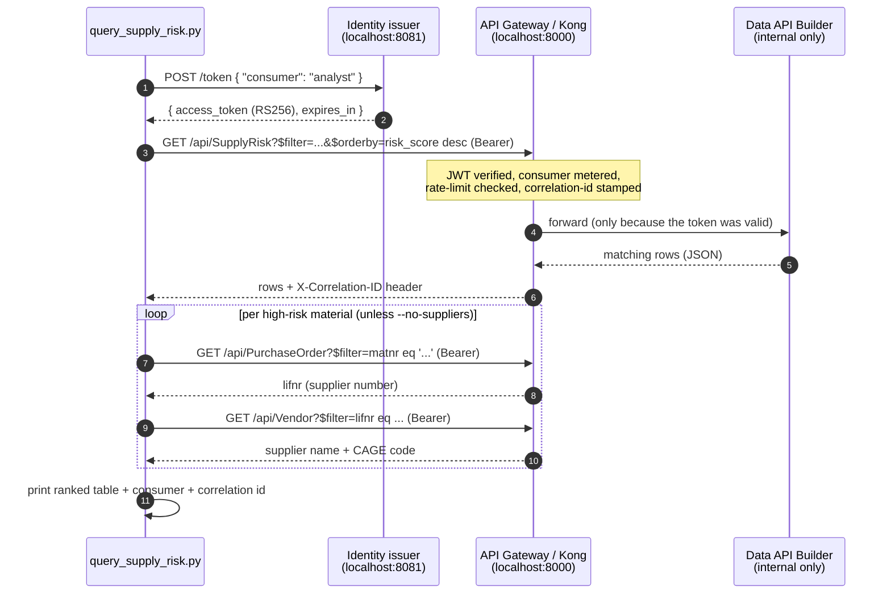

# 🛰️ client — The Governed Consumer CLI

[Home](../README.md) › **client**

> [!NOTE]
> **TL;DR** — `query_supply_risk.py` is the *human-facing consumer* in this proof-of-concept. It plays the role of an analyst (or an automated agent) who wants to answer a real supply-chain question: **"Which critical, sole-source materials on Artemis-3 are running late?"** It answers that question **without ever touching the database** — it mints a bearer token, calls the **SupplyRisk** data product **through the API gateway**, enriches each result with its supplier, and prints the ranked answer plus a **gateway correlation id** that proves the call was brokered through the gateway. This single ~140-line script is the payoff of the entire stack: it shows that a consumer can get exactly the data it needs, governed end-to-end, while the data itself never moves.

> [!IMPORTANT]
> All data in this repo is **synthetic** — not real NASA data. See [`docs/DISCLAIMER.md`](../docs/DISCLAIMER.md).

---

## 📑 Table of Contents

- [Why this CLI exists](#-why-this-cli-exists)
- [The big picture: where the CLI sits](#-the-big-picture-where-the-cli-sits)
- [Azure-first: what each hop becomes in production](#-azure-first-what-each-hop-becomes-in-production)
- [Quick start](#-quick-start)
- [What it does, step by step](#-what-it-does-step-by-step)
- [A worked example: the exact command and expected output](#-a-worked-example-the-exact-command-and-expected-output)
- [CLI options](#-cli-options)
- [Configuration](#-configuration)
- [Proof of zero-move](#-proof-of-zero-move)
- [Gotchas & troubleshooting](#-gotchas--troubleshooting)
- [Where to next](#-where-to-next)

---

## 🎯 Why this CLI exists

Most "data platforms" answer a question by *copying data to the asker*: export a CSV, replicate a table, stand up a read-replica, drop a file in a share. Every copy is a new place the data can leak, go stale, or escape its controls — a serious problem for regulated, export-controlled (ITAR/CUI) programs like Artemis.

**This POC demonstrates the opposite pattern — "API-first, zero-move":**

> The data stays exactly where it lives (PostgreSQL). Consumers reach it *only* through a governed API gateway that authenticates them, rate-limits them, meters them, and logs every call. Nothing is copied. The system-of-record never moves.

**In plain terms:** instead of mailing someone a photocopy of the ledger, you give them a key-card to a reading room. They can read the exact page they're allowed to see, the librarian logs the visit, and the ledger never leaves the vault.

This CLI is the *person walking into the reading room*. It is the concrete proof that the pattern works: a real consumer, asking a real question, getting a real answer — and we can show, with a logged correlation id, that the answer came through the front door (the gateway) and not by sneaking into the vault (the database).

> **Why this matters (the enterprise story):** Program offices repeatedly ask "can a vendor / analyst / mission-planning tool query our procurement data *without us shipping them a copy*?" The honest, demonstrable answer this CLI gives is **yes** — and here is exactly how the request is governed on the way in.

---

## 🗺️ The big picture: where the CLI sits

The CLI is one of several **consumers** of the same governed API. It is deliberately small and dependency-light (just [`httpx`](https://www.python-httpx.org/), a Python HTTP client) so you can read it top-to-bottom and understand every hop.



> [!NOTE]
> Notice the two network boundaries. The CLI lives in the **client network** and can only see the *issuer* and the *gateway*. Postgres and Data API Builder live in the **internal network** — there is no wire the CLI can use to reach them directly. That boundary is what makes "zero-move" *real* rather than merely *claimed*, and it is enforced by an automated test ([`tests/test_zero_move.py`](../tests/test_zero_move.py)).

**Defining the supporting cast (each is detailed in its own README):**

- **Identity issuer** ([`services/identity`](../services/identity/README.md)) — a tiny local service that mints short-lived **RS256** JWTs. *JWT* = JSON Web Token, a signed, tamper-evident credential. *RS256* = the token is signed with an RSA private key and verified with the matching public key, so the gateway can validate a token *without* holding any secret.
- **API gateway** ([`services/gateway`](../services/gateway/README.md)) — **Kong OSS** in DB-less mode. It checks the JWT, enforces a per-consumer rate limit, meters traffic for Prometheus, and stamps every call with a correlation id. It is the *only* path to the data.
- **Data API Builder (DAB)** ([`services/dab`](../services/dab/dab-config.json)) — Microsoft's open-source tool that turns database tables into REST/GraphQL endpoints automatically. The CLI never speaks to it directly; the gateway does.

---

## ☁️ Azure-first: what each hop becomes in production

> [!IMPORTANT]
> **The primary story of this POC is "deploy to Azure to show the full art of the possible."** Running locally with `docker compose` is the **dev/test loop** — fast, free, offline. For the real demo you deploy the same shape to Azure, where each local open-source stand-in is replaced by its **managed** Azure equivalent. The CLI's *code does not change* — only the two URLs it points at do (see [Configuration](#-configuration)). That is the whole point of an API-first design: the contract stays stable while the platform underneath it hardens.

| The CLI talks to… | Locally (dev/test) | In Azure (the real demo) | What you gain in Azure |
| --- | --- | --- | --- |
| **Identity** (`IDENTITY_URL`) | Local RS256 issuer (`services/identity`) | **Microsoft Entra ID** | Enterprise SSO, conditional access, real app registrations, audited token issuance |
| **Gateway** (`KONG_URL`) | Kong Gateway OSS, DB-less | **Azure API Management (APIM)** | Managed gateway, products/subscriptions, built-in analytics, policy-as-config |
| **Data API** (behind the gateway) | Data API Builder in a container | **DAB on Azure Container Apps** ([`infra/azure`](../infra/azure/)) | Scale-to-zero hosting, managed identity to Postgres, no exposed DB |
| **System-of-record** | PostgreSQL container | **Azure Database for PostgreSQL (Flexible Server)** | Private networking, backups, HA, at-rest encryption |
| **Metering/observability** | Prometheus + Grafana | **Azure Monitor + Microsoft Sentinel** | Centralized logs/metrics, alerting, security analytics |

> **Why this matters:** when a stakeholder asks "but how does this run *for real*?", you point at this table. The CLI you just watched on a laptop is byte-for-byte the same CLI you would run against Entra-issued tokens and an APIM endpoint in commercial Azure (at FedRAMP High) — only the endpoints differ. See the deployment doc in [`infra/azure`](../infra/azure/) for the Bicep that stands this up.

---

## 🚀 Quick start

Run from the **repo root** (so the `client/` path resolves):

```bash
python client/query_supply_risk.py --program Artemis-3 --min-delay 30
```

> [!TIP]
> The script reaches the gateway and identity issuer over `localhost` host ports by default, so **bring the stack up first**:
>
> ```bash
> cp .env.example .env   # first time only
> make demo              # or: docker compose up --build
> ```
>
> `make demo` waits for every service to report healthy before returning, so the CLI will have a live gateway to talk to.

---

## 🔁 What it does, step by step

The CLI never opens a database connection — there is no Postgres driver imported, no connection string, nothing. **Every byte of data arrives through the gateway.** Here is the full conversation:



Walking the numbered steps against the actual code in [`query_supply_risk.py`](query_supply_risk.py):

1. **Mint a bearer token.** `get_token()` POSTs `{ "consumer": "analyst" }` to `IDENTITY_URL/token` and reads back `access_token`. The token is an **RS256 JWT** whose `client_id` claim is the consumer name — the gateway later uses that claim to know *who* is calling, for per-consumer metering and rate-limiting. *In plain terms:* the CLI gets a signed badge that says "I am the analyst," and the badge can be verified by anyone holding the public key.

2. **Ask the SupplyRisk data product the question — through the gateway.** `query_supply_risk()` builds an **OData** `$filter` and calls `KONG_URL/api/SupplyRisk`. (*OData* is an open query convention layered on a normal URL: `$filter` narrows rows, `$orderby` sorts them, `$select` picks columns.) The default filter is `program eq 'Artemis-3' and avg_delay_days gt 30 and criticality eq 'Critical' and sole_source eq true`, ordered `risk_score desc`. The `Authorization: Bearer <token>` header is what gets the request past the gateway's JWT check.

   > [!NOTE]
   > **Why the URL is hand-built instead of using `params=`:** the code deliberately interpolates the query string into the URL so `httpx` percent-encodes spaces as `%20`. DAB's OData parser rejects the `+` encoding that a `params=` dict would produce. This is a real, load-bearing detail — see the comment at [`query_supply_risk.py:50`](query_supply_risk.py).

3. **Enrich each result with its supplier — also through the gateway.** For every high-risk material, `supplier_for()` does a two-hop lookup, both via the gateway: `PurchaseOrder` (filter by `matnr`, select `lifnr`) → `Vendor` (filter by `lifnr`, select `name1`, `cage_code`). The function is **best-effort and fail-safe**: if a PO or vendor isn't found, or any HTTP error occurs, it returns a readable placeholder like `(no PO found)` or `(supplier lookup unavailable)` instead of crashing. Pass `--no-suppliers` to skip this entirely.

4. **Print the ranked answer plus the gateway correlation id.** `main()` prints the question in plain English, a fixed-width table (`TIER · RISK · AVG_DLY · MATERIAL · SUPPLIER`), then a footer with `consumer=…`, `results=…`, and the **`X-Correlation-ID`** the gateway returned. That id is the receipt proving the call was brokered through the gateway.

> **The data product itself:** `SupplyRisk` is a pre-computed risk table (columns `matnr, maktx, program, criticality, sole_source, po_count, late_po_count, avg_delay_days, risk_score, risk_tier`) — see [`services/seeder/schema.sql`](../services/seeder/schema.sql). DAB exposes it at `/api/SupplyRisk` automatically; the CLI just queries it.

---

## 🧪 A worked example: the exact command and expected output

Run the default question as the `analyst` consumer:

```bash
python client/query_supply_risk.py --program Artemis-3 --min-delay 30
```

You will see output shaped like this (exact rows, scores, supplier names, and the correlation id will differ — the data is synthetic and the id is generated per request):

```text
Q: Which Critical, sole-source materials on Artemis-3 have an average delay > 30 days?

  TIER  RISK AVG_DLY  MATERIAL                     SUPPLIER
  ----- ---- -------  ---------------------------- ------------------------------
  HIGH    92    61.4  Cryo Valve Assembly, LH2     Orion Propulsion Sys (CAGE 1A2B3)
  HIGH    88    47.0  RCS Thruster Module          Lunar Dynamics Inc (CAGE 7K9P2)
  MED     74    38.5  Avionics Flight Computer     (no PO found)

  consumer=analyst  results=3  gateway correlation-id=b1e6c0a4-7d2f-4f3e-9a11-3c5d8e2f6a90
  Data never left Postgres -- every row was brokered through Kong (JWT-authenticated, rate-limited, metered).
```

**What each part is telling you, and why it matters:**

- **The `Q:` line** restates the question from your flags. Change `--criticality`, `--min-delay`, etc., and this line changes with it — so the answer is always self-describing.
- **`TIER` / `RISK` / `AVG_DLY`** come straight from the `SupplyRisk` data product (`risk_tier`, `risk_score`, `avg_delay_days`). Rows are sorted by `risk_score desc`, so the worst offenders are on top.
- **`SUPPLIER`** is the enrichment result — a real vendor name with its **CAGE code** (Commercial And Government Entity code, the DoD's supplier identifier), or a fail-safe placeholder. This proves the CLI can *join across data products* (SupplyRisk → PurchaseOrder → Vendor) entirely through the governed API.
- **`gateway correlation-id=…`** is the headline. This UUID was minted by the gateway and echoed in the `X-Correlation-ID` response header. The *same* id appears in the gateway's logs/metrics — so you can take this number from the CLI's stdout and find the exact request on the gateway side. That is your end-to-end audit trail.
- **The closing sentence** is the thesis of the whole POC, printed every run.

> [!TIP]
> If you get an empty result set, that's a valid outcome, not an error — the CLI prints `(no materials matched — try --min-delay 0 or --include-non-sole-source)`. Loosen the filter to see rows.

---

## ⚙️ CLI options

| Flag | Default | Description |
| --- | --- | --- |
| `--program` | `Artemis-3` | Program to query (the `program eq '…'` clause). |
| `--min-delay` | `30` | Minimum average delay in days (`avg_delay_days gt …`). Set to `0` to include everything. |
| `--consumer` | `analyst` | Identity to mint a token for. Must be `analyst` or `artemis-agent` (the two registered consumers). |
| `--criticality` | `Critical` | Criticality filter; pass `--criticality ""` to include all criticalities. |
| `--include-non-sole-source` | _off_ | Include materials that are **not** sole-source (drops the `sole_source eq true` clause). |
| `--no-suppliers` | _off_ | Skip the supplier-enrichment lookups (faster; just the SupplyRisk rows). |

> [!NOTE]
> **Why two consumers?** `analyst` and `artemis-agent` are the only identities the issuer will mint tokens for (`ALLOWED_CONSUMERS` in [`services/identity/issuer.py`](../services/identity/issuer.py)). They exist so the gateway can **meter and rate-limit per consumer** — run the CLI as each and you'll see two distinct series in Grafana. In Azure these map to two **app registrations / API Management subscriptions**.

---

## ⚙️ Configuration

The CLI reads exactly **two endpoints** from the environment, each with a local default. These two variables are the *only* thing that changes between the local dev loop and an Azure deployment.

| Variable | Default (local) | Purpose | Azure equivalent target |
| --- | --- | --- | --- |
| `IDENTITY_URL` | `http://localhost:8081` | Where to mint a token (`POST /token`). | Your **Entra ID** token endpoint. |
| `KONG_URL` | `http://localhost:8000` | The gateway proxy — the *only* path to the data. | Your **API Management** gateway URL. |

```bash
# Point the same CLI at an Azure deployment — no code change:
export IDENTITY_URL="https://login.microsoftonline.com/<tenant>/oauth2/v2.0"
export KONG_URL="https://<your-apim-name>.azure-api.net"
python client/query_supply_risk.py --program Artemis-3 --min-delay 30
```

> [!WARNING]
> If your dev box already binds ports `8000` (gateway) or `8081` (issuer), remap the host ports in [`docker-compose.yml`](../docker-compose.yml) and set `IDENTITY_URL` / `KONG_URL` to match. The CLI honors whatever you export — it has no hard-coded ports beyond these defaults.

---

## 🔒 Proof of zero-move

This is the part you demo to a skeptic. On completion the CLI prints:

```text
  consumer=analyst  results=3  gateway correlation-id=<uuid>
  Data never left Postgres -- every row was brokered through Kong (JWT-authenticated, rate-limited, metered).
```

The claim is backed by three independently verifiable facts:

1. **The CLI has no database access.** Read the imports in [`query_supply_risk.py`](query_supply_risk.py): just `argparse`, `os`, `sys`, and `httpx`. There is no Postgres driver. It *cannot* reach the database even if it wanted to.
2. **The network forbids it.** Postgres and DAB sit on the `internal` Docker network only; the CLI sits on the client network. [`tests/test_zero_move.py`](../tests/test_zero_move.py) asserts the database and DAB are unreachable from the client side.
3. **The correlation id is the receipt.** The `X-Correlation-ID` printed by the CLI was stamped by the gateway's `correlation-id` plugin and appears in the gateway's logs — so the printed answer is traceable to a specific, governed gateway request.

> **Why this matters:** "zero-move" is easy to *say* and hard to *prove*. This CLI lets you prove it live in seconds: show the answer, show the correlation id, then (optionally) show the same id in Grafana / gateway logs. For the matching access-control demo — no token → `401`, valid token → `200`, over the per-consumer limit → `429` — see [`tests/test_gateway_auth.py`](../tests/test_gateway_auth.py) and the gateway README.

---

## 🔧 Gotchas & troubleshooting

| Symptom | Likely cause | Fix |
| --- | --- | --- |
| `ConnectError` / `Connection refused` | Stack isn't up, or ports are remapped | Run `make demo`; confirm `IDENTITY_URL` / `KONG_URL` match your `docker-compose.yml` host ports. |
| `400 unknown consumer '...'` | `--consumer` isn't `analyst` or `artemis-agent` | Use one of the two registered consumers. |
| `401 Unauthorized` from the gateway | Missing/expired/invalid token, or gateway public key out of sync with the issuer | Re-run (tokens are short-lived); make sure the issuer rendered the gateway config on startup. |
| `429 Too Many Requests` | You exceeded the per-consumer rate limit (default `60`/min, `RATE_LIMIT_PER_MINUTE` in `.env`) | Wait for the `Retry-After` window, or raise the limit and restart. This is the metering working as designed. |
| Empty result set | Filter too tight | Try `--min-delay 0`, `--include-non-sole-source`, or `--criticality ""`. |
| `(supplier lookup unavailable)` in a row | A PurchaseOrder/Vendor hop failed | Expected fail-safe behavior; the main answer is still valid. Use `--no-suppliers` to skip enrichment. |

> [!NOTE]
> A `429` is **not a bug** — it is the gateway enforcing the per-consumer quota. Triggering it on purpose (loop the CLI past 60 calls/min) is a great way to demo metering.

---

## 🧭 Where to next

- **The gateway that governs every call** → [`services/gateway/README.md`](../services/gateway/README.md) — JWT, rate-limit, correlation-id, OWASP guard, CORS, and how it maps to **Azure API Management**.
- **The identity issuer that mints the tokens** → [`services/identity/README.md`](../services/identity/README.md) — RS256, JWKS, and how it stands in for **Microsoft Entra ID**.
- **The auto-generated data API** → [`services/dab/dab-config.json`](../services/dab/dab-config.json) — the entities (`Material`, `Vendor`, `PurchaseOrder`, `SupplyRisk`) this CLI queries, and its **Azure Container Apps** path.
- **The same question, agent-style** → [`services/mcp/server.py`](../services/mcp/server.py) — the Model Context Protocol tool that answers this question for an AI assistant, through the same gateway.
- **Deploy it for real** → [`infra/azure/`](../infra/azure/) — the Bicep that stands up the Azure-managed version of this whole stack.
- **The 10-minute live demo** → [`docs/DEMO-SCRIPT.md`](../docs/DEMO-SCRIPT.md) — where this CLI is the closing act.
