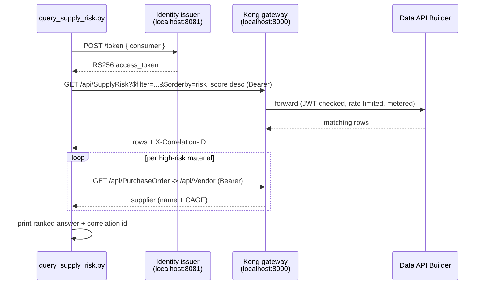

# 🛰️ client — Governed Consumer CLI

[Home](../README.md) > **client**

> [!NOTE]
> **TL;DR** — `query_supply_risk.py` is the human-facing consumer in this POC. It mints a
> bearer token from the local identity issuer, calls the **SupplyRisk** data product
> **through the Kong gateway** (never the database directly), enriches each high-risk part
> with its supplier, and prints the ranked answer plus the **gateway correlation id** as
> proof the call was brokered through Kong.

> [!IMPORTANT]
> All data is **synthetic** — not real NASA data. See [`docs/DISCLAIMER.md`](../docs/DISCLAIMER.md).

## 📑 Table of Contents

- [Quick start](#-quick-start)
- [What it does](#-what-it-does)
- [CLI options](#-cli-options)
- [Configuration](#-configuration)
- [Proof of zero-move](#-proof-of-zero-move)

## 🚀 Quick start

```bash
python client/query_supply_risk.py --program Artemis-3 --min-delay 30
```

> [!TIP]
> Run from the repo root. The script reaches the gateway and identity issuer over
> `localhost` host ports by default — bring the stack up first (`make demo` /
> `docker compose up`).

## 🔁 What it does

The CLI never touches the database directly — every call is brokered through Kong:



1. Obtain an **RS256 bearer token** from the local identity issuer (stands in for Entra).
2. Call the **SupplyRisk** data product through Kong with an **OData `$filter`**, ordered
   by `risk_score desc`.
3. Enrich each high-risk part with its supplier (`PurchaseOrder` → `Vendor`, also via Kong).
4. Print the ranked answer plus the **gateway correlation id** (`X-Correlation-ID`).

## ⚙️ CLI options

| Flag | Default | Description |
| --- | --- | --- |
| `--program` | `Artemis-3` | Program to query. |
| `--min-delay` | `30` | Minimum average delay (days) for the `avg_delay_days gt` filter. |
| `--consumer` | `analyst` | Identity to mint a token for (`analyst` \| `artemis-agent`). |
| `--criticality` | `Critical` | Criticality filter; set empty to include all criticalities. |
| `--include-non-sole-source` | _off_ | Include materials that are not sole-source. |
| `--no-suppliers` | _off_ | Skip the supplier-enrichment lookups. |

## 🔧 Configuration

The CLI reads two endpoints from the environment (with local defaults):

| Variable | Default | Purpose |
| --- | --- | --- |
| `IDENTITY_URL` | `http://localhost:8081` | Local RS256 token issuer (`POST /token`). |
| `KONG_URL` | `http://localhost:8000` | Kong gateway proxy — the only path to the data. |

> [!NOTE]
> If your dev box already binds these host ports, remap them in `docker-compose.yml` and
> set `IDENTITY_URL` / `KONG_URL` to match.

## 🔒 Proof of zero-move

On completion the CLI prints the consumer, result count, and the gateway correlation id,
followed by:

> _Data never left Postgres — every row was brokered through Kong (JWT-authenticated,
> rate-limited, metered)._

The correlation id ties the printed answer back to a gateway-logged request, demonstrating
the API-first **zero-move** pattern.

> [!NOTE]
> Build per PRP §6 / §8 Phase 5.
