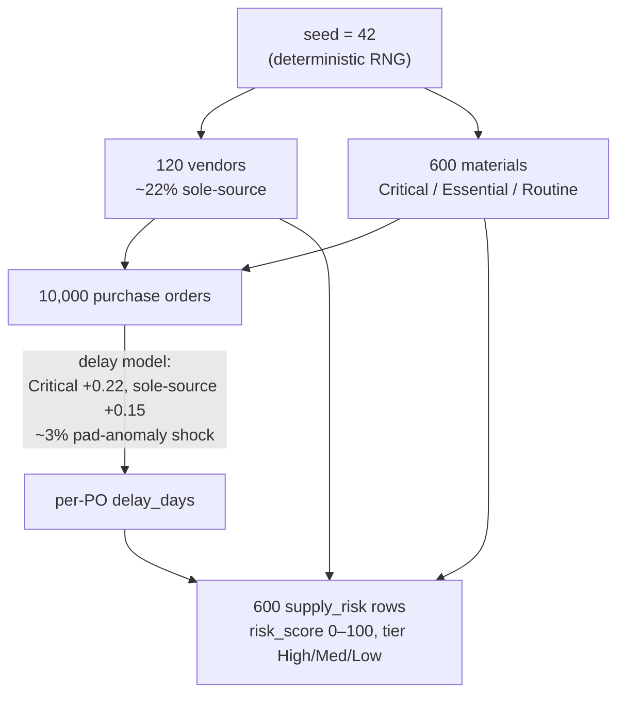
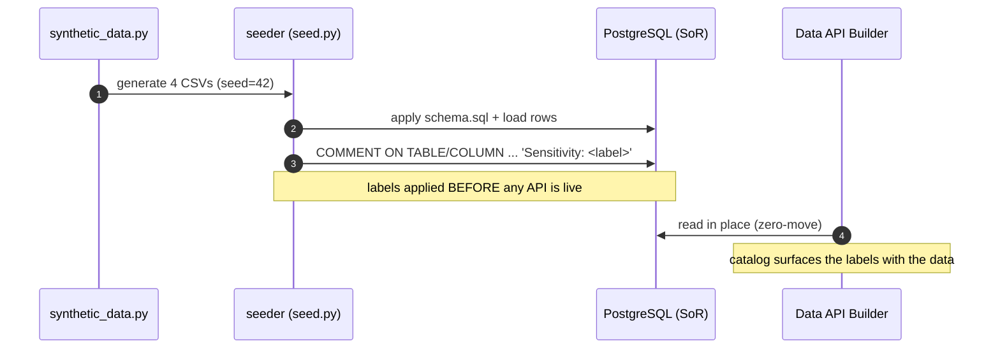
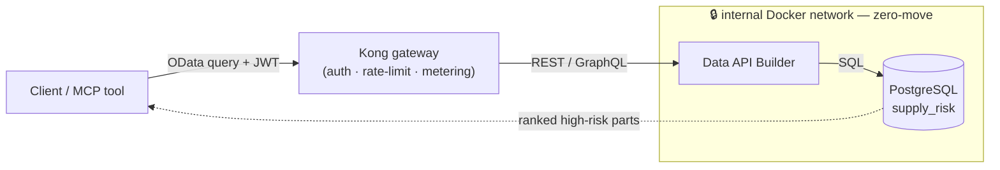

# 🛰️ The synthetic Artemis dataset — what the demo proves things *on*

[Home](../README.md) > **Synthetic data**

> [!WARNING]
> **SYNTHETIC DATA — NOT REAL NASA PROCUREMENT.** Every vendor, material, price,
> and date in this folder is fabricated for demonstration only. Vendor names carry a
> `(SYNTHETIC)` suffix so they can never be mistaken for real suppliers. The data is
> safe for external sharing and contains **no CUI/ITAR** content. See
> [`docs/DISCLAIMER.md`](../docs/DISCLAIMER.md) for the full notice.
>
> *CUI = Controlled Unclassified Information; ITAR = International Traffic in Arms
> Regulations — two U.S. categories of data you are legally not allowed to leak. We
> avoid them by inventing everything.*

> [!NOTE]
> **TL;DR** — This folder holds the *fuel* for the whole proof-of-concept: a realistic
> but entirely **made-up** SAP-style procurement dataset, plus the two files that turn
> raw rows into a *governed* dataset. [`synthetic_data.py`](synthetic_data.py) generates
> four CSV tables (vendors, materials, purchase orders, derived supply-risk).
> [`classification.yml`](classification.yml) tags every table and column with a
> sensitivity label **before** any of it is exposed through the API. The demo's headline
> question — *"which Critical, sole-source Artemis-3 parts are slipping?"* — is answered
> against the derived `supply_risk` table, **without the data ever leaving its database**.

---

## 📑 Table of Contents

- [🎯 Why this folder exists](#-why-this-folder-exists)
- [☁️ The Azure story this data serves](#️-the-azure-story-this-data-serves)
- [📁 What's in this folder](#-whats-in-this-folder)
- [🗄️ The four tables (SAP-shaped)](#️-the-four-tables-sap-shaped)
- [🏭 How the data is generated (the model)](#-how-the-data-is-generated-the-model)
- [🔒 Classify *before* exposure](#-classify-before-exposure)
- [💡 The headline demo query](#-the-headline-demo-query)
- [🔄 Regenerate it yourself](#-regenerate-it-yourself)
- [🧪 Gotchas & troubleshooting](#-gotchas--troubleshooting)
- [➡️ Where to next](#️-where-to-next)

---

## 🎯 Why this folder exists

The enterprise story behind this whole project is simple: **a real database already
exists inside an agency or a company, and people need to ask it questions — but no one is
allowed to copy the data out.** The classic (bad) answer is to export a spreadsheet, email
it around, and lose all control of it. The modern answer — the pattern this repo proves —
is to **leave the data where it lives and expose a governed API over it**, so consumers
query it in place. We call that **zero-move** (sometimes "zero-copy"): the answer travels,
the data does not.

To *demonstrate* that pattern you need data to point it at. The motivating customer
conversation was about NASA's **Artemis** programs (the U.S. effort to return humans to
the Moon) and their supply chain — but **no public Artemis procurement data exists**, and
real procurement data would be exactly the kind of CUI/ITAR material we must never touch.

> **In plain terms:** we needed a realistic enough dataset to make the demo feel real,
> with *zero* risk of leaking anything real. The solution is a **deterministic synthetic
> generator** — code that invents a believable supply chain from scratch, the same way
> every time.

> **Why this matters:** because the data is synthetic and seeded, the demo is *safe to
> share externally* and *reproducible* — anyone who runs the generator with the same seed
> gets byte-for-byte the same dataset, so the documented row counts and the headline
> answer always match what you see on screen.

---

## ☁️ The Azure story this data serves

This is an **enterprise proof-of-concept**, and its primary purpose is to show the *art of
the possible on Azure*. Local Docker is the **dev/test inner loop** — you run the whole
thing on your laptop to develop and test fast; you **deploy to Azure for the real demo**.
This dataset is the one piece that is identical in both worlds: the same synthetic CSVs
seed the same system-of-record whether it is a Postgres container on your machine or
**Azure Database for PostgreSQL** in the cloud.

The single most important idea this folder teaches — *classify the data before you expose
it* — maps directly onto an Azure managed service:

| This folder (local / OSS) | What it stands in for on Azure | What the Azure service does |
|---|---|---|
| [`classification.yml`](classification.yml) — hand-written sensitivity labels | **Microsoft Purview** | Discovers data, applies/automates sensitivity labels, and tracks lineage across the estate |
| The seeder stamping `COMMENT ON COLUMN` labels onto Postgres | Purview **classifications + glossary** attached to a registered data source | Makes governance *travel with the data*, not live in a side document |
| The CSVs → Postgres system-of-record | **Azure Database for PostgreSQL** behind the API | The system-of-record the API reads in place (zero-move) |

> **In plain terms:** locally we write the labels by hand in one small YAML file so you
> can *see* the discipline. On Azure, **Purview** is the engine that does this at scale —
> scanning sources, suggesting labels, and recording where data came from. The *workflow*
> is the lesson; Purview is the production tool that runs it.

> **Why this matters:** a sensitivity label is only useful if it is applied **before** the
> data is reachable. If you expose first and govern later, you have already leaked. This
> folder makes "classify first" a literal, ordered step in the pipeline — see
> [Classify before exposure](#-classify-before-exposure).

---

## 📁 What's in this folder

| Path | What it is |
|---|---|
| **[`synthetic_data.py`](synthetic_data.py)** | The deterministic, **pure-standard-library** generator (no `pandas`, just `csv` + `random` + `datetime`). The entry point is `generate_artemis_procurement(out_dir, seed=42)`; it writes the four CSVs **plus** a Markdown data dictionary, and returns a `{paths, counts, out_dir}` summary. The [seeder service](../services/seeder/) calls this — **do not rewrite it.** |
| **[`classification.yml`](classification.yml)** | Per-table and per-column sensitivity labels (`Routine` / `Sensitive` / `Confidential`). The seeder reads this and applies the labels as Postgres table/column comments, then surfaces them in the catalog — *classify before exposure.* |
| **[`sample/`](sample/)** | A committed reference copy of the generated dataset (`seed=42`), including `artemis_procurement_DATA_DICTIONARY.md`, so the **shape and the data dictionary are inspectable without running anything**. |

> [!NOTE]
> `synthetic_data.py` and `classification.yml` are **copied into the seeder's Docker image
> at build time** (the seeder's build context is the repo root). They live here, in
> `data/`, as the single source of truth — the seeder is a consumer, not the owner. See
> [`services/seeder/Dockerfile`](../services/seeder/Dockerfile).

---

## 🗄️ The four tables (SAP-shaped)

The dataset is modelled on the table layout of **SAP** — the enterprise software that runs
procurement at many large organisations — so the demo resembles a real source-of-record. We
use SAP's own cryptic field names (`EBELN`, `MATNR`, `LIFNR`, …) on purpose, because that
is what you would actually find in such a system; each is defined inline and in the
[Glossary](../docs/GLOSSARY.md#-procurement-domain--dataset-fields-sap-shaped).

| File | Rows | SAP analogue | Purpose |
|---|---|---|---|
| `artemis_vendors.csv` | ~120 | **LFA1** (vendor master) | Suppliers: CAGE code, home state, **sole-source** + small-business flags, past-performance score |
| `artemis_materials.csv` | ~600 | **MARA** (material master) | Parts by family / Artemis program / criticality, with standard lead time + unit cost |
| `artemis_purchase_orders.csv` | ~10,000 | **EKKO/EKPO** (PO header/line) | Orders with promised vs. actual delivery, computed **delay days**, and a launch-**pad-anomaly** flag |
| `artemis_supply_risk.csv` | ~600 | *derived* | One row per material: a **risk score & tier** computed from sole-source + criticality + delay history |

> [!TIP]
> **SAP field-name decoder (the ones you'll see most):** `EBELN`/`EBELP` = PO number / line
> item · `MATNR`/`MAKTX` = material number / description · `LIFNR`/`NAME1` = vendor number /
> name · `MATKL` = material group/family · `CRITICALITY` = how mission-critical the part is
> · `MENGE`/`MEINS` = quantity / unit of measure · `NETPR`/`NETWR`/`WAERS` = unit price / net
> value / currency · `BEDAT`/`EINDT`/`ACTUAL_DELIVERY` = order date / promised date / actual
> date. Full table in the [Glossary](../docs/GLOSSARY.md#-procurement-domain--dataset-fields-sap-shaped).

The fourth table, `supply_risk`, is the **payload of the entire demo**. The first three are
the raw operational records; `supply_risk` is a *derived analytical view* of them — exactly
the kind of "leave the heavy raw data in place, expose a focused answer view" shape that the
zero-move pattern is built for.

> **Where this lands in the running system:** the seeder loads these four CSVs into four
> Postgres tables of the same name (lowercased columns — see
> [`services/seeder/schema.sql`](../services/seeder/schema.sql)), and **Data API Builder**
> auto-exposes `supply_risk` as the REST/GraphQL entity **`SupplyRisk`**
> ([`services/dab/dab-config.json`](../services/dab/dab-config.json)). That entity name is
> what the client and MCP tool call.

---

## 🏭 How the data is generated (the model)

The point of a *model* (rather than random noise) is that the data has to contain a **real,
discoverable signal** — otherwise the headline query would return nothing interesting. The
generator deliberately bakes supply-chain risk into the numbers:



**How risk gets *into* the data, step by step:**

1. **Vendors** are generated first; about **22%** are flagged sole-source (`SOLE_SOURCE = X`),
   because single-supplier dependence is the classic supply-chain vulnerability.
2. **Materials** get a criticality of `Critical`, `Essential`, or `Routine`, which drives
   their standard lead time (Critical parts take 120–420 days) and unit cost.
3. **Purchase orders** are where slips happen. Each PO's chance of being late goes **up**
   for Critical parts (`+0.22`) and for sole-sourced parts (`+0.15`), and roughly **3%** of
   orders get hit by a "**pad anomaly**" shock that adds 60–240 extra days. (The customer's
   own phrasing — delays "when pads blow up" — is the origin of that flag.)
4. **`supply_risk`** is then computed *from* the orders: per material, the generator averages
   the delay days and combines them with criticality and sole-source status into a
   `RISK_SCORE` (0–100) and a `RISK_TIER` (**High ≥ 70**, **Medium ≥ 40**, else **Low**).

> **In plain terms:** the riskiest parts are *engineered* to be the Critical, sole-source
> ones with a history of slipping — so when the headline query asks for exactly those, it
> finds them. The signal is real; it is just real *in synthetic data*.

> [!NOTE]
> **Deterministic = reproducible.** Everything flows from `seed=42` through a single seeded
> random-number generator, so the dataset is identical on every run. That is why the
> committed [`sample/`](sample/) copy stays in sync with what the seeder produces, and why
> the data is "content-verifiable" — you can diff it.

The generator also writes its own **data dictionary** — `artemis_procurement_DATA_DICTIONARY.md`
— alongside the CSVs (see the committed copy at
[`sample/artemis_procurement_DATA_DICTIONARY.md`](sample/artemis_procurement_DATA_DICTIONARY.md)).
It documents every field with its SAP name and lists suggested marketplace scenarios. Because
the dictionary is *generated from the same code that generates the data*, it can never drift
out of date.

---

## 🔒 Classify *before* exposure

This is the governance lesson at the heart of the folder. Before a single byte is reachable
through the API, the seeder applies the sensitivity labels from
[`classification.yml`](classification.yml) directly onto the database.



The labels come in three levels:

| Label | Meaning | Examples in this dataset |
|---|---|---|
| **`Routine`** | Default; nothing special | `MATNR`, `MAKTX`, `STATUS`, vendor `NAME1` |
| **`Sensitive`** | Reveals posture you would not broadcast | `CAGE_CODE`, `SOLE_SOURCE`, `PAST_PERF_SCORE`, `CRITICALITY`, the whole `vendors` and `supply_risk` tables |
| **`Confidential`** | Genuinely guarded business value | `STD_UNIT_COST_USD`, PO `NETPR`/`NETWR`, the whole `purchase_orders` table |

Notice the tables carry a label *and* their columns can carry finer ones: `purchase_orders`
is `Confidential` as a whole, but `EBELN` (just a PO number) is `Routine` while `NETPR`
(the price) is `Confidential`. That table-then-column granularity is what real governance
tools do.

> [!TIP]
> The labels are applied with PostgreSQL `COMMENT ON TABLE`/`COMMENT ON COLUMN` statements
> generated from the YAML — see `apply_classification()` in
> [`services/seeder/seed.py`](../services/seeder/seed.py). This makes the governance
> **travel with the schema**: anyone (or any tool, like the catalog or Purview) inspecting
> the database sees `Sensitivity: Confidential` right on the column.

> [!WARNING]
> `classification.yml` lists the columns that matter for the lesson, not necessarily *every*
> column in the schema — e.g. the derived `supply_risk` table omits `PO_COUNT`,
> `LATE_PO_COUNT`, and `AVG_DELAY_DAYS`. Unlisted columns simply inherit no explicit label;
> they are not an error. If you add a column to the schema and want it governed, add it here
> too.

> **Why this matters:** in commercial Azure at **FedRAMP High**, this is the role of
> **Microsoft Purview** — register the PostgreSQL source, scan it, and apply/automate
> sensitivity labels and lineage. The local YAML is the *teaching version* of that managed
> capability; see [`docs/AZURE-DEPLOYMENT.md`](../docs/AZURE-DEPLOYMENT.md).

---

## 💡 The headline demo query

> [!NOTE]
> *"Which **Critical, sole-source** materials on **Artemis-3** have an average delivery
> delay of **more than 30 days**?"*

This is the one question the whole demo is built to answer. It is deliberately the kind of
question a program manager would actually ask — and answering it means joining criticality,
sole-source exposure, and delay history, all of which the [data model](#-how-the-data-is-generated-the-model)
baked in on purpose.

At the database level it is just SQL against the derived view (this exact query runs inside
the seeder as a sanity check — see [`seed.py`](../services/seeder/seed.py)):

```sql
SELECT matnr, maktx, risk_score, avg_delay_days
FROM supply_risk
WHERE program = 'Artemis-3'
  AND criticality = 'Critical'
  AND sole_source = TRUE
  AND avg_delay_days > 30
ORDER BY risk_score DESC;
```

But the *whole point* is that consumers never run that SQL and never touch the database.
They send an **OData-style** filter (OData is an open HTTP query standard) to the
**`SupplyRisk`** entity, **through the Kong gateway**, which forwards it to Data API Builder,
which runs the SQL in place:

```text
GET /SupplyRisk?$filter=program eq 'Artemis-3'
                       and criticality eq 'Critical'
                       and sole_source eq true
                       and avg_delay_days gt 30
                &$orderby=risk_score desc
```



The ranked high-risk parts come back to the caller; **the rows themselves never leave
Postgres** — only the answer travels, carrying a gateway correlation id. Postgres and Data
API Builder sit on an `internal` Docker network with **no host ports**, so the *only* path
to the data is through Kong. That isolation is the literal proof of zero-move, and it is
asserted by [`tests/test_zero_move.py`](../tests/test_zero_move.py).

> **Azure twin:** Kong → **Azure API Management**, Data API Builder → a container on
> **Azure Container Apps**, Postgres → **Azure Database for PostgreSQL**. The shape is
> identical; only the operator changes. See [`docs/ZERO-MOVE.md`](../docs/ZERO-MOVE.md) and
> [`docs/AZURE-DEPLOYMENT.md`](../docs/AZURE-DEPLOYMENT.md).

---

## 🔄 Regenerate it yourself

The committed [`sample/`](sample/) folder already holds a `seed=42` copy, so you usually do
**not** need to run anything to inspect the data. To regenerate it (for example after
changing the model), run from inside this `data/` folder:

```bash
python -c "from synthetic_data import generate_artemis_procurement as g; g('sample', seed=42)"
```

**What you should see** — the function writes five files into `sample/` and returns a
summary. Printed via the seeder, the row counts look like:

```text
generated counts: {'vendors': 120, 'materials': 600, 'purchase_orders': 10000,
                   'supply_risk': 600, 'high_risk_materials': <n>, 'sole_source_materials': <n>}
```

**What each part did:** `generate_artemis_procurement('sample', seed=42)` re-ran the whole
[model](#-how-the-data-is-generated-the-model) with the fixed seed, overwrote the four CSVs
and the data dictionary in `sample/`, and (because the seed is unchanged) produced
**byte-for-byte the same dataset** as the committed copy. If `git status` shows no diff in
`sample/`, the generator is behaving deterministically — exactly what you want.

> [!TIP]
> In the full stack you never call this by hand — the **seeder service does it for you** on
> `docker compose up`, generating to a temp dir, loading Postgres, and applying the labels.
> Regenerating `sample/` manually is only for inspecting or evolving the dataset shape.

---

## 🧪 Gotchas & troubleshooting

> [!WARNING]
> - **"My `sample/` changed after regenerating."** You almost certainly edited
>   `synthetic_data.py` (changed the model or row counts). With an unchanged file and
>   `seed=42`, the output is identical — a diff means the code changed, not that generation
>   is flaky.
> - **`ModuleNotFoundError: No module named 'synthetic_data'`.** Run the one-liner from
>   *inside* the `data/` folder (it imports the local module), or add `data/` to your
>   `PYTHONPATH`.
> - **A new column isn't governed.** Adding it to the schema/CSV is not enough — also add it
>   to [`classification.yml`](classification.yml), or it inherits no explicit sensitivity
>   label (see the warning under [Classify before exposure](#-classify-before-exposure)).
> - **The headline query returns zero rows.** Confirm the filter uses the *lowercase* field
>   names DAB exposes (`program`, `criticality`, `sole_source`, `avg_delay_days`) and that
>   you queried the **`SupplyRisk`** entity — the schema lowercases columns on purpose so the
>   OData filter maps cleanly.

---

## ➡️ Where to next

- **The big idea (zero-move, in depth):** [`docs/concepts/01-the-big-idea.md`](../docs/concepts/01-the-big-idea.md)
  and [`docs/ZERO-MOVE.md`](../docs/ZERO-MOVE.md)
- **How the API is auto-generated from this schema:** [`docs/concepts/03-data-api-builder.md`](../docs/concepts/03-data-api-builder.md)
  and [`services/dab/`](../services/dab/)
- **How the data is loaded & labelled:** [`services/seeder/README.md`](../services/seeder/README.md)
- **Every field and acronym, defined:** [`docs/GLOSSARY.md`](../docs/GLOSSARY.md#-procurement-domain--dataset-fields-sap-shaped)
- **Deploying the same data to Azure (Purview, PostgreSQL, API Management):** [`docs/AZURE-DEPLOYMENT.md`](../docs/AZURE-DEPLOYMENT.md)
- **The full synthetic-data notice:** [`docs/DISCLAIMER.md`](../docs/DISCLAIMER.md)
