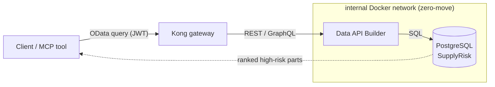

# 🛰️ Synthetic Artemis supply-chain dataset

[Home](../README.md) > **Synthetic data**

> [!WARNING]
> **SYNTHETIC DATA — NOT REAL NASA PROCUREMENT.** Every vendor, material, price,
> and date is fabricated for demonstration only. Vendor names carry a `(SYNTHETIC)`
> suffix. Safe for external sharing; contains no CUI/ITAR content. See
> [`docs/DISCLAIMER.md`](../docs/DISCLAIMER.md) for the full notice.

## 📑 Table of Contents

- [What's here](#-whats-here)
- [The four tables (SAP-shaped)](#️-the-four-tables-sap-shaped)
- [The headline demo query](#-the-headline-demo-query)
- [Regenerate](#-regenerate)

---

## 📁 What's here

| Path | What it is |
|---|---|
| **`synthetic_data.py`** | The deterministic, pure-stdlib generator. `generate_artemis_procurement(out_dir, seed=42)` writes the four CSVs plus a Markdown data dictionary (`artemis_procurement_DATA_DICTIONARY.md`). The seeder service calls this; re-running with the same seed reproduces the dataset exactly. |
| **`classification.yml`** | Per-table/column sensitivity labels (`Routine` / `Sensitive` / `Confidential`). The seeder applies these as Postgres column comments and surfaces them in the catalog entry — *classify before exposure*. |
| **`sample/`** | A committed reference copy of the generated dataset (seed=42), so the shape is inspectable without running anything. |

## 🗄️ The four tables (SAP-shaped)

| File | Rows | SAP analogue | Purpose |
|---|---|---|---|
| `artemis_vendors.csv` | ~120 | LFA1 | Suppliers, CAGE codes, sole-source + small-business flags, past performance |
| `artemis_materials.csv` | ~600 | MARA | Parts by family / program / criticality, lead time + unit cost |
| `artemis_purchase_orders.csv` | ~10,000 | EKKO/EKPO | Orders with promised vs. actual delivery, delay days, pad-anomaly flag |
| `artemis_supply_risk.csv` | ~600 | derived | Per-material risk score/tier from sole-source + criticality + delay history |

## 💡 The headline demo query

> [!NOTE]
> "Which **Critical, sole-source** materials on **Artemis-3** have an average delay
> **> 30 days**?"

This resolves to an OData-style call through the Kong gateway against `SupplyRisk` and
returns the ranked high-risk parts + their suppliers — answered **without the data ever
leaving Postgres**.



## 🔄 Regenerate

```bash
python -c "from synthetic_data import generate_artemis_procurement as g; g('sample', seed=42)"
```
