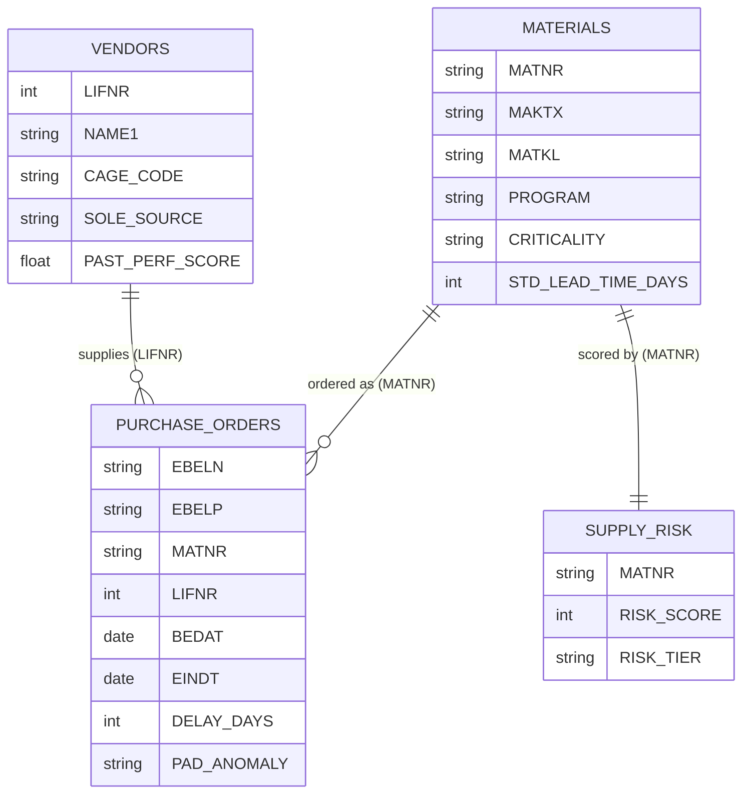

# 🚀 Artemis Supply-Chain Procurement — Synthetic Dataset

[Home](../../README.md) > [Data](../README.md) > **Data Dictionary**

> [!WARNING]
> **SYNTHETIC DATA — NOT REAL NASA PROCUREMENT.** Every vendor, material, price,
> and date is fabricated for demonstration only (the NASA call confirmed no
> public Artemis procurement data exists). Vendor names carry a `(SYNTHETIC)`
> suffix. Safe for external sharing; contains no CUI/ITAR content. See
> [`docs/DISCLAIMER.md`](../../docs/DISCLAIMER.md).

Generated for the API-first data-marketplace worked example: shows how a
zero-copy API/metadata layer over an SAP procurement source surfaces
supply-chain risk (sole-source exposure, lead-time slips, launch-pad anomalies)
for the Artemis "Ignition Day" programs.

> [!NOTE]
> This dictionary is **generated** by `data/synthetic_data.py`
> (`generate_artemis_procurement(out_dir, seed=42)`). Regenerating the dataset
> rewrites this file from the `_data_dictionary()` template, so substantive edits
> should be made at the source.

## 📑 Table of Contents

- [🗂️ Files](#️-files)
- [🔗 Entity relationships](#-entity-relationships)
- [🏷️ Key fields (SAP names)](#️-key-fields-sap-names)
- [💡 Suggested API / marketplace scenarios](#-suggested-api--marketplace-scenarios)

## 🗂️ Files

| File | Rows | SAP analogue | Purpose |
|------|------|--------------|---------|
| `artemis_vendors.csv` | 120 | LFA1 (vendor master) | Suppliers, CAGE codes, sole-source + small-business flags, past performance |
| `artemis_materials.csv` | 600 | MARA (material master) | Parts by family/program/criticality, standard lead time + unit cost |
| `artemis_purchase_orders.csv` | 10000 | EKKO/EKPO (PO header/line) | Orders with promised vs actual delivery, delay days, pad-anomaly flag |
| `artemis_supply_risk.csv` | 600 | derived | Per-material risk score/tier from sole-source + criticality + delay history |

## 🔗 Entity relationships

## 🏷️ Key fields (SAP names)

| Field(s) | Meaning |
|----------|---------|
| **EBELN / EBELP** | purchase order number / line item |
| **MATNR / MAKTX** | material number / description |
| **LIFNR / NAME1** | vendor number / name |
| **MATKL / PROGRAM / CRITICALITY** | material group / Artemis program / criticality |
| **MENGE / MEINS / NETPR / NETWR / WAERS** | qty / UoM / unit price / net value / currency |
| **BEDAT / EINDT / ACTUAL_DELIVERY / DELAY_DAYS** | PO date / promised date / actual / slip |
| **SOLE_SOURCE / PAD_ANOMALY** | single-supplier exposure / launch-pad shock event |
| **RISK_SCORE / RISK_TIER** | derived supply-chain risk (High ≥70, Medium ≥40, Low) |

## 💡 Suggested API / marketplace scenarios

1. **Federated query:** "Which Critical, sole-source materials on Artemis-3 have an
   average delay > 30 days?" — joins materials × supply_risk without copying SAP.
2. **Real-time streaming:** PO status changes pushed through an APIM endpoint.
3. **Lineage / governance:** classify confidential vs routine procurement records
   (the call's data-quality concern) before exposing them in the catalog.
