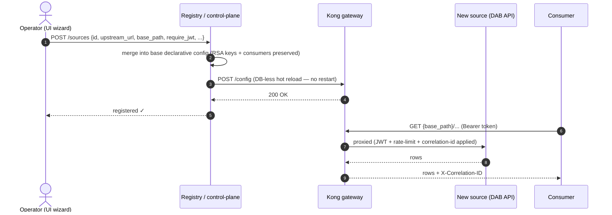

# Add a data source — through the gateway, live

> **The 90-second story for the customer:** a new data product becomes governed and
> discoverable by registering its API with the gateway — **no change to the source, no
> downtime, no redeploy.** This is the Azure API Management / API Center pattern, shown
> locally. The source's data never moves; the gateway simply learns a new upstream.

This guide adds a **second source** — a DOT (Department of Transportation) bridge-inventory
**Data API Builder** API — alongside the built-in Artemis supply-chain source, and serves
it through the same Kong gateway with the same governance (JWT, rate-limit, correlation id).

---

## How it works



The **registry** (`services/registry`) reads the base config Kong is already running
(rendered by the identity service into `/shared/kong.yml`, so the RSA keys and consumers
survive), adds a Kong `service` + `route` + governance plugins for the new source, and
hot-reloads Kong via its admin `/config` endpoint. The **catalog** then lists the new
product automatically.

---

## Option A — the onboarding wizard (UI)

1. `make ui` → open <http://localhost:5173>.
2. Click **“+ Add a data source.”**
3. Step through the 4 steps (pre-filled with the DOT example):
   - **Identify** — id `dot-bridges`, title, owner, domain.
   - **Connect** — upstream `http://transportation:8200`, gateway path `/dot`, a sample query.
   - **Govern** — require JWT (per-consumer rate limit + correlation id), classification.
   - **Review & publish** — click **Publish through gateway.**
4. The wizard immediately proves it: **HTTP 200**, a **gateway correlation id**, and the
   rows returned **through Kong** from the new source. The new card appears in the
   marketplace, queryable like any other.

---

## Option B — the API (scriptable, same result)

```bash
# Register the source (the registry hot-reloads Kong):
cat > /tmp/dot-source.json <<'JSON'
{
  "id": "dot-bridges",
  "title": "DOT Transportation - Bridge Inventory",
  "upstream_url": "http://transportation:8200",
  "base_path": "/dot",
  "owner": "US DOT (synthetic)",
  "domain": "Transportation / Infrastructure",
  "classification_label": "Routine",
  "require_jwt": true,
  "sample_path": "/dot/api/Bridge?$orderby=condition_rating asc&$first=5"
}
JSON
curl -s -X POST http://localhost:8095/sources \
  -H 'Content-Type: application/json' --data-binary @/tmp/dot-source.json | jq .

# Query the NEW source THROUGH the gateway (governed exactly like Artemis):
TOKEN=$(curl -s -X POST http://localhost:8081/token -H 'Content-Type: application/json' \
  -d '{"consumer":"analyst"}' | jq -r .access_token)

# worst-condition bridges, through Kong:
curl -s -H "Authorization: Bearer $TOKEN" \
  "http://localhost:8000/dot/api/Bridge?\$orderby=condition_rating%20asc&\$first=5" | jq .

# no token -> 401 at the edge (the source is never reached):
curl -s -o /dev/null -w "%{http_code}\n" http://localhost:8000/dot/api/Bridge

# it now appears in the catalog:
curl -s http://localhost:8080/catalog | jq '.products[] | {id, title, origin}'

# remove it again (hot reload):
curl -s -X DELETE http://localhost:8095/sources/dot-bridges | jq .
```

---

## Federating the **real** published DOT DAB demo

The local `transportation` service stands in for the published
[`azure-dab-fullstack-demo`](https://github.com/fgarofalo56/azure-dab-fullstack-demo)
(a DAB API over DOT transportation data on Azure Container Apps). To federate the **live**
deployment instead, register the same source with its public URL as the upstream:

```bash
curl -s -X POST http://localhost:8095/sources -H 'Content-Type: application/json' -d '{
  "id": "dot-live",
  "title": "DOT Transportation (Azure, live)",
  "upstream_url": "https://<your-dab-app>.<region>.azurecontainerapps.io",
  "base_path": "/dot-live",
  "owner": "US DOT",
  "domain": "Transportation",
  "require_jwt": true,
  "sample_path": "/dot-live/api/<Entity>?$first=5"
}'
```

Then `GET http://localhost:8000/dot-live/api/<Entity>` with a bearer token is brokered to
the live Azure DAB API through Kong — the same governance, no change to the remote source.

> **Notes for the live endpoint**
> - The published demo's Container App may scale to zero or be torn down — confirm the URL
>   resolves first (`curl -I <url>/api/openapi`).
> - If the upstream itself requires Microsoft Entra auth (tenant-only access), add an
>   `Authorization`/key header injection on the route (Kong `request-transformer`) or front
>   it with a service principal — that is the production hardening step; the local stand-in
>   keeps the demo self-contained.

---

## Why this matters (whitepaper alignment)

- **API-first, not data-copy:** the new source is exposed *as an API*; its data stays put.
- **Govern at the edge uniformly:** every source — built-in or added — gets the same JWT,
  rate-limit, correlation id, and metering.
- **Discoverable:** the catalog and UI show the new product immediately (no tribal knowledge).
- **One-swap to Azure:** the same registration maps to publishing an API in **Azure API
  Management / API Center** in front of Dataverse or DAB on Container Apps.
