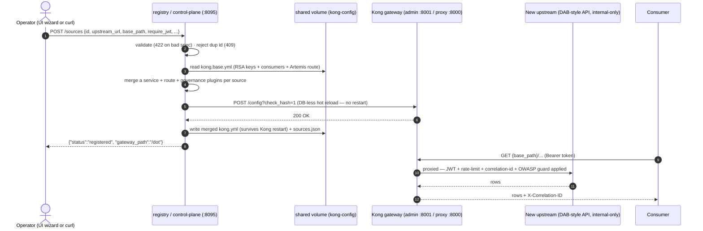

# 🔌 Add a data source — through the gateway, live

[Home](../README.md) > [Documentation](README.md) > **Add a data source**

> [!WARNING]
> **Illustrative reference · sample/synthetic data only · not an official NASA
> document.** Every source named here (Artemis procurement, the DOT bridge inventory) is
> **synthetic**. See **[DISCLAIMER.md](DISCLAIMER.md)** before sharing or adapting.

> [!NOTE]
> **TL;DR** — This guide teaches the demo's most persuasive moment: taking a brand-new
> data product from *"doesn't exist"* to *"governed, metered, and discoverable through the
> gateway"* in seconds — **without changing the source, taking downtime, or redeploying.**
> You'll do it two ways (a UI wizard and a scriptable API), follow one complete
> **add → query → remove** worked example with exact commands and expected output, and
> learn how the same gesture maps to **Azure API Management** + **Azure API Center** when
> you graduate the demo to the cloud.

---

## 📑 Table of contents

- [Why this exists (the problem it solves)](#-why-this-exists-the-problem-it-solves)
- [The Azure story first](#-the-azure-story-first)
- [How the live onboarding works](#-how-the-live-onboarding-works)
- [Prerequisites](#-prerequisites)
- [Option A — the onboarding wizard (UI)](#-option-a--the-onboarding-wizard-ui)
- [Option B — the API (scriptable, same result)](#-option-b--the-api-scriptable-same-result)
- [Worked example — add → query → remove, end to end](#-worked-example--add--query--remove-end-to-end)
- [Federating the real published DOT DAB demo](#-federating-the-real-published-dot-dab-demo)
- [Mapping the motion to Azure (APIM + API Center)](#-mapping-the-motion-to-azure-apim--api-center)
- [Gotchas / troubleshooting](#-gotchas--troubleshooting)
- [Why this matters](#-why-this-matters)
- [Where to next](#-where-to-next)

---

## 🎯 Why this exists (the problem it solves)

Picture a federal data marketplace that already publishes one data product — the Artemis
supply-chain risk API. A second team arrives and says: *"We already run an API in front of
our database. Make it available to the rest of the agency, with the same security and
metering everything else gets."*

There are two ways to answer that request.

The **slow, expensive** way is the **data-copy** pattern: pull the second team's data into
your platform, re-model it, hand-edit the gateway's config, redeploy, and take a
maintenance window to do it. Every copy is a new place data can leak, drift, or fall out of
compliance — and in a regulated (ITAR/CUI) environment, every copy is a new thing to
inventory and defend.

The **fast, safe** way is the **API-first, zero-move** pattern this whole proof-of-concept
argues for. You don't move the data at all. You **register where its API lives** and **how
it should be governed**, and the gateway learns one new upstream — at runtime, with no
restart. The source becomes a first-class, governed, discoverable product in seconds.

> **In plain terms:** onboarding a source is filling in a short form ("here's my API, here's
> how to secure it") and handing it to a front desk. The front desk walks over to the
> gateway, adds the new API to the gateway's rulebook, and tells the gateway to re-read the
> rulebook — all while the gateway keeps serving traffic. The data never leaves home.

A few terms used throughout, defined once (also in the [Glossary](GLOSSARY.md)):

| Term | What it means in this repo |
| --- | --- |
| **Gateway** | The single governed front door all data requests must pass through. Locally: **Kong OSS**. On Azure: **Azure API Management (APIM)**. |
| **Upstream** | The backend API the gateway forwards to (e.g. the DOT bridge API). The gateway never *is* the data; it *proxies* to the upstream. |
| **Source / data product** | A registered upstream the marketplace governs and lists. |
| **Registry / control-plane** | The small service that records a new source and reconfigures the gateway. Local analogue of an **API Center** registration + an **APIM** import. |
| **Zero-move** | The source's data is never copied; consumers reach it only *through* the gateway. |
| **Hot reload** | Swapping the gateway's running config in place — no restart, no dropped connections. |

---

## ☁️ The Azure story first

This proof-of-concept's **primary purpose is the Azure story** — *"deploy to Azure to show
the full art of the possible."* You run the open-source stack locally to develop and test
the onboarding flow; the **real demo** is the same flow expressed in managed Azure
services. So learn each local part as the rehearsal for its Azure counterpart:

| Local (this repo) | Azure managed equivalent | Role in onboarding a source |
| --- | --- | --- |
| **registry** service (`POST /sources`) | **Azure API Center** registration **+** **Azure API Management** API import | Records the new API as a governed product and publishes it on the gateway |
| **Kong gateway** (DB-less, `/config` reload) | **Azure API Management** (APIM) | The single governed front door; APIM imports an OpenAPI/backend and applies policy |
| **identity** issuer | **Microsoft Entra ID** | Issues and validates the tokens the gateway checks |
| **catalog** service | **APIM developer portal** / **Azure API Center** | The discoverable storefront of available data products |
| **classification_label** field | **Microsoft Purview** sensitivity label | The governance tag attached to the product |
| `kong.yml` declarative config | APIM **policies + API definitions** | The rulebook the gateway enforces |

> **Why this matters:** locally the registry *edits a YAML file and tells Kong to reload it.*
> On Azure, the same intent — *"publish this backend API behind the managed gateway with
> these policies, and catalogue it"* — is an **APIM API import** plus a **policy
> attachment**, recorded in **API Center**. Same outcome; the local flow is the rehearsal
> of the Azure motion. When you demo, narrate it as *"this is the Azure API Management
> import step, shown live and locally."*

There is one honest difference to know up front, because the UI surfaces it: **live,
in-the-room onboarding is a local-dev capability.** It needs the registry's shared
config volume and Kong's admin port — both present locally, neither present in the
Azure Container Apps deploy (one ingress port per app, no shared volume). In Azure the
sources are **pre-registered at deploy time**, and the managed equivalent of "add a source"
is running the APIM import once during deployment. The frontend reads a `liveOnboarding`
flag (`false` in the Azure config) and **hides the wizard**, showing instead a note that
explains the managed APIM / API Center equivalent. We return to this in
[Mapping the motion to Azure](#-mapping-the-motion-to-azure-apim--api-center).

---

## 🏗️ How the live onboarding works

When you onboard a source, three small services cooperate **through files on a shared
volume** (none of them call each other to coordinate). Here is the full round trip — from
the operator's click to rows returned through the gateway:



The key design points, each grounded in the code:

- **The registry never touches the data.** It lives on the client-reachable `edge` network
  and talks only to Kong's admin API and the shared file. The data sources live on the
  locked-down `internal` network; the only path to their data is *through Kong*. That is the
  zero-move guarantee, and `tests/test_zero_move.py` proves the data is unreachable
  directly. (See [`services/registry/app.py`](../services/registry/app.py) and
  [`docker-compose.yml`](../docker-compose.yml).)
- **Reload first, persist second.** The registry POSTs the full merged config to Kong and
  only writes `kong.yml`/`sources.json` *after* Kong accepts it. If Kong rejects the config
  (bad upstream, malformed path), you get a **502** and nothing is persisted — the on-disk
  state never claims a success the gateway didn't actually accept.
- **A wizard-added source is never weaker than the built-in one.** `_kong_route_for(src)`
  attaches the *same* governance stack the first-party Artemis route has — even a "public"
  (no-JWT) source still gets the abuse guard and the identity-header scrub. The deep,
  plugin-by-plugin explanation lives in the service doc:
  [`services/registry/README.md`](../services/registry/README.md).

---

## 📋 Prerequisites

Before you onboard a source, make sure the stack is up and you know which host ports it is
using.

1. **The `core` stack is healthy.** From a clean clone with Docker installed:

   ```bash
   cp .env.example .env
   make demo
   ```

   `make demo` starts the core stack, seeds the synthetic Artemis data, and prints the
   supply-risk answer through Kong. (Internally it runs `docker compose --profile core up
   -d`, waits for health, seeds, then `scripts/demo.sh`.) You only need the stack *up* for
   onboarding; `make up` alone is enough if you've already seeded.

2. **For the UI path, start the frontend too.** The catalog SPA is on its own Compose
   profile, so it does **not** come up with `core`:

   ```bash
   make ui          # docker compose --profile frontend up -d --build
   ```

   Then open <http://localhost:5173>.

3. **Know your ports.** The defaults are below. If your dev box already binds any of these
   (a common collision), remap the host ports in `.env` and substitute your mapped ports
   everywhere in this guide.

   | Service | Default host port | Role in onboarding |
   | --- | --- | --- |
   | **registry** | `8095` | Where you `POST`/`DELETE` a source (the control-plane) |
   | **identity** | `8081` | Mints the bearer token your query needs |
   | **Kong proxy** | `8000` | The gateway you query the new source *through* |
   | **catalog** | `8080` | Where the new source shows up as discoverable |
   | **frontend** | `5173` | The wizard UI (only with `make ui`) |

> [!TIP]
> Two paths, one result. The **UI wizard** (Option A) and the **scriptable API**
> (Option B) call the *same* registry endpoint (`POST /sources`). The source ends up
> governed and discoverable through Kong either way — no source change, no downtime, no
> redeploy. Use the UI to *show* the moment; use the API to *script* it (CI, demos, repeat
> runs).

---

## 🚀 Option A — the onboarding wizard (UI)

The wizard ([`frontend/src/components/AddSourceWizard.jsx`](../frontend/src/components/AddSourceWizard.jsx))
is a guided 4-step modal, **pre-filled with the DOT example** so a presenter can publish in
seconds. With `make ui` running and <http://localhost:5173> open:

1. Click **"+ Add a data source."**
2. Step through the four steps (the field names below match the form exactly):
   - **Identify** — `id` (`dot-bridges`), `title`, `domain`, `owner`.
   - **Connect** — `upstream_url` (`http://transportation:8200`), `base_path` (`/dot`), and
     a `sample_path` (the example query the wizard will replay to prove it works). The step
     also tips you that to federate the *live* published demo you only change the upstream
     to its `https://…azurecontainerapps.io` URL.
   - **Govern** — toggle **Require JWT** (auth + per-consumer rate limiting) and pick a
     **Classification** (`Routine` / `Sensitive` / `Confidential`). The form reminds you
     that the *same* governance Artemis has — JWT validation, 60/min per consumer,
     correlation id, CORS — is applied automatically.
   - **Review & publish** — the final step shows the exact JSON spec; click **Publish
     through gateway.**
3. The wizard proves it on the spot. On success it shows **✓ Published**, then immediately
   replays the `sample_path` *through Kong* and reports **HTTP status**, the **correlation
   id** Kong stamped, and the **row count** returned from the new source. The new card
   appears in the marketplace, queryable like any other product.

> [!NOTE]
> The "instant proof" is the whole point of the wizard. Anyone can claim a source is
> onboarded; the wizard *demonstrates* it by calling the new path through the gateway and
> surfacing the gateway-stamped `X-Correlation-ID`. The upstream never sets that header, so
> its presence is your evidence the call really went through Kong.

---

## ⌨️ Option B — the API (scriptable, same result)

Everything the wizard does is one `POST` to the registry. This is the path to script in CI
or a repeatable demo. The full, copy-pasteable run with expected output is in the next
section; here is the shape of each call:

```bash
# 1. Register the source (the registry validates, merges the route, hot-reloads Kong):
curl -s -X POST http://localhost:8095/sources \
  -H 'Content-Type: application/json' \
  -d '{
    "id": "dot-bridges",
    "title": "DOT Transportation - Bridge Inventory",
    "upstream_url": "http://transportation:8200",
    "base_path": "/dot",
    "owner": "US DOT (synthetic)",
    "domain": "Transportation / Infrastructure",
    "classification_label": "Routine",
    "require_jwt": true,
    "sample_path": "/dot/api/Bridge?$orderby=condition_rating asc&$first=5"
  }' | jq .

# 2. Mint a bearer token from the identity issuer (the Entra ID stand-in):
TOKEN=$(curl -s -X POST http://localhost:8081/token \
  -H 'Content-Type: application/json' \
  -d '{"consumer":"analyst"}' | jq -r .access_token)

# 3. Query the NEW source THROUGH the gateway (governed exactly like Artemis):
curl -s -H "Authorization: Bearer $TOKEN" \
  "http://localhost:8000/dot/api/Bridge?\$orderby=condition_rating%20asc&\$first=5" | jq .

# 4. No token -> 401 at the edge (the upstream is never reached):
curl -s -o /dev/null -w "%{http_code}\n" http://localhost:8000/dot/api/Bridge

# 5. It now appears in the catalog:
curl -s http://localhost:8080/catalog | jq '.products[] | {id, title, origin}'

# 6. Remove it again (hot reload):
curl -s -X DELETE http://localhost:8095/sources/dot-bridges | jq .
```

> [!NOTE]
> **Shell quoting for OData.** OData query options begin with `$` (`$orderby`, `$first`,
> `$filter`). In a double-quoted URL, escape them as `\$` so your shell doesn't try to
> expand them as variables, and URL-encode the space in `condition_rating asc` as `%20`.
> The registry accepts the unescaped `$`/spaces inside the JSON body in step 1 (it's a
> string there); only the *URL* in step 3 needs the escaping.

---

## 🧪 Worked example — add → query → remove, end to end

This is the exact flow the live demo performs against the synthetic DOT bridge source. It
proves the new source is governed *identically* to Artemis (200 with a token, 401 without)
and then cleans up. Run it with the `core` stack up. Each step says **what it did and why.**

### 1. Register the source

```bash
curl -s -X POST http://localhost:8095/sources \
  -H 'Content-Type: application/json' \
  -d '{
    "id": "dot-bridges",
    "title": "DOT Transportation - Bridge Inventory",
    "upstream_url": "http://transportation:8200",
    "base_path": "/dot",
    "owner": "US DOT (synthetic)",
    "domain": "Transportation / Infrastructure",
    "classification_label": "Routine",
    "require_jwt": true,
    "sample_path": "/dot/api/Bridge?$orderby=condition_rating asc&$first=5"
  }' | jq .
```

Expected output:

```json
{
  "status": "registered",
  "source": {
    "id": "dot-bridges",
    "title": "DOT Transportation - Bridge Inventory",
    "upstream_url": "http://transportation:8200",
    "base_path": "/dot",
    "owner": "US DOT (synthetic)",
    "domain": "Transportation / Infrastructure",
    "classification_label": "Routine",
    "require_jwt": true,
    "sample_path": "/dot/api/Bridge?$orderby=condition_rating asc&$first=5"
  },
  "gateway_path": "/dot"
}
```

**What happened and why:** the registry validated the body against its `SourceSpec` model,
confirmed no `dot-bridges` source already existed, merged a `src-dot-bridges` Kong service
+ route + governance plugins onto the identity-rendered base config, and **hot-reloaded
Kong** via its admin `/config` endpoint. The `/dot` route now exists and **no process
restarted.** Only after Kong accepted did the registry persist `kong.yml` and
`sources.json`.

### 2. Mint a bearer token

```bash
TOKEN=$(curl -s -X POST http://localhost:8081/token \
  -H 'Content-Type: application/json' \
  -d '{"consumer":"analyst"}' | jq -r .access_token)
echo "${TOKEN:0:24}…"
```

Expected output (a truncated JWT — yours will differ):

```text
eyJhbGciOiJSUzI1NiIsImt…
```

**What happened and why:** the identity issuer (the Entra ID stand-in) minted a short-lived
RS256 JWT whose `client_id` claim is `analyst`. Kong's `jwt` plugin uses that claim to map
the call to the `analyst` consumer for per-consumer metering. Valid consumers are `analyst`
and `artemis-agent`; asking for any other name returns a 400.

### 3. Query the new source through the gateway

```bash
curl -s -i -H "Authorization: Bearer $TOKEN" \
  "http://localhost:8000/dot/api/Bridge?\$orderby=condition_rating%20asc&\$first=3" \
  | grep -iE '^(HTTP|X-Correlation-ID)'
```

Expected (header excerpt):

```text
HTTP/1.1 200 OK
X-Correlation-ID: a1b2c3d4-5e6f-7a8b-9c0d-112233445566#1
```

Drop the `-i | grep` and pipe the body through `jq .` to see the worst-condition bridges:

```bash
curl -s -H "Authorization: Bearer $TOKEN" \
  "http://localhost:8000/dot/api/Bridge?\$orderby=condition_rating%20asc&\$first=3" | jq '.value[] | {bridge_id, name, condition_rating, status}'
```

```json
{ "bridge_id": "DOT-0012", "name": "Cobalt Ridge Flyover (SYNTHETIC)", "condition_rating": 2, "status": "Structurally Deficient" }
{ "bridge_id": "DOT-0003", "name": "Meridian Bay Bridge (SYNTHETIC)", "condition_rating": 3, "status": "Structurally Deficient" }
{ "bridge_id": "DOT-0007", "name": "Beacon Harbor Drawbridge (SYNTHETIC)", "condition_rating": 3, "status": "Structurally Deficient" }
```

**What happened and why:** Kong accepted the token (mapping it to the `analyst` consumer),
applied per-consumer rate-limiting and the OWASP guard, **stripped** the `/dot` prefix and
forwarded the request to the upstream as `/api/Bridge`, and stamped the
`X-Correlation-ID`. The upstream sorted the synthetic bridges by `condition_rating`
ascending (worst first) and returned three. The correlation id is your **proof** the call
went through the gateway — the DOT upstream never sets that header.

### 4. Prove the edge enforces auth (no token → 401)

```bash
curl -s -o /dev/null -w "%{http_code}\n" http://localhost:8000/dot/api/Bridge
```

Expected output:

```text
401
```

**What happened and why:** the `jwt` plugin rejected the request at the edge **before it
ever reached the DOT upstream** — exactly the behavior the built-in Artemis route has. A
federated source is not a softer target than the first-party one.

### 5. (Optional) Prove the rate limit (over-limit → 429)

The route enforces 60 requests/minute per consumer. To watch the limit trip, hammer it in a
tight loop and look for the first `429`:

```bash
for i in $(seq 1 70); do
  curl -s -o /dev/null -w "%{http_code} " -H "Authorization: Bearer $TOKEN" \
    "http://localhost:8000/dot/api/Bridge?\$first=1"
done; echo
```

Expected output (a run of `200`s, then `429`s once you cross 60 in the window):

```text
200 200 200 … 200 429 429 429 …
```

**What happened and why:** the `rate-limiting` plugin counts calls *per consumer*
(`limit_by: consumer`) and returns **429 Too Many Requests** past the quota — the same
metering the Artemis route gets. (The exact limit comes from `RATE_LIMIT_PER_MINUTE`,
default 60.)

### 6. Confirm it's discoverable in the catalog

```bash
curl -s http://localhost:8080/catalog | jq '.products[] | {id, title, origin}'
```

Expected output (the built-in Artemis product plus the freshly registered DOT source):

```json
{ "id": "artemis-supply-risk", "title": "Artemis Supply-Chain Risk API", "origin": "built-in" }
{ "id": "dot-bridges", "title": "DOT Transportation - Bridge Inventory", "origin": "registered via onboarding wizard" }
```

**What happened and why:** the catalog reads the same `sources.json` the registry wrote, so
the new source shows up as a discoverable product **with no extra step** — no tribal
knowledge, no wiki page to update. (Exact Artemis title/fields come from
`services/catalog/catalog.json`; the `origin` distinguishes built-in from registered.)

### 7. Remove it again (hot reload)

```bash
curl -s -X DELETE http://localhost:8095/sources/dot-bridges | jq .
```

Expected output:

```json
{ "status": "removed", "id": "dot-bridges" }
```

**What happened and why:** the registry rebuilt the merged config **from base** without the
DOT source, hot-reloaded Kong, and updated `sources.json`. The `/dot` route is gone with no
leftover state — re-running step 3 now returns 404. Because the rebuild always starts from
base, there is never a stale, half-removed route to clean up.

> [!TIP]
> Want to delete the source from the UI instead? Each registered card carries a remove
> control (hidden when `liveOnboarding` is `false`, i.e. in the Azure deploy). Removing it
> calls the same `DELETE /sources/{id}` endpoint.

---

## 🌐 Federating the **real** published DOT DAB demo

The local `transportation` service is a stand-in for the published
[`azure-dab-fullstack-demo`](https://github.com/fgarofalo56/azure-dab-fullstack-demo) — a
Data API Builder API over DOT transportation data running on Azure Container Apps. To
federate the **live** deployment instead of the local stand-in, register the same source
with its public URL as the upstream — **nothing else changes**, which is exactly the point:

```bash
curl -s -X POST http://localhost:8095/sources -H 'Content-Type: application/json' -d '{
  "id": "dot-live",
  "title": "DOT Transportation (Azure, live)",
  "upstream_url": "https://<your-dab-app>.<region>.azurecontainerapps.io",
  "base_path": "/dot-live",
  "owner": "US DOT",
  "domain": "Transportation",
  "require_jwt": true,
  "sample_path": "/dot-live/api/<Entity>?$first=5"
}' | jq .
```

Then `GET http://localhost:8000/dot-live/api/<Entity>` with a bearer token is brokered to
the live Azure DAB API **through Kong** — same governance (JWT, rate-limit, correlation id),
no change to the remote source. You've just federated a real, remote, unmodified Azure API
into your local marketplace.

> [!NOTE]
> **Notes for the live endpoint**
> - The published demo's Container App may **scale to zero** or be torn down — confirm the
>   URL resolves first: `curl -I https://<your-dab-app>.<region>.azurecontainerapps.io/api/openapi`.
> - If the upstream itself requires **Microsoft Entra** auth (tenant-only access), inject an
>   `Authorization`/key header on the route (Kong `request-transformer`) or front it with a
>   service principal. That is the production hardening step; the local stand-in deliberately
>   skips it to keep the demo self-contained.

---

## 🗺️ Mapping the motion to Azure (APIM + API Center)

When you take this to Azure, "add a source" splits into the two managed gestures it always
implicitly was: **register the API** (API Center) and **publish + govern it on the gateway**
(API Management). Here is the local-to-Azure correspondence, step by step:

| Local onboarding step | Azure equivalent |
| --- | --- |
| `POST /sources` validates and records the spec | Register the API in **Azure API Center** (its inventory of governed APIs) |
| Registry merges a Kong service + route from the spec | `az apim api import` brings the backend in from its OpenAPI |
| Registry attaches the governance plugin stack | An **APIM policy** applies the same controls (token validation, rate-limit, correlation id) |
| Kong hot-reloads the merged config | APIM applies the policy/API change to the managed gateway |
| Catalog lists the new source from `sources.json` | The **APIM developer portal** / **API Center** surfaces the published API |

The real deploy script [`scripts/azure-deploy-apim.sh`](../scripts/azure-deploy-apim.sh)
performs exactly this for the Artemis API — it is the Azure analogue of one `POST /sources`.
The two load-bearing steps:

```bash
# Import the DAB REST API from its OpenAPI (the APIM equivalent of merging a Kong route):
az apim api import -g "$RG" --service-name "$APIM" \
  --path api --api-id artemis-procurement \
  --display-name "Artemis Supply-Chain Risk API" \
  --specification-format OpenApi --specification-url "$DAB/api/openapi" \
  --service-url "$DAB/api" --protocols https
```

```xml
<!-- The APIM policy that mirrors the Kong plugin stack (rate-limit + correlation id;
     Entra token validation is the documented tenant-lock upgrade): -->
<inbound>
  <base />
  <rate-limit-by-key calls="60" renewal-period="60"
    counter-key="@(context.Subscription?.Id ?? context.Request.IpAddress)" />
  <set-header name="X-Correlation-ID" exists-action="skip">
    <value>@(context.RequestId.ToString())</value>
  </set-header>
</inbound>
```

> [!IMPORTANT]
> **Live onboarding is a local-dev feature; Azure pre-registers sources.** The in-the-room
> wizard needs the registry's shared config volume and Kong's admin port, which the Azure
> Container Apps deploy does not have (one ingress port per app, no shared volume). So the
> Azure config sets `liveOnboarding: false`, the SPA **hides** the wizard and remove
> buttons, and shows a note explaining the managed APIM / API Center equivalent. Sources are
> baked in at deploy time: the catalog reads them from the `SOURCES_JSON` environment
> variable instead of a shared `sources.json` (see
> [`services/catalog/app.py`](../services/catalog/app.py) and
> [`frontend/src/api.js`](../frontend/src/api.js)). The *gesture* is identical — register an
> existing upstream and govern it — it just runs through the managed control-plane.

> [!WARNING]
> The local registry has **wide-open CORS and no auth on its own endpoints** — fine for a
> self-contained local demo, **not** for production. On Azure, the control-plane motion is
> an authenticated APIM / API Center operation behind Entra ID, never an open `POST`.

---

## 🧯 Gotchas / troubleshooting

| Symptom | Likely cause | What to do |
| --- | --- | --- |
| `422 Unprocessable Entity` on POST | `SourceSpec` validation failed (usually the `id` slug). | `id` must match `^[a-z0-9][a-z0-9-]{1,40}$`; ensure required fields (`title`, `upstream_url`, `base_path`) are present. |
| `409 source '<id>' already registered` | An `id` collision. | Use a unique `id`, or `DELETE` the existing one first. |
| `502 Kong reload failed: ...` | Kong rejected the merged config (bad upstream URL, malformed path, plugin error). | Read the message — it includes Kong's response. The registry did **not** persist, so on-disk state is still consistent; fix the spec and re-POST. |
| `503 base Kong config /shared/kong.base.yml not found yet` | The registry started before identity rendered the base. | Confirm `identity` is healthy; `depends_on` should prevent this, but on a cold volume give it a moment and retry. |
| New route returns `404` through Kong | `base_path` typo, or you queried the upstream's native path without the gateway prefix. | Call `{base_path}` + the upstream path (e.g. `/dot/api/Bridge`); Kong strips `/dot` before forwarding. |
| Got `401` even with a token | Expired/wrong token, or you minted it for a name that isn't `analyst`/`artemis-agent`. | Re-mint a fresh token; tokens are short-lived (default 1h TTL). |
| Source vanished after `docker compose down -v` | `-v` removes the `kong-config` volume (and `sources.json`). | Expected — that volume holds the registered-source state. Re-register, or omit `-v`. |
| The "+ Add a data source" button is missing | `liveOnboarding: false` (the Azure-style config), or the frontend profile isn't up. | Run `make ui`; for the wizard, ensure `config.js` omits or sets `liveOnboarding: true`. |

---

## ✨ Why this matters

- **API-first, not data-copy.** The new source is exposed *as an API*; its data stays put.
  Fewer copies means a smaller attack and compliance surface — the difference that matters
  most in an ITAR/CUI environment.
- **Govern at the edge, uniformly.** Every source — built-in or added — gets the same JWT,
  rate-limit, correlation id, OWASP guard, and metering. A federated source is never a
  softer target than the first-party one, and that parity is *tested*
  ([`tests/test_registry_config.py`](../tests/test_registry_config.py)).
- **Discoverable by default.** The catalog and UI show the new product immediately — no
  tribal knowledge, no wiki to update.
- **One swap to Azure.** The same registration maps to publishing an API in **Azure API
  Management** and recording it in **Azure API Center**, in front of DAB on Container Apps
  (or Dataverse) — which is the whole "art of the possible" the demo is built to show.

---

## 🧭 Where to next

- **[`services/registry/README.md`](../services/registry/README.md)** — the deep service
  reference: every endpoint, the plugin-by-plugin route construction, and the shared-volume
  contract between registry, identity, and Kong.
- **[`docs/concepts/02-api-gateways.md`](concepts/02-api-gateways.md)** — why a gateway
  exists at all, and how Kong maps to APIM (teaching chapter).
- **[`docs/concepts/04-identity-jwt-oauth.md`](concepts/04-identity-jwt-oauth.md)** — what
  the bearer token is and how the gateway validates it (Entra ID analogue).
- **[`docs/ZERO-MOVE.md`](ZERO-MOVE.md)** — how the demo *proves* the data never moves.
- **[`docs/APIM-CAPABILITIES.md`](APIM-CAPABILITIES.md)** · **[`docs/APIM-EDITION.md`](APIM-EDITION.md)**
  — the Azure API Management mapping and the APIM-as-gateway edition of the demo.
- **[`docs/AZURE-DEPLOYMENT.md`](AZURE-DEPLOYMENT.md)** — deploying the whole stack to Azure
  (where sources are pre-registered).
- **[`services/transportation/README.md`](../services/transportation/README.md)** — the
  synthetic DOT source used as the second upstream here.

---

> _Synthetic data only. This document is an illustrative reference, not an official NASA
> document. See [`docs/DISCLAIMER.md`](DISCLAIMER.md)._
