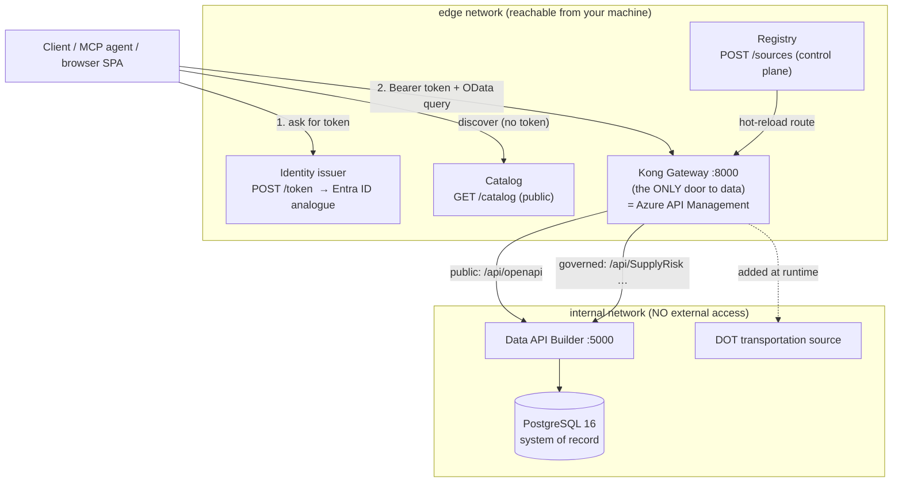
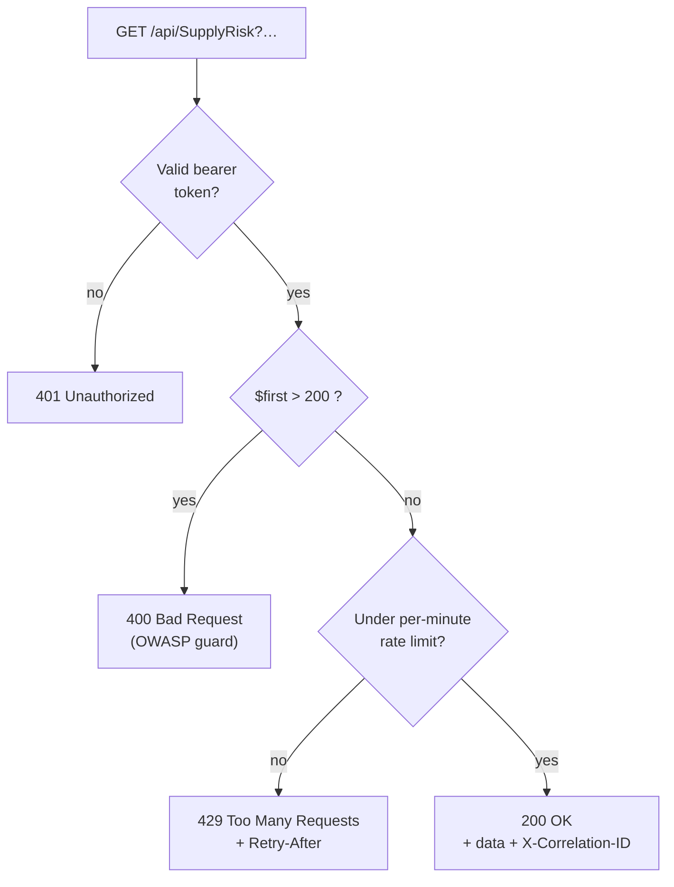

# 🔌 API Contract Reference

[Home](../README.md) > [Documentation](README.md) > **API Contract**

> [!NOTE]
> **TL;DR** — Every read of the data goes through **one front door: the Kong gateway**
> (`http://localhost:8000` locally; **Azure API Management** in the cloud demo). You
> first ask the **identity issuer** (`POST /token`, the local stand-in for **Microsoft
> Entra ID**) for a short-lived bearer token, then call a **governed route** such as
> `GET /api/SupplyRisk?$filter=…`. The gateway answers with a strict, predictable
> contract: **401** (no/invalid token) · **200** (allowed) · **429** (over your rate
> limit) · **400** (over-broad query blocked) — and **every** response carries an
> `X-Correlation-ID` so the call is traceable end-to-end. Two routes are deliberately
> **public** (no token): the OpenAPI contract and the marketplace catalog, so the data
> product is *findable* before it is *callable*. All data is **synthetic** — see
> [`DISCLAIMER.md`](DISCLAIMER.md).

This is the single contract reference for the whole system. If you only read one API
document, read this one. It tells you exactly which URLs exist, which need a token,
what they return, and how the system behaves when you do something wrong.

---

## 📑 Table of Contents

- [🎯 Why this document exists](#-why-this-document-exists)
- [☁️ Azure-first framing: which managed service each piece maps to](#️-azure-first-framing-which-managed-service-each-piece-maps-to)
- [🗺️ The big picture: public vs governed](#️-the-big-picture-public-vs-governed)
- [🔢 Base URLs and ports](#-base-urls-and-ports)
- [🔑 Step 1 — Get a token from the identity issuer](#-step-1--get-a-token-from-the-identity-issuer)
- [🚪 Step 2 — Call a governed route through Kong](#-step-2--call-a-governed-route-through-kong)
- [📜 The status-code contract: 401 / 200 / 429 / 400](#-the-status-code-contract-401--200--429--400)
- [🧵 The X-Correlation-ID contract](#-the-x-correlation-id-contract)
- [🔍 OData query options (the query language)](#-odata-query-options-the-query-language)
- [📚 Public route: the OpenAPI contract](#-public-route-the-openapi-contract)
- [🏷️ The catalog API (marketplace discovery)](#️-the-catalog-api-marketplace-discovery)
- [➕ The registry API (add a source through the gateway)](#-the-registry-api-add-a-source-through-the-gateway)
- [🌉 The transportation source (second data product)](#-the-transportation-source-second-data-product)
- [🧰 Full endpoint reference table](#-full-endpoint-reference-table)
- [⚠️ Gotchas / troubleshooting](#️-gotchas--troubleshooting)
- [➡️ Where to next](#️-where-to-next)

---

## 🎯 Why this document exists

The core idea of this proof-of-concept (POC) is **API-first, zero-move** data sharing.
Let us define both terms before going further, because the entire contract is shaped by
them.

- **API-first** means consumers never get a database connection string, a file extract,
  or a copy of the data. They get a *governed HTTP API*. The contract — the set of URLs,
  inputs, and outputs documented here — *is* the product.
- **Zero-move** means the data physically never leaves its system of record (the
  PostgreSQL database). There is no nightly export, no replicated copy, no data lake
  landing zone. When you call the API, the gateway reaches *into* the source on your
  behalf and streams back exactly the rows you asked for. Nothing is copied to a new
  home where it could leak.

> **In plain terms:** instead of mailing everyone a photocopy of a sensitive ledger
> (which you then can't un-send), you put the ledger behind a service window. People walk
> up, show ID, ask a specific question, and a clerk reads back just the answer. The
> ledger never leaves the room. This document is the list of questions the window will
> answer and the ID it requires.

> **Why this matters (the enterprise story):** for regulated data (ITAR, CUI, PII), every
> *copy* is a new place a breach can happen and a new thing an auditor must track.
> Collapsing access to a single, logged, authenticated front door is the whole value
> proposition. The contract below is how that front door is specified so that auditors,
> client developers, and operators all agree on the same rules.

Acronyms used throughout, defined once here:

| Term | Meaning |
| --- | --- |
| **JWT** | JSON Web Token — a signed, tamper-evident token you present to prove who you are. |
| **RS256** | The signature algorithm (RSA + SHA-256). The issuer signs with a *private* key; Kong verifies with the matching *public* key. |
| **OAuth2 bearer** | The pattern of putting a token in an `Authorization: Bearer <token>` header. |
| **OData** | A URL query convention (`$filter`, `$orderby`, …) for filtering/sorting REST collections. |
| **DAB** | Microsoft **Data API Builder** — generates REST + GraphQL + OpenAPI automatically from a database. |
| **SoR** | System of Record — the authoritative source, here PostgreSQL. |
| **MCP** | Model Context Protocol — a standard way to expose a capability as a tool an AI agent can call. |

---

## ☁️ Azure-first framing: which managed service each piece maps to

This POC runs locally on Docker so you can develop and test the *pattern* on a laptop.
But the **primary story is Azure** — the local open-source components are stand-ins that
let you prove the architecture before deploying the managed Azure equivalents. Read each
local component below as "the analogue of its Azure service":

| What you call locally | Local component (this repo) | Azure managed service it stands in for |
| --- | --- | --- |
| The gateway (the *only* front door) | **Kong Gateway OSS** | **Azure API Management (APIM)** |
| Where you get a token | **Local RS256 JWT issuer** (`services/identity`) | **Microsoft Entra ID** (OAuth2 / OIDC) |
| What actually serves the data | **Data API Builder** on a container | **Container Apps** running DAB |
| Sensitivity labels in the catalog | **`data/classification.yml`** | **Microsoft Purview** |
| Per-consumer traffic metrics | **Prometheus + Grafana** | **Azure Monitor + Microsoft Sentinel** |
| The downstream lakehouse (analytics) | (documented path) | **Azure Databricks + Unity Catalog** |

> **Why this matters:** the contract in this file is *identical* whether you run Kong on
> your laptop or APIM in Azure Government. You write your client once against these URLs
> and status codes; deploying to Azure swaps the implementation behind the contract, not
> the contract itself. That is the payoff of being API-first.

For the full cloud walkthrough, see [`AZURE-DEPLOYMENT.md`](AZURE-DEPLOYMENT.md) and
[`APIM-EDITION.md`](APIM-EDITION.md).

---

## 🗺️ The big picture: public vs governed

There are two classes of route, and the distinction is the heart of the contract.

- **Public routes (no token).** These exist so the data product is *discoverable*: a new
  team can find it, read its shape, and decide whether to request access — all without
  credentials. Discovery metadata is not sensitive; the data behind it is. The public
  routes are the **OpenAPI contract** (`/api/openapi`) and the **catalog** (`/catalog`).
- **Governed routes (token required).** These return actual data. They sit behind the
  full stack of gateway controls: JWT validation, per-consumer rate limiting, an OWASP
  over-broad-extraction guard, and identity-header stripping. The governed routes are the
  entity collections (`/api/Material`, `/api/Vendor`, `/api/PurchaseOrder`,
  `/api/SupplyRisk`) and `/graphql`.



> **In plain terms:** Postgres and DAB are in a locked back room (the `internal` network)
> with no door to the outside. Kong is the only service standing in both rooms, so the
> only way in is to walk past Kong. The tests in
> [`tests/test_zero_move.py`](../tests/test_zero_move.py) prove the back room really is
> sealed — see [`ZERO-MOVE.md`](ZERO-MOVE.md).

---

## 🔢 Base URLs and ports

When you run the stack locally with `docker compose --profile core up -d`, the following
host ports are published (defaults from `docker-compose.yml`; override via `.env`):

| Service | Local base URL | Default port (env var) | Needs token? | Purpose |
| --- | --- | --- | --- | --- |
| **Kong gateway (proxy)** | `http://localhost:8000` | `8000` (`KONG_PROXY_PORT`) | governed routes only | The single front door to all data. |
| **Identity issuer** | `http://localhost:8081` | `8081` (`ISSUER_PORT`) | no | Mint tokens, publish JWKS / public key. |
| **Catalog** | `http://localhost:8080` | `8080` (`CATALOG_PORT`) | no | Marketplace listing + product detail. |
| **Registry (control plane)** | `http://localhost:8095` | `8095` (`REGISTRY_PORT`) | no (demo) | Register a new source through the gateway. |
| **MCP server** | `http://localhost:8090` | `8090` (`MCP_PORT`) | n/a (calls Kong itself) | Agent tool `query_supply_risk`. |
| **Kong Admin API** | `http://localhost:8001` | `8001` (`KONG_ADMIN_PORT`) | no (demo) | DB-less hot reload, plugin state. |
| **Kong Manager (GUI)** | `http://localhost:8002` | `8002` (`KONG_MANAGER_PORT`) | no | Read-only admin GUI. |
| **Prometheus** | `http://localhost:9090` | `9090` (`PROMETHEUS_PORT`) | no | Scrapes Kong `/metrics`. |
| **Grafana** | `http://localhost:3000` | `3000` (`GRAFANA_PORT`) | no | Per-consumer traffic dashboards. |

> [!WARNING]
> **Local port collisions are common.** On a typical dev box, ports `8000`, `8001`,
> `8080`, and `3000` are often already bound by other tools. If `docker compose up`
> reports a bind error, remap the *host* side via the env vars above (for example
> `KONG_PROXY_PORT=18000`) in your `.env` and re-run. The examples below assume the
> defaults; substitute your remapped ports.

> [!NOTE]
> **In Azure**, these collapse: the gateway base URL becomes your **APIM** hostname
> (`https://<your-apim>.azure-api.net`), the token endpoint becomes a **Microsoft Entra
> ID** OAuth2 token URL, and the catalog/registry map to the **APIM developer portal /
> API Center**. The *paths and contract* (`/api/SupplyRisk`, `$filter`, the 401/200/429
> behavior) stay the same.

---

## 🔑 Step 1 — Get a token from the identity issuer

Before you can call a governed route, you need a bearer token. Locally, the identity
issuer mints one for you with no password — this is a demo issuer that stands in for the
real OAuth2 flow you would use against **Microsoft Entra ID** in Azure.

> **In plain terms:** the issuer is the badge office. You tell it which consumer (which
> "department badge") you are, and it hands you a time-limited badge signed in a way the
> gateway can verify but not forge.

### `POST /token`

| Field | Value |
| --- | --- |
| **Method / URL** | `POST http://localhost:8081/token` |
| **Auth** | None (demo issuer) |
| **Body** | `{ "consumer": "analyst" }` — one of `analyst` or `artemis-agent` |

The two consumers exist so per-consumer metering is visible in Grafana: a human
**`analyst`** and an automated **`artemis-agent`** (the MCP tool uses the latter). Asking
for any other consumer returns **400**.

**Worked example — request a token for the analyst consumer:**

```bash
curl -s -X POST http://localhost:8081/token \
  -H "Content-Type: application/json" \
  -d '{"consumer":"analyst"}'
```

**Expected output (token shortened):**

```json
{
  "access_token": "eyJhbGciOiJSUzI1NiIsImtpZCI6ImFydGVtaXMtbG9jYWwta2V5LTEifQ...",
  "token_type": "Bearer",
  "expires_in": 3600,
  "consumer": "analyst"
}
```

**What just happened and why:** the issuer signed a JWT with its private RS256 key and
embedded a `client_id` claim equal to `"analyst"`. The token is valid for one hour
(`expires_in: 3600`). Kong is configured (`key_claim_name: client_id`) to read that
`client_id` claim and map the call to the matching Kong *consumer* — which is how
per-consumer rate limiting and metering work. You never send a username/password to the
gateway; the signed token *is* your identity.

### Supporting identity endpoints

| Endpoint | Purpose |
| --- | --- |
| `GET /healthz` | Liveness probe: `{ "status": "ok", "issuer": "https://issuer.local" }`. |
| `GET /.well-known/jwks.json` | The public key in JWKS form (how a standard validator discovers the key). |
| `GET /public.pem` | The raw public key PEM (used to render Kong's JWT config at startup). |

> [!NOTE]
> The issuer renders its live public key into Kong's config at startup, so the gateway
> validates exactly the tokens this issuer mints. No key material is ever committed to
> git. In Azure, this is replaced by Entra ID's published JWKS endpoint, which APIM
> validates against automatically.

---

## 🚪 Step 2 — Call a governed route through Kong

Now use the token. A governed call is just an HTTP `GET` to a Kong path with an
`Authorization: Bearer <token>` header and (usually) an OData query string.

### The headline question

The whole demo is built to answer one realistic supply-chain question:

> *"Which Critical, sole-source materials on Artemis-3 have an average delay greater than
> 30 days?"*

That question maps directly onto an OData filter against the `SupplyRisk` entity.

**Worked example — full two-step call (token, then governed query):**

```bash
# 1) get a token and capture it
TOKEN=$(curl -s -X POST http://localhost:8081/token \
  -H "Content-Type: application/json" \
  -d '{"consumer":"analyst"}' | python -c "import sys,json;print(json.load(sys.stdin)['access_token'])")

# 2) ask the governed route the headline question
curl -s -i "http://localhost:8000/api/SupplyRisk?\$filter=program%20eq%20'Artemis-3'%20and%20criticality%20eq%20'Critical'%20and%20sole_source%20eq%20true%20and%20avg_delay_days%20gt%2030&\$orderby=risk_score%20desc" \
  -H "Authorization: Bearer $TOKEN"
```

**Expected output (headers + a row, abbreviated):**

```http
HTTP/1.1 200 OK
Content-Type: application/json; charset=utf-8
X-Correlation-ID: 1a2b3c4d-0001
RateLimit-Remaining: 59
```

```json
{
  "value": [
    {
      "matnr": "MAT-100237",
      "maktx": "Cryogenic Valve Assembly (SYNTHETIC)",
      "program": "Artemis-3",
      "criticality": "Critical",
      "sole_source": true,
      "po_count": 6,
      "late_po_count": 5,
      "avg_delay_days": 41.5,
      "risk_score": 88,
      "risk_tier": "High"
    }
  ]
}
```

**What just happened and why:**

1. Kong received the request and the `jwt` plugin verified the token's signature and
   `exp` (expiry) claim against the issuer's public key. Valid → the request proceeds.
2. The `rate-limiting` plugin counted this call against the `analyst` consumer's
   per-minute quota and reported the remaining budget in `RateLimit-Remaining`.
3. The `correlation-id` plugin stamped an `X-Correlation-ID` and echoed it back, so the
   same id appears in Kong's logs, Prometheus labels, and your response.
4. The `request-transformer` plugin stripped any client-supplied identity headers (more
   on this below), guaranteeing DAB serves the redacted `anonymous` role.
5. Kong proxied to Data API Builder, which ran the OData filter as a SQL query against
   Postgres and returned the matching rows in DAB's standard `{ "value": [ … ] }`
   envelope. The data never left Postgres — only the answer came back.

> **Why this matters:** notice you got an *answer*, not a *dataset*. You asked a precise
> question and the system of record returned exactly the matching rows. That is zero-move
> in action: no extract, no copy, fully logged.

### The governed entities

The governed REST routes correspond to four database tables exposed by DAB. Some columns
are **redacted** for the `anonymous` role (which is the role *every* gateway call gets —
see the header-stripping note). Redacted columns are simply absent from the response.

| Route (collection) | Backing table | Key fields | Redacted columns (not returned) |
| --- | --- | --- | --- |
| `GET /api/Material` | `materials` | `matnr` | `std_unit_cost_usd` |
| `GET /api/Vendor` | `vendors` | `lifnr` | *(none — fully readable)* |
| `GET /api/PurchaseOrder` | `purchase_orders` | `ebeln`, `ebelp` | `netpr`, `netwr` (line price, line value) |
| `GET /api/SupplyRisk` | `supply_risk` | `matnr` | *(none — derived risk view)* |

> [!IMPORTANT]
> **Why every call is the `anonymous` (redacted) role.** Data API Builder uses the
> `StaticWebApps` auth provider, which would honor inbound `X-MS-CLIENT-PRINCIPAL` /
> `X-MS-API-ROLE` headers and serve the privileged `authenticated` role (un-redacted
> cost columns). Kong's `request-transformer` plugin *strips* those headers on every
> governed route, so a client cannot forge a privileged role. Field-level redaction of
> `std_unit_cost_usd`, `netpr`, and `netwr` is therefore **guaranteed**, not accidental.

### GraphQL

The same data is also queryable via GraphQL at `POST /graphql` (also governed — token
required). The singular/plural type names are defined in `services/dab/dab-config.json`
(for example `Material` / `materials`, `supplyRisk` / `supplyRisks`). The GraphQL surface
honors the same `anonymous`-role redaction. For a focused walkthrough see
[`GRAPHQL.md`](GRAPHQL.md).

---

## 📜 The status-code contract: 401 / 200 / 429 / 400

This is the part client developers must internalize. The governed routes behave
predictably, and your client should handle each case explicitly.



| Status | When it happens | What the body/headers look like | What your client should do |
| --- | --- | --- | --- |
| **200 OK** | Valid token, within rate limit, query within bounds. | `{ "value": [ … ] }` + `X-Correlation-ID` + `RateLimit-Remaining`. | Use the data; log the correlation id. |
| **401 Unauthorized** | No `Authorization` header, or an invalid/expired token. | Kong JSON error (e.g. `{ "message": "Unauthorized" }`). | Get a fresh token from `/token` and retry. |
| **429 Too Many Requests** | You exceeded your consumer's per-minute quota (default **60/min**, `RATE_LIMIT_PER_MINUTE`). | Includes a `Retry-After` header (seconds). | Back off until `Retry-After` elapses, then retry. |
| **400 Bad Request** | An over-broad query: `$first` greater than **200**. | `{ "message": "Over-broad query blocked (OWASP API4): $first exceeds 200", "max_first": 200 }`. | Page in chunks of ≤ 200 instead of pulling everything at once. |

**Worked example — no token returns 401:**

```bash
curl -s -o /dev/null -w "%{http_code}\n" http://localhost:8000/api/SupplyRisk
```

**Expected output:**

```text
401
```

*Why:* no `Authorization` header, so Kong's `jwt` plugin rejects the call **at the
edge** — the request never reaches DAB or Postgres. This is the most important line in
the whole demo: unauthenticated traffic dies at the gateway.

**Worked example — over-broad extraction returns 400:**

```bash
curl -s "http://localhost:8000/api/SupplyRisk?\$first=5000" \
  -H "Authorization: Bearer $TOKEN"
```

**Expected output:**

```json
{ "message": "Over-broad query blocked (OWASP API4): $first exceeds 200", "max_first": 200 }
```

*Why:* the `pre-function` plugin enforces **OWASP API4:2023 (Unrestricted Resource
Consumption)**. A consumer may page with `$first` up to 200; anything larger looks like
an attempt to siphon the whole dataset in one request, so Kong rejects it *before* the
query reaches the database.

**Worked example — exceed the rate limit to see 429:**

```bash
# fire more requests than the per-minute cap (default 60) in a tight loop
for i in $(seq 1 70); do
  curl -s -o /dev/null -w "%{http_code} " \
    "http://localhost:8000/api/SupplyRisk?\$first=1" \
    -H "Authorization: Bearer $TOKEN"
done; echo
```

**Expected output (first ~60 succeed, the rest are throttled):**

```text
200 200 200 … 200 429 429 429 429 429
```

*Why:* the `rate-limiting` plugin is `limit_by: consumer`, so the budget is per
consumer, not per IP. Once `analyst` exhausts its 60 calls in the current minute, Kong
returns 429 with a `Retry-After` header. Metrics for these are visible in Grafana
per-consumer.

---

## 🧵 The X-Correlation-ID contract

**Every response from a Kong route carries an `X-Correlation-ID` header.** This is the
single most useful field for operations and demos, so it deserves its own section.

- If your request **does not** include `X-Correlation-ID`, Kong generates one (a UUID
  with a counter suffix) and echoes it back to you (`echo_downstream: true`).
- If your request **does** include one, Kong honors it — so a client can stitch a single
  business transaction across multiple calls.
- The same id is attached to Kong's access logs and is the thread you follow from
  "the agent asked a question" to "this exact row left the system of record."

> **In plain terms:** it is a tracking number stapled to every request and its response.
> When someone asks "did that data really go through the gateway, and can you prove it?",
> you point at the correlation id that appears in both the client's response and the
> gateway's logs.

> **Why this matters:** for a regulated data product, *provenance* is a requirement, not
> a nicety. The correlation id is the demonstrable, end-to-end proof that a given answer
> was brokered, authenticated, and metered — exactly what an auditor wants. In Azure,
> **Azure Monitor / Application Insights** correlation ids and **Sentinel** logs play the
> same role behind **APIM**.

The header is exposed to browser JavaScript via Kong's CORS `exposed_headers`, so the
optional catalog SPA can display it too.

---

## 🔍 OData query options (the query language)

The REST collections accept **OData**-style query parameters. OData is an open URL
convention for asking a precise question of a REST collection without inventing a custom
query syntax. Data API Builder implements these natively for the Artemis entities; the
transportation source implements a small subset (documented in its own section).

| Parameter | Meaning | Example |
| --- | --- | --- |
| `$filter` | Boolean condition rows must satisfy. Operators: `eq`, `ne`, `lt`, `le`, `gt`, `ge`; combine with `and` / `or`. Strings in single quotes. | `$filter=criticality eq 'Critical' and avg_delay_days gt 30` |
| `$orderby` | Sort field, optional `desc` / `asc`. | `$orderby=risk_score desc` |
| `$select` | Return only named columns (comma-separated). | `$select=matnr,risk_score,risk_tier` |
| `$first` | Page size — **capped at 200** by the OWASP guard (over → 400). | `$first=50` |

> [!TIP]
> **URL-encoding.** In a shell, spaces become `%20` and you must escape the literal `$`
> (write `\$filter`). The headline query encoded looks like:
> `?$filter=program eq 'Artemis-3' and criticality eq 'Critical' and sole_source eq true and avg_delay_days gt 30&$orderby=risk_score desc`

**Worked example — select just three columns, top 5 by risk:**

```bash
curl -s "http://localhost:8000/api/SupplyRisk?\$select=matnr,risk_score,risk_tier&\$orderby=risk_score%20desc&\$first=5" \
  -H "Authorization: Bearer $TOKEN"
```

**Expected output (shape):**

```json
{ "value": [ { "matnr": "MAT-100237", "risk_score": 88, "risk_tier": "High" }, … ] }
```

*Why this is the API-first ideal:* the consumer narrows the request to exactly the fields
and rows they need. Less data crosses the boundary, the source does the filtering, and
the query is self-documenting.

---

## 📚 Public route: the OpenAPI contract

`GET /api/openapi` is **public — no token required.** This is deliberate: a consumer must
be able to discover the *shape* of the data product (entities, fields, operations) before
requesting credentials. The contract is metadata, not data.

Kong routes `/api/openapi` as a more-specific path *before* the governed `/api/*`
collections, so the OpenAPI document is reachable without a token while
`/api/SupplyRisk` still requires one.

```bash
curl -s http://localhost:8000/api/openapi | head -c 200
```

**Expected output (start of the OpenAPI 3 document):**

```json
{"openapi":"3.0.1","info":{"title":"Data API Builder - REST Endpoint","version":...
```

*Why:* this is the machine-readable contract for the Artemis entities, auto-generated by
DAB. Tools (Swagger UI, Postman, code generators) consume it to build clients
automatically — no tribal knowledge required.

---

## 🏷️ The catalog API (marketplace discovery)

The **catalog** (`http://localhost:8080`) is the marketplace front page — the local
analogue of the **APIM developer portal / API Center**. It lists each data product with
its owner, domain, classification labels (from `data/classification.yml`, the **Purview**
analogue), the gateway request path, the public OpenAPI URL, and a ready-to-run sample
query. **No token required** — discovery is open.

| Endpoint | Purpose | Returns |
| --- | --- | --- |
| `GET /healthz` | Liveness. | `{ "status": "ok" }` |
| `GET /catalog` | List all products (built-in + runtime-registered sources). | `{ "marketplace", "count", "products": [ … ] }` |
| `GET /catalog/{product_id}` | Full detail for one product, with absolute gateway URLs + classification block. | Enriched product object, or **404** if unknown. |

**Worked example — list the marketplace:**

```bash
curl -s http://localhost:8080/catalog
```

**Expected output (abbreviated):**

```json
{
  "marketplace": "NASA OCIO API-First Data Marketplace (synthetic POC)",
  "count": 1,
  "products": [
    {
      "id": "artemis-supply-risk",
      "title": "Artemis Supply-Chain Risk API",
      "owner": "NASA OCIO — Artemis Track-A (synthetic demo)",
      "domain": "Supply Chain / Procurement",
      "request_path": "/api/SupplyRisk",
      "openapi_url": "http://localhost:8000/api/openapi",
      "origin": "built-in",
      "detail": "/catalog/artemis-supply-risk"
    }
  ]
}
```

**Worked example — full detail (note the absolute, gateway-relative URLs and the
classification block it injects):**

```bash
curl -s http://localhost:8080/catalog/artemis-supply-risk
```

The detail response enriches the product with `openapi_url`, `request_url`, a runnable
`sample_query.url` (the headline OData query against Kong), and a `classification`
section summarizing per-table and per-column sensitivity labels — the "classify before
exposure" governance signal. The sample query's `url` points straight at the governed
Kong route, so a reader can copy it, add a token, and run it.

> **Why this matters:** a newcomer can answer "what data exists, who owns it, how
> sensitive is it, and how do I call it?" entirely from the public catalog — then request
> a token only once they have decided to consume the product. That is the discoverability
> half of "API-first."

---

## ➕ The registry API (add a source through the gateway)

The **registry** (`http://localhost:8095`) is the **control plane** that powers the "add
a data source through the gateway, live" onboarding wizard. It is the local analogue of
*registering an API in Azure API Management / API Center*. Registering a source does
**not** touch or move the source — it only teaches the gateway about a new upstream and
applies the same governance plugins.

| Endpoint | Purpose |
| --- | --- |
| `GET /healthz` | Liveness: `{ "status": "ok" }`. |
| `GET /sources` | List runtime-registered sources: `{ "sources": [ … ] }`. |
| `POST /sources` | Register a new upstream → hot-reload Kong → persist. Returns the registered source + its `gateway_path`. **409** if the id already exists. |
| `DELETE /sources/{id}` | Unregister and rebuild Kong from the base config. **404** if not found. |

**`POST /sources` request body (`SourceSpec`):**

| Field | Required | Notes |
| --- | --- | --- |
| `id` | yes | Lowercase slug, `^[a-z0-9][a-z0-9-]{1,40}$`. |
| `title` | yes | Display name. |
| `upstream_url` | yes | Internal URL Kong proxies to. |
| `base_path` | yes | Gateway path prefix, e.g. `/dot/api` (stripped before the upstream sees it). |
| `owner`, `domain` | no | Catalog metadata (default `"Unspecified"`). |
| `classification_label` | no | Default `"Routine"`. |
| `require_jwt` | no | Default `true` — applies the JWT + rate-limit plugins. |
| `sample_path` | no | A runnable sample path for the catalog. |

**Worked example — register the transportation source at `/dot`:**

```bash
curl -s -X POST http://localhost:8095/sources \
  -H "Content-Type: application/json" \
  -d '{
    "id": "dot-bridges",
    "title": "DOT Bridge Condition (SYNTHETIC)",
    "upstream_url": "http://transportation:8200",
    "base_path": "/dot/api",
    "owner": "US DOT (synthetic stand-in)",
    "domain": "Transportation / Infrastructure",
    "require_jwt": true
  }'
```

**Expected output:**

```json
{
  "status": "registered",
  "source": { "id": "dot-bridges", "base_path": "/dot/api", … },
  "gateway_path": "/dot/api"
}
```

**What just happened and why:** the registry validated the spec, merged a new Kong
service + route (with the *same* governance plugins as the built-in Artemis route — JWT,
rate-limit, the OWASP `$first` guard, identity-header stripping, correlation-id, CORS)
into the base declarative config, and hot-reloaded Kong via its DB-less admin `/config`
endpoint. It then persisted the source so the catalog lists it and it survives a restart.
A wizard-added source is **not weaker** than a built-in one — that parity is the point.
After this, the new source is callable (with a token) at
`GET http://localhost:8000/dot/api/Bridge`, and it appears in `GET /catalog`.

See [`ADD-A-SOURCE.md`](ADD-A-SOURCE.md) for the full onboarding walkthrough.

---

## 🌉 The transportation source (second data product)

The transportation service (`services/transportation/app.py`) is a second, independent
data source — a DOT-flavored, DAB-style bridge-condition dataset. It exists to prove the
marketplace is *multi-source*: the same gateway pattern federates a brand-new upstream.
Like the Artemis SoR, it lives **only on the internal network**, so once registered the
**only** way to reach it is through Kong.

Once registered at, say, `/dot`, these become reachable through the gateway (token
required because `require_jwt: true`):

| Through-the-gateway route | Returns |
| --- | --- |
| `GET /dot/api/openapi` | The source's own OpenAPI document. |
| `GET /dot/api/Bridge` | Synthetic National Bridge Inventory-style records (`{ "value": [ … ] }`). |
| `GET /dot/api/Bridge/bridge_id/{id}` | One bridge by id. |

It supports a small OData subset on `/api/Bridge`: `$filter` (operators `eq`, `ne`, `lt`,
`le`, `gt`, `ge`, joined by `and`), `$orderby` (with `desc`), `$first`, and `$select`.
Unparseable filter clauses are ignored rather than erroring (best-effort, never 500).

```bash
curl -s "http://localhost:8000/dot/api/Bridge?\$filter=status%20eq%20'Structurally%20Deficient'&\$orderby=condition_rating%20asc&\$first=3" \
  -H "Authorization: Bearer $TOKEN"
```

*Why:* this demonstrates that the contract (token, OData, the 401/200/429 behavior,
correlation ids) is *uniform* across data products. A consumer who learned the Artemis
API already knows how to call the DOT one.

> [!WARNING]
> The bridge records are clearly marked **(SYNTHETIC)** — they are not real National
> Bridge Inventory data. See [`DISCLAIMER.md`](DISCLAIMER.md).

---

## 🧰 Full endpoint reference table

A single lookup of every HTTP surface in the system.

| # | Method & path | Service / port | Token? | Contract summary |
| --- | --- | --- | --- | --- |
| 1 | `POST /token` | identity `:8081` | no | `{consumer}` → `{access_token, expires_in, …}`; 400 on unknown consumer. |
| 2 | `GET /.well-known/jwks.json` | identity `:8081` | no | Public key as JWKS. |
| 3 | `GET /public.pem` | identity `:8081` | no | Public key PEM. |
| 4 | `GET /api/openapi` | Kong `:8000` → DAB | **no (public)** | OpenAPI 3 contract for Artemis entities. |
| 5 | `GET /api/Material` | Kong `:8000` → DAB | **yes** | Materials; `std_unit_cost_usd` redacted. OData supported. |
| 6 | `GET /api/Vendor` | Kong `:8000` → DAB | **yes** | Vendors (fully readable). OData supported. |
| 7 | `GET /api/PurchaseOrder` | Kong `:8000` → DAB | **yes** | POs; `netpr`, `netwr` redacted. OData supported. |
| 8 | `GET /api/SupplyRisk` | Kong `:8000` → DAB | **yes** | Derived risk view; the headline query target. |
| 9 | `POST /graphql` | Kong `:8000` → DAB | **yes** | GraphQL over the same entities (same redaction). |
| 10 | `GET /dot/api/*` | Kong `:8000` → transportation | **yes** (once registered) | DOT bridge source (OData subset). |
| 11 | `GET /catalog` | catalog `:8080` | no | Marketplace list (built-in + registered). |
| 12 | `GET /catalog/{id}` | catalog `:8080` | no | Product detail + classification; 404 if unknown. |
| 13 | `GET /sources` | registry `:8095` | no | List registered sources. |
| 14 | `POST /sources` | registry `:8095` | no (demo) | Register upstream + hot-reload Kong; 409 on duplicate. |
| 15 | `DELETE /sources/{id}` | registry `:8095` | no (demo) | Unregister; 404 if not found. |
| 16 | `GET /healthz` | identity / catalog / registry / mcp | no | Liveness per service. |

> [!NOTE]
> Governed status-code contract (rows 5–10): **401** no/invalid token · **200** allowed ·
> **429** over the per-minute limit (with `Retry-After`) · **400** `$first` > 200. Every
> Kong response carries `X-Correlation-ID`.

---

## ⚠️ Gotchas / troubleshooting

| Symptom | Likely cause | Fix |
| --- | --- | --- |
| `401` even with a token | Token expired (1 h TTL) or sent without the `Bearer ` prefix. | Re-mint via `/token`; ensure header is `Authorization: Bearer <token>`. |
| `400 Over-broad query blocked` | `$first` exceeds 200. | Page in chunks ≤ 200. |
| `429` immediately | You burned the 60/min quota for that consumer (it is per-consumer, not per-IP). | Wait for the `Retry-After` window; the budget resets each minute. |
| Shell sends literal `$filter` with no effect | The `$` was expanded by the shell. | Escape it: `\$filter`, and URL-encode spaces as `%20`. |
| `curl: connection refused` on `:8000`/`:8080` | Host port collision or the stack isn't up. | Remap ports in `.env`; confirm `docker compose --profile core ps` shows healthy. |
| Cost columns missing from responses | Working as designed — `anonymous` role redaction. | This is the redaction boundary; identity headers are stripped at the gateway. |
| New source 404s after `POST /sources` | Registry couldn't reach the upstream, or you queried before registering. | Check `GET /sources`; confirm `upstream_url` is reachable on the internal network. |
| Reaching DAB/Postgres directly "works" in a test | It must not — that would break zero-move. | See [`tests/test_zero_move.py`](../tests/test_zero_move.py); they are internal-network only. |

---

## ➡️ Where to next

- **The architecture behind these routes** → [`ARCHITECTURE.md`](ARCHITECTURE.md)
- **Proof that data can't be reached except through Kong** → [`ZERO-MOVE.md`](ZERO-MOVE.md)
- **GraphQL specifics** → [`GRAPHQL.md`](GRAPHQL.md)
- **Add your own source live** → [`ADD-A-SOURCE.md`](ADD-A-SOURCE.md)
- **Deploy this contract on Azure (APIM + Entra ID)** → [`AZURE-DEPLOYMENT.md`](AZURE-DEPLOYMENT.md) · [`APIM-EDITION.md`](APIM-EDITION.md) · [`APIM-CAPABILITIES.md`](APIM-CAPABILITIES.md)
- **Security model (auth, redaction, OWASP controls)** → [`SECURITY.md`](SECURITY.md)
- **Run the live demo in ~10 minutes** → [`DEMO-SCRIPT.md`](DEMO-SCRIPT.md)

---

> [!WARNING]
> **Synthetic data only.** Every value returned by these APIs is randomly generated for
> demonstration. It is **not** real NASA, SAP, or DOT data and is ITAR/CUI-safe. See
> [`DISCLAIMER.md`](DISCLAIMER.md).
