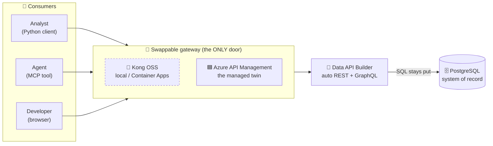
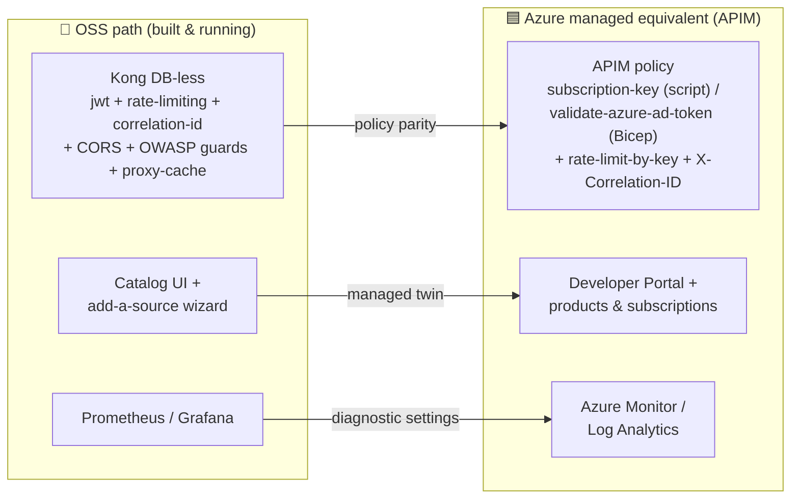

# 🟦 What Azure API Management adds over the OSS gateway

[Home](../README.md) > [Documentation](README.md) > **APIM capabilities**

> [!WARNING]
> ⚠️ Illustrative reference · **synthetic data only** · not an official NASA document.
> Vendors, prices, and scenarios are fabricated — see [`DISCLAIMER.md`](DISCLAIMER.md)
> before sharing or adapting.

> [!NOTE]
> **TL;DR** — Our proof-of-concept *runs* on **Kong OSS**, a free open-source API
> gateway. When this moves to Azure for the real demo, the managed twin is **Azure API
> Management (APIM)**. This page teaches what APIM gives you that the OSS gateway does
> not — the self-service **Developer Portal**, **products & subscriptions**, native
> **Microsoft Entra ID** identity, an **AI/LLM gateway**, and a managed control plane —
> and it is scrupulously honest about which of those we have actually wired up in code
> versus which are platform capabilities you would turn on later. **An *API gateway* is
> the single front door every consumer must go through to reach the data; nothing talks
> to the database directly.** If that idea is new, read
> [Concept 02 — API gateways](concepts/02-api-gateways.md) first, then come back here.

---

## 📑 Table of Contents

- [🤔 Why this page exists](#-why-this-page-exists)
- [🧭 Two gateways, one pattern](#-two-gateways-one-pattern)
- [✅ Shipped vs ⚙️ managed-only — the honesty key](#-shipped-vs-️-managed-only--the-honesty-key)
- [✨ Capability comparison](#-capability-comparison)
- [📖 Capability 1 — the Developer Portal](#-capability-1--the-developer-portal)
- [📦 Capability 2 — products & subscriptions](#-capability-2--products--subscriptions)
- [🪪 Capability 3 — native Entra identity](#-capability-3--native-entra-identity)
- [🤖 Capability 4 — the AI / LLM gateway](#-capability-4--the-ai--llm-gateway)
- [🌐 Capability 5 — the self-hosted gateway](#-capability-5--the-self-hosted-gateway)
- [🛡️ The honest policy mapping](#️-the-honest-policy-mapping)
- [🎬 What I'd show a customer (in priority order)](#-what-id-show-a-customer-in-priority-order)
- [🧩 Gotchas & troubleshooting](#-gotchas--troubleshooting)
- [🚀 Want it live?](#-want-it-live)
- [➡️ Where to next](#️-where-to-next)

---

## 🤔 Why this page exists

When you demo this platform to a customer, someone always asks the same fair question:
*"You built it on free open-source software. What do I actually get if I pay for the
Azure managed product?"* This page is the answer — written so it survives scrutiny.

The trap to avoid is **over-claiming**. It is tempting to point at APIM's glossy feature
list and imply the demo already does all of it. It does not, and a sharp evaluator will
catch the gap. So this page draws a hard line between two things:

- **What the code in this repo actually configures** when you run the Azure deploy
  script — provable, clickable, here today.
- **What the APIM *platform* can do** that we have *not* wired up — real product
  capabilities you would enable in a production rollout, presented as "here's where this
  goes next," never as "here's what we already did."

> **In plain terms:** this is the "managed gateway upsell" conversation, told honestly.
> Everything marked ✅ you can click in a live demo right now; everything marked ⚙️ is a
> real Azure feature we have documented but not yet stood up.

**Why this matters:** credibility is the whole game in an enterprise proof-of-concept. A
demo that quietly conflates "shipped" with "possible" loses the room the moment someone
asks to see it. A demo that says *"this part is live, this part is the roadmap, here's
exactly where the roadmap lives in our Bicep"* earns trust — and trust is what turns a
POC into a program.

---

## 🧭 Two gateways, one pattern

The entire platform is built so the gateway is **swappable**. The thing behind the
gateway never changes: a [Data API Builder](concepts/03-data-api-builder.md) (DAB)
auto-generated REST/[OData](GLOSSARY.md) API sitting in front of a PostgreSQL
system-of-record, with the database reachable **only** through the gateway (the
[zero-move](ZERO-MOVE.md) guarantee). You can put **Kong** in front of it (what we run
locally and in Container Apps) or **APIM** in front of it (the managed Azure edition) —
the consumer's experience of "call one governed URL, get governed data" is identical.



> **In plain terms:** Kong and APIM are two interchangeable front doors to the *same*
> house. This page is about what the *fancier* door (APIM) comes with — a built-in
> reception desk (Developer Portal), visitor badges (subscriptions), corporate SSO
> (Entra), and a few rooms (AI gateway) the simple door doesn't have.

For the full side-by-side of the two editions and a "when to pick which" decision table,
see [`APIM-EDITION.md`](APIM-EDITION.md). This page goes deeper on the *delta* — the
specific things APIM adds.

---

## ✅ Shipped vs ⚙️ managed-only — the honesty key

Throughout this page, every APIM capability carries one of two badges. Read this key
once and the rest of the page is unambiguous.

| Badge | Meaning | How to verify |
|---|---|---|
| ✅ **Shipped** | The Azure deploy script and/or the Bicep module configures this; you can click or curl it in a live deploy today. | Trace it to [`scripts/azure-deploy-apim.sh`](../scripts/azure-deploy-apim.sh) or [`infra/azure/modules/apim.bicep`](../infra/azure/modules/apim.bicep). |
| ⚙️ **Managed-only (roadmap)** | A real APIM platform feature we have **not** wired up in this repo. Documented as the next step, not as a current capability. | No code path exists; treat as "would enable in production." |

> [!IMPORTANT]
> One subtlety to get right because it trips people up: **identity is configured two
> different ways in two different files.**
>
> - The **Bicep reference policy** ([`apim.bicep`](../infra/azure/modules/apim.bicep))
>   gates the API with **`validate-azure-ad-token`** (full Entra JWT validation) by
>   default — that is the production-shaped policy.
> - The **live deploy script** ([`azure-deploy-apim.sh`](../scripts/azure-deploy-apim.sh))
>   gates with the **APIM subscription key** by default, *so the Developer Portal's
>   "Try it" console works out of the box*, and documents the Entra upgrade inline.
>
> Both are ✅ shipped; they are deliberately different defaults for different audiences
> (Bicep = production posture, script = clickable demo). Don't claim the running demo
> validates Entra tokens unless you applied the upgrade.

---

## ✨ Capability comparison

The POC's Kong (DB-less) already does JWT validation, per-consumer rate-limiting,
per-consumer metering, correlation IDs, CORS, response caching, and a pair of
[OWASP](GLOSSARY.md) API-security guards (see [`kong.yml`](../services/gateway/kong.yml)).
APIM does all of that **and** adds the managed capabilities below. The badge tells you
whether *this repo* configures the APIM side, or whether it's a platform feature you'd
enable later.

| Capability | 🐙 OSS Kong (built here) | 🟦 APIM adds | Status in this repo | Why it matters |
|---|---|---|---|---|
| **Developer Portal** | none — our catalog UI is the analogue | Built-in self-service portal: browse APIs, read docs, **Try-it** console, sign up for keys | ✅ Shipped (published + Entra sign-in + product visibility) | Self-service discovery without tribal knowledge — the managed twin of our catalog |
| **Products & subscriptions** | per-consumer JWT credentials | Package APIs into **products**; self-service **subscription keys**; per-product quotas/terms | ✅ Shipped ("Artemis Data Products" product, subscription-required) | Consumer onboarding + tiered access governance |
| **Native Entra identity** | local RS256 JWT issuer | `validate-azure-ad-token`, managed identity, OAuth2 | ✅ Shipped (Bicep policy + portal sign-in IdP) | Tenant-grade auth, no key handling |
| **AI / LLM gateway** | none | `llm-token-limit`, `llm-emit-token-metric`, semantic caching, LLM request logging | ⚙️ Managed-only (documented, **not** wired up) | Govern + meter LLM/agent traffic the same way as data traffic |
| **Self-hosted gateway** | Kong can self-host | Managed control plane + **self-hosted data plane** on-prem / other clouds / Gov | ⚙️ Managed-only | Keep data in-place for residency (ITAR/CUI) while centrally governed |
| **Policy engine** | Lua plugins + `pre-function` | Rich **XML policy** pipeline: transform, cache, validate-content, mock, rewrite | ✅ Partially (rate-limit, correlation-id, CORS shipped; richer policies available) | OWASP API Top-10 mitigations as first-class policies |
| **Observability** | Prometheus + Grafana | Native **Azure Monitor / App Insights**, request tracing, analytics | ✅ Shipped (diagnostic settings → Log Analytics) | Enterprise telemetry without standing up your own stack |
| **Versioning** | route config | **API versions + revisions**, named values, certificate management | ⚙️ Managed-only | Safe API evolution at scale |
| **Operations** | self-managed | Managed scaling, multi-region, SLA, VNet integration | ⚙️ Managed-only (Developer tier deployed; HA tiers are the upgrade) | Run-by-Azure, FedRAMP-authorized |

The sections that follow take the five highest-impact rows and teach each one — what it
is, why it beats the OSS analogue, and exactly what state it's in here.

---

## 📖 Capability 1 — the Developer Portal

**What it is.** The Developer Portal is a public, customizable website that APIM
generates *for* your APIs. Visitors browse the API catalog, read auto-generated docs,
download the OpenAPI definition, run live calls from a built-in **Try-it** console, and
sign themselves up for subscription keys — all without a human in the loop.

**The OSS analogue.** In the Kong edition we hand-built a catalog UI plus an "add a
source" onboarding wizard (the [`frontend/`](../frontend) SPA backed by the
[`services/catalog`](../services/catalog) and [`services/registry`](../services/registry)
APIs). It does the same *job* — discovery and onboarding — but we wrote and maintain
every line of it. APIM gives you that surface as a managed product.

**Status: ✅ Shipped.** The Azure deploy script
([`azure-deploy-apim.sh`](../scripts/azure-deploy-apim.sh)) does real work to make the
portal demoable:

- imports the DAB API from its OpenAPI so all eight operations (Material / PurchaseOrder
  / SupplyRisk / Vendor, each as list + by-key) appear with docs and a Try-it console;
- makes the product visible to the `guests` and `developers` groups so the API shows up
  for **anonymous** visitors (a new product is admin-only by default — we found this in
  browser end-to-end testing, see the script comment at lines 71-79);
- enables **Microsoft Entra sign-in** on the portal via an app registration + the APIM
  `aad` identity provider;
- republishes the portal on every run so config changes are reflected.

Here is what the published portal actually looks like in this deployment:


> [!NOTE]
> **One genuinely manual step.** APIM's portal needs its default content **provisioned
> once** from admin mode (Azure portal → API Management → Developer portal → Portal
> overview → Publish). There is no pure-CLI seed for that first provisioning — see the
> script comment at lines 135-141 and
> [Microsoft's docs on automating portal deployments](https://learn.microsoft.com/azure/api-management/automate-portal-deployments).
> After that one click, re-running the script keeps it republished automatically.

> **Why this matters:** the portal is the single highest-impact visual in the whole
> Azure story. It turns "we have an API" into "anyone in the agency can discover, try,
> and subscribe to a governed data product in their browser" — the marketplace pattern,
> run by Azure.

---

## 📦 Capability 2 — products & subscriptions

**What it is.** APIM separates *APIs* from *products*. A **product** bundles one or more
APIs with a set of access terms — whether a subscription is required, whether approval is
needed, and what quotas/rate-limits apply. A consumer **subscribes** to a product and
receives a **subscription key** (passed as the `Ocp-Apim-Subscription-Key` header). That
key is how APIM tells consumers apart for metering and rate-limiting.

**The OSS analogue.** In Kong we model consumers directly as `consumer` entries
(`analyst` and `artemis-agent` in [`kong.yml`](../services/gateway/kong.yml)), each
trusting the issuer's RS256 public key, distinguished by the `client_id` claim in their
JWT. It works, but onboarding a new consumer means editing declarative config. APIM's
self-service subscription flow removes that operator from the loop.

**Status: ✅ Shipped.** The deploy script publishes a product named **"Artemis Data
Products"** with `subscription-required true` and `approval-required false`, then adds the
Artemis API to it (script lines 65-69). The validation step at the end proves the gate
works:

```bash
# from azure-deploy-apim.sh — the script's own smoke test
NOKEY="$(curl -s -o /dev/null -w '%{http_code}' "$GW/api/SupplyRisk?\$first=1")"
WITHKEY="$(curl -s -o /dev/null -w '%{http_code}' \
  -H "Ocp-Apim-Subscription-Key: $KEY" "$GW/api/SupplyRisk?\$first=1")"
echo "   no key -> HTTP $NOKEY   |   with key -> HTTP $WITHKEY  (expect 401 / 200)"
```

**Expected output:**

```text
   no key -> HTTP 401   |   with key -> HTTP 200  (expect 401 / 200)
```

> **What this proved:** a call with no subscription key is rejected at the edge (`401`),
> and the same call with a valid key succeeds (`200`). That is the subscription gate
> doing its job — exactly mirroring the Kong demo's "no token → 401, valid token → 200,
> over-limit → 429" sequence, just keyed on a subscription instead of a JWT.

---

## 🪪 Capability 3 — native Entra identity

**What it is.** [Microsoft Entra ID](GLOSSARY.md) (formerly Azure Active Directory) is
Azure's managed identity provider. APIM integrates with it natively in two places:

1. The **`validate-azure-ad-token`** policy validates an incoming Entra-issued JWT at the
   gateway — checking the issuer, signature, expiry, and audience — with no key material
   for you to manage.
2. The **Developer Portal sign-in** can use Entra so visitors authenticate with their
   tenant accounts.

**The OSS analogue.** Locally we run a minimal RS256 JWT issuer
([`services/identity`](../services/identity)) that mints tokens Kong validates against the
issuer's public key. It's a faithful stand-in for an OAuth2 identity provider, but *we*
operate it. Entra is that role, managed and tenant-grade. See
[Concept 04 — identity, JWT & OAuth](concepts/04-identity-jwt-oauth.md) for the
underlying token mechanics that are identical on both sides.

**Status: ✅ Shipped — with the two-default nuance from the honesty key above.**

- The **Bicep policy** ([`apim.bicep`](../infra/azure/modules/apim.bicep), lines 44-48)
  ships `validate-azure-ad-token` with `tenant-id` injected and an audience of
  `api://artemis-api` — the production-shaped Entra gate.
- The **deploy script** gates on the subscription key by default (so Try-it works) and
  documents the Entra upgrade inline (script lines 37-43): drop the
  `validate-azure-ad-token` block into `<inbound>` to tenant-lock.
- Separately, the script **does** wire up Entra **portal sign-in** today — it creates the
  `artemis-apim-portal` app registration, grants the legacy Graph `User.Read` permission
  APIM's portal needs (avoiding the `AADSTS650056` error, script lines 119-124), and
  registers the `aad` identity provider.

> **In plain terms:** the "log in to the portal with your work account" part is live now;
> the "every data API call must carry a validated Entra token" part is shipped in Bicep
> and a one-block edit away in the script. Be precise about which you're showing.

---

## 🤖 Capability 4 — the AI / LLM gateway

**What it is.** APIM ships a family of policies purpose-built to govern traffic to Large
Language Models the same way it governs traffic to any other API:

- **`llm-token-limit`** — enforce a token budget per consumer (rate-limit by *tokens*,
  not just calls);
- **`llm-emit-token-metric`** — emit per-consumer token-consumption metrics to Azure
  Monitor (meter LLM spend);
- **semantic caching** — return a cached answer when a new prompt is semantically close
  to a previous one, cutting cost and latency;
- **LLM request logging** — capture prompts/completions for audit.

**Why it's the strategic story.** The platform's thesis is *"the API gateway is the
connective tissue for an agentic enterprise."* If agents and LLMs are just another class
of consumer calling through the same governed door, then the *same* gateway that meters
and rate-limits data access can meter and rate-limit *token* access. That's a clean,
honest narrative — one control plane for data **and** AI traffic.

> [!WARNING]
> **Status: ⚙️ Managed-only — NOT wired up in this repo.** This is the one place where
> over-claiming would be easy and wrong. The *only* mention of these policies in the
> codebase is a descriptive **comment** at the top of
> [`apim.bicep`](../infra/azure/modules/apim.bicep) (lines 1-3); **no `llm-token-limit`,
> `llm-emit-token-metric`, or semantic-caching policy is actually deployed by any script
> or Bicep resource.** Present this as the roadmap — "here is where the agent-governance
> story plugs in" — never as something the live demo does. Demoing it would require an
> Azure OpenAI / model backend and the policies added to the APIM policy document.

> **Why this matters:** this is exactly the capability where credibility is won or lost.
> Saying *"APIM can govern LLM traffic with these named policies, and our architecture is
> built so they slot into the same gateway — we haven't stood that up in this POC"* is
> compelling **and** truthful. Implying the demo already meters tokens is neither.

---

## 🌐 Capability 5 — the self-hosted gateway

**What it is.** APIM lets you run the **control plane** (config, portal, analytics) in
Azure while running the **data plane** (the actual gateway that proxies requests) as a
container *wherever the data lives* — on-prem, in another cloud, or in an air-gapped
Government environment. You get central governance without forcing the data through
Azure's public regions.

**Why it matters here.** This is the [zero-move](ZERO-MOVE.md) idea at infrastructure
scale and the answer to the residency question for ITAR/CUI workloads: the data and the
proxying gateway stay inside the boundary, while policy, the portal, and telemetry are
managed centrally. Kong can also self-host, so this is parity-with-a-managed-control-plane
rather than something Kong can't do — the difference is *who runs the control plane*.

> [!WARNING]
> **Status: ⚙️ Managed-only — not configured in this repo.** The POC deploys a single
> Azure-hosted APIM (Developer tier). The self-hosted gateway is a documented capability
> and architectural option, not something this code stands up.

---

## 🛡️ The honest policy mapping

This is the credibility table. Every Kong plugin we run has an APIM equivalent; the right
column states honestly whether that equivalent is shipped in our Azure code or is a
documented APIM capability.



| 🐙 Kong plugin (in `kong.yml`) | 🟦 APIM policy | Status |
|---|---|---|
| `jwt` (RS256, validates Entra-style token) | `validate-azure-ad-token` (Entra) | ✅ Bicep default; script documents the upgrade (subscription-key is the script default) |
| `rate-limiting` (per consumer) | `rate-limit-by-key` (per subscription) | ✅ Shipped (both Bicep and script) |
| `correlation-id` (stamp + echo) | `set-header X-Correlation-ID` | ✅ Shipped |
| `cors` | global `cors` policy (portal origin) | ✅ Shipped (script lines 81-103) |
| `prometheus` (per-consumer metering) | Azure Monitor diagnostic settings (`GatewayLogs` + `AllMetrics`) | ✅ Shipped when a Log Analytics workspace exists (script lines 154-159) |
| `request-size-limiting` + `pre-function` `$first` cap (OWASP API4) | `validate-content` / `check-header` policies | ⚙️ Documented APIM equivalents; not added to the deployed policy |
| `request-transformer` (strip `X-MS-CLIENT-PRINCIPAL*` to enforce redaction) | `set-header`/`delete-header` in `<inbound>` | ⚙️ Not yet ported to the APIM policy |

> [!IMPORTANT]
> Two Kong guards are **not** yet mirrored in the deployed APIM policy: the OWASP
> over-broad-query cap and the identity-header stripping that enforces field-level
> redaction (see the comments in [`kong.yml`](../services/gateway/kong.yml) lines 53-82).
> APIM can express both as `<inbound>` policies, but the current APIM policy document
> doesn't include them. Call this out rather than implying full parity.

---

## 🎬 What I'd show a customer (in priority order)

1. **Developer Portal** (✅) — the highest-impact visual; the managed twin of our catalog
   + "add a source" story. Browse the API, run a live Try-it call, sign up for a
   subscription, all in the browser.
2. **Products / subscriptions + the 401 → 200 proof** (✅) — onboard a consumer and show
   the subscription gate enforcing access at the edge.
3. **AI-gateway narrative** (⚙️) — tell the agent/LLM-governance story honestly as the
   roadmap: "same gateway, same metering, applied to tokens — here's where it plugs in."
4. **Self-hosted gateway** (⚙️) — the residency/zero-move enabler for Gov/ITAR
   boundaries, presented as the architectural option.

> **Why this order:** lead with what's clickable and provable (1-2) to build trust, then
> use that trust to credibly paint the roadmap (3-4). Never invert it.

---

## 🧩 Gotchas & troubleshooting

| Symptom | Cause | Fix |
|---|---|---|
| API doesn't appear in the portal for anonymous visitors | A new product is visible to `administrators` only | The script grants `guests`/`developers` visibility (lines 71-79); re-run it, or add the groups in the portal |
| Portal shows "not provisioned" / publish fails with `PreconditionFailed` | Default portal content was never provisioned | Do the one-time provision: Azure portal → API Management → Developer portal → Portal overview → Publish |
| Entra portal sign-in fails with `AADSTS650056` | App registration missing the legacy Graph `User.Read` scope | The script adds + consents it (lines 119-124); ensure a Privileged Role/Global admin granted consent |
| Try-it console blocked by the browser | CORS not allowing the portal origin | The script applies a global CORS policy for the portal origin (lines 81-103) |
| Provisioning seems stuck | APIM **Developer tier** provisions in ~30-45 min | This is normal; the script polls `provisioningState` until `Succeeded` (lines 22-25) |
| `az` crashes printing a policy PUT response on Windows | A BOM in the response trips `az`'s encoder; the PUT still succeeds | The script suppresses output and sets `PYTHONUTF8`/`PYTHONIOENCODING` (lines 12-14, 59-63) |

---

## 🚀 Want it live?

A live APIM instance (Developer tier — the cheapest tier that includes the Developer
Portal) can front the deployed DAB API for a real click-through. The reference policy is
in [`infra/azure/modules/apim.bicep`](../infra/azure/modules/apim.bicep) and the full
configuration is automated in
[`scripts/azure-deploy-apim.sh`](../scripts/azure-deploy-apim.sh):

```bash
az login --tenant <tenant>

# 1) provision APIM (async, ~30-45 min) — Developer tier includes the Developer Portal
az apim create -g artemis-poc-rg -n artemis-apim -l centralus \
  --publisher-email you@org.gov --publisher-name "NASA OCIO Data Platform (synthetic POC)" \
  --sku-name Developer

# 2) import the DAB API, apply the policy, publish the Product, surface the portal
./scripts/azure-deploy-apim.sh
```

> [!WARNING]
> APIM Developer tier carries a monthly cost and takes ~30-45 minutes to provision, so
> it's an **opt-in** add to the demo. Tear it down with
> [`scripts/azure-teardown.sh`](../scripts/azure-teardown.sh) when finished. (No dollar
> figures are quoted here by design — for live, dated Azure pricing run
> [`tools/azure_pricing.py`](../tools/azure_pricing.py).)

---

## ➡️ Where to next

- [`APIM-EDITION.md`](APIM-EDITION.md) — the full two-edition walkthrough and the "Kong
  vs APIM, when to use which" decision table.
- [Concept 02 — API gateways](concepts/02-api-gateways.md) — why a gateway exists and
  what every plugin/policy does, from first principles.
- [`ZERO-MOVE.md`](ZERO-MOVE.md) — the data-never-leaves guarantee the self-hosted
  gateway extends to infrastructure scale.
- [`AZURE-DEPLOYMENT.md`](AZURE-DEPLOYMENT.md) — the broader Azure managed-services target
  (Container Apps, Entra, Azure Monitor, Databricks).
- [`GLOSSARY.md`](GLOSSARY.md) — every term and acronym used above, defined in plain
  English.

> ⚠️ Synthetic data only · illustrative reference · not an official NASA document — see
> [`DISCLAIMER.md`](DISCLAIMER.md).
