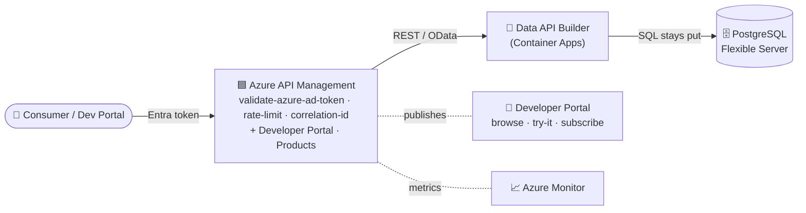

# 🟦 APIM edition — the managed-gateway version

> [!NOTE]
> **TL;DR** — The same data marketplace, two interchangeable gateway editions:
> **Kong (OSS)** — what we build & run locally and in Container Apps — and **Azure API
> Management (APIM)** — the *managed* gateway with a built-in **Developer Portal**,
> products/subscriptions, native Entra, and the AI-gateway. Both front the **same**
> DAB auto-API over the same system of record. This doc shows the APIM edition end to end
> and when to pick which.

> ⚠️ Illustrative reference · synthetic data only · not an official NASA document — see
> [`DISCLAIMER.md`](DISCLAIMER.md).

## 📑 Table of contents

- [Two editions, one pattern](#-two-editions-one-pattern)
- [Architecture (APIM edition)](#-architecture-apim-edition)
- [Kong vs APIM — when to use which](#-kong-vs-apim--when-to-use-which)
- [Deploy the APIM edition](#-deploy-the-apim-edition)
- [Showcase the Developer Portal](#-showcase-the-developer-portal)
- [Policy parity with Kong](#-policy-parity-with-kong)

## 🔁 Two editions, one pattern

| Layer | 🐙 Kong edition | 🟦 APIM edition |
|---|---|---|
| Gateway | Kong OSS (DB-less), `services/gateway/kong.yml` | Azure API Management (managed) |
| Auth | local RS256 issuer + Kong `jwt` | Microsoft Entra + `validate-azure-ad-token` |
| Discovery UI | our catalog + NASA wizard UI | **APIM Developer Portal** (managed) |
| Onboarding | the live "add a source" wizard | Products + subscriptions |
| Metrics | Prometheus + Grafana | Azure Monitor / App Insights |
| Build path | `make demo`, `scripts/azure-deploy-fullstack.sh` | `scripts/azure-deploy-apim.sh` |

The **upstream is identical** — the Data API Builder auto-API (`artemis-dab`) over the
managed Postgres. Only the gateway swaps.

## 🏗️ Architecture (APIM edition)



## ⚖️ Kong vs APIM — when to use which

| Decision factor | Lean **Kong** | Lean **APIM** |
|---|---|---|
| Self-hosted / multi-cloud / air-gapped | ✅ OSS, runs anywhere | self-hosted gateway (managed control plane) |
| Lowest cost / full control | ✅ | — |
| Managed ops, SLA, scaling | — | ✅ |
| Self-service Developer Portal + subscriptions | Enterprise only | ✅ built-in |
| Native Entra / managed identity | plugin/config | ✅ first-class |
| AI/LLM token governance | — | ✅ `llm-token-limit` / `llm-emit-token-metric` |
| Data residency via self-hosted data plane | ✅ | ✅ (self-hosted gateway) |

See [`APIM-CAPABILITIES.md`](APIM-CAPABILITIES.md) for the full capability comparison.

## 🚀 Deploy the APIM edition

> [!WARNING]
> APIM **Developer tier** provisions in ~30–45 minutes and carries monthly cost. It is the
> cheapest tier that includes the **Developer Portal**. Tear down with
> [`azure-teardown.sh`](../scripts/azure-teardown.sh) when finished.

```bash
az login --tenant <tenant>

# 1) provision APIM (async ~30-45 min)
az apim create -g artemis-poc-rg -n artemis-apim-n1 -l centralus \
  --publisher-email you@org.gov --publisher-name "NASA OCIO Data Platform (synthetic POC)" \
  --sku-name Developer --tags owner=you project=nasa-api-first-poc

# 2) import the DAB API + apply policy + publish a Product (waits for provisioning)
./scripts/azure-deploy-apim.sh
```

`azure-deploy-apim.sh` imports the DAB API from its OpenAPI, applies the gateway policy
(Entra JWT validation + per-caller rate-limit + correlation id), and publishes an
**Artemis Data Products** Product.

## 📖 Showcase the Developer Portal

1. Open `https://artemis-apim-n1.developer.azure-api.net` (publish it once from the APIM
   **Developer portal → Publish** in the Azure portal on first run).
2. Show: **browse APIs** → the Artemis API + its OpenAPI, **Try it** console (live calls
   with a subscription key / Entra login), and **self-service subscription** sign-up.
3. The narrative: *this is the managed twin of our catalog UI + "add a source" wizard —
   self-service discovery and onboarding, run by Azure.*

## 🛡️ Policy parity with Kong

The APIM policy mirrors the Kong plugin chain 1:1 (see
[`infra/azure/modules/apim.bicep`](../infra/azure/modules/apim.bicep) and
`scripts/azure-deploy-apim.sh`):

| Kong plugin | APIM policy |
|---|---|
| `jwt` (RS256) | `validate-azure-ad-token` (Entra) |
| `rate-limiting` (per consumer) | `rate-limit-by-key` (per subscription) |
| `correlation-id` | `set-header X-Correlation-ID` |
| `prometheus` | Azure Monitor diagnostic settings |
| `cors` | `cors` policy |
| OWASP `pre-function` guard | `validate-content` / `check-header` policies |
