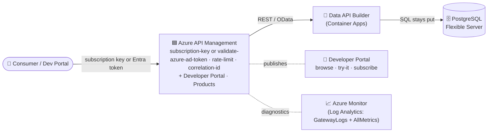

# 🟦 APIM edition — the managed-gateway version

[Home](../README.md) > [Documentation](README.md) > **APIM edition**

> [!NOTE]
> **TL;DR (read this first)** — This proof-of-concept ships **one data-marketplace
> pattern with two interchangeable front doors**. The *dev/test* front door is **Kong
> (OSS)**, which you run locally with `make demo`. The *enterprise demo* front door —
> and the **primary story of this whole repo** — is **Azure API Management (APIM)**:
> Azure's fully managed API gateway, complete with a self-service **Developer Portal**,
> products/subscriptions, native Microsoft Entra sign-in, Azure Monitor telemetry, and an
> AI-gateway. Both front doors sit in front of the **exact same** [Data API Builder
> (DAB)](GLOSSARY.md#dab--data-api-builder) auto-API over the same Postgres
> system-of-record — **only the gateway swaps**. This document teaches the APIM edition
> end to end, calls out exactly **what is shipped vs. documented-aspirational**, and shows
> the one-time portal provisioning + Entra sign-in you must do by hand the first time.

> ⚠️ Illustrative reference · synthetic data only · not an official NASA document — see
> [`DISCLAIMER.md`](DISCLAIMER.md).

---

## 📑 Table of contents

- [Why a managed gateway at all?](#-why-a-managed-gateway-at-all)
- [The mental model: one pattern, two front doors](#-the-mental-model-one-pattern-two-front-doors)
- [Architecture (APIM edition)](#-architecture-apim-edition)
- [Local OSS → Azure managed: the analogue map](#-local-oss--azure-managed-the-analogue-map)
- [Kong vs APIM — when to use which](#-kong-vs-apim--when-to-use-which)
- [Deploy the APIM edition (step by step)](#-deploy-the-apim-edition-step-by-step)
- [The one-time manual steps (portal + Entra)](#-the-one-time-manual-steps-portal--entra)
- [Showcase the Developer Portal](#-showcase-the-developer-portal)
- [Policy parity with Kong — shipped vs documented](#-policy-parity-with-kong--shipped-vs-documented)
- [Gotchas / troubleshooting](#-gotchas--troubleshooting)
- [Where to next](#-where-to-next)

---

## 🤔 Why a managed gateway at all?

Before the *how*, the *why*. The whole point of this POC is the **API-first, zero-move
data marketplace**: data stays in its system of record (here, PostgreSQL), an
auto-generated API ([DAB](GLOSSARY.md#dab--data-api-builder)) exposes it as REST/GraphQL,
and **a gateway is the single front door** through which every consumer must pass. The
gateway is where you enforce *who can call* (identity), *how much they can call* (rate
limits/quotas), *what they're allowed to ask for* (request validation), and *what
happened* (metering and logs). Nothing reaches the database except through that door — see
[`ZERO-MOVE.md`](ZERO-MOVE.md) for the proof.

> **In plain terms:** a gateway is the bouncer, the metering company, and the front-desk
> concierge for your data — all in one. The data never leaves the building; people come to
> the door, show ID, and get exactly what they're entitled to.

You can run that bouncer yourself (open-source software you operate), or you can rent a
managed one from your cloud. This repo does both so you can compare them honestly:

- **[Kong OSS](GLOSSARY.md#apim--azure-api-management)** — you host and operate it. Great
  for local development, air-gapped sites, and full control. This is the **dev/test loop**.
- **[Azure API Management (APIM)](GLOSSARY.md#apim--azure-api-management)** — Azure runs
  the gateway *and* a polished self-service **Developer Portal** for you. This is the
  **enterprise demo** that shows the full art of the possible: identity wired to your
  corporate directory, a website where consumers discover and subscribe to APIs
  themselves, and telemetry flowing into Azure Monitor without you standing up Prometheus.

> **Why this matters:** in an enterprise/government conversation, "we built an OSS gateway"
> is the *engineering* proof. "Here is the managed Azure service that does all of this,
> plus a Developer Portal your data consumers self-serve from" is the *program* story.
> Lead with APIM; treat Kong as the local dev harness that proves the pattern is portable.

---

## 🔁 The mental model: one pattern, two front doors

The single most important idea: **the upstream never changes.** Whether the request
arrives through Kong or through APIM, it is forwarded to the *same* DAB API
(`artemis-procurement` / `artemis-dab`) over the *same* managed Postgres. Swapping
gateways is swapping the front door, not rebuilding the house.

| Layer | 🐙 Kong edition (dev/test) | 🟦 APIM edition (enterprise demo) |
|---|---|---|
| **Gateway** | Kong OSS (DB-less), [`services/gateway/kong.yml`](../services/gateway/kong.yml) | Azure API Management (managed) |
| **Auth** | local [RS256 issuer](GLOSSARY.md#identity-issuer-local-oidcjwt-issuer) + Kong `jwt` plugin | [Microsoft Entra ID](GLOSSARY.md#microsoft-entra-id-formerly-azure-ad) + `validate-azure-ad-token` |
| **Discovery UI** | our catalog + NASA "add a source" wizard UI | **APIM Developer Portal** (managed) |
| **Onboarding** | the live "add a source" wizard | Products + self-service subscriptions |
| **Metrics** | [Prometheus + Grafana](GLOSSARY.md#azure-monitor--log-analytics--application-insights) | Azure Monitor / Application Insights |
| **Upstream (identical)** | DAB `artemis-dab` over Postgres | DAB `artemis-dab` over Postgres |
| **Build path** | `make demo`, `scripts/azure-deploy-fullstack.sh` | `scripts/azure-deploy-apim.sh` |

> [!TIP]
> Read that last-but-one row twice: the **upstream is identical**. Everything you learn
> running Kong locally — the entities, the OData query shapes, the redaction boundary —
> applies unchanged behind APIM. The local stack is a faithful, free rehearsal for the
> Azure demo.

---

## 🏗️ Architecture (APIM edition)



Reading the diagram top to bottom: a consumer (a script, an agent, or a human in the
Developer Portal) presents **either** an APIM **subscription key** **or** a **Microsoft
Entra** access token. APIM evaluates its inbound policy (gate the caller → rate-limit →
stamp a [correlation id](GLOSSARY.md#correlation-id)), then forwards the request as plain
REST/OData to the DAB API running on [Azure Container Apps](GLOSSARY.md#aca--azure-container-apps).
DAB issues SQL to **PostgreSQL Flexible Server** — the data never moves out; only the
*answer* travels back. Alongside the request path, APIM **publishes** the Developer Portal
(the self-service website) and **streams diagnostics** (`GatewayLogs` + `AllMetrics`) into
a Log Analytics workspace, which is the Azure-native replacement for the local
Prometheus/Grafana stack.

---

## 🗺️ Local OSS → Azure managed: the analogue map

A useful way to learn Azure is to map each thing you ran locally to the managed service it
stands in for. The local stack is a teaching scale model of the Azure deployment:

| Local (dev/test) | Azure (the real demo) | What the managed service buys you |
|---|---|---|
| Kong OSS plugins | **Azure API Management** policies | A run-by-Azure gateway with an SLA, scaling, and a Developer Portal |
| Local RS256 [JWT issuer](GLOSSARY.md#identity-issuer-local-oidcjwt-issuer) | **Microsoft Entra ID** | Tenant-grade identity — real corporate sign-in, no key handling |
| DAB in a Docker container | DAB on **Azure Container Apps** | Managed, autoscaling compute with health probes and revisions |
| `services/catalog` + "add a source" wizard UI | **APIM Developer Portal** | A managed, brandable self-service marketplace site |
| `classification.yml` field tags | **Microsoft Purview** (documented path) | Governed data classification at enterprise scale |
| [Prometheus + Grafana](GLOSSARY.md#azure-monitor--log-analytics--application-insights) | **Azure Monitor + Sentinel** | Native telemetry + SIEM, no stack to operate |
| Local Postgres container | **PostgreSQL Flexible Server** | Managed, backed-up, network-isolated database |

> **Why this matters:** when you present this, you are not showing toy software. Every
> local component is the *open-source analogue* of a first-class Azure service — so the
> jump from `make demo` on your laptop to a FedRAMP-authorized Azure deployment is a change
> of *hosting*, not of *architecture*.

---

## ⚖️ Kong vs APIM — when to use which

Both editions enforce the same governance. The choice is about **who operates the gateway**
and **what managed extras you want**.

| Decision factor | Lean **Kong** (OSS) | Lean **APIM** (managed) |
|---|---|---|
| Self-hosted / multi-cloud / air-gapped | ✅ OSS, runs anywhere | self-hosted gateway tier (managed control plane) |
| Lowest cost / full control | ✅ | — |
| Managed ops, SLA, autoscaling | — | ✅ |
| Self-service Developer Portal + subscriptions | Enterprise edition only | ✅ built in |
| Native [Entra](GLOSSARY.md#microsoft-entra-id-formerly-azure-ad) / managed identity | plugin/config | ✅ first-class |
| AI/LLM token governance | — | ✅ `llm-token-limit` / `llm-emit-token-metric` *(documented — see parity table)* |
| Data residency via self-hosted data plane | ✅ | ✅ (self-hosted gateway) |

> **In plain terms:** pick **Kong** when you must own and host the gateway yourself (cost,
> air-gap, multi-cloud). Pick **APIM** when you want Azure to run it and you want the
> Developer Portal, native Entra, and Azure Monitor for free. For this POC's *enterprise
> demo*, APIM is the headline; Kong is the proof it's all standards-based and portable.

See [`APIM-CAPABILITIES.md`](APIM-CAPABILITIES.md) for the full capability comparison, and
[`SECURITY.md`](SECURITY.md) for how the auth/redaction boundary is enforced in each edition.

---

## 🚀 Deploy the APIM edition (step by step)

> [!WARNING]
> **APIM Developer tier provisions in ~30–45 minutes and carries monthly cost.** It is the
> cheapest tier that includes the **Developer Portal** (the whole reason to demo APIM).
> Provisioning is asynchronous — `az apim create` returns long before the instance is
> ready, which is why the deploy script *waits* for it. Tear everything down with
> [`azure-teardown.sh`](../scripts/azure-teardown.sh) the moment you're done to stop billing.

### Prerequisites

You need the [Azure CLI](GLOSSARY.md#apim--azure-api-management) (`az`) signed in to a
tenant where you can create resources and an app registration, the DAB API already
deployed (so APIM has an upstream + OpenAPI to import — run
[`scripts/azure-deploy-fullstack.sh`](../scripts/azure-deploy-fullstack.sh) first, or see
[`AZURE-LIVE-DEPLOYMENT.md`](AZURE-LIVE-DEPLOYMENT.md)), and `curl` + `python` on your PATH
(the script uses them to build policy JSON and smoke-test the gateway).

### Step 1 — sign in and provision APIM

```bash
az login --tenant <tenant>

# Provision APIM (async — returns quickly, but the instance keeps building ~30-45 min)
az apim create -g artemis-poc-rg -n artemis-apim-n1 -l centralus \
  --publisher-email you@org.gov --publisher-name "NASA OCIO Data Platform (synthetic POC)" \
  --sku-name Developer --tags owner=you project=nasa-api-first-poc
```

**What this did:** created an APIM instance named `artemis-apim-n1` in resource group
`artemis-poc-rg`, region Central US, on the **Developer** SKU. The `--publisher-*` values
brand the Developer Portal. The command returns in seconds, but the gateway is **not
ready** yet — the next step blocks until it is.

### Step 2 — configure everything with one script

```bash
./scripts/azure-deploy-apim.sh
```

[`scripts/azure-deploy-apim.sh`](../scripts/azure-deploy-apim.sh) is idempotent — safe to
re-run. In order, it:

1. **Waits** for `provisioningState = Succeeded` (polling every 60s — this is the 30–45 min wait).
2. **Imports** the DAB REST API from its live OpenAPI at `$DAB/api/openapi`, mounting it
   at path `api` with id `artemis-procurement` and display name *Artemis Supply-Chain Risk API*.
3. **Applies the API-level policy** that mirrors Kong: per-caller
   [`rate-limit-by-key`](GLOSSARY.md#apim-policy) (60 calls / 60s) + an `X-Correlation-ID`
   `set-header`. (The default *gate* is the subscription key — see the [shipped-vs-documented
   note](#-policy-parity-with-kong--shipped-vs-documented).)
4. **Publishes a Product** — *Artemis Data Products* (`artemis`), `subscription-required`,
   no approval — and adds the API to it.
5. **Makes the Product visible to `guests` + `developers`**, so the API actually appears on
   the portal's APIs page for anonymous visitors (a new product is admin-only by default —
   this was found in browser E2E testing).
6. **Applies a global CORS policy** allowing the portal origin, so the Developer Portal
   *Try it* console can call the gateway from the browser.
7. **Wires Microsoft Entra sign-in** on the Developer Portal (creates/reuses an
   `artemis-apim-portal` app registration, configures the APIM `aad` identity provider).
8. **Republishes the Developer Portal** (best-effort — only works once you've done the
   [one-time manual publish](#-the-one-time-manual-steps-portal--entra)).
9. **Streams diagnostics** (`GatewayLogs` + `AllMetrics`) to the `artemis-logs` Log
   Analytics workspace, if it exists.
10. **Smoke-tests** the gateway: a call with no key and a call with the master subscription
    key, expecting **401 then 200**.

#### Expected output (tail of the script)

```text
==> validate a call through APIM
   no key -> HTTP 401   |   with key -> HTTP 200  (expect 401 / 200)

================ APIM EDITION CONFIGURED ================
  Gateway:          https://artemis-apim-n1.azure-api.net/api/SupplyRisk   (header: Ocp-Apim-Subscription-Key)
  Developer Portal: https://artemis-apim-n1.developer.azure-api.net   (publish it once from the portal Azure UI on first run)
  Policy: subscription-key + per-caller rate-limit + correlation id
          (Entra validate-azure-ad-token is the documented tenant-lock upgrade)
```

> **What "401 then 200" proves:** the gate is real. With no credential the gateway rejects
> the call at the edge (it never reaches DAB); with a valid subscription key the same call
> succeeds and returns synthetic supply-risk data. That is the zero-move pattern enforced
> by the managed gateway, exactly mirroring the Kong edition.

---

## 🔑 The one-time manual steps (portal + Entra)

Two things in the APIM edition **cannot be fully automated** and must be done by a human
once. Knowing this up front saves a confusing first run.

### 1. Provision + publish the Developer Portal (one time, in the Azure portal)

The managed Developer Portal ships with **no default content** until you provision it once
from admin mode. There is **no pure-CLI seed** for that default content
([Microsoft documents this limitation](https://learn.microsoft.com/azure/api-management/automate-portal-deployments)),
so the deploy script's republish step is best-effort until you do this:

1. Azure portal → your **API Management** instance → **Developer portal → Portal overview**.
2. Click the **Developer portal** toolbar link — this opens the admin editor and
   **provisions the default content**.
3. Back on **Portal overview**, click **Publish**.

After that, every subsequent `azure-deploy-apim.sh` run **automatically republishes** the
portal, so new APIs, policy changes, and sign-in config are reflected without another
manual publish.

> [!NOTE]
> If you skip this, the script prints:
> `NOTE: developer-portal content not provisioned yet — do the ONE-TIME publish` along with
> the exact portal path. That message means "go do step 1 above," not "something broke."

### 2. Grant admin consent for the portal's Entra app (one time)

To let visitors sign in to the portal with tenant accounts, the script creates an
`artemis-apim-portal` app registration and requests the legacy Azure AD Graph `User.Read`
permission (APIM's portal sign-in still needs it; without consent you get **AADSTS650056 —
Misconfigured application**). The script attempts `az ad app permission admin-consent`
automatically, but **granting admin consent requires a Privileged Role / Global
Administrator**. If your account lacks that role, the script prints the app id and asks an
admin to consent. Username/password sign-in remains available regardless.

> **Why this matters:** "sign in with your corporate account" is the headline difference
> between the local issuer and Entra. Getting consent granted once is what turns the demo
> from "here's a key" into "here's real enterprise identity."

---

## 📖 Showcase the Developer Portal

This is the highest-impact visual in the entire demo — the managed twin of our local
catalog + "add a source" wizard.

1. Open `https://artemis-apim-n1.developer.azure-api.net` — the published portal lists the
   **Artemis Supply-Chain Risk API** (and the sample Echo API) to anonymous visitors.
2. Open the Artemis API → all eight operations
   ([Material](GLOSSARY.md#odata) / PurchaseOrder / SupplyRisk / Vendor, each as *list* and
   *by-key*) with a downloadable [OpenAPI](GLOSSARY.md#odata) definition, the **Try it**
   console (live calls with a subscription key or Entra login), and **self-service
   subscription** sign-up.
3. **The narrative to say out loud:** *this is the managed twin of our catalog UI + "add a
   source" wizard — self-service discovery and onboarding, run entirely by Azure. A new
   data consumer finds the API, reads the contract, tries a live call, and subscribes for a
   key — with zero tickets and zero tribal knowledge.*

> [!TIP]
> The eight operations come straight from the DAB OpenAPI you imported — you did not
> hand-author them. That is the "API-first" thread: the contract is generated from the data,
> the gateway imports the contract, and the portal renders it for humans. See
> [`API.md`](API.md) for the operation list and [`ADD-A-SOURCE.md`](ADD-A-SOURCE.md) for the
> local wizard this mirrors.

---

## 🛡️ Policy parity with Kong — shipped vs documented

The APIM policy mirrors the Kong plugin chain. **Be precise about what is actually shipped
versus documented-aspirational** — credibility depends on it. Three sources matter:

- **`scripts/azure-deploy-apim.sh`** — what the deploy script *actually applies* (the
  subscription-key gate variant, for a working *Try it* console).
- **[`infra/azure/modules/apim.bicep`](../infra/azure/modules/apim.bicep)** — the reference
  module, which ships the **Entra** `validate-azure-ad-token` gate by default.
- **[`services/gateway/kong.yml`](../services/gateway/kong.yml)** — the OSS edition, the
  source of truth for the controls being mirrored.

### ✅ Shipped today (in the script and/or bicep)

| Kong plugin | APIM policy | Where it ships |
|---|---|---|
| `jwt` (RS256, per consumer) | `validate-azure-ad-token` (Entra) | **bicep** (default gate). The **script** gates on the **subscription key** by default so the portal *Try it* works, and documents the Entra upgrade inline (a commented `<validate-azure-ad-token>` block). |
| `rate-limiting` (per consumer) | `rate-limit-by-key` (per subscription, 60/60s) | **script + bicep** |
| `correlation-id` | `set-header X-Correlation-ID` | **script + bicep** |
| `cors` | global `cors` policy (portal origin) | **script** |
| `prometheus` | Azure Monitor diagnostic settings (`GatewayLogs` + `AllMetrics`) | **script** (if `artemis-logs` workspace exists) |

> [!NOTE]
> **The gate differs by source on purpose.** The *script* uses the **subscription key** so
> the Developer Portal *Try it* console works out of the box for a live click-through. The
> *bicep module* uses **Entra `validate-azure-ad-token`** by default for a tenant-locked,
> production-shaped reference. Both are real; pick per audience. To tenant-lock the
> script-deployed instance, add the `<validate-azure-ad-token>` block documented inline in
> `azure-deploy-apim.sh`.

### 📝 Documented-aspirational (not shipped in this POC)

These map cleanly to APIM features but are **not** in the deploy script or bicep — present
them as "the managed gateway can do this," not "this demo does this":

| Capability | Kong (OSS, shipped) | APIM equivalent (documented only) |
|---|---|---|
| **OWASP guard — over-broad extraction** | `pre-function` Lua: rejects `$first > 200` (OWASP API4:2023, Unrestricted Resource Consumption) | `validate-content` / `check-header` / inbound `<choose>` policy — **documented, not shipped** |
| **OWASP guard — request size cap** | global `request-size-limiting` plugin | inbound size/`validate-content` policy — **documented, not shipped** |
| **Redaction boundary (identity-header strip)** | `request-transformer` strips `X-MS-CLIENT-PRINCIPAL*` / `X-MS-API-ROLE` so every call reaches DAB as `anonymous` (guarantees field-level redaction) | `set-header … exists-action="delete"` inbound policy — **not yet ported to APIM script/bicep** |
| **AI / LLM token governance** | — (not an OSS-Kong feature here) | `llm-token-limit` / `llm-emit-token-metric` / semantic caching — **APIM AI-gateway, documented in [`APIM-CAPABILITIES.md`](APIM-CAPABILITIES.md)** |

> [!WARNING]
> **Honesty note for presenters.** The Kong edition currently enforces *more* edge controls
> than the shipped APIM policy: the two OWASP guards and the redaction header-strip live in
> [`kong.yml`](../services/gateway/kong.yml) but are **not** yet in
> `azure-deploy-apim.sh`/`apim.bicep`. APIM is fully capable of all of them (the policy
> engine is strictly richer than Kong's), they're simply not wired up in this POC. Say
> "these are one-policy ports away" — don't claim the APIM edition already runs them. See
> [`SECURITY.md`](SECURITY.md) and [`GLOSSARY.md#owasp-api-security-top-10`](GLOSSARY.md#owasp-api-security-top-10).

---

## 🧯 Gotchas / troubleshooting

| Symptom | Cause | Fix |
|---|---|---|
| Script seems stuck on `...Activating` for a long time | APIM Developer tier genuinely takes **~30–45 min** to provision | This is expected — the script polls every 60s. Don't kill it. |
| Developer Portal is blank / API not listed | Default portal content not provisioned, or product is admin-only | Do the [one-time publish](#-the-one-time-manual-steps-portal--entra); the script then makes the product visible to `guests`+`developers`. |
| Portal sign-in fails with **AADSTS650056** | Legacy Azure AD Graph `User.Read` not consented for the portal app | An admin must run `az ad app permission admin-consent --id <portal-app-id>` (needs Privileged Role/Global admin). |
| Entra sign-in → **"Complete sign up — Server error. Unable to send request."** | The create-user call `POST /developer/users` returns **400**: APIM enforces **unique emails**, and the email you're signing up with is already the **built-in Administrator** account's email (whose email is *immutable* — `PATCH` returns `Cannot modify property for user with built-In role`). Not a portal/CORS/consent bug. | Onboard developers with a **different email** than the publisher/admin's — e.g. a `+alias` (`you+dev@domain`) or another Entra user. The admin uses the publisher experience, not developer sign-up. |
| *Try it* console call blocked by browser (CORS) | Global CORS policy not applied / portal origin mismatch | Re-run `azure-deploy-apim.sh` (it applies the global `cors` policy for the portal origin). |
| `az` crashes printing the policy PUT response | Known `az`-on-Windows BOM print bug | Harmless — the PUT still succeeds; the script suppresses output (`-o none … || true`). |
| No metrics in Azure Monitor | `artemis-logs` Log Analytics workspace doesn't exist | Deploy monitoring first (see [`monitor.bicep`](../infra/azure/modules/monitor.bicep)); the diagnostic-settings step is skipped if the workspace is absent. |
| Calls succeed but cost is climbing | APIM Developer tier bills hourly | [`azure-teardown.sh`](../scripts/azure-teardown.sh) when finished. |

---

## 🧭 Where to next

- **[`APIM-CAPABILITIES.md`](APIM-CAPABILITIES.md)** — the full "what the managed gateway
  adds over OSS" comparison (Developer Portal, AI gateway, self-hosted gateway, versioning).
- **[`AZURE-LIVE-DEPLOYMENT.md`](AZURE-LIVE-DEPLOYMENT.md)** — the real deployed stack and
  the honest deltas vs. the local environment.
- **[`AZURE-DEPLOYMENT.md`](AZURE-DEPLOYMENT.md)** — the broader Azure deployment path and
  Bicep modules.
- **[`ZERO-MOVE.md`](ZERO-MOVE.md)** — the proof that data never leaves its system of record.
- **[`SECURITY.md`](SECURITY.md)** — identity, the redaction boundary, and OWASP controls.
- **[`GLOSSARY.md`](GLOSSARY.md)** — every term used here, defined.
- **[`infra/azure/modules/apim.bicep`](../infra/azure/modules/apim.bicep)** /
  **[`scripts/azure-deploy-apim.sh`](../scripts/azure-deploy-apim.sh)** — the source of truth.
