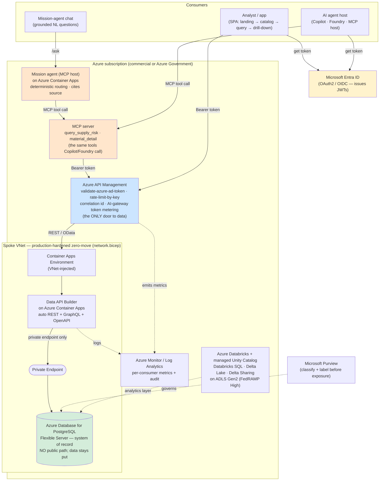
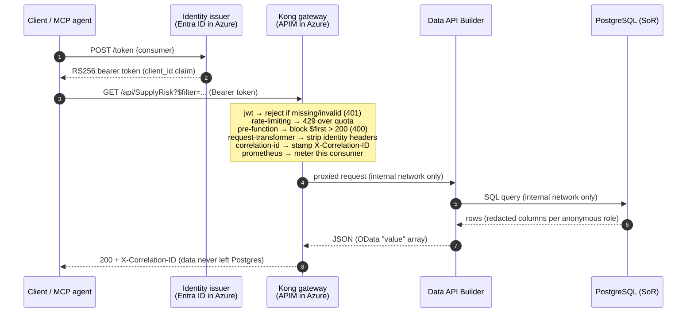
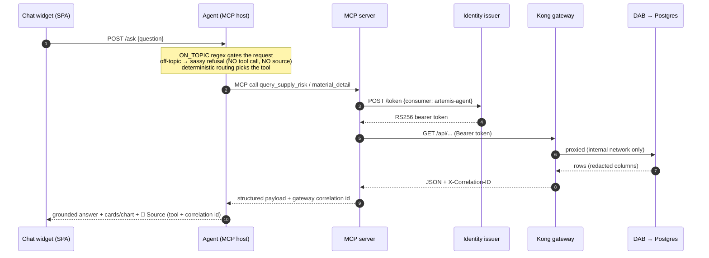
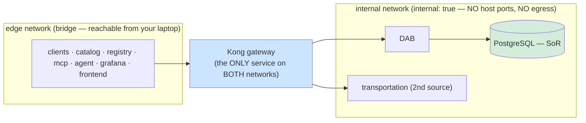
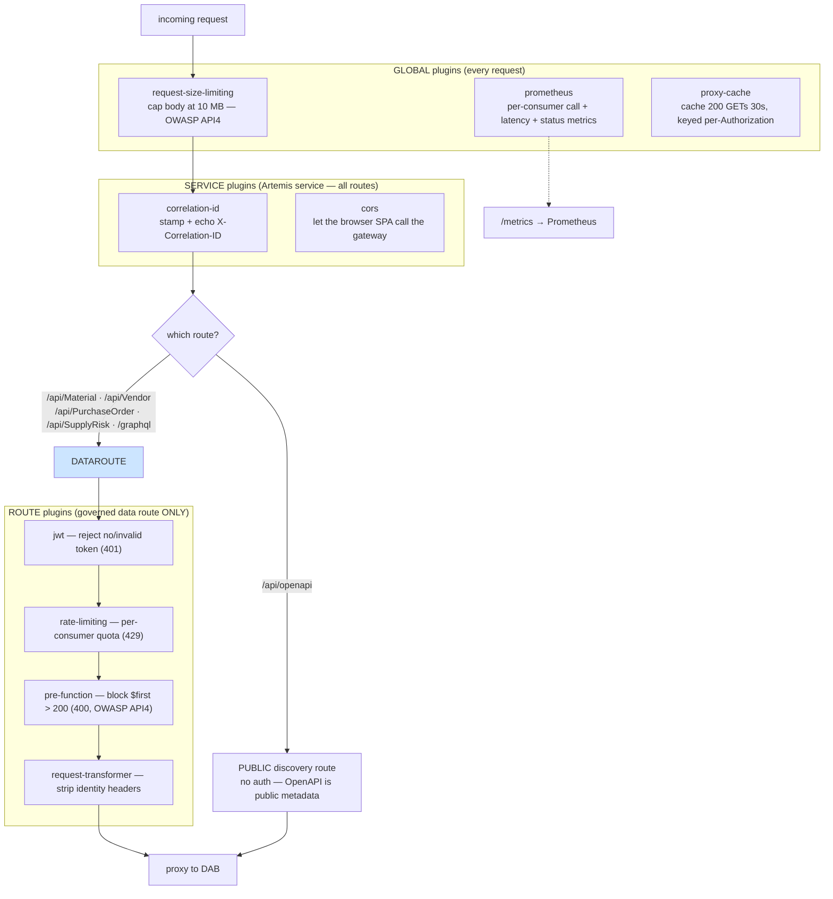
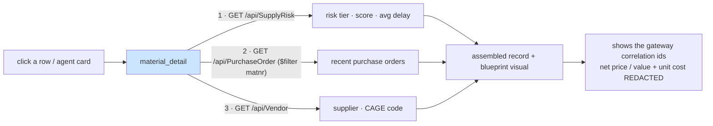
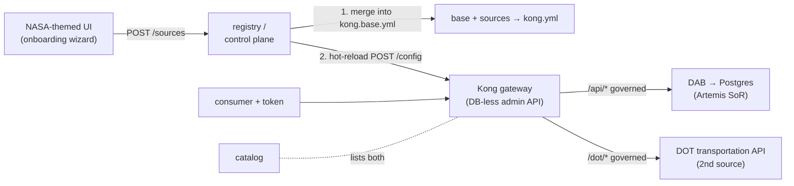
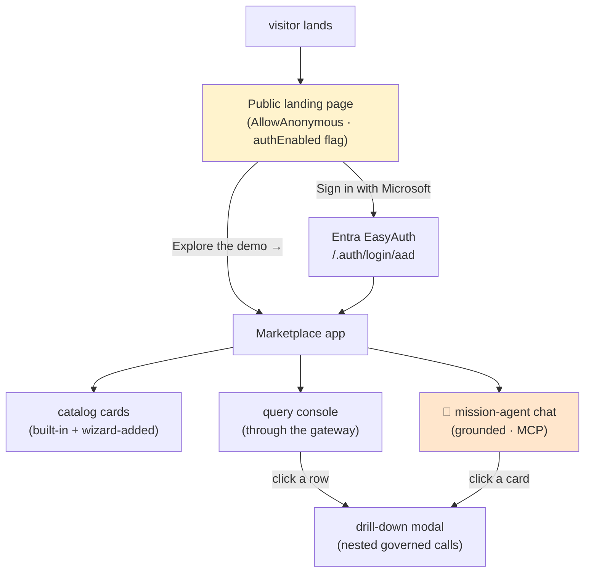

# 🏛️ Architecture

[Home](../README.md) > [Documentation](README.md) > **Architecture**

> [!NOTE]
> **TL;DR** — This proof-of-concept (POC) demonstrates one enterprise pattern: an
> **API-first, zero-move data marketplace**. A consumer (a person *or* an AI agent)
> presents a bearer token to a single **API gateway**, which is the *only* door to the
> data. The gateway checks the token, rate-limits and meters the call, then proxies it to
> an **auto-generated API** sitting on top of the source database. The database itself is
> sealed on a private network — clients can never touch it directly. That sealing is the
> **zero-move guarantee**: the data is *used* in place, never *copied out*.
>
> The **primary story is Azure**: deploy this to Azure to show the full art of the
> possible. Everything you run locally with Docker is a faithful **open-source stand-in**
> for an Azure managed service, so the same architecture promotes to the cloud by swapping
> components — not by redesigning. All data here is **synthetic** (see
> [`DISCLAIMER.md`](DISCLAIMER.md)).

This document teaches the architecture from the top down. We start with **why** the
pattern exists and the Azure target you are aiming for, then walk the request path,
the network isolation that makes "zero-move" true rather than a slogan, the gateway's
plugin chain (and exactly where each control is configured), and finally the
multi-source control plane. Read it once and you should be able to explain the whole
system at a whiteboard.

---

## 📑 Table of Contents

- [🎯 Why this exists: the problem and the pattern](#-why-this-exists-the-problem-and-the-pattern)
- [☁️ The Azure target architecture (lead with this)](#️-the-azure-target-architecture-lead-with-this)
- [🔀 Azure ↔ local/OSS mapping](#-azure--localoss-mapping)
- [🧩 The components, and why each one is here](#-the-components-and-why-each-one-is-here)
- [🏗️ The zero-move request flow](#️-the-zero-move-request-flow)
- [🤖 The grounded mission agent (MCP host → gateway)](#-the-grounded-mission-agent-mcp-host--gateway)
- [🌐 Networks: how zero-move is enforced](#-networks-how-zero-move-is-enforced)
- [🛡️ The Kong plugin chain (and where it is configured)](#️-the-kong-plugin-chain-and-where-it-is-configured)
- [🔐 Field-level redaction: defense in depth](#-field-level-redaction-defense-in-depth)
- [🔎 Drill-down detail: nested governed calls](#-drill-down-detail-nested-governed-calls)
- [✨ Multi-source federation + control plane](#-multi-source-federation--control-plane)
- [🖥️ The UI: public landing + deferred auth](#️-the-ui-public-landing--deferred-auth)
- [🧭 Where to next](#-where-to-next)

---

## 🎯 Why this exists: the problem and the pattern

The enterprise story behind this POC is a familiar one. An agency runs a **system of
record** — here, a synthetic SAP-shaped procurement database for the **Artemis** lunar
program. Other teams, partners, and increasingly **AI agents** all want to ask questions
of that data. The traditional answer is to *copy* the data into a warehouse, a data lake,
a spreadsheet, a partner's environment — a new copy for every consumer.

Every copy is a liability. It drifts out of date, it multiplies the attack surface, and
for regulated data (think ITAR or CUI — International Traffic in Arms Regulations and
Controlled Unclassified Information) every copy is a new place a leak can happen and a new
thing an auditor must inspect.

> **In plain terms:** the more places your data lives, the more places it can break or
> leak. The cheapest copy to secure is the one that never gets made.

**The pattern this POC proves — "zero-move":** instead of copying the data to the
consumer, you bring the *question* to the data. The source database stays exactly where
it is, behind a governed API. Consumers send queries through a single gateway; answers
come back; the rows never leave the source. "API-first" means the API is the product —
the only supported way to consume the data — and "marketplace" means those APIs are
*discoverable*, with an owner, a sensitivity classification, and a request path published
in a catalog so no one needs tribal knowledge to find them.

> **Why this matters:** if the only path to the data is a gateway you control, then
> authentication, rate limits, per-consumer metering, query guardrails, and audit are all
> enforced in *one place* for *every* consumer — humans and agents alike. You govern
> once, not per-copy.

---

## ☁️ The Azure target architecture (lead with this)

The point of the local stack is to let you **develop and test** the pattern on a laptop;
the point of the *POC* is to show what it becomes when deployed to **Azure** (including
**Azure Government** for ITAR/strict-CUI workloads). The reference infrastructure-as-code
lives under [`infra/azure/`](../infra/azure/) as **Bicep** (Azure's native IaC language).

> [!IMPORTANT]
> The Bicep is **documentation-grade reference IaC**. Continuous integration (CI) does
> **not** deploy it and it requires **no** Azure subscription to read or to run the local
> demo. It exists to show the managed-service mapping concretely. See
> [`AZURE-DEPLOYMENT.md`](AZURE-DEPLOYMENT.md).

In Azure, each local container is replaced by a managed service, but **the pattern is
identical**: one gateway, one auto-generated API, one private system of record, one
identity provider, one catalog, one monitoring plane.



A few things to understand from this picture:

- **Entra ID is the identity provider.** Consumers authenticate against Microsoft Entra
  ID and receive a JSON Web Token (JWT — a signed bearer token carrying claims like
  audience and expiry). APIM validates that token on every request with the
  `validate-azure-ad-token` policy. Locally, a tiny RS256 issuer plays this role.
- **API Management is the gateway and the only door.** The APIM policy in
  [`infra/azure/modules/apim.bicep`](../infra/azure/modules/apim.bicep) mirrors the local
  Kong config almost line-for-line: validate the Entra JWT, `rate-limit-by-key`, and stamp
  a correlation id. APIM *also offers* **AI-gateway** policies (`llm-token-limit`,
  `llm-emit-token-metric`) that would extend the same metering idea to large-language-model
  traffic — noted in the module as the future-proofing path for agent consumers, though the
  shipped reference policy enforces only JWT + rate-limit + correlation id.
- **The grounded mission agent is just another governed consumer.** The agent
  ([`services/agent/agent.py`](../services/agent/agent.py)) is an **MCP host**: it answers
  natural-language chat questions by calling the MCP server's tools
  (`query_supply_risk`, `material_detail`), which reach data **only through the gateway**.
  It never queries the database and it cannot exceed what the gateway serves — so rate
  limiting, metering, field-level redaction, and audit govern the agent *for free*. Every
  answer **cites its source** (the MCP tool plus the gateway correlation id), and off-topic
  questions are refused outright. In Azure the agent maps to **Copilot Studio / Azure AI
  Foundry**, the MCP server runs on Container Apps, and consumer `artemis-agent` maps to a
  **Microsoft Entra Agent ID** — the *same MCP tools Copilot would call*. This is the "AI
  grounded on governed data over the open MCP standard" story.
- **Data API Builder runs on Azure Container Apps.** DAB is a real Microsoft product
  (MIT-licensed) that turns a database into REST + GraphQL + OpenAPI **without you writing
  an API**. In Azure it runs as a container app; locally it runs as a container. Same
  binary, same config shape.
- **The system of record is Azure Database for PostgreSQL Flexible Server.** In the
  production-hardened posture ([`network.bicep`](../infra/azure/modules/network.bicep)),
  the Container Apps environment is **VNet-injected** and Postgres is reachable **only**
  through a **private endpoint** resolved by a private DNS zone. The database has *no*
  internet-facing surface — so the data literally cannot move, because there is nowhere
  off the virtual network to move it to, and the only route in is `APIM → DAB → private
  endpoint`. That is zero-move enforced by the network fabric, not by policy alone.
- **Azure Monitor / Log Analytics** replaces Prometheus + Grafana for per-consumer
  metering and audit ([`monitor.bicep`](../infra/azure/modules/monitor.bicep)).
- **Microsoft Purview** classifies and labels the data *before* it is exposed — the
  managed equivalent of the local `data/classification.yml` applied at seed time.

> [!NOTE]
> **Data-platform posture (the analytics layer).** When the question is analytical rather
> than transactional, the managed platform is **Azure Databricks with managed Unity
> Catalog + Databricks SQL + Delta Lake + Delta Sharing on ADLS Gen2**, running in
> **commercial Azure at FedRAMP High**
> ([`databricks.bicep`](../infra/azure/modules/databricks.bicep)). The managed-Unity-
> Catalog / Databricks-SQL gap is the **Azure-Government (ITAR / strict-CUI) exception
> only** — it is not the default. **Microsoft Fabric / OneLake is explicitly excluded**:
> it is not available in Azure Government / GCC, so this POC uses Databricks + ADLS +
> Delta instead.

---

## 🔀 Azure ↔ local/OSS mapping

Every local component is the open-source analogue of an Azure managed service. You build
once and promote by swapping; the *contract* each piece honors stays the same.

| Concern | Azure target (the real demo) | Local / OSS analogue (built here) | Why the local stand-in is faithful |
|---|---|---|---|
| System of record | **Azure Database for PostgreSQL Flexible Server** | **PostgreSQL 16** seeded with synthetic SAP-shaped tables | Same relational engine and SQL; data stays put either way |
| Expose data as an API without writing one | **Data API Builder on Azure Container Apps** | **Microsoft Data API Builder (DAB)** container over Postgres | *Identical product* (MIT); auto REST + GraphQL + OpenAPI from the same `dab-config.json` |
| Enterprise + AI gateway (the only door) | **Azure API Management** (policies; AI-gateway policies available) | **Kong Gateway 3.x OSS** (DB-less) in front of DAB | Same controls: JWT validation, per-consumer rate-limit, correlation id, metering |
| Identity / token issuer | **Microsoft Entra ID** (OAuth2 / OIDC) | local **RS256 JWT issuer + JWKS** | Same bearer-token validation pattern at the gateway (RS256 + public-key verify) |
| API catalog / discovery | APIM developer portal / **Azure API Center** | **catalog** service (FastAPI) | Discoverable entry: title, owner, classification, request path, OpenAPI URL |
| Schema discovery | DAB `/api/openapi` (Dataverse `$metadata` analogue) | DAB `/api/openapi` published *unauthenticated* via Kong | Schema is findable without tribal knowledge, the same way |
| Classify + label before exposure | **Microsoft Purview** | `data/classification.yml` applied at seed (column comments) | Classify *before* exposure; same intent, same labels surfaced in the catalog |
| Agent tools (MCP) | Copilot / Foundry / any **MCP** host | **MCP server** (`query_supply_risk`, `material_detail`) + Python client | Agent reaches the *governed surface*, never the database |
| Grounded chat agent | **Copilot Studio / Azure AI Foundry** (consumer ↔ Entra Agent ID) | **agent** service (FastAPI MCP host; deterministic routing, cites source) | Same pattern: the agent is one more governed consumer, capped by the gateway |
| Observability / metering | **Azure Monitor / Log Analytics** | **Prometheus + Grafana** | Per-consumer call counts + latency; same metrics shape |
| Analytics platform | **Azure Databricks + Unity Catalog + Delta** | documented + reference notebooks under [`databricks/`](../databricks/) | Managed UC + Databricks SQL at FedRAMP High; see [`AZURE-DEPLOYMENT.md`](AZURE-DEPLOYMENT.md) |

> **In plain terms:** when someone asks "but does this actually work in Azure?", the
> answer is "it's the same shapes." DAB is *literally* the same product. APIM enforces the
> *same* policy the Kong file enforces. Entra issues the *same* kind of token the local
> issuer mints. The local stack is a rehearsal for the Azure deployment, not a different
> play.

---

## 🧩 The components, and why each one is here

The local stack is defined in [`docker-compose.yml`](../docker-compose.yml). Every service
has a Dockerfile and a healthcheck, and `depends_on: condition: service_healthy` chains
startup so nothing comes up before its dependencies are ready.

| Service | Role | Network(s) | Host port | Azure analogue |
|---|---|---|---|---|
| `postgres` | System of record (synthetic Artemis procurement) | `internal` | **none** | Azure DB for PostgreSQL |
| `seeder` | One-shot job: create schema, load synthetic data, apply classification, then exit | `internal` | — | a deployment/init step |
| `dab` | Data API Builder — auto REST + GraphQL + OpenAPI over Postgres | `internal` | **none** | DAB on Container Apps |
| `transportation` | A **second** source (synthetic DOT bridge inventory) the wizard can publish | `internal` | **none** | any existing API onboarded via API Center |
| `identity` | RS256 JWT issuer + JWKS; **renders Kong's config** with the live public key | `edge` | 8081 | Microsoft Entra ID |
| `kong` | The gateway — the **only** path to data; enforces the plugin chain | `internal` + `edge` | 8000/8001/8002 | Azure API Management |
| `catalog` | Marketplace entry: lists products with owner, classification, request path | `edge` | 8080 | APIM portal / API Center |
| `registry` | Control plane for the onboarding wizard; hot-reloads Kong with new sources | `edge` | 8095 | API Management / API Center registration |
| `mcp` | MCP server exposing `query_supply_risk` + `material_detail` as agent tools, through Kong | `edge` | 8090 | Copilot / Foundry / MCP host |
| `agent` | Grounded mission agent — an **MCP host** that answers chat questions by calling the MCP tools (UI → agent → MCP → Kong) | `edge` | 8110 | Copilot Studio / Azure AI Foundry |
| `prometheus` | Scrapes Kong's per-consumer metrics (`observability` profile) | `edge` | 9090 | Azure Monitor |
| `grafana` | Dashboards over Prometheus (`observability` profile) | `edge` | 3000 | Azure Monitor / Workbooks |
| `frontend` | Optional NASA-themed UI — **public landing page**, catalog, query console, drill-down detail, onboarding wizard, and the **mission-agent chat** (`frontend` profile) | `edge` | 5173 | a portal SPA |

> [!TIP]
> Profiles keep the stack lean: `core` is the demo, `observability` adds Prometheus +
> Grafana, `frontend` adds the SPA. Bring up the core stack with
> `docker compose --profile core up -d`. Host ports are overridable via `.env` (the
> defaults above) — handy when local ports collide.

A subtle but important detail: **the identity service renders Kong's config**. Kong needs
the issuer's RS256 *public* key to verify tokens, and that key is generated at runtime and
never committed. So on startup the issuer reads the canonical template
[`services/gateway/kong.yml`](../services/gateway/kong.yml) (baked into the identity image
as `kong.yml.tmpl`), substitutes two placeholders — `__RSA_PUBLIC_KEY__` and
`__RATE_LIMIT__` — and writes the result to a shared volume as **`kong.base.yml`** (the
clean baseline) and **`kong.yml`** (the effective config Kong loads). This is why the two
services share the `kong-config` volume.

---

## 🏗️ The zero-move request flow

Here is the path a single request takes, from "I need an answer" to "here are the rows" —
and, crucially, where the request *cannot* go.



Walking it in words: the client first asks the **issuer** for a token, naming which
consumer it is (`analyst` or `artemis-agent`). The issuer mints a short-lived RS256 JWT
whose `client_id` claim names the consumer. The client then calls **Kong** with that token
in the `Authorization: Bearer …` header. Kong runs its plugin chain (next section), and
*only if every check passes* does it proxy the request inward to **DAB**, which runs the
SQL against **Postgres** and returns the rows. The answer comes back with an
`X-Correlation-ID` header — proof the call went through the gateway.

> **Why this matters:** notice there is no arrow from the client to DAB or to Postgres.
> The client *cannot* draw one. The next section explains why that is enforced by the
> network, not merely by convention.

<details>
<summary>ASCII version of the same flow</summary>

```text
   client / MCP agent
          │  1. POST /token  ->  issuer (Entra ID in Azure)
          │  <- RS256 bearer token (client_id claim)
          ▼
   ┌──────────────┐   the ONLY path to data
   │  Kong (OSS)  │   jwt · rate-limit · pre-function · request-transformer
   │   gateway    │   correlation-id · prometheus · proxy-cache
   └──────┬───────┘   (APIM in Azure)
          │ REST / OData   (internal network only)
          ▼
   ┌──────────────┐   auto REST + GraphQL + OpenAPI — no hand-written API
   │ Data API     │
   │ Builder (DAB)│
   └──────┬───────┘
          │  (internal network only — unreachable from clients)
          ▼
   ┌──────────────┐   system of record — data NEVER leaves here
   │  PostgreSQL  │   (synthetic SAP-shaped Artemis procurement)
   └──────────────┘

   catalog    ── publishes OpenAPI + owner + classification + request path
   registry   ── adds new sources to Kong at runtime (control plane)
   mcp/agent  ── grounded AI path: agent -> MCP tools -> Kong (same door, cites source)
   prometheus ── per-consumer call + latency metrics  (Azure Monitor in Azure)
```

</details>

---

## 🤖 The grounded mission agent (MCP host → gateway)

The newest consumer in the stack is an **AI agent** — and it is the clearest answer to the
question "can my AI assistant query this data safely?" The answer is: yes, because the
agent is *just one more governed consumer*. It reaches the data on the exact same path
every other client does, and the gateway governs it for free.

In the UI a chat widget ([`frontend/src/components/AgentChat.jsx`](../frontend/src/components/AgentChat.jsx))
POSTs a natural-language question to the **agent** service's `/ask`
([`services/agent/agent.py`](../services/agent/agent.py)). The agent is an **MCP host**:
it calls the **MCP server**'s tools
([`services/mcp/server.py`](../services/mcp/server.py)) over the open Model Context
Protocol, and those tools fetch a token for consumer `artemis-agent` and call **Kong** —
never the database.



What makes this a *grounded* agent rather than a chatbot:

- **The agent exposes exactly two tools** — the whole of its capability:
  `query_supply_risk(program, min_delay, criticality, sole_source_only)` runs one governed
  `GET /api/SupplyRisk` with an OData `$filter`/`$orderby`; `material_detail(material)`
  composes several gateway calls (`SupplyRisk → PurchaseOrder → Vendor`) for one material.
  Net price/value and unit cost are **redacted at the gateway**, even for the agent.
- **Routing is deterministic, not LLM-driven.** The agent uses regular expressions to pick
  the tool and parse parameters — reliable, free to run in a live demo, and it can never
  hallucinate a tool call or an answer. An LLM is strictly **opt-in** (set
  `AGENT_LLM=azure-openai` with the `AZURE_OPENAI_*` env): it only *phrases* the grounded
  answer, still sees only gateway data, and still must cite.
- **Every grounded answer cites its source.** The response carries a `sources` block — the
  MCP tool name plus the gateway `X-Correlation-ID` — surfaced in the chat as a
  "🔗 Source" line. That citation is the proof the answer came from governed data.
- **Off-topic questions are refused.** An `ON_TOPIC` regex gates every request; anything
  off-mission gets a space-themed refusal that points the user to a Microsoft rep — and
  crucially, **no tool is called and no source block is emitted**. The *absence* of a
  citation is the tell that the agent declined to ground an answer (and it saved a metered
  gateway call doing so).
- **Rich, grounded rendering.** The chat renders the structured result inline: ranked
  **material cards** (click → the drill-down modal), a **bar chart** for stats/analytics
  questions (which broaden the filter for a fuller picture), and a **detail card** for a
  single material.

> **Why this matters:** the agent cannot exceed what the gateway serves. Rate limiting,
> per-consumer metering, field-level redaction, and audit apply to it automatically,
> because it is on the *same governed path* as a human. In Azure this is the
> Copilot Studio / Azure AI Foundry story — the agent calls the **same MCP tools** a
> Copilot would, with consumer `artemis-agent` mapping to a Microsoft Entra Agent ID.

---

## 🌐 Networks: how zero-move is enforced

Zero-move is not a promise in a slide — it is a property of the Docker network topology,
and there is a test that fails the build if it ever stops being true
([`tests/test_zero_move.py`](../tests/test_zero_move.py)).

[`docker-compose.yml`](../docker-compose.yml) declares **two** networks:

```yaml
networks:
  internal:
    internal: true   # no egress; postgres/dab live here, unreachable from outside
  edge:
    driver: bridge
```

The `internal: true` flag is the key: Docker gives that network **no route to the outside
world and no host-published ports**. Anything attached *only* to `internal` is invisible
from your laptop and from any client.

| Network | `internal:` flag | Services attached | What it means |
|---|---|---|---|
| `internal` | `true` (no egress) | `postgres`, `seeder`, `dab`, `transportation`, `kong` | Sources live here with **no host ports** — unreachable from clients |
| `edge` | bridge | `kong`, `identity`, `catalog`, `registry`, `mcp`, `agent`, `prometheus`, `grafana`, `frontend` | Consumers, UI, the agent, and the control plane reach a source **only via Kong** |

**`kong` is the only service attached to both networks.** It listens for clients on `edge`
and reaches DAB/Postgres on `internal`. That dual-homing is the entire trick: it is the
single bridge between "where consumers are" and "where the data is."



> [!IMPORTANT]
> Because `postgres`, `dab`, and `transportation` publish **no host ports** and sit on the
> egress-disabled `internal` network, the only reachable surface is Kong on `edge`. A
> client on your machine can `curl` Kong on `localhost:8000` but has *no* network route to
> Postgres or DAB. [`tests/test_zero_move.py`](../tests/test_zero_move.py) proves this by
> trying — and failing — to reach them directly. See [`ZERO-MOVE.md`](ZERO-MOVE.md) for the
> walkthrough.

**The Azure equivalent** is the VNet + private-endpoint design in
[`network.bicep`](../infra/azure/modules/network.bicep): the Container Apps environment is
VNet-injected and Postgres is reachable only through a private endpoint. Same guarantee —
the database has no public path — expressed in cloud networking primitives instead of
Docker networks.

---

## 🛡️ The Kong plugin chain (and where it is configured)

The gateway is where governance is *enforced*. Every control is a Kong **plugin**, and
they are declared in [`services/gateway/kong.yml`](../services/gateway/kong.yml) (the
template the identity service renders). Plugins attach at three scopes — **global**
(every request), **service** (every route on the Artemis service), and **route** (only the
governed data route) — and that scoping is deliberate.



Here is each plugin, what it does, and **why it lives at the scope it does**:

| Plugin | Scope | What it enforces | Why here / OWASP tie-in |
|---|---|---|---|
| `request-size-limiting` | global | Reject request bodies over **10 MB** | OWASP API4 (Unrestricted Resource Consumption) — drop oversized payloads at the edge, before they cost anything |
| `prometheus` | global | Emit **per-consumer** call counts, latency, status, bandwidth | The metering story; `per_consumer: true` is what makes Grafana show traffic *by consumer* |
| `proxy-cache` | global | Cache `200` GET responses for **30s**, **keyed by `Authorization`** | Performance/cost: cut load on the system of record. `vary_headers: ["Authorization"]` ensures one consumer never sees another's cached rows |
| `correlation-id` | service | Stamp + echo `X-Correlation-ID` on every response | Proves a call went *through* Kong, and gives every request a trace id for audit |
| `cors` | service | Allow the browser SPA (`GET`, `OPTIONS`) to call the gateway | The catalog UI runs in a browser; without this, preflight fails. Answers preflight *before* the `jwt` plugin runs (`run_on_preflight: false`) |
| `jwt` | **route** (data only) | Reject any request without a valid RS256 token; verify `exp` | This is *why* the discovery route stays open: putting `jwt` on the route, not the service, lets `/api/openapi` be public while the data route is locked |
| `rate-limiting` | route (data only) | Per-**consumer** quota (default 60/min); `429` + `Retry-After` over the cap | `limit_by: consumer` ties the quota to the token's `client_id`, not an IP — fair per-tenant limiting |
| `pre-function` | route (data only) | Reject `$first > 200` with `400` before the request reaches DAB | OWASP API4 again — block bulk-extraction attempts that would try to siphon the whole dataset in one call |
| `request-transformer` | route (data only) | Strip client-supplied `X-MS-*` identity headers | Closes a privilege-escalation hole — see the next section |

> [!NOTE]
> **Route ordering matters.** Kong matches the *more specific* path first. `/api/openapi`
> is its own route with **no** auth plugins, so a discovery call lands there; the governed
> route lists the explicit entity collections (`/api/Material`, `/api/Vendor`,
> `/api/PurchaseOrder`, `/api/SupplyRisk`, `/graphql`) so there is no overlap. That is how
> the schema stays publicly discoverable while the data stays governed.

**Two consumers, one key.** The config defines two consumers — `analyst` and
`artemis-agent` — each trusting the *same* issuer public key. Kong tells them apart by the
token's `client_id` claim (`key_claim_name: client_id`), which is what makes per-consumer
metering and rate-limiting work. The MCP server authenticates as `artemis-agent`; the
human/SPA path uses `analyst`.

**The Azure mapping is one-to-one.** In [`apim.bicep`](../infra/azure/modules/apim.bicep)
the same chain becomes APIM policy XML: `validate-azure-ad-token` (the `jwt` analogue),
`rate-limit-by-key` (the `rate-limiting` analogue), and a `set-header` for the correlation
id. The control intent transfers exactly; only the syntax changes.

---

## 🔐 Field-level redaction: defense in depth

Even *within* an authorized response, some columns are too sensitive to expose. DAB
enforces this at the data layer, and Kong guarantees it at the edge — two independent
controls, so a single mistake cannot leak the data.

**Layer 1 — DAB role permissions.** In
[`services/dab/dab-config.json`](../services/dab/dab-config.json), the `anonymous` role can
read `Material` and `PurchaseOrder` but with sensitive columns **excluded**:
`std_unit_cost_usd` on materials, and `netpr` / `netwr` (net price / net value) on purchase
orders. A privileged `authenticated` role could read everything.

**Layer 2 — Kong header stripping.** DAB uses the `StaticWebApps` authentication provider,
which *trusts* inbound `X-MS-CLIENT-PRINCIPAL` / `X-MS-API-ROLE` headers to decide a
caller's role. A clever client could try to set `X-MS-API-ROLE: authenticated` and get the
un-redacted columns. The `request-transformer` plugin **strips all `X-MS-*` identity
headers** on every governed route, so *every* request reaches DAB as `anonymous` — the
redacted view. Field-level redaction is therefore *guaranteed*, not accidental.

> **In plain terms:** Layer 1 says "anonymous callers can't see cost columns." Layer 2
> says "and there is no way to stop being anonymous, because the gateway erases any header
> that claims otherwise." That belt-and-suspenders design is what "defense in depth"
> means. The registry applies the *same* `request-transformer` to every wizard-added
> source, so a newly onboarded API is never weaker than the built-in one.

---

## 🔎 Drill-down detail: nested governed calls

A single API call answers "what is at risk?". Answering "tell me *everything* about this
one material" takes a *composed* record — and the POC builds it the right way: as **several
nested calls through the gateway**, never a back-door join against the database.

Clicking any result row (in the query console *or* on an agent card) opens a **centered
floating modal** ([`frontend/src/components/ProductDetail.jsx`](../frontend/src/components/ProductDetail.jsx)),
which calls the MCP/agent `material_detail` tool. That tool assembles the full product
record from a chain of governed gateway calls:



The modal shows the assembled record, a blueprint visual for the component, and — the
governance payoff — **the gateway correlation ids for every hop** plus a note that net
price/value and unit cost are **redacted at the gateway**. Each nested hop is independently
authenticated, rate-limited, metered, and correlation-id-stamped, exactly like a top-level
call.

> **Why this matters:** a composed/nested read is the realistic shape of a "give me the
> 360° view" request. Doing it through the gateway proves the zero-move pattern holds even
> for rich, multi-entity records — the convenience of a joined view *without* surrendering
> per-call governance or copying data into a denormalized store. Result tables also use
> human-friendly column labels (Material, Risk tier, Avg delay…) via
> [`frontend/src/labels.js`](../frontend/src/labels.js), so the governed surface reads like
> a product, not a raw schema.

---

## ✨ Multi-source federation + control plane

A real marketplace fronts **many** sources, and you must be able to add a source
*without* redeploying. This POC proves that with an **onboarding wizard** that publishes
additional existing APIs through the same gateway at runtime — the API-Management /
API-Center pattern. The built-in second source is `transportation`, a synthetic DOT bridge
inventory served by a DAB-style API, internal-only just like the Artemis system of record.



How registration actually works (see [`services/registry/app.py`](../services/registry/app.py)):

1. The wizard `POST`s a `SourceSpec` (id, title, upstream URL, gateway base path, owner,
   classification, whether JWT is required) to the **registry**.
2. The registry loads the clean baseline **`kong.base.yml`** (rendered by the identity
   service — so the RSA keys, consumers, and the Artemis service are always preserved) and
   **merges** in a Kong service + route for the new source, attaching the *same* governance
   plugins the built-in route has: `correlation-id`, `jwt`, `rate-limiting`, `cors`,
   `pre-function`, and `request-transformer`. A wizard-added source is **never weaker**
   than the built-in one.
3. It **hot-reloads** Kong by `POST`ing the merged declarative config to Kong's admin
   `/config` endpoint (DB-less mode) — no restart, and the source database is never touched.
4. It **persists** the merged config back to `kong.yml` and the source list to
   `sources.json`, so registered sources survive a Kong restart and the catalog can list
   them. On its own startup the registry re-applies any persisted sources.

> [!TIP]
> The new route uses `strip_path: true`: the gateway prefix (e.g. `/dot`) is removed so the
> upstream receives its own native path (e.g. `/api/Bridge`). The built-in Artemis route
> uses `strip_path: false` because its paths already match DAB's.

**The catalog reflects both paths.** [`services/catalog/app.py`](../services/catalog/app.py)
lists the built-in Artemis product (from `catalog.json`, enriched with the classification
from `classification.yml`) *and* every dynamically registered source.

**Live add/remove works in Azure too — with the registry as the source of truth.** The
full-stack Azure deployment ([`scripts/azure-deploy-fullstack.sh`](../scripts/azure-deploy-fullstack.sh))
sets `liveOnboarding: true`: the catalog reads the **registry** live, so a source can be
added *and removed* in the deployed UI. DOT transportation is **pre-seeded yet removable**
— the wizard re-adds it — and its `/dot` Kong route is **pre-baked** into the gateway
image, so a re-added DOT routes immediately even though ACA cannot hot-reload Kong's admin
port the way local DB-less Kong does. The registry runs as a **single replica** in Azure
because its source list is ephemeral (it is the live system of record for add/remove), and
the catalog can also fall back to a `SOURCES_JSON` environment variable — which is why the
same services work in both deployments.

See [`ADD-A-SOURCE.md`](ADD-A-SOURCE.md) for the end-to-end wizard walkthrough.

---

## 🖥️ The UI: public landing + deferred auth

The optional SPA ([`frontend/`](../frontend/)) is the human face of the marketplace, and it
models a real-world entry pattern: **a public landing page with deferred authentication**.
Rather than auto-redirecting every visitor to a login wall on load, the app starts on a
public landing page ([`frontend/src/components/Landing.jsx`](../frontend/src/components/Landing.jsx))
showing the NASA logo, the zero-move value proposition, and two clear choices — **"Sign in
with Microsoft"** (Entra, via the Container Apps / App Service EasyAuth endpoint
`/.auth/login/aad`) or **"Explore the demo."** Authentication is gated by an `authEnabled`
config flag and an `authStatus()` check, so sign-in is *offered*, not *forced* — the
DOT-style deferred-auth pattern.



Once inside, the app ([`frontend/src/App.jsx`](../frontend/src/App.jsx)) presents the
catalog of data products (built-in and wizard-added, with origin and classification chips),
a query console that calls the gateway, the **drill-down detail modal**, and the docked
**mission-agent chat** (the 🚀 launcher) — all wired so a click in the console *or* the chat
opens the same governed drill-down. The synthetic-data banner is always present.

> **Why this matters:** a public landing page lets a stakeholder *see the value before
> signing in*, while keeping Entra sign-in one click away for the gated experience — the
> same split a production data-product portal would use.

---

## 🧭 Where to next

| If you want to… | Read |
|---|---|
| Prove the zero-move guarantee yourself | [`ZERO-MOVE.md`](ZERO-MOVE.md) + [`tests/test_zero_move.py`](../tests/test_zero_move.py) |
| Onboard a second source live | [`ADD-A-SOURCE.md`](ADD-A-SOURCE.md) |
| See the grounded agent + drill-down | [`services/agent/agent.py`](../services/agent/agent.py) · [`services/mcp/server.py`](../services/mcp/server.py) · [`frontend/src/components/ProductDetail.jsx`](../frontend/src/components/ProductDetail.jsx) |
| Deploy the managed-Azure target | [`AZURE-DEPLOYMENT.md`](AZURE-DEPLOYMENT.md) + [`infra/azure/`](../infra/azure/) |
| Run the live presenter demo | [`DEMO-SCRIPT.md`](DEMO-SCRIPT.md) |
| See the full component contracts | [`PRP.md`](../PRP.md) §2 and §6 |
| Understand the synthetic data | [`DISCLAIMER.md`](DISCLAIMER.md) + [`../data/README.md`](../data/README.md) |

> [!WARNING]
> **All data in this POC is synthetic.** There is no real NASA, SAP, or DOT data anywhere
> in this repository, and there are no real-data ingestion paths. The dataset is
> ITAR/CUI-safe by construction. See [`DISCLAIMER.md`](DISCLAIMER.md).
