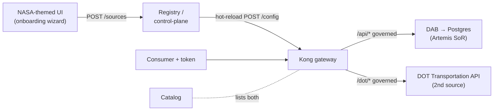

# Architecture

The POC builds the **local / open-source analogue** of each Azure-Government target
service, so the same architecture promotes to Azure later by swapping the gateway,
catalog, and identity for their managed equivalents — the *pattern* is identical.

## The zero-move flow

```text
   client / MCP agent
          │  (bearer token from the local issuer)
          ▼
   ┌──────────────┐   only path to data
   │  Kong (OSS)  │   JWT · rate-limit · meter · correlation-id
   │   gateway    │
   └──────┬───────┘
          │ REST / OData
          ▼
   ┌──────────────┐   auto-generated REST + GraphQL + OpenAPI (no hand-written API)
   │ Data API     │
   │ Builder (DAB)│
   └──────┬───────┘
          │  (internal network only — unreachable from clients)
          ▼
   ┌──────────────┐   system of record — data NEVER leaves here
   │  PostgreSQL  │   (synthetic SAP-shaped Artemis procurement)
   └──────────────┘

   catalog service ── publishes the OpenAPI + owner + classification + request path
   prometheus/grafana ── per-consumer call + latency metrics
```

Postgres and DAB attach **only** to an internal Docker network; the sole path to the
data for any client is **through Kong**. That is the zero-move proof (see
`ZERO-MOVE.md` + `tests/test_zero_move.py`).

## Azure ↔ OSS/local mapping

| White-paper component (Azure target) | POC local analogue (built here) | Why faithful |
|---|---|---|
| System of record (SAP procurement) | **PostgreSQL** seeded with synthetic SAP-shaped tables | Relational SoR that stays put; data never copied out |
| Expose data as an API without writing one | **Microsoft Data API Builder (DAB)** over Postgres | DAB is the actual MS product (MIT); auto REST+GraphQL+OpenAPI |
| Azure API Management (enterprise + AI gateway) | **Kong Gateway OSS** (DB-less) in front of DAB | The chosen OSS gateway; JWT, rate-limit, consumer metering |
| Microsoft Entra ID (OAuth2/JWT) | local **OIDC/JWT** issuer (RS256 + JWKS) | Same bearer-token validation pattern at the gateway |
| Enterprise API catalog (APIM dev portal / API Center) | **catalog** service (FastAPI) | Discoverable entry with owner/classification/request path |
| Dataverse `$metadata` discovery | DAB `/api/openapi` + a `$metadata`-style discovery doc | Schema discovery without tribal knowledge |
| Microsoft Purview (classify + label) | `data/classification.yml` applied at seed | Classify BEFORE exposure |
| Foundry/Copilot agent consumer (MCP) | **MCP server** + Python client | Agent reaches the governed surface, never the DB |
| Azure Monitor / App Insights | **Prometheus + Grafana** | Per-consumer metering + latency dashboard |
| Azure data platform (Databricks/Delta/UC) | documented only — see `AZURE-DEPLOYMENT.md` | Managed UC + Databricks SQL at FedRAMP High in commercial Azure |

## Networks (docker-compose)

- `internal` — `postgres` ↔ `dab` ↔ `transportation` ↔ kong-upstream only. The sources
  attach here (no host ports).
- `edge` — `kong` ↔ consumers / UI / catalog / mcp / registry. Consumers reach any
  source only via Kong.

## Multi-source federation + control-plane

The gateway fronts **multiple** sources. Beyond the built-in Artemis system of record,
an **onboarding wizard** publishes additional existing APIs (e.g. the DOT transportation
DAB API) through the same gateway at runtime — the API-Management / API-Center pattern.



- **`services/registry`** — reads the running base config (rendered with the live RSA
  key), merges a Kong `service`+`route`+plugins for each registered source, and hot-reloads
  Kong's DB-less config via the admin `/config` endpoint. No restart, no source change.
- **`services/transportation`** — a DOT-flavored DAB-style API (synthetic bridge
  inventory) that stands in for the published Azure DAB demo; internal-only like the SoR.
- Every added source inherits the same governance (JWT, per-consumer rate-limit,
  correlation id, CORS). See `docs/ADD-A-SOURCE.md`.

See `PRP.md` §2 and §6 for the full component contracts.
