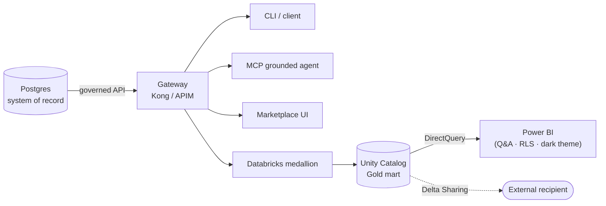

# 🚀 Art of the Possible — extending the zero-move data marketplace

[Home](../README.md) > [Documentation](README.md) > **Art of the Possible**

> [!WARNING]
> **Illustrative reference · synthetic data only · not an official NASA document.** Every
> value is generated by [`data/synthetic_data.py`](../data/synthetic_data.py). ITAR/CUI-safe.
> See [DISCLAIMER.md](DISCLAIMER.md).

> [!NOTE]
> **TL;DR** — The POC already proves the **zero-move** pattern end to end (Postgres → gateway
> → Databricks → Power BI, plus a grounded MCP agent). This page is the **roadmap of what
> else you can show on top of the same governed data product** — what's already built, and
> the bigger "art of the possible" items, each with why-it-matters and effort. Use it to
> drive the demo narrative.

---

## ✅ Already built (the proof points)

| Capability | Where | Story it tells |
|---|---|---|
| **Zero-move via API** | Kong / APIM gateway → DAB → Postgres | Sell access to data without copying it |
| **Governed at the edge** | JWT (RS256/Entra), per-consumer rate limits, OWASP guard, **field-level redaction**, correlation ids | Governance happens once, at the front door |
| **Lakehouse, zero-copy** | [`databricks/notebooks/01_zero_move_medallion.ipynb`](../databricks/notebooks/01_zero_move_medallion.ipynb) → Unity Catalog Gold mart (DirectQuery) | Even the heaviest consumer reads *through* the product |
| **Power BI report** | [`powerbi/`](../powerbi/) PBIP → **csa-loom** workspace, **NASA dark theme** | The executive last mile, as code |
| **Power BI Q&A** | Enabled on the semantic model | Natural-language questions over the governed mart |
| **Row-Level Security** | `role 'Artemis-3 Analyst'` in [`model.tmdl`](../powerbi/ArtemisSupplyRisk.SemanticModel/definition/model.tmdl) | Governance carried to the report layer |
| **Grounded AI agent (MCP)** | [`services/agent`](../services/agent) over the gateway | AI answers only from governed data, cited |
| **Marketplace UI** | [`frontend/`](../frontend) — landing, drill-down, agent chat, Power BI link | One pane for humans |

---

## 🎯 The roadmap — what else to show

Status legend: ✅ built · 🟡 quick add · 🟠 medium · 🔴 larger / admin-gated.

### 📊 Analytics & BI (Power BI / Fabric)

| Idea | Why it matters | Status |
|---|---|---|
| **Q&A natural language** — "which sole-source Artemis-3 parts are most at risk?" | Self-service over governed data, no DAX | ✅ enabled |
| **Row-Level Security** — program managers see only their program | Governance to the report layer | ✅ in model; assign members in Service |
| **NASA dark theme** | On-brand, demo-ready | ✅ live + in repo |
| **Copilot narrative visual** — auto-written exec summary that reacts to slicers | "AI explains the data" moment | 🟡 add in the report editor |
| **Direct Lake** — import-speed over Delta, still zero-copy | Speed *and* zero-move. **Commercial-Azure only — Direct Lake / OneLake are not available in Azure Gov**, so keep DirectQuery as the Gov default | 🔴 |
| **Scorecard / Metrics (Goals)** — track *Critical Slips >30d* vs a target | Executive KPI tracking with status | 🟠 |
| **Embedded analytics** — embed the report inside the marketplace UI | Gateway + BI in one pane (app-owns-data + embed token) | 🟠 (a config-driven **link** is already wired in the UI) |

### 🤖 AI across surfaces (the throughline)

| Idea | Why it matters | Status |
|---|---|---|
| **Grounded MCP agent** over the gateway | AI on governed data, cited, sass-refuses off-topic | ✅ built |
| **Power BI Q&A + Fabric Data Agent** over the same model | *One data product, AI on every surface* (CLI, MCP, BI) | 🟡 Q&A done · 🔴 Data Agent (preview/capacity) |
| **APIM AI gateway** — token metering / throttling / content safety for LLM calls | Govern the *AI* traffic like any other API | 🔴 APIM policy + config |

### 🔐 Governance, security, sharing

| Idea | Why it matters | Status |
|---|---|---|
| **Field-level redaction** at the gateway | Sensitive columns never cross the edge | ✅ built |
| **Delta Sharing** — zero-copy share the Gold mart to an external org | Zero-move *beyond your walls* | 🟡 notebook attempts it; needs sharing enabled + a recipient |
| **Microsoft Purview** — sensitivity labels + end-to-end lineage (Postgres→gateway→Databricks→Power BI) | Classify-before-exposure, provable lineage | 🔴 Purview + Information Protection (admin) |
| **Microsoft Sentinel / Defender for APIs** over the gateway logs | SOC visibility on the data marketplace | 🔴 Log Analytics + Sentinel |

### ⚡ Real-time / scale

| Idea | Why it matters | Status |
|---|---|---|
| **Eventhouse / real-time tile** — a live "pad-anomaly" or ingest feed | "Live ops" feel on top of the curated mart | 🔴 |
| **Self-hosted runner** for CI in your Azure | CI without GitHub-hosted billing | ✅ built ([`infra/azure/runner`](../infra/azure/runner)) |

---

## 🗣️ Suggested demo flow (≈10 min)

1. **The question** — CLI/UI asks the Artemis-3 supply-risk question → answer returns **through the gateway** (show the correlation id, the 401→200→429 governance).
2. **Same product, the agent** — ask the **MCP agent** in the UI; it cites the gateway + refuses an off-topic question.
3. **Same product, the lakehouse** — the Databricks notebook landed the Gold mart **zero-copy**; show the redacted `$` columns.
4. **Same product, the executive** — the **Power BI** report (NASA dark theme) over **DirectQuery**; run **Q&A**; flip **RLS** with *View as Artemis-3 Analyst*.
5. **The close** — one governed data product, consumed by a CLI, an AI agent, the lakehouse, and BI — **without moving the system of record**. Then point at this roadmap for what's next.

---

## ▶️ Where to next

- [`powerbi/README.md`](../powerbi/README.md) — the Power BI project (publish ⇄ export, theme, RLS).
- [`docs/DATABRICKS-WALKTHROUGH.md`](DATABRICKS-WALKTHROUGH.md) — the zero-move lakehouse.
- [`docs/concepts/07-mcp-and-agents.md`](concepts/07-mcp-and-agents.md) — the grounded agent.
- [`docs/AZURE-LIVE-DEPLOYMENT.md`](AZURE-LIVE-DEPLOYMENT.md) — the deployed stack + honest deltas.
