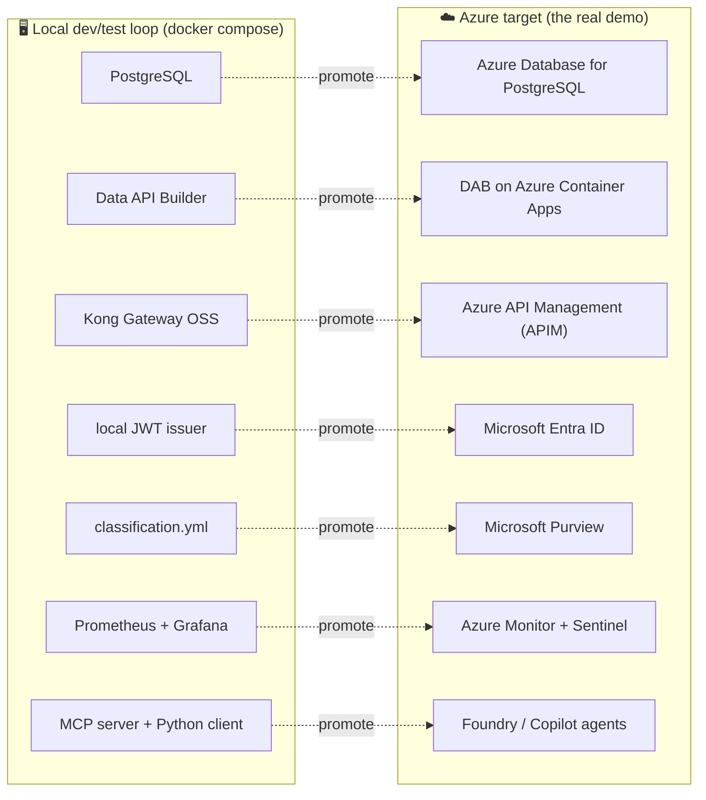
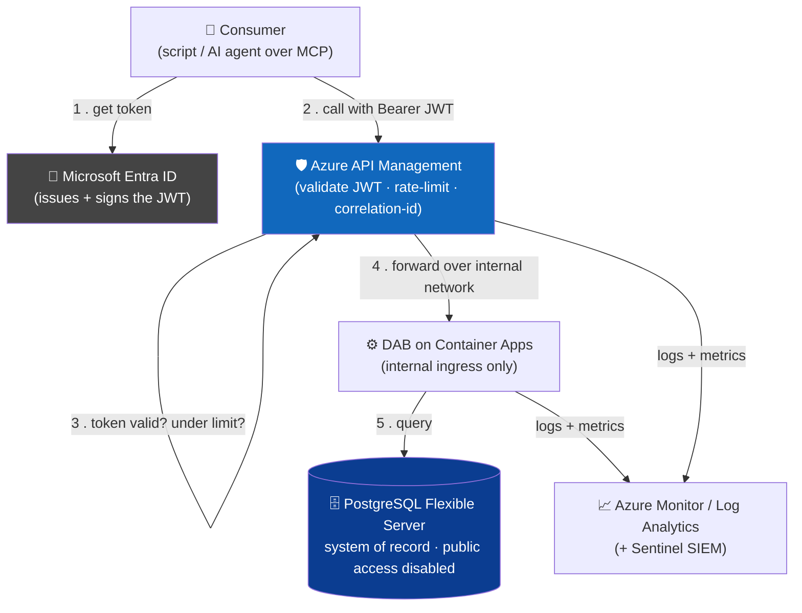
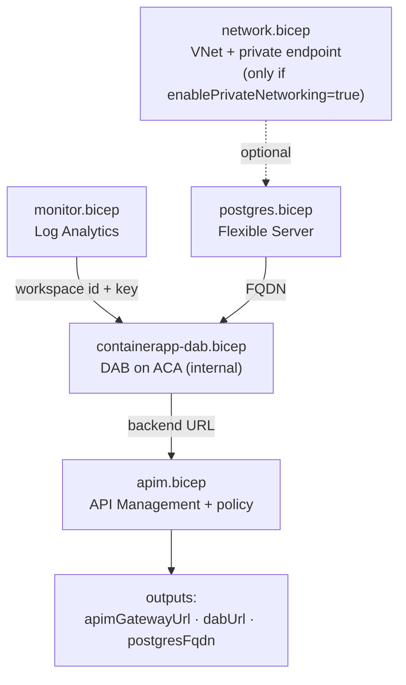
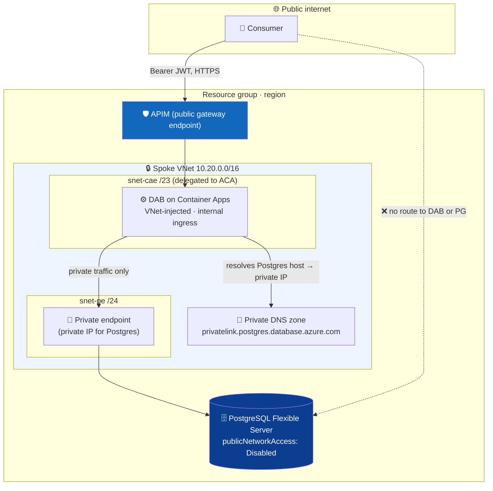

# ☁️ Deploying to Azure — The Flagship Teaching Tutorial

[Home](../README.md) > [Documentation](README.md) > **Deploying to Azure (teaching tutorial)**

> [!WARNING]
> **Illustrative reference · sample/synthetic data only · not an official NASA
> document.** Every vendor, material, and figure in this repo is generated by a seeded
> script. Read **[DISCLAIMER.md](DISCLAIMER.md)** before sharing or adapting anything here.

> [!NOTE]
> **TL;DR — what this document is.**
> This is the **primary story** of the whole proof-of-concept: *take the API-first,
> zero-move data marketplace and stand it up in Azure to show the full art of the
> possible.* The local `docker compose up` stack you may have run is the **develop-and-test
> loop** — a laptop stand-in. The architecture here is the real demo.
>
> You will learn **each Azure service as we introduce it** — *why it exists*, *what
> problem it solves*, and *which open-source piece of the local stack it replaces* —
> then deploy them together with the reference Bicep in [`infra/azure/`](../infra/azure).
> No prior Azure experience is assumed; every term and acronym is defined on first use
> (and collected in the [Glossary](GLOSSARY.md)).

---

## 📑 Table of Contents

- [Who this is for, and how to read it](#-who-this-is-for-and-how-to-read-it)
- [The one big idea: a swap, not a rewrite](#-the-one-big-idea-a-swap-not-a-rewrite)
- [Azure vocabulary you need first](#-azure-vocabulary-you-need-first-5-minutes)
- [The target architecture](#-the-target-architecture)
- [Prerequisites](#-prerequisites)
- [The services, taught one at a time](#-the-services-taught-one-at-a-time)
  - [1. Azure Monitor / Log Analytics](#1--azure-monitor--log-analytics-the-eyes)
  - [2. Azure Database for PostgreSQL](#2--azure-database-for-postgresql-flexible-server-the-system-of-record)
  - [3. Azure Container Apps + DAB](#3--azure-container-apps--data-api-builder-the-auto-api-host)
  - [4. Azure API Management](#4--azure-api-management-apim--the-front-door)
  - [5. Microsoft Entra ID](#5--microsoft-entra-id-the-identity-backbone)
  - [6. Azure Container Registry & Key Vault](#6--azure-container-registry--key-vault-images-and-secrets)
  - [7. Microsoft Sentinel](#7--microsoft-sentinel-the-siem-layer)
  - [8. Azure Databricks](#8--azure-databricks--unity-catalog-the-lakehouse)
- [Deploying the reference Bicep, step by step](#-deploying-the-reference-bicep-step-by-step)
- [Production hardening: true zero-move with a VNet & private endpoints](#-production-hardening-true-zero-move-with-a-vnet--private-endpoints)
- [Data-platform posture (FedRAMP High & Azure Government)](#-data-platform-posture-fedramp-high--azure-government)
- [Compliance](#-compliance)
- [Live, dated pricing](#-live-dated-pricing)
- [Gotchas & troubleshooting](#-gotchas--troubleshooting)
- [Where to next](#-where-to-next)

---

## 🧭 Who this is for, and how to read it

You are a capable engineer who has **never used Azure** (or has used a little, but not
these services). You want to understand *why* the cloud version of this POC is built the
way it is — not just copy commands.

> **In plain terms:** the local stack proves the *pattern*. This document proves the
> *platform* — that the exact same pattern, with no architectural changes, runs on
> managed Azure services that an enterprise can actually buy, secure, and audit.

Read the sections in order. Each one introduces a single Azure service, explains the
problem it solves, names the local component it replaces, and shows the slice of
[`infra/azure/`](../infra/azure) Bicep that creates it. By the end you can deploy the
reference stack and explain every resource in it.

> [!TIP]
> Two companion documents continue this story once you finish here:
> [`AZURE-LIVE-DEPLOYMENT.md`](AZURE-LIVE-DEPLOYMENT.md) walks the **actually-deployed**
> Container Apps stack (front end, gateway, identity, catalog, DAB, all live), and
> [`APIM-CAPABILITIES.md`](APIM-CAPABILITIES.md) covers what the managed gateway adds
> over the open-source one.

---

## 💡 The one big idea: a swap, not a rewrite

The local POC was built so that **every open-source component is the faithful analogue of
an Azure managed service.** That is deliberate. Because the architecture is identical on
both sides, promoting the POC to Azure is a *swap* — you exchange each box for its managed
twin — not a from-scratch rebuild.



| You run locally… | …because in Azure it becomes | Why the swap is clean |
|---|---|---|
| **PostgreSQL** (system of record) | **Azure Database for PostgreSQL Flexible Server** | same SQL engine; the data still never leaves it |
| **Microsoft Data API Builder** (DAB) | **DAB on Azure Container Apps** (or Dataverse Web API) | identical config; just hosted and scaled for you |
| **Kong Gateway OSS** | **Azure API Management** (APIM) | the same JWT / rate-limit / metering policies, managed |
| **Local OIDC/JWT issuer** (`issuer.py`) | **Microsoft Entra ID** | same bearer-token validation pattern, enterprise-grade |
| **`classification.yml`** | **Microsoft Purview** | classify *before* exposure, now centrally governed |
| **Prometheus + Grafana** | **Azure Monitor + Microsoft Sentinel** | same per-consumer metrics, now SIEM-integrated |
| **MCP server + Python client** | **Foundry / Copilot agents over MCP** | same open protocol; the agent reaches the governed door |
| **Databricks medallion notebook** | **Azure Databricks + Unity Catalog + Delta Sharing** | open formats (Delta) keep it portable |

> [!NOTE]
> **Acronyms used throughout, defined once.** **SoR** = system of record (the authoritative
> database). **DAB** = [Data API Builder](https://learn.microsoft.com/azure/data-api-builder/overview),
> the Microsoft tool that auto-generates a REST/GraphQL API over a database. **APIM** =
> Azure API Management (the managed gateway). **JWT** = JSON Web Token, a signed credential
> a caller presents to prove identity. **OData** = an open standard for queryable REST
> APIs. **MCP** = Model Context Protocol, the open standard that lets an AI agent call a
> tool. **IaC** = Infrastructure as Code (here, **Bicep** — Azure's declarative
> deployment language). **VNet** = virtual network. **SIEM** = Security Information and
> Event Management. New terms are defined the first time they appear.

---

## 📚 Azure vocabulary you need first (5 minutes)

Before any service, four pieces of Azure shape *everything* you deploy. Learn these and
the rest follows.

| Term | What it is | Why it matters here |
|---|---|---|
| **Subscription** | The billing and access boundary. Every resource lives in exactly one subscription. | You need one to deploy. CI does **not** — this repo compiles the IaC without ever touching a subscription. |
| **Resource group (RG)** | A named folder that holds related resources and shares their lifecycle. Delete the RG → delete everything in it. | The whole reference stack deploys into one RG (e.g. `artemis-poc-rg`), so teardown is a single command. |
| **Region** | The physical datacenter location (e.g. `eastus`, `usgovvirginia`). | Region choice drives **compliance and data residency** — the heart of the [FedRAMP/Gov posture](#-data-platform-posture-fedramp-high--azure-government) below. |
| **Bicep** | Azure's declarative IaC language. You describe the *desired* resources; Azure makes reality match. | The entire target is described in [`infra/azure/`](../infra/azure) as Bicep **modules** (one file per service) wired together by `main.bicep`. |

> **In plain terms:** a *subscription* is your account, a *resource group* is a project
> folder inside it, a *region* is which datacenter holds the folder, and *Bicep* is the
> recipe that fills the folder with services. You will see all four in the deploy
> commands later.

> [!IMPORTANT]
> The Bicep in this repo is **documentation-grade reference IaC**. It compiles cleanly
> with `az bicep build` and *can* be deployed, but **CI never deploys it** and **needs no
> Azure subscription**. The point is to show the managed target faithfully, not to run a
> billed cloud environment in continuous integration. (A separate, *actually-deployed*
> stack is documented in [`AZURE-LIVE-DEPLOYMENT.md`](AZURE-LIVE-DEPLOYMENT.md).)

---

## 🏗️ The target architecture

Here is the whole managed stack and how a single request flows through it. Read the
diagram first — it is the mental model the rest of the document fills in.



The crucial property — **the same one the local POC proves with a test** — is that the
consumer has **no path to the database**. The only door is APIM. DAB sits behind it on an
internal-only ingress; PostgreSQL has public network access disabled. The data never
moves because there is nowhere off-platform for a client to pull it to.

> **Why this matters:** "zero-move" is not a slogan. It is the difference between a
> defensible, auditable, single-source-of-truth architecture and a sprawl of copies
> compliance can't reason about. In Azure, the [VNet/private-endpoint hardening](#-production-hardening-true-zero-move-with-a-vnet--private-endpoints)
> makes the no-public-path property literally true at the network layer.

---

## ✅ Prerequisites

To **compile** the reference IaC (no cloud needed — this is what CI does):

```bash
az bicep build --file infra/azure/main.bicep   # compiles clean; emits main.json (gitignored)
```

To **deploy** it for real, you additionally need:

- An **Azure subscription** with rights to create resources in a resource group.
- The **Azure CLI** (`az`) installed and signed in: `az login`.
- A strong **PostgreSQL admin password**, supplied at deploy time via the
  `PG_ADMIN_PASSWORD` environment variable — **never committed** (see the deploy step).

> [!TIP]
> Don't have a subscription? You can still follow every section: read the Bicep snippets,
> run `az bicep build` to confirm they compile, and use `make pricing` to see live costs.
> The teaching value does not require spending a cent.

---

## 🧱 The services, taught one at a time

Each subsection follows the same shape: **the problem → the Azure service that solves it →
the local component it replaces → the Bicep that creates it.** They are ordered the way
`main.bicep` deploys them, because later services depend on earlier ones (DAB needs the
Log Analytics keys and the Postgres FQDN; APIM needs DAB's URL).

### 1. 📈 Azure Monitor / Log Analytics (the eyes)

**The problem.** You cannot govern what you cannot see. Every request through the gateway,
every query DAB runs, every error — someone needs to be able to ask *"who called this API,
how often, and did anything fail?"* and get an answer.

**The service.** **Azure Monitor** is Azure's built-in observability platform. Its storage
and query engine is a **Log Analytics workspace** — a managed data store you query with
**KQL** (Kusto Query Language). Container Apps and APIM both stream their logs and metrics
into it automatically once wired up.

**Replaces locally:** Prometheus (metrics store) + Grafana (dashboards). Same idea —
per-consumer traffic, error rates, latency — now a managed service with no containers to run.

**Deploy order note:** it is created **first** because DAB's Container Apps environment
needs the workspace's id and key to ship its logs there.

```bicep
// infra/azure/modules/monitor.bicep — Log Analytics workspace
resource workspace 'Microsoft.OperationalInsights/workspaces@2023-09-01' = {
  name: '${namePrefix}-logs'
  location: location
  properties: {
    sku: { name: 'PerGB2018' }   // pay per GB ingested
    retentionInDays: 30
  }
}
```

The module outputs the workspace's `customerId` and a primary key; `main.bicep` passes
both into the DAB module so the container environment logs to it.

> **Why this matters:** the local demo's headline observability moment is Grafana showing
> *per-consumer* traffic. In Azure, that exact view comes from KQL over this workspace —
> and (see [Sentinel](#7--microsoft-sentinel-the-siem-layer)) the same data feeds the SIEM.

---

### 2. 🗄️ Azure Database for PostgreSQL Flexible Server (the system of record)

**The problem.** The whole pattern exists to expose a *system of record* without copying
it. You need a managed, durable Postgres that an enterprise can run in production — backups,
patching, high availability — without standing up a database server by hand.

**The service.** **Azure Database for PostgreSQL Flexible Server** is the managed Postgres
offering. "Flexible Server" is the deployment model that gives you control over version,
compute size, maintenance window, and — critically here — **network access**.

**Replaces locally:** the `postgres:16` container. Same engine (PostgreSQL 16), same
`procurement` database, same data — now managed.

```bicep
// infra/azure/modules/postgres.bicep
resource pg 'Microsoft.DBforPostgreSQL/flexibleServers@2024-08-01' = {
  name: '${namePrefix}-pg'
  location: location
  sku: { name: 'Standard_D2ds_v5', tier: 'GeneralPurpose' }
  properties: {
    version: '16'
    administratorLogin: adminUser
    administratorLoginPassword: adminPassword   // @secure() — supplied at deploy time
    storage: { storageSizeGB: 32 }
    highAvailability: { mode: 'Disabled' }      // enable for production
    network: {
      publicNetworkAccess: 'Disabled'           // 👈 the zero-move lever
    }
  }
}
```

The single most important line is `publicNetworkAccess: 'Disabled'`. It means the database
has **no internet-facing endpoint** — exactly the local POC's guarantee that Postgres lives
on an internal-only network. In the [hardened topology](#-production-hardening-true-zero-move-with-a-vnet--private-endpoints),
DAB reaches it over a **private endpoint** instead.

> [!NOTE]
> The password is a `@secure()` Bicep parameter — Azure never logs it and it never appears
> in deployment output. You supply it at deploy time from the `PG_ADMIN_PASSWORD`
> environment variable (see the [deploy step](#-deploying-the-reference-bicep-step-by-step)).
> No secret is ever committed.

---

### 3. ⚙️ Azure Container Apps + Data API Builder (the auto-API host)

**The problem.** Data API Builder turns the database into a REST + GraphQL + OpenAPI
surface, but *something has to run it.* You want that "something" to be serverless-ish —
scale on demand, no VM to patch — and, vitally, **not reachable directly by clients**.

**The service.** **Azure Container Apps (ACA)** is a managed, serverless container platform
built on Kubernetes that you never have to operate as Kubernetes. You give it a container
image; it runs and autoscales it. Containers live inside a **managed environment** (the
networking + logging boundary), and each app declares an **ingress** — *external*
(internet-reachable) or **internal** (reachable only from inside the environment/VNet).

**Replaces locally:** the `dab` container in `docker-compose.yml`.

```bicep
// infra/azure/modules/containerapp-dab.bicep
resource dab 'Microsoft.App/containerApps@2024-03-01' = {
  name: '${namePrefix}-dab'
  properties: {
    managedEnvironmentId: env.id
    configuration: {
      ingress: {
        external: false      // 👈 INTERNAL ingress: only APIM can reach DAB
        targetPort: 5000
        transport: 'http'
      }
      secrets: [ { name: 'dab-connection-string', value: dabConnectionString } ]
    }
    template: {
      containers: [ {
        name: 'dab'
        image: image          // mcr.microsoft.com/azure-databases/data-api-builder:latest
        resources: { cpu: json('0.5'), memory: '1Gi' }
        env: [ { name: 'DAB_CONNECTION_STRING', secretRef: 'dab-connection-string' } ]
      } ]
      scale: { minReplicas: 1, maxReplicas: 3 }   // autoscale 1→3
    }
  }
}
```

Two design choices carry the whole pattern:

1. **`external: false`** — DAB has **no public URL**. The only thing that can call it is
   APIM, sitting in front. This is the Azure equivalent of putting DAB on the local
   `internal` Docker network.
2. **The connection string is a secret** (`secretRef`), injected as an environment
   variable. In `main.bicep` it is composed from the Postgres FQDN with
   `SslMode=Require`, so DAB↔Postgres traffic is encrypted.

> **In plain terms:** Container Apps is "give me a container, I'll run and scale it, and
> I'll keep it off the public internet if you tell me to." Here we tell it to.

---

### 4. 🛡️ Azure API Management (APIM) — the front door

**The problem.** A raw auto-API has no governance. Anyone who can reach it can hammer it,
unauthenticated, with no audit trail. You need a single, policy-driven **front door** that
authenticates every caller, throttles abuse, stamps a traceable id on each request, and
becomes the *only* way in.

**The service.** **Azure API Management** is the managed API gateway. You import an API,
attach **policies** (small XML rules that run on each request), and APIM enforces them at
the edge. It also ships a **Developer Portal** so consumers can discover and try the API.

**Replaces locally:** Kong Gateway OSS. The Kong plugins map one-to-one onto APIM policies.

```bicep
// infra/azure/modules/apim.bicep — the policy is the heart of the parity
var policyXml = '''
<policies>
  <inbound>
    <base />
    <validate-azure-ad-token tenant-id="__TENANT_ID__">
      <audiences><audience>api://artemis-api</audience></audiences>
    </validate-azure-ad-token>
    <rate-limit-by-key calls="60" renewal-period="60"
      counter-key="@(context.Subscription?.Id ?? context.Request.IpAddress)" />
    <set-header name="X-Correlation-ID" exists-action="skip">
      <value>@(context.RequestId.ToString())</value>
    </set-header>
  </inbound>
  <backend><base /></backend>
  <outbound><base /></outbound>
  <on-error><base /></on-error>
</policies>
'''
```

Read that policy against the local Kong config and the parity is exact:

| Kong plugin (local) | APIM policy (Azure) | What it does |
|---|---|---|
| JWT auth | `validate-azure-ad-token` | rejects any request without a valid Entra-signed JWT for audience `api://artemis-api` → **401** |
| `rate-limiting` | `rate-limit-by-key` | 60 calls / 60s per caller; over-limit → **429** |
| correlation-id | `set-header X-Correlation-ID` | stamps a traceable id so a request can be followed across logs |

> [!TIP]
> The reference uses the **Developer** SKU (`sku: { name: 'Developer', capacity: 1 }`) —
> cheapest, ideal for a POC, **no SLA**. For production move to **Standard/Premium** or the
> newer **v2** tiers. The trade-offs are covered in [`APIM-EDITION.md`](APIM-EDITION.md).

**The art-of-the-possible upgrade:** APIM also has **AI-gateway policies** —
`llm-token-limit` and `llm-emit-token-metric` — that extend this exact metering pattern to
LLM endpoints (rate-limit and meter *tokens*, not just calls). That is the bridge from
"govern a data API" to "govern an AI API." See [`APIM-CAPABILITIES.md`](APIM-CAPABILITIES.md).

---

### 5. 🔐 Microsoft Entra ID (the identity backbone)

**The problem.** Somebody must *issue* and *sign* the JWTs that APIM validates. In the
local POC that is a tiny RS256 issuer container — fine for a laptop, not for an enterprise.
You need a real identity provider with users, groups, app registrations, conditional
access, and audit.

**The service.** **Microsoft Entra ID** (formerly Azure Active Directory) is Azure's
identity platform. An **app registration** represents your API as a protected resource with
an **audience** (here `api://artemis-api`); callers obtain a token from Entra and present it
as a `Bearer` token. APIM's `validate-azure-ad-token` policy checks the signature, issuer,
and audience against your **tenant** (your organization's Entra directory).

**Replaces locally:** the RS256 JWT issuer (`issuer.py`) + its JWKS endpoint. Same
bearer-token pattern; Entra is the enterprise-grade version.

```bicep
// In apim.bicep, the policy is parameterized by your tenant id:
param tenantId string = subscription().tenantId
// ...validate-azure-ad-token tenant-id="<your tenant>"...
```

> [!IMPORTANT]
> **Entra is referenced, not scripted, in this RG deployment — on purpose.** Creating an
> app registration is a **tenant-level** operation (it lives in the directory, not in a
> resource group), so it is performed once outside the per-RG Bicep. The Bicep simply
> *consumes* the resulting tenant id. The live deployment shows this end to end: it uses
> Entra **EasyAuth** to tenant-lock the front end and protect DAB — see
> [`AZURE-LIVE-DEPLOYMENT.md`](AZURE-LIVE-DEPLOYMENT.md).

> **Why this matters:** identity is the moat under every other layer. Rate-limiting and
> correlation ids are only meaningful once you *know who is calling* — and that knowledge
> comes from Entra.

---

### 6. 📦 Azure Container Registry & Key Vault (images and secrets)

These two appear in the **live** deployment ([`AZURE-LIVE-DEPLOYMENT.md`](AZURE-LIVE-DEPLOYMENT.md))
rather than the minimal reference Bicep, but you must understand them to deploy your own
images and to handle secrets correctly.

**Azure Container Registry (ACR)** — **the problem:** Container Apps needs somewhere to pull
your images from. **The service:** ACR is a private, managed Docker registry inside your
subscription. You `az acr build` (or push) the per-service images (gateway, identity,
catalog, DAB, …) and ACA pulls from there. *Replaces locally:* the images Docker Compose
builds on your laptop.

**Azure Key Vault** — **the problem:** the database connection string is a secret; it must
not sit in plaintext config or source control. **The service:** Key Vault is a managed
secret store with **RBAC** (role-based access control) — apps read secrets via a managed
identity, never a hardcoded key. In the live stack, DAB's connection string is stored in
Key Vault (`dab-conn`) and referenced by the container, exactly mirroring the local
`.env`-from-`.env.example` discipline. *Replaces locally:* `.env`.

> **In plain terms:** ACR is "where your container images live in the cloud," Key Vault is
> "where your secrets live in the cloud." Together they keep images private and secrets out
> of code.

---

### 7. 🚨 Microsoft Sentinel (the SIEM layer)

**The problem.** Logs in a workspace tell you *what happened*. Security teams need more:
*detect* threats, *correlate* across sources, and *respond*. That is a SIEM's job.

**The service.** **Microsoft Sentinel** is Azure's cloud-native **SIEM** (Security
Information and Event Management). It sits *on top of* the same Log Analytics workspace from
[step 1](#1--azure-monitor--log-analytics-the-eyes), turning your gateway and app logs into
detections, hunting queries, and automated playbooks.

**Replaces locally:** there is no local equivalent — Sentinel is part of the "art of the
possible" you *gain* by moving to Azure. Locally you see metrics in Grafana; in Azure the
same telemetry can drive security operations.

> **Why this matters:** the local demo answers "who called the API?" In Azure, Sentinel
> turns that same stream into "alert me when an unusual caller pattern appears." Same data,
> dramatically more capability — and it requires no new instrumentation, because APIM and
> Container Apps already log to the workspace Sentinel reads.

---

### 8. 🧊 Azure Databricks + Unity Catalog (the lakehouse)

**The problem.** The governed API answers *operational* questions ("what's the supply risk
on Artemis-3 right now?"). *Analytical* questions — trends, joins across years, BI
dashboards — want a **lakehouse**: cheap object storage holding open-format tables, with a
catalog governing access. And it must stay zero-move-friendly and **divestable** (no lock-in).

**The service.** **Azure Databricks** is the managed lakehouse platform. The pieces:

- **ADLS Gen2** (Azure Data Lake Storage Gen2) — object storage with a *hierarchical
  namespace* (`isHnsEnabled: true`), the substrate for lake tables.
- **Delta Lake** — the open table format (ACID transactions over Parquet files) Databricks
  reads and writes. Open format = portable.
- **Unity Catalog** — the governance layer: one catalog of tables, permissions, and lineage
  across workspaces. Requires the **premium** workspace tier.
- **Databricks SQL** — the SQL warehouse engine for BI tools (e.g. Power BI).
- **Delta Sharing** — an open protocol for sharing Delta tables across organizations without
  copying.

**Replaces locally:** the medallion notebook in [`databricks/`](../databricks) that demos
the Bronze→Silver→Gold pattern on the synthetic data.

```bicep
// infra/azure/modules/databricks.bicep — STANDALONE reference (not wired into main.bicep)
resource storage 'Microsoft.Storage/storageAccounts@2023-05-01' = {
  // ...
  properties: { isHnsEnabled: true, minimumTlsVersion: 'TLS1_2', allowBlobPublicAccess: false }
}
resource workspace 'Microsoft.Databricks/workspaces@2024-05-01' = {
  sku: { name: 'premium' }   // premium tier is required for Unity Catalog
  // ...
}
resource connector 'Microsoft.Databricks/accessConnectors@2024-05-01' = {
  identity: { type: 'SystemAssigned' }   // workspace → storage via managed identity
}
```

> [!NOTE]
> This module is **standalone** — it is *not* referenced by `main.bicep`. The lakehouse is
> an *extension* of the core API-first pattern, deployed separately when you want the
> analytics arc. The full walkthrough is in
> [`DATABRICKS-WALKTHROUGH.md`](DATABRICKS-WALKTHROUGH.md) →
> [`POWERBI-GUIDE.md`](POWERBI-GUIDE.md).

The deeper *posture* question — *which Azure cloud this runs in, and why Fabric/OneLake are
excluded* — is the subject of the [data-platform posture section](#-data-platform-posture-fedramp-high--azure-government).

---

## 🚀 Deploying the reference Bicep, step by step

Now assemble the pieces. `main.bicep` is the **composition root** — it imports each module
and wires the outputs of one into the inputs of the next (monitor → postgres → dab → apim),
which is exactly the dependency order you learned above.



**Step 1 — validate it compiles (no subscription needed).**

```bash
az bicep build --file infra/azure/main.bicep
```

*What this did:* parsed every module, type-checked the wiring, and emitted `main.json`
(the ARM template Azure actually deploys — gitignored). If it prints nothing, it
succeeded. **This is the exact check CI runs**, which is why the IaC never needs a cloud.

**Step 2 — create a resource group** (with a subscription; pick your region).

```bash
az group create -n artemis-poc-rg -l usgovvirginia
```

*Expected output (trimmed):*

```json
{ "name": "artemis-poc-rg", "location": "usgovvirginia", "properties": { "provisioningState": "Succeeded" } }
```

*What this did:* made the folder all the resources will live in. (`usgovvirginia` is an
Azure Government region — see the [posture section](#-data-platform-posture-fedramp-high--azure-government)
for when to choose Gov vs. commercial.)

**Step 3 — deploy the stack**, supplying the Postgres password from the environment so it
is never written to disk or git:

```bash
PG_ADMIN_PASSWORD='<choose-a-strong-secret>' \
  az deployment group create -g artemis-poc-rg \
    -f infra/azure/main.bicep -p infra/azure/main.bicepparam
```

*What this did:* `main.bicepparam` reads `PG_ADMIN_PASSWORD` via
`readEnvironmentVariable('PG_ADMIN_PASSWORD', '')` and passes it into the `@secure()`
Postgres parameter. Azure then provisions monitor → postgres → dab → apim in dependency
order. On success it prints the **outputs**:

```text
apimGatewayUrl : https://<your-apim>.azure-api.net
dabUrl         : https://artemis-dab.<region>.azurecontainerapps.io   (internal — not callable from your laptop)
postgresFqdn   : <your-pg-server>.postgres.database.azure.com               (public access disabled)
```

The `apimGatewayUrl` is the **only** endpoint a client should ever use — the same role the
local Kong proxy plays. `dabUrl` is internal-ingress (unreachable from outside), and
`postgresFqdn` has public access disabled. **That is zero-move, enforced by the platform.**

> [!WARNING]
> **Stop billing when you're done.** A POC stack — especially APIM and Databricks — accrues
> cost. Delete the whole resource group in one command:
> `az group delete -n artemis-poc-rg --yes --no-wait`. (The live deployment ships
> [`scripts/azure-teardown.sh`](../scripts/azure-teardown.sh) for the same purpose.)

---

## 🔒 Production hardening: true zero-move with a VNet & private endpoints

The functional deployment above already disables public access on Postgres and keeps DAB on
internal ingress. The **production-hardened** posture goes one step further and removes the
public path *at the network layer* — so the data has no internet-facing surface at all.

Enable it by passing `enablePrivateNetworking=true`, which conditionally deploys
[`modules/network.bicep`](../infra/azure/modules/network.bicep):

```bicep
// main.bicep — the network module is conditional
module network 'modules/network.bicep' = if (enablePrivateNetworking) { ... }
```

**What it builds, and why each piece exists:**

- **A spoke VNet** (`10.20.0.0/16`) — a private network you own inside Azure, with two
  subnets:
  - `snet-cae` (`/23`), **delegated** to the Container Apps environment so DAB runs *inside*
    the VNet.
  - `snet-pe` (`/24`), which holds **private endpoint** network interfaces.
- **A private endpoint** on the Postgres server — a private IP inside `snet-pe` that maps to
  the database. The database is now reachable *only* over this private IP.
- **A private DNS zone** (`privatelink.postgres.database.azure.com`) linked to the VNet, so
  that inside the VNet the Postgres hostname resolves to the **private** IP instead of a
  public one.



> **In plain terms:** the database moves *inside a walled garden*. The only door into the
> garden is APIM. DAB lives in the garden and reaches Postgres over a private wire whose
> address only exists inside the garden's private phone book (the DNS zone). There is no
> public phone number for the database to call — so the data cannot be pulled off-platform.
> This is the Azure-native, network-enforced version of the local POC's `internal` Docker
> network, and it is what [`tests/test_zero_move.py`](../tests/test_zero_move.py) proves on
> the local side.

> [!NOTE]
> The module is **reference-only** and off by default because the functional demo is
> simpler with public ingress (and the gateway still governs every call). Turn it on for a
> production-representative posture. Wiring it fully means feeding the subnet outputs into
> the Container Apps environment and associating the private endpoint with the Postgres
> server — the module documents both hooks at the top of the file.

---

## 🌐 Data-platform posture (FedRAMP High & Azure Government)

This is the section a security architect will scrutinize. It answers: *which Azure cloud
does the managed data platform run in, and why?*

**The default: commercial Azure at FedRAMP High.** The full *managed* data platform —
**Azure Databricks with managed Unity Catalog, Databricks SQL, Delta Lake, and Delta
Sharing on ADLS Gen2** — runs in **commercial (global) Azure**, which holds **FedRAMP High**
authorization. **FedRAMP** is the U.S. government's standardized cloud security
authorization program; **High** is its most stringent impact level. That boundary is what
the customer's cyber organization has accepted for Databricks, and the full managed feature
set is available there.

> **In plain terms:** "FedRAMP High in commercial Azure" means the data platform runs in
> the normal global Azure cloud, but in a configuration the government has certified at its
> highest standard impact level. You do **not** need to drop to a more restricted cloud to
> be compliant — unless the data is ITAR / strict-CUI (below).

- **Data classification drives the boundary, not vendor preference.** Unclassified and
  CUI-adjacent workloads run in commercial Azure at FedRAMP High.
- **The Azure Government exception is a *subset*, not the default.** Only **ITAR /
  strict-CUI** data must run in **Azure Government** regions (US Gov Arizona / US Gov
  Virginia). There, *managed* Unity Catalog and Databricks SQL are not yet available, so the
  catalog fallback is **open-source Unity Catalog on agency-controlled compute**, or
  **Microsoft Purview**. This gap applies **only** to that ITAR/strict-CUI subset.
- **Open formats keep it divestable.** Because the platform stores data as **Delta Lake**
  and shares via **Delta Sharing** — both open, with Unity Catalog itself open-source-rooted
  — there is no lock-in either way. You can leave with your data and your catalog intact.

> [!IMPORTANT]
> **Microsoft Fabric and OneLake are explicitly excluded** — they are **not available in
> Azure Government / GCC**, the deployment boundary this POC respects. The managed
> data-platform answer here is **Azure Databricks + Unity Catalog + Delta Lake + ADLS
> Gen2**. Do not introduce Fabric/OneLake. *(This is a hard constraint of the project; the
> test [`tests/test_no_fabric.py`](../tests/test_no_fabric.py) greps the repo to enforce
> it.)*

---

## ✅ Compliance

Both global (commercial) Azure and Azure Government hold **FedRAMP High** authorization. The
practical difference between them is **data residency and personnel-access controls** —
ITAR/EAR-style restrictions on *where* the data physically resides and *who* (citizenship,
clearance) may operate the platform — **not the FedRAMP level itself.**

> **Why this matters for region choice:** when you ran `az group create -l usgovvirginia`
> versus `-l eastus`, you were choosing exactly this trade-off. Pick a Gov region only when
> the data classification (ITAR / strict-CUI) requires it; otherwise commercial Azure at
> FedRAMP High gives you the *full* managed feature set, including managed Unity Catalog and
> Databricks SQL.

---

## 💵 Live, dated pricing

A perennial executive question is *"what would this cost on Azure?"* The repo answers it
with **live, dated** list prices — never invented numbers.

```bash
make pricing
# equivalently:
python tools/azure_pricing.py --region usgovvirginia
```

This calls the **public Azure Retail Prices API** (`https://prices.azure.com/api/retail/prices`,
no authentication) and prints the cheapest consumption SKUs for the four core targets — API
Management, PostgreSQL Flexible Server, Container Apps, and Azure Monitor — each tagged with
the exact dated source note:

```text
Source: Azure Retail Prices API, list price (PAYG), <region>, retrieved <YYYY-MM-DD>;
excludes EA/MCA/commit discounts.
```

> [!NOTE]
> **Gotchas, by design.** (1) The tool shows **PAYG list prices** only — it explicitly
> excludes Enterprise Agreement / Microsoft Customer Agreement / committed-use discounts,
> which is why the note says so. (2) A Government region may not expose every meter; if a
> component returns no price the tool *says so* rather than guessing, and suggests re-running
> with `--region eastus` to see commercial list prices. (3) **No staffing or services dollar
> figures appear anywhere** — that is a hard project constraint. Infrastructure list prices
> only.

---

## 🧯 Gotchas & troubleshooting

| Symptom | Cause | Fix |
|---|---|---|
| `az bicep build` fails with "command not found" | Bicep tooling not installed | `az bicep install` (or upgrade the Azure CLI) |
| Deployment fails: `pgAdminPassword` empty / policy error | `PG_ADMIN_PASSWORD` not exported | Prefix the deploy command with `PG_ADMIN_PASSWORD='…'` so `main.bicepparam` can read it |
| Can't `curl` the `dabUrl` from your laptop | **Working as designed** — DAB is internal ingress | Call through the `apimGatewayUrl` instead; that is the only public door |
| Can't connect to `postgresFqdn` directly | **Working as designed** — `publicNetworkAccess: Disabled` | Reach it via DAB (which is behind APIM); for the hardened path, only the private endpoint resolves it |
| `make pricing` shows "no PAYG list price" for a SKU in a Gov region | Some meters aren't exposed in Government regions | Re-run with `--region eastus` to see commercial list prices |
| Costs accruing after the demo | Stack still deployed (APIM/Databricks are the big ones) | `az group delete -n artemis-poc-rg --yes --no-wait` |

> [!TIP]
> The `Developer` APIM SKU has **no SLA** and provisions slowly (tens of minutes) — that is
> expected for the cheapest tier. It is right for a POC; choose a production tier per
> [`APIM-EDITION.md`](APIM-EDITION.md) when you need an SLA.

---

## 🧭 Where to next

- **See it actually running:** [`AZURE-LIVE-DEPLOYMENT.md`](AZURE-LIVE-DEPLOYMENT.md) —
  the full stack live on Container Apps (front end, gateway, identity, catalog, DAB, DOT
  source) with the front end tenant-locked by Entra, reproducible via
  [`scripts/azure-deploy-fullstack.sh`](../scripts/azure-deploy-fullstack.sh).
- **Why managed beats OSS at the gateway:** [`APIM-CAPABILITIES.md`](APIM-CAPABILITIES.md)
  and the edition comparison in [`APIM-EDITION.md`](APIM-EDITION.md).
- **Prove zero-move first:** [`ZERO-MOVE.md`](ZERO-MOVE.md) — the local network isolation
  plus the automated test, which is the conceptual ancestor of the
  [VNet/private-endpoint hardening](#-production-hardening-true-zero-move-with-a-vnet--private-endpoints)
  above.
- **The analytics arc:** [`DATABRICKS-WALKTHROUGH.md`](DATABRICKS-WALKTHROUGH.md) →
  [`POWERBI-GUIDE.md`](POWERBI-GUIDE.md) — Bronze→Silver→Gold Delta in Unity Catalog →
  Databricks SQL → Power BI.
- **The whole map:** [`ARCHITECTURE.md`](ARCHITECTURE.md) for the deepest treatment, and the
  [docs home](README.md) for role-based reading paths.
- **The reference IaC itself:** [`infra/azure/README.md`](../infra/azure/README.md) and the
  [modules](../infra/azure/modules).

---

> [!WARNING]
> **Synthetic data only.** Nothing in this repository is real NASA procurement data. All
> vendors, materials, and figures are generated by a seeded script and are ITAR/CUI-safe.
> Azure pricing is pulled **live and dated** from the public Azure Retail Prices API and
> carries its source note; no figure is invented. See [DISCLAIMER.md](DISCLAIMER.md).
</content>
</invoke>
