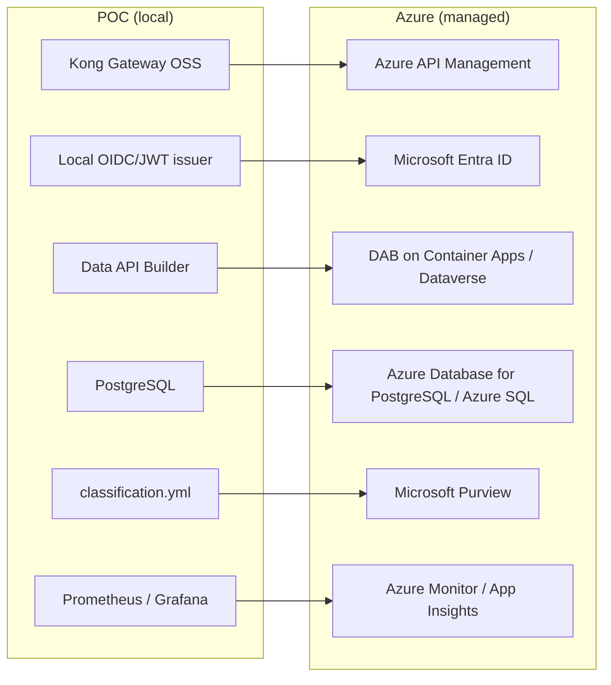

# Azure deployment path (reference)

> [!NOTE]
> **TL;DR** — The local POC promotes to Azure by swapping each OSS/local component for its
> managed equivalent (Kong → APIM, local JWT → Entra ID, Postgres → Flexible Server, etc.).
> Reference Bicep lives in `infra/azure/`; CI does not deploy it and needs no subscription.

The local POC promotes to Azure by swapping each open-source/local component for its
managed equivalent. CI does **not** require an Azure subscription — `infra/azure/`
(Bicep) and this doc are reference material.

---

## 📑 Table of Contents

- [Component swaps](#-component-swaps)
- [Data platform (posture for this customer)](#-data-platform-posture-for-this-customer)
- [Compliance](#-compliance)
- [Reference Bicep](#-reference-bicep-infraazure)

---

## 🔄 Component swaps




| POC (local) | Azure managed target | Notes |
|---|---|---|
| Kong Gateway OSS | **Azure API Management** | Map the same JWT/rate-limit/metering policies; APIM's AI gateway adds `llm-token-limit` / `llm-emit-token-metric` for the LLM-gateway story. |
| Local OIDC/JWT issuer | **Microsoft Entra ID** | `validate-azure-ad-token`; identity is the moat under every layer. |
| Data API Builder (container) | **Data API Builder on Azure Container Apps**, or **Dataverse Web API** | Dataverse exposes OData v4 with `$metadata` discovery. |
| PostgreSQL | **Azure Database for PostgreSQL Flexible Server** / **Azure SQL** | The system of record. |
| `classification.yml` | **Microsoft Purview** | Catalog, classification, sensitivity labels, lineage, data quality. |
| Prometheus / Grafana | **Azure Monitor / Log Analytics / Application Insights** | Per-consumer metrics + tracing. |

## 🗄️ Data platform (posture for this customer)

The managed data platform — **Azure Databricks with managed Unity Catalog, Databricks
SQL, Delta Lake, and Delta Sharing on ADLS Gen2, plus Azure Synapse** — runs in
**commercial (global) Azure at FedRAMP High** (the boundary the customer's cyber org
has accepted for Databricks). The full *managed* platform is available there.

- **Data classification drives the boundary**, not vendor preference: unclassified /
  CUI-adjacent workloads run in commercial Azure at FedRAMP High.
- The managed-Unity-Catalog / Databricks-SQL gap applies **only** to the Azure
  Government regions (US Gov Arizona / US Gov Virginia) — an **ITAR / strict-CUI
  subset** — where open-source Unity Catalog on agency-controlled compute or Microsoft
  Purview is the catalog fallback.
- Open formats (Delta Lake / Delta Sharing) and the open-source-rooted Unity Catalog
  keep the platform **divestable** either way.
> [!IMPORTANT]
> **Microsoft Fabric and OneLake are excluded** — not available in Azure Government /
> GCC. Do not introduce them.

## 🔒 Compliance

Both global Azure and Azure Government hold FedRAMP High authorization; the practical
difference is data residency and personnel-access controls (ITAR/EAR), not the FedRAMP
level. See the Technical Companion (`docs/whitepapers/02_technical_api_first_companion.md`)
for the full FedRAMP High / Azure Government / GCC discussion.

## 📦 Reference Bicep (`infra/azure/`)

These modules are **reference IaC** — they map the local stack to managed services and
compile with `az bicep build`, but CI does **not** deploy them and does **not** require a
subscription.

| File | Deploys | Replaces (local) |
|---|---|---|
| `main.bicep` | orchestrates the modules below + outputs the APIM gateway URL | `docker-compose.yml` |
| `modules/apim.bicep` | API Management + an API + a policy (`validate-azure-ad-token`, `rate-limit-by-key`, correlation-id header) | Kong + `kong.yml` |
| `modules/postgres.bicep` | PostgreSQL Flexible Server (v16, public access disabled) + `procurement` db | local Postgres |
| `modules/containerapp-dab.bicep` | DAB on Container Apps with **internal ingress** (only APIM can reach it) + Log Analytics wiring | local DAB container |
| `modules/monitor.bicep` | Log Analytics workspace | Prometheus + Grafana |
| `main.bicepparam` | parameters; the PG password comes from `PG_ADMIN_PASSWORD` via `readEnvironmentVariable` (never committed) | `.env` |

The APIM policy is the direct analogue of the Kong plugins: validate the Entra JWT,
rate-limit per caller, stamp a correlation id. APIM's AI-gateway policies
(`llm-token-limit`, `llm-emit-token-metric`) extend the same metering to LLM endpoints.

**Identity** (Entra app registration) and **Purview** governance are referenced rather
than fully scripted here — app registration is a tenant operation done outside the RG
deployment, and Purview cataloging is configured against the deployed data sources.

Validate locally:

```bash
az bicep build --file infra/azure/main.bicep      # compiles clean; emits main.json (gitignored)
```

Deploy (with a subscription; illustrative):

```bash
az group create -n artemis-poc-rg -l usgovvirginia
PG_ADMIN_PASSWORD='<choose-a-strong-secret>' \
  az deployment group create -g artemis-poc-rg \
    -f infra/azure/main.bicep -p infra/azure/main.bicepparam
```

Live, dated pricing for these targets: `make pricing` (or
`python tools/azure_pricing.py --region usgovvirginia`).
