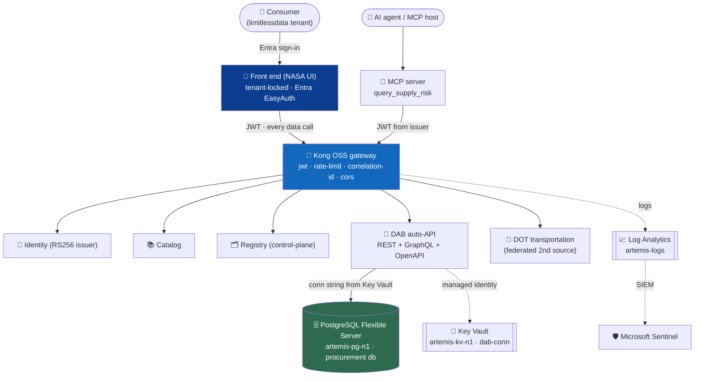
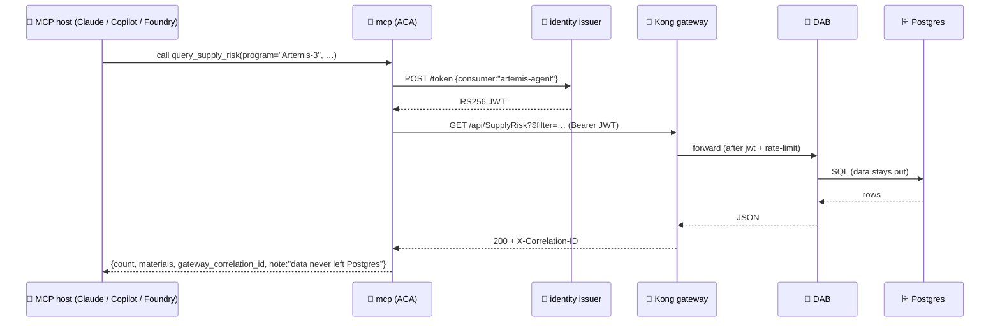

[Home](../README.md) > [Documentation](README.md) > **Azure live deployment**

# ☁️ Azure live deployment (the real demo) — Container Apps + Entra

> [!NOTE]
> **TL;DR** — This is the **full stack actually running in Azure**, not a reference diagram.
> Every local Docker service has been re-deployed to **Azure Container Apps (ACA)** in the
> `limitlessdata` tenant: the NASA-themed UI, the Kong gateway, the identity issuer, the
> catalog, the registry, the DOT transportation source, an **MCP server** for AI agents, and
> the **Data API Builder** auto-API over a **managed PostgreSQL**. The front end is
> **tenant-locked by Microsoft Entra** (anonymous callers get bounced to sign-in), the DAB
> database connection string lives in **Azure Key Vault** (never in app config), and the
> telemetry flows into **Log Analytics + Microsoft Sentinel**. One script reproduces all of
> it: [`scripts/azure-deploy-fullstack.sh`](../scripts/azure-deploy-fullstack.sh).

> [!WARNING]
> **Illustrative reference · sample/synthetic data only · not an official NASA document.**
> All vendors, prices, materials, and scenarios are **synthetic** — see
> [`DISCLAIMER.md`](DISCLAIMER.md) before sharing or adapting.

---

## 📑 Table of contents

- [Why this document exists](#-why-this-document-exists)
- [The big picture: local Docker is dev/test, Azure is the demo](#-the-big-picture-local-docker-is-devtest-azure-is-the-demo)
- [What is deployed (and what each app does)](#-what-is-deployed-and-what-each-app-does)
- [Access and verification (with worked examples)](#-access-and-verification-with-worked-examples)
- [The MCP agent path on Azure](#-the-mcp-agent-path-on-azure)
- [Secrets, identity and observability](#-secrets-identity-and-observability)
- [Honest deltas vs. the local stack](#-honest-deltas-vs-the-local-stack)
- [Gotchas and troubleshooting](#-gotchas-and-troubleshooting)
- [Teardown (stop billing)](#-teardown-stop-billing)
- [Where to next](#-where-to-next)

---

## 🤔 Why this document exists

Most "cloud architecture" documents stop at a diagram and a promise. This one is different:
the whole marketplace is **live in Azure right now**, and this page teaches you how to stand
it up yourself, how to prove each governance claim with a real command, and *why* each piece
is shaped the way it is.

**Why this matters:** the enterprise story of this project is "expose an existing
system-of-record as a **governed API** so consumers can ask it questions without ever copying
the data out" — a pattern this repo calls **zero-move** (see [`ZERO-MOVE.md`](ZERO-MOVE.md)).
That story is only convincing if you can *show* it running on real managed infrastructure with
real identity, real secrets handling, and real telemetry. Local Docker proves the pattern on
your laptop; this Azure deployment proves it is **enterprise-deployable** — the full art of the
possible.

> **In plain terms:** the local `docker compose` stack is where you develop and test. This
> Azure deployment is what you put on the projector when it's time to convince an architecture
> review board.

---

## 🧭 The big picture: local Docker is dev/test, Azure is the demo

Every component you run locally has an Azure managed (or near-managed) twin. The deploy script
is a faithful, pragmatic port of the `docker-compose.yml` topology onto Container Apps. Keep
this mental model — *"each local OSS box is the analogue of an Azure service"* — and the rest of
the document reads as a translation table.

| Local (dev/test loop) | Azure (this live deploy) | The fully-managed Azure twin |
|---|---|---|
| Kong OSS gateway (DB-less) | Kong OSS **container on ACA** | **Azure API Management** — see [`APIM-EDITION.md`](APIM-EDITION.md) |
| Local RS256 JWT issuer | `identity` container on ACA | **Microsoft Entra ID** (used here for the *front-end* tenant lock) |
| DAB in a container | `artemis-dab` on ACA | **Container Apps** (already managed compute) |
| Postgres in a container | **PostgreSQL Flexible Server** (managed) | PostgreSQL Flexible Server |
| `.env` / compose secrets | **Azure Key Vault** (`dab-conn`) | Azure Key Vault |
| Prometheus + Grafana | **Log Analytics + Microsoft Sentinel** | Azure Monitor + Sentinel |
| `classification.yml` labels | (catalog metadata) | **Microsoft Purview** (governance catalog) |

> [!NOTE]
> This page documents the **Kong edition** deployed to Container Apps. The **managed-gateway
> edition** — Azure API Management with a self-service Developer Portal, products, and
> subscriptions — is a sibling deployment driven by
> [`scripts/azure-deploy-apim.sh`](../scripts/azure-deploy-apim.sh) and documented end-to-end
> in **[`APIM-EDITION.md`](APIM-EDITION.md)**. Same upstream DAB auto-API, only the gateway
> swaps.

---

## 🏗️ What is deployed (and what each app does)

The deploy script ([`scripts/azure-deploy-fullstack.sh`](../scripts/azure-deploy-fullstack.sh))
builds a per-service image in **Azure Container Registry (ACR)**, then creates one Container App
per service in a shared Container Apps **environment**. Data flows one way: the browser only
ever talks to the **gateway**; the gateway fans out to the backends; only DAB touches Postgres.



### The resource inventory

Each row is a real Azure resource created by the deploy script. The **Name** column is what you
will see in the Azure portal under resource group `artemis-poc-rg`.

| Resource | Name | What it is / why it's here |
|---|---|---|
| Resource group | `artemis-poc-rg` (Central US) | The blast-radius container for everything below; org policy requires an `owner` tag |
| PostgreSQL Flexible Server | `artemis-pg-n1` | The **system of record** — managed Postgres 16, `procurement` db, seeded with ~10k synthetic rows. **Never** reachable directly by clients. |
| Container Registry (ACR) | `artemispocacrn1` | Holds the per-service images the script builds with `az acr build` |
| Container Apps environment | `artemis-cae` | The shared, managed compute fabric all the apps run in |
| **Front end (NASA UI)** | `frontend` | The demo UI; **tenant-locked with Entra EasyAuth** — the human entry point |
| Gateway (Kong OSS) | `kong` | The **only** path to data. DB-less, config baked into the image; both sources pre-registered |
| Identity (RS256 issuer) | `identity` | Mints short-lived RS256 JWTs for demo consumers; its public key is baked into the gateway config so Kong can verify tokens |
| Catalog | `catalog` | The "data products" listing the UI renders (both sources) |
| Registry | `registry` | The control-plane that *would* add sources live; live add is a local-only feature (see deltas) |
| DOT transportation | `transportation` | A **second, federated** data source proving the gateway fronts more than one upstream |
| DAB auto-API | `artemis-dab` | **Data API Builder** — turns Postgres tables/views into REST + GraphQL + OpenAPI with zero hand-written endpoints. Connection string resolved from **Key Vault**. |
| MCP server | `mcp` | The **AI-agent path** — exposes `query_supply_risk` as an MCP tool that calls the gateway, never the database |
| Key Vault | `artemis-kv-n1` | RBAC-authorized vault holding the DB connection string as secret `dab-conn` |
| Log Analytics | `artemis-logs` | Collects Container Apps env logs (+ APIM `GatewayLogs`/metrics in the APIM edition) |
| Entra app registrations | `artemis-ui-easyauth`, `artemis-dab-easyauth` | Single-tenant app regs that back EasyAuth on the UI (and the standalone DAB deploy) |

> **In plain terms:** *DAB* (Data API Builder) is a Microsoft service that reads your database
> schema and *automatically* serves it as a REST and GraphQL API — you point it at a table and
> get an OData-style endpoint for free, no controller code. *MCP* (Model Context Protocol) is
> the open standard that lets an AI agent (Claude, Copilot, Foundry) call a tool; here the tool
> answers the supply-chain question by going *through the gateway*. Both terms are defined in the
> [Glossary](GLOSSARY.md).

> [!NOTE]
> **Region note:** `eastus`/`eastus2` are policy-restricted for these resources in this
> subscription, so the deploy uses **Central US** (`centralus`). The subscription also enforces
> an `owner` tag — that's why every `az ... create` in the script passes `--tags owner=…`.

---

## 🌐 Access and verification (with worked examples)

All apps share the Container Apps environment domain
`icyocean-479340e8.centralus.azurecontainerapps.io`. Each service is reachable at
`https://<app-name>.<that-domain>`.

> [!NOTE]
> The domain prefix (`icyocean-479340e8`) is generated per Container Apps environment, so if you
> redeploy into a fresh environment your FQDNs will differ. The deploy script **prints the real
> URLs** at the end (the `FULL STACK DEPLOYED` banner) — copy them from there rather than from
> this page.

### The human path: the tenant-locked NASA UI

- **NASA UI (tenant-locked):**
  `https://frontend.icyocean-479340e8.centralus.azurecontainerapps.io`
  → redirects to **Entra sign-in**; sign in with a **`limitlessdata`-tenant** account to use it.
- Supporting services (each on the same domain): Gateway `https://kong.…`, Identity
  `https://identity.…`, Catalog `https://catalog.…`, Registry `https://registry.…`, DAB
  `https://artemis-dab.…`, Transport `https://transportation.…`, MCP `https://mcp.…`.

**What "verified live" means here.** A browser end-to-end pass confirmed the full governance
story on the running deployment:

1. Visiting the UI anonymously returns **HTTP 401 / redirect to Entra** — the tenant lock works.
2. After signing in with a `limitlessdata` account the NASA UI loads with **no console errors**.
3. The headline supply-risk query runs **through Kong** and returns **HTTP 200**, a **gateway
   correlation id** (`X-Correlation-ID`), and the ranked **6-row high-risk table**.
4. The catalog lists **both data products** (Artemis procurement + DOT bridges).
5. The "add a source" wizard renders (it is informational on Azure — see the deltas section).
6. The gateway also serves the **federated `/dot` bridge inventory** with the same JWT +
   rate-limit + correlation-id treatment.

### Worked example 1 — prove the gateway is the only door (no token → 401)

Call the DAB API *through Kong* with no credentials. The gateway's `jwt` plugin rejects you
before the request ever reaches DAB or Postgres.

```bash
# Replace <kong-fqdn> with the URL the deploy script printed.
curl -i "https://<kong-fqdn>/api/SupplyRisk?\$first=1"
```

Expected (abbreviated):

```http
HTTP/1.1 401 Unauthorized
X-Correlation-ID: 7b1c…           # Kong still stamps a correlation id, even on a reject
Content-Type: application/json
{"message":"Unauthorized"}
```

**What this proves:** the `jwt` plugin in the baked gateway config
([`scripts/azure-deploy-fullstack.sh`](../scripts/azure-deploy-fullstack.sh), step 4) gates
every data route. There is no anonymous read path to the procurement data.

### Worked example 2 — mint a token and get the answer (valid token → 200)

The `identity` issuer mints an RS256 JWT for a known demo consumer (`analyst` or
`artemis-agent`). Kong trusts it because the issuer's **public key** was baked into the gateway
config at deploy time.

```bash
# 1) Ask the issuer for a bearer token for the 'analyst' consumer.
TOKEN=$(curl -s -X POST "https://<identity-fqdn>/token" \
  -H 'content-type: application/json' \
  -d '{"consumer":"analyst"}' | python -c 'import sys,json;print(json.load(sys.stdin)["access_token"])')

# 2) Ask the headline question THROUGH Kong, with the token.
curl -s "https://<kong-fqdn>/api/SupplyRisk?\$filter=program%20eq%20'Artemis-3'%20and%20criticality%20eq%20'Critical'%20and%20sole_source%20eq%20true&\$orderby=risk_score%20desc" \
  -H "Authorization: Bearer $TOKEN" -D - | head -n 20
```

Expected: **HTTP 200**, an `X-Correlation-ID` response header, and a JSON body whose `value`
array holds the highest-risk **Critical, sole-source Artemis-3 materials**, sorted by
`risk_score` descending.

**What each step did:** step 1 exchanges a consumer name for a signed token (the issuer is the
local analogue of **Entra ID** minting an access token); step 2 makes the *only* legitimate kind
of call — authenticated, rate-limited, correlation-stamped, and routed by Kong to DAB, which
reads Postgres and returns rows. **The data never leaves Postgres; only the answer crosses the
gateway.**

### Worked example 3 — the federated second source

```bash
curl -s "https://<kong-fqdn>/dot/api/Bridge?\$orderby=condition_rating%20asc&\$first=8" \
  -H "Authorization: Bearer $TOKEN" -D - | head -n 20
```

Expected: **HTTP 200**, a correlation id, and the worst-condition synthetic bridges first. Same
governance, a *different upstream* (`transportation`) — proving the gateway is a real federation
point, not a single-API proxy.

> [!TIP]
> Want a presenter-ready, click-by-click version of this for a live audience? See
> [`DEMO-SCRIPT.md`](DEMO-SCRIPT.md) and [`DEMO-DAY.md`](DEMO-DAY.md).

---

## 🧩 The MCP agent path on Azure

The deployment doesn't just serve humans — it serves **AI agents**. The `mcp` Container App runs
the server in [`services/mcp/server.py`](../services/mcp/server.py), which exposes a single tool,
**`query_supply_risk`**. The crucial detail: the agent does **not** get a database connection. It
gets a *governed* tool that fetches a token from the issuer and calls **Kong**, exactly like the
UI does.



**How the Azure container is wired.** In `azure-deploy-fullstack.sh` (step 5b) the MCP app is
created with environment variables pointing at the *Azure* URLs of the gateway and issuer:

```bash
MCP_FQDN="$(deploy mcp mcp:latest 8090 --min-replicas 1 \
  --env-vars MCP_PORT=8090 \
             "KONG_INTERNAL_URL=https://$KONG_FQDN" \
             "IDENTITY_INTERNAL_URL=https://$IDENT_FQDN" \
             JWT_AUDIENCE=artemis-api)"
```

The server reads those into `KONG_URL` / `IDENTITY_URL`
([`services/mcp/server.py:21`](../services/mcp/server.py)) and runs the **streamable-http**
transport on `MCP_PORT`, also serving `/healthz`.

### Verify the MCP path

```bash
# Liveness — the container exposes a health endpoint.
curl -s "https://<mcp-fqdn>/healthz"
# -> {"status":"ok"}
```

For the full tool call, point any MCP host at the streamable-http endpoint
(`https://<mcp-fqdn>/`) and invoke `query_supply_risk`. The tool returns a structured result
including `gateway_correlation_id` and the literal note *"Answered through the Kong gateway; data
never left Postgres."* — which is the entire zero-move thesis, asserted by the agent path itself.

> **Why this matters:** an agent that answers from a governed API inherits *all* the gateway's
> controls — authn, rate limits, metering, and an audit trail keyed by correlation id — for free.
> That is the difference between "we let an LLM hit the database" and "we let an LLM use a
> governed data product."

---

## 🔐 Secrets, identity and observability

This deployment models three enterprise non-negotiables: **secrets never live in app config**,
**access is tenant-gated by Entra**, and **everything is observable by the SOC**.

### 🔑 No connection string in app config — Key Vault + managed identity

The DAB Postgres connection string is **not** baked into the container or pasted into the app's
environment. Instead (step 2b of the deploy script):

1. The string is written to **Azure Key Vault** `artemis-kv-n1` (RBAC-authorized) as secret
   `dab-conn`.
2. The DAB Container App is given a **system-assigned managed identity** and granted the
   *Key Vault Secrets User* role on the vault.
3. The app's `dab-conn` secret is set to a **Key Vault reference**, and `DAB_CONNECTION_STRING`
   consumes it via `secretref`:

```bash
az containerapp secret set -g "$RG" -n artemis-dab \
  --secrets "dab-conn=keyvaultref:https://$KV.vault.azure.net/secrets/dab-conn,identityref:system"

az containerapp update -g "$RG" -n artemis-dab \
  --set-env-vars "DAB_CONNECTION_STRING=secretref:dab-conn"
```

At runtime the platform resolves the reference *using the app's own identity* — the secret value
is **never inlined** into the revision template, never visible in `az containerapp show`, and
never committed to git. **Verified:** DAB serves `/api/openapi` (200) and the headline query
through Kong (200) with the secret resolved straight from the vault.

> **In plain terms:** a *managed identity* is a passwordless identity Azure gives the app itself,
> so the app can prove "I am artemis-dab" to Key Vault without holding any credential. A *Key
> Vault reference* is a pointer (`keyvaultref:…`) the platform dereferences for you. Nobody — not
> even an operator reading the app config — sees the database password.

### 🪪 Tenant lock — Entra EasyAuth (single-tenant)

The front end uses **Entra EasyAuth**, the Container Apps built-in authentication layer. It is
configured single-tenant (`AzureADMyOrg`), so anonymous callers are redirected to sign-in and
**only `limitlessdata` accounts** can reach the UI. EasyAuth runs *in front of* your container —
your app code does nothing; the platform enforces the gate.

> [!IMPORTANT]
> **EasyAuth gotcha (already fixed in the deploy scripts).** ACA EasyAuth uses the OIDC **hybrid
> flow** (`response_type=code id_token`, `form_post`), so the Entra **app registration must have
> ID-token issuance enabled** (`az ad app create --enable-id-token-issuance true`). Without it,
> sign-in *succeeds* and then the app returns a silent **HTTP 401** — a misconfiguration that
> looks like a broken app, not a broken auth setting. Both
> [`azure-deploy.sh`](../scripts/azure-deploy.sh) and
> [`azure-deploy-fullstack.sh`](../scripts/azure-deploy-fullstack.sh) now set this by default,
> and the teardown script deletes the app registrations so a redeploy starts clean.

> [!NOTE]
> **Two layers of identity, on purpose.** Entra gates *who may open the UI* (the human, at the
> front door). The Kong `jwt` plugin gates *every data call* (per-consumer tokens, rate limits,
> metering) behind the UI. The UI's data calls and the MCP agent's calls both carry the
> issuer-minted RS256 JWT that Kong verifies. In the fully managed **[APIM edition](APIM-EDITION.md)**
> these two layers collapse into one — APIM does native Entra validation *and* the gateway
> policy.

### 📈 Observability + SIEM — Log Analytics + Microsoft Sentinel

A **Log Analytics** workspace (`artemis-logs`) collects the Container Apps environment logs (and,
in the APIM edition, APIM `GatewayLogs` + metrics). The deploy script then **onboards Microsoft
Sentinel** onto that same workspace (it PUTs `SecurityInsights/onboardingStates/default`), so the
gateway/app telemetry is immediately available to **SIEM** analytics rules and threat hunting.

> **In plain terms:** *SIEM* (Security Information and Event Management) is the security team's
> single pane for logs and alerts; **Sentinel** is Azure's cloud-native SIEM. Enabling it on the
> workspace means a SOC analyst can write a detection rule (e.g. "alert on a spike of 401s from
> one consumer") over the very logs this deployment emits. This is the Azure twin of the local
> Prometheus/Grafana stack — except it's a security tool, not just a metrics dashboard. See
> [`SECURITY.md`](SECURITY.md) for the full identity + token + secrets + SIEM model.

---

## ⚠️ Honest deltas vs. the local stack

A teaching doc earns trust by stating what the cloud deploy *doesn't* do, and why.

- **Live "add a source" wizard is local-only.** The one-click onboarding wizard needs Kong's
  **admin port**, which ACA doesn't cleanly expose, so both sources (Artemis + DOT) are
  **pre-registered** in the baked `kong.yml`. The wizard still renders on Azure (it's
  informational), but the interactive add stays the **local showpiece** (`make ui` — see
  [`ADD-A-SOURCE.md`](ADD-A-SOURCE.md)).
- **Kong Manager / Prometheus / Grafana are local-only.** Those use Kong's admin/metrics ports,
  also not exposed on ACA. Run them locally, or use the managed equivalents: **Azure Monitor** /
  **Log Analytics** for metrics and the **[APIM Developer Portal](APIM-EDITION.md)** for the
  discovery UI.
- **Network isolation is the production-hardening step.** In this *functional* deploy the apps
  use **public ingress** (the gateway still governs every data call, and the `jwt` plugin is the
  enforced front door). True zero-move in Azure means putting the system of record behind a
  **VNet + private endpoints** so Postgres has *no* public path at all. The reference Bicep ships
  this: [`infra/azure/modules/network.bicep`](../infra/azure/modules/network.bicep), enabled with
  `enablePrivateNetworking=true`. See [`AZURE-DEPLOYMENT.md`](AZURE-DEPLOYMENT.md) and
  [`ZERO-MOVE.md`](ZERO-MOVE.md) for the hardened target.

> [!NOTE]
> None of these deltas weaken the governance claim: even with public ingress, the **only**
> authenticated path to procurement data is *through Kong*, and Postgres credentials live in Key
> Vault. The deltas are about *operator tooling* and *network depth*, not the data-access
> boundary.

---

## 🧯 Gotchas and troubleshooting

| Symptom | Likely cause | Fix |
|---|---|---|
| Sign-in succeeds, then **HTTP 401** from the UI | Entra app reg missing ID-token issuance (hybrid flow) | Recreate with `--enable-id-token-issuance true` (the scripts now do this) |
| `curl` to a service returns a **redirect to login** | You hit the EasyAuth-protected front end, not the gateway | Call the **gateway** FQDN for data; the UI is meant for browsers |
| Data call returns **401** with a valid-looking token | Token consumer not in the baked Kong config, or wrong audience | Use `analyst` or `artemis-agent`; the issuer's public key must match the one baked into `kong.yml` |
| DAB **500 / can't connect to DB** | Key Vault RBAC not yet propagated, or PG firewall | The script `sleep`s for RBAC propagation; ensure the `AllowAzureServices` firewall rule exists |
| Redeploy fails with a **Key Vault name conflict** | Soft-deleted vault still holds the name | The teardown script **purges** the soft-deleted vault; or `az keyvault purge -n artemis-kv-n1` |
| Your FQDNs don't match this page | New Container Apps environment → new domain prefix | Use the URLs the deploy script prints in its final banner |
| `az ... create` rejected for **missing tag** or **region** | Subscription policy: `owner` tag required, `eastus*` restricted | Pass `--tags owner=…` and deploy to `centralus` (the scripts default to both) |

---

## 🔧 Teardown (stop billing)

```bash
./scripts/azure-teardown.sh            # deletes the RG + EasyAuth app regs (prompts to confirm)
./scripts/azure-teardown.sh --yes      # no prompt
```

What it does ([`scripts/azure-teardown.sh`](../scripts/azure-teardown.sh)): deletes the EasyAuth
**app registrations** (`artemis-ui-easyauth`, `artemis-dab-easyauth`), deletes the **resource
group** `artemis-poc-rg` asynchronously (Postgres, ACR, the Container Apps env and every app, Log
Analytics), and **purges the soft-deleted Key Vault** so a same-name redeploy isn't blocked.

> [!NOTE]
> Teardown does **not** touch the Databricks lakehouse notebook artifacts — those live in your
> `dbw-btfabric-dev` workspace. Drop them separately with
> `DROP SCHEMA adb_eastus2_sandbox.bronze CASCADE;` (and silver/gold). See
> [`DATABRICKS-WALKTHROUGH.md`](DATABRICKS-WALKTHROUGH.md).

---

## ➡️ Where to next

- **The managed-gateway edition** → [`APIM-EDITION.md`](APIM-EDITION.md): the same marketplace
  fronted by **Azure API Management** with a self-service **Developer Portal**, products, and
  subscriptions — plus [`APIM-CAPABILITIES.md`](APIM-CAPABILITIES.md) for the full Kong-vs-APIM
  capability matrix.
- **The reference-Bicep target & FedRAMP/Gov posture** → [`AZURE-DEPLOYMENT.md`](AZURE-DEPLOYMENT.md):
  the managed-twin mapping, the hardened VNet/private-endpoint design, live dated pricing, and why
  Fabric/OneLake are explicitly excluded.
- **The governance model in depth** → [`SECURITY.md`](SECURITY.md) (identity, tokens, secrets,
  SIEM) and [`ZERO-MOVE.md`](ZERO-MOVE.md) (the data-access boundary, proven by test).
- **Run it yourself first** → [`LOCAL-DEV.md`](LOCAL-DEV.md) for the `docker compose` dev/test
  loop, then come back here to deploy.
- **Present it live** → [`DEMO-SCRIPT.md`](DEMO-SCRIPT.md) and [`DEMO-DAY.md`](DEMO-DAY.md).
</content>
</invoke>
