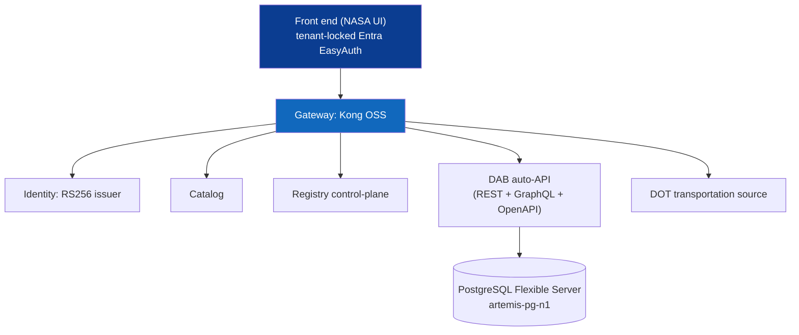

# Azure live deployment (limitlessdata tenant)

The **full stack** deployed to **Azure Container Apps** in `limitlessdata` / *FedCiv ATU FFL
— Main* (Central US): the NASA-themed UI, the Kong gateway, identity, catalog, registry,
the DOT transportation source, and the DAB auto-API over a managed Postgres — with the
**front end tenant-locked by Microsoft Entra**. Reproduce with
`scripts/azure-deploy-fullstack.sh` (`PG_ADMIN_PASSWORD` from the env; no secrets committed).

> [!WARNING]
> Sample/synthetic data only — see [`DISCLAIMER.md`](DISCLAIMER.md).

---

## 📑 Table of Contents

- [What is deployed](#-what-is-deployed)
- [Access](#-access)
- [Secrets, identity & observability](#-secrets-identity--observability)
- [Honest deltas vs. the local stack](#-honest-deltas-vs-the-local-stack)
- [Teardown (stop billing)](#-teardown-stop-billing)

---

## 🏗️ What is deployed




| Resource | Name | Notes |
|---|---|---|
| Resource group | `artemis-poc-rg` (Central US) | org policy requires an `owner` tag |
| PostgreSQL Flexible Server | `artemis-pg-n1` | v16, `procurement` db, seeded ~10k rows |
| Container Registry | `artemispocacrn1` | per-service images |
| Container Apps env | `artemis-cae` | |
| **Front end (NASA UI)** | `frontend` | **tenant-locked (Entra EasyAuth)** |
| Gateway (Kong OSS) | `kong` | baked DB-less config, both sources pre-registered |
| Identity (RS256 issuer) | `identity` | fixed demo key (matches the baked gateway config) |
| Catalog | `catalog` | lists both sources |
| Registry | `registry` | control-plane (live add is a local feature — see below) |
| DOT transportation | `transportation` | the federated 2nd source |
| DAB auto-API | `artemis-dab` | REST+GraphQL+OpenAPI; conn string from **Key Vault** |
| MCP server | `mcp` | agent path (`query_supply_risk` through the gateway) |
| Key Vault | `artemis-kv-n1` | RBAC; holds the DB connection string (`dab-conn`) |
| Log Analytics | `artemis-logs` | Container Apps env logs + APIM diagnostics |
| Entra app registrations | `artemis-ui-easyauth`, `artemis-dab-easyauth` | single-tenant |

> [!NOTE]
> **Region note:** `eastus`/`eastus2` are policy-restricted for these resources in this
> subscription; **Central US** is used. The subscription also enforces an `owner` tag.

## 🌐 Access

- **NASA UI (tenant-locked):**
  `https://frontend.icyocean-479340e8.centralus.azurecontainerapps.io`
  → redirects to Entra sign-in; sign in with a **limitlessdata-tenant** account to use it.
- Gateway `https://kong.…`, Identity `https://identity.…`, Catalog `https://catalog.…`,
  Registry `https://registry.…`, DAB `https://artemis-dab.…`, Transport `https://transportation.…`
  (same `icyocean-479340e8.centralus.azurecontainerapps.io` domain).

Verified live: the gateway returns the rich Artemis headline rows and the federated `/dot`
bridge inventory (both governed by JWT + rate-limit + correlation id), and the UI is 401
until tenant sign-in.

## 🔐 Secrets, identity & observability

- **No connection string in app config.** The DAB Postgres connection string is stored in
  **Azure Key Vault** (`artemis-kv-n1`, RBAC-authorized) as secret `dab-conn`. The DAB
  Container App has a **system-assigned managed identity** with the *Key Vault Secrets User*
  role, and its `DAB_CONNECTION_STRING` env var resolves a **Key Vault reference**
  (`keyvaultref:…/secrets/dab-conn,identityref:system`) at runtime — the secret value is
  never inlined into the revision template. Verified: DAB serves `/api/openapi` (200) and
  the headline query through Kong (200) with the secret resolved from the vault.
- **Tenant lock.** The front end uses Entra **EasyAuth** (single-tenant) — anonymous
  callers are redirected to sign-in; only `limitlessdata` accounts can use the UI.
- **Observability.** A **Log Analytics** workspace (`artemis-logs`) collects Container Apps
  env logs (and, in the APIM edition, APIM `GatewayLogs` + metrics). This is the foundation
  for **Microsoft Sentinel** (SIEM) — enable the SecurityInsights solution on the same
  workspace; see [`SECURITY.md`](SECURITY.md).

## ⚠️ Honest deltas vs. the local stack

- **Live "add a source" wizard** needs Kong's admin port, which ACA doesn't cleanly expose,
  so both sources are **pre-registered**; the one-click wizard stays the local showpiece
  (`make ui`). Kong Manager (GUI) + Prometheus/Grafana likewise use the admin/metrics port —
  run them locally, or use **Azure Monitor** (managed) / **APIM Developer Portal**.
- **Network isolation:** in this functional deploy the apps use public ingress (the gateway
  governs every data call). True zero-move in Azure = VNet + private endpoints so the SoR has
  no public path — the production-hardening step (reference Bicep in `infra/azure/`).

## 🔧 Teardown (stop billing)

```bash
./scripts/azure-teardown.sh            # deletes the RG + EasyAuth app regs (prompts)
./scripts/azure-teardown.sh --yes      # no prompt
```
