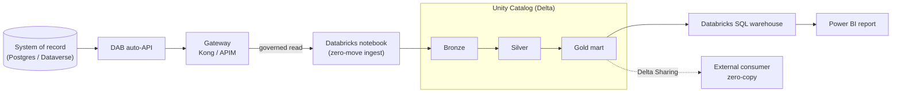

# Databricks zero-move walkthrough — gateway → medallion (Unity Catalog) → Databricks SQL → Power BI

> [!NOTE]
> **TL;DR** — Azure Databricks reads the data product *through the gateway* (authenticated,
> metered, auditable), builds a Bronze → Silver → Gold medallion as Delta in Unity Catalog,
> and serves the Gold mart via a Databricks SQL warehouse for Power BI. Use your existing
> `dbw-btfabric-dev` workspace; run the medallion notebook in `postgres` (today) or
> `gateway` (zero-move) mode. The system of record never moves.

> **The story:** the marketplace already serves governed data products through the
> gateway. **Azure Databricks** is just another **governed consumer** — it reads the
> data product *through the gateway* (authenticated, metered, auditable), builds a
> **Bronze → Silver → Gold** medallion as **Delta** in **Unity Catalog**, and exposes the
> curated **Gold** mart through a **Databricks SQL warehouse** that **Power BI** connects
> to. The system of record never moves; analytics consume the *product*, not the database.



Artifacts in this repo:
- `databricks/notebooks/01_zero_move_medallion.ipynb` — the medallion notebook (Jupyter — proper markdown + code cells).
- `databricks/sql/dbsql_samples.sql` — Databricks SQL queries (also the Power BI basis).
- `infra/azure/modules/databricks.bicep` — reference IaC (workspace + ADLS + access connector).
- `docs/POWERBI-GUIDE.md` — connect Power BI + the sample report spec.

> **Posture:** the managed platform — Azure Databricks with **managed Unity
> Catalog + Databricks SQL + Delta Lake + Delta Sharing on ADLS Gen2** — runs in
> **commercial Azure at FedRAMP High**. The managed-UC/Databricks-SQL gap applies **only**
> to Azure Government (ITAR/strict-CUI), where OSS Unity Catalog or Microsoft Purview is
> the fallback. **Microsoft Fabric / OneLake are excluded** (not in Azure Gov/GCC).

---

## 📑 Table of Contents

- [0. Use your existing workspace (no provisioning needed)](#0-use-your-existing-workspace-no-provisioning-needed)
- [1. Two ways to run — pick one](#1-two-ways-to-run--pick-one)
- [2. SQL warehouse](#2-sql-warehouse)
- [3. Secrets](#3-secrets)
- [4. Import + run the notebook](#4-import--run-the-notebook)
- [5. Verify in Unity Catalog + Databricks SQL](#5-verify-in-unity-catalog--databricks-sql)
- [6. Connect Power BI](#6-connect-power-bi)
- [7. (Optional) Delta Sharing — zero-copy to external consumers](#7-optional-delta-sharing--zero-copy-to-external-consumers)
- [8. Teardown (stop billing)](#8-teardown-stop-billing)

---

## 0. Use your existing workspace (no provisioning needed)

You already have a Unity-Catalog-enabled workspace — use it directly:

| Property | Value |
|---|---|
| Workspace | `dbw-btfabric-dev` (premium / Unity Catalog) |
| URL | `https://adb-7405607213468698.18.azuredatabricks.net` |
| Resource group | `rg-btfabric-tut57-dev` |
| Subscription | `363ef5d1-0e77-4594-a530-f51af23dbf8c` |

Get the workspace URL and authenticate the CLI:

```bash
WS=$(az databricks workspace show \
  --subscription 363ef5d1-0e77-4594-a530-f51af23dbf8c \
  -g rg-btfabric-tut57-dev -n dbw-btfabric-dev --query workspaceUrl -o tsv)
echo "https://$WS"

pip install databricks-sdk databricks-cli
databricks auth login --host "https://$WS"        # Entra OAuth (tenant account)
databricks unity-catalog catalogs list             # confirm your UC catalogs
```

Pick a catalog you can write to (or create one if you have `CREATE CATALOG`) and use it
as the `catalog` widget below (the notebook defaults to `artemis`).

> [!TIP]
> The reference IaC to stand up a *new* workspace is still in
> `infra/azure/modules/databricks.bicep` if you ever need it — not required here.

## 1. Two ways to run — pick one

The notebook has a **`source_mode`** widget:

- **`postgres` (default — runs TODAY):** reads the **deployed cloud system of record**
  (the Azure Postgres `artemis-pg-n1`, already seeded and reachable from your workspace)
  over JDBC. Zero new infra; guaranteed to produce the medallion + Power BI mart now.
- **`gateway` (governed/zero-move-via-API):** reads each data product *through the
  gateway* with a bearer token — the headline pattern. Use when the gateway/API is
  reachable from the workspace (e.g. fronted by API Management) and you have a token.

## 2. SQL warehouse

Use an existing SQL warehouse in `dbw-btfabric-dev`, or create one (Serverless/Pro,
2X-Small). Note its **Server hostname** + **HTTP path** for Power BI.

## 3. Secrets

```bash
databricks secrets create-scope artemis            # if it doesn't exist
# postgres mode — the deployed SoR password:
databricks secrets put-secret artemis pg_password  # paste the PG admin password
# gateway mode (optional) — a bearer token for the API:
databricks secrets put-secret artemis gateway_token
```

## 4. Import + run the notebook

**One command (in this repo)** — imports the notebook, sets the secret, runs it on a
single-node UC cluster, and prints a validation query (auth via `az`, no PAT):

```bash
az login
export PG_ADMIN_PASSWORD='<deployed Postgres password>'   # postgres mode
python databricks/run_notebook.py \
  --host adb-7405607213468698.18.azuredatabricks.net \
  --catalog adb_eastus2_sandbox --source-mode postgres \
  --pg-host artemis-pg-n1.postgres.database.azure.com
```

Or do it by hand:

```bash
ME=$(databricks current-user me --output json | jq -r .userName)
databricks workspace import-dir databricks/notebooks "/Workspace/Users/$ME/artemis" --overwrite
```

Open `/Workspace/Users/<you>/artemis/01_zero_move_medallion`, attach a UC-enabled cluster
(or SQL warehouse for SQL cells), set the widgets, and **Run all**:

- **postgres mode:** `source_mode=postgres`, `pg_host=artemis-pg-n1.postgres.database.azure.com`,
  `pg_secret_scope=artemis`, `pg_secret_key=pg_password`, `catalog=<your UC catalog>`.
- **gateway mode:** `source_mode=gateway`, `gateway_url=https://<your-apim-or-app>`,
  `token_secret_scope=artemis`, `token_secret_key=gateway_token`.

It creates the catalog/schemas, lands Bronze Delta, refines to Silver, and builds
`<catalog>.gold.artemis_supply_risk`. (To run headless: `databricks jobs submit` with a
`notebook_task` + `base_parameters` for the widgets above.)

## 5. Verify in Unity Catalog + Databricks SQL

```sql
SHOW TABLES IN <catalog>.gold;
-- the headline answer, now from Delta in UC:
SELECT * FROM <catalog>.gold.artemis_supply_risk
WHERE program='Artemis-3' AND criticality='Critical' AND sole_source=true AND avg_delay_days>30
ORDER BY risk_score DESC;
```

Run `databricks/sql/dbsql_samples.sql` for the report queries.

## 6. Connect Power BI

See **`docs/POWERBI-GUIDE.md`** — connect Power BI to the SQL warehouse, import
`<catalog>.gold.artemis_supply_risk`, add the measures, and build the supply-risk report.

## 7. (Optional) Delta Sharing — zero-copy to external consumers

```sql
CREATE SHARE IF NOT EXISTS artemis_supply_risk_share;
ALTER SHARE artemis_supply_risk_share ADD TABLE <catalog>.gold.artemis_supply_risk;
-- grant to a recipient; they query it WITHOUT a copy (zero-move, extended to analytics).
```

## 8. Teardown (stop billing)

Delete the SQL warehouse + clusters, drop the catalog (`DROP SCHEMA <catalog>.bronze CASCADE; DROP SCHEMA <catalog>.silver CASCADE; DROP SCHEMA <catalog>.gold CASCADE`),
and `az group delete -n artemis-poc-rg --yes` (removes the workspace/storage too).
