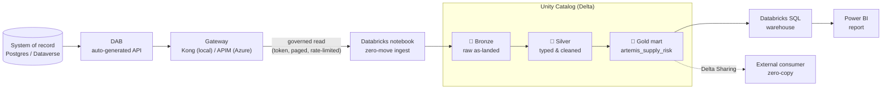
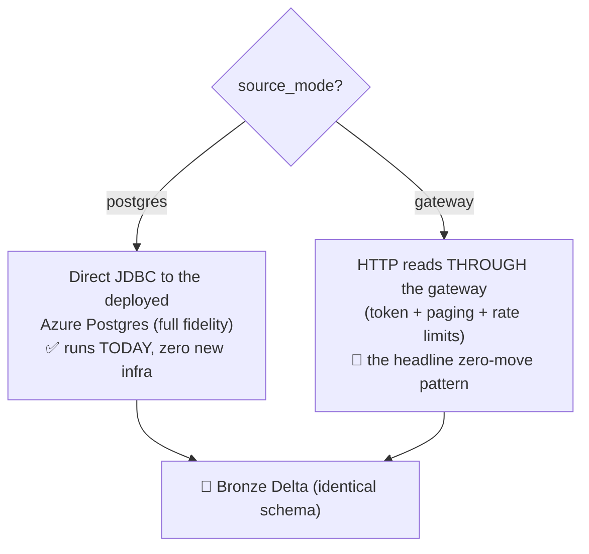

# 🏞️ Databricks Zero-Move Walkthrough — Gateway → Medallion (Unity Catalog) → Databricks SQL → Power BI

[Home](../README.md) > [Documentation](README.md) > **Databricks zero-move walkthrough**

> [!WARNING]
> **Illustrative reference · sample/synthetic data only · not an official NASA
> document.** Every name, vendor, part number, and dollar figure here is generated by
> [`data/synthetic_data.py`](../data/synthetic_data.py). See
> **[DISCLAIMER.md](DISCLAIMER.md)** before sharing or adapting.

> [!NOTE]
> **TL;DR (read this if you only have a minute)** — Azure Databricks is treated as *just
> another governed consumer* of the data marketplace. It reads a curated **data product**
> *through the gateway* (authenticated, metered, auditable), lands it as **Delta** tables in
> **Unity Catalog**, refines it through a **Bronze → Silver → Gold medallion**, and serves
> the Gold mart from a **Databricks SQL warehouse** that **Power BI** connects to. The
> system of record (a Postgres database) **never moves** — analytics consume the *product*,
> not the database. You run the supplied notebook in one of two modes: **`postgres`** (works
> today against the deployed cloud database over JDBC) or **`gateway`** (the headline
> zero-move-via-API pattern). One command —
> [`databricks/run_notebook.py`](../databricks/run_notebook.py) — does the whole thing.

---

## 📑 Table of Contents

- [🎯 Why this walkthrough exists](#-why-this-walkthrough-exists)
- [🧠 Concepts a newcomer needs first](#-concepts-a-newcomer-needs-first)
- [🗺️ The end-to-end picture](#-the-end-to-end-picture)
- [☁️ Azure-first: what each piece maps to](#-azure-first-what-each-piece-maps-to)
- [📦 The artifacts in this repo](#-the-artifacts-in-this-repo)
- [0. 🏢 Use your existing workspace (no provisioning needed)](#0--use-your-existing-workspace-no-provisioning-needed)
- [1. 🔀 Two ways to run — pick one](#1--two-ways-to-run--pick-one)
- [2. 🏬 SQL warehouse](#2--sql-warehouse)
- [3. 🔐 Secrets](#3--secrets)
- [4. ▶️ Import + run the notebook](#4-️-import--run-the-notebook)
- [🎛️ Widget reference (every parameter, explained)](#-widget-reference-every-parameter-explained)
- [🔬 Two-mode governance: see the redaction with your own eyes](#-two-mode-governance-see-the-redaction-with-your-own-eyes)
- [5. ✅ Verify in Unity Catalog + Databricks SQL](#5--verify-in-unity-catalog--databricks-sql)
- [6. 📊 Connect Power BI](#6--connect-power-bi)
- [7. 🔗 (Optional) Delta Sharing — zero-copy to external consumers](#7--optional-delta-sharing--zero-copy-to-external-consumers)
- [8. 🧹 Teardown (stop billing)](#8--teardown-stop-billing)
- [🛟 Gotchas & troubleshooting (gateway mode especially)](#-gotchas--troubleshooting-gateway-mode-especially)
- [➡️ Where to next](#-where-to-next)

---

## 🎯 Why this walkthrough exists

The rest of this proof-of-concept proves one claim: you can sell access to data **without
copying it**. A consumer (a CLI script, an [MCP](GLOSSARY.md#mcp--model-context-protocol)
agent, a web UI) asks a question, and the answer is computed *at the source* and returned
through a governed gateway. The database itself is never exposed and is never bulk-copied.
We call this **zero-move** (see [`docs/ZERO-MOVE.md`](ZERO-MOVE.md)).

That claim is easy to believe for a small script asking for ten rows. The natural objection
is: *"Fine, but real analytics needs the whole dataset in a data lake. The moment your data
scientists show up, you'll copy everything and the governance evaporates."* This document is
the answer to that objection. It shows the heaviest, most data-hungry consumer in any
enterprise — a **lakehouse analytics platform** (Azure Databricks) — participating in the
*same* governed pattern as the tiny CLI script.

> **In plain terms:** if even the analytics platform reads through the front door (the
> gateway) and obeys the same rules (authentication, rate limits, field-level redaction),
> then zero-move isn't a toy demo — it's the actual operating model. That is the point of
> this walkthrough.

**Why this matters:** in a real agency or enterprise, the analytics team is usually the
group that *breaks* governance — they get a database export "just this once," and six months
later there are twelve uncontrolled copies of sensitive procurement data on laptops and in
notebooks. The pattern here makes the governed path the *easy* path, so the copy never has to
happen.

---

## 🧠 Concepts a newcomer needs first

If you have never used Databricks, the steps below will throw unfamiliar nouns at you. Here
is the minimum vocabulary, defined once. For the deeper theory (what a lakehouse *is*, why
Delta exists, how the medallion pattern works), read the companion concept chapter
[`docs/concepts/05-lakehouse-databricks.md`](concepts/05-lakehouse-databricks.md) — this
walkthrough is the hands-on operational companion to it.

| Term | What it is, in one breath |
|---|---|
| **Workspace** | The Databricks "tenant" — a web environment (a URL like `adb-….azuredatabricks.net`) where your notebooks, clusters, jobs, and data live. You already have one; you do **not** create it here. |
| **Notebook** | A document of ordered **cells** — some Markdown, some runnable Python/SQL — that you execute top-to-bottom. The supplied [`01_zero_move_medallion.ipynb`](../databricks/notebooks/01_zero_move_medallion.ipynb) is a standard Jupyter `.ipynb`. Think of it as a runnable script with prose between the steps. |
| **Cluster** | The compute (one or more VMs running Apache Spark) that *runs* a notebook's code. No cluster attached = nothing executes. This walkthrough uses a tiny **single-node** cluster (one machine, no workers) because the synthetic dataset is small. |
| **Job (one-off run)** | A *headless* execution of a notebook on a cluster the platform spins up and tears down for you — no clicking through the UI. [`run_notebook.py`](../databricks/run_notebook.py) submits exactly one of these via `w.jobs.submit(...)`, waits for it to finish, and reads the result. |
| **Widget** | A notebook *parameter* — a named input (text box or dropdown) declared with `dbutils.widgets.*` at the top of the notebook. Widgets let the *same* notebook run against local Docker or cloud Azure just by changing values. They are the dials on the front panel; see the [widget reference](#-widget-reference-every-parameter-explained). |
| **Secret scope** | A named, access-controlled vault *inside* Databricks for passwords and tokens, so credentials never appear in notebook source. You read a secret with `dbutils.secrets.get(scope, key)`. The notebook stores the Postgres password (or a bearer token) in a scope named `artemis`. |
| **Unity Catalog (UC)** | Databricks' governance layer: a three-level namespace `catalog.schema.table` plus permissions, lineage, and discovery. Here, one **catalog** holds three **schemas** — `bronze`, `silver`, `gold` — and the tables inside them. |
| **Delta (Delta Lake)** | The table *format* the data is written in: Parquet files plus a transaction log, giving you ACID transactions, time travel, and schema enforcement on cheap cloud storage. Every table the notebook creates is Delta. |
| **Medallion** | A naming convention for refinement stages: **Bronze** = raw as-landed, **Silver** = typed and cleaned, **Gold** = curated business marts. Data flows Bronze → Silver → Gold. |
| **Databricks SQL warehouse** | A SQL query engine over your UC tables. Business-intelligence tools like Power BI connect to its **Server hostname** + **HTTP path**, exactly like connecting to any SQL database. |
| **Delta Sharing** | An open protocol to share a Delta table with an *external* organization who can query it live, with no copy crossing the boundary — zero-move extended beyond your own walls. |

> [!TIP]
> You do not need to understand Spark to follow this. The notebook is mostly `spark.sql(...)`
> calls — i.e. ordinary SQL — plus a small amount of Python that fetches data over HTTP. If
> you can read SQL, you can read this notebook.

---

## 🗺️ The end-to-end picture



Read it left to right as a story: the **system of record** is fronted by
[**DAB**](GLOSSARY.md#dab--data-api-builder) (which auto-generates a REST/GraphQL API over
the database), which is fronted by the **gateway**. The Databricks notebook reads *through
the gateway* — the same governed door every other consumer uses — and lands what it gets into
**Bronze**, refines it to **Silver**, and builds the **Gold** mart. A **SQL warehouse**
serves Gold to **Power BI**, and optionally **Delta Sharing** publishes Gold to an outside
party without a copy.

> [!NOTE]
> Notice the direction of the arrows. Data is *pulled* by the consumer through the gateway;
> the database never pushes a dump outward. There is no path in this diagram where the SoR is
> copied wholesale. That is zero-move drawn as a picture.

---

## ☁️ Azure-first: what each piece maps to

This proof-of-concept's **primary** story is an Azure deployment — local Docker is the
develop/test loop, and the real demo runs in the cloud. Every local open-source component is
the stand-in for a managed Azure service. For the lakehouse, the mapping is unusually clean
because the *real* product **is** an Azure service:

| In this walkthrough you use… | …which is the managed Azure service | Local dev-test analogue |
|---|---|---|
| Azure Databricks workspace | **Azure Databricks** (first-party Microsoft + Databricks service) | n/a — the lakehouse demo is Azure-native |
| Unity Catalog | **managed Unity Catalog** (governance, lineage, discovery) | `classification.yml` → [Microsoft Purview](GLOSSARY.md#microsoft-purview) for catalog/classification |
| Databricks SQL warehouse | **Databricks SQL** | local Postgres queried directly |
| The gateway the notebook reads through | **[Azure API Management](GLOSSARY.md#apim--azure-api-management)** (APIM) | **[Kong OSS](GLOSSARY.md#kong-kong-gateway-oss)** at `http://localhost:8000` |
| The token issuer (`gateway` mode) | **[Microsoft Entra ID](GLOSSARY.md#microsoft-entra-id-formerly-azure-ad)** | the local RS256 issuer at `http://localhost:8081` |
| ADLS Gen2 storage under Delta | **Azure Data Lake Storage Gen2** | local Delta files |
| Delta Sharing | **Delta Sharing** (open protocol, managed) | same protocol, local metastore |

> [!IMPORTANT]
> **Posture (read once, then move on).** The managed platform — Azure Databricks with
> **managed Unity Catalog + Databricks SQL + Delta Lake + Delta Sharing on ADLS Gen2** — runs
> in **commercial Azure at FedRAMP High**, and that is the *default* recommendation. The gap
> in managed UC / Databricks SQL applies **only** to **Azure Government** (ITAR / strict-CUI),
> where OSS Unity Catalog or [Microsoft Purview](GLOSSARY.md#microsoft-purview) is the
> fallback. **Microsoft Fabric / OneLake are explicitly excluded** because they are not
> available in Azure Gov/GCC. Do not present OSS-UC-on-agency-compute as the primary path.

---

## 📦 The artifacts in this repo

| File | What it is |
|---|---|
| [`databricks/notebooks/01_zero_move_medallion.ipynb`](../databricks/notebooks/01_zero_move_medallion.ipynb) | The medallion notebook — a Jupyter `.ipynb` with proper Markdown + code cells. It declares the widgets, fetches data, and builds Bronze → Silver → Gold. |
| [`databricks/run_notebook.py`](../databricks/run_notebook.py) | The one-command runner: authenticates via `az`, stores the secret, imports the notebook, submits a one-off job, waits, and prints the result. |
| [`databricks/sql/dbsql_samples.sql`](../databricks/sql/dbsql_samples.sql) | Databricks SQL queries against the Gold mart — also the basis for the Power BI report. |
| [`infra/azure/modules/databricks.bicep`](../infra/azure/modules/databricks.bicep) | Reference infrastructure-as-code (workspace + ADLS + access connector) to stand up a *new* workspace. Not needed if you already have one. |
| [`docs/POWERBI-GUIDE.md`](POWERBI-GUIDE.md) | How to connect Power BI to the SQL warehouse + the sample report spec. |
| [`docs/concepts/05-lakehouse-databricks.md`](concepts/05-lakehouse-databricks.md) | The teaching chapter behind all of this (lakehouse, Delta, medallion, Unity Catalog, Delta Sharing). |

---

## 0. 🏢 Use your existing workspace (no provisioning needed)

You already have a Unity-Catalog-enabled workspace, so there is nothing to provision — use it
directly. The reference workspace this POC was validated against is:

| Property | Value |
|---|---|
| Workspace | `dbw-btfabric-dev` (premium / Unity Catalog enabled) |
| URL | `https://adb-XXXXXXXXXXXXXXXX.18.azuredatabricks.net` |
| Resource group | `rg-btfabric-tut57-dev` |
| Subscription | `363ef5d1-0e77-4594-a530-f51af23dbf8c` |

Resolve the workspace URL and authenticate the Databricks CLI through your Azure login (no
personal access token required):

```bash
# Look up the workspace URL from Azure (so you never hardcode it):
WS=$(az databricks workspace show \
  --subscription 363ef5d1-0e77-4594-a530-f51af23dbf8c \
  -g rg-btfabric-tut57-dev -n dbw-btfabric-dev --query workspaceUrl -o tsv)
echo "https://$WS"

# Install the CLI/SDK and log in via Entra OAuth (uses your tenant identity):
pip install databricks-sdk databricks-cli
databricks auth login --host "https://$WS"

# Confirm which Unity Catalog catalogs you can see:
databricks unity-catalog catalogs list
```

**What just happened, step by step:** `az databricks workspace show` asks Azure for the
workspace's public URL and stores it in `$WS`. `databricks auth login` opens an Entra
(OAuth) sign-in so the CLI acts as *you* — no long-lived secret to manage. The final command
lists the catalogs your identity can reach.

**Expected output (shape, not exact values):**

```text
https://adb-XXXXXXXXXXXXXXXX.18.azuredatabricks.net
...
Name                  Comment
--------------------  -------
artemis
dbw_btfabric_dev
main
```

Pick a catalog you can **write** to and use its name as the `catalog` widget below. The
notebook defaults to **`dbw_btfabric_dev`** (the workspace's own catalog) because that is
the catalog the medallion run was validated against on **2026-06-18**.

> [!WARNING]
> **Pick a catalog you can write *data* to — not merely one that exists.** `CREATE SCHEMA`
> is metadata-only and will succeed even when your identity/compute can't write Delta files
> to the catalog's managed storage. In the reference workspace the **`artemis`** catalog's
> managed storage (`alzdatalakeraw…`) returns a **403 `AuthorizationFailure`
> (SQLSTATE 42501)** on the first Bronze write, while **`dbw_btfabric_dev`** writes fine.
> The notebook now runs a tiny **write-probe** right after creating the schemas, so this
> fails fast with a clear message instead of deep inside Bronze.

> [!TIP]
> **Stale "Waiting" in the notebook editor.** The web editor sometimes shows a cell stuck
> on "Waiting" after the backend has already finished (especially after a widget change or
> an interrupt). **Reload the page** to see the true committed cell state and outputs.

> [!TIP]
> The reference IaC to stand up a brand-new workspace lives in
> [`infra/azure/modules/databricks.bicep`](../infra/azure/modules/databricks.bicep) if you
> ever need it — but it is not required here, because you are reusing an existing workspace.

---

## 1. 🔀 Two ways to run — pick one

The notebook's very first code cell declares a **`source_mode`** dropdown widget. It controls
*where the raw data comes from* — and nothing downstream changes, because Silver/Gold SQL is
identical for both modes.



- **`postgres` (default — runs TODAY):** reads the **deployed cloud system of record** (the
  Azure Postgres `artemis-pg`, already seeded and reachable from your workspace) over
  [JDBC](GLOSSARY.md). This is the *privileged ETL* path: zero new infrastructure, guaranteed
  to produce the medallion + Power BI mart right now, with full-fidelity dollar values.
- **`gateway` (governed / zero-move-via-API):** reads each data product *through the gateway*
  with a bearer token — the headline pattern. Use this when the gateway/API is reachable from
  the workspace (e.g. fronted by API Management) and you have a token. This path obeys the
  same paging, rate limits, and field-level redaction as every other consumer.

> [!NOTE]
> **Why offer both?** `postgres` mode guarantees a working demo on day one even before the
> gateway is network-reachable from Databricks. `gateway` mode *proves the governance claim*.
> The recommended demo flow is to run **both** and compare the Gold marts — see
> [the two-mode comparison](#-two-mode-governance-see-the-redaction-with-your-own-eyes).

---

## 2. 🏬 SQL warehouse

A **SQL warehouse** is the engine Power BI (and your ad-hoc SQL) will query. Use an existing
warehouse in `dbw-btfabric-dev`, or create one (Serverless or Pro, size **2X-Small** is
plenty for this synthetic dataset). Note its **Server hostname** and **HTTP path** — you will
paste both into Power BI in [§6](#6--connect-power-bi).

> [!TIP]
> Prefer a **Serverless** warehouse: it starts in seconds and **auto-stops when idle**, so
> you are not billed for an idle engine between demo runs.

---

## 3. 🔐 Secrets

Credentials never go in notebook source — they live in a **secret scope** and are read at run
time with `dbutils.secrets.get(...)`. Create the scope once, then store whichever secret your
chosen mode needs:

```bash
# Create the scope (skip if it already exists):
databricks secrets create-scope artemis

# postgres mode — store the deployed SoR's admin password:
databricks secrets put-secret artemis pg_password   # paste the PG admin password

# gateway mode (optional) — store a pre-minted bearer token for the API:
databricks secrets put-secret artemis gateway_token
```

> [!TIP]
> You only need to store `gateway_token` by hand if you want a **fixed** token. The runner
> [`run_notebook.py`](../databricks/run_notebook.py) — and the notebook's own gateway path —
> can instead **mint a fresh token** from the identity issuer at run time (no manual storage).
> See [§4](#4-️-import--run-the-notebook).

---

## 4. ▶️ Import + run the notebook

### The one-command path (recommended)

From this repo, [`run_notebook.py`](../databricks/run_notebook.py) does the whole sequence:
it authenticates with the Azure CLI (no PAT), creates/uses the secret scope, imports the
notebook, **submits a one-off job on a single-node Unity-Catalog cluster**, waits for it to
finish, and prints the notebook's JSON result.

```bash
az login
export PG_ADMIN_PASSWORD='<deployed Postgres password>'   # postgres mode only
python databricks/run_notebook.py \
  --host adb-XXXXXXXXXXXXXXXX.18.azuredatabricks.net \
  --catalog dbw_btfabric_dev --source-mode postgres \
  --pg-host artemis-pg.postgres.database.azure.com
```

**Expected output (shape):**

```text
authenticated as you@tenant.onmicrosoft.com
stored pg_password secret
imported notebook -> /Users/you@tenant.onmicrosoft.com/artemis/01_zero_move_medallion
submitting run (spark=15.4.x-scala2.12, node=Standard_DS3_v2)...

run 12345678: RunResultState.SUCCESS —
run page: https://adb-XXXXXXXXXXXXXXXX.18.azuredatabricks.net/#job/12345678

notebook summary: {"catalog": "dbw_btfabric_dev", "gold_table": "dbw_btfabric_dev.gold.artemis_supply_risk", "gold_rows": 600, "headline_rows": 6, "headline_material": "Turbopump impeller"}
  -> dbw_btfabric_dev.gold.artemis_supply_risk: 600 rows; headline=6 (Turbopump impeller)
```

> [!NOTE]
> The values above are the **actual gateway-mode result validated on 2026-06-18** in
> `dbw-btfabric-dev` (Serverless compute, `catalog=dbw_btfabric_dev`): `gold_rows=600`,
> `headline_rows=6`, headline material **Turbopump impeller** — matching the marketplace UI.

**What each line told you:** the runner authenticated as you, stored the Postgres password as
a secret, imported the notebook into your workspace, then spun up a single-node cluster
(`num_workers=0`, single-user security mode) preloaded with the PostgreSQL JDBC driver and
ran the notebook. The final `notebook summary` is the JSON the notebook returns via
`dbutils.notebook.exit(...)` — `gold_rows` is the size of the Gold mart and `headline_rows`
is how many materials match the Artemis-3 critical-and-late risk query. A non-zero
`headline_rows` is the success signal (`run_notebook.py` exits 0 only when it is ≥ 1).

For **gateway mode**, the runner mints a bearer token from the issuer for you (no
`PG_ADMIN_PASSWORD` needed) — pass `--gateway-url` and `--identity-url` (and optionally
`--consumer`, default `artemis-agent`):

```bash
python databricks/run_notebook.py \
  --host adb-XXXXXXXXXXXXXXXX.18.azuredatabricks.net \
  --catalog dbw_btfabric_dev --source-mode gateway \
  --gateway-url https://kong.<aca-domain> \
  --identity-url https://identity.<aca-domain>
```

> [!NOTE]
> The runner's job cluster is created with `data_security_mode=SINGLE_USER` and
> `spark.master=local[*]` (single node). That is the minimum a Unity-Catalog read needs and
> keeps the run cheap. The PostgreSQL JDBC driver
> (`org.postgresql:postgresql:42.7.4`) is attached as a Maven library so `postgres` mode can
> connect.

### Or do it by hand (interactive)

If you would rather click through the UI, import the notebook folder and open it:

```bash
ME=$(databricks current-user me --output json | jq -r .userName)
databricks workspace import-dir databricks/notebooks "/Workspace/Users/$ME/artemis" --overwrite
```

Open `/Workspace/Users/<you>/artemis/01_zero_move_medallion`, attach a UC-enabled cluster
(or a SQL warehouse for the SQL cells), set the [widgets](#-widget-reference-every-parameter-explained),
and click **Run all**:

- **postgres mode:** `source_mode=postgres`,
  `pg_host=artemis-pg.postgres.database.azure.com`, `pg_secret_scope=artemis`,
  `pg_secret_key=pg_password`, `catalog=<your UC catalog>`.
- **gateway mode:** `source_mode=gateway`, `gateway_url=https://<your-apim-or-app>`. Then
  either point the notebook at a pre-stored token (`token_secret_scope=artemis`,
  `token_secret_key=gateway_token`) — e.g. the one `run_notebook.py` minted — **or** let the
  notebook mint its own by setting `identity_url=https://identity.<aca-domain>` and
  `consumer=artemis-agent`.

Running it creates the medallion schemas, lands Bronze Delta, refines to Silver, and builds
`<catalog>.gold.artemis_supply_risk` plus `<catalog>.gold.delay_trend`. (To run fully
headless yourself, `databricks jobs submit` with a `notebook_task` + `base_parameters` for the
widgets — which is exactly what `run_notebook.py` automates.)

---

## 🎛️ Widget reference (every parameter, explained)

The notebook's first code cell declares all of its parameters as **widgets**. When
`run_notebook.py` runs the notebook headlessly, it passes these as the job's
`base_parameters`; when you run interactively, you set them in the widget bar at the top of
the notebook. Here is every widget, what it does, its default, and which mode needs it.

| Widget | Type | Default | Used in | What it controls |
|---|---|---|---|---|
| `source_mode` | dropdown | `postgres` | both | Picks the Bronze read path: `postgres` (JDBC) or `gateway` (HTTP through the gateway). |
| `catalog` | text | `artemis` | both | The Unity Catalog catalog to write the `bronze`/`silver`/`gold` schemas into. **Must be one you can write to.** |
| `gateway_url` | text | `http://localhost:8000` | gateway | Base URL of the gateway. Local = Kong; Azure = your APIM / Container Apps URL. Trailing slash is stripped. |
| `identity_url` | text | `http://localhost:8081` | gateway (mint) | Base URL of the token **issuer**. Only used when no pre-stored token is supplied — the notebook POSTs `{ "consumer": … }` to `<identity_url>/token`. |
| `consumer` | text | `artemis-agent` | gateway (mint) | The consumer identity to mint a token for. Determines the rate-limit bucket and which fields are redacted. |
| `token_secret_scope` | text | *(empty)* | gateway (pre-stored) | Secret scope holding a bearer token. If both this and `token_secret_key` are set, the notebook reads the token instead of minting one. |
| `token_secret_key` | text | *(empty)* | gateway (pre-stored) | Secret key for the bearer token inside the scope above. |
| `pg_host` | text | `artemis-pg.postgres.database.azure.com` | postgres | Hostname of the deployed Azure Postgres. Connected as `jdbc:postgresql://<host>:5432/procurement?sslmode=require`. |
| `pg_secret_scope` | text | `artemis` | postgres | Secret scope holding the Postgres password. |
| `pg_secret_key` | text | `pg_password` | postgres | Secret key for the Postgres password inside that scope. |

> [!TIP]
> **Token resolution order in gateway mode:** if `token_secret_scope` **and**
> `token_secret_key` are both set, the notebook reads that pre-stored token. Otherwise it
> mints a fresh one from `identity_url` for `consumer`. This is why `run_notebook.py`'s
> gateway path mints + stores a token *and* passes the scope/key — the notebook then reads
> the stored token rather than minting a second time.

---

## 🔬 Two-mode governance: see the redaction with your own eyes

This is the most important experiment in the walkthrough, and the proof that governance
*follows the data product into the lakehouse*. Run the notebook in **both** modes against the
same catalog and compare the identical Gold mart. The risk picture is the same — but the
**cost columns are redacted on the governed path**.

| | **`postgres`** mode (privileged ETL) | **`gateway`** mode (governed consumer) |
|---|---|---|
| Read path | direct JDBC to the SoR | **through the gateway** (token, paged `$first`/`$after`, rate-limited) |
| Gold rows / headline | 600 / 6 | 600 / 6 |
| `total_committed_usd` | populated | **$0 — redacted** (`netwr` / `netpr` never cross the gateway) |
| `purchase_orders` landed | full (≈10k) | a **governed sample** (capped at 200 rows; the gateway prevents bulk dumps) |

**Why the numbers come out this way:**

- **The cost fields are classified.** `NETWR` (net value), `NETPR` (net price/unit), and
  `STD_UNIT_COST_USD` are marked **Confidential** in
  [`data/classification.yml`](../data/classification.yml) and redacted at the data API for
  marketplace consumers (verified by [`tests/test_redaction.py`](../tests/test_redaction.py)).
  When the notebook reads through the gateway, those values simply are not in the response, so
  the Silver cast of `netwr` lands as `NULL` and `SUM(net_value_usd)` is `0`.
- **The notebook keeps both modes schema-identical on purpose.** In the Bronze cell,
  `_ensure_cols(...)` adds any gateway-redacted columns back as `NULL` so the *exact same*
  Silver/Gold SQL runs in both modes. The redaction is real governance, not a code path
  divergence — the value is genuinely absent, the schema is just kept stable.
- **The huge table is sampled, not dumped.** The gateway caps a single read at
  `$first<=200` (an OWASP anti-bulk-extraction guard) and rate-limits per consumer. The
  notebook's `gateway_get(...)` pages with `$first`/`$after` and **backs off on HTTP 429**;
  for `purchase_orders` it requests a governed sample (`max_rows=200`) rather than the whole
  table. You literally cannot bulk-extract through this path.
- **Cursors never leak the internal host.** DAB's `nextLink` points at the *internal*
  database-facing URL. The notebook's `_after_cursor(...)` extracts only the `$after` cursor
  value and re-issues the next page **through the gateway** — it never follows the internal
  link. Zero-move stays intact even across pagination.

> [!NOTE]
> **Bottom line.** Same risk answer either way; **cost is redacted on the governed path** —
> the field-level redaction documented in [`SECURITY.md`](SECURITY.md) applies to the
> analytics platform *exactly* as it does to the CLI, the MCP agent, and the UI. Use
> `postgres` mode when you specifically need the full-fidelity dollar measures for Power BI;
> use `gateway` mode to demonstrate that even the lakehouse obeys the rules.

---

## 5. ✅ Verify in Unity Catalog + Databricks SQL

Open a SQL editor against your warehouse and confirm the Gold mart exists and answers the
headline mission question:

```sql
SHOW TABLES IN <catalog>.gold;
-- the headline answer, now from Delta in Unity Catalog:
SELECT * FROM <catalog>.gold.artemis_supply_risk
WHERE program='Artemis-3' AND criticality='Critical' AND sole_source=true AND avg_delay_days>30
ORDER BY risk_score DESC;
```

**Expected:** `SHOW TABLES` lists `artemis_supply_risk` and `delay_trend`; the second query
returns the handful of critical, sole-source, late Artemis-3 materials — the *same* answer the
CLI, MCP agent, and UI return elsewhere in the POC, now served from the lakehouse.

Then run [`databricks/sql/dbsql_samples.sql`](../databricks/sql/dbsql_samples.sql) for the
full set of report queries (risk distribution, top sole-source exposure, launch-pad anomaly
impact, monthly delay trend). Set `USE CATALOG <your catalog>;` at the top — the queries are
catalog-relative, so that one line is the only environment-specific change.

---

## 6. 📊 Connect Power BI

See **[`docs/POWERBI-GUIDE.md`](POWERBI-GUIDE.md)** for the full, step-by-step connection.
The short version: connect Power BI to the SQL warehouse using its **Server hostname** +
**HTTP path** (from [§2](#2--sql-warehouse)), import `<catalog>.gold.artemis_supply_risk`
(and `gold.delay_trend` for the time-series), add the measures, and build the supply-risk
report.

> [!TIP]
> If your `total_committed_usd` shows up as all zeros in Power BI, you almost certainly built
> the mart in **`gateway` mode** — the cost is redacted there by design. Rebuild in
> `postgres` mode for the full-fidelity dollar measures.

---

## 7. 🔗 (Optional) Delta Sharing — zero-copy to external consumers

[Delta Sharing](GLOSSARY.md) extends zero-move *beyond your own walls*: an external recipient
queries the Gold mart live, with no copy crossing the boundary.

```sql
CREATE SHARE IF NOT EXISTS artemis_supply_risk_share;
ALTER SHARE artemis_supply_risk_share ADD TABLE <catalog>.gold.artemis_supply_risk;
-- grant to a recipient; they query it WITHOUT a copy (zero-move, extended to analytics).
```

> [!NOTE]
> The notebook's last code cell already attempts this and **skips gracefully** if Delta
> Sharing is not enabled on your metastore (you will see a "Delta Sharing not enabled …
> skipped" message rather than a failure). So a missing Delta Sharing entitlement never breaks
> the run.

---

## 8. 🧹 Teardown (stop billing)

The notebook runs in a **pre-existing** workspace (`dbw-btfabric-dev` in
`rg-btfabric-tut57-dev`), so **do not delete that resource group** — you would destroy shared
infrastructure. Remove only what the notebook created:

```sql
DROP SCHEMA IF EXISTS <catalog>.bronze CASCADE;
DROP SCHEMA IF EXISTS <catalog>.silver CASCADE;
DROP SCHEMA IF EXISTS <catalog>.gold   CASCADE;
```

Then:

- **Serverless SQL warehouses auto-stop when idle** — no action needed.
- **Stop or delete any all-purpose cluster** you started manually (the runner's job cluster
  tears itself down automatically when the run finishes).
- The notebook + secret scope under `/Users/<you>/artemis` can be deleted from the workspace.

> [!WARNING]
> The API-stack teardown ([`scripts/azure-teardown.sh`](../scripts/azure-teardown.sh)) is a
> **separate** concern — it tears down the Kong/DAB/identity/Postgres API stack and does
> **not** touch this Databricks workspace. Run the SQL drops above for Databricks cleanup.

---

## 🛟 Gotchas & troubleshooting (gateway mode especially)

| Symptom | Likely cause | Fix |
|---|---|---|
| `set the 'catalog' widget to an existing UC catalog you can write to` (assertion fails) | `catalog` widget empty, or you lack write access | Set `catalog` to a catalog from `unity-catalog catalogs list` that you can write to. |
| `ERROR: set PG_ADMIN_PASSWORD for postgres mode` | `postgres` mode but the env var is unset | `export PG_ADMIN_PASSWORD='…'` before running `run_notebook.py`. |
| `ERROR: gateway mode needs --gateway-url and --identity-url` | `gateway` mode without both URLs | Pass `--gateway-url` and `--identity-url` (and `--consumer` if not the default). |
| `total_committed_usd` is all `$0` | You built the mart in **gateway** mode | Expected — cost is redacted. Rebuild in `postgres` mode for full-fidelity dollars. |
| `purchase_orders` has only ~200 rows in gateway mode | The governed-sample cap (`max_rows=200`) | Expected — the gateway prevents bulk dumps. Use `postgres` mode if you genuinely need the full table. |
| Notebook prints `429 rate-limited; backing off Ns` | Gateway rate limit hit during paging | Expected and self-healing — the notebook honors `Retry-After` and retries up to 6 times. Persistent 429s = the consumer's quota is too low; raise the gateway rate-limit for that consumer. |
| `gave up after repeated 429s` | Rate limit too tight for the page size | Lower the page size or raise the consumer's rate limit; confirm you are paging, not bursting. |
| Gateway fetch fails / `skip <table>: …` printed | Gateway not reachable from the workspace, or token rejected | Confirm the workspace network can reach `gateway_url`; verify the token (mint a fresh one); check the consumer exists at the issuer. The notebook skips the table and continues. |
| A bronze table is missing but no error | Empty response from a data product (e.g. optional `dot_bridges` federated source) | The notebook only lands non-empty responses; an absent optional source is fine. |
| `Delta Sharing not enabled … skipped` | Metastore lacks Delta Sharing | Expected on workspaces without sharing; the run still succeeds. Enable Delta Sharing on the metastore if you need it. |
| Auth error from `run_notebook.py` | Not logged in to Azure / wrong tenant | `az login` into the correct tenant; the runner uses `auth_type="azure-cli"`. |

> [!TIP]
> **Reading gateway behavior live.** When `gateway_get(...)` succeeds it prints
> `GET <path> -> N rows via gateway (corr-id <id>)`. That **correlation id** is the same
> `X-Correlation-ID` the gateway stamps for every consumer — paste it into Grafana / Azure
> Monitor to trace exactly this notebook's reads through the gateway. It is your proof that
> the analytics platform went through the front door.

---

## ➡️ Where to next

- **The theory behind every noun here** →
  [`docs/concepts/05-lakehouse-databricks.md`](concepts/05-lakehouse-databricks.md) (lakehouse,
  Delta, medallion, Unity Catalog, Delta Sharing — taught from scratch).
- **Connect the report** → [`docs/POWERBI-GUIDE.md`](POWERBI-GUIDE.md).
- **Why zero-move is real, not just claimed** → [`docs/ZERO-MOVE.md`](ZERO-MOVE.md).
- **The full security model** (redaction, token flow, OWASP controls, Azure SIEM) →
  [`docs/SECURITY.md`](SECURITY.md).
- **Deploy the whole stack to Azure** → [`docs/AZURE-DEPLOYMENT.md`](AZURE-DEPLOYMENT.md) and
  [`docs/AZURE-LIVE-DEPLOYMENT.md`](AZURE-LIVE-DEPLOYMENT.md).
- **Unsure of a term?** → [`docs/GLOSSARY.md`](GLOSSARY.md).
