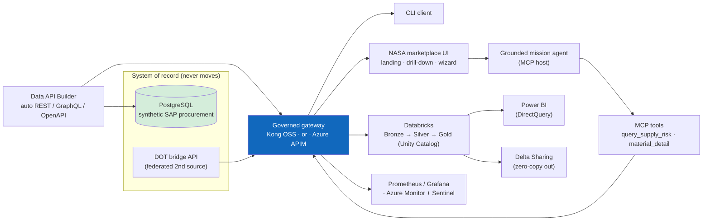
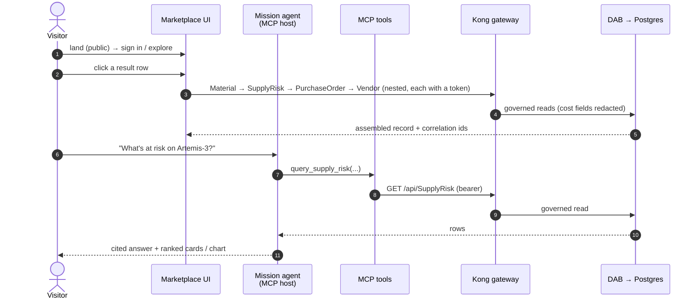

# 🚀 Complete demo — the full showcase, taught end to end (Azure → local → lakehouse)

[Home](../README.md) > [Documentation](README.md) > **Complete Demo**

> [!NOTE]
> **TL;DR** — This is the *teaching* edition of the end-to-end presenter script. It walks
> a newcomer through **everything** this proof-of-concept builds, and — critically — **why
> each piece exists**. The headline story is **"deploy to Azure to show the full art of the
> possible"**: a live deployment in *both* gateway editions (**Azure API Management** and
> **Kong**), a **public landing page** with deferred Microsoft sign-in, a **grounded
> mission agent** (an MCP host that answers — and *cites* — supply-risk questions from
> governed data), a **click-row drill-down** that composes nested governed calls, **live
> add/remove of a federated source**, a **Databricks** zero-move lakehouse (two read
> modes), a **Power BI** executive report, and **Delta Sharing** to an external partner.
> The local
> `docker compose` stack is the **dev/test loop** you use to build and rehearse before the
> Azure demo. Pick the segments you need — the whole thing runs ~25–35 min; the core story
> is ~10. New to any term? Every acronym links to the **[Glossary](GLOSSARY.md)**, and each
> part links to its deeper **[concept primer](concepts/README.md)**.

> [!WARNING]
> All data is **synthetic** (ITAR/CUI-safe) — see [`DISCLAIMER.md`](DISCLAIMER.md). Vendor
> names carry a `(SYNTHETIC)` suffix; there is no real NASA procurement content anywhere.
> The focused 10-minute *local-only* script is [`DEMO-SCRIPT.md`](DEMO-SCRIPT.md); **this**
> file is the superset that leads with the live Azure surfaces and adds the analytics layer.

---

## 📑 Table of Contents

- [Why this demo exists (read first)](#-why-this-demo-exists-read-first)
- [The one-sentence frame](#-the-one-sentence-frame)
- [What you'll show (the map)](#-what-youll-show-the-map)
- [Azure-first, OSS-faithful: the mapping you keep referring back to](#-azure-first-oss-faithful-the-mapping-you-keep-referring-back-to)
- [Live endpoints (reference card)](#-live-endpoints-reference-card)
- [Part A — Local stack in one command (the dev/test loop)](#-part-a--local-stack-in-one-command-the-devtest-loop-10-min)
- [Part B — Live in Azure: the Kong edition](#-part-b--live-in-azure-the-kong-edition-8-min)
- [Part B-bonus — The four showpiece moments (landing, drill-down, agent, live onboarding)](#-part-b-bonus--the-four-showpiece-moments-landing-drill-down-agent-live-onboarding-7-min)
- [Part C — Azure API Management edition (the managed twin)](#-part-c--azure-api-management-edition-the-managed-twin-5-min)
- [Part D — Databricks zero-move lakehouse](#-part-d--databricks-zero-move-lakehouse-6-min)
- [Part E — Power BI report](#-part-e--power-bi-report-3-min)
- [Part F — Delta Sharing: zero-copy to external consumers](#-part-f--delta-sharing-zero-copy-to-external-consumers-2-min)
- [Close — Azure-Government mapping & hardening](#-close--azure-government-mapping--hardening-1-min)
- [Gotchas & troubleshooting](#-gotchas--troubleshooting)
- [Teardown](#-teardown)
- [Where to next](#-where-to-next)

---

## ❓ Why this demo exists (read first)

Imagine a federal agency with dozens of mission systems — procurement in SAP, logistics in
one database, transportation in another — each holding data some other team desperately
needs. The instinct is to **copy** that data into a central warehouse so everyone can query
it. Copying is where the trouble starts: every copy is a new attack surface, a new
compliance boundary, a stale snapshot the moment it lands, and a fresh argument about who
owns it. For ITAR / CUI data, "make another copy" can be a non-starter.

This POC demonstrates the opposite pattern, called **API-first, zero-move** (also "zero-copy"):

> **In plain terms:** leave the data exactly where it lives, put a *governed front door* in
> front of it, and let every consumer — a human analyst, an AI agent, a BI tool, even a
> partner agency — walk through that one door. Nobody gets a copy of the database; everybody
> gets a controlled, audited, rate-limited *view* of just the data product they're entitled to.

> **Why this matters:** the agency keeps one system of record, one place to enforce access,
> one audit trail — and can still say "yes" to the analyst, the data scientist, and the
> partner, because governance travels *with the data product* instead of being re-invented
> at every copy. That is the whole game, and every part below is a concrete proof of one
> facet of it. Deep dive: [`concepts/01-the-big-idea.md`](concepts/01-the-big-idea.md).

This file is **Azure-first** on purpose. The real demo is the live Azure deployment — that
is "the art of the possible." The local Docker stack exists so you (and any engineer) can
build, test, and rehearse the *exact same architecture* offline before standing it up in
the cloud. Throughout, each local open-source component is introduced as **the analogue of
its Azure managed service**, so the leap from laptop to cloud is a swap, not a rewrite.

---

## 🎯 The one-sentence frame

> "One platform for **data, APIs, and code** — Microsoft as the secure **interoperability
> layer**, not 'the one AI.' The system of record never moves; a governed gateway fronts an
> auto-generated API over it; and a CLI, an AI agent, a marketplace UI, **and** the
> analytics platform all answer the same Artemis supply-chain question through that one
> governed surface — with governance (authentication, rate-limiting, metering, field-level
> redaction) following the data product everywhere it is consumed."

The **mission question** every consumer answers is deliberately concrete:

> *"Which **Critical**, **sole-source** materials on **Artemis-3** have an average delivery
> delay **greater than 30 days**?"*

Keep that one sentence in your head — you will watch a Python CLI, an AI agent, a browser
UI, a Databricks job, and a Power BI report all return the *same six rows* (top of the list:
the **Heat-pipe radiator panel**, risk score 100, ~54-day slip), each through the governed
gateway. Same answer, many consumers, one front door: that is the point being proven.

---

## 🗺️ What you'll show (the map)



> **How to read this diagram:** everything to the left of the blue **gateway** box is locked
> away — Postgres and the second source sit on a private network with *no public path*. The
> blue box is the *only* way through. Every arrow leaving it (CLI, UI, lakehouse, dashboard,
> external share) is a consumer reaching the data through that single governed surface. The
> green box is the system of record that *never moves*.

| Segment | Surface | The point it proves |
|---|---|---|
| **A** | Local `docker compose` stack | the whole pattern, one command, fully offline — your dev/test loop |
| **B** | Azure Container Apps + **Kong** | the live product: public landing + Entra sign-in, federation, Key Vault, redaction |
| **B-bonus** | The marketplace UI in depth | the four crowd-pleasers: landing, click-row drill-down, the grounded agent, live add/remove |
| **C** | Azure **API Management** | the managed twin: Developer Portal, Entra sign-in, Try-It, subscriptions |
| **D** | **Databricks** medallion (Unity Catalog) | zero-move *into the lakehouse* — two read modes, two governance postures |
| **E** | **Power BI** | the executive report over DirectQuery — zero-move all the way to the boardroom |
| **F** | **Delta Sharing** | zero-copy out to an external partner, past the org boundary |

---

## 🔁 Azure-first, OSS-faithful: the mapping you keep referring back to

Every local component is the open-source analogue of an Azure managed service. This is *why*
the local stack is a legitimate rehearsal for the cloud demo — same architecture, same
contracts (OpenAPI, OAuth2/JWT, OData, MCP), only the implementations swap.

| What it does | Local / OSS (you run this in dev/test) | Azure managed twin (the live demo target) |
|---|---|---|
| System of record | **PostgreSQL 16** | **Azure Database for PostgreSQL — Flexible Server** |
| Auto-generate the API | **[Data API Builder (DAB)](GLOSSARY.md)** container | **DAB on Azure Container Apps** |
| Govern the front door | **[Kong Gateway OSS](GLOSSARY.md)** (DB-less) | **[Azure API Management](GLOSSARY.md)** |
| Issue & validate tokens | local **RS256 JWT issuer** | **Microsoft Entra ID** |
| Classify before exposure | `data/classification.yml` manifest | **Microsoft Purview** |
| Observe & secure | **Prometheus + Grafana** | **Azure Monitor + Log Analytics + Microsoft Sentinel** |
| Analytics lakehouse | (documented; runs in Azure) | **Azure Databricks + Unity Catalog + Delta Lake** |

> **In plain terms:** "Kong → API Management" means *the thing you run locally to learn the
> pattern is the same architectural role as the thing you run in Azure for real.* When you
> demo Part B (Kong in Azure) and Part C (APIM in Azure) back to back, you are showing the
> two ends of that arrow live. Full treatment: [`ARCHITECTURE.md`](ARCHITECTURE.md) and the
> [concept primers](concepts/README.md).

> [!NOTE]
> **Why no Microsoft Fabric / OneLake?** They are not available in Azure Government / GCC
> High, so they are *explicitly excluded* as components — the data-platform layer here is
> Databricks + Unity Catalog + Delta. A repo test (`tests/test_no_fabric.py`) enforces this.

---

## 🔌 Live endpoints (reference card)

> [!TIP]
> Reference deployment in resource group **`limitlessdata`** (subscription *FedCiv ATU FFL –
> Main*, `ca2b3e6b-…`), region **Central US**. These are the live FQDNs the script below
> calls — substitute your own if you redeploy with `scripts/azure-deploy-fullstack.sh`.

| Surface | URL | Azure service behind it |
|---|---|---|
| NASA marketplace UI (public landing → Entra sign-in) | `https://frontend.xxxxxxxx-xxxxxxxx.centralus.azurecontainerapps.io` | Container Apps + EasyAuth (AllowAnonymous) |
| Grounded mission agent (chat over MCP) | `https://agent.xxxxxxxx-xxxxxxxx.centralus.azurecontainerapps.io` | Container Apps (MCP host) |
| Kong gateway | `https://kong.xxxxxxxx-xxxxxxxx.centralus.azurecontainerapps.io` | Container Apps |
| Identity (token issuer) | `https://identity.xxxxxxxx-xxxxxxxx.centralus.azurecontainerapps.io` | Container Apps (stands in for Entra ID) |
| Catalog | `https://catalog.xxxxxxxx-xxxxxxxx.centralus.azurecontainerapps.io` | Container Apps |
| Registry (source control-plane) | `https://registry.xxxxxxxx-xxxxxxxx.centralus.azurecontainerapps.io` | Container Apps |
| APIM gateway | `https://<your-apim>.azure-api.net` | API Management |
| APIM Developer Portal | `https://<your-apim>.developer.azure-api.net` | API Management |
| Databricks workspace | `https://adb-XXXXXXXXXXXXXXXX.18.azuredatabricks.net` | Azure Databricks |
| Unity Catalog / warehouse | catalog `main` · Serverless SQL Warehouse | Databricks SQL |

---

## 🅰️ Part A — Local stack in one command (the dev/test loop) (10 min)

> The complete pattern, fully offline. This is the dev/test rehearsal of everything you will
> show live in Azure — and it is the [`DEMO-SCRIPT.md`](DEMO-SCRIPT.md) flow in brief. Run it
> first if the room wants to see the architecture built from scratch with nothing but Docker.

**What `make demo` actually does** (so you can narrate it): bring the stack up, wait for
every container's healthcheck to pass, seed Postgres with the synthetic Artemis data, then
run the governed Python client and an MCP smoke test that both answer the mission question
*through Kong*. It is the local rehearsal of Parts B–C.

```bash
cp .env.example .env      # all config lives here; no secrets committed
pip install -e .          # installs the client + test deps into your venv
make demo                 # up → wait-healthy → seed → governed client → MCP smoke → answer
```

> [!NOTE]
> **Port collisions on a busy dev box?** The defaults are Kong `8000`, issuer `8081`,
> catalog `8080`, Grafana `3000`. If something already binds those, set
> `KONG_PROXY_PORT` / `ISSUER_PORT` / `CATALOG_PORT` / `GRAFANA_PORT` in `.env` and the demo
> scripts pick them up automatically. (See [`LOCAL-DEV.md`](LOCAL-DEV.md).)

Then, live at the terminal, prove each guarantee one at a time:

```bash
# 1) The mission answer THROUGH the gateway — note the correlation id it prints.
python client/query_supply_risk.py --program Artemis-3 --min-delay 30

# 2) Authentication at the edge: 401 → 200 → 429 → 400 (ports per .env; defaults shown).
curl -i http://localhost:8000/api/SupplyRisk                                    # 401: no token, rejected at Kong
TOKEN=$(curl -s -X POST http://localhost:8081/token -H 'Content-Type: application/json' \
  -d '{"consumer":"analyst"}' | python -c "import sys,json;print(json.load(sys.stdin)['access_token'])")
curl -i -H "Authorization: Bearer $TOKEN" "http://localhost:8000/api/Material?\$first=1"  # 200: valid token
for i in $(seq 1 80); do curl -s -o /dev/null -w "%{http_code} " \
  -H "Authorization: Bearer $TOKEN" "http://localhost:8000/api/Material?\$first=1"; done; echo  # …429 past the cap
curl -i -H "Authorization: Bearer $TOKEN" "http://localhost:8000/api/Material?\$first=99999"     # 400: OWASP guard

# 3) Field-level redaction — Confidential columns never cross the gateway.
curl -s -H "Authorization: Bearer $TOKEN" "http://localhost:8000/api/Material?\$first=1" | python -m json.tool
#    -> no std_unit_cost_usd ; the PurchaseOrder entity -> no netpr / netwr

# 4) Zero-move + discovery + the AI agent.
make test                                                # incl. test_zero_move + test_redaction
curl -s http://localhost:8080/catalog | python -m json.tool
python services/mcp/smoke_client.py

# 5) Observability + live onboarding (optional profiles).
make obs                                                  # Grafana :3000 — per-consumer traffic
make ui                                                   # browser UI :5173 — "+ Add a data source" wizard
```

**What each step taught, and why it matters:**

- **401 → 200** proves the [JWT](GLOSSARY.md) plugin is the bouncer. A request with no
  bearer token is rejected *at Kong* — DAB and Postgres are never even contacted. The token
  comes from the local issuer, which is your stand-in for **Microsoft Entra ID**.
- **429** proves **rate-limiting**. After ~60 calls/minute (the `__RATE_LIMIT__` from
  `.env`), Kong returns `429` with a `Retry-After` header. This is per-consumer, so the
  `analyst` and `artemis-agent` consumers have independent budgets — the basis of *metering*.
- **400** proves an **OWASP API Security Top 10** control (API4:2023, "Unrestricted Resource
  Consumption"). A Lua `pre-function` guard in Kong rejects any `$first` over **200** — a
  bulk-extraction attempt is blocked *before* it reaches the data. `$first=99999` trips it.
- **Redaction** is the subtle one. The DAB config grants the `anonymous` role read access
  but **excludes** the cost columns (`std_unit_cost_usd` on Material; `netpr`/`netwr` on
  PurchaseOrder). Kong additionally *strips* any client-supplied `X-MS-CLIENT-PRINCIPAL` /
  `X-MS-API-ROLE` headers, so **every** gateway call reaches DAB as `anonymous` — a consumer
  cannot spoof its way into the privileged `authenticated` role. Field-level redaction is
  therefore *guaranteed*, not accidental.

> **Say it:** "Zero-move is *real* — Postgres and DAB are on an internal Docker network with
> no host ports; the only path to data is Kong, and `test_zero_move.py` proves it by failing
> to reach them directly. Redaction is *real* — `std_unit_cost_usd`, `netpr`, `netwr` are
> stripped at the data API for every marketplace consumer, and `test_redaction.py` proves it."

> **Why this matters (Azure tie-back):** every guarantee you just demonstrated locally maps
> one-to-one onto an APIM policy in Part C — JWT validation, rate-limit, request-validation,
> and header transforms. The local stack is how you *develop and test* the policy behavior
> before it goes live. Deep dive: [`concepts/02-api-gateways.md`](concepts/02-api-gateways.md).

---

## 🅱️ Part B — Live in Azure: the Kong edition (8 min)

Everything from Part A, now **running in Azure Container Apps** with a **public landing
page** and **deferred Microsoft sign-in** — this is the first half of "the art of the
possible." Same architecture, real cloud, real identity.

### 🚪 1. The public landing page + deferred Microsoft sign-in

Open **`https://frontend.xxxxxxxx-xxxxxxxx.centralus.azurecontainerapps.io`**.

- A visitor lands on a **public landing page** — the real **NASA logo**, the zero-move value
  prop, and four highlight tiles (zero data movement, governed-at-the-edge, drill-down,
  lakehouse + Power BI). Auth **no longer auto-redirects on load** — the frontend EasyAuth is
  configured **AllowAnonymous**, so the page is reachable by anyone (the DOT-style entry
  pattern). A config flag (`authEnabled`) drives which buttons appear.
- Two calls to action: **“Sign in with Microsoft”** (→ Entra, `/.auth/login/aad`) and
  **“Explore the demo →”** (enter straight into the marketplace, anonymous).
- Sign in with a **`@limitlessdata.ai`** account → the landing shows *“✓ Signed in as …”* and
  an **“Enter the marketplace →”** link. (A wrong-tenant account is rejected by single-tenant
  Entra.)

> **In plain terms:** EasyAuth means *Azure can handle the login before your app ever sees the
> request.* Setting it **AllowAnonymous** lets a public visitor see the value prop first and
> *choose* to sign in — the deferred-auth pattern — rather than hitting a login wall. In
> dev/test you faked the identity plane with the local issuer; in Azure it is real Entra ID.

> [!NOTE]
> **EasyAuth gotcha (already handled by the deploy scripts):** ACA EasyAuth uses the hybrid
> flow (`response_type=code id_token`, `form_post`), so the Entra app registration must have
> **ID-token issuance enabled** — otherwise sign-in *succeeds* but the app returns 401, which
> is maddening to debug. `scripts/azure-deploy-fullstack.sh` sets this by default.

> **Say it:** "A public front door — a real visitor sees the value prop, then signs in with
> **Microsoft** on *their* terms. Auth is deferred, not a wall; governance still lives at the
> gateway behind every data call, signed-in or not."

### 🖥️ 2. Query through the gateway, in the browser

Click the **Artemis Supply-Chain Risk API** card → the query console opens with the headline
query pre-built (*Artemis-3 · Critical · sole-source · >30-day slip · consumer `analyst`*) →
press **Run through gateway**:

- **HTTP 200** plus a live **gateway correlation-id** (e.g. `…#21`) — your visible proof the
  call traversed Kong,
- the ranked **6-row** high-risk table (top: **Heat-pipe radiator panel**, risk 100, 54-day
  slip), with **human-friendly column labels** (Material, Risk tier, Avg delay, …) instead of
  raw SAP field names, and suppliers resolved via a *second* governed call
  (PurchaseOrder → Vendor).

This is the exact same six rows the CLI printed in Part A — now rendered for a human in a
browser. Same data product, different consumer. **Every row is clickable** — that click is the
drill-down you show next.

### 🔗 3. Federation + redaction (from a terminal, against Azure)

```bash
D=xxxxxxxx-xxxxxxxx.centralus.azurecontainerapps.io
TOK=$(curl -s -X POST https://identity.$D/token -H 'Content-Type: application/json' \
  -d '{"consumer":"analyst"}' | python -c "import sys,json;print(json.load(sys.stdin)['access_token'])")

curl -s -o /dev/null -w "no-token %{http_code}\n" "https://kong.$D/api/SupplyRisk?\$first=1"               # 401
curl -s -H "Authorization: Bearer $TOK" "https://kong.$D/dot/api/Bridge?\$first=2" | python -m json.tool   # federated 2nd source, 200
curl -s -H "Authorization: Bearer $TOK" "https://kong.$D/api/Material?\$first=1" | python -m json.tool      # std_unit_cost_usd redacted
```

> **What the `/dot/...` call proves:** the **DOT bridge inventory** is a *completely separate*
> synthetic data source (a stand-in for an existing DAB-style API). The onboarding wizard
> registered it with Kong at runtime under the path `/dot`, and Kong strips that prefix so the
> upstream still sees its native `/api/Bridge`. **One token, one gateway, two independent
> sources** — that is *federation*, and it is the heart of a marketplace: new sources arrive
> behind the same governed front door without anyone copying data or touching the source.

> **Say it:** "Two sources — Artemis procurement **and** a DOT transportation API —
> federated behind one governed gateway, zero-move, each call authenticated, rate-limited,
> and correlation-id'd. The 'add a source' wizard from Part A is how a *third* would arrive
> in minutes." (See [`ADD-A-SOURCE.md`](ADD-A-SOURCE.md).)

### 🗝️ 4. Secrets, identity & SIEM (talk track)

- **Azure Key Vault:** the DAB → Postgres connection string lives in `artemis-kv-n1`; the
  app reads it via a **managed identity** + Key Vault reference — never inlined in config or
  an environment variable. (No secret ever appears in the container definition.)
- **Log Analytics + Microsoft Sentinel** are enabled on the workspace (`artemis-logs`),
  giving SIEM analytics over the same gateway/app telemetry — the managed twin of the local
  Grafana view.
- **Observability:** run **`make obs`** locally for the live Grafana per-consumer dashboard.
  (Kong's metrics port isn't publicly exposed in ACA; **Azure Monitor** is the managed
  equivalent of the local Prometheus scrape.)

> **Why this matters:** in dev/test, secrets sat in `.env` and metrics in local Prometheus.
> In Azure those become **Key Vault + managed identity** and **Azure Monitor + Sentinel** —
> the same responsibilities, now enterprise-grade and audited. Deep dive:
> [`concepts/06-observability-and-security.md`](concepts/06-observability-and-security.md).

---

## ✨ Part B-bonus — The four showpiece moments (landing, drill-down, agent, live onboarding) (7 min)

These are the segments that land in a live room. All four run **in the same browser UI in
Azure** (`https://frontend.xxxxxxxx-xxxxxxxx.centralus.azurecontainerapps.io`) and every data
call still goes **through Kong** — nothing here is a side-channel.



### 🔎 1. Click-row drill-down — nested governed calls + field-level redaction (2 min)

In the marketplace, run the headline query, then **click any result row** (e.g. the
**Heat-pipe radiator panel**). A **centered floating modal** opens and *composes several
governed gateway calls in sequence*:

> **Material → SupplyRisk → PurchaseOrder → Vendor**

— each hop is its own authenticated call through Kong with its own **correlation id**. The
modal assembles the full product record: a **blueprint visual**, a risk banner, the material
facts, the resolved **supplier** (CAGE code, past-performance score), and the recent purchase
orders — and it footnotes the exact **correlation ids** plus the count of governed calls it
made.

> **Watch the redaction:** the modal states plainly that **net price/value and unit cost are
> redacted at the gateway** — the same field-level governance every consumer gets. You are
> looking at an assembled, multi-entity product record with the *sensitive* columns still
> stripped, end to end.

> **Say it:** "One human click fans out into a chain of *nested* governed calls — Material,
> risk, purchase orders, the supplier — each authenticated and correlation-id'd, and the cost
> fields never cross the gateway. This is how a real consuming app composes a rich record from
> a governed data product without ever touching the database."

### 🤖 2. The grounded mission agent — ask a risk question, get a *cited* answer (3 min)

Click **“🚀 Ask the mission agent.”** This is a chat agent that is itself an **MCP host**: it
answers by calling the MCP server's tools (`query_supply_risk`, `material_detail`), which reach
data **only through Kong**. Every answer is **grounded** in governed data and **cites its
source** — the MCP tool *and* the gateway correlation id.

Run these three asks live:

| Ask | What renders | The point |
|---|---|---|
| **“What's at risk on Artemis-3?”** | a short grounded summary **+ ranked material cards** (click a card → the same drill-down modal) | the agent answers the mission question from governed data, and cites `query_supply_risk` + the gw correlation id |
| **“Show me risk stats by tier”** | a **bar chart** + a risk-tier distribution | analytics questions get a chart, still grounded + cited |
| **“What's the weather on Mars?”** | a **sarcastic, space-themed refusal** that points you to a **Microsoft rep** | a grounded agent only speaks to the data product it was given — it won't hallucinate off-topic |

> **In plain terms:** the agent does **not** make up answers. On-topic questions are routed to
> an MCP tool that hits the gateway; off-topic ones are politely (and amusingly) refused. The
> routing is **deterministic** by default — reliable and free for a live demo, and it *never*
> hallucinates — with an optional Azure OpenAI phrasing upgrade (`AGENT_LLM=azure-openai`) that
> still only sees gateway data and must still cite.

> **Say it:** "This is the 'AI grounded on governed data over the open **MCP** standard' story.
> The exact same tools **Copilot** or **Azure AI Foundry** would call. Ask it the mission
> question — it answers from the governed product and *cites* the source. Ask it the weather on
> Mars — it refuses, with personality, and sends you to your Microsoft rep to build the agent
> that *does* do that, grounded on *your* governed data."

### 🧩 3. Live add/remove of a federated source (2 min)

The **DOT Transportation – Bridge Inventory** source is **pre-registered yet removable**, and
the **“+ Add a data source”** wizard re-adds it — live, in Azure.

1. On the DOT card, click the **✕** (remove) → the card disappears and the marketplace count
   drops. The **registry is the source of truth**; the catalog reads it **live**, so the change
   is immediate.
2. Open the wizard and **re-add DOT** (id `dot-bridges`, path `/dot`, the transport upstream).
   It reappears as a governed product — and queries route immediately, because the **`/dot` Kong
   route is pre-baked** in the Azure deploy (ACA can't hot-reload Kong's admin, so the registry's
   reload is a graceful no-op there while the route already exists).

> [!NOTE]
> **Why it just works in Azure:** locally the registry hot-reloads Kong's DB-less config to
> add a route on the fly; in Azure there's no reachable Kong admin or shared volume, so the
> **`/dot` route is pre-baked** and the registry runs **single-replica** (its source list is
> ephemeral). `liveOnboarding: true` tells the UI to show the add/remove controls. Either way,
> **no source is ever modified** — only the gateway (and the catalog that reads the registry)
> learns about it. Deep dive: [`ADD-A-SOURCE.md`](ADD-A-SOURCE.md).

> **Say it:** "A marketplace is only real if a *new* source can arrive — and leave — without
> copying data or touching the source. Watch: I remove DOT, the catalog updates live; I re-add
> it through the wizard, and it routes through the same governed front door immediately. One
> token, one gateway, sources coming and going behind it."

---

## 🅲 Part C — Azure API Management edition (the managed twin) (5 min)

This is the second half of "the art of the possible": the **managed** gateway. Same API,
same OpenAPI contract, same OAuth2/JWT — but governed by **Azure API Management (APIM)**
instead of Kong. Showing B and C back to back is the literal demonstration of the
"Kong → API Management" arrow from the mapping table.

> **In plain terms:** APIM is Azure's managed enterprise gateway. Where Kong gave you the
> portable, open-source path, APIM gives you the fully managed Azure(-Government) path with a
> built-in developer portal and self-service subscriptions — no servers for you to run.

### 🚪 1. The gateway (subscription-key gated)

```bash
GW=https://<your-apim>.azure-api.net
curl -s -o /dev/null -w "no-key %{http_code}\n" "$GW/api/SupplyRisk?\$first=1"                        # 401 (no key)
# With a subscription key (Azure portal → APIM → Subscriptions, or the Developer Portal):
curl -s -H "Ocp-Apim-Subscription-Key: <KEY>" "$GW/api/SupplyRisk?\$first=1" | python -m json.tool    # 200
```

> **Note the difference:** Kong gated on a **JWT bearer token**; APIM here gates on a
> **subscription key** (`Ocp-Apim-Subscription-Key`). Both are "prove you're allowed in"
> mechanisms — APIM can *also* validate JWTs via its `validate-jwt` policy. The subscription
> key is what powers self-service: a developer signs up for a product and gets a key, with no
> human in the loop. See [`APIM-CAPABILITIES.md`](APIM-CAPABILITIES.md).

### 🧑‍💻 2. The Developer Portal — the self-service story

Open **`https://<your-apim>.developer.azure-api.net`**:

- **Browse APIs** → **Artemis Supply-Chain Risk API** with all **8 operations** (Material /
  PurchaseOrder / SupplyRisk / Vendor — each as *list* and *by-key*) plus a downloadable
  OpenAPI definition.
- **Sign in** → the **Microsoft Entra ID** button (tenant accounts) *or* email/password.
- **Try it** → the interactive console makes live calls (CORS enabled) using a subscription key.
- **Products → Artemis Data Products** → **self-service subscription** sign-up.

> **Say it:** "This is the *managed twin* of our catalog UI and 'add a source' wizard —
> self-service API **discovery, try-it, and subscription**, run entirely by Azure. Kong gave
> us the OSS-portable path; APIM gives us the managed Azure-Government path. Same OpenAPI,
> same OAuth2/JWT, same policies — JWT validation, rate-limit, correlation id."

> [!NOTE]
> **One-time portal provisioning** is from admin mode (Azure portal → APIM → Developer portal
> → Portal overview → **Publish**). After that, the deploy script keeps it republished and the
> API visible to guests. Full walkthrough: [`APIM-EDITION.md`](APIM-EDITION.md).

---

## 🅳 Part D — Databricks zero-move lakehouse (6 min)

Now extend zero-move *into analytics*. The data product flows **into the lakehouse without
copying the database** — landing a **Bronze → Silver → Gold** [medallion](GLOSSARY.md) in
**Unity Catalog**, queryable from Databricks SQL.

> **In plain terms — the medallion:** *Bronze* is the raw landed data, *Silver* is cleaned
> and conformed, *Gold* is the curated, business-ready mart (the supply-risk table). Each
> layer is a Delta table in Unity Catalog (Databricks' governance layer for data). The point:
> the lakehouse is *fed through the governed surface*, not by bulk-copying Postgres.

### 🔀 Two read modes — both zero-move, different governance posture

This is the teaching centerpiece of Part D. The *same* notebook can read the source two ways,
and the contrast is the whole lesson:

| Mode | How it reads | The story it tells |
|---|---|---|
| **`postgres`** | direct JDBC to the deployed cloud SoR | the privileged **platform ETL** — full fidelity (incl. cost), feeds the Power BI exec report |
| **`gateway`** | **through Kong**, bearer token, paged + rate-limited | any **governed consumer** — capped, metered, correlation-id'd, and **field-redacted** (no `netwr`/`netpr` → committed value is redacted) |

```bash
az login                                            # tenant: limitlessdata

# postgres mode — the full-fidelity mart, what Power BI reads:
export PG_ADMIN_PASSWORD='<deployed Postgres password>'
python databricks/run_notebook.py \
  --host adb-XXXXXXXXXXXXXXXX.18.azuredatabricks.net \
  --catalog main --source-mode postgres \
  --pg-host <your-pg-server>.postgres.database.azure.com

# gateway mode — a governed read THROUGH Kong; the runner mints + stores a token automatically:
D=xxxxxxxx-xxxxxxxx.centralus.azurecontainerapps.io
python databricks/run_notebook.py \
  --host adb-XXXXXXXXXXXXXXXX.18.azuredatabricks.net \
  --catalog main --source-mode gateway \
  --gateway-url https://kong.$D --identity-url https://identity.$D --consumer artemis-agent
```

The runner imports the notebook, submits a single-node Unity-Catalog job, and prints the
notebook's JSON summary (gold row count + the headline answer). In **gateway** mode the
notebook logs each read with its **correlation id** — your proof that even the lakehouse was
fed *through the governed surface*, not around it.

### ✅ Verify in Databricks SQL

```sql
USE CATALOG main;
SHOW TABLES IN gold;                                 -- artemis_supply_risk, delay_trend

-- The same headline answer, now from Delta in Unity Catalog:
SELECT program, material_name, vendor_name, risk_tier, risk_score, avg_delay_days
FROM gold.artemis_supply_risk
WHERE program = 'Artemis-3' AND criticality = 'Critical'
  AND sole_source = true AND avg_delay_days > 30
ORDER BY risk_score DESC;                            -- 6 rows; top = Heat-pipe radiator panel, risk 100
```

More report queries in [`databricks/sql/dbsql_samples.sql`](../databricks/sql/dbsql_samples.sql);
full walkthrough in [`DATABRICKS-WALKTHROUGH.md`](DATABRICKS-WALKTHROUGH.md).

> **Say it:** "Same data product, two consumers. The platform team's privileged ETL gets full
> fidelity. A governed analytics consumer reading *through the gateway* gets the exact same
> rows **with cost redacted** — governance follows the data product *into the lakehouse*.
> Zero-move either way: the system of record was never copied wholesale."

> **Why this matters:** this is the single most powerful slide in the deck. It proves
> governance is not a property of *where* the gateway sits but of *the data product itself* —
> the redaction rule travels with the Gold table's provenance. Deep dive:
> [`concepts/05-lakehouse-databricks.md`](concepts/05-lakehouse-databricks.md).

---

## 🅴 Part E — Power BI report (3 min)

> [!NOTE]
> A finished `.pbix` is a GUI artifact (not generated headless), so this is the **build spec**
> a presenter follows in Power BI Desktop. Everything *upstream* — the Delta tables, Unity
> Catalog, the queries — is live and validated. Full spec: [`POWERBI-GUIDE.md`](POWERBI-GUIDE.md).

1. **Get Data → Azure Databricks** →
   - Server hostname `adb-XXXXXXXXXXXXXXXX.18.azuredatabricks.net`
   - HTTP path `/sql/1.0/warehouses/973dba4787484119`
   - **Authentication: Microsoft Entra ID** · **DirectQuery**
2. Navigator → catalog **`main`** → `gold` → **`artemis_supply_risk`** (+ `delay_trend`).
3. Add the DAX measures (*High Risk Materials*, *Sole-Source Exposure $*, *Critical Slips
   >30d*, *Pad Anomalies*) and build the one-page **"Artemis Supply-Chain Risk"** report —
   KPI cards, a program slicer (default Artemis-3), a risk-tier stacked bar, the ranked
   at-risk-parts table, and a sole-source treemap.

> **In plain terms — DirectQuery:** Power BI does **not** import the data; it queries the
> Delta mart *in place* every time a visual refreshes. So even the executive dashboard is
> zero-move — the rows never leave the lakehouse.

> **Say it:** "DirectQuery keeps it zero-move at the report layer too. The same answer the
> gateway serves now lands on an executive's dashboard, governed end to end — laptop CLI to
> boardroom KPI card, one data product, never copied."

---

## 🅵 Part F — Delta Sharing: zero-copy to external consumers (2 min)

The final extension: zero-move *past the organization boundary*. The Gold mart is published
as a **Delta Share** — an external partner queries it **without a copy**.

> **In plain terms — Delta Sharing:** an open protocol for handing someone read access to a
> Delta table *without* sending them the data. They get an activation link (a credential);
> their tool (Power BI, pandas `delta-sharing`, Spark) reads the live table directly. No ETL,
> no copy, no proprietary client required.

```sql
-- Already created by the notebook / setup step:
SHOW ALL IN SHARE artemis_supply_risk_share;          -- gold.artemis_supply_risk, gold.delay_trend
DESCRIBE RECIPIENT artemis_external_recipient;         -- open-sharing activation link (a credential)
```

The recipient's **activation link** lets an external consumer read the shared tables
directly — the zero-move story extended to a partner agency.

> [!WARNING]
> The activation link is a **bearer credential** — share it only with the intended recipient.
> Rotate it with `ALTER RECIPIENT … ROTATE TOKEN` if it is ever exposed.

> **Say it:** "Zero-move doesn't stop at our tenant boundary. Delta Sharing hands a partner
> agency live, governed access to the curated mart — open protocol, no copy, no proprietary
> client. The same discipline, all the way out."

---

## 🌐 Close — Azure-Government mapping & hardening (1 min)

> "Every OSS component you saw locally has a managed Azure(-Gov) twin: Kong → **API
> Management**, the issuer → **Microsoft Entra ID**, DAB → **DAB on Container Apps**,
> `classification.yml` → **Microsoft Purview**, Prometheus/Grafana → **Azure Monitor +
> Sentinel**, and the lakehouse is **Azure Databricks + Unity Catalog + Delta** at FedRAMP
> High. Production hardening — **VNet + private endpoints** so the system of record has no
> public path at all, **Key Vault** for secrets, **Sentinel** for SIEM — is reference Bicep
> in `infra/azure/`. Live, dated Azure prices come from **`make pricing`** (the public Azure
> Retail Prices API, never invented). And there is no Microsoft Fabric / OneLake anywhere —
> `tests/test_no_fabric.py` enforces it."

> [!NOTE]
> **Posture note (why "Azure-first" is commercial-first):** the *primary* target is
> **commercial / global Azure at FedRAMP High**, where the full *managed* Databricks platform
> (managed Unity Catalog + Databricks SQL) is available. The managed-UC / Databricks-SQL gap
> applies **only** to Azure Government (US Gov Arizona / Virginia) — an ITAR / strict-CUI
> subset where open-source Unity Catalog or Purview is the catalog fallback. *Data
> classification drives the boundary, not vendor preference.*

See [`AZURE-DEPLOYMENT.md`](AZURE-DEPLOYMENT.md) · [`AZURE-LIVE-DEPLOYMENT.md`](AZURE-LIVE-DEPLOYMENT.md)
· [`SECURITY.md`](SECURITY.md).

---

## 🧰 Gotchas & troubleshooting

| Symptom | Likely cause | Fix |
|---|---|---|
| Local `make demo` hangs on "wait-for-healthy" | a default port (8000/8081/8080/3000) is already bound | set `KONG_PROXY_PORT` etc. in `.env`; see [`LOCAL-DEV.md`](LOCAL-DEV.md) |
| Azure sign-in succeeds but the app returns 401 | EasyAuth hybrid flow needs **ID-token issuance** on the app registration | re-run `scripts/azure-deploy-fullstack.sh` (sets it) or enable it in the Entra app reg |
| Wrong-tenant account rejected at the UI | single-tenant Entra — *expected* | sign in with a `@limitlessdata.ai` account |
| Landing page loads but never prompts to sign in | *expected* — EasyAuth is **AllowAnonymous**; sign-in is deferred | click **“Sign in with Microsoft”**; or **“Explore the demo”** to enter anonymously |
| Mission agent answers "couldn't reach the data product" | agent / MCP server still warming up, or the gateway is cold | wait a moment and retry; the agent degrades gracefully rather than crashing |
| Agent refuses an on-topic question | the deterministic router didn't see a supply-chain keyword | rephrase with a term like *risk*, *material*, *vendor*, *delay*, or a program name |
| Re-added DOT source returns 404 from the gateway | the `/dot` route isn't pre-baked in this deploy | re-run `scripts/azure-deploy-fullstack.sh` (it pre-bakes `/dot`); locally the registry hot-reloads Kong |
| `curl` returns `400 Over-broad query blocked` | you asked for `$first > 200` (OWASP API4 guard) | lower `$first`, or page; this is the control working as designed |
| `429` from the gateway | you exceeded the per-consumer rate cap (default 60/min) | honor the `Retry-After` header; raise `RATE_LIMIT_PER_MINUTE` in `.env` for local testing |
| Databricks gateway-mode read returns no cost column | redaction is working — `anonymous` role excludes cost | use `--source-mode postgres` for the privileged full-fidelity read |
| APIM call returns `401` with a valid-looking key | wrong header name or unsubscribed product | use `Ocp-Apim-Subscription-Key`; subscribe to the *Artemis Data Products* product |

---

## 🧹 Teardown

```bash
make down                       # local stack + volumes
./scripts/azure-teardown.sh     # Azure resource group + EasyAuth/portal app registrations (purges Key Vault)
```

Databricks (a **pre-existing** workspace — do **not** delete its resource group; only drop
the schemas this demo created):

```sql
DROP SCHEMA IF EXISTS main.bronze CASCADE;
DROP SCHEMA IF EXISTS main.silver CASCADE;
DROP SCHEMA IF EXISTS main.gold   CASCADE;
DROP SHARE   IF EXISTS artemis_supply_risk_share;
DROP RECIPIENT IF EXISTS artemis_external_recipient;
```

---

## 🧭 Where to next

- **New to the whole idea?** Start with [`concepts/01-the-big-idea.md`](concepts/01-the-big-idea.md),
  then read the [concept primers index](concepts/README.md) in order.
- **Want the focused 10-minute local script?** [`DEMO-SCRIPT.md`](DEMO-SCRIPT.md).
- **Deploying it yourself?** [`AZURE-DEPLOYMENT.md`](AZURE-DEPLOYMENT.md) (reference) and
  [`AZURE-LIVE-DEPLOYMENT.md`](AZURE-LIVE-DEPLOYMENT.md) (the live walkthrough).
- **Curious how a guarantee is enforced?** [`ZERO-MOVE.md`](ZERO-MOVE.md),
  [`SECURITY.md`](SECURITY.md), [`ADD-A-SOURCE.md`](ADD-A-SOURCE.md).
- **Lost in a term?** Everything is defined in the [Glossary](GLOSSARY.md).
</content>
</invoke>
