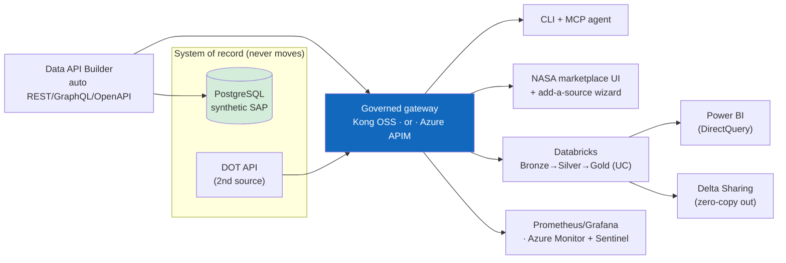

# 🚀 Complete demo script — the full showcase (local → Azure → lakehouse)

[Home](../README.md) > [Documentation](README.md) > **Complete Demo**

> [!NOTE]
> **TL;DR** — The end-to-end presenter script for **everything** this POC builds: the
> local one-command stack, the **live Azure** deployment in *both* gateway editions
> (Kong **and** API Management), the **Databricks** zero-move lakehouse (two read modes),
> the **Power BI** report, and **Delta Sharing** to external consumers. Pick the segments
> you need — the whole thing runs ~25–35 min; the core story is ~10.

> [!WARNING]
> All data is **synthetic** (ITAR/CUI-safe) — see [`DISCLAIMER.md`](DISCLAIMER.md).
> The focused 10-minute local-only script is [`DEMO-SCRIPT.md`](DEMO-SCRIPT.md); this is
> the superset that adds the live Azure + analytics surfaces.

---

## 📑 Table of Contents

- [The one-sentence frame](#-the-one-sentence-frame)
- [What you'll show (the map)](#-what-youll-show-the-map)
- [Live endpoints (reference card)](#-live-endpoints-reference-card)
- [Part A — Local stack in one command](#-part-a--local-stack-in-one-command-10-min)
- [Part B — Live in Azure: the Kong edition](#-part-b--live-in-azure-the-kong-edition-6-min)
- [Part C — Azure API Management edition](#-part-c--azure-api-management-edition-5-min)
- [Part D — Databricks zero-move lakehouse](#-part-d--databricks-zero-move-lakehouse-6-min)
- [Part E — Power BI report](#-part-e--power-bi-report-3-min)
- [Part F — Delta Sharing: zero-copy to external consumers](#-part-f--delta-sharing-zero-copy-to-external-consumers-2-min)
- [Close — Azure-Government mapping & hardening](#-close--azure-government-mapping--hardening-1-min)
- [Teardown](#-teardown)

---

## 🎯 The one-sentence frame

> "One platform for **data, APIs, and code** — Microsoft as the secure **interoperability
> layer**, not 'the one AI.' The system of record never moves; an open-source gateway
> governs an auto-generated API in front of it; and a CLI, an AI agent, a marketplace UI,
> **and** the analytics platform all answer the same Artemis supply-chain question through
> that one governed surface — with governance (auth, rate-limit, metering, field-level
> redaction) following the data product everywhere it's consumed."

---

## 🗺️ What you'll show (the map)



| Segment | Surface | The point |
|---|---|---|
| A | Local `docker compose` stack | the whole pattern, one command, fully offline |
| B | Azure Container Apps + **Kong** | the live product: tenant-locked UI, federation, Key Vault, redaction |
| C | Azure **API Management** | the managed twin: Developer Portal, Entra sign-in, Try-It, subscriptions |
| D | **Databricks** medallion (Unity Catalog) | zero-move *into the lakehouse* — two read modes |
| E | **Power BI** | the executive report over DirectQuery |
| F | **Delta Sharing** | zero-copy to an external consumer |

---

## 🔌 Live endpoints (reference card)

> [!TIP]
> Reference deployment in **`limitlessdata`** / subscription *FedCiv ATU FFL - Main*
> (`ca2b3e6b-…`), region **Central US**. Substitute your own FQDNs if you redeploy.

| Surface | URL |
|---|---|
| NASA marketplace UI (tenant-locked) | `https://frontend.icyocean-479340e8.centralus.azurecontainerapps.io` |
| Kong gateway | `https://kong.icyocean-479340e8.centralus.azurecontainerapps.io` |
| Identity (token issuer) | `https://identity.icyocean-479340e8.centralus.azurecontainerapps.io` |
| Catalog | `https://catalog.icyocean-479340e8.centralus.azurecontainerapps.io` |
| APIM gateway | `https://artemis-apim-n1.azure-api.net` |
| APIM Developer Portal | `https://artemis-apim-n1.developer.azure-api.net` |
| Databricks workspace | `https://adb-7405607213468698.18.azuredatabricks.net` |
| Unity Catalog / warehouse | catalog `adb_eastus2_sandbox` · Serverless SQL Warehouse |

---

## 🅰️ Part A — Local stack in one command (10 min)

> The complete pattern, fully offline. (This is the [`DEMO-SCRIPT.md`](DEMO-SCRIPT.md)
> flow in brief — run it first if the room wants the architecture from scratch.)

```bash
cp .env.example .env
pip install -e .
make demo          # up → wait-healthy → seed → governed client → MCP smoke → answer
```

Then, live:

```bash
# 1) the mission answer THROUGH the gateway (note the correlation id)
python client/query_supply_risk.py --program Artemis-3 --min-delay 30

# 2) auth at the edge — 401 / 200 / 429 / 400  (ports per .env; defaults shown)
curl -i http://localhost:8000/api/SupplyRisk                                   # 401 no token
TOKEN=$(curl -s -X POST http://localhost:8081/token -H 'Content-Type: application/json' \
  -d '{"consumer":"analyst"}' | python -c "import sys,json;print(json.load(sys.stdin)['access_token'])")
curl -i -H "Authorization: Bearer $TOKEN" "http://localhost:8000/api/Material?\$first=1"  # 200
for i in $(seq 1 80); do curl -s -o /dev/null -w "%{http_code} " \
  -H "Authorization: Bearer $TOKEN" "http://localhost:8000/api/Material?\$first=1"; done; echo  # …429
curl -i -H "Authorization: Bearer $TOKEN" "http://localhost:8000/api/Material?\$first=99999"     # 400 OWASP guard

# 3) field-level redaction — Confidential columns never cross the gateway
curl -s -H "Authorization: Bearer $TOKEN" "http://localhost:8000/api/Material?\$first=1" | python -m json.tool
#    -> no std_unit_cost_usd ; PurchaseOrder -> no netpr/netwr

# 4) prove zero-move + discovery + agent
make test                                                # incl. test_zero_move + test_redaction
curl -s http://localhost:8080/catalog | python -m json.tool
python services/mcp/smoke_client.py

# 5) observability + live onboarding
make obs                                                 # Grafana :3000 — per-consumer traffic
make ui                                                  # browser UI :5173 — "+ Add a data source" wizard
```

> **Say it:** "Zero-move is *real* — Postgres and DAB are on an internal Docker network
> with no host ports; the only path to data is Kong, and `test_zero_move.py` proves it.
> Redaction is *real* — `std_unit_cost_usd`, `netpr`, `netwr` are stripped at the data
> API for the marketplace consumer (`test_redaction.py`)."

---

## 🅱️ Part B — Live in Azure: the Kong edition (6 min)

Everything from Part A, now **running in Azure Container Apps**, tenant-locked.

### 🔐 1. The tenant-locked UI

Open **`https://frontend.icyocean-479340e8.centralus.azurecontainerapps.io`**.

- Unauthenticated → redirected to **Microsoft Entra** sign-in (single-tenant **EasyAuth**).
  A wrong-tenant account is rejected ("does not exist in tenant 'Limitless Data'").
- Sign in with a **`@limitlessdata.ai`** account → the **NASA marketplace** loads.

> [!NOTE]
> **EasyAuth gotcha (already fixed):** ACA EasyAuth uses the hybrid flow
> (`code id_token`/`form_post`), so the app registration must have **ID-token issuance
> enabled** — otherwise sign-in succeeds and the app returns 401. The deploy scripts set
> this by default.

### 🖥️ 2. Query through the gateway, in the browser

Click the **Artemis Supply-Chain Risk API** card → the query console opens with the
headline query pre-built (Artemis-3 · Critical · sole-source · >30-day slip · consumer
`analyst`) → **Run through gateway**:

- **HTTP 200** + a live **gateway correlation-id** (e.g. `…#21`),
- the ranked **6-row** high-risk table (top: **Heat-pipe radiator panel**, risk 100,
  54-day slip), with suppliers resolved via a second governed call.

### 🔗 3. Federation + redaction (from a terminal, against Azure)

```bash
D=icyocean-479340e8.centralus.azurecontainerapps.io
TOK=$(curl -s -X POST https://identity.$D/token -H 'Content-Type: application/json' \
  -d '{"consumer":"analyst"}' | python -c "import sys,json;print(json.load(sys.stdin)['access_token'])")

curl -s -o /dev/null -w "no-token %{http_code}\n" "https://kong.$D/api/SupplyRisk?\$first=1"          # 401
curl -s -H "Authorization: Bearer $TOK" "https://kong.$D/dot/api/Bridge?\$first=2" | python -m json.tool   # federated 2nd source, 200
curl -s -H "Authorization: Bearer $TOK" "https://kong.$D/api/Material?\$first=1" | python -m json.tool      # std_unit_cost_usd redacted
```

> **Say it:** "Two sources — Artemis procurement **and** a DOT transportation API —
> federated behind one governed gateway, zero-move, each call authed + rate-limited +
> correlation-id'd. The 'add a source' wizard (Part A) is how a third arrives in minutes."

### 🗝️ 4. Secrets, identity & SIEM (talk track)

- **Key Vault**: the DAB Postgres connection string lives in `artemis-kv-n1`; the app
  reads it via a **managed identity** + Key Vault reference — never inlined.
- **Log Analytics + Microsoft Sentinel** are enabled on the workspace (`artemis-logs`)
  for SIEM analytics over the same gateway/app telemetry.
- Observability: run **`make obs`** locally for the live Grafana per-consumer dashboard
  (Kong's metrics port isn't exposed in ACA; Azure Monitor is the managed equivalent).

---

## 🅲 Part C — Azure API Management edition (5 min)

The **managed twin** of the Kong gateway — same API, governed by APIM.

### 🚪 1. The gateway (subscription-key gated)

```bash
GW=https://artemis-apim-n1.azure-api.net
curl -s -o /dev/null -w "no-key %{http_code}\n" "$GW/api/SupplyRisk?\$first=1"                       # 401
# with a subscription key (Azure portal → APIM → Subscriptions, or the Developer Portal):
curl -s -H "Ocp-Apim-Subscription-Key: <KEY>" "$GW/api/SupplyRisk?\$first=1" | python -m json.tool   # 200
```

### 🧑‍💻 2. The Developer Portal — the self-service story

Open **`https://artemis-apim-n1.developer.azure-api.net`**:

- **Browse APIs** → **Artemis Supply-Chain Risk API** with all **8 operations**
  (Material / PurchaseOrder / SupplyRisk / Vendor — list + by-key) and a downloadable
  OpenAPI definition.
- **Sign in** → the **Microsoft Entra ID** button (tenant accounts) *or* email/password.
- **Try it** → the interactive console makes live calls (CORS enabled) with a
  subscription key.
- **Products → Artemis Data Products** → **self-service subscription** sign-up.

> **Say it:** "This is the managed twin of our catalog UI + 'add a source' wizard —
> self-service API **discovery, try-it, and subscription**, run by Azure. Kong gives us
> the OSS-portable path; APIM gives us the managed Azure-Government path. Same OpenAPI,
> same OAuth2/JWT, same policies (JWT validation, rate-limit, correlation id)."

> [!NOTE]
> One-time portal provisioning is from admin mode (Azure portal → APIM → Developer portal
> → Portal overview → **Publish**); after that the deploy script keeps it republished and
> the API visible to guests. See [`APIM-EDITION.md`](APIM-EDITION.md).

---

## 🅳 Part D — Databricks zero-move lakehouse (6 min)

The data product flows **into the lakehouse without copying the database** — landing a
**Bronze → Silver → Gold** medallion in **Unity Catalog**, queryable from Databricks SQL.

### 🔀 Two read modes — both zero-move, different governance posture

| Mode | How it reads | Story |
|---|---|---|
| **postgres** | direct JDBC to the deployed cloud SoR | the privileged **platform ETL** — full fidelity (incl. cost), feeds the Power BI exec report |
| **gateway** | **through Kong**, bearer token, paged + rate-limited | any **governed consumer** — capped, metered, correlation-id'd, and **field-redacted** (no `netwr`/`netpr` → committed value redacted) |

```bash
az login                                            # tenant: limitlessdata
# (postgres mode — full-fidelity mart, what Power BI reads)
export PG_ADMIN_PASSWORD='<deployed Postgres password>'
python databricks/run_notebook.py \
  --host adb-7405607213468698.18.azuredatabricks.net \
  --catalog adb_eastus2_sandbox --source-mode postgres \
  --pg-host artemis-pg-n1.postgres.database.azure.com

# (gateway mode — governed read THROUGH Kong; mint + store a token automatically)
D=icyocean-479340e8.centralus.azurecontainerapps.io
python databricks/run_notebook.py \
  --host adb-7405607213468698.18.azuredatabricks.net \
  --catalog adb_eastus2_sandbox --source-mode gateway \
  --gateway-url https://kong.$D --identity-url https://identity.$D --consumer artemis-agent
```

The runner imports the notebook, submits a single-node Unity-Catalog job, and prints the
notebook's JSON summary (gold rows + headline). The notebook logs each gateway read with
its **correlation id** — proof the lakehouse was fed through the governed surface.

### ✅ Verify in Databricks SQL

```sql
USE CATALOG adb_eastus2_sandbox;
SHOW TABLES IN gold;                                 -- artemis_supply_risk, delay_trend
-- the same headline answer, now from Delta in Unity Catalog:
SELECT program, material_name, vendor_name, risk_tier, risk_score, avg_delay_days
FROM gold.artemis_supply_risk
WHERE program='Artemis-3' AND criticality='Critical' AND sole_source=true AND avg_delay_days>30
ORDER BY risk_score DESC;                            -- 6 rows; top = Heat-pipe radiator panel, risk 100
```

More report queries in [`databricks/sql/dbsql_samples.sql`](../databricks/sql/dbsql_samples.sql);
full walkthrough in [`DATABRICKS-WALKTHROUGH.md`](DATABRICKS-WALKTHROUGH.md).

> **Say it:** "Same data product, two consumers. The platform team's privileged ETL gets
> full fidelity. A governed analytics consumer reading **through the gateway** gets the
> exact same rows **with cost redacted** — governance follows the data product into the
> lakehouse. Zero-move either way: the SoR was never copied wholesale."

---

## 🅴 Part E — Power BI report (3 min)

> [!NOTE]
> A finished `.pbix` is a GUI artifact (not generated headless) — this is the build spec a
> presenter follows in Power BI Desktop. Everything upstream (Delta, Unity Catalog, the
> queries) is live and validated. Full spec: [`POWERBI-GUIDE.md`](POWERBI-GUIDE.md).

1. **Get Data → Azure Databricks** →
   - Server hostname `adb-7405607213468698.18.azuredatabricks.net`
   - HTTP path `/sql/1.0/warehouses/973dba4787484119`
   - **Authentication: Microsoft Entra ID** · **DirectQuery**
2. Navigator → catalog **`adb_eastus2_sandbox`** → `gold` → **`artemis_supply_risk`** (+ `delay_trend`).
3. Add the DAX measures (High Risk Materials, Sole-Source Exposure $, Critical Slips >30d,
   Pad Anomalies) and build the one-page **"Artemis Supply-Chain Risk"** report — KPI
   cards, a program slicer (default Artemis-3), a risk-tier stacked bar, the ranked
   at-risk-parts table, and a sole-source treemap.

> **Say it:** "DirectQuery keeps it zero-move at the report layer too — Power BI queries
> the Delta mart in place. The same answer the gateway serves now lands on an executive's
> dashboard, governed end to end."

---

## 🅵 Part F — Delta Sharing: zero-copy to external consumers (2 min)

The Gold mart is published as a **Delta Share** — an external partner queries it
**without a copy** (the zero-move story, extended past the org boundary).

```sql
-- already created by the notebook / setup:
SHOW ALL IN SHARE artemis_supply_risk_share;          -- gold.artemis_supply_risk, gold.delay_trend
DESCRIBE RECIPIENT artemis_external_recipient;         -- open-sharing activation link (a credential)
```

The recipient's **activation link** lets an external consumer (Power BI, pandas
`delta-sharing`, Spark) read the shared tables directly — no ETL, no copy.

> [!WARNING]
> The activation link is a **bearer credential** — share it only with the intended
> recipient. Rotate with `ALTER RECIPIENT … ROTATE TOKEN`.

> **Say it:** "Zero-move doesn't stop at our tenant boundary. Delta Sharing hands a
> partner agency live, governed access to the curated mart — open protocol, no copy, no
> proprietary client."

---

## 🌐 Close — Azure-Government mapping & hardening (1 min)

> "Every OSS component has a managed Azure(-Gov) twin: Kong → **API Management**, the
> issuer → **Microsoft Entra ID**, DAB → **DAB on Container Apps**, `classification.yml`
> → **Microsoft Purview**, Prometheus/Grafana → **Azure Monitor + Sentinel**, and the
> lakehouse is **Azure Databricks + Unity Catalog + Delta** at FedRAMP High. Production
> hardening — **VNet + private endpoints** so the SoR has no public path, **Key Vault**
> for secrets, **Sentinel** for SIEM — is reference Bicep in `infra/azure/`. Live, dated
> Azure prices: **`make pricing`**. No Microsoft Fabric / OneLake anywhere — and
> `test_no_fabric.py` enforces it."

See [`AZURE-DEPLOYMENT.md`](AZURE-DEPLOYMENT.md) · [`AZURE-LIVE-DEPLOYMENT.md`](AZURE-LIVE-DEPLOYMENT.md)
· [`SECURITY.md`](SECURITY.md).

---

## 🧹 Teardown

```bash
make down                       # local stack + volumes
./scripts/azure-teardown.sh     # Azure RG + EasyAuth/portal app regs (purges Key Vault)
```

Databricks (pre-existing workspace — **don't** delete the resource group):

```sql
DROP SCHEMA IF EXISTS adb_eastus2_sandbox.bronze CASCADE;
DROP SCHEMA IF EXISTS adb_eastus2_sandbox.silver CASCADE;
DROP SCHEMA IF EXISTS adb_eastus2_sandbox.gold   CASCADE;
DROP SHARE IF EXISTS artemis_supply_risk_share;
DROP RECIPIENT IF EXISTS artemis_external_recipient;
```
