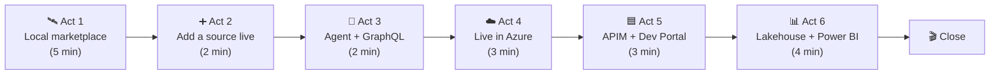

# 🚀 Demo day — the full end-to-end runbook

[Home](../README.md) > [Documentation](README.md) > **Demo day**

> [!NOTE]
> **TL;DR** — One narrative across every surface: local zero-move marketplace → live
> source onboarding → observability → agent (MCP) + GraphQL → **live in Azure**
> (Kong edition, tenant-locked) → **APIM edition** (managed gateway + Developer Portal) →
> **Databricks medallion** → **Power BI**. Pick the depth that fits the room.

> ⚠️ Synthetic data only · not an official NASA document — see [`DISCLAIMER.md`](DISCLAIMER.md).

## 📑 Table of contents

- [The one-sentence frame](#-the-one-sentence-frame)
- [The demo arc](#-the-demo-arc)
- [Act 1 — the local marketplace (5 min)](#-act-1--the-local-marketplace-5-min)
- [Act 2 — add a source, live (2 min)](#-act-2--add-a-source-live-2-min)
- [Act 3 — agent + GraphQL (2 min)](#-act-3--agent--graphql-2-min)
- [Act 4 — live in Azure (3 min)](#-act-4--live-in-azure-3-min)
- [Act 5 — APIM edition + Developer Portal (3 min)](#-act-5--apim-edition--developer-portal-3-min)
- [Act 6 — lakehouse + Power BI (4 min)](#-act-6--lakehouse--power-bi-4-min)
- [Close](#-close)

## 🎯 The one-sentence frame

> "One platform for data, APIs, and code — Microsoft as the secure interoperability layer,
> not 'the one AI.' Data never moves; a governed gateway publishes an auto-generated API
> over each source; the data product is discoverable; and any consumer — analyst, agent,
> or the lakehouse — reaches it through the same governed surface."

## 🗺️ The demo arc



> [!TIP]
> Each act is self-contained — drop later acts to fit a shorter slot and still tell a
> complete zero-move story.

## 🛰️ Act 1 — the local marketplace (5 min)

```bash
cp .env.example .env && make demo      # up → seed → answer through the gateway
make ui                                 # NASA-themed marketplace at :5173
make obs                                # Prometheus + Grafana at :3000
```

- **The mission answer** through Kong (correlation id proves it): the ranked High-risk
  Artemis-3 parts (risk ~100) + their suppliers.
- **Auth at the edge:** no token → 401; valid → 200; burst → 429; over-broad `$first` → 400.
- **Zero-move:** `make test` → `test_zero_move.py` (sources unreachable from the client net).
- **Discovery:** the catalog card + OpenAPI + classification chips (Confidential `NETPR`…).
- **Observability:** Grafana per-consumer calls + p50/p95 latency; **Kong Manager** GUI at
  `:8002` shows the live routes/plugins/consumers.

## ➕ Act 2 — add a source, live (2 min)

In the UI: **“+ Add a data source”** → publish the DOT transportation API **through the
gateway with a live config reload** (no restart). It's instantly governed + queryable +
in the catalog. *(Full guide: [`ADD-A-SOURCE.md`](ADD-A-SOURCE.md).)*

## 🤖 Act 3 — agent + GraphQL (2 min)

```bash
python services/mcp/smoke_client.py     # an MCP agent gets the SAME governed answer
```

Then show **GraphQL** through the same gateway (multi-model, one auto-API) —
[`GRAPHQL.md`](GRAPHQL.md).

## ☁️ Act 4 — live in Azure (3 min)

Open the **tenant-locked NASA UI** in Azure (sign in with a tenant account):
`https://frontend.<env>.azurecontainerapps.io`. Same marketplace + governed gateway,
running on Container Apps over Azure Postgres. *(See [`AZURE-LIVE-DEPLOYMENT.md`](AZURE-LIVE-DEPLOYMENT.md).)*

## 🟦 Act 5 — APIM edition + Developer Portal (3 min)

Show the **managed gateway** version: the APIM **Developer Portal** (browse APIs, try-it,
self-service subscriptions) — the managed twin of our catalog + wizard. Same upstream DAB,
managed governance. *(See [`APIM-EDITION.md`](APIM-EDITION.md) + [`APIM-CAPABILITIES.md`](APIM-CAPABILITIES.md).)*

## 📊 Act 6 — lakehouse + Power BI (4 min)

The marketplace serves a **Databricks** consumer too: a zero-move medallion lands
Bronze→Silver→Gold **Delta in Unity Catalog**, exposed via Databricks SQL → **Power BI**
(supply-risk + delay-trend). *(See [`DATABRICKS-WALKTHROUGH.md`](DATABRICKS-WALKTHROUGH.md)
+ [`POWERBI-GUIDE.md`](POWERBI-GUIDE.md).)*

## 🎬 Close

> "Same pattern, two gateway editions (OSS Kong / managed APIM), one swap to Azure
> Government. Data stayed in its source the whole time; every consumer — CLI, agent,
> browser, and lakehouse — reached it through one governed, metered, auditable surface."
>
> Live, dated Azure prices: `make pricing`. Stop spend: `./scripts/azure-teardown.sh`.
