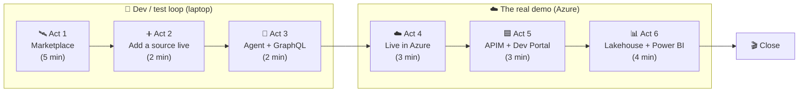
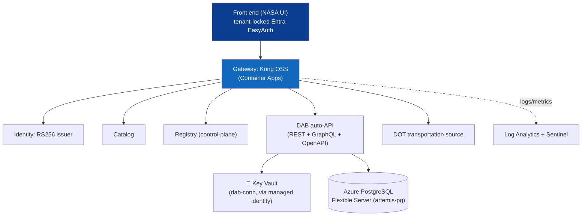
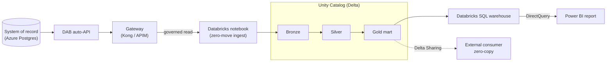

# 🚀 Demo day — the full end-to-end runbook

[Home](../README.md) > [Documentation](README.md) > **Demo day**

> [!NOTE]
> **TL;DR** — This is the *teaching* runbook for the whole arc. The primary story is
> **"deploy to Azure to show the full art of the possible"**: a governed, zero-move data
> marketplace running on Azure managed services. Local Docker (`make demo`) is the
> **dev/test loop** you use to build and rehearse; **Azure is the real demo**. Each local
> open-source component is the *analogue* of an Azure managed service, so the audience sees
> the same pattern twice — once running on your laptop, once running in the cloud.
> Pick the depth that fits the room; every act is self-contained.

> ⚠️ Synthetic data only · not an official NASA document — see [`DISCLAIMER.md`](DISCLAIMER.md).

---

## 📑 Table of contents

- [Why this demo exists](#-why-this-demo-exists)
- [The one-sentence frame](#-the-one-sentence-frame)
- [Local OSS ⇄ Azure managed — the Rosetta Stone](#-local-oss--azure-managed--the-rosetta-stone)
- [The demo arc](#-the-demo-arc)
- [Before you present (10-minute pre-flight)](#-before-you-present-10-minute-pre-flight)
- [Act 1 — the marketplace, end to end (5 min)](#-act-1--the-marketplace-end-to-end-5-min)
- [Act 2 — add a source, live (2 min)](#-act-2--add-a-source-live-2-min)
- [Act 3 — agent + GraphQL (2 min)](#-act-3--agent--graphql-2-min)
- [Act 4 — live in Azure (3 min)](#-act-4--live-in-azure-3-min)
- [Act 5 — APIM edition + Developer Portal (3 min)](#-act-5--apim-edition--developer-portal-3-min)
- [Act 6 — lakehouse + Power BI (4 min)](#-act-6--lakehouse--power-bi-4-min)
- [Close](#-close)
- [Gotchas & troubleshooting](#-gotchas--troubleshooting)
- [Where to next](#-where-to-next)

---

## 🧭 Why this demo exists

Before the commands, understand the problem this whole proof-of-concept solves — because
*that* is what you are selling on demo day, not the tooling.

Large enterprises (and agencies) hold valuable data in **systems of record** — an ERP,
a procurement database, an asset registry. The instinct, when someone needs that data for
analytics or AI, is to **copy it out** into a lake, a warehouse, a third app. Every copy is
a new attack surface, a new governance gap, a new thing to keep in sync, and — for
regulated data (ITAR, CUI, PII) — a new compliance liability.

> **In plain terms:** the more places your sensitive data lives, the more places it can
> leak, drift, or go stale. "Just copy it" is how organizations end up with twelve
> conflicting versions of the truth and a security team that can't sleep.

This demo proves a different pattern — **API-first, zero-move**:

- The data **stays in its source.** No bulk copy, no nightly export.
- A **gateway** publishes a governed API *over* each source. Every read is
  authenticated, rate-limited, metered, and tagged with a correlation id you can trace.
- The data product is **discoverable** in a catalog, with sensitivity labels attached.
- **Any** consumer — a human analyst, an AI agent, a BI tool, even a lakehouse — reaches
  the data through that *one* governed surface. Nobody gets a direct database connection.

> [!TIP]
> **Acronyms, defined once.** *Zero-move* = data is never bulk-copied; consumers read it
> in place through a governed API. *System of record (SoR)* = the authoritative source
> database. *Gateway* = the policy enforcement point in front of the API. *DAB* =
> Microsoft **Data API Builder**, which auto-generates a REST + GraphQL API over a
> database. *MCP* = **Model Context Protocol**, the open standard that lets AI agents call
> tools. Full list: [`GLOSSARY.md`](GLOSSARY.md).

**Why this matters (the enterprise story):** Microsoft's position here is *the secure
interoperability layer* — not "the one AI." Data, APIs, and code on one governed platform,
in **commercial Azure at FedRAMP High** by default, with a documented **Azure Government**
path for ITAR/strict-CUI. That is the headline you keep returning to in every act.

---

## 🎯 The one-sentence frame

Open with this. Memorize it.

> "One platform for data, APIs, and code — Microsoft as the secure interoperability layer,
> not 'the one AI.' Data never moves; a governed gateway publishes an auto-generated API
> over each source; the data product is discoverable; and any consumer — analyst, agent,
> or the lakehouse — reaches it through the same governed surface."

---

## 🪙 Local OSS ⇄ Azure managed — the Rosetta Stone

This is the single most important slide for an Azure-first audience. Everything you run
locally has a **managed Azure twin**. The local stack exists so you can develop and
rehearse cheaply; the Azure deployment is what you actually demo to a stakeholder. Keep
this table on screen and point at it as each act introduces a component.

| Concern | 🐳 Local (dev/test loop) | ☁️ Azure (the real demo) | What stays the same |
|---|---|---|---|
| API gateway / policy | **Kong OSS** (DB-less) | **Azure API Management (APIM)** | JWT validation, rate-limit, correlation id, metering |
| Identity / tokens | local **RS256 JWT issuer** | **Microsoft Entra ID** (EasyAuth, `validate-azure-ad-token`) | OAuth2/JWT, tenant-locked sign-in |
| Auto-API over the SoR | **Data API Builder** in a container | **DAB on Azure Container Apps** | REST + GraphQL + OpenAPI, no hand-written code |
| System of record | **PostgreSQL 16** container | **Azure Database for PostgreSQL — Flexible Server** | The data never moves out of it |
| Classification / governance | `data/classification.yml` (column labels) | **Microsoft Purview** pattern | "classify *before* exposure" discipline |
| Observability + SIEM | **Prometheus + Grafana** | **Azure Monitor / Log Analytics + Microsoft Sentinel** | Per-consumer metrics, latency, audit trail |
| Lakehouse consumer | (n/a locally) | **Azure Databricks + Unity Catalog + Databricks SQL** | Reads the *product* through the gateway, not the DB |
| Secrets | `.env` (never committed) | **Azure Key Vault** + managed identity | Connection strings never inlined |

> [!NOTE]
> **RS256** = an asymmetric (public/private key) JWT signing algorithm. The local issuer
> signs tokens with a private key; the gateway verifies them with the public key —
> exactly how Entra ID works, just self-hosted for the dev loop. **EasyAuth** = Azure
> Container Apps' built-in authentication front door that redirects anonymous callers to
> Entra sign-in.

---

## 🗺️ The demo arc



> [!TIP]
> **Two ways to run the demo.** Short slot or no cloud access? Run Acts 1–3 locally and
> *narrate* Acts 4–6 from this doc — the local stack already proves the pattern. Full
> slot with a stakeholder? Lead with the Azure deployment (Act 4) on screen and use the
> local stack only to show the live "add a source" wizard (Act 2), which is the one piece
> that stays a local showpiece. Either way, the story is identical.

---

## ✅ Before you present (10-minute pre-flight)

Do this **before** the room fills up. The local stack is your safety net even when the
star of the show is Azure.

```bash
cp .env.example .env        # copy the template; fill in any host-port overrides
make demo                   # up → seed → query through the gateway → print the answer
make obs                    # Prometheus (:9090) + Grafana (:3000)
make ui                     # NASA-themed marketplace SPA (:5173)
```

**What each step does and why:**

- `cp .env.example .env` creates your local config from the committed template. No secrets
  live in the repo; you supply host ports and (for Azure) `PG_ADMIN_PASSWORD` via the
  environment. See [`LOCAL-DEV.md`](LOCAL-DEV.md).
- `make demo` is the whole local loop: `docker compose --profile core up` brings up
  Postgres, DAB, the identity issuer, Kong, the catalog, and the MCP server; the seeder
  loads ~10k rows of **synthetic** Artemis procurement data; then `scripts/demo.sh` runs
  the mission query *through Kong* and prints the answer.
- `make obs` starts the observability profile so Grafana has data to show in Act 1.
- `make ui` starts the browser marketplace — this is where the Act 2 "add a source"
  wizard lives.

**Expected tail of `make demo`** (abridged — the exact rows are deterministic because the
synthetic data is seeded with `seed=42`):

```text
[1/4] No-token call is rejected at the gateway (expect 401):
      GET /api/SupplyRisk (no token)  ->  HTTP 401

[2/4] Governed Python client answers the mission question THROUGH Kong:

Q: Which Critical, sole-source materials on Artemis-3 have an average delay > 30 days?

  TIER  RISK AVG_DLY  MATERIAL                     SUPPLIER
  ----- ---- -------  ---------------------------- ------------------------------
  High   100    47.2  <part name>                  <vendor> (CAGE <code>)
  ... (≈6 high-risk rows) ...

  consumer=analyst  results=6  gateway correlation-id=<uuid>
  Data never left Postgres -- every row was brokered through Kong ...
```

> [!IMPORTANT]
> The **`gateway correlation-id`** at the bottom is your proof that the answer came
> *through* the gateway, not from a back-door database connection. Call it out every time
> — it is the spine of the zero-move claim, and it maps directly to the trace id you would
> follow in Azure Monitor.

> [!WARNING]
> **Port collisions are the #1 pre-flight failure.** The default host ports are 8000
> (Kong), 8001/8002 (Kong admin/manager), 8080 (catalog), 8081 (identity), 8090 (MCP),
> 5173 (UI), 9090 (Prometheus), 3000 (Grafana). If anything else on your machine already
> binds those, override them in `.env` (e.g. `KONG_PROXY_PORT`, `CATALOG_PORT`,
> `GRAFANA_PORT`) and re-run. `scripts/demo.sh` reads the same `.env` values, so the
> printed URLs stay correct.

---

## 🛰️ Act 1 — the marketplace, end to end (5 min)

**The point of this act:** show the complete pattern working — auth at the edge, the
governed answer, zero-move *proven*, discovery, and observability — on the local stack.
This is the analogue of the full Azure deployment you'll show in Act 4.

You already ran the commands in pre-flight. Now walk the room through five beats:

1. **The mission answer (through Kong).** Re-run the headline query so they see it live:

   ```bash
   python client/query_supply_risk.py --program Artemis-3 --min-delay 30
   ```

   This asks: *"Which Critical, sole-source materials on Artemis-3 have an average delay >
   30 days?"* The client obtains an RS256 bearer token from the identity issuer (the local
   stand-in for Entra), calls the **SupplyRisk** data product through Kong with an OData
   `$filter`, enriches each high-risk part with its supplier (PurchaseOrder → Vendor, also
   through Kong), and prints the ranked table plus the correlation id. **Risk tiers** are
   derived in the data: `High ≥ 70`, `Medium ≥ 40`, else `Low` — the headline rows sit at
   the top of the High tier (risk near 100).

   > **In plain terms:** *OData `$filter`* is just a URL way of saying "give me only the
   > rows where program = Artemis-3 and average delay > 30." DAB understands it natively,
   > so there's no custom query endpoint to write.

2. **Auth at the edge.** Demonstrate the gateway is doing real work:
   - no token → **401** (rejected before it ever reaches the data),
   - valid token → **200**,
   - burst past the rate limit → **429**,
   - an over-broad `$first` (asking for too many rows) → **400**.

   > **Why this matters:** the policy lives at the gateway, not in the database or the app.
   > In Azure this is the *exact* same set of APIM policies — you are previewing Act 5.

3. **Zero-move, proven (not just claimed).** Run the test that backs the claim:

   ```bash
   make test        # runs tests/test_zero_move.py among others
   ```

   `test_zero_move.py` proves Postgres and DAB sit on an **internal** Docker network with
   no host ports — they are *unreachable* from the client network. The **only** path to the
   data is through Kong. Deep dive: [`ZERO-MOVE.md`](ZERO-MOVE.md).

4. **Discovery + classification.** Open the catalog card (in the UI, or
   `GET /catalog` through Kong). Each data product carries an OpenAPI link and **column
   sensitivity labels** — `Routine | Sensitive | Confidential` — applied *before* exposure
   (e.g. `NETPR` net price is **Confidential**, `CRITICALITY` is **Sensitive**). This is
   the **Microsoft Purview** "classify-before-exposure" discipline, shown locally via
   [`data/classification.yml`](../data/classification.yml).

5. **Observability.** Open **Grafana** (`http://localhost:3000`, anonymous viewer enabled)
   for per-consumer call counts and p50/p95 latency. Then open **Kong Manager**
   (`http://localhost:8002`) to show the live routes, plugins, and consumers in a GUI. In
   Azure these are **Azure Monitor / Log Analytics** dashboards over the same signals.

> [!TIP]
> Keep narrating the **analogue**: "Locally this is Kong + a JWT issuer + Grafana. In
> Azure it's API Management + Entra + Azure Monitor — same policies, same answer, managed."

---

## ➕ Act 2 — add a source, live (2 min)

**The point of this act:** show that onboarding a *new* governed data product takes no
source change, no downtime, and no redeploy — the gateway just learns a new upstream.

In the UI, click **"+ Add a data source"** and publish the **DOT** (Department of
Transportation) bridge-inventory API through the gateway. Under the hood the UI posts to a
**registry control-plane**, which merges the new source into Kong's declarative config and
hot-reloads Kong (**DB-less reload — no restart**). The RSA keys and consumers are
preserved across the reload. The new source is **instantly** governed (JWT + rate-limit +
correlation id), queryable, and listed in the catalog.

> [!NOTE]
> **This is the one act that stays a *local* showpiece.** The live wizard needs Kong's
> admin port, which Azure Container Apps doesn't cleanly expose, so in the Azure
> deployment **both sources are pre-registered**. The managed-Azure equivalent of the
> wizard is the **APIM Developer Portal + Products/subscriptions** (Act 5) and **Azure API
> Center**. Narrate it that way: "locally it's a one-click wizard; in Azure it's the
> Developer Portal's self-service onboarding."

Full guide (UI wizard *and* the scriptable API): [`ADD-A-SOURCE.md`](ADD-A-SOURCE.md).

---

## 🤖 Act 3 — agent + GraphQL (2 min)

**The point of this act:** prove the governed surface is consumer-agnostic — an AI agent
and a GraphQL client get the *same* governed answer as the human analyst did in Act 1.

```bash
python services/mcp/smoke_client.py     # an MCP agent gets the SAME governed answer
```

This connects over **streamable-HTTP** to the MCP server's `/mcp` endpoint and calls its
single tool, `query_supply_risk`. The tool runs the *same* gateway-brokered query the CLI
ran — same correlation id discipline, same JWT, same rate limits. The agent never touches
the database; it calls a governed tool.

> **In plain terms:** *MCP (Model Context Protocol)* is the open standard that lets an AI
> host — Microsoft Copilot, Azure AI Foundry, or any MCP host — discover and call tools.
> Here the "tool" is the governed supply-risk query, so an agent answers the mission
> question without any special data access.

Then show **GraphQL** through the same Kong route. DAB auto-generates a GraphQL endpoint
*alongside* REST (and OpenAPI) with no extra code, and Kong governs `/graphql` with the
same JWT + rate-limit + correlation-id policies. This is the **multi-model** story: one
auto-API, queried as REST/OData *or* GraphQL, both governed. See [`GRAPHQL.md`](GRAPHQL.md).

> **Why this matters:** the same governed surface serves a CLI, an agent, and a GraphQL
> client. That is the "any consumer, one governed surface" promise made concrete — and it
> is identical when the gateway is APIM in Azure.

---

## ☁️ Act 4 — live in Azure (3 min)

> **This is the headline act for an enterprise audience.** Everything in Acts 1–3 was the
> dev loop. *This* is the art of the possible: the same marketplace, the same governed
> gateway, running on **Azure managed services** in a real tenant.

Open the **tenant-locked NASA UI** in a browser:

```text
https://frontend.<env>.azurecontainerapps.io
```

(The reference deployment lives in the `limitlessdata` tenant, **Central US**, at
`https://frontend.xxxxxxxx-xxxxxxxx.centralus.azurecontainerapps.io`.) An anonymous
visitor is redirected to **Microsoft Entra** sign-in; only a **tenant** account can use
it. Sign in, then run the headline supply-risk query — it returns **HTTP 200 + a gateway
correlation id + the ranked high-risk table**, the federated DOT bridge inventory loads,
and both data products appear in the catalog.



**Point at the managed-service mapping as you talk:**

- **Front end + gateway + identity + catalog + DAB** run as **Azure Container Apps**.
- The **system of record** is a managed **Azure Database for PostgreSQL — Flexible
  Server**; the data never leaves it.
- The DAB connection string is **never inlined** — it lives in **Azure Key Vault**
  (`dab-conn`) and DAB resolves it at runtime via a **system-assigned managed identity**
  with the *Key Vault Secrets User* role. No secret in app config, ever.
- The front end is **tenant-locked by Entra EasyAuth** (single-tenant): anonymous → sign-in.
- **Log Analytics** collects Container Apps logs (and, in Act 5, APIM gateway logs +
  metrics); **Microsoft Sentinel** is enabled on the same workspace, so gateway/app
  telemetry feeds **SIEM** analytics and hunting. See [`SECURITY.md`](SECURITY.md).

> [!IMPORTANT]
> **Honest deltas vs. local (say these out loud — credibility wins demos):** in this
> functional deployment the apps use **public ingress** (the gateway still governs every
> data call). *True* zero-move in Azure adds a **VNet + private endpoints** so the SoR has
> no public path at all — that is the production-hardening step, captured as reference
> Bicep ([`infra/azure/modules/network.bicep`](../infra/azure/modules/network.bicep),
> enabled with `enablePrivateNetworking=true`). The live "add a source" wizard, Kong
> Manager, and Prometheus/Grafana use admin/metrics ports ACA doesn't expose, so they stay
> local; Azure Monitor / the APIM Developer Portal are the managed substitutes.

**Reproduce it yourself** (no secrets committed; `PG_ADMIN_PASSWORD` comes from the env):

```bash
scripts/azure-deploy-fullstack.sh
```

Full walkthrough, resource inventory, and the EasyAuth ID-token gotcha:
[`AZURE-LIVE-DEPLOYMENT.md`](AZURE-LIVE-DEPLOYMENT.md). Background on the platform posture
(FedRAMP High default, Azure Gov exception): [`AZURE-DEPLOYMENT.md`](AZURE-DEPLOYMENT.md).

---

## 🟦 Act 5 — APIM edition + Developer Portal (3 min)

**The point of this act:** show that the gateway is swappable. Act 4 fronted the stack with
**Kong OSS** on Container Apps; this act fronts the *same* upstream DAB with the **managed**
**Azure API Management (APIM)** gateway — and gets a built-in Developer Portal for free.

The upstream is **identical** — the same DAB auto-API over the same managed Postgres. Only
the gateway changes:

| Layer | 🐙 Kong edition (Act 4) | 🟦 APIM edition (this act) |
|---|---|---|
| Gateway | Kong OSS (DB-less) | Azure API Management (managed) |
| Auth | local RS256 issuer + Kong `jwt` | Microsoft Entra + `validate-azure-ad-token` |
| Discovery UI | our catalog + NASA wizard | **APIM Developer Portal** (managed) |
| Onboarding | live "add a source" wizard | **Products + subscriptions** |
| Metrics | Prometheus + Grafana | **Azure Monitor / App Insights** |
| Deploy | `scripts/azure-deploy-fullstack.sh` | `scripts/azure-deploy-apim.sh` |

Walk the **Developer Portal**: browse the published APIs, use **try-it** to call the
SupplyRisk product in the browser, and create a **self-service subscription** (the managed
twin of our catalog + onboarding wizard). The same policies you saw at Kong — token
validation, rate-limit, correlation id — are expressed as **APIM policies**, giving you
**policy parity** across editions.

> **Why this matters:** customers don't have to choose between "open source we run" and
> "managed we buy." It's the *same pattern*; pick the gateway that fits the operating
> model. Kong when you want to own it; APIM when you want Azure to run it and hand you a
> Developer Portal, Entra-native auth, and the AI-gateway.

Deep dives: [`APIM-EDITION.md`](APIM-EDITION.md) and
[`APIM-CAPABILITIES.md`](APIM-CAPABILITIES.md).

---

## 📊 Act 6 — lakehouse + Power BI (4 min)

**The point of this act:** prove the marketplace serves *analytics* as just another
governed consumer — the lakehouse reads the data **product through the gateway**, not the
database. Zero-move all the way to the BI report.

**Azure Databricks** runs a notebook that reads the SupplyRisk product *through the
gateway* (authenticated, metered, auditable) and builds a **medallion** —
**Bronze → Silver → Gold** as **Delta** tables in **Unity Catalog**. The Gold mart is then
exposed via a **Databricks SQL warehouse** that **Power BI** connects to over
**DirectQuery**, producing supply-risk and delay-trend reports. The system of record never
moves; analytics consume the *product*.



> [!NOTE]
> **Two run modes in the notebook** (`databricks/notebooks/01_zero_move_medallion.ipynb`,
> reference workspace `<your-databricks-workspace>`): `postgres` mode reads the DB directly (fast to
> demo today), and `gateway` mode reads *through* the gateway (the true zero-move path).
> Lead with `gateway` mode for the zero-move story. The Power BI report targets
> `<catalog>.gold.artemis_supply_risk`; the reference workspace catalog is
> `main` (also the notebook's default `catalog` widget).

> **Why this matters (platform posture):** the managed analytics platform — **Azure
> Databricks + managed Unity Catalog + Databricks SQL + Delta Lake + Delta Sharing on ADLS
> Gen2** — runs in **commercial Azure at FedRAMP High** by default. The managed-UC gap is
> the **Azure Government (ITAR/strict-CUI) exception only**, not the norm. And note the
> deliberate exclusion: **Microsoft Fabric / OneLake is *not* part of this design** (it is
> not available in Azure Gov/GCC for this scenario).

Deep dives: [`DATABRICKS-WALKTHROUGH.md`](DATABRICKS-WALKTHROUGH.md) and
[`POWERBI-GUIDE.md`](POWERBI-GUIDE.md).

---

## 🎬 Close

Land the plane with the through-line, then show the cost discipline.

> "Same pattern, two gateway editions (OSS Kong / managed APIM), one swap to Azure
> Government. Data stayed in its source the whole time; every consumer — CLI, agent,
> browser, and lakehouse — reached it through one governed, metered, auditable surface.
> Microsoft is the secure interoperability layer for data, APIs, and code."

```bash
make pricing                 # live, dated Azure list prices (Azure Retail Prices API)
./scripts/azure-teardown.sh  # delete the RG + EasyAuth app regs to stop spend
```

> [!IMPORTANT]
> Azure figures from `make pricing` are **live and dated**, pulled from the public Azure
> Retail Prices API, and carry the source + retrieval date. They are list (PAYG) prices
> and **exclude EA/MCA/commit discounts** — never quote them as a final bill. There are no
> staffing or services dollar figures anywhere in this repo by design.

---

## 🛠️ Gotchas & troubleshooting

| Symptom | Likely cause | Fix |
|---|---|---|
| `make demo` fails binding a port | Another process holds 8000/8080/8081/3000/9090/5173 | Override the port var in `.env` (e.g. `KONG_PROXY_PORT`), then re-run — `demo.sh` reads the same values |
| Headline query returns 0 rows | Filter too tight for your run | Relax it: `--min-delay 0` or `--include-non-sole-source` |
| MCP step prints "(MCP smoke skipped)" | MCP server not healthy yet | Wait for healthchecks (`make logs`), or re-run `make up` |
| Azure UI signs in then returns **401** | EasyAuth needs ID-token issuance | Already fixed in the deploy scripts (`--enable-id-token-issuance true`); redeploy if you hand-built the app reg |
| Grafana empty | Observability profile not up, or no traffic yet | `make obs`, then run a query so there are metrics to chart |
| `test_no_fabric.py` fails | A doc mentioned Fabric/OneLake as a component | Remove it — the only allowed mention is the single "explicitly excluded, and why" line |

---

## 🔭 Where to next

- **Just presenting locally?** Use the tight 10-minute script:
  [`DEMO-SCRIPT.md`](DEMO-SCRIPT.md).
- **Want the "everything" superset** (both gateways + Databricks + Power BI + Delta
  Sharing)? [`DEMO-COMPLETE.md`](DEMO-COMPLETE.md).
- **Understand the zero-move proof:** [`ZERO-MOVE.md`](ZERO-MOVE.md).
- **Architecture & component map:** [`ARCHITECTURE.md`](ARCHITECTURE.md).
- **Term not clear?** [`GLOSSARY.md`](GLOSSARY.md).
