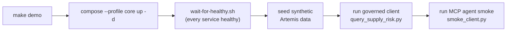
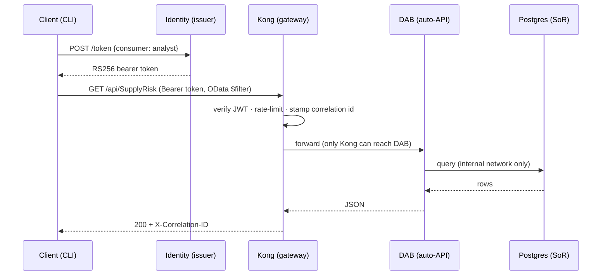

# 🎬 Demo script — the focused ~10-minute walkthrough

[Home](../README.md) > [Documentation](README.md) > **Demo Script**

> [!NOTE]
> **TL;DR** — This is the **presenter's narrated script** for a tight, screen-recordable
> ~10-minute demo of the API-first **zero-move** pattern. One command (`make demo`) brings
> the whole stack up; you then show the mission supply-risk answer returned *through the
> gateway*, prove auth at the edge (`401` / `200` / `429` / `400`), prove zero-move with a
> test, then walk discovery, the AI-agent path, observability, live source onboarding, and
> the close: *"swap each open-source piece for its managed Azure service."*
>
> **This file is the fast local loop.** For the full superset — the same story running
> **live in Azure** (Container Apps + Kong, *and* Azure API Management), plus the
> Databricks lakehouse, Power BI, and Delta Sharing — use
> [**`DEMO-COMPLETE.md`**](DEMO-COMPLETE.md).

> [!IMPORTANT]
> **Why this script exists, and how to read it.** The thing you are demonstrating is an
> *enterprise Azure pattern*: governed, API-first access to data that **never moves** out
> of its system of record, consumable by people *and* AI agents alike. The real,
> art-of-the-possible demo runs **in Azure** ([`DEMO-COMPLETE.md`](DEMO-COMPLETE.md)). This
> local Docker stack is the **develop / test loop** — fast, free, fully offline, identical
> in architecture — and every open-source component you start here is the stand-in for an
> Azure managed service you would use in production. Keep that mapping in your head as you
> present; the [reference card](#-the-azure-mapping-keep-this-in-view) below has it on one
> screen, and section [8](#-8-close--the-azure-swap-30-sec) is where you say it out loud.

> [!WARNING]
> All data is **synthetic** Artemis SAP-procurement data — **not real NASA data**, ITAR/CUI-safe.
> See [`DISCLAIMER.md`](DISCLAIMER.md).

---

## 📋 Contents

- [The one-sentence frame (say this first)](#-the-one-sentence-frame-say-this-first)
- [The Azure mapping (keep this in view)](#-the-azure-mapping-keep-this-in-view)
- [0. Prerequisites (before the room)](#-0-prerequisites-before-the-room)
- [1. One command brings the whole stack up (2 min)](#️-1-one-command-brings-the-whole-stack-up-2-min)
- [2. The mission answer — through the gateway (2 min)](#-2-the-mission-answer--through-the-gateway-2-min)
- [3. Auth at the edge — 401 / 200 / 429 / 400 (2 min)](#-3-auth-at-the-edge--401--200--429--400-2-min)
- [4. Prove zero-move (1 min)](#-4-prove-zero-move-1-min)
- [5. Discovery — the catalog + OpenAPI (1 min)](#-5-discovery--the-catalog--openapi-1-min)
- [6. The agent path — MCP (1 min)](#-6-the-agent-path--mcp-1-min)
- [7. Observability — per-consumer traffic (1 min)](#-7-observability--per-consumer-traffic-1-min)
- [7b. Add a source, live — the onboarding wizard (1–2 min)](#-7b-add-a-source-live--the-onboarding-wizard-12-min)
- [8. Close — the Azure swap (30 sec)](#-8-close--the-azure-swap-30-sec)
- [Gotchas & troubleshooting](#-gotchas--troubleshooting)
- [Teardown](#-teardown)
- [Where to next](#-where-to-next)

---

## 🎯 The one-sentence frame (say this first)

> [!IMPORTANT]
> **Open with this — it sets the entire narrative:**
>
> *"One platform for **data, APIs, and code** — Microsoft as the secure **interoperability
> layer**, not 'the one AI.' The data never moves; an open-source gateway governs an
> auto-generated API in front of it; and an AI agent answers a real Artemis supply-chain
> question through that gateway — with governance (auth, rate-limit, metering) following
> the data product to every consumer."*

**Why this matters:** a mission-shaped enterprise has procurement data in SAP, other data
in other systems, each owned by a different team and sensitive in different ways. The
tempting move — *copy it all into one lake so everyone can reach it* — creates a second
thing to secure and a stale snapshot the moment it lands. The pattern in this demo does
the opposite: it leaves the data in place and puts **one governed front door** in front of
it. That front door is the only path in, and it is the thing you will keep pointing at all
the way through.

> [!TIP]
> **In plain terms.** Think of the system of record (a database) as a bank vault. Most
> demos hand out photocopies of the vault's contents — easy, but now there are copies to
> chase. This demo instead installs **one teller window** (the gateway): you show ID (a
> token), the teller checks your limits, fetches exactly what you asked for, logs the
> transaction, and hands you the answer. The cash never leaves the vault. *That* is
> "zero-move," and the teller window is what promotes to **Azure API Management** when you
> go to the cloud.

---

## 🧭 The Azure mapping (keep this in view)

This is the spine of the whole POC: **you learn the pattern on the local open-source (OSS)
analogue, and read each piece as the Azure managed service it stands in for.** Glance at
this table before you start, and return to it at the [close](#-8-close--the-azure-swap-30-sec).

| What you start locally (this script) | What it *is* | Its Azure managed twin |
|---|---|---|
| **PostgreSQL 16** on an internal network | System of record — the data that never moves | **Azure Database for PostgreSQL — Flexible Server** |
| **Data API Builder (DAB)** | Auto-generates REST + GraphQL + OpenAPI over the DB — *no hand-written API* | **DAB on Azure Container Apps** |
| **Kong Gateway OSS** (DB-less) | The single governed front door: JWT auth, rate-limit, metering, correlation id, OWASP guard | **Azure API Management (APIM)** |
| Local **RS256 JWT issuer** | Mints the bearer tokens consumers present | **Microsoft Entra ID** |
| `data/classification.yml` + DAB column rules | Classify data *before* exposure; redact Confidential fields | **Microsoft Purview** |
| **Prometheus + Grafana** | Per-consumer traffic + latency dashboards | **Azure Monitor + Microsoft Sentinel** |
| **Postgres** (medallion stand-in) | The analytics/lakehouse target | **Azure Databricks + Unity Catalog + Delta Lake** |

> [!NOTE]
> New to any of these terms — JWT, gateway, DAB, OData, MCP? Each has a short, plain-terms
> primer under [`docs/concepts/`](concepts/README.md), and every acronym is defined in the
> [`GLOSSARY.md`](GLOSSARY.md). You do **not** need to read them to run the demo, but they
> turn "I followed the steps" into "I can explain why each step exists."

---

## 🚀 0. Prerequisites (before the room)

Do this **before** you are on screen — the live portion should start from a warm machine.

```bash
# 1) Docker Desktop running, and Python 3.11+ on the host (the CLI + MCP smoke run on the host).
# 2) Create your local config from the template (ports, passwords, rate limit live here):
cp .env.example .env
# 3) Install the host-side client deps (editable install of this repo):
pip install -e .
#    …or just the few packages the client + MCP smoke need:
#    pip install httpx "pyjwt[crypto]" pyyaml "mcp>=1.9,<2"
# 4) Pre-pull images so the live build is fast (do this on hotel/conference Wi-Fi the night before):
docker compose --profile core --profile observability pull
```

> [!TIP]
> **What each step did, and why.** `cp .env.example .env` gives you a local config file you
> can edit without touching anything committed — it holds host port numbers, demo
> passwords, and the rate-limit value. `pip install -e .` installs the host-side consumers
> (`client/query_supply_risk.py` and the MCP smoke client) that you will run *against* the
> containers. Pre-pulling images means the only thing the live `make demo` builds is the
> handful of small service images, not multi-hundred-megabyte base images over conference
> Wi-Fi.

> [!WARNING]
> **Ports may collide on a busy dev box.** The defaults are `8000` (Kong proxy), `8081`
> (issuer), `8080` (catalog), `8090` (MCP), `3000` (Grafana), `5173` (UI). If something
> already binds those, remap the host side in `.env` (e.g. `KONG_PROXY_PORT=18000`) — the
> `make` targets and `demo.sh` read your `.env`, so the URLs below follow whatever you set.
> See [`LOCAL-DEV.md`](LOCAL-DEV.md).

---

## ⌨️ 1. One command brings the whole stack up (2 min)

```bash
make demo
```

This single target does the whole loop. Under the hood it runs
`docker compose --profile core up -d`, waits for every service to report **healthy**, seeds
the synthetic data into Postgres, runs the governed Python client, and runs the MCP agent
smoke — then prints the mission answer.



**Narrate the architecture while it builds** — this is your chance to name every box and
its Azure twin before anyone sees output:

- **Postgres** is the **system of record** — synthetic SAP tables (vendors, materials,
  purchase orders, and a derived supply-risk view). *In Azure: Azure Database for
  PostgreSQL.* It is on an **internal** Docker network with **no host ports** — you
  literally cannot reach it from your laptop. (That is the zero-move guarantee, and you
  will prove it in [section 4](#-4-prove-zero-move-1-min).)
- **Data API Builder (DAB)** is a Microsoft tool that **auto-generates** a full REST +
  GraphQL + OpenAPI surface over that database — *no hand-written API code*. *In Azure: DAB
  on Container Apps.*
- **Kong** (OSS, DB-less) is the **gateway** — the single governed front door. It enforces
  JWT auth, per-consumer rate-limiting, per-consumer metering, a correlation id on every
  response, and one OWASP API control. *In Azure: API Management.*
- **Identity** issues **RS256** tokens (the local stand-in for **Microsoft Entra ID**) and
  hands Kong its public key so the gateway can verify those tokens without ever calling
  back to the issuer.
- **Catalog** publishes the data product (owner, classification, request path, sample
  query); **Prometheus/Grafana** show per-consumer traffic. *In Azure: Purview + Azure
  Monitor.*

> [!TIP]
> **In plain terms — "healthy" matters.** `make demo` does not just `up` the containers and
> hope; `wait-for-healthy.sh` blocks until each service passes its own healthcheck (DAB
> can serve OpenAPI, Kong answers `kong health`, etc.). The compose file wires
> `depends_on: condition: service_healthy`, so nothing downstream starts before its
> dependency is genuinely ready. If the demo were flaky, *this* is the safety net.

---

## 💡 2. The mission answer — through the gateway (2 min)

The `make demo` output already printed the answer; **re-run the client live** so the room
watches it happen and you can narrate the round trip:

```bash
python client/query_supply_risk.py --program Artemis-3 --min-delay 30
```

> *"Which **Critical, sole-source** materials on **Artemis-3** have an **average delay > 30
> days**?"*

Here is the full round trip the one command performs — every hop is governed, and the data
never leaves Postgres:



**Expected output (shape — your numbers are deterministic from `seed=42`):**

```text
Q: Which Critical, sole-source materials on Artemis-3 have an average delay > 30 days?

  TIER  RISK AVG_DLY  MATERIAL                     SUPPLIER
  ----- ---- -------  ---------------------------- ------------------------------
  HIGH   100    54.0  Heat-pipe radiator panel     <vendor> (CAGE <code>)
  HIGH    ...    ...   Li-ion battery module        <vendor> (CAGE <code>)
  ...

  consumer=analyst  results=6  gateway correlation-id=<id>
  Data never left Postgres -- every row was brokered through Kong (JWT-authenticated, rate-limited, metered).
```

**Point out, in order:**

1. The **ranked high-risk parts** (top tier, risk ~100, multi-week average slips — e.g.
   *Heat-pipe radiator panel*, *Li-ion battery module*) **and their suppliers** — note the
   client resolves each supplier with a *second* governed call (`PurchaseOrder → Vendor`),
   so even the enrichment goes through Kong.
2. The **gateway correlation id** — this is your proof the answer came **through Kong**, not
   from a back-channel to the database. (It is the `X-Correlation-ID` Kong stamps on every
   response.)
3. The closing line the client prints itself: ***data never left Postgres.***

> [!TIP]
> **In plain terms — what's an "OData `$filter`"?** DAB speaks **OData**, a standard URL
> query syntax. The client builds `?$filter=program eq 'Artemis-3' and avg_delay_days gt 30
> …&$orderby=risk_score desc` — a portable, documented way to ask "filter to these rows,
> sort by risk." No custom endpoint had to be written for this question; the auto-generated
> API already supports it. *In Azure, the exact same query goes through API Management to
> DAB on Container Apps.*

> [!NOTE]
> **Why a token first?** The client cannot just call the data route. It first does
> `POST /token` to the issuer to get a short-lived RS256 bearer token, then presents that
> token to Kong. Locally the issuer is a tiny service; in Azure it is **Microsoft Entra ID**
> — same OAuth2 bearer-token flow, managed identity provider.

---

## 🔒 3. Auth at the edge — 401 / 200 / 429 / 400 (2 min)

This section proves the gateway is doing real work on **every** call. Run these four cases
and let the HTTP status codes tell the story.

```bash
# (a) NO TOKEN -> rejected at the edge; the request never reaches DAB.
curl -i http://localhost:8000/api/SupplyRisk                          # expect: HTTP/1.1 401 Unauthorized

# (b) VALID TOKEN -> 200, and a correlation-id header proving it went through Kong.
TOKEN=$(curl -s -X POST http://localhost:8081/token -H 'Content-Type: application/json' \
  -d '{"consumer":"analyst"}' | python -c "import sys,json;print(json.load(sys.stdin)['access_token'])")
curl -i -H "Authorization: Bearer $TOKEN" "http://localhost:8000/api/Material?\$first=1"   # expect: HTTP/1.1 200 OK

# (c) OVER THE RATE CAP -> 429 + Retry-After (fast burst of 80 calls; the cap is 60/min).
for i in $(seq 1 80); do curl -s -o /dev/null -w "%{http_code} " \
  -H "Authorization: Bearer $TOKEN" "http://localhost:8000/api/Material?\$first=1"; done; echo
#   expect: a run of 200 … then 429 429 429 … once the per-minute quota is spent

# (d) OWASP API4 guard -> an over-broad extraction is blocked at the gateway, before DAB.
curl -i -H "Authorization: Bearer $TOKEN" "http://localhost:8000/api/Material?\$first=99999"  # expect: HTTP/1.1 400
```

> [!TIP]
> **What each case proves, in one line each:**
>
> - **(a) 401** — the `jwt` plugin rejects an unauthenticated request *at the edge*. The
>   call never touches DAB or Postgres. *In Azure: APIM's `validate-jwt` policy against
>   Entra ID.*
> - **(b) 200 + `X-Correlation-ID`** — a valid token passes, and Kong's `correlation-id`
>   plugin stamps an id you can trace. *The header is your "it went through the gateway"
>   receipt.*
> - **(c) 429 + `Retry-After`** — the `rate-limiting` plugin enforces a per-consumer quota
>   (`RATE_LIMIT_PER_MINUTE`, default **60/min**). The burst of 80 deliberately overshoots
>   it. This is the **metering/throttling** story made visible. *In Azure: APIM
>   `rate-limit-by-key`.*
> - **(d) 400** — a `pre-function` plugin implements **OWASP API4:2023 (Unrestricted
>   Resource Consumption)**: a consumer may page with `$first` up to **200**; anything
>   larger (an attempt to siphon the whole dataset in one call) is rejected *before* the
>   request reaches DAB. *In Azure: an APIM inbound policy.*

> [!NOTE]
> **Why this matters.** Every one of these controls lives at the **gateway**, not in the
> data API or the database. That is the entire point of API-first: the governance is in one
> place, in front of the data, and it is identical no matter which consumer calls — a CLI, a
> browser, or an AI agent. The same four behaviors are asserted by
> [`tests/test_gateway_auth.py`](../tests/test_gateway_auth.py), so they are not just demo
> theater — CI proves them on every change.

---

## 🧪 4. Prove zero-move (1 min)

Claims are cheap; this one is **tested**.

```bash
make test     # runs the suite, including tests/test_zero_move.py
```

**Narrate while it runs:** Postgres and DAB are attached **only** to an `internal` Docker
network that has **no host ports and no egress**. Kong is the *only* service on **both** the
`internal` and the `edge` networks — so the only path from any client to the data is
through the gateway. The test spins up a probe container on the client (`edge`) network and
asserts it **cannot even resolve or reach** Postgres or DAB; the sole reachable door is
Kong. If anyone ever wires a host port onto Postgres "just to debug," this test goes red.

> [!TIP]
> **In plain terms.** The earlier sections *showed* governed access; this one *proves there
> is no ungoverned back door.* Network isolation is what makes "the data never moves" a fact
> instead of a promise. *In Azure, the equivalent is a VNet with private endpoints so the
> system of record has no public path — the same isolation, enforced by the cloud network
> fabric. See [`ZERO-MOVE.md`](ZERO-MOVE.md).*

---

## 🔌 5. Discovery — the catalog + OpenAPI (1 min)

A marketplace is only useful if consumers can **find** the data product without tribal
knowledge. Three calls show the discovery surface:

```bash
# The marketplace listing (all published data products):
curl -s http://localhost:8080/catalog | python -m json.tool

# One product's full detail card: owner, classification, request path, sample query:
curl -s http://localhost:8080/catalog/artemis-supply-risk | python -m json.tool

# The machine-readable contract — public metadata, NO token required:
curl -s http://localhost:8000/api/openapi | python -m json.tool | head -40
```

Call out the **classification** block in the product card (Confidential `NETPR`, Sensitive
`SOLE_SOURCE`, …). The data was **classified before it was exposed** — those labels are
surfaced from [`data/classification.yml`](../data/classification.yml), and the same
classification drives field-level redaction at the data API (Confidential columns like
`std_unit_cost_usd`, `netpr`, `netwr` are stripped for the default consumer).

> [!TIP]
> **Why the OpenAPI route needs no token.** Discoverability and access are different
> concerns. *Finding* a data product and reading its **contract** (its shape, its owner) is
> public metadata — like a library catalog card. *Reading the rows* requires a token. Kong
> is configured with a more-specific public route for `/api/openapi` and governed routes for
> the data collections, so the contract is findable while the data stays gated. *In Azure,
> this is exactly what the **API Management Developer Portal** provides — browse APIs,
> download the OpenAPI, then subscribe for a key. See
> [`DEMO-COMPLETE.md`](DEMO-COMPLETE.md) Part C.*

---

## 🤝 6. The agent path — MCP (1 min)

```bash
python services/mcp/smoke_client.py
```

> *"An MCP agent — Claude Desktop, GitHub Copilot, Azure AI Foundry — calls the **same
> governed surface** and gets the **same answer**, over the open **Model Context Protocol
> (MCP)** standard, never touching the database."*

**Expected output (shape):**

```text
MCP tools advertised: ['query_supply_risk']
MCP tool returned 6 material(s); correlation-id=<id>
  - HIGH risk 100: Heat-pipe radiator panel (avg delay 54.0d)
  - ...
```

> [!TIP]
> **In plain terms — what is MCP, and why does this matter?** **MCP** is an open standard
> for exposing a capability ("query supply risk") as a **tool** an AI agent can call.
> Crucially, the MCP server here does **not** get a privileged shortcut to the data — it
> calls **through Kong** with a bearer token, exactly like the human-driven CLI did. So the
> *same* governance (auth, rate-limit, metering, correlation id) applies whether a person or
> an autonomous agent asks the question. Notice the **same correlation-id mechanism** in the
> output — proof the agent's answer also came through the gateway. *This is the
> "Microsoft as the interoperability layer, not 'the one AI'" point made concrete: any
> agent, over an open protocol, through one governed door.*

---

## 📊 7. Observability — per-consumer traffic (1 min)

```bash
make obs      # starts Prometheus + Grafana (observability profile)
```

Open Grafana at <http://localhost:3000> (anonymous **Viewer** is enabled, so no login) and
open the dashboard **"Artemis Gateway — per-consumer traffic & latency."** Re-run the client
(or a burst from [section 3](#-3-auth-at-the-edge--401--200--429--400-2-min)) and watch the
**per-consumer request count** and **p50/p95 latency** panels update live.

> [!TIP]
> **Why "per-consumer" is the whole point.** Kong's `prometheus` plugin is configured with
> `per_consumer: true`, so usage is attributed to a *named* consumer — `analyst` vs.
> `artemis-agent`. That is the **metering** story: in a real marketplace you need to know
> *who* is using *which* data product, *how much*, and *how fast it responds* — for
> chargeback, for capacity, and for abuse detection. *In Azure, this telemetry flows to
> **Azure Monitor**, and the same gateway/app logs feed **Microsoft Sentinel** for SIEM
> analytics. See [`DEMO-COMPLETE.md`](DEMO-COMPLETE.md) Part B.*

> [!NOTE]
> Kong's metrics are scraped from its status port by **Prometheus** (time-series storage)
> and visualized by **Grafana** (the dashboards). Both are provisioned from
> [`observability/`](../observability) so the dashboard appears automatically — no clicking
> to wire it up.

---

## ✨ 7b. Add a source, live — the onboarding wizard (1–2 min)

This is the *"how hard is it to onboard a new data product?"* moment — and the answer is
"minutes, in the browser, with no restart."

```bash
make ui            # starts the catalog UI (browser SPA) at http://localhost:5173
```

In the UI: click **"+ Add a data source"** → step through the guided wizard (it is
**pre-filled** with the DOT transportation example — a second internal-only DAB-style API
that ships with the stack) → **Publish through gateway.** Narrate what just happened:

- The wizard calls the **registry** (the control-plane service), which **hot-reloads Kong**
  via its admin `/config` endpoint — **no restart**. A Kong service + route + the same
  governance plugins are merged in for the new upstream. **The source itself is never
  touched.**
- The wizard immediately proves the new source answers **through Kong**: an HTTP `200`, a
  gateway **correlation id**, and rows returned.
- The new product now appears in the marketplace and is queryable like any other, with the
  **same governance** (JWT, rate-limit, correlation id) automatically applied.

> [!TIP]
> **In plain terms.** Onboarding a data product is **not** a migration or a data copy — it
> is *registering an existing API with the gateway.* That is the federation story: one
> governed front door over many sources, each added at runtime. *The very same step maps to
> **publishing an API in Azure API Management / API Center** — register the upstream,
> attach the policies, and it's live.*

> *Say it:* "Onboarding a data product is registering its API with the gateway — minutes,
> not a migration." Full guide, plus how to swap in the real public DOT URL:
> [`ADD-A-SOURCE.md`](ADD-A-SOURCE.md).

---

## 🌐 8. Close — the Azure swap (30 sec)

This is the payoff line. You have just shown the entire pattern on open-source pieces; now
you make the bridge to production explicit by swapping each one for its managed Azure twin.

> [!IMPORTANT]
> *"This is the **develop / test loop**. The **real demo runs in Azure** — and the
> architecture doesn't change, only the implementation. Each open-source piece you just saw
> has a managed Azure(-Government) twin: Kong → **Azure API Management**, the issuer →
> **Microsoft Entra ID**, DAB → **DAB on Azure Container Apps**, `classification.yml` →
> **Microsoft Purview**, Prometheus/Grafana → **Azure Monitor + Microsoft Sentinel**, and
> the data platform → **Azure Databricks + Unity Catalog + Delta Lake** at FedRAMP High.
> Production hardening — VNet + private endpoints so the system of record has no public
> path, Key Vault for secrets, Sentinel for SIEM — is reference Bicep under
> [`infra/azure/`](../infra/azure). And note what is **not** here: no Microsoft Fabric /
> OneLake anywhere — `tests/test_no_fabric.py` enforces that."*

```bash
make pricing    # prints LIVE, dated Azure infrastructure prices (Azure Retail Prices API)
```

> [!TIP]
> Want to actually *run* the Azure version on a live subscription — both the Kong edition
> and the API Management edition, plus the Databricks lakehouse and Power BI — that is the
> superset script: [`DEMO-COMPLETE.md`](DEMO-COMPLETE.md). The deployment mechanics live in
> [`AZURE-DEPLOYMENT.md`](AZURE-DEPLOYMENT.md) and
> [`AZURE-LIVE-DEPLOYMENT.md`](AZURE-LIVE-DEPLOYMENT.md).

---

## ⚠️ Gotchas & troubleshooting

> [!WARNING]
> **Things that trip up a live demo — and the fix.**
>
> - **A `curl` returns `000` or "connection refused."** A service isn't up yet, or your
>   host ports differ from the defaults. Confirm health with `docker compose ps`, and check
>   the URLs against your `.env` (remapped ports change every URL in this script). The
>   `make demo` flow waits for healthy, but ad-hoc `curl`s run on your schedule, not Kong's.
> - **The `429` burst shows all `200`s.** Your rate limit is higher than the burst, or a
>   prior run already reset the per-minute window. Run the burst again immediately, or lower
>   `RATE_LIMIT_PER_MINUTE` in `.env` and `make down && make demo`. The burst of 80 is sized
>   for the default cap of 60/min.
> - **`$first` looks wrong in your shell.** In **bash/zsh**, `$first` must be escaped as
>   `\$first` (as written above) or the shell will try to expand it. In **PowerShell**, use
>   single quotes around the URL instead.
> - **"I'll just connect to Postgres to check the data."** You can't — and that's the point
>   ([section 4](#-4-prove-zero-move-1-min)). There is no host port on the database. Query
>   it *through Kong* like every other consumer.
> - **A `401` where you expected `200`.** Your token expired (they are short-lived) or you
>   pasted a stale `$TOKEN`. Re-mint it with the `POST /token` call in
>   [section 3](#-3-auth-at-the-edge--401--200--429--400-2-min).
> - **Windows / PowerShell line continuations.** The multi-line `bash` examples use `\` and
>   `$(...)`. In PowerShell, run them via the Bash tool / Git Bash, or rewrite with
>   backtick continuations and `$(...)` PowerShell subexpressions.

---

## 🧹 Teardown

```bash
make down     # stops everything and removes volumes (a clean slate for the next run)
```

> [!NOTE]
> `make down` runs `docker compose down -v`, which **removes the named volumes** too —
> including the seeded Postgres data, the rendered Kong config, and Grafana state. That is
> intentional: it guarantees the *next* `make demo` starts from a clean, deterministic seed
> (`seed=42`). If you want to keep data between runs, use `docker compose stop` instead.

---

## 🧭 Where to next

| You want… | Go to |
|---|---|
| The **full Azure + analytics superset** (Kong *and* APIM live, Databricks, Power BI, Delta Sharing) | [`DEMO-COMPLETE.md`](DEMO-COMPLETE.md) |
| The **concepts** behind every term used here (gateway, JWT, DAB, MCP, zero-move) | [`docs/concepts/`](concepts/README.md) · [`GLOSSARY.md`](GLOSSARY.md) |
| The **architecture** in one page | [`ARCHITECTURE.md`](ARCHITECTURE.md) |
| **Why zero-move is real**, and how it's tested | [`ZERO-MOVE.md`](ZERO-MOVE.md) |
| The **security model** (auth, classification, redaction, OWASP) | [`SECURITY.md`](SECURITY.md) |
| How to **add another source** (incl. the real public DOT URL) | [`ADD-A-SOURCE.md`](ADD-A-SOURCE.md) |
| **Deploying to Azure** | [`AZURE-DEPLOYMENT.md`](AZURE-DEPLOYMENT.md) · [`AZURE-LIVE-DEPLOYMENT.md`](AZURE-LIVE-DEPLOYMENT.md) |
| The full **documentation index** | [`docs/README.md`](README.md) |
