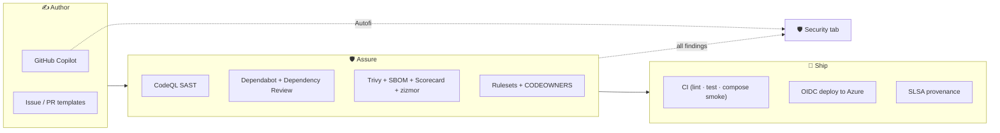

# 🐙 GitHub Features in This Repo — A Guided Tour

[Home](../README.md) > **GitHub Features Tour**

> [!NOTE]
> **TL;DR** — This is the show-and-tell companion to
> [`SOFTWARE-ASSURANCE.md`](SOFTWARE-ASSURANCE.md). It walks **every GitHub capability
> wired into this repository**, one at a time: what it is in plain language, the file that
> configures it, what it produces in the GitHub UI, and why a customer should care. Use it
> as a script when demoing the repo. The deep framework mapping (NIST SSDF / SLSA / EO
> 14028) lives in the assurance doc; this page is the *inventory and the tour*.

> [!WARNING]
> **Illustrative reference · synthetic data only.** See [`DISCLAIMER.md`](DISCLAIMER.md).

---

## 📚 Contents

- [🗺️ The big picture](#️-the-big-picture)
- [📊 Everything at a glance](#-everything-at-a-glance)
- [🔎 Code security](#-code-security)
- [📦 Dependency & supply-chain security](#-dependency--supply-chain-security)
- [🏷️ Build integrity (SBOM + provenance)](#️-build-integrity-sbom--provenance)
- [⚙️ Pipeline hardening](#️-pipeline-hardening)
- [👥 Collaboration & governance](#-collaboration--governance)
- [🚀 CI/CD](#-cicd)
- [🤖 Copilot's role](#-copilots-role)
- [✅ Turn-on checklist (settings, not files)](#-turn-on-checklist-settings-not-files)
- [🎬 Demo it in 5 minutes](#-demo-it-in-5-minutes)

---

## 🗺️ The big picture

GitHub is doing three jobs in this repo at once — **author** code, **assure** it, and
**ship** it — all in one platform, no bolt-on tools:

> [!TIP]
> Three labels you'll see below tell you what to say when presenting:
> **🟢 Added** (set up in this work) · **⚪ Existing** (already in the repo, kept) ·
> **🔧 Enable** (a one-time GitHub *setting*, not a file — see the
> [turn-on checklist](#-turn-on-checklist-settings-not-files)).

---

## 📊 Everything at a glance

| Feature | Status | Configured by | Shows up in |
|---|---|---|---|
| **CodeQL code scanning** | 🟢 Added | [`.github/workflows/codeql.yml`](../.github/workflows/codeql.yml) | Security → Code scanning |
| **Secret scanning + push protection** | 🔧 Enable | Repo setting | Security → Secret scanning |
| **Copilot Autofix** | 🔧 Enable | Repo setting | Inline on alerts |
| **Dependabot** (4 ecosystems) | ⚪ Existing | [`.github/dependabot.yml`](../.github/dependabot.yml) | Pull requests |
| **Dependency Review** (PR gate) | 🟢 Added | [`.github/workflows/dependency-review.yml`](../.github/workflows/dependency-review.yml) | PR check |
| **Trivy scan** (deps · IaC · secrets) | 🟢 Added | [`.github/workflows/supply-chain.yml`](../.github/workflows/supply-chain.yml) | Security → Code scanning |
| **SBOM** (SPDX) | 🟢 Added | [`.github/workflows/supply-chain.yml`](../.github/workflows/supply-chain.yml) | Actions → artifact |
| **SLSA build provenance** | 🟢 Added | [`.github/workflows/deploy.yml`](../.github/workflows/deploy.yml) | `gh attestation verify` |
| **OpenSSF Scorecard** | 🟢 Added | [`.github/workflows/scorecard.yml`](../.github/workflows/scorecard.yml) | Security tab + badge |
| **zizmor** (workflow SAST) | 🟢 Added | [`.github/workflows/actions-security.yml`](../.github/workflows/actions-security.yml) | Security → Code scanning |
| **Least-privilege tokens** | 🟢 Added | every workflow's `permissions:` | Workflow source |
| **Branch ruleset** | 🟢 Added | [`.github/rulesets/main-protection.json`](../.github/rulesets/main-protection.json) | Settings → Rules |
| **CODEOWNERS** | 🟢 Added | [`.github/CODEOWNERS`](../.github/CODEOWNERS) | PR reviewers |
| **PR template + security checklist** | 🟢 Added | [`.github/pull_request_template.md`](../.github/pull_request_template.md) | New PR |
| **Issue templates** | 🟢 Added | [`.github/ISSUE_TEMPLATE/`](../.github/ISSUE_TEMPLATE/) | New issue |
| **Private vulnerability reporting** | ⚪ Existing + 🔧 | [`SECURITY.md`](../SECURITY.md) | Security → Advisories |
| **CI** (lint · test · smoke) | ⚪ Existing | [`.github/workflows/ci.yml`](../.github/workflows/ci.yml) | PR checks |
| **OIDC deploy to Azure** | ⚪ Existing | [`.github/workflows/deploy.yml`](../.github/workflows/deploy.yml) | Actions |
| **Auto-merge** of green PRs | ⚪ Existing | [`.github/workflows/automerge.yml`](../.github/workflows/automerge.yml) | Pull requests |

---

## 🔎 Code security

### CodeQL — static application security testing (SAST) &nbsp; 🟢 Added

**What it is.** GitHub's own engine that reads your source like a security reviewer and
flags injection, auth, and data-flow bugs — across **Python** and the **JavaScript/TypeScript**
frontend, using the higher-signal `security-extended` query pack.

**Runs on.** Every push and PR to `main`, plus a weekly schedule (to catch newly published
queries). **You see:** alerts in **Security → Code scanning**, and a check on each PR.

**Why it matters.** It's the front-line "did we introduce a vulnerability?" gate — and it's
what **Copilot Autofix** attaches one-click fixes to.

### Secret scanning + push protection &nbsp; 🔧 Enable

**What it is.** GitHub watches for committed credentials (API keys, tokens). **Push
protection** goes further and *blocks the `git push`* that would introduce one.

**Why it matters.** Pairs with the repo's existing `detect-private-key` pre-commit hook —
defense in depth so a secret never reaches the remote. Enable it in **Settings → Code
security** (free on public repos).

---

## 📦 Dependency & supply-chain security

### Dependabot &nbsp; ⚪ Existing

Already configured for **pip, npm, GitHub Actions, and Docker** — opens weekly version and
security-update PRs that auto-merge when green. It keeps the action versions in all the new
workflows current, too.

### Dependency Review &nbsp; 🟢 Added

**What it is.** A PR gate that inspects the *change in dependencies* and **fails the PR** if
it adds a package with a known high-severity vulnerability or a disallowed (copyleft)
licence. Dependabot fixes what's already in `main`; this stops bad deps from getting in.

### Trivy supply-chain scan &nbsp; 🟢 Added

**What it is.** One scanner, three jobs: vulnerable dependencies, **infrastructure-as-code
misconfigurations** (Dockerfiles, the Bicep, `docker-compose.yml`), and stray secrets.
Results upload as SARIF into **Security → Code scanning**, alongside CodeQL.

---

## 🏷️ Build integrity (SBOM + provenance)

### SBOM — Software Bill of Materials &nbsp; 🟢 Added

**What it is.** A machine-readable **ingredients list** (SPDX format) of everything the
software is built from, produced on every run and saved as a build artifact. This is the
specific deliverable **Executive Order 14028 / OMB M-22-18** asks software vendors for.

### SLSA build provenance &nbsp; 🟢 Added

**What it is.** When the deploy pipeline builds and pushes container images, it can **sign a
cryptographic record** of *where and how* each image was built. A consumer then runs
`gh attestation verify oci://…@<digest>` to prove the image really came from this pipeline
and wasn't swapped. (The `attestations: write` permission and the step template are in
[`deploy.yml`](../.github/workflows/deploy.yml).)

**Why it matters.** This is the answer to "how do I know this artifact is the one you
built?" — the heart of supply-chain integrity (SLSA).

---

## ⚙️ Pipeline hardening

The principle: *secure the factory, not just the product.*

| Control | Status | What it does |
|---|---|---|
| **Least-privilege `permissions:`** | 🟢 Added | Every workflow's token defaults to `contents: read` and elevates only what a job needs — so a compromised step can't do much. |
| **zizmor** | 🟢 Added | Static analysis of the workflow files themselves (script injection, over-broad tokens, risky triggers). |
| **harden-runner** | 🟢 Added | Monitors the runner's network egress during security jobs (audit mode) to surface anything unexpected. |
| **OpenSSF Scorecard** | 🟢 Added | Scores the repo's overall supply-chain posture and publishes the public badge on the README. |

---

## 👥 Collaboration & governance

### Branch ruleset &nbsp; 🟢 Added

[`main-protection.json`](../.github/rulesets/main-protection.json) is an **importable**
server-side rule for the default branch: pull-request-only, required status checks (CI +
CodeQL + dependency review + supply-chain), **Code Owner review**, **signed commits**,
linear history, and no force-push or deletion. It's the cloud-enforced upgrade of the
repo's local pre-push hook.

### CODEOWNERS &nbsp; 🟢 Added

[`CODEOWNERS`](../.github/CODEOWNERS) auto-requests the right reviewer when a PR touches
security-sensitive paths (`.github/`, identity, gateway, data classification, IaC) — and,
with the ruleset, makes that review a merge gate.

### Templates &nbsp; 🟢 Added

A [PR template](../.github/pull_request_template.md) with a built-in **security checklist**
(no secrets, synthetic-data-only, zero-move preserved), and
[issue templates](../.github/ISSUE_TEMPLATE/) that route suspected vulnerabilities to
**private** reporting instead of a public issue.

### Private vulnerability reporting &nbsp; ⚪ Existing + 🔧

[`SECURITY.md`](../SECURITY.md) documents coordinated disclosure; the private-advisory
intake is a one-click setting to enable.

---

## 🚀 CI/CD

| Workflow | Status | What it does |
|---|---|---|
| **CI** ([`ci.yml`](../.github/workflows/ci.yml)) | ⚪ Existing (🟢 hardened) | Ruff lint/format, `pytest`, and a full `docker compose` smoke test that answers the mission question through the gateway. Now runs with least-privilege tokens. |
| **Deploy** ([`deploy.yml`](../.github/workflows/deploy.yml)) | ⚪ Existing (🟢 hardened) | Manual-dispatch deploy to Azure Container Apps using **OIDC** — passwordless federated login, no long-lived cloud secrets. Now carries the provenance hook. |
| **Auto-merge** ([`automerge.yml`](../.github/workflows/automerge.yml)) | ⚪ Existing | Lands green PRs automatically unless labelled `hold`. |

---

## 🤖 Copilot's role

The scanners above *find* issues; **GitHub Copilot** helps *close* them:

- **Copilot Autofix** proposes a concrete, reviewable fix for CodeQL and secret-scanning
  alerts — often a one-click PR.
- **Copilot code review** can be requested as a PR reviewer for a fast first pass.
- **Security campaigns** (org scale) batch-assign alerts to Copilot to remediate.

> **The one-liner for a customer:** *"GitHub doesn't just tell you what's wrong — Copilot
> helps you fix it, in the same pull request."*

---

## ✅ Turn-on checklist (settings, not files)

These can't be configured by a file in the repo — flip them once in the GitHub UI (free on
public repos; GitHub Advanced Security / Code Security on private repos):

- [ ] **Settings → Code security** → enable **CodeQL**, **secret scanning**, **push protection**
- [ ] Enable **Copilot Autofix** for code scanning + secret scanning
- [ ] Enable **Dependabot alerts** + **security updates**
- [ ] Enable **Private vulnerability reporting** (Security → Advisories)
- [ ] Import the ruleset: `gh api repos/OWNER/nasa-api-first-poc/rulesets --method POST --input .github/rulesets/main-protection.json`
- [ ] Replace `@OWNER` in [`CODEOWNERS`](../.github/CODEOWNERS) with your handle/team
- [ ] Replace `OWNER` in the issue-template links and the commands above with your org

---

## 🎬 Demo it in 5 minutes

A suggested live flow when showing this to someone:

1. **Open a trivial PR** → watch the checks fire: CI, **CodeQL**, **Dependency Review**,
   **supply-chain scan**, **zizmor**. *"Nothing merges until these are green."*
2. **Security tab** → show **Code scanning**, **Dependabot**, and the **Scorecard** result
   all in one place. *"This is the single pane of glass for trust."*
3. **Trigger Autofix** on a code-scanning alert → *"Copilot writes the fix, I review it."*
4. **Actions → Supply chain run → Artifacts** → download `sbom.spdx.json`. *"Here's the
   ingredients list every federal buyer now asks for."*
5. **Show the ruleset** (Settings → Rules) → *"Signed commits, required reviews, required
   checks — enforced by GitHub, not by trust."*
6. **Close with** [`SOFTWARE-ASSURANCE.md`](SOFTWARE-ASSURANCE.md) → *"And every one of
   these maps to NIST SSDF, SLSA, and EO 14028."*

---

| Go here | For |
|---|---|
| [`SOFTWARE-ASSURANCE.md`](SOFTWARE-ASSURANCE.md) | The framework mapping (NIST SSDF / SLSA / EO 14028 / CISA) |
| [`SECURITY.md`](../SECURITY.md) | The security policy + private reporting |
| [`.github/`](../.github/) | The actual workflows, templates, ruleset, and CODEOWNERS |
