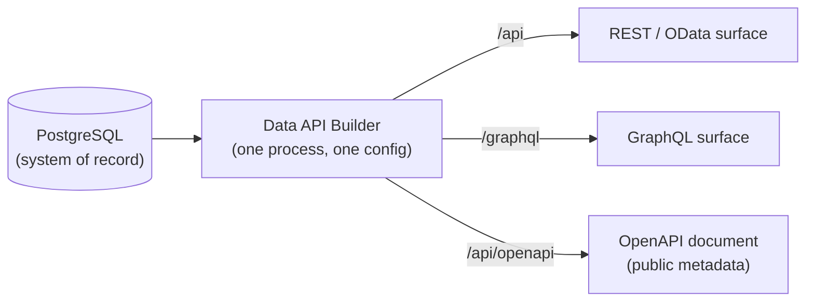
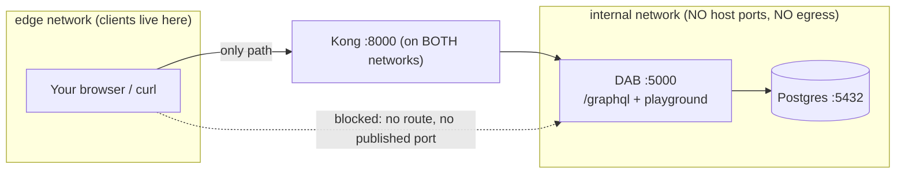
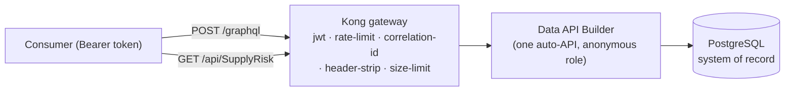
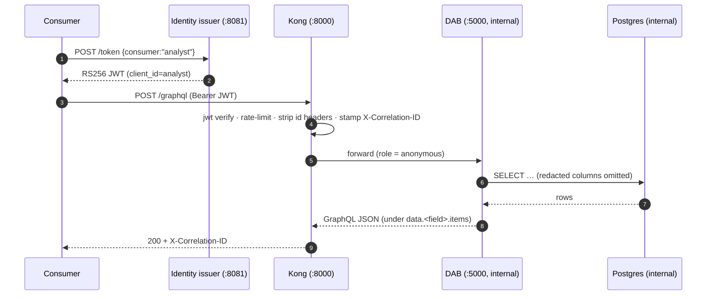

# 🔼 GraphQL through the gateway

[Home](../README.md) > [Documentation](README.md) > **GraphQL through the gateway**

> [!NOTE]
> **TL;DR** — One auto-generated API, two query shapes. [Data API Builder](GLOSSARY.md#dab--data-api-builder)
> exposes the same Postgres tables as **REST *and* GraphQL** with no hand-written code,
> and [Kong](GLOSSARY.md#kong-kong-gateway-oss) governs both on the **same** rules: a call
> to `/graphql` gets the identical JWT check, per-consumer rate limit, and correlation id as
> a call to `/api/SupplyRisk`. On Azure, the same shape is fronted by **Azure API Management**,
> which has native GraphQL support. This page teaches the GraphQL surface with worked queries,
> the `401 / 429` edge behaviors, one important difference in how the over-broad-query guard
> applies to GraphQL, and why the GraphQL playground is intentionally **not** reachable from
> your laptop.

> ⚠️ **Synthetic data only** — every value below is generated, not real NASA data. See
> [`DISCLAIMER.md`](DISCLAIMER.md).

## 📑 Table of contents

- [Why GraphQL exists here at all](#-why-graphql-exists-here-at-all)
- [The mental model: one API, two front doors](#-the-mental-model-one-api-two-front-doors)
- [Azure-first: where this runs for the real demo](#-azure-first-where-this-runs-for-the-real-demo)
- [Anatomy of the GraphQL surface](#-anatomy-of-the-graphql-surface)
- [Worked example: the Artemis-3 supply-risk query](#-worked-example-the-artemis-3-supply-risk-query)
- [More worked queries](#-more-worked-queries)
- [Edge behaviors: 401, 429, and the over-broad-query guard](#-edge-behaviors-401-429-and-the-over-broad-query-guard)
- [Field redaction applies to GraphQL too](#-field-redaction-applies-to-graphql-too)
- [The GraphQL playground (and why it is internal-only)](#-the-graphql-playground-and-why-it-is-internal-only)
- [How it's wired](#-how-its-wired)
- [Gotchas / troubleshooting](#-gotchas--troubleshooting)
- [Where to next](#-where-to-next)

## ✨ Why GraphQL exists here at all

Imagine an analyst who wants a flat table of supply-risk rows to drop into a spreadsheet,
and — at the same desk — an application developer who wants to pull a part *and its vendor
and its open purchase orders* in a single round trip, getting back exactly the fields the
screen needs and nothing else. Those are two genuinely different access patterns.

- **REST / [OData](GLOSSARY.md#odata)** is perfect for the first person: tabular pulls,
  `$filter`, `$orderby`, `$select`, paging — the shape a BI tool or a CSV export wants.
- **GraphQL** is perfect for the second: the *client* describes the shape of the response
  (which fields, how nested), so the server returns precisely that, avoiding both
  over-fetching (downloading columns you'll throw away) and under-fetching (N+1 follow-up
  calls to stitch related rows together).

> **In plain terms:** GraphQL is a query language for APIs where the caller writes the
> "SELECT list" and the server fills it in. You ask for `{ maktx risk_score }` and you get
> back only `maktx` and `risk_score` — never a fixed, one-size-fits-all payload.

**Why this matters (the enterprise story):** the whole point of this proof-of-concept is
the **zero-move, API-first data marketplace** — data stays in its system of record, and
*one* governed API is the only way to reach it. A real marketplace serves more than one kind
of consumer. Being able to say "the same auto-generated product is queryable as REST or
GraphQL, and **both** are governed identically by the gateway" is the multi-model story made
concrete. You did not write, secure, version, or document two APIs. You wrote zero, and the
gateway governs both for free.

## 🧠 The mental model: one API, two front doors

There is exactly one running API process — Data API Builder (DAB) — sitting in front of
exactly one Postgres database. DAB reads its entity config and projects each table onto
**two protocols at once**:



> [!IMPORTANT]
> REST and GraphQL are **the same data through the same process** — not two databases, not
> two services, not a sync job. Change a column in Postgres, re-seed, and both surfaces
> reflect it immediately, because both are generated from the same live schema. This is why
> "[zero-move](ZERO-MOVE.md)" is honest: there is no copy.

You can confirm this is literally configured, not aspirational — in
[`services/dab/dab-config.json`](../services/dab/dab-config.json), every entity turns on
*both* surfaces:

```jsonc
"SupplyRisk": {
  "source": { "object": "supply_risk", "type": "table" },
  "rest":    { "enabled": true },
  "graphql": {
    "enabled": true,
    "type": { "singular": "SupplyRisk", "plural": "SupplyRisks" }
  }
}
```

## ☁️ Azure-first: where this runs for the real demo

Run the stack locally to **develop and test**. For the **real demo** — "the full art of the
possible" — you deploy to Azure, where every local open-source piece has a managed twin. The
GraphQL story carries over one-for-one:

| In this repo (dev/test, OSS) | On Azure (the real demo) | What it does for GraphQL |
| --- | --- | --- |
| **Data API Builder** in a container | **DAB on [Azure Container Apps](GLOSSARY.md#aca--azure-container-apps)** | Same DAB binary, same `/graphql` endpoint — just hosted as a managed container |
| **Kong Gateway OSS** (DB-less) | **[Azure API Management](GLOSSARY.md#apim--azure-api-management)** | Fronts the same DAB GraphQL endpoint; APIM has native GraphQL pass-through **and** schema/validation support |
| **Local RS256 JWT issuer** | **[Microsoft Entra ID](GLOSSARY.md#microsoft-entra-id-formerly-azure-ad)** | Issues the tokens the gateway validates before any GraphQL query runs |
| **Prometheus + Grafana** | **[Azure Monitor](GLOSSARY.md#azure-monitor--log-analytics--application-insights) + [Sentinel](GLOSSARY.md#microsoft-sentinel)** | Per-consumer GraphQL traffic and latency, exactly as the local Grafana shows it |

> [!NOTE]
> The commands on this page target the **local** stack (`localhost:8000` for the gateway,
> `localhost:8081` for the token issuer) because that is the fast inner loop. The behaviors
> they demonstrate — JWT at the edge, per-consumer rate limiting, correlation ids,
> field-level redaction — are the *same governance* APIM enforces in Azure. Learn it here;
> demo it there. See [`AZURE-DEPLOYMENT.md`](AZURE-DEPLOYMENT.md) and
> [`APIM-CAPABILITIES.md`](APIM-CAPABILITIES.md).

## 🧬 Anatomy of the GraphQL surface

A few DAB conventions will trip you up the first time, so let's name them before you query.
DAB derives the GraphQL schema from your entity config and the underlying table, which means:

| Convention | Example here | Where it comes from |
| --- | --- | --- |
| **Query field = camelCase of the plural type name** | `supplyRisks`, `materials`, `vendors`, `purchaseOrders` | the `graphql.type.plural` values in `dab-config.json` |
| **Rows are nested under `items`** | `supplyRisks { items { … } }` | DAB wraps collections in a connection object (so paging metadata can ride alongside) |
| **GraphQL fields = the database column names** | `maktx`, `matnr`, `program`, `risk_tier`, `risk_score`, `avg_delay_days` | the Postgres columns, surfaced verbatim |
| **Filtering uses a `filter:` argument with operator objects** | `filter: { program: { eq: "Artemis-3" } }` | DAB's GraphQL filter grammar (`eq`, `neq`, `gt`, `lt`, `contains`, …) |
| **Sorting uses `orderBy:`** | `orderBy: { risk_score: DESC }` | DAB's GraphQL sort grammar |
| **Paging uses `first:`** | `first: 5` | DAB cursor-style paging (note: this is a **GraphQL argument**, not the REST `$first` query param — that distinction matters later) |

> **In plain terms:** the table is `supply_risk`; the GraphQL entity is `SupplyRisk` /
> `SupplyRisks`; you query the field `supplyRisks`; each row is inside `items`; and the field
> names you ask for are the raw SQL column names (`maktx` is the German-SAP "material
> description" column, kept verbatim because the synthetic data mimics an SAP procurement
> schema — see the [Glossary](GLOSSARY.md)).

## ⌨️ Worked example: the Artemis-3 supply-risk query

This is the headline query — the same supply-chain question the REST client and the MCP tool
answer, asked in GraphQL. We'll do it in two steps so you can see each part.

### Step 1 — get a token from the issuer

The gateway rejects un-authenticated calls, so first mint a short-lived RS256 bearer token
for a known consumer (`analyst`):

```bash
TOKEN=$(curl -s -X POST http://localhost:8081/token \
  -H 'Content-Type: application/json' \
  -d '{"consumer":"analyst"}' \
  | python -c "import sys,json;print(json.load(sys.stdin)['access_token'])")

echo "${TOKEN:0:24}…"   # just to confirm we got something
```

**Expected output** (the leading characters of a JWT — yours will differ):

```text
eyJhbGciOiJSUzI1NiIsImtp…
```

**What this did and why:** `POST /token` on the local identity issuer (port `8081`) returns
a JWT whose `client_id` claim is `analyst`. Kong is configured with
`key_claim_name: client_id`, so when this token arrives it maps the call to the `analyst`
consumer for per-consumer metering and rate limiting. The valid consumers are `analyst` and
`artemis-agent` (see [`services/identity`](../services/identity)); anything else returns a
`400` from the issuer.

### Step 2 — POST the GraphQL query through Kong

```bash
curl -s -X POST http://localhost:8000/graphql \
  -H "Authorization: Bearer $TOKEN" \
  -H 'Content-Type: application/json' \
  -d '{"query":"{ supplyRisks(filter: { program: { eq: \"Artemis-3\" }, risk_tier: { eq: \"High\" } }, orderBy: { risk_score: DESC }, first: 5) { items { maktx program risk_tier risk_score avg_delay_days } } }"}'
```

**Expected output** (shape; exact rows are synthetic and seed-dependent):

```json
{
  "data": {
    "supplyRisks": {
      "items": [
        { "maktx": "Heat-pipe radiator panel",     "program": "Artemis-3", "risk_tier": "High", "risk_score": 100, "avg_delay_days": 47 },
        { "maktx": "Space-grade DC-DC converter",   "program": "Artemis-3", "risk_tier": "High", "risk_score": 100, "avg_delay_days": 41 },
        { "maktx": "Li-ion battery module",         "program": "Artemis-3", "risk_tier": "High", "risk_score": 100, "avg_delay_days": 38 }
      ]
    }
  }
}
```

**What this did and why:**

- We `POST`ed to `/graphql` **through the gateway** (`localhost:8000` is Kong, not DAB).
  The query body asks for High-tier Artemis-3 parts, sorted by `risk_score` descending,
  capped at 5.
- These are the **same** High-risk parts the [REST headline](API.md) returns and the
  [MCP `query_supply_risk` tool](GLOSSARY.md#mcp--model-context-protocol) reports — proving
  REST and GraphQL are one product, not two.
- The response was governed: Kong validated the JWT, counted the call against the `analyst`
  quota, and stamped a correlation id on the way through. Add `-i` to the `curl` to see the
  `X-Correlation-ID` response header — that header is your proof the call went *through the
  gateway* and not around it.

> [!TIP]
> Add `-i` (or `-D -`) to any `curl` here to dump response headers. Look for
> `X-Correlation-ID` (always present), and on rate-limited responses `Retry-After` and
> `RateLimit-Remaining`. Kong is configured to echo and expose these
> (see [`services/gateway/kong.yml`](../services/gateway/kong.yml)).

## 🧪 More worked queries

### Materials (note one field will be missing — that's intentional)

```bash
curl -s -X POST http://localhost:8000/graphql \
  -H "Authorization: Bearer $TOKEN" -H 'Content-Type: application/json' \
  -d '{"query":"{ materials(first: 3) { items { matnr maktx program } } }"}'
```

This returns the first three materials. If you try to also request `std_unit_cost_usd`,
you'll get a GraphQL error rather than the value — see
[Field redaction](#-field-redaction-applies-to-graphql-too) below for why.

### Vendors

```bash
curl -s -X POST http://localhost:8000/graphql \
  -H "Authorization: Bearer $TOKEN" -H 'Content-Type: application/json' \
  -d '{"query":"{ vendors(first: 5) { items { lifnr name1 } } }"}'
```

### Purchase orders (compound key)

```bash
curl -s -X POST http://localhost:8000/graphql \
  -H "Authorization: Bearer $TOKEN" -H 'Content-Type: application/json' \
  -d '{"query":"{ purchaseOrders(first: 5) { items { ebeln ebelp matnr } } }"}'
```

> [!NOTE]
> `PurchaseOrder` has a **compound key** (`ebeln`, `ebelp` — the SAP PO header + line item),
> declared via `key-fields` in `dab-config.json`. DAB handles compound keys transparently in
> GraphQL; you just select the columns you want.

## 🚦 Edge behaviors: 401, 429, and the over-broad-query guard

Because `/graphql` is on the **same governed Kong route** as the REST entity collections
(see the route list in [`kong.yml`](../services/gateway/kong.yml) — it lists `/api/Material`,
`/api/Vendor`, `/api/PurchaseOrder`, `/api/SupplyRisk`, **and** `/graphql`), every gateway
policy applies to GraphQL identically.

### No token (or a forged token) → `401`

```bash
curl -s -o /dev/null -w "%{http_code}\n" -X POST http://localhost:8000/graphql \
  -H 'Content-Type: application/json' \
  -d '{"query":"{ supplyRisks(first: 1) { items { maktx } } }"}'
```

**Expected output:**

```text
401
```

**Why:** Kong's `jwt` plugin rejects the request *at the edge* — it never reaches DAB or
Postgres. A garbage token (`Authorization: Bearer not.a.valid.jwt`) is also `401`, rejected
by RS256 signature check, not just by absence. This is the door being locked, exactly as the
REST path proves in [`tests/test_gateway_auth.py`](../tests/test_gateway_auth.py).

### Over the rate cap → `429` with `Retry-After`

Each consumer gets a per-minute quota (`RATE_LIMIT_PER_MINUTE` in `.env`, default **60**,
enforced by Kong's `rate-limiting` plugin with `limit_by: consumer`). Burst past it and you
get `429 Too Many Requests` with a `Retry-After` header telling you when to come back. GraphQL
POSTs count against the **same** quota as REST GETs, because the limit is per-consumer, not
per-protocol.

> [!WARNING]
> The rate limit is shared across REST and GraphQL for a given consumer. A GraphQL-heavy
> client and a REST-heavy client using the *same* token draw from one bucket. In Azure, APIM
> rate-limit and quota policies enforce the equivalent. See
> [`OBSERVABILITY`/Grafana](GLOSSARY.md#grafana) for watching per-consumer traffic live.

### The over-broad-query guard ($first > 200) — REST only, by design

This is the one place REST and GraphQL **diverge**, and it is worth understanding precisely
because it is easy to assume the guard covers both.

Kong runs a `pre-function` plugin implementing [OWASP API4:2023](https://owasp.org/API-Security/)
(Unrestricted Resource Consumption): it rejects an attempt to siphon the whole dataset in one
call. But look at *how* it inspects the request
([`kong.yml`](../services/gateway/kong.yml)):

```lua
local args = kong.request.get_query()   -- reads the URL QUERY STRING
local first = args["$first"]
if first and tonumber(first) and tonumber(first) > 200 then
  return kong.response.exit(400, { message = "Over-broad query blocked (OWASP API4): $first exceeds 200" })
end
```

It reads `$first` from the **URL query string**. REST/OData paging puts the cap there
(`/api/Material?$first=99999`), so REST is guarded — a number above 200 returns `400` before
the request ever reaches DAB. You can prove the REST side:

```bash
curl -s -o /dev/null -w "%{http_code}\n" \
  -H "Authorization: Bearer $TOKEN" \
  "http://localhost:8000/api/Material?\$first=99999"
# -> 400  (blocked at the edge by the OWASP guard)
```

**GraphQL is different:** GraphQL paging uses a `first:` argument **inside the POST body**,
not the URL query string. The guard inspects `kong.request.get_query()` (the URL), so it does
**not** see a GraphQL `first:` value. A GraphQL query with `first: 99999` is therefore *not*
caught by this particular plugin.

> [!IMPORTANT]
> **Accuracy note (verified against the code):** the `$first > 200` OWASP guard governs the
> **REST** surface only. It is not a GraphQL body parser. GraphQL is still fully governed by
> JWT auth, per-consumer rate limiting, the request-size limit (10 MB body cap), and
> field-level redaction — but the specific "$first ≤ 200" page-cap is a REST-query-string
> control. If you need an equivalent depth/complexity cap on the GraphQL surface, that is a
> deliberate next step (DAB itself can cap page size, and Azure API Management offers GraphQL
> request validation / depth limits). Do **not** claim in a demo that the `$first` guard
> blocks over-broad GraphQL queries — it does not.

## 🔒 Field redaction applies to GraphQL too

Some columns are sensitive: standard unit cost (`std_unit_cost_usd` on `Material`) and PO net
price/value (`netpr`, `netwr` on `PurchaseOrder`). In `dab-config.json` these are **excluded
for the `anonymous` role**:

```jsonc
"permissions": [
  { "role": "anonymous", "actions": [
      { "action": "read", "fields": { "exclude": ["std_unit_cost_usd"] } } ] },
  { "role": "authenticated", "actions": ["read"] }
]
```

Here is the subtlety that makes redaction *guaranteed* rather than accidental: Kong strips any
client-supplied identity headers (`X-MS-CLIENT-PRINCIPAL`, `X-MS-API-ROLE`, …) via a
`request-transformer` plugin, so **every** call that reaches DAB arrives as the `anonymous`
role — there is no way for a caller to spoof the privileged `authenticated` role to unmask the
hidden columns. Because GraphQL and REST share that gateway path, **GraphQL responses are
redacted identically.**

```bash
# Ask GraphQL for a redacted field explicitly:
curl -s -X POST http://localhost:8000/graphql \
  -H "Authorization: Bearer $TOKEN" -H 'Content-Type: application/json' \
  -d '{"query":"{ materials(first: 1) { items { matnr std_unit_cost_usd } } }"}'
```

**Expected output:** a GraphQL **error** stating the field does not exist on the type for this
role (the column is not part of the `anonymous` schema), rather than the cost value. The
redaction is enforced by the data layer and is visible in REST too — see
[`tests/test_redaction.py`](../tests/test_redaction.py) and [`SECURITY.md`](SECURITY.md).

> **Why this matters:** in a data marketplace you publish a *governed* product. "The same
> redaction holds no matter which protocol or header the caller uses" is exactly the assurance
> a data owner needs before exposing a system of record at all.

## 🎛️ The GraphQL playground (and why it is internal-only)

DAB ships an interactive in-browser GraphQL IDE — **Banana Cake Pop** — at its `/graphql`
path, and this repo enables it: `dab-config.json` sets `runtime.host.mode: "development"`
**and** `runtime.graphql.allow-introspection: true`, so you can browse the schema, autocomplete
fields, and run queries with a UI.

But you **cannot open it from your laptop**, and that is the whole point of the architecture.



In [`docker-compose.yml`](../docker-compose.yml), `postgres` and `dab` attach **only** to the
`internal` network (`internal: true`, no egress) and publish **no host ports**. Kong is the
*only* service on both `internal` and `edge`. So DAB's playground lives at `dab:5000/graphql`
*inside* Docker, reachable only by Kong — there is no `localhost:5000` to open. This is the
[zero-move](ZERO-MOVE.md) guarantee enforced by Docker networking, and
[`tests/test_zero_move.py`](../tests/test_zero_move.py) proves a container on the client
(`edge`) network cannot even resolve or connect to `dab:5000`.

> [!NOTE]
> **How to actually explore the schema, then.** Three honest options:
>
> 1. **Use the OpenAPI doc for discovery.** `/api/openapi` is deliberately published as
>    *public metadata* through Kong (no token), so the product is findable. GraphQL shares the
>    same entity model, so the OpenAPI schema tells you the entities and fields.
> 2. **Introspect through the gateway.** Send a GraphQL introspection query as a normal
>    authenticated POST to `/graphql` (introspection is enabled). You get the schema as JSON
>    without needing the browser IDE.
> 3. **Exec into the DAB container** for local debugging only:
>    `docker compose exec dab curl -s http://localhost:5000/graphql` — this runs *inside* the
>    internal network, which is the only place the playground is reachable. This is a developer
>    convenience, not a consumer path.
>
> On Azure, the consumer-facing equivalent is the **APIM Developer Portal**, which can host a
> governed, authenticated GraphQL console — the safe public face that the raw internal
> playground deliberately is not.

## 🏗️ How it's wired





- The gateway's governed data route explicitly includes `/graphql`
  (see [`services/gateway/kong.yml`](../services/gateway/kong.yml)), so GraphQL traffic gets
  the **same** JWT validation, per-consumer rate limit, correlation id, identity-header
  stripping, and body-size cap as REST. The only REST/GraphQL difference is the `$first`
  page-cap guard (REST query string only — see above).
- On Azure, **APIM** fronts the same DAB GraphQL endpoint. APIM has native GraphQL
  pass-through plus schema/validation support, so the managed twin can *additionally* enforce
  GraphQL-aware controls (depth/complexity limits) that the OSS `$first` guard does not.

## 🧯 Gotchas / troubleshooting

| Symptom | Likely cause | Fix |
| --- | --- | --- |
| `401` on every GraphQL POST | No / expired / forged token, or wrong port | Mint a fresh token from `:8081`; POST to **`:8000`** (Kong), not `:5000` (DAB is unreachable anyway) |
| `Cannot query field "std_unit_cost_usd"` | You asked for a redacted column | Expected — redaction for the `anonymous` role; the column isn't in the gateway-visible schema |
| `429` after a burst | Per-consumer rate cap hit | Wait for the window (`Retry-After` tells you how long); the cap is shared with REST |
| Browser can't open `localhost:5000/graphql` | DAB is on the `internal` network with no host port (by design) | Introspect through Kong, or `docker compose exec dab …` for local debugging |
| `400` on a REST `$first=99999`, but a huge GraphQL `first:` "works" | The OWASP `$first` guard reads the URL query string only | Known/by-design; use DAB page-size limits or APIM GraphQL validation for a GraphQL-side cap |
| Empty `items: []` | Filter matched nothing, or the stack isn't seeded | Confirm the seeder ran (`docker compose ps`), and check filter values against the synthetic data |

## 🧭 Where to next

- **[`API.md`](API.md)** — the REST/OData surface and the same supply-risk question in REST.
- **[`ZERO-MOVE.md`](ZERO-MOVE.md)** — why DAB and Postgres are unreachable except through Kong.
- **[`SECURITY.md`](SECURITY.md)** — field redaction, header stripping, and the OWASP guards in full.
- **[`APIM-CAPABILITIES.md`](APIM-CAPABILITIES.md)** / **[`AZURE-DEPLOYMENT.md`](AZURE-DEPLOYMENT.md)** — the Azure managed equivalents (APIM GraphQL support, Entra ID, Container Apps).
- **[`concepts/03-data-api-builder.md`](concepts/03-data-api-builder.md)** — DAB from first principles.
- **[`concepts/02-api-gateways.md`](concepts/02-api-gateways.md)** — why a gateway, and what it enforces.
- **[`GLOSSARY.md`](GLOSSARY.md)** — every term and acronym used above.
