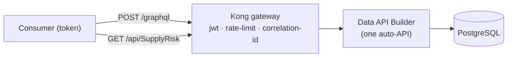

# 🔼 GraphQL through the gateway

[Home](../README.md) > [Documentation](README.md) > **GraphQL through the gateway**

> [!NOTE]
> **TL;DR** — Data API Builder auto-generates a **GraphQL** endpoint alongside REST, and
> Kong governs it on the same `/graphql` route (JWT + rate-limit + correlation id). This
> is the "multi-model" story, shown live — one auto-API, queried as
> REST *or* GraphQL, both governed by the gateway.

> ⚠️ Synthetic data only — see [`DISCLAIMER.md`](DISCLAIMER.md).

## 📑 Table of contents

- [Why it matters](#-why-it-matters)
- [Query it](#-query-it)
- [How it's wired](#-how-its-wired)

## ✨ Why it matters

The same Data API Builder instance exposes **REST + GraphQL + OpenAPI** with no
hand-written code. Consumers pick the shape that fits — REST/OData for tabular pulls,
GraphQL for shaped/nested reads — and **both go through the same governed gateway**.

## ⌨️ Query it

Get a token, then POST a GraphQL query to `/graphql` through Kong:

```bash
TOKEN=$(curl -s -X POST http://localhost:8081/token -H 'Content-Type: application/json' \
  -d '{"consumer":"analyst"}' | python -c "import sys,json;print(json.load(sys.stdin)['access_token'])")

curl -s -X POST http://localhost:8000/graphql \
  -H "Authorization: Bearer $TOKEN" -H 'Content-Type: application/json' \
  -d '{"query":"{ supplyRisks(filter: { program: { eq: \"Artemis-3\" }, risk_tier: { eq: \"High\" } }, orderBy: { risk_score: DESC }, first: 5) { items { maktx program risk_tier risk_score avg_delay_days } } }"}'
```

Returns the same High-tier Artemis-3 parts as the REST headline (e.g. *Heat-pipe radiator
panel*, *Space-grade DC-DC converter*, *Li-ion battery module* — risk 100), shaped as GraphQL.

> [!NOTE]
> DAB pluralizes GraphQL query fields (`supplyRisks`, `materials`, …), nests rows under
> `items`, and uses the **database column names** as GraphQL fields (`maktx`, `matnr`,
> `risk_score`, `avg_delay_days`, …). Open the GraphQL banana-cake-pop playground at the
> DAB `/graphql` path in development to explore the schema. No token → **401**, like REST.

## 🏗️ How it's wired



- The gateway's governed data route includes `/graphql` (see `services/gateway/kong.yml`),
  so GraphQL traffic gets the **same** JWT validation, per-consumer rate limit, and
  correlation id as REST.
- On Azure, APIM fronts the same DAB GraphQL endpoint (APIM has native GraphQL
  pass-through + schema support).
