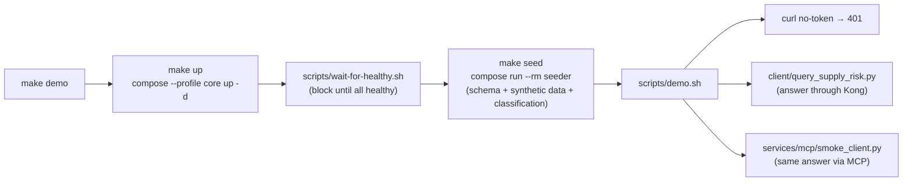
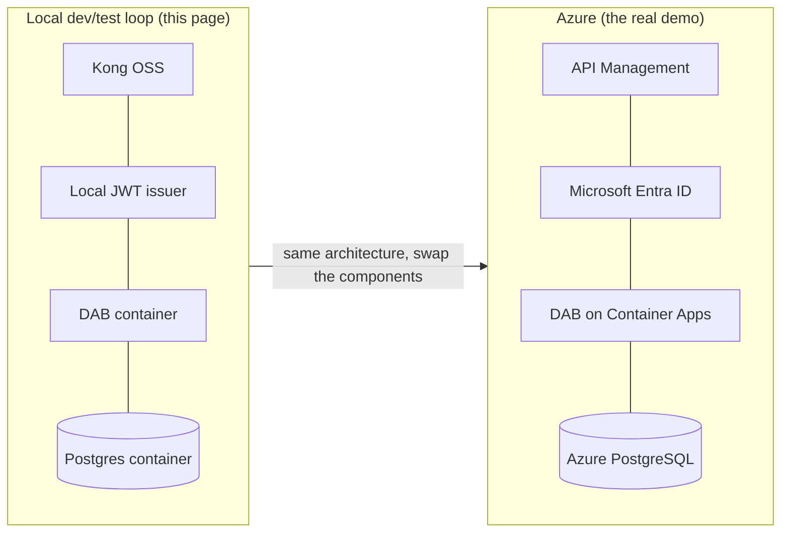

[Home](../README.md) > [Documentation](README.md) > **Local dev/test loop**

# 🧪 Local dev/test loop

> [!NOTE]
> **TL;DR** — Azure is the *real* demo; **local Docker is the dev/test loop** where you
> build and verify changes fast before you deploy them. From a clean clone:
> `cp .env.example .env && pip install -e . && make demo` brings the whole stack up
> healthy on your laptop and prints the Artemis-3 supply-risk answer **through the
> gateway**. When the change works locally, promote it to Azure — see
> [§ When you're ready: deploy to Azure](#-when-youre-ready-deploy-to-azure).

> [!WARNING]
> All data here is **synthetic** Artemis SAP-procurement data — not real NASA data. See
> [`DISCLAIMER.md`](DISCLAIMER.md).

---

## 📑 Table of Contents

- [Why this page exists (read first)](#-why-this-page-exists-read-first)
- [Where local fits in the Azure-first story](#-where-local-fits-in-the-azure-first-story)
- [Prerequisites](#-prerequisites)
- [The one command: `make demo`](#-the-one-command-make-demo)
- [What `make demo` actually does](#-what-make-demo-actually-does)
- [The make targets (your daily toolbox)](#-the-make-targets-your-daily-toolbox)
- [Ports: who listens where](#-ports-who-listens-where)
- [How to develop and test a change](#-how-to-develop-and-test-a-change)
- [Gotchas & troubleshooting](#-gotchas--troubleshooting)
- [When you're ready: deploy to Azure](#-when-youre-ready-deploy-to-azure)
- [Where to next](#-where-to-next)

---

## 🎯 Why this page exists (read first)

**The problem this page solves:** you have a change to make — a new data source, a tweak
to the gateway policy, a fix in the consumer client — and you need a *fast, safe, free*
place to build and prove it before it touches a cloud subscription. Spinning up Azure for
every edit is slow and costs money. So this project ships a **complete local mirror of the
Azure architecture** that runs entirely on your laptop with one command.

> **In plain terms:** local Docker is your workshop. You hammer on the change here until it
> works, then you ship the *same* architecture to Azure for the real, audience-facing demo.

**This is the secondary loop, on purpose.** The headline story of this proof-of-concept
(POC — a runnable demo that proves an idea, not a production system) is *"deploy to Azure
to show the full art of the possible."* Local Docker exists to make that story cheap to
develop. Every local component is the **open-source (OSS) analogue** of a managed Azure
service, so what you prove locally is exactly what you later deploy.

---

## 🗺️ Where local fits in the Azure-first story

Each container you run locally stands in for a managed Azure service. Build against the
local analogue; deploy to the managed service. Same shape, same API, same governance.

| Local OSS component (this page) | Azure managed equivalent (the real demo) | What it does |
|---|---|---|
| **Kong Gateway** (OSS, DB-less) | **Azure API Management (APIM)** | Authenticates, rate-limits, meters every call |
| **Identity** (local RS256 JWT issuer) | **Microsoft Entra ID** | Issues the bearer tokens consumers present |
| **Data API Builder (DAB)** container | **DAB on Azure Container Apps** | Auto-generates REST/GraphQL/OpenAPI over the database |
| **PostgreSQL 16** container | **Azure Database for PostgreSQL** | The system of record — the data that never moves |
| `data/classification.yml` | **Microsoft Purview** | Tags data sensitivity *before* exposure |
| **Prometheus + Grafana** | **Azure Monitor + Microsoft Sentinel** | Per-consumer traffic, latency, security signals |
| **Databricks medallion notebook** (local walkthrough) | **Azure Databricks + Unity Catalog** | Zero-move lakehouse (Bronze→Silver→Gold) |

> **Why this matters:** because the local stack is a true analogue, the work you do in this
> dev loop is not throwaway scaffolding — it is the rehearsal for the Azure deployment. A
> filter you debug against local DAB behaves the same against DAB on Container Apps; a Kong
> route you add maps one-to-one to an APIM API.

Acronyms defined as they appear; the full set lives in the project glossary and
[`ARCHITECTURE.md`](ARCHITECTURE.md).

---

## ✅ Prerequisites

You need surprisingly little. The whole stack is containerized, so the only things on your
host are Docker and a Python interpreter for the consumer client and the test suite.

| Requirement | Why you need it | Check it |
|---|---|---|
| **Docker** (Desktop or Engine) with Compose v2 | Runs every service (Postgres, DAB, Kong, identity, catalog, MCP, observability) | `docker compose version` |
| **Python 3.11+** on the host | Runs the consumer client (`client/query_supply_risk.py`), the MCP smoke test, and `pytest` | `python --version` |
| **`make`** | Convenience wrapper around the compose + script commands | `make --version` |
| **A POSIX shell (bash)** | The helper scripts (`scripts/demo.sh`, `scripts/wait-for-healthy.sh`) are bash | already present on macOS/Linux; on Windows use Git Bash or WSL |

> [!NOTE]
> No Azure account, no cloud credentials, and no real secrets are required for the local
> loop. The `.env` you create holds only local demo values (e.g. `POSTGRES_PASSWORD=artemis_local_demo`).

---

## ⌨️ The one command: `make demo`

From a clean clone:

```bash
cp .env.example .env       # local config (gitignored); no real secrets
pip install -e .           # host deps for the client + tests: httpx, pyjwt, pyyaml, mcp
make demo                  # up → wait-for-healthy → seed → client → MCP smoke → answer
```

**What you should see.** After the images build and the services report healthy, the demo
runner prints a four-step narrative. The shape of the output (synthetic numbers will vary
with the seed):

```text
============================================================
  NASA API-first zero-move demo - Artemis supply-chain
  (synthetic SAP procurement; data never leaves Postgres)
============================================================

[1/4] No-token call is rejected at the gateway (expect 401):
      GET /api/SupplyRisk (no token)  ->  HTTP 401

[2/4] Governed Python client answers the mission question THROUGH Kong:

Q: Which Critical, sole-source materials on Artemis-3 have an average delay > 30 days?

  TIER  RISK AVG_DLY  MATERIAL                     SUPPLIER
  ----- ---- -------  ---------------------------- ------------------------------
  HIGH   100    47.0  Heat-pipe radiator panel     Acme Thermal (CAGE 1A2B3)
  HIGH    96    41.5  Li-ion battery module        Orbital Power (CAGE 4C5D6)
  ...

  consumer=analyst  results=N  gateway correlation-id=<uuid>
  Data never left Postgres -- every row was brokered through Kong ...

[3/4] An MCP agent gets the SAME governed answer over the MCP protocol:
      ...

[4/4] Zero-move: Postgres + DAB sit on an internal network with no host ports; ...
```

**What each line proves:**

- **`[1/4]` HTTP 401** — a request with *no* token is rejected at the edge by Kong; it
  never reaches the database. This is the gateway doing authentication.
- **`[2/4]` the ranked table** — the governed Python client minted a token, called the
  `SupplyRisk` data product *through Kong*, and got real rows back. The
  **gateway correlation-id** at the bottom is the receipt proving the answer came through
  the gateway, not from a direct database connection.
- **`[3/4]` the MCP smoke** — an agent (via the Model Context Protocol, the open standard
  agents use to call tools) gets the *same* governed answer over a different protocol.
- **`[4/4]` zero-move** — a reminder that Postgres and DAB have *no host ports*; the proof
  is in `make test` (see [`ZERO-MOVE.md`](ZERO-MOVE.md)).

> [!TIP]
> First run is slow because Docker builds the service images. Subsequent runs reuse the
> build cache and come up in seconds. To make a *live presentation* fast, pre-pull the base
> images first: `docker compose --profile core --profile observability pull`.

---

## 🔍 What `make demo` actually does

`make demo` is just `up` then `seed` then the demo script — defined in the
[`Makefile`](../Makefile) as `demo: up seed`. Reading it top to bottom:



Step by step:

1. **`make up`** runs `docker compose --profile core up -d`, then blocks on
   `scripts/wait-for-healthy.sh`. The `core` profile starts Postgres, the seeder, DAB, the
   transportation (DOT) second source, identity, Kong, catalog, registry, and the MCP
   server. Compose uses `depends_on: condition: service_healthy`, so a service starts only
   after the one it relies on is *healthy* — not merely *running*.

   > **In plain terms:** "healthy" means the service answered its own healthcheck (e.g.
   > Kong responds to `kong health`, DAB serves `/api/openapi`). `wait-for-healthy.sh`
   > polls each of `postgres dab identity kong catalog mcp` and exits 0 only when all
   > report healthy, or fails after a timeout (default 180s).

2. **`make seed`** runs the seeder as a one-shot job (`compose run --rm seeder`). It
   creates the SAP-shaped schema, loads the **synthetic** Artemis data from
   `data/synthetic_data.py` (seeded by `SYNTHETIC_SEED=42` for reproducibility), and
   applies the sensitivity labels from `data/classification.yml`. The seeder runs on the
   `internal` network only — it can reach Postgres but is invisible to clients.

3. **`scripts/demo.sh`** runs the four-step narrative shown above: the no-token 401, the
   governed client, the MCP smoke, and the zero-move reminder. It resolves host ports from
   your `.env` (so it still works if you remapped them) and uses `127.0.0.1` rather than
   `localhost` to dodge IPv4/IPv6 ambiguity on some hosts.

---

## 🧰 The make targets (your daily toolbox)

Every target is defined in the [`Makefile`](../Makefile). Run `make help` to print this
list from the source of truth.

| Target | Command it runs | When you reach for it |
|---|---|---|
| `make up` | `compose --profile core up -d` + wait-for-healthy | Start the core stack without running the demo narrative |
| `make seed` | `compose run --rm seeder` | (Re)load the synthetic schema + data + classification |
| `make demo` | `up` → `seed` → `scripts/demo.sh` | The full end-to-end smoke; what you run after almost any change |
| `make test` | `python -m pytest -q` | The test suite: zero-move / auth (401/200/429) / discovery / supply-risk / no-fabric / federation / redaction |
| `make lint` | `ruff format --check .` + `ruff check .` | Before committing any Python change |
| `make obs` | `compose --profile observability up -d` | Start Prometheus + Grafana to watch per-consumer traffic |
| `make ui` | `compose --profile frontend up -d --build` | Start the browser catalog UI + "add a source" wizard |
| `make pricing` | `python tools/azure_pricing.py` | Print **live, dated** Azure Retail prices for the managed targets |
| `make diagram` | `python scripts/gen-architecture-diagram.py` | Rebuild the `docs/architecture.excalidraw` source (export the PNG from Excalidraw) |
| `make logs` | `compose logs -f` | Tail every service's logs while debugging |
| `make down` | `compose down -v` | Stop everything **and remove volumes** (fresh slate) |
| `make clean` | `rm -rf data/out output` | Remove generated runtime artifacts on the host |

> [!NOTE]
> The stack is split into **Compose profiles** so you only run what you need:
> `core` (the demo stack), `observability` (Prometheus + Grafana), and `frontend` (the
> Vite/React catalog UI). `make up` starts `core`; `make obs` adds `observability`;
> `make ui` adds `frontend`.

> [!TIP]
> A worked example of a target: `make pricing` calls the **public** Azure Retail Prices API
> (no login) and prints each figure with a dated source note like
> `Source: Azure Retail Prices API, list price (PAYG), usgovvirginia, retrieved 2026-06-18; ...`.
> No prices are ever hardcoded or invented — that is a hard project constraint.

---

## 🔌 Ports: who listens where

These are the **host** ports the stack publishes (defaults from `.env.example`). The
critical thing to internalize: **Postgres and DAB are deliberately *not* in this list** —
they live on an `internal` Docker network with **no host ports**, so the only path to the
data is through Kong. That is the zero-move guarantee, enforced by the network topology and
proven by `tests/test_zero_move.py`.

| Service | Host port (`.env` var) | URL | Notes |
|---|---|---|---|
| **Kong proxy** | `8000` (`KONG_PROXY_PORT`) | <http://localhost:8000> | The data path — every `/api/*` call goes here |
| **Kong Admin API** | `8001` (`KONG_ADMIN_PORT`) | <http://localhost:8001> | Admin/declarative-config endpoint |
| **Kong Manager (GUI)** | `8002` (`KONG_MANAGER_PORT`) | <http://localhost:8002> | Bundled admin GUI (read-only in DB-less mode) |
| **Identity (JWT issuer)** | `8081` (`ISSUER_PORT`) | <http://localhost:8081> | `POST /token` to mint a bearer token |
| **Catalog** | `8080` (`CATALOG_PORT`) | <http://localhost:8080> | `/catalog` lists data products + OpenAPI + classification |
| **Registry (control-plane)** | `8095` (`REGISTRY_PORT`) | <http://localhost:8095> | Powers the "add a source" wizard (hot-reloads Kong) |
| **MCP server** | `8090` (`MCP_PORT`) | <http://localhost:8090/mcp> | Agent consumer (`query_supply_risk` tool) |
| **Catalog UI** (`frontend` profile) | `5173` (`FRONTEND_PORT`) | <http://localhost:5173> | NASA-themed marketplace SPA |
| **Prometheus** (`observability`) | `9090` (`PROMETHEUS_PORT`) | <http://localhost:9090> | Scrapes Kong's metrics |
| **Grafana** (`observability`) | `3000` (`GRAFANA_PORT`) | <http://localhost:3000> | Per-consumer traffic dashboard (anonymous viewer on) |
| `internal` only — **no host port** | Postgres (`5432`), DAB (`5000`), DOT source (`8200`) | (unreachable from host) | This *is* zero-move |

> [!WARNING]
> **Port collisions are the #1 local-dev snag.** If something already binds `8000`, `8001`,
> `8080`, or `3000` on your machine, the stack will fail to start. Don't fight it — remap
> the host port in `.env` (e.g. `KONG_PROXY_PORT=18000`, `GRAFANA_PORT=13000`). Every
> service reads its port from `.env`, and `scripts/demo.sh` honors your overrides, so the
> demo keeps working after a remap.

---

## 🛠️ How to develop and test a change

The local loop is designed for tight iteration. The general rhythm is **edit → rebuild the
one service → re-run the targeted check → lint → full demo.** A few concrete recipes:

### Change a Python service (catalog, identity, MCP, registry, seeder)

These are FastAPI/Python services, each with its own `Dockerfile`. After editing, rebuild
just that service and bring it back up:

```bash
docker compose build catalog          # rebuild only the changed service
docker compose --profile core up -d   # recreate it (others are untouched)
make lint                             # ruff format-check + lint must be clean
make test                             # full suite
```

> **Why rebuild?** The services run from baked images, not bind-mounts, so a source edit is
> not picked up until you `build`. Rebuilding *one* service is fast and keeps the rest of the
> stack warm.

### Change the consumer client

`client/query_supply_risk.py` runs on your **host** (not in a container), so edits take
effect immediately — no rebuild:

```bash
python client/query_supply_risk.py --program Artemis-3 --min-delay 30
```

It reads `KONG_URL` and `IDENTITY_URL` from the environment (defaulting to
`http://localhost:8000` and `http://localhost:8081`), so if you remapped ports, export the
matching URLs first.

### Change the gateway policy or add a route

Kong runs **DB-less**: its config is a declarative `kong.yml` rendered by the identity
service into the shared `kong-config` volume. To add a *data source* at runtime, prefer the
**registry** path (the "add a source" wizard) which **hot-reloads Kong with no restart** —
see [`ADD-A-SOURCE.md`](ADD-A-SOURCE.md). For deeper template changes, edit the Kong
template the identity service renders, then recreate identity + Kong.

### Re-seed from scratch

If you changed the schema, the synthetic generator, or `classification.yml`:

```bash
make down      # remove volumes (drops the Postgres data)
make demo      # fresh up + seed + demo
```

### Before you commit

```bash
make lint && make test
```

CI (GitHub Actions, under `.github/`) runs the same lint + tests, including
`tests/test_no_fabric.py` (greps the repo to keep **Fabric / OneLake excluded** — they are
not available in Azure Gov) and
`tests/test_zero_move.py`. Keeping the local loop green keeps CI green.

> [!TIP]
> Use **`make logs`** in a second terminal while iterating — `docker compose logs -f`
> streams every service, so you see a 401, a rate-limit 429, or a stack trace the instant it
> happens.

---

## 🩹 Gotchas & troubleshooting

| Symptom | Likely cause | Fix |
|---|---|---|
| `make up` hangs then "timed out waiting for services to become healthy" | One service never went healthy (often a port clash or a build error) | `docker compose ps` to find the unhealthy one, then `docker compose logs <svc>` |
| Stack fails to start; "port is already allocated" | Another process owns `8000`/`8001`/`8080`/`3000` | Remap that port in `.env` (e.g. `KONG_PROXY_PORT=18000`) and retry |
| Client/curl returns **401** unexpectedly | Missing or expired bearer token | Mint a fresh token: `POST http://localhost:8081/token` with `{"consumer":"analyst"}` |
| Client/curl returns **429** | You hit the rate cap (`RATE_LIMIT_PER_MINUTE`, default 60/min) | Wait for the window, or raise the cap in `.env` for dev |
| OData `$filter` returns 400 from DAB | The `+`-encoding of spaces is rejected by DAB's OData parser | Encode spaces as `%20` (the client builds the URL this way on purpose) |
| Grafana shows no data | Observability profile not running, or no traffic yet | `make obs`, then re-run the client / a burst to generate metrics |
| Demo prints "MCP smoke skipped" | The MCP server isn't reachable | Check `docker compose ps mcp` and its logs; confirm `MCP_PORT` |
| Changes to a Python service have no effect | Service runs from a baked image | `docker compose build <svc>` then `up -d` |
| Bash scripts won't run on Windows | `cmd.exe`/PowerShell can't run `.sh` | Use Git Bash or WSL for `make demo` |

> [!NOTE]
> **Fresh slate when in doubt.** `make down` removes volumes (including the Postgres data),
> and the next `make demo` rebuilds and re-seeds cleanly. This resolves most "weird state"
> problems.

---

## 🚀 When you're ready: deploy to Azure

Once the change works locally, promote it to Azure for the **real, audience-facing demo** —
that is the primary story of this POC. Because each local component is the OSS analogue of a
managed Azure service, the architecture transfers directly; you swap the implementation, not
the design.



Start with these, in order:

1. **[`AZURE-DEPLOYMENT.md`](AZURE-DEPLOYMENT.md)** — the managed-target mapping and the
   reference Bicep under [`infra/azure/`](../infra/azure/). Read this to understand *what*
   each local box becomes in Azure and *why* (including the FedRAMP-High posture and the
   Azure-Gov managed-Unity-Catalog caveat).
2. **[`AZURE-LIVE-DEPLOYMENT.md`](AZURE-LIVE-DEPLOYMENT.md)** — the actual, tenant-locked
   deploy of the full stack to **Azure Container Apps** over a managed Postgres, with the
   front end locked to a tenant by Microsoft Entra. Reproduce it with
   `scripts/azure-deploy-fullstack.sh`.
3. **[`APIM-EDITION.md`](APIM-EDITION.md)** — the managed-gateway edition: deploy **Azure
   API Management**, publish the auto-API, and compare it side-by-side with the local Kong
   edition. See also [`APIM-CAPABILITIES.md`](APIM-CAPABILITIES.md) for what the managed
   gateway adds.

> [!TIP]
> Before deploying, run **`make pricing`** to print live, dated Azure Retail prices for the
> managed targets — so the cost conversation in the room is grounded in real numbers, never
> invented ones.

---

## 🧭 Where to next

- 🏗️ [`ARCHITECTURE.md`](ARCHITECTURE.md) — how the components fit together (zero-move flow,
  federation, control-plane).
- 🔒 [`ZERO-MOVE.md`](ZERO-MOVE.md) — how the no-host-ports isolation is *proven* by tests.
- 🛡️ [`SECURITY.md`](SECURITY.md) — the token flow and the OWASP API controls at the gateway.
- ➕ [`ADD-A-SOURCE.md`](ADD-A-SOURCE.md) — onboard a new data source through the wizard
  (hot-reload Kong, no restart).
- 🎬 [`DEMO-SCRIPT.md`](DEMO-SCRIPT.md) — the ~10-minute local presenter walkthrough.
- 🌐 [`AZURE-DEPLOYMENT.md`](AZURE-DEPLOYMENT.md) — the Azure-first deployment story.
- 🛰️ [`../client/README.md`](../client/README.md) — the governed consumer CLI in depth.
