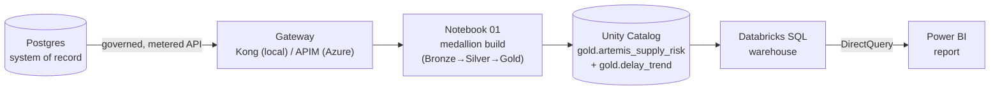

# 📊 Power BI — supply-risk report on the Databricks Gold mart

[Home](../README.md) > [Documentation](README.md) > **Power BI Guide**

> [!WARNING]
> **Illustrative reference · sample/synthetic data only · not an official NASA
> document.** Every name, number, and vendor below is machine-generated. See
> **[DISCLAIMER.md](DISCLAIMER.md)** before sharing or adapting.

> [!NOTE]
> **TL;DR** — Point **Power BI Desktop** at the **Azure Databricks SQL warehouse**
> using **DirectQuery**, then build a one-page *supply-risk* report on the curated
> table `<catalog>.gold.artemis_supply_risk`. That table (and a companion trend
> table, `gold.delay_trend`) is built by
> [`databricks/notebooks/01_zero_move_medallion.ipynb`](../databricks/notebooks/01_zero_move_medallion.ipynb).
> The reference workspace uses catalog **`main`**, which is also the
> notebook's default `catalog` widget.
>
> **Two ways to get the report:** (1) **as code** — open the ready-made
> **[Power BI Project (PBIP)](../powerbi/README.md)** at
> [`powerbi/ArtemisSupplyRisk.pbip`](../powerbi/ArtemisSupplyRisk.pbip) (semantic model in
> TMDL + the Copilot-built, NASA-themed report in PBIR), publish it with
> [`tools/publish_powerbi.py`](../tools/publish_powerbi.py) / pull updates with
> [`tools/export_powerbi.py`](../tools/export_powerbi.py), set 3 parameters, and go; or
> (2) **by hand** — follow the click-by-click build below from a blank PBIX. Both produce the
> same DirectQuery report on the Gold mart.

---

## 🎯 Why this guide exists (read first)

This is the **last hop** of the API-first, zero-move story, and it answers a
question every enterprise data leader eventually asks: *"That's a nice API and a
nice notebook — but can my analysts open it in the tool they already live in?"*
For most government and enterprise teams, that tool is **Power BI** (Microsoft's
business-intelligence product for dashboards and reports).

The whole point of the proof-of-concept is that **one governed data product** can
be consumed by *many* different kinds of client without ever copying the
system-of-record. By the time you reach this guide you have (or will have) seen
the same supply-risk answer served to:

- a **command-line client** (a Python script),
- an **AI agent** via **MCP** (Model Context Protocol — the open standard that lets
  an LLM call your tools; see [GLOSSARY.md](GLOSSARY.md#mcp--model-context-protocol)),
- the **marketplace web UI**, and now
- a **BI tool** — Power BI — over a live SQL connection.

> **In plain terms:** four very different audiences (a developer, an AI assistant,
> a business user clicking around a website, and an analyst building a chart) all
> read the *same* curated numbers, and none of them ever touches the source
> database directly. That is the "art of the possible" this PoC is built to show.

> **Why this matters:** in a real agency, "give the analysts the data" usually
> means *copying* it into yet another store — a new attack surface, a new copy to
> govern, a new thing that drifts out of date. This guide shows the opposite: the
> analyst's report reads the lakehouse **in place**, through governance, with the
> source of truth untouched.

---

## ☁️ Azure-first framing: what each piece *is* in the cloud

This PoC runs two ways. **Local Docker is the dev/test loop** — you run it on your
laptop to develop and test. **Azure is the real demo** — where you show the full
managed platform. Power BI is special because it is the **same Microsoft product in
both worlds**; what changes underneath it is the platform it reads from.

| In this guide you connect to… | …which in the *local* dev loop is… | …and in the *Azure* demo is… |
|---|---|---|
| **Databricks SQL warehouse** (the query engine Power BI talks to) | the medallion notebook run against a local/dev catalog | **Azure Databricks** SQL warehouse on managed **Unity Catalog** |
| **The Gold mart** (`gold.artemis_supply_risk`) | Delta tables the notebook writes | **Delta Lake** tables governed by **Unity Catalog** on **ADLS Gen2** |
| **Authentication** (how Power BI proves who it is) | a tenant sign-in | **Microsoft Entra ID** (Azure's identity service — formerly Azure AD) |
| **Sensitivity labels & row-level security** on the report | (out of scope locally) | **Microsoft Purview** labels + Power BI RLS |

> [!NOTE]
> **Where the data came from, in one breath:** Postgres (the system of record) →
> **Data API Builder** (auto REST/GraphQL) → **Kong / Azure API Management**
> (the governed, metered gateway) → the **medallion notebook** lands the
> gateway responses as Delta in **Unity Catalog** → **Databricks SQL** serves
> them → **Power BI** reads them over DirectQuery. Each arrow is a governance
> boundary, not a copy. The full vocabulary is in [GLOSSARY.md](GLOSSARY.md).



> [!NOTE]
> **Why this is still zero-move — the key idea for newcomers.** Power BI offers two
> ways to get data: **Import** (it copies a snapshot *into* the `.pbix` file) and
> **DirectQuery** (it leaves the data where it is and sends a live SQL query every
> time you click). We use **DirectQuery** so the data **never leaves the
> lakehouse** — Power BI queries the Delta mart *in place* through the SQL
> warehouse. Import mode would cache a copy in the file, quietly breaking the
> zero-move promise. Choose per your governance needs; for this demo, DirectQuery
> is the honest choice.

> [!IMPORTANT]
> **Why there is no `.pbix` in the repo.** A finished Power BI report (`.pbix`) is a
> GUI artifact — Microsoft does not let you generate it headlessly from a script,
> so it cannot live in version control the way the notebook and SQL do. This guide
> is therefore the **build spec** (connection + data model + measures + visuals) a
> presenter follows live in Power BI Desktop. *Everything upstream* — the Delta
> tables, Unity Catalog, and the exact SQL — **is** fully built and tested in this
> repo (see [`databricks/sql/dbsql_samples.sql`](../databricks/sql/dbsql_samples.sql)).

---

## 📑 Table of Contents

- [1. What you are connecting to](#1--what-you-are-connecting-to-the-gold-mart)
- [2. Connect Power BI to the warehouse](#2--connect-power-bi-to-the-warehouse)
- [3. Measures (DAX)](#3--measures-dax)
- [4. Report layout (one page)](#4--report-layout-one-page-artemis-supply-chain-risk)
- [5. The delay-trend line chart](#5--the-delay-trend-line-chart)
- [6. Publish (optional)](#6--publish-optional)
- [7. The narrative for the customer](#7--the-narrative-for-the-customer)
- [8. Gotchas & troubleshooting](#8--gotchas--troubleshooting)
- [9. Where to next](#9--where-to-next)

---

## 1. 🗃️ What you are connecting to: the Gold mart

Before you click anything, understand the table you'll be reporting on. In a
**medallion architecture** (the Bronze → Silver → Gold refinement pattern used by
the notebook), **Gold** is the business-ready layer — already joined, cleaned, and
shaped for analytics, so a report author never has to write a join.

The notebook builds **two** Gold tables. You will mainly use the first; the second
powers the trend chart in [section 5](#5--the-delay-trend-line-chart).

### `gold.artemis_supply_risk` — one row per material, enriched with its supplier and risk

This is the headline mart: each row is a material on an Artemis program, joined to
its supplier and its computed risk. These are the exact columns the notebook
produces (verified against
[`01_zero_move_medallion.ipynb`](../databricks/notebooks/01_zero_move_medallion.ipynb),
the *Gold* cell):

| Column | Type | Meaning |
|---|---|---|
| `program` | text | Mission program (e.g. `Artemis-3`, `Gateway`, `Moon-Base`) |
| `material_id` | text | Material/part identifier |
| `material_name` | text | Human-readable part name (e.g. *Heat-pipe radiator panel*) |
| `criticality` | text | `Critical` / `Essential` / `Routine` |
| `sole_source` | boolean | `true` if only one supplier can provide it |
| `avg_delay_days` | number | Average slip (days late) across this material's orders |
| `risk_score` | integer | Computed risk, higher = worse |
| `risk_tier` | text | `High` / `Medium` / `Low` bucket of the score |
| `vendor_name` | text | The supplier's name |
| `cage_code` | text | The supplier's **CAGE** code (Commercial And Government Entity — the unique ID a vendor has in the U.S. federal supply system) |
| `past_perf_score` | number | The supplier's historical performance score |
| `total_committed_usd` | number | Dollars committed across this material's purchase orders |
| `po_count` | integer | Number of purchase orders for this material |
| `pad_anomalies` | integer | Count of launch-pad anomalies tied to this material |

> [!TIP]
> **Don't trust this table from memory — verify it.** Open a Databricks SQL
> warehouse and run query #1 from
> [`databricks/sql/dbsql_samples.sql`](../databricks/sql/dbsql_samples.sql). If it
> returns rows, the mart exists and Power BI will see the same columns. That file is
> the source of truth for the queries the report mirrors.

### `gold.delay_trend` — one row per program per month (the time series)

A small, date-keyed companion table for trend visuals. Columns (verified against
the notebook's *delay trend* cell):

| Column | Meaning |
|---|---|
| `program` | Mission program |
| `order_month` | Month bucket (`date_trunc('MONTH', order_date)`) |
| `po_count` | Purchase orders placed that month |
| `avg_delay_days` | Average slip that month (rounded to 1 decimal) |
| `slipped_pos` | Count of orders slipping more than 30 days |
| `committed_usd` | Dollars committed that month |

---

## 2. 🔌 Connect Power BI to the warehouse

In Power BI Desktop choose **Get Data → Azure Databricks** and supply the
settings below. The hostname and HTTP path come from the SQL warehouse's
**Connection details** tab in the Databricks workspace; the values shown are the
reference **Serverless Starter Warehouse**.

> [!WARNING]
> These are the live reference-workspace values. If you stood up your **own**
> warehouse, replace them with *your* Connection details — copying these will fail
> to authenticate against a workspace you don't own.

| Setting | Value | What it is |
|---|---|---|
| **Server hostname** | `adb-XXXXXXXXXXXXXXXX.18.azuredatabricks.net` | The workspace's address |
| **HTTP path** | `/sql/1.0/warehouses/973dba4787484119` | Which SQL warehouse to use |
| **Authentication** | **Microsoft Entra ID** (tenant account — same tenant lock as the rest of the demo) | How you prove who you are |
| **Data Connectivity mode** | **DirectQuery** (recommended) or Import | Live query vs. cached copy — see the zero-move note above |

Then in the **Navigator** that appears:

1. Expand your **catalog** (reference: **`main`**; or whatever you
   passed to the notebook's `catalog` widget — the default is `main`).
2. Expand the **`gold`** schema.
3. Tick **`artemis_supply_risk`** → **Load**.

> [!TIP]
> **Also load the trend table.** While you're in the Navigator, tick
> **`gold.delay_trend`** too. You'll need it for the line chart in
> [section 5](#5--the-delay-trend-line-chart). The two tables share `program`, so
> a slicer on one can filter both once you relate them (or just slice each
> independently for a quick build).

**What just happened:** Power BI now has a live, governed connection to the
lakehouse. In DirectQuery mode it has copied *nothing* — it only stored the table
*shape*. Every visual you build will fire a SQL query at the warehouse on demand,
and Unity Catalog will enforce who's allowed to see what.

---

## 3. 📐 Measures (DAX)

A **measure** is a reusable calculation written in **DAX** (Data Analysis
Expressions — Power BI's formula language, loosely "Excel formulas for whole
tables"). Unlike a column, a measure is computed *live* in the context of whatever
you've filtered or grouped by, which is exactly what you want for KPI cards.

Create each of these via **Modeling → New measure** (paste one block per measure):

```dax
High Risk Materials =
CALCULATE(
    COUNTROWS('artemis_supply_risk'),
    'artemis_supply_risk'[risk_tier] = "High"
)

Sole-Source Exposure ($) =
CALCULATE(
    SUM('artemis_supply_risk'[total_committed_usd]),
    'artemis_supply_risk'[sole_source] = TRUE
)

Avg Delay (days) =
AVERAGE('artemis_supply_risk'[avg_delay_days])

Pad Anomalies =
SUM('artemis_supply_risk'[pad_anomalies])

Critical Slips >30d =
CALCULATE(
    COUNTROWS('artemis_supply_risk'),
    'artemis_supply_risk'[criticality] = "Critical",
    'artemis_supply_risk'[sole_source] = TRUE,
    'artemis_supply_risk'[avg_delay_days] > 30
)
```

One more measure lives on the **`delay_trend`** table — it powers the line chart in
[section 5](#5--the-delay-trend-line-chart):

```dax
Avg Delay Trend =
AVERAGE('delay_trend'[avg_delay_days])
```

> **In plain terms, measure by measure:**
> - **High Risk Materials** counts the rows whose `risk_tier` is `High`. `CALCULATE`
>   re-runs the count *with an extra filter applied* — that's its whole job.
> - **Sole-Source Exposure ($)** sums committed dollars but only for materials with a
>   single supplier — the money most exposed to a single point of failure.
> - **Avg Delay (days)** averages the per-material slip.
> - **Pad Anomalies** totals launch-pad anomalies.
> - **Critical Slips >30d** is the headline risk: parts that are *Critical*, *sole-source*,
>   **and** averaging more than 30 days late — the exact condition the CLI/MCP/UI flag,
>   and the same `WHERE` clause as query #1 in `dbsql_samples.sql`.
> - **Avg Delay Trend** re-states `delay_trend[avg_delay_days]` *as a measure* so it can
>   sit on a chart's value axis (see the gotcha below).

> [!WARNING]
> **Dollars are redacted in the zero-move (gateway) path — by design.** When the
> medallion notebook sources **through the gateway** (`SOURCE_MODE=gateway`), the
> `netwr`/`netpr` columns are **redacted** at the edge, so `gold.artemis_supply_risk.total_committed_usd`
> lands as **0**. That means **`Sole-Source Exposure ($)` evaluates to `$0`/blank** and
> any visual bound to it (KPI card or treemap) renders empty. This is the field-level
> redaction story working — not a bug. For a populated visual, group by a **non-redacted**
> dimension instead (the shipped report uses **Material Count by `criticality`**), or run
> the notebook in **`postgres` mode** (full-fidelity JDBC read) when you specifically want
> live dollars in BI.

> [!TIP]
> **`delay_trend` columns are non-summarizable.** The exported model marks `delay_trend`'s
> numeric columns `summarizeBy: none`, so dropping `avg_delay_days` straight onto a chart
> sends it to the **Legend**, not the Y-axis. Use the **`Avg Delay Trend`** measure above
> (a measure always lands on the value axis), or set the column's **Summarize by → Average**.

> [!TIP]
> The table name in single quotes (`'artemis_supply_risk'`) is how Power BI named
> the table on load. If you renamed it in the model, update the quotes to match or
> the measures will error with "cannot find table".

---

## 4. 🖥️ Report layout (one page, "Artemis Supply-Chain Risk")

Build a single page that tells the supply-risk story top to bottom. Each visual
maps to a query you can sanity-check in `dbsql_samples.sql`.

| Visual | Field(s) | Purpose | Mirrors SQL |
|---|---|---|---|
| **KPI cards** | `High Risk Materials`, `Critical Slips >30d` (add `Pad Anomalies`, and `Sole-Source Exposure ($)` only in `postgres` mode — see redaction note above) | The headline numbers | #1, #3, #4 |
| **Slicer** | `program` (default **Artemis-3**) | Mission filter | — |
| **Stacked bar** | axis `program`, legend `risk_tier`, value `COUNTROWS` | Risk distribution by program | #2 |
| **Table** | `material_name`, `vendor_name`, `risk_tier`, `risk_score`, `avg_delay_days`, `total_committed_usd` | The ranked at-risk parts + suppliers | #1 |
| **Treemap** | group `criticality`, value `Material Count` | Risk mix by criticality (redaction-safe; the `Sole-Source Exposure ($)` treemap is empty in gateway mode) | #2 |
| **Line chart** | see [section 5](#5--the-delay-trend-line-chart) | Delay/slip trend over time | #5 |

**Conditional formatting:** color the `risk_tier` field — **High = red `#FC3D21`**,
**Medium = amber**, **Low = green** — to match the marketplace UI palette so a
viewer's eye carries the same colour language across every consumer of the data
product.

> [!NOTE]
> **Suggested layout:** the four KPI cards in a strip across the top; the slicer
> top-right; the stacked bar and treemap side by side in the middle band; the
> ranked table along the bottom; the line chart full-width beneath it (or on a
> second page if it crowds the canvas).

---

## 5. 📈 The delay-trend line chart

This visual reads the **`gold.delay_trend`** table and shows how slip has moved
over time — the question a program manager asks after seeing the headline: *"is it
getting better or worse?"*

**Visual:** **Line chart** (Power BI's built-in time-series visual).

| Well | Field | Why |
|---|---|---|
| **X-axis** | `delay_trend[order_month]` | The month buckets the notebook pre-aggregated |
| **Y-axis (primary)** | **`Avg Delay Trend`** (measure) | The trend line everyone watches — use the measure, not the raw column (see the summarization gotcha in [section 3](#3--measures-dax)) |
| **Secondary line (optional)** | `delay_trend[slipped_pos]` | How many orders slipped >30 days that month |
| **Legend** | `delay_trend[program]` | One line per mission program |
| **Filter / slicer** | `program` (default **Artemis-3**) | Focus on one program, or compare all |

> **In plain terms:** the notebook already grouped by program and month
> (`GROUP BY program, date_trunc('MONTH', order_date)`), so there's one row per
> program-month. The **`Avg Delay Trend`** measure (`AVERAGE(delay_trend[avg_delay_days])`)
> just surfaces that pre-aggregated value on the Y-axis — over a single row per point it
> *is* the value, which keeps the DirectQuery fast and the chart honest. (A bare
> `summarizeBy: none` column would otherwise refuse the value axis and jump to the Legend.)

> [!TIP]
> Sort the X-axis **ascending by `order_month`** (it's a date, so it sorts
> chronologically automatically) and turn on **data labels** for the most recent
> point so the "where we are now" number is always visible. To validate the values,
> run query #5 in
> [`databricks/sql/dbsql_samples.sql`](../databricks/sql/dbsql_samples.sql) — the
> chart should match it row for row.

> [!WARNING]
> If the line chart is empty, you almost certainly didn't load `gold.delay_trend`
> in [section 2](#2--connect-power-bi-to-the-warehouse). Re-open **Get Data**, or
> **Transform data → New Source**, and tick it.

---

## 6. 🚀 Publish (optional)

To share the report beyond your laptop, **Publish** it to a **Power BI Service**
workspace in the same tenant. After publishing:

1. In the dataset's **Settings**, set the **Databricks data source credentials**
   to a **Microsoft Entra ID** account (the same tenant lock as the rest of the
   demo) so the Service can re-run the DirectQuery on viewers' behalf.
2. Apply **Row-level security (RLS)** if different audiences should see different
   programs.
3. Apply **Microsoft Purview sensitivity labels** to extend the
   *classify-before-exposure* discipline all the way to the report layer.

> **Why this matters:** governance shouldn't stop at the API. Purview labels + RLS
> mean the report obeys the *same* classification rules the gateway enforced
> upstream — the data product stays governed end to end, from system-of-record to
> dashboard.

---

## 7. 🗣️ The narrative for the customer

> "The same supply-risk answer the gateway serves — **`Heat-pipe radiator panel`**,
> risk **100**, **54-day** average slip — now lands in the lakehouse via a governed,
> metered read, is curated in **Unity Catalog**, and is presented in **Power BI**
> over **DirectQuery**. One data product, consumed by a **CLI**, an **MCP agent**,
> the **marketplace UI**, **and** the **analytics platform** — without copying the
> system of record."

> [!NOTE]
> *Heat-pipe radiator panel* is a real material in the synthetic dataset (see
> [`data/sample/artemis_materials.csv`](../data/sample/artemis_materials.csv)); the
> exact risk score and slip you demo come from the live mart for the program you've
> sliced to. Treat the `100 / 54-day` figures as the illustrative headline, not a
> guaranteed constant — run query #1 to read the current top row before you present.

---

## 8. 🛟 Gotchas & troubleshooting

| Symptom | Likely cause | Fix |
|---|---|---|
| **Authentication fails / "AADSTS" error** | Signed in with the wrong account, or not in the demo tenant | Use the same **Entra ID** tenant account as the rest of the demo; the warehouse is tenant-locked |
| **Navigator doesn't show the `gold` schema** | You expanded the wrong catalog | Expand the catalog you passed to the notebook's `catalog` widget (reference + default: `main`) |
| **`gold.artemis_supply_risk` is missing entirely** | The medallion notebook hasn't been run against this catalog | Run [`01_zero_move_medallion.ipynb`](../databricks/notebooks/01_zero_move_medallion.ipynb); then re-verify with query #1 in `dbsql_samples.sql` |
| **Measures error "cannot find table"** | Table renamed on load; the DAX still says `'artemis_supply_risk'` | Match the single-quoted name in each measure to the table's name in your model |
| **Line chart empty** | `gold.delay_trend` not loaded | Re-open Get Data and tick it ([section 2](#2--connect-power-bi-to-the-warehouse)) |
| **Visuals slow** | DirectQuery firing many queries; warehouse cold | Ensure the **Serverless** warehouse is started; reduce visuals per page; or use Import for a static demo (loses zero-move) |
| **Numbers don't match the SQL** | A stale Import-mode cache, or a different catalog | Confirm **DirectQuery**, confirm the catalog, and re-run the matching query in `dbsql_samples.sql` |

---

## 9. 🧭 Where to next

| Go to | Why |
|---|---|
| [DATABRICKS-WALKTHROUGH.md](DATABRICKS-WALKTHROUGH.md) | How the Gold mart is actually built — the zero-move medallion (Bronze→Silver→Gold) in Unity Catalog |
| [`databricks/sql/dbsql_samples.sql`](../databricks/sql/dbsql_samples.sql) | The exact SQL each visual mirrors — run these to validate the report |
| [ZERO-MOVE.md](ZERO-MOVE.md) | Why "the data never moves" is real, not just claimed |
| [AZURE-DEPLOYMENT.md](AZURE-DEPLOYMENT.md) | The managed-target story: APIM, Entra, Purview, and Azure Databricks + Unity Catalog |
| [GLOSSARY.md](GLOSSARY.md) | Every term and acronym used above, defined |
| [DISCLAIMER.md](DISCLAIMER.md) | Synthetic-data notice — read before sharing |
