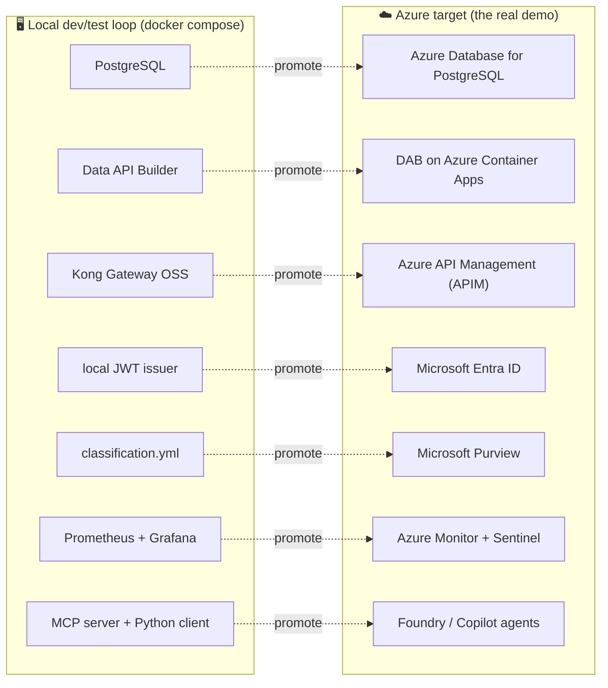
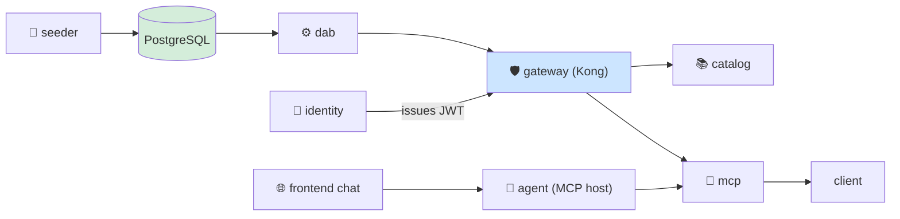

# 📖 The Teaching Manual — Home & Guided Learning Paths

[Home](../README.md) > **Documentation**

> [!WARNING]
> **Illustrative reference · sample/synthetic data only · not an official NASA
> document.** Every number, vendor, and material in this repo is generated by a
> seeded script. Read **[DISCLAIMER.md](DISCLAIMER.md)** before sharing or adapting
> anything here.

This is the front door to the manual. It exists for one reason: **the repo has a
lot of moving parts, and reading the docs in the wrong order is the fastest way to
get lost.** Below you'll find (1) a one-paragraph orientation, (2) four *guided
learning paths* — one each for an executive, an architect, a first-time developer,
and a demo presenter — and (3) a complete catalog of every document so you can
always find your way back.

> [!NOTE]
> **TL;DR.** This repo is an enterprise proof-of-concept (POC) for an *API-first,
> zero-move data marketplace*. The **primary story is Azure**: "here is the full art
> of the possible when you deploy this to the cloud." The local `docker compose up`
> stack is the **develop-and-test loop** — every open-source piece you run locally is
> a stand-in for an Azure managed service. New here? Jump to your
> [learning path](#-pick-your-path-choose-your-role) and follow it top to bottom.

---

## 📑 Table of contents

- [What this POC is (in plain terms)](#-what-this-poc-is-in-plain-terms)
- [New here? Start with the concept primers](#-new-here-start-with-the-concept-primers)
- [The Azure-first idea, and how local maps to it](#️-the-azure-first-idea-and-how-local-maps-to-it)
- [Pick your path (choose your role)](#-pick-your-path-choose-your-role)
  - [🧭 Executive / decision-maker](#-path-1--executive--decision-maker)
  - [🏛️ Architect](#️-path-2--architect)
  - [💻 First-time developer](#-path-3--first-time-developer)
  - [🎬 Demo presenter](#-path-4--demo-presenter)
- [Full document catalog](#-full-document-catalog)
- [Service-by-service reference](#-service-by-service-reference)
- [How the manual is organized (conventions)](#-how-the-manual-is-organized-conventions)
- [Gotchas & where to next](#-gotchas--where-to-next)

---

## 🛰️ What this POC is (in plain terms)

Large organizations sit on valuable data locked inside *systems of record* (SoR) —
databases that run the business and that nobody is allowed to copy carelessly. The
moment you copy that data into a second place to "make it usable," you create a
governance, security, and freshness problem: now there are two copies, two access
controls, and two things to keep in sync.

**The API-first, zero-move pattern solves this by never moving the data.** Instead of
copying the database, you put a thin, governed *door* in front of it:

- the data stays in its system of record (here, **PostgreSQL** — an open-source
  relational database);
- a tool auto-generates a web API (**REST** and **GraphQL**) over that database so you
  don't hand-write one;
- an **API gateway** sits in front of that API and enforces who can call it, how often,
  and logs every call;
- a **catalog** makes the data product *discoverable* — you can find it, see who owns
  it, and read its contract without asking around;
- a consumer (a script, or an **AI agent**) answers a real business question by calling
  *through the gateway* — never touching the database directly.

> **In plain terms:** the data never leaves home. Everyone knocks on the same front
> door, the door checks their ID, and the door keeps the visitor log. That door is the
> gateway.

**Why this matters:** for the enterprise story this POC models — a NASA-style
mission-data marketplace — "zero-move" is not a slogan. It is the difference between a
defensible, auditable, single-source-of-truth architecture and a sprawl of copies
that compliance can't reason about. This repo *proves* zero-move with an automated
test, not just a diagram. See **[ZERO-MOVE.md](ZERO-MOVE.md)**.

> **Acronyms, defined once:** **SoR** = system of record (the authoritative database).
> **API** = application programming interface (a contract other programs call).
> **REST / GraphQL** = two standard web-API styles. **JWT** = JSON Web Token, a signed
> credential a caller presents to prove identity. **MCP** = Model Context Protocol, the
> open standard that lets an AI agent call a tool. **DAB** = Data API Builder (the
> Microsoft tool that auto-generates the API). **APIM** = Azure API Management (the
> managed gateway). Every term is also defined in the
> **[Glossary](GLOSSARY.md)**, and explained from first principles in the
> **[concept primers](concepts/README.md)**.

---

## 🎓 New here? Start with the concept primers

If the demo feels like a wall of unfamiliar acronyms — *gateway, JWT, DAB, lakehouse* —
read the **[concept primers](concepts/README.md)** before anything else. They are the
*textbook* to this manual's *operator's guide*: each one teaches a single idea from
first principles, defines its terms, shows a worked example, and points to both the
code and the Azure service it maps to. They assume **no** prior exposure to API
gateways, OAuth2, Data API Builder, or Azure.

| # | Primer | Teaches (one line) |
|---|---|---|
| 1 | [The Big Idea](concepts/01-the-big-idea.md) | API-first + zero-move + data marketplace, from first principles |
| 2 | [API Gateways](concepts/02-api-gateways.md) | What a gateway is and its jobs (auth, rate-limit, meter, route); Kong → APIM |
| 3 | [Data API Builder](concepts/03-data-api-builder.md) | Auto-generating REST + GraphQL + OpenAPI over a database with no code |
| 4 | [Identity (JWT / OAuth2)](concepts/04-identity-jwt-oauth.md) | Bearer tokens, RS256, JWKS, and the mint → present → validate handshake |
| 5 | [The Lakehouse](concepts/05-lakehouse-databricks.md) | Delta Lake, the medallion, Unity Catalog, Delta Sharing on Azure Databricks |
| 6 | [Observability & Security](concepts/06-observability-and-security.md) | Metrics/logs/traces + defense-in-depth (identity, OWASP, classification, redaction) |
| 7 | [MCP & Grounded Agents](concepts/07-mcp-and-agents.md) | What an agent + the open MCP standard are; the grounded mission agent that answers *through* the gateway and cites its source; Copilot/Foundry over MCP |

> [!TIP]
> Two companions to keep open while you read anything in this manual: the
> **[Glossary](GLOSSARY.md)** (every term and SAP field name defined in one place) and
> the **[API contract reference](API.md)** (the exact request/response shapes,
> token flow, and `401/200/429/400` status contract).

---

## ☁️ The Azure-first idea, and how local maps to it

This is an **enterprise POC**, and its headline is *"deploy to Azure to show the full
art of the possible."* The local Docker stack exists so engineers can build and test
on a laptop with zero cloud cost — but the real demo, and the real architecture, is
the Azure column on the right.

Every open-source component you run locally is the faithful analogue of an Azure
managed service. That is deliberate: the architecture is identical, so promoting the
POC to Azure is a *swap*, not a rewrite.

| You run locally… | …because in Azure it becomes | Why the swap is clean |
|---|---|---|
| **PostgreSQL** (system of record) | **Azure Database for PostgreSQL Flexible Server** / Azure SQL | same SQL engine; data still never leaves it |
| **Microsoft Data API Builder** (DAB) | **DAB on Azure Container Apps** (or Dataverse Web API) | identical config (`dab-config.json`); just hosted |
| **Kong Gateway OSS** | **Azure API Management** (APIM) | same JWT / rate-limit / metering policies, managed |
| **local JWT issuer** (`issuer.py`) | **Microsoft Entra ID** | same bearer-token validation pattern |
| **`classification.yml`** | **Microsoft Purview** | classify *before* exposure, now centrally governed |
| **Prometheus + Grafana** | **Azure Monitor + Microsoft Sentinel** | same per-consumer metrics, now SIEM-integrated |
| **MCP server + Python client** | **Foundry / Copilot agents over MCP** | same open protocol; the agent reaches the governed door |
| **Databricks medallion notebook** | **Azure Databricks + Unity Catalog + Delta Sharing** | open formats (Delta) keep it portable |

> [!NOTE]
> **Why not Microsoft Fabric / OneLake?** They are deliberately excluded — they are not
> available in Azure Government / GCC, the deployment boundary this POC respects. The
> managed data-platform answer here is **Azure Databricks + Unity Catalog + Delta Lake
> + ADLS Gen2**, in commercial Azure at FedRAMP High. Full reasoning in
> **[AZURE-DEPLOYMENT.md](AZURE-DEPLOYMENT.md)**.

The deepest treatment of this mapping — including the federation and control-plane
layers — lives in **[ARCHITECTURE.md](ARCHITECTURE.md)**.

---

## 🧭 Pick your path (choose your role)

Each path is an **ordered reading list**: *start here → next → next*. Read them in
order; each step assumes the one before it. Times are rough reading estimates.

### 🧭 Path 1 — Executive / decision-maker

> **Your question:** *"What is this, why does it matter, and what would it cost to do
> for real in Azure?"* You do not need to run anything.

| Step | Read | Why, and what you'll take away |
|---|---|---|
| **Start here** | [`../README.md`](../README.md) | The one-paragraph frame ("one platform for data, APIs, and code; Microsoft as the interoperability layer, not the one AI"), the nine things it demonstrates, and the architecture picture. ~5 min. |
| **If the pattern is new** | [01 The Big Idea](concepts/01-the-big-idea.md) | The "why" in plain terms — what API-first + zero-move buys an enterprise, with the door analogy. ~8 min. |
| **Next** | [ARCHITECTURE.md](ARCHITECTURE.md) — read the intro + the Azure↔OSS mapping table only | See, at a glance, how each local piece maps to an Azure managed service. Skip the deep network sections. ~5 min. |
| **Next** | [AZURE-DEPLOYMENT.md](AZURE-DEPLOYMENT.md) | The managed-target story: APIM, Entra, Purview, Databricks, and the FedRAMP-High / Azure-Government posture (why Fabric/OneLake are excluded, and what replaces them). ~10 min. |
| **Next** | [APIM-CAPABILITIES.md](APIM-CAPABILITIES.md) | What you *gain* by moving from the open-source gateway to managed Azure API Management — the "art of the possible" upgrade. ~5 min. |
| **Then** | Run `make pricing` (or skim [AZURE-DEPLOYMENT.md](AZURE-DEPLOYMENT.md)'s pricing note) | See **live, dated** Azure list prices for the target services — pulled from the public Azure Retail Prices API, never invented. ~2 min. |
| **Finish with** | [DEMO-DAY.md](DEMO-DAY.md) | The end-to-end runbook, so you know what a live demo would show a stakeholder. ~10 min. |

> [!TIP]
> If you only read two documents, read the root [`../README.md`](../README.md) and
> [AZURE-DEPLOYMENT.md](AZURE-DEPLOYMENT.md).

---

### 🏛️ Path 2 — Architect

> **Your question:** *"Is the pattern sound, is zero-move actually enforced, and how
> does it promote to Azure Government?"* You want depth and proof.

| Step | Read | Why, and what you'll take away |
|---|---|---|
| **Start here** | [ARCHITECTURE.md](ARCHITECTURE.md) | The full picture: components, the zero-move data flow, the Azure↔OSS mapping, and the federation + control-plane design. This is your backbone. ~20 min. |
| **Next** | [ZERO-MOVE.md](ZERO-MOVE.md) | How "the data never leaves" is *proven*, not asserted — Docker network isolation plus an automated test (`tests/test_zero_move.py`) that confirms Postgres/DAB are unreachable from the client network. ~10 min. |
| **Next** | [SECURITY.md](SECURITY.md) | The token flow (JWT/OAuth2) and which OWASP API Top-10 controls are enforced *at the gateway* — the security model end to end. ~15 min. |
| **Next** | [ADD-A-SOURCE.md](ADD-A-SOURCE.md) | How a *second* data source is onboarded through the same gateway live, with no restart — the federation / API-Center story. ~10 min. |
| **Next** | [GRAPHQL.md](GRAPHQL.md) | The same auto-API served as GraphQL through the gateway — the multi-model angle. ~5 min. |
| **Next** | [07 MCP & Grounded Agents](concepts/07-mcp-and-agents.md) | The "can my AI assistant query this safely?" answer: the grounded mission agent is an **MCP host** that reaches data *only* through Kong (UI → agent → MCP tools → Kong → DAB), so rate-limit, metering, and redaction all still hold; every answer **cites its source** (the MCP tool + gateway correlation id) and off-topic questions are refused. The same MCP tools Copilot / Foundry would call. ~12 min. |
| **Then** | [AZURE-DEPLOYMENT.md](AZURE-DEPLOYMENT.md) → [AZURE-LIVE-DEPLOYMENT.md](AZURE-LIVE-DEPLOYMENT.md) | The reference Bicep target, then the *actually deployed* Container Apps + Entra deployment. ~20 min. |
| **Next** | [APIM-EDITION.md](APIM-EDITION.md) + [APIM-CAPABILITIES.md](APIM-CAPABILITIES.md) | The managed-gateway edition (APIM + Developer Portal) and what it adds over Kong. ~15 min. |
| **Finish with** | [DATABRICKS-WALKTHROUGH.md](DATABRICKS-WALKTHROUGH.md) → [POWERBI-GUIDE.md](POWERBI-GUIDE.md) | The lakehouse extension: zero-move medallion (Bronze→Silver→Gold Delta in Unity Catalog) → Databricks SQL → Power BI. ~20 min. |

> **Why this matters:** an architect's job is to verify the claims. This path is
> ordered so each document hands you the evidence for the next — by the end you can
> defend zero-move, the security boundary, federation, and the one-swap Azure path.

---

### 💻 Path 3 — First-time developer

> **Your question:** *"How do I run this on my laptop and understand the code?"* You'll
> have the stack up before you finish reading.

Prerequisites: only **Docker** and **Python 3.11+** on the host. Nothing else.

| Step | Read / do | Why, and what you'll learn |
|---|---|---|
| **Read first (if the acronyms are new)** | [Concept primers](concepts/README.md) — at least [01 The Big Idea](concepts/01-the-big-idea.md) and [02 API Gateways](concepts/02-api-gateways.md) | The vocabulary and the mental model, from zero. Skip if you already know what a gateway and a JWT are. ~15 min. |
| **Start here** | [`../README.md`](../README.md) — the **Quickstart** section | The three commands that bring the whole stack up. Run them. ~10 min. |
| **Reference while running** | [LOCAL-DEV.md](LOCAL-DEV.md) | The dev/test loop in depth: `make` targets, compose profiles, the port map, and the edit→rebuild→test rhythm. ~10 min. |
| **Worked example** | In a terminal: `cp .env.example .env` → `pip install -e .` → `make demo` | `make demo` boots every service, seeds the synthetic data, calls *through the gateway*, and prints the Artemis-3 supply-risk answer with a gateway **correlation id**. Seeing that id is your proof the call went through Kong, not around it. ~5 min. |
| **Next** | [ARCHITECTURE.md](ARCHITECTURE.md) | Now that it's running, learn what each container *is* and how a request flows left to right. ~20 min. |
| **Next** | [data/README.md](../data/README.md) | The synthetic Artemis dataset (vendors, materials, purchase orders, supply risk) and its SAP-shaped fields — the data you just queried. ~10 min. |
| **Next** | [Service reference](#-service-by-service-reference) → start with [seeder](../services/seeder/README.md), then [dab](../services/dab/README.md), then [gateway](../services/gateway/README.md) | Read the services in *data-flow order*: how data lands, how the API is generated, how the gateway fronts it. ~20 min. |
| **Next** | [services/identity](../services/identity/README.md) → [services/catalog](../services/catalog/README.md) → [services/mcp](../services/mcp/README.md) | How a token is issued, how the catalog publishes the product, and how the MCP tools (`query_supply_risk`, `material_detail`) front the governed query for an agent. ~15 min. |
| **Next** | [07 MCP & Grounded Agents](concepts/07-mcp-and-agents.md) + the chat widget at `make ui` | The grounded **mission agent** (`services/agent`) is the MCP *host* the UI chat talks to: ask a supply-chain question and it answers *through the gateway* with a cited source (MCP tool + correlation id), renders ranked material cards / a chart / a detail card, and refuses off-topic questions. Routing is deterministic (no hallucination). ~12 min. |
| **Next** | [client/README.md](../client/README.md) | The Python CLI you ran — read its source to see the bearer-token → gateway → answer flow concretely. ~5 min. |
| **Then** | [ZERO-MOVE.md](ZERO-MOVE.md) + run `make test` | Run the test suite (zero-move, auth 401/200/429, discovery) and read why each test exists. This is the best way to internalize the guarantees. ~15 min. |
| **Finish with** | [ADD-A-SOURCE.md](ADD-A-SOURCE.md) + `make ui` | Launch the browser UI: from the public landing page, open the chat agent, click a result to open the drill-down modal (it composes Material → SupplyRisk → PurchaseOrder → Vendor calls through the gateway), then walk the "add a data source" wizard — see federation happen live (DOT can be removed and re-added). ~10 min. |

> [!TIP]
> **Read services in data-flow order, not alphabetical:** seeder → dab → gateway →
> identity → catalog → mcp → client. Each one consumes what the previous produced, so
> the code makes far more sense this way.

> [!WARNING]
> **Port collisions are the #1 first-run snag.** The demo publishes Kong on `:8000`,
> catalog on `:8080`, identity on `:8081`, MCP on `:8090`, Kong Manager on `:8002`, and
> Grafana on `:3000`. If a port is already in use, override it in `.env` (e.g.
> `KONG_PROXY_PORT=18000`) and re-run. See the **Quickstart** port note in the root
> README.

---

### 🎬 Path 4 — Demo presenter

> **Your question:** *"What do I run, in what order, and what do I say while it runs?"*
> You want a script you can follow live.

| Step | Read | Why, and what you'll take away |
|---|---|---|
| **Start here** | [DEMO-SCRIPT.md](DEMO-SCRIPT.md) | The tight **~10-minute local** walkthrough — your default demo. Every command plus what to narrate. ~15 min to rehearse. |
| **Next** | [DEMO-DAY.md](DEMO-DAY.md) | The full end-to-end runbook (local → Azure → APIM → Databricks → Power BI) — use this when you have a longer slot and want the whole arc. ~20 min. |
| **Optional / advanced** | [DEMO-COMPLETE.md](DEMO-COMPLETE.md) | The superset script (local + *both* gateway editions + Databricks + Power BI + Delta Sharing, ~25–35 min) — the "everything" demo for a technical audience. ~30 min to rehearse. |
| **Know your data** | [data/README.md](../data/README.md) | So you can answer "is this real?" instantly: **no — it's synthetic, seeded, ITAR/CUI-safe.** Memorize the headline (~11 High-tier materials, ~14 sole-source at seed 42). ~5 min. |
| **The AI beat** | [07 MCP & Grounded Agents](concepts/07-mcp-and-agents.md) | The crowd-pleaser: open the UI chat and ask a supply-chain question — the **grounded agent** answers *through the gateway* and shows its **cited source** (MCP tool + correlation id), renders material cards / a chart, and refuses an off-topic question with space-themed sass. The line to land: "same MCP tools Copilot and Foundry would call — and it can't exceed what the gateway serves." ~10 min. |
| **Backstop** | [ZERO-MOVE.md](ZERO-MOVE.md) + [SECURITY.md](SECURITY.md) | The two questions every technical audience asks — "did the data move?" and "how is it secured?" Have the answers (and the test names) ready. ~15 min. |
| **If asked about Azure** | [APIM-CAPABILITIES.md](APIM-CAPABILITIES.md) + [AZURE-DEPLOYMENT.md](AZURE-DEPLOYMENT.md) | The "and in production this becomes…" pivot. ~10 min. |

> [!TIP]
> **Rehearse the failure cases on purpose.** The most convincing moment is showing a
> no-token call return **401**, a valid token return **200**, and an over-limit call
> return **429** — the gateway doing its job, live. The exact commands are in
> [DEMO-SCRIPT.md](DEMO-SCRIPT.md).

---

## 📚 Full document catalog

Every document in `docs/`, grouped by purpose. Use this as the index when you already
know what you're looking for.

### 🎓 Learn the concepts & reference

| Doc | What it covers |
|---|---|
| [concepts/README.md](concepts/README.md) | The concept-primers index — the textbook to this manual |
| [concepts/01-the-big-idea.md](concepts/01-the-big-idea.md) | API-first + zero-move + data marketplace, from first principles |
| [concepts/02-api-gateways.md](concepts/02-api-gateways.md) | What an API gateway is and its jobs; Kong OSS → Azure API Management |
| [concepts/03-data-api-builder.md](concepts/03-data-api-builder.md) | Auto-generating REST + GraphQL + OpenAPI over a database with no code |
| [concepts/04-identity-jwt-oauth.md](concepts/04-identity-jwt-oauth.md) | OAuth2 / JWT / RS256 / JWKS and the gateway handshake |
| [concepts/05-lakehouse-databricks.md](concepts/05-lakehouse-databricks.md) | Delta Lake, medallion, Unity Catalog, Delta Sharing on Azure Databricks |
| [concepts/06-observability-and-security.md](concepts/06-observability-and-security.md) | Metrics/logs/traces + defense-in-depth security |
| [concepts/07-mcp-and-agents.md](concepts/07-mcp-and-agents.md) | Agents + the open MCP standard; the grounded mission agent that answers through the gateway and cites its source |
| [GLOSSARY.md](GLOSSARY.md) | Every term, acronym, and SAP field name — defined in one place |
| [API.md](API.md) | The API contract: routes, token flow, OData options, the 401/200/429/400 contract |
| [LOCAL-DEV.md](LOCAL-DEV.md) | The local dev/test loop: `make` targets, compose profiles, ports, iteration rhythm |

### 🚀 Orientation & demos

| Doc | What it covers |
|---|---|
| [`../README.md`](../README.md) | Project home: quickstart, the nine things it demonstrates, repo layout, Azure mapping |
| [ARCHITECTURE.md](ARCHITECTURE.md) | Components, zero-move flow, Azure↔OSS mapping, federation + control-plane |
| [DEMO-DAY.md](DEMO-DAY.md) | Full end-to-end runbook (local → Azure → APIM → Databricks → Power BI) |
| [DEMO-COMPLETE.md](DEMO-COMPLETE.md) | Superset presenter script (~25–35 min, everything) |
| [DEMO-SCRIPT.md](DEMO-SCRIPT.md) | The ~10-minute local presenter walkthrough |
| [DISCLAIMER.md](DISCLAIMER.md) | Legal notice + synthetic-data statement — **read before sharing** |

### 🔧 Build & prove the pattern

| Doc | What it covers |
|---|---|
| [ZERO-MOVE.md](ZERO-MOVE.md) | How zero-move is *proven* (network isolation + automated test) |
| [SECURITY.md](SECURITY.md) | JWT/OAuth2 token flow + OWASP API Top-10 controls at the gateway |
| [ADD-A-SOURCE.md](ADD-A-SOURCE.md) | Onboard a new source through the gateway live (UI wizard + API) |
| [GRAPHQL.md](GRAPHQL.md) | Query the same auto-API as GraphQL through the gateway (multi-model) |

### ☁️ Extend to Azure & analytics

| Doc | What it covers |
|---|---|
| [AZURE-DEPLOYMENT.md](AZURE-DEPLOYMENT.md) | Managed-target mapping + reference Bicep + FedRAMP/Gov posture |
| [AZURE-LIVE-DEPLOYMENT.md](AZURE-LIVE-DEPLOYMENT.md) | The live, tenant-locked Container Apps deploy (Kong edition) |
| [APIM-EDITION.md](APIM-EDITION.md) | Managed-gateway edition: APIM deploy + Developer Portal + version comparison |
| [APIM-CAPABILITIES.md](APIM-CAPABILITIES.md) | What managed Azure API Management adds over the OSS gateway |
| [DATABRICKS-WALKTHROUGH.md](DATABRICKS-WALKTHROUGH.md) | Zero-move medallion → Unity Catalog → Databricks SQL → Power BI |
| [POWERBI-GUIDE.md](POWERBI-GUIDE.md) | Connect Power BI to the Gold mart + report spec |

### 📦 Beyond `docs/` (linked context)

| Doc | What it covers |
|---|---|
| [`../PRP.md`](../PRP.md) | The complete, self-contained build spec — mission, contracts, phases, Definition of Done |
| [data/README.md](../data/README.md) | The synthetic Artemis dataset + SAP-field data dictionary |
| [client/README.md](../client/README.md) | The governed-consumer Python CLI |
| [services/agent/README.md](../services/agent/README.md) | The grounded mission agent (MCP host) behind the UI chat widget |
| [infra/azure/README.md](../infra/azure/README.md) | The Azure deployment reference (Bicep modules) |

---

## 🧩 Service-by-service reference

Each container in the local stack has its own README. Read them in this **data-flow
order** to follow a request from storage to consumer.

| Order | Service | Role | Azure analogue |
|---|---|---|---|
| 1 | [seeder](../services/seeder/README.md) | Builds CSVs, applies classification, loads Postgres | (build-time job) |
| 2 | [dab](../services/dab/README.md) | Auto-generates REST/GraphQL/OpenAPI over Postgres | DAB on Container Apps |
| 3 | [gateway](../services/gateway/README.md) | Kong OSS: JWT, rate-limit, metering, OWASP control | Azure API Management |
| 4 | [identity](../services/identity/README.md) | Issues RS256 JWTs + JWKS | Microsoft Entra ID |
| 5 | [catalog](../services/catalog/README.md) | Publishes the discoverable data product | APIM Dev Portal / API Center |
| 6 | [mcp](../services/mcp/README.md) | Exposes the query as MCP tools (`query_supply_risk`, `material_detail`) for agents | Foundry / Copilot over MCP |
| 7 | [agent](../services/agent/README.md) | Grounded mission agent — MCP *host* the UI chat calls; answers through the gateway and cites its source | Copilot Studio / Azure AI Foundry agent |

---

## 🗂️ How the manual is organized (conventions)

Every document in this manual follows the same shape, so once you learn one you can
navigate them all:

- **Breadcrumb** at the very top (`Home > Documentation > This page`) — so you always
  know where you are and how to get back.
- **Icons on headings** as visual anchors; a **table of contents** on longer docs.
- **Mermaid diagrams** for every architecture, flow, or sequence — read these first to
  build the mental model before the prose.
- **Tables** for anything structured (mappings, comparisons, field dictionaries).
- **Callouts** carry the important asides: `> [!NOTE]` for context, `> [!TIP]` for
  shortcuts, `> [!WARNING]` for things that will bite you.
- **The synthetic-data disclaimer** appears wherever data is shown — it is never real
  NASA data.

> **In plain terms:** if you ever feel lost, scroll to the top for the breadcrumb,
> read the mermaid diagram, then come back to the prose.

---

## 🧯 Gotchas & where to next

**Common first-run gotchas**

- **Ports already in use** — the single most common snag. Override the offending port
  in `.env` and re-run `make demo`. (Kong `:8000`, catalog `:8080`, identity `:8081`,
  MCP `:8090`, Kong Manager `:8002`, Grafana `:3000`.)
- **"Is this real data?"** — no. It is generated by a seeded script and is
  ITAR/CUI-safe. See [DISCLAIMER.md](DISCLAIMER.md) and [data/README.md](../data/README.md).
- **Can't reach Postgres or DAB directly?** — that's by design. They sit on an internal
  Docker network; the *only* path is through the gateway. That isolation is the
  zero-move guarantee — see [ZERO-MOVE.md](ZERO-MOVE.md).
- **Looking for Microsoft Fabric / OneLake?** — intentionally excluded (not in Azure
  Gov/GCC). The reasoning and the Databricks-based alternative are in
  [AZURE-DEPLOYMENT.md](AZURE-DEPLOYMENT.md).

**Where to next**

- Want the *complete* contract behind every file and phase? Read the build spec:
  [`../PRP.md`](../PRP.md).
- Ready to run it? Jump to the [first-time developer path](#-path-3--first-time-developer).
- Presenting it? Go straight to [DEMO-SCRIPT.md](DEMO-SCRIPT.md).

---

> [!WARNING]
> **Synthetic data only.** Nothing in this repository is real NASA procurement data.
> All vendors, materials, and figures are generated by a seeded script and are
> ITAR/CUI-safe. See [DISCLAIMER.md](DISCLAIMER.md).

