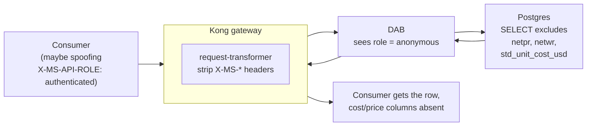

# 🔐 Security Model

[Home](../README.md) › [Documentation](README.md) › **Security Model**

> [!NOTE]
> **TL;DR** — Every consumer of the Artemis data product authenticates with a
> **short-lived RS256 JWT** (a signed, time-limited bearer token) issued by a local
> identity service that stands in for **Microsoft Entra ID**. **Kong** — the gateway,
> standing in for **Azure API Management** — validates that token at the edge, meters it
> per consumer, caps over-broad pulls, **and strips any spoofed identity headers** so the
> backend always serves the least-privileged view. **Data API Builder (DAB)** then redacts
> the columns marked *Confidential* in `classification.yml` before a single byte leaves
> the system of record. The result is **two enforcement layers** (gateway + data API)
> backing one promise: the marketplace consumer can read the data they need and *nothing
> they shouldn't*. The same shape maps 1:1 to **Entra ID + APIM + Key Vault + Microsoft
> Sentinel** on Azure.

> [!WARNING]
> All data and scenarios here are **synthetic** — see [`DISCLAIMER.md`](DISCLAIMER.md).
> This is an illustrative reference, not an official NASA document. The classification
> labels demonstrate the *workflow*, not real federal policy.

---

## 📚 Contents

- [🎯 Why this exists](#-why-this-exists)
- [🗺️ The Azure picture first](#️-the-azure-picture-first)
- [🪪 Identity & token flow](#-identity--token-flow)
- [⏱️ Token lifetime & the `/token` contract](#️-token-lifetime--the-token-contract)
- [🛡️ OWASP API Security Top 10 — controls at the gateway](#️-owasp-api-security-top-10--controls-at-the-gateway)
- [🏷️ Classify before exposure](#️-classify-before-exposure)
- [✂️ Field-level redaction — two layers, one guarantee](#️-field-level-redaction--two-layers-one-guarantee)
- [🔒 Transport: plaintext local vs TLS everywhere else](#-transport-plaintext-local-vs-tls-everywhere-else)
- [🔑 Secrets](#-secrets)
- [📊 Monitoring & SIEM (Azure)](#-monitoring--siem-azure)
- [🧰 Gotchas & troubleshooting](#-gotchas--troubleshooting)
- [➡️ Where to next](#️-where-to-next)

---

## 🎯 Why this exists

The whole point of an **API-first data marketplace** is that you publish *one governed
front door* to a dataset and let many consumers — analysts, agents, partner systems —
read through it, without ever handing them a database login or a copy of the data. That
only works if the front door is genuinely secure. If a consumer can bypass the gateway,
forge an identity, or pull the entire table in one shot, the "marketplace" is just an
unlocked file share with extra steps.

So this document answers a single question: **how do we know that the only thing reaching
a consumer is exactly what policy allows?** The answer has three moving parts, and the
rest of this page builds them up in order:

1. **Authentication** — *who is calling?* A signed, short-lived token proves it.
2. **Authorization & throttling** — *what may they do, and how much?* The gateway decides.
3. **Data minimization** — *what may they see inside a row?* Classification plus
   field-level redaction decide.

> **In plain terms:** authentication is the bouncer checking your ID at the door;
> authorization is the bouncer deciding which rooms you may enter; redaction is the staff
> inside each room handing you a document with the confidential paragraphs already blacked
> out. All three run *before* you ever touch the data.

> **Why this matters:** for an enterprise — and especially a federal one handling
> procurement data — "the data never moved and the consumer only saw what they were
> cleared for" is the difference between a compliant data product and an incident report.

---

## 🗺️ The Azure picture first

This proof-of-concept runs locally under `docker compose` so you can develop and test the
whole pattern on a laptop. **But the primary story is the Azure deployment** — local OSS
components are deliberately chosen as stand-ins for managed Azure services, so that
everything you learn here transfers directly to a real cloud landing zone.

Read this table top-to-bottom as "what I run locally → what I'd actually deploy":

| Security concern | Local (dev/test) | Azure (the real demo) |
|---|---|---|
| **Identity / token issuer** | `services/identity` — a tiny RS256 JWT issuer | **Microsoft Entra ID** (`validate-azure-ad-token`, tenant-locked) |
| **Gateway / policy enforcement** | **Kong OSS** (DB-less, declarative `kong.yml`) | **Azure API Management (APIM)** — managed gateway + policies |
| **Auto-generated data API** | **Data API Builder** container | **DAB on Azure Container Apps** (internal ingress only) |
| **Classification / labeling** | `data/classification.yml` → Postgres `COMMENT`s | **Microsoft Purview** (column-level labels & masking) |
| **Secrets** | `.env` (gitignored) + runtime-generated key | **Azure Key Vault** + managed identity |
| **Observability / SIEM** | Prometheus + Grafana | **Azure Monitor / Log Analytics + Microsoft Sentinel** |
| **Network isolation** | Docker `internal` network (no host ports) | **VNet injection + Private Endpoint** (no public path to the SoR) |

> **In plain terms:** *SoR* = **system of record**, the authoritative Postgres database
> that holds the procurement data. *JWT* = **JSON Web Token**, a compact signed token
> carrying claims about the caller. *RS256* = the token is signed with an RSA private key
> and verified with the matching public key (asymmetric), so the verifier never holds a
> secret that could mint tokens.

Everything below describes the local mechanics in detail and then names the Azure managed
equivalent, so the same mental model serves both environments.

---

## 🪪 Identity & token flow

Authentication uses the **OAuth2 bearer-token** pattern with **RS256 JWTs**. The local
issuer lives at [`services/identity/issuer.py`](../services/identity/issuer.py) and is the
stand-in for **Microsoft Entra ID**. Here is the full lifecycle, step by step:

1. **A consumer requests a token.** It `POST`s to `/token` with a body naming which of the
   two demo consumers it is (`analyst` or `artemis-agent`) and receives a short-lived
   RS256 JWT. The token carries the standard claims `iss` (issuer), `aud` (audience),
   `sub` (subject), `client_id`, `iat`/`nbf`/`exp` (issued-at / not-before / expiry).
2. **The signing key is never committed.** On first start the issuer generates a 2048-bit
   RSA keypair and persists the *private* key into a Docker volume
   (`KEY_DIR`, default `/shared/keys`); it is never written to the repo. (In Azure the
   private key is injected as a Key Vault secret instead — see
   [Secrets](#-secrets).)
3. **The gateway learns the public key.** On startup the issuer publishes a **JWKS**
   document at `/.well-known/jwks.json` *and* renders its raw **public key** into Kong's
   declarative config (replacing the `__RSA_PUBLIC_KEY__` placeholder in
   [`services/gateway/kong.yml`](../services/gateway/kong.yml)). So Kong validates exactly
   — and only — the tokens this issuer mints.
4. **Kong verifies every governed call.** The `jwt` plugin checks the RSA signature and
   the `exp` claim, then maps the call to a Kong *consumer* using the `client_id` claim
   (`key_claim_name: client_id`). That mapping is what makes **per-consumer metering**
   possible later.
5. **No token, no data.** A request with a missing, malformed, or expired token is
   **rejected with `401` at the edge** — it never reaches DAB or Postgres. A valid token
   gets `200` plus an `X-Correlation-ID` header proving the call traversed Kong.

```mermaid
sequenceDiagram
    autonumber
    participant C as Consumer<br/>(analyst / artemis-agent)
    participant I as Identity issuer<br/>(services/identity → Entra ID)
    participant K as Kong gateway<br/>(→ Azure API Management)
    participant D as Data API Builder
    participant P as Postgres (SoR)

    C->>I: POST /token { "consumer": "analyst" }
    I-->>C: { access_token (RS256 JWT), expires_in: 3600, ... }
    Note over I,K: JWKS published; public key rendered into Kong config at startup
    C->>K: GET /api/SupplyRisk + Bearer JWT
    alt no / invalid / expired token
        K-->>C: 401 (never reaches DAB or Postgres)
    else valid token
        K->>K: jwt verify (sig + exp) · map client_id → consumer · meter
        K->>K: strip X-MS-* identity headers (force anonymous role)
        K->>D: forward request (as anonymous)
        D->>P: read (column permissions applied for anonymous role)
        P-->>D: rows (Confidential columns excluded)
        D-->>K: response
        K-->>C: 200 + X-Correlation-ID
    end
```

> **Why two ways to publish the key (JWKS *and* a rendered PEM)?** JWKS is the open
> standard an OIDC-aware client or APIM would consume to discover the key dynamically.
> Kong OSS's `jwt` plugin, in this DB-less setup, wants the public key inlined in its
> config — so the issuer renders it directly. Both describe the same key; they just suit
> different consumers.

> **Azure equivalent:** in Azure this whole flow becomes **Entra ID** issuing the token
> and **APIM** validating it with the `validate-azure-ad-token` policy. The policy is
> tenant-locked and checks the audience `api://artemis-api` — see the Bicep at
> [`infra/azure/modules/apim.bicep`](../infra/azure/modules/apim.bicep), where the policy
> XML carries `<validate-azure-ad-token tenant-id="…">` and a `rate-limit-by-key`,
> mirroring the local `jwt` + `rate-limiting` plugins one-for-one.

### ✅ Worked example — prove the edge rejects the unauthenticated

```bash
# 1) No token → rejected at the edge before reaching any data
curl -s -o /dev/null -w "%{http_code}\n" http://localhost:8000/api/SupplyRisk
# Expected: 401

# 2) Get a token, then call the same route
TOKEN=$(curl -s -X POST http://localhost:8081/token \
  -H 'Content-Type: application/json' \
  -d '{"consumer":"analyst"}' | python -c "import sys,json;print(json.load(sys.stdin)['access_token'])")

curl -s -o /dev/null -w "%{http_code}\n" \
  -H "Authorization: Bearer $TOKEN" http://localhost:8000/api/SupplyRisk
# Expected: 200
```

**What each step did:** the first call carries no `Authorization` header, so Kong's `jwt`
plugin short-circuits with `401` — DAB and Postgres never see the request. The second call
first mints a token from the issuer (`POST /token`), then presents it as a bearer token;
Kong verifies the signature against the rendered public key, confirms it has not expired,
maps `client_id=analyst` to the `analyst` consumer for metering, and proxies the request.

---

## ⏱️ Token lifetime & the `/token` contract

Short-lived tokens are a security control in their own right: even if a token leaks, it is
only useful for a brief window. This POC sets that window in one place.

### Lifetime (TTL)

The token's lifetime is driven by the `TOKEN_TTL_SECONDS` environment variable, read in
[`services/identity/issuer.py`](../services/identity/issuer.py):

```python
TOKEN_TTL = int(os.environ.get("TOKEN_TTL_SECONDS", "3600"))
```

The **default is `3600` seconds (one hour)**. Every minted token sets `exp = now + TTL`
(and `iat`/`nbf = now`). Kong's `jwt` plugin lists `exp` in `claims_to_verify`, so an
expired token is rejected with `401` at the gateway — the same path as a missing token. To
demo expiry quickly, set a tiny TTL (for example `TOKEN_TTL_SECONDS=30`) in your `.env`,
mint a token, wait, and watch the next call flip from `200` to `401`.

> **Why short-lived matters:** there is no token revocation list here (and rarely a good
> one in real systems either). A short TTL *is* the revocation mechanism — the token
> simply stops working on its own. One hour is a reasonable demo balance; production
> systems often use minutes for high-value scopes and refresh tokens to re-mint.

### The `/token` request and response shape

The endpoint is intentionally minimal. The request body selects one of the two allowed
consumers; an unknown consumer is a hard `400` (see `ALLOWED_CONSUMERS` in the issuer):

```jsonc
// Request — POST /token
{ "consumer": "analyst" }        // or "artemis-agent"; default is "analyst"
```

```jsonc
// Response — 200
{
  "access_token": "eyJhbGciOiJSUzI1NiIsImtpZCI6ImFydGVtaXMtbG9jYWwta2V5LTEifQ…",
  "token_type": "Bearer",
  "expires_in": 3600,            // mirrors TOKEN_TTL_SECONDS
  "consumer": "analyst"
}
```

The JWT itself decodes to these claims (the part Kong actually inspects):

```jsonc
// header
{ "alg": "RS256", "kid": "artemis-local-key-1", "typ": "JWT" }
// payload
{
  "iss": "https://issuer.local",   // JWT_ISSUER
  "aud": "artemis-api",            // JWT_AUDIENCE
  "sub": "analyst",
  "client_id": "analyst",          // ← Kong maps the consumer via THIS claim
  "iat": 1718668800,
  "nbf": 1718668800,
  "exp": 1718672400               // iat + TTL
}
```

> [!TIP]
> The `kid` (`artemis-local-key-1`) ties the token header to the key in the published
> JWKS. If you ever rotate the keypair, the `kid` is how a verifier knows which public key
> to use. To inspect a token by hand, paste it into a JWT decoder or run
> `python -c "import jwt,sys;print(jwt.get_unverified_header(sys.argv[1]))" "$TOKEN"`.

> **Azure equivalent:** Entra ID issues OAuth2/OIDC access tokens whose `aud`, `exp`, and
> tenant signing keys are validated by APIM's `validate-azure-ad-token` policy. You do not
> run a `/token` endpoint yourself — clients use the standard Entra token endpoint
> (client-credentials or auth-code flow). The *shape* of trust is identical: signed,
> audience-scoped, time-limited tokens verified at the gateway.

---

## 🛡️ OWASP API Security Top 10 — controls at the gateway

The [OWASP API Security Top 10 (2023)](https://owasp.org/API-Security/editions/2023/en/0x00-header/)
is the industry checklist of the most common ways APIs get breached. Below is each risk
mapped to the concrete control that addresses it in this POC, and where that control lives
in the code.

| OWASP risk | Control in this POC | Where |
|---|---|---|
| **API1 — Broken Object Level Authorization** | DAB exposes **read-only** entities; there are no mutation routes; sensitive columns are classified and excluded per role. | `services/dab/dab-config.json` · `data/classification.yml` |
| **API2 — Broken Authentication** | Kong `jwt` plugin validates the RS256 signature **and** `exp`; unauthenticated/expired → `401` at the edge. | `kong.yml` (`jwt` plugin) |
| **API3 — Broken Object Property Level Authorization** | The default `anonymous` role reads with **column permissions** (`fields.exclude`) that drop Confidential columns; **and** the gateway strips inbound role headers so a caller cannot self-promote to the privileged role. | `dab-config.json` + `kong.yml` (`request-transformer`) |
| **API4 — Unrestricted Resource Consumption** | `rate-limiting` (per-consumer, 60/min default → `429` + `Retry-After`); a `pre-function` guard rejects over-broad pulls (`$first > 200` → `400`); `request-size-limiting` caps payloads at 10 MB. | `kong.yml` (3 plugins) |
| **API5 — Broken Function Level Authorization** | Only the explicit entity routes (`/api/Material`, `/Vendor`, `/PurchaseOrder`, `/SupplyRisk`, `/graphql`) are published; everything else under the backend is unrouted. | `kong.yml` (`routes`) |
| **API6 — Unrestricted Access to Sensitive Business Flows** | Per-consumer quota + metering make abusive usage visible and bounded; the `$first` guard caps bulk extraction. | `kong.yml` (`rate-limiting`, `pre-function`) |
| **API8 — Security Misconfiguration** | DB-less, declarative, code-reviewable Kong config; the SoR publishes **no host ports**; secrets stay in `.env`. | `kong.yml` · `docker-compose.yml` |
| **API9 — Improper Inventory Management** | The catalog publishes contract, owner, classification, and request path — no shadow/undocumented APIs. | `services/catalog` |
| **API10 — Unsafe Consumption of APIs** | All access is the documented OpenAPI contract over a TLS-terminable gateway; an `X-Correlation-ID` on every call gives end-to-end traceability. | `kong.yml` (`correlation-id`) |

> **In plain terms:** OWASP API3 ("broken object property level authorization") is the
> precise risk of *leaking a field you shouldn't*, like a unit cost. This POC defends it
> twice — once in DAB (which won't *select* the column) and once in Kong (which won't let
> you *ask to be* the role that could). That double defense is the headline of the next
> section.

> **Azure equivalent:** APIM provides managed equivalents of every control above —
> token validation, rate-limit-by-key, request size limits, and correlation headers are
> all policies. See Microsoft's mapping,
> [Mitigate OWASP API threats with API Management](https://learn.microsoft.com/azure/api-management/mitigate-owasp-api-threats).

### ✅ Worked example — the resource-consumption guards

```bash
# Over-broad pull is blocked by the pre-function OWASP API4 guard (before DAB is touched)
curl -s -o /dev/null -w "%{http_code}\n" \
  -H "Authorization: Bearer $TOKEN" "http://localhost:8000/api/Material?\$first=5000"
# Expected: 400  (body: "Over-broad query blocked (OWASP API4): $first exceeds 200")

# Hammer the endpoint past the per-minute cap → 429 with a Retry-After header
for i in $(seq 1 70); do
  curl -s -o /dev/null -w "%{http_code} " \
    -H "Authorization: Bearer $TOKEN" http://localhost:8000/api/SupplyRisk
done; echo
# Expected: a run of 200s, then 429s once the 60/min consumer quota is exceeded
```

**What this proves:** the `$first=5000` request is rejected by Kong's `pre-function` Lua
*before it reaches DAB* — over-broad extraction is stopped at the edge, not after the
database has already done the work. The loop demonstrates that the quota is enforced
*per consumer* (keyed by `client_id`), the core defense against one caller starving the
SoR.

---

## 🏷️ Classify before exposure

You cannot enforce a sensitivity you never recorded. So before any API is exposed, every
column is labeled. [`data/classification.yml`](../data/classification.yml) assigns each
column one of three labels — **Routine · Sensitive · Confidential** — for the synthetic
Artemis dataset. For example:

```yaml
materials:
  columns:
    STD_UNIT_COST_USD: Confidential   # unit cost is confidential
purchase_orders:
  columns:
    NETPR: Confidential               # net price / unit
    NETWR: Confidential               # net value
```

At **seed time**, [`services/seeder/seed.py`](../services/seeder/seed.py) writes these
labels onto the live database as Postgres `COMMENT ON COLUMN` statements, and the labels
are also emitted into the catalog. So a Confidential record (e.g. `purchase_orders.NETPR`)
is *governed and visible as such* from the very first call — the classification travels
with the data, in the database itself.

> **In plain terms:** this is the **Microsoft Purview** discipline — label data at the
> source so policy can act on the label — done locally with a YAML manifest and database
> comments. The labels are the *input* to the redaction enforcement described next.

> **Why this matters:** classification is the bridge between *policy* ("unit cost is
> confidential") and *mechanism* (DAB excludes that column). Without the label written
> somewhere authoritative, redaction would be a hard-coded guess that drifts out of sync
> with policy.

---

## ✂️ Field-level redaction — two layers, one guarantee

This is the heart of the security model, and it was recently strengthened: redaction is
now enforced at **two** independent layers, so a single misconfiguration cannot leak a
confidential field.

### Layer 1 — DAB column permissions (least privilege at the source)

Data API Builder applies **per-role column permissions**. In
[`services/dab/dab-config.json`](../services/dab/dab-config.json) the default `anonymous`
role reads with `fields.exclude` set to the Confidential columns, while a privileged
`authenticated` role can read the full record:

```jsonc
"Material": {
  "permissions": [
    { "role": "anonymous",      "actions": [ { "action": "read", "fields": { "exclude": ["std_unit_cost_usd"] } } ] },
    { "role": "authenticated",  "actions": ["read"] }
  ]
}
```

| Entity | Confidential column withheld from the marketplace (`anonymous`) consumer |
|---|---|
| `Material` | `std_unit_cost_usd` (unit cost) |
| `PurchaseOrder` | `netpr`, `netwr` (net price / net value) |

The **row is still returned** — only the confidential *columns* are dropped — so the
headline supply-risk answer is unaffected while cost/price data is masked at the data-API
layer, *before the gateway ever sees the response*. This is least privilege at the source:
DAB doesn't redact the field after fetching it, it never selects it for that role.

### Layer 2 — the gateway forces the least-privileged role

Here is the subtlety that Layer 1 alone does not cover. DAB's authentication provider is
`StaticWebApps`, which derives the caller's role from inbound headers
(`X-MS-CLIENT-PRINCIPAL`, `X-MS-API-ROLE`, and friends). That means a client who simply
*sends* `X-MS-API-ROLE: authenticated` could ask DAB to serve the un-redacted
`authenticated` view — defeating Layer 1.

The gateway closes that hole. The `request-transformer` plugin in
[`services/gateway/kong.yml`](../services/gateway/kong.yml) **strips every inbound
`X-MS-*` identity header** on the governed data route, so *every* request reaching DAB
arrives as the `anonymous` role:

```yaml
- name: request-transformer
  config:
    remove:
      headers:
        - X-MS-CLIENT-PRINCIPAL
        - X-MS-CLIENT-PRINCIPAL-ID
        - X-MS-CLIENT-PRINCIPAL-NAME
        - X-MS-CLIENT-PRINCIPAL-IDP
        - X-MS-API-ROLE
```

> **In plain terms:** Layer 1 is the rule ("anonymous callers don't get cost columns").
> Layer 2 makes sure the caller *can't lie about being anonymous* — Kong erases any
> identity the client tried to assert, so the privileged `authenticated` role is only ever
> reachable by an internal caller that bypasses the gateway, never by a marketplace
> consumer. Redaction is therefore **guaranteed, not accidental**.



### Proven by tests

[`tests/test_redaction.py`](../tests/test_redaction.py) proves all three properties end to
end through Kong:

- `test_confidential_fields_are_redacted_through_the_gateway` — `std_unit_cost_usd`,
  `netpr`, `netwr` are absent from responses.
- `test_routine_fields_still_present` — redaction is surgical; routine columns
  (`matnr`, `maktx`, `program`, `criticality`, `std_lead_time_days`) are untouched.
- `test_redaction_holds_against_role_header_injection` — a request that *spoofs*
  `X-MS-API-ROLE: authenticated` + a forged `X-MS-CLIENT-PRINCIPAL` still comes back
  redacted, proving Layer 2 works.

> [!NOTE]
> An earlier design redacted by *rewriting the response body at the gateway*. That was
> rejected: redaction belongs at the data API (least privilege at the source), and the
> gateway's job is to enforce the *boundary* (who you are), not to scrub payloads. The
> current two-layer design — DAB excludes the columns, Kong fixes the role — is the robust
> equivalent of column-level masking in **Microsoft Purview / Azure SQL dynamic data
> masking**.

---

## 🔒 Transport: plaintext local vs TLS everywhere else

It's important to be precise about *where the wire is encrypted*, because the local
experience and the Azure deployment differ on purpose.

| Hop | Local (dev/test) | Azure (the real demo) |
|---|---|---|
| **Client → gateway** | **Plaintext HTTP** on `localhost:8000` (Kong's `KONG_PROXY_LISTEN: 0.0.0.0:8000`, published as host port `8000` in `docker-compose.yml`) | **HTTPS only** — APIM's API is declared `protocols: ['https']` |
| **Gateway → DAB** | In-cluster HTTP on the Docker `internal`/`edge` networks | Internal ingress to the DAB Container App (private, not client-reachable) |
| **DAB → Postgres** | In-cluster TCP on the `internal` network (no host port) | TLS to Postgres (`SSL Mode=Require` in the connection string); private endpoint in the hardened posture |

> [!WARNING]
> The local gateway listens on **plaintext HTTP (`http://localhost:8000`)** — there is no
> TLS listener in the compose setup. That is fine for a laptop dev loop where all traffic
> stays on `localhost`, but **do not expose the local Kong port to a network**. The Kong
> config is *TLS-terminable* — adding an `8443` listener with a certificate is a config
> change, not a redesign — and in Azure, APIM terminates TLS for you and serves HTTPS
> only.

> **Why this is acceptable locally:** on a single host, the only thing on the wire between
> `curl` and Kong is the loopback interface, which never leaves the machine. The security
> properties we're *demonstrating* — auth, throttling, redaction — are unaffected by
> transport encryption, and forcing TLS locally would add certificate friction to the
> quickstart for no teaching benefit. The moment the gateway is reachable off-box (i.e.
> Azure), TLS is mandatory, and APIM provides it by default.

---

## 🔑 Secrets

The guiding rule: **no secret is ever committed to the repo, and in Azure no secret value
is ever inlined into an app's deployment template.**

| Context | How the secret is handled |
|---|---|
| **Local repo** | No secrets in source. Local config comes from `.env` (gitignored, copied from `.env.example`). The RS256 **private key is generated at runtime** into a Docker volume and never written to the repo; the `detect-private-key` pre-commit hook blocks accidental commits. |
| **Azure deploy params** | The PostgreSQL admin password is supplied via an env-sourced `.bicepparam` (`readEnvironmentVariable(...)`), not from source. |
| **Azure runtime** | The DB connection string lives in **Azure Key Vault**. The DAB Container App reads it at runtime via a **system-assigned managed identity** + a Key Vault *reference* — the secret value is never inlined into the app's revision template. |

The Azure runtime path is the interesting one, and it is implemented in
[`scripts/azure-deploy-fullstack.sh`](../scripts/azure-deploy-fullstack.sh) (step `2b`):

1. Create a Key Vault with RBAC authorization enabled.
2. Write the Postgres connection string as a Key Vault secret (`dab-conn`).
3. Assign the DAB Container App a **system-assigned managed identity** and grant it the
   **Key Vault Secrets User** role.
4. Point the app's secret at the vault with a `keyvaultref:` + `identityref:system`
   reference, then set `DAB_CONNECTION_STRING=secretref:dab-conn`.

> **In plain terms:** a *managed identity* is an Azure-managed credential the app *is*,
> rather than a password the app *holds*. The app authenticates to Key Vault as itself;
> there is no secret in the app's config to leak — only a pointer to the vault. This is
> the single most important secrets pattern in Azure, and it's worth internalizing here.

> [!IMPORTANT]
> In Azure the DB connection string is **never** inlined into the app's revision template
> — it is resolved from Key Vault via managed identity at runtime. See
> [`AZURE-LIVE-DEPLOYMENT.md`](AZURE-LIVE-DEPLOYMENT.md) for the full walkthrough. The
> same script also injects the JWT private key into the *identity* app as a secret
> (`JWT_PRIVATE_KEY_PEM`), so even the token-signing key is a managed secret, not a file.

---

## 📊 Monitoring & SIEM (Azure)

Security you cannot observe is security you cannot prove. Locally this POC ships
Prometheus + Grafana (per-consumer traffic, latency, status codes — see the `prometheus`
plugin in `kong.yml`). In Azure that role is filled by the managed monitoring and SIEM
stack:

- **Log Analytics** (`artemis-logs`) ingests Container Apps environment logs and APIM
  `GatewayLogs` + metrics — the managed analogue of the local Prometheus/Grafana path.
  Provisioned by [`infra/azure/modules/monitor.bicep`](../infra/azure/modules/monitor.bicep)
  and wired up in the deploy script.
- **Microsoft Sentinel** is onboarded onto that same workspace. The deploy script
  (`scripts/azure-deploy-fullstack.sh`, step `1c`) idempotently `PUT`s
  `Microsoft.SecurityInsights/onboardingStates/default` on the workspace, turning the log
  store into a **SIEM** (Security Information and Event Management) surface: analytics
  rules, threat hunting, and incident workflows over the very same gateway and app
  telemetry.
- **Network isolation (production hardening).** True zero-move in Azure removes the public
  path to the SoR entirely: the Container Apps environment is VNet-injected and Postgres is
  reachable *only* over a **private endpoint** resolved through a private DNS zone — so the
  data has nowhere off-VNet to go. Reference Bicep in
  [`infra/azure/modules/network.bicep`](../infra/azure/modules/network.bicep). (CI does not
  deploy this; it's documentation-grade IaC you wire in for the hardened posture.)

> **In plain terms:** a *SIEM* collects security-relevant logs from many sources and lets
> you write detection rules and run investigations across all of them. Onboarding Sentinel
> onto the Log Analytics workspace means the same `GatewayLogs` that power a Grafana
> dashboard locally can drive an alert ("spike in 401s from one consumer") and an incident
> in Azure — closing the loop from *observability* to *detection and response*.

---

## 🧰 Gotchas & troubleshooting

| Symptom | Likely cause | Fix |
|---|---|---|
| `401` on a route you expect to work | No `Authorization` header, malformed token, or **expired** token (TTL elapsed) | Re-mint via `POST /token`; check `expires_in`. For demos with a short TTL, mint right before calling. |
| `400 "Over-broad query blocked (OWASP API4)"` | `$first` exceeds 200 — the `pre-function` guard fired | Page in chunks of ≤ 200, or use `$orderby` + paging instead of one giant pull. |
| `429` with a `Retry-After` header | You exceeded the per-consumer rate limit (60/min default) | Back off for the indicated seconds, or raise `RATE_LIMIT_PER_MINUTE` in `.env` for the demo. |
| Confidential column unexpectedly *present* | You called DAB directly (bypassing Kong) or as the `authenticated` role | All marketplace access must go through Kong, which forces the `anonymous` role; don't expose DAB's port. |
| Spoofing `X-MS-API-ROLE` doesn't un-redact | Working as designed — the gateway strips those headers (Layer 2) | None; `test_redaction.py::test_redaction_holds_against_role_header_injection` asserts this. |
| Kong rejects a token the issuer just minted | The issuer regenerated its keypair (volume reset) but Kong still has the old public key | Restart the stack so the issuer re-renders the public key into `kong.yml`. |

---

## ➡️ Where to next

- [`ZERO-MOVE.md`](ZERO-MOVE.md) — how the network topology guarantees the gateway is the
  *only* path to the data (the proof behind several controls above).
- [`API.md`](API.md) — the endpoints, query options, and OpenAPI contract these controls
  protect.
- [`AZURE-DEPLOYMENT.md`](AZURE-DEPLOYMENT.md) / [`AZURE-LIVE-DEPLOYMENT.md`](AZURE-LIVE-DEPLOYMENT.md)
  — deploying the Entra + APIM + Key Vault + Sentinel stack for real.
- [`APIM-CAPABILITIES.md`](APIM-CAPABILITIES.md) — the managed-gateway feature set that
  maps onto the Kong plugins used here.
- [`concepts/04-identity-jwt-oauth.md`](concepts/04-identity-jwt-oauth.md) and
  [`concepts/06-observability-and-security.md`](concepts/06-observability-and-security.md)
  — the teaching primers behind the JWT/OAuth and security/observability material.
- [`GLOSSARY.md`](GLOSSARY.md) — definitions of JWT, RS256, JWKS, SoR, SIEM, and the other
  terms used here.
</content>
</invoke>
