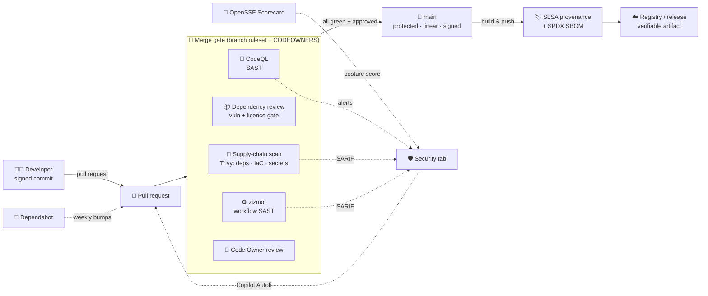

# 🛡️ Software Assurance on GitHub

[Home](../README.md) > **Software Assurance**

> [!NOTE]
> **TL;DR** — This page shows how the repository uses **GitHub's native software-assurance
> stack** to secure not just the application, but the *software supply chain* that produces
> it: SAST (CodeQL), dependency and container scanning, an SBOM, signed build provenance
> (SLSA), pipeline hardening, and review/branch governance. Every control is mapped to the
> framework a federal buyer expects — **NIST SSDF (SP 800-218)**, **SLSA**, **EO 14028 /
> OMB M-22-18**, and **CISA Secure by Design**. Findings all land in one place: the
> repository's **Security** tab.

> [!WARNING]
> **Illustrative reference · synthetic data only · not an official NASA document.**
> All data is fabricated by [`data/synthetic_data.py`](../data/synthetic_data.py).
> See [`DISCLAIMER.md`](DISCLAIMER.md).

---

## 📚 Contents

- [🎯 Why this page exists](#-why-this-page-exists)
- [🔄 The assured SDLC at a glance](#-the-assured-sdlc-at-a-glance)
- [🧰 What's wired in](#-whats-wired-in)
- [🤖 Where Copilot fits](#-where-copilot-fits)
- [📐 Mapping to assurance frameworks](#-mapping-to-assurance-frameworks)
- [✅ One-time enablement checklist](#-one-time-enablement-checklist)
- [🔍 Verify it yourself](#-verify-it-yourself)
- [➡️ Where to next](#️-where-to-next)

---

## 🎯 Why this page exists

The rest of this repo proves an **application** security pattern — API-first, zero-move,
governed at the gateway (see [`SECURITY.md`](SECURITY.md)). *Software assurance* is the
companion question: **can you trust the way the software itself was built, reviewed, and
shipped?** That's the supply-chain story — the one EO 14028 and the NIST Secure Software
Development Framework ask vendors to answer.

GitHub answers it with built-in capabilities rather than a bolt-on toolchain. This repo
turns them on and routes every result into the **Security** tab, so "is this build
trustworthy?" has an evidence-backed answer instead of a promise.

---

## 🔄 The assured SDLC at a glance



Every arrow into the **Security** tab is an evidence stream; every arrow into the **merge
gate** is a control that blocks an untrustworthy change from reaching `main`.

---

## 🧰 What's wired in

| Capability | What it does here | Where it shows | Type |
|---|---|---|---|
| **CodeQL code scanning** ([`codeql.yml`](../.github/workflows/codeql.yml)) | First-party SAST over Python + the JS/TS frontend, `security-extended` queries | Security → Code scanning | Workflow |
| **Dependency Review** ([`dependency-review.yml`](../.github/workflows/dependency-review.yml)) | Blocks a PR that adds a vulnerable or copyleft-licensed dependency | PR check | Workflow |
| **Dependabot** ([`dependabot.yml`](../.github/dependabot.yml)) | Weekly version + security bumps across pip, npm, Actions, Docker | PRs (auto-merged when green) | Workflow |
| **Supply-chain scan** ([`supply-chain.yml`](../.github/workflows/supply-chain.yml)) | Trivy scans deps, Dockerfile/Bicep/compose misconfig, and secrets; emits an **SPDX SBOM** | Security → Code scanning + artifact | Workflow |
| **SLSA build provenance** ([`deploy.yml`](../.github/workflows/deploy.yml)) | Signs each pushed image's digest so consumers can prove where it was built | `gh attestation verify` | Workflow (hook) |
| **zizmor** ([`actions-security.yml`](../.github/workflows/actions-security.yml)) | Static analysis of the workflows themselves (injection, over-broad tokens, unpinned actions) | Security → Code scanning | Workflow |
| **OpenSSF Scorecard** ([`scorecard.yml`](../.github/workflows/scorecard.yml)) | Scores overall supply-chain posture; publishes the public badge | Security tab + badge | Workflow |
| **Least-privilege tokens** | Every workflow declares minimal `permissions:` (default is `contents: read`) | Workflow source | Hardening |
| **Branch ruleset** ([`rulesets/`](../.github/rulesets/)) | PR-only, required checks, Code Owner review, **signed commits**, linear history, no force-push | Repo settings | Config (import once) |
| **CODEOWNERS** ([`CODEOWNERS`](../.github/CODEOWNERS)) | Routes security-sensitive paths to required owner review | PR reviewers | Config |
| **PR + issue templates** ([`pull_request_template.md`](../.github/pull_request_template.md)) | Built-in security checklist; private-disclosure routing on new issues | PR/issue UI | Config |
| **OIDC deploy** ([`deploy.yml`](../.github/workflows/deploy.yml)) | Passwordless Azure login via federated credentials — no long-lived cloud secrets | Workflow | Existing |
| **Private vulnerability reporting** ([`SECURITY.md`](../SECURITY.md)) | Coordinated disclosure via private advisories | Security → Advisories | Setting + doc |

> [!TIP]
> The workflows run on the repo's self-hosted runners by default (matching CI). Swap
> `runs-on: [self-hosted, linux, x64]` for `ubuntu-latest` to use GitHub-hosted runners.
> Action versions are kept current by the **github-actions Dependabot** updater.

---

## 🤖 Where Copilot fits

Software assurance is also where **GitHub Copilot** earns its keep beyond authoring code:

- **Copilot Autofix** — for CodeQL and secret-scanning alerts, Copilot proposes a concrete,
  reviewable fix (often a one-click PR), collapsing the find→fix gap. Enabled in repo
  settings; it works on every alert the workflows above raise.
- **Copilot code review** — request Copilot as a reviewer on a PR for a fast first pass
  before a human Code Owner signs off.
- **Security campaigns** — at org scale, batches of alerts can be assigned to Copilot to
  remediate, turning a backlog into a series of fix PRs.

> **In plain terms:** the scanners on this page *find* problems; Copilot helps *close* them
> — so the assurance loop is detect **and** remediate, not just a longer to-do list.

---

## 📐 Mapping to assurance frameworks

### NIST SSDF — Secure Software Development Framework (SP 800-218)

The framework EO 14028 directs federal software producers to attest to.

| SSDF practice | How this repo satisfies it |
|---|---|
| **PO** — Prepare the Organization | Documented policy ([`SECURITY.md`](../SECURITY.md)), this assurance page, CODEOWNERS |
| **PS.1** — Protect code from tampering | Branch ruleset: PR-only, linear history, no force-push |
| **PS.2** — Provide a provenance mechanism | **SLSA build-provenance attestations** + **required commit signing** |
| **PS.3** — Archive & protect each release | **SPDX SBOM** generated per build |
| **PW.4** — Reuse secure components | Dependabot + Dependency Review gate third-party code |
| **PW.7** — Review/analyze human-readable code | **CodeQL** SAST + Code Owner review |
| **PW.8** — Test executable code | CI: `pytest`, integration tests, compose smoke; zero-move/redaction tests |
| **RV.1** — Identify & confirm vulnerabilities | CodeQL, Trivy, Dependabot, OpenSSF Scorecard, private reporting |
| **RV.2** — Assess, prioritize, remediate | Security tab + **Copilot Autofix** |

### SLSA — Supply-chain Levels for Software Artifacts

| SLSA requirement | Status |
|---|---|
| Scripted/hosted build (not manual) | ✅ GitHub Actions builds the images |
| Signed provenance for artifacts | ✅ `actions/attest-build-provenance` (Build L2+) |
| Provenance is verifiable | ✅ `gh attestation verify oci://…@<digest>` |

### EO 14028 · OMB M-22-18/M-23-16 · CISA Secure by Design

| Expectation | This repo |
|---|---|
| **SBOM** available for the software | ✅ SPDX SBOM per build |
| **Provenance / integrity** of artifacts | ✅ SLSA attestations + signed commits |
| **Vulnerability disclosure** program | ✅ Private advisories ([`SECURITY.md`](../SECURITY.md)) |
| **Secure-by-default** configuration | ✅ Least-privilege tokens, push protection, zero-move, no secrets in repo |
| Automated **secure-development** evidence | ✅ Scorecard + the Security tab as the audit surface |

---

## ✅ One-time enablement checklist

Some controls are **repository settings**, not files — flip these once (free on public
repos; GitHub Advanced Security / Code Security on private repos):

- [ ] **Settings → Code security**: enable **CodeQL** (default or the `codeql.yml` here),
      **secret scanning**, and **push protection**
- [ ] Enable **Copilot Autofix** for code scanning + secret scanning
- [ ] Enable **Dependency graph** + **Dependabot alerts** and **security updates**
- [ ] Enable **Private vulnerability reporting** (Security → Advisories)
- [ ] Import the **branch ruleset**: `gh api repos/OWNER/nasa-api-first-poc/rulesets --method POST --input .github/rulesets/main-protection.json`
- [ ] Replace `@OWNER` in [`CODEOWNERS`](../.github/CODEOWNERS) with your handle/team
- [ ] (Public repo) Confirm the **OpenSSF Scorecard** badge publishes after the first run

---

## 🔍 Verify it yourself

```bash
# Supply-chain posture score (no install needed beyond the CLI):
#   open the repo → Security tab → Code scanning / Dependabot / Scorecard

# Prove an image was built by this pipeline (after a provenance-enabled deploy):
gh attestation verify oci://<registry>.azurecr.io/catalog@sha256:<digest> --owner OWNER

# Inspect the SBOM produced by the supply-chain workflow:
#   Actions → "Supply chain" run → Artifacts → sbom.spdx.json

# Re-run the app-level assurance tests locally:
pytest -q tests/test_zero_move.py tests/test_redaction.py tests/test_no_fabric.py
```

---

## ➡️ Where to next

| Go here | For |
|---|---|
| [`GITHUB-FEATURES.md`](GITHUB-FEATURES.md) | A **show-and-tell tour** of every GitHub feature + a 5-minute demo script |
| [`SECURITY.md`](../SECURITY.md) | The **policy** + private vulnerability reporting |
| [`docs/SECURITY.md`](SECURITY.md) | The **application** security model (OWASP API Top 10, identity, redaction) |
| [`docs/ZERO-MOVE.md`](ZERO-MOVE.md) | How network isolation is proven, not just claimed |
| [`docs/ARCHITECTURE.md`](ARCHITECTURE.md) | Components + the OSS ↔ Azure managed mapping |
| [`.github/`](../.github/) | The workflows, CODEOWNERS, templates, and ruleset themselves |
