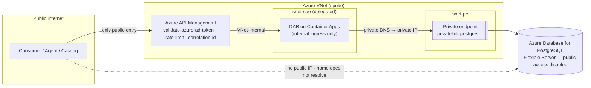
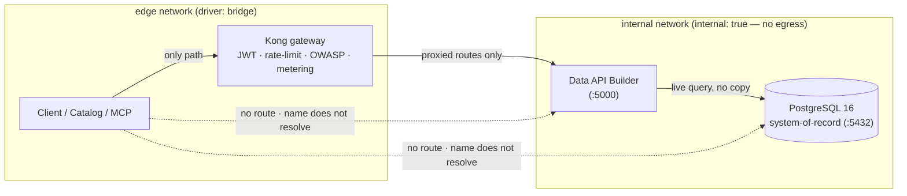

# 🔒 Zero-Move: The Guarantee, From First Principles — and How We Prove It

[Home](../README.md) > [Documentation](README.md) > **Zero-move proof**

> [!WARNING]
> **Illustrative reference · sample/synthetic data only · not an official NASA
> document.** All data is generated by `data/synthetic_data.py`. See
> **[DISCLAIMER.md](DISCLAIMER.md)** before sharing or adapting.

> [!NOTE]
> **TL;DR** — *Zero-move* means the source data **never leaves its system of record**;
> consumers get governed **answers through a gateway**, not a copy of the data. In this
> proof-of-concept that is not a slogan — it is enforced by the network topology and
> **proven by an automated test**. Postgres (the system-of-record) and Data API Builder
> (the auto-generated API) attach **only** to an isolated Docker network with no host
> ports; Kong is the single service bridged to the outside, so the **only** path to the
> data is through the gateway. The same shape maps directly to Azure: a **VNet** with
> **private endpoints** in place of the Docker `internal` network, and **Azure API
> Management** in place of Kong.

---

## 📑 Contents

- [Why zero-move exists (the problem it solves)](#-why-zero-move-exists-the-problem-it-solves)
- [What "zero-move" actually means](#-what-zero-move-actually-means)
- [The enterprise target: zero-move on Azure](#-the-enterprise-target-zero-move-on-azure)
- [The local dev/test analogue (Docker)](#-the-local-devtest-analogue-docker)
- [The data path, visualized](#-the-data-path-visualized)
- [How we *prove* it (not just claim it)](#-how-we-prove-it-not-just-claim-it)
- [Worked example: run the proof yourself](#-worked-example-run-the-proof-yourself)
- [Gotchas & troubleshooting](#-gotchas--troubleshooting)
- [Where to next](#-where-to-next)

---

## 🧭 Why zero-move exists (the problem it solves)

The traditional way to share data is to **copy it**. A team needs the procurement data,
so they get an extract — a CSV dump, a nightly ETL pipeline, a replica database, a data
mart. Now the data exists in two places. Then a third team copies *that* copy. Within a
year the same "authoritative" supplier list exists in a dozen forms, each drifting from
the others and each a separate thing an attacker, an auditor, or an export-control officer
must worry about.

For a federal / aerospace customer this is not just messy — it is a compliance and
security liability:

- **Provenance dissolves.** Once data is copied, "where did this number come from?" has no
  single answer. Lineage and trust evaporate.
- **The attack surface multiplies.** Every copy is another credential, another firewall
  rule, another backup, another place ITAR/CUI ([export-controlled / Controlled
  Unclassified Information](GLOSSARY.md)) data can leak from.
- **Governance can't keep up.** A policy change (revoke a consumer, throttle a noisy one,
  re-classify a field) has to be re-applied to every copy, or it isn't really applied at
  all.

> **In plain terms:** copying data to share it is like photocopying a classified document
> for everyone who wants to read it. The fix is the opposite instinct — **don't hand out
> the document; answer questions about it through one controlled desk.**

> **Why this matters (the enterprise story):** the whole point of this proof-of-concept is
> the **API-first, zero-move data marketplace** pattern. One system of record, one
> governed front door, and consumers who get *answers* — never bulk copies. Zero-move is
> the foundation the catalog, the metering, and the agent-facing MCP tool all stand on.
> If the data could leak around the gateway, every other guarantee in this repo would be
> theatre.

---

## 🔐 What "zero-move" actually means

Let's define the terms precisely, because the guarantee is only as strong as its weakest
word.

| Term | Definition |
|---|---|
| **System of record (SoR)** | The single authoritative store for the data — here, **PostgreSQL 16**. It is the *only* copy. |
| **Auto-API** | A layer that turns the SoR into a REST/GraphQL API automatically — here, **[Data API Builder (DAB)](GLOSSARY.md#dab--data-api-builder)**, a Microsoft open-source product. It reads the SoR live; it does not stage a second copy. |
| **Gateway** | The single governed front door that authenticates, rate-limits, meters, and proxies every request — here, **[Kong Gateway OSS](GLOSSARY.md#kong-kong-gateway-oss)**. |
| **Zero-move** | The property that the **only path** a consumer has to the data is *through the gateway, against the live SoR*. No bulk export, no replica, no direct database port, no second authoritative copy. |

The key insight is that zero-move is a **topology property**, not a feature you switch on.
You don't make data zero-move by *promising* not to copy it. You make it zero-move by
arranging the network so that **there is no route** by which a consumer could read the SoR
directly, even if they tried. The data doesn't move because there is nowhere off-network
for it to move *to*, and the only door is one you fully control.

> [!TIP]
> A useful test for any "zero-move" claim: *"If a curious engineer with valid network
> access tried to connect straight to the database, what stops them?"* If the answer is "a
> policy" or "they're not supposed to," it isn't zero-move. If the answer is "the host
> isn't routable from where they are," it is.

---

## ☁️ The enterprise target: zero-move on Azure

This proof-of-concept runs locally on Docker so you can develop and test it, but the
**primary story is the Azure deployment** — that is where the "full art of the possible"
lives. So we start there, then show the local stack as its faithful analogue.

In Azure, zero-move is enforced by the same idea — *make the SoR unroutable except through
the gateway* — using managed building blocks:

| Local OSS component | Azure managed service | Role in zero-move |
|---|---|---|
| Docker `internal` network | **[Azure Virtual Network (VNet) + private endpoints](GLOSSARY.md#private-endpoint--vnet)** | The SoR has **no public IP**; it is reachable only over a private endpoint inside the VNet. |
| Kong Gateway OSS | **[Azure API Management (APIM)](GLOSSARY.md#apim--azure-api-management)** | The single governed front door; applies JWT validation, rate-limit, correlation-id, metering. |
| Local RS256 JWT issuer | **[Microsoft Entra ID](GLOSSARY.md#microsoft-entra-id-formerly-azure-ad)** | Issues and validates the tokens APIM checks (`validate-azure-ad-token`). |
| DAB container | **DAB on Azure Container Apps (internal ingress)** | The auto-API; with *internal ingress* only APIM (inside the VNet) can reach it — no public URL. |
| `classification.yml` | **Microsoft Purview** | Catalog, classification, and lineage over the same single source. |
| Prometheus / Grafana | **Azure Monitor / Log Analytics / App Insights** | Per-consumer metrics and tracing of the governed path. |

**In plain terms:** a VNet is a private network in Azure; a *private endpoint* gives a
managed service (like Azure Database for PostgreSQL) a private IP **inside** that VNet and
takes away its public one. Combined with a private DNS zone — so the database's hostname
resolves to that private IP only from inside the VNet — the SoR becomes invisible to the
internet. The only thing that can reach it is the Container Apps environment that's also
injected into the VNet, and the only thing the *outside* can reach is APIM.

This is exactly what the reference Bicep ships. See
[`infra/azure/modules/network.bicep`](../infra/azure/modules/network.bicep):

```bicep
// Private endpoint for the system-of-record Postgres server — no public path.
resource pgPrivateEndpoint 'Microsoft.Network/privateEndpoints@2024-05-01' = {
  name: '${namePrefix}-pg-pe'
  properties: {
    subnet: { id: '${vnet.id}/subnets/snet-pe' }
    privateLinkServiceConnections: [
      {
        name: 'pg'
        properties: {
          privateLinkServiceId: postgresResourceId   // the PG Flexible Server
          groupIds: ['postgresqlServer']
        }
      }
    ]
  }
}
```

The module also creates the spoke VNet with two subnets — a delegated subnet for the
VNet-injected Container Apps environment (`snet-cae`) and a subnet that holds the private
endpoint NICs (`snet-pe`) — plus the `privatelink.postgres.database.azure.com` private DNS
zone and its VNet link. The result, in the module's own words: *"the SoR then has no
internet-facing surface — the data cannot move because there is nowhere off-VNet to move it
to, and the ONLY route to it is APIM → DAB inside the VNet."*



> [!NOTE]
> Two layers of the demo are intentionally separate. The **functional ACA demo** uses
> public ingress on each app, and the *gateway* governs every call — good enough to show
> the pattern working end-to-end. The **production-hardened posture**
> (`enablePrivateNetworking=true`) is what removes the public path to the SoR entirely.
> CI does **not** deploy either — the Bicep compiles (`az bicep build`) and is
> documentation-grade reference IaC requiring no subscription. See
> [AZURE-DEPLOYMENT.md](AZURE-DEPLOYMENT.md).

---

## 🐳 The local dev/test analogue (Docker)

> [!TIP]
> **Run it locally to develop and test; deploy to Azure for the real demo.** The Docker
> stack is the fast inner loop. Every piece below has the Azure twin from the table above.

Locally, Docker networks play the role of the VNet, and Kong plays the role of APIM. The
mechanism is delightfully simple, and it lives entirely in
[`docker-compose.yml`](../docker-compose.yml):

```yaml
networks:
  internal:
    internal: true     # no egress; postgres + dab live here, unreachable from outside
  edge:
    driver: bridge

postgres:        { networks: [internal] }            # no `ports:` — no host mapping
dab:             { networks: [internal] }            # no `ports:` — no host mapping
transportation:  { networks: [internal] }            # 2nd source — same isolation
seeder:          { networks: [internal] }            # one-shot job, internal only
kong:            { networks: [internal, edge] }      # the ONLY service on both
catalog:         { networks: [edge] }
mcp:             { networks: [edge] }
```

Three properties combine to make this real, not aspirational:

| Element | What it does | Why it matters |
|---|---|---|
| Postgres, DAB (and the 2nd source) declare **no `ports:`** | Docker never publishes a host port for them, so there is no `localhost:5432` on your machine. | A consumer on the host can't even *address* the database. |
| The `internal` network sets **`internal: true`** | Docker gives that network **no outbound route** — containers on it can't reach the internet, and nothing outside the network can reach in. | Even a compromised container on `internal` can't exfiltrate the data outward. |
| **Kong is the only service on both `internal` and `edge`** | It is the single bridge. It proxies `edge → internal` **only** for explicitly exposed routes, and only after JWT + rate-limit + OWASP checks pass. | There is exactly one door, and it is the governed one. |

> **In plain terms:** putting Postgres and DAB on a network marked `internal: true` with
> no published ports is the Docker equivalent of "no public IP." Putting Kong on *both*
> networks is the Docker equivalent of "APIM is the single VNet entry point." Same shape,
> smaller box.

> [!NOTE]
> The same isolation applies to the second source (`transportation`, a DOT-flavored
> stand-in for an existing API) and the `seeder` job — they also live on `internal` only
> and become reachable solely through Kong once the onboarding wizard registers them. See
> [ADD-A-SOURCE.md](ADD-A-SOURCE.md).

---

## 🗺️ The data path, visualized



Read the diagram as a sentence: *a client can reach Kong, and only Kong; Kong reaches DAB
on the internal network; DAB queries Postgres live; and the dashed lines — client straight
to DAB or Postgres — do not exist.* Those dashed lines are exactly what the test below
turns into assertions.

---

## ✅ How we *prove* it (not just claim it)

A claim is worthless if nothing checks it. The difference between *saying* "the data can't
move" and *knowing* it is an automated test that would **fail** the moment someone
accidentally published a database port or attached Postgres to the `edge` network.

That test is [`tests/test_zero_move.py`](../tests/test_zero_move.py). It is part of the
PRP §9 hard constraints and runs in the compose-smoke CI job. Here is what each assertion
does and *why it is the right thing to assert*:

| # | Assertion | How it works | What a failure would mean |
|---|---|---|---|
| 1 | **The edge network cannot reach Postgres.** | Spins up a throwaway `busybox` container *on the edge network* and runs `nc -z -w3 postgres 5432`. Expects it to **fail** (the name doesn't even resolve on `edge`). | Postgres got attached to `edge`, or the networks were merged — a direct DB path opened. |
| 2 | **The edge network cannot reach DAB.** | Same probe against `dab 5000`. Expects **failure**. | The auto-API became directly reachable, bypassing the gateway's auth and metering. |
| 3 | **The edge network *can* reach Kong.** | Same probe against `kong 8000`. Expects **success**. | The one legitimate door is down — the governed path is broken. |
| 4 | **No host ports for Postgres or DAB.** | Runs `docker compose port postgres 5432` and `… dab 5000` and asserts the output contains **no real `IP:port` binding**. | Someone added a `ports:` mapping; the DB is now on `localhost`. |
| 5 | **The data still answers through Kong.** | Issues an authenticated `GET /api/SupplyRisk?$first=1` with an `analyst` bearer token and asserts `200` with non-empty `value`. | Proving isolation is meaningless if the *governed* path also broke — this confirms the door actually works. |

The crucial design choice is that assertions 1–2 run from a container **on the edge
network** — the same place real clients live — not from your host. That's what makes the
test honest: it asks the question from the attacker's actual vantage point.

```python
def _connect_from_edge(host: str, port: int) -> bool:
    """True if a throwaway container on the edge network can TCP-connect to host:port."""
    net = _edge_network()                       # finds the compose-created *_edge network
    result = subprocess.run([
        "docker", "run", "--rm", "--network", net,
        "busybox", "sh", "-c", f"nc -z -w3 {host} {port}",
    ], capture_output=True, text=True)
    return result.returncode == 0               # 0 == connected
```

> [!IMPORTANT]
> If any client could read Postgres or DAB directly, assertions **(1)**, **(2)**, or
> **(4)** would fail. If the governed path silently broke, **(5)** would fail. Together
> they are the difference between *claiming* zero-move and *proving* it — and because they
> run in CI, the proof is re-checked on every change.

---

## 🧪 Worked example: run the proof yourself

> [!NOTE]
> These commands assume the stack is up (`make up`, or `cp .env.example .env && make
> demo`). The integration tests **skip** rather than fail when the stack isn't reachable,
> so a clean checkout still goes green offline.

**1. Run the whole proof via the test suite.**

```bash
make test
```

Expected (the zero-move tests pass alongside auth / discovery / supply-risk / no-fabric):

```text
tests/test_zero_move.py::test_postgres_unreachable_from_edge_network PASSED
tests/test_zero_move.py::test_dab_unreachable_from_edge_network PASSED
tests/test_zero_move.py::test_kong_is_reachable_from_edge_network PASSED
tests/test_zero_move.py::test_postgres_and_dab_publish_no_host_ports PASSED
tests/test_zero_move.py::test_data_still_answers_through_the_gateway PASSED
```

*What this did:* exercised all five assertions above against the live stack.

**2. See the isolation with your own eyes — try to reach Postgres from the edge network.**

```bash
docker run --rm --network nasa-api-first-poc_edge busybox sh -c "nc -z -w3 postgres 5432; echo exit=$?"
```

Expected:

```text
nc: bad address 'postgres'
exit=1
```

*What this did:* from the network where clients live, `postgres` doesn't even resolve to
an address — there is no route to the database. (Your network name may differ; list them
with `docker network ls` and look for the `*_edge` one.)

**3. Confirm the same probe to Kong *succeeds*.**

```bash
docker run --rm --network nasa-api-first-poc_edge busybox sh -c "nc -z -w3 kong 8000; echo exit=$?"
```

Expected:

```text
exit=0
```

*What this did:* proved the one legitimate door is open — Kong is reachable from `edge`.

**4. Confirm no host port leaks the database.**

```bash
docker compose port postgres 5432; docker compose port dab 5000
```

Expected: no real `IP:port` line (empty output or `:0` / "no container ... published"). If
this printed `0.0.0.0:5432`, zero-move would be broken — someone added a `ports:` mapping.

**5. Confirm the data still answers — but only through the governed path.**

```bash
TOKEN=$(curl -s -X POST http://localhost:8081/token -H 'content-type: application/json' \
  -d '{"consumer":"analyst"}' | python -c "import sys,json;print(json.load(sys.stdin)['access_token'])")
curl -s -H "Authorization: Bearer $TOKEN" "http://localhost:8000/api/SupplyRisk?\$first=1"
```

Expected: a `200` JSON body with a non-empty `value` array of supply-risk rows, served
**through Kong** against the live Postgres SoR — no copy involved. (Drop the token and the
same call returns `401`; that's the gateway's auth, covered in
[gateway-auth tests](../tests/test_gateway_auth.py) and [SECURITY.md](SECURITY.md).)

---

## 🩹 Gotchas & troubleshooting

> [!WARNING]
> **`docker network ls` shows no `*_edge` network.** The stack isn't up, or it was started
> with a different project name. Start it with `make up` and re-check; the test asserts the
> edge network exists before probing.

- **The probe to `postgres` returns `exit=0` (reachable).** Something attached Postgres or
  DAB to the `edge` network, or the two networks were merged. Check the `networks:` block
  in `docker-compose.yml` — Postgres, DAB, the second source, and the seeder must list
  `internal` only; Kong is the *only* service listing both.
- **`docker compose port postgres 5432` prints a real binding.** A `ports:` mapping was
  added to Postgres or DAB. Remove it — the SoR must never publish a host port.
- **Assertion (5) fails but (1)–(4) pass.** Isolation is intact but the *governed* path is
  broken: check Kong's health, the rendered `kong.yml`, and that the identity issuer is up
  to mint tokens. This is an availability problem, not a zero-move violation.
- **Tests SKIP instead of run.** That's by design when the stack isn't reachable (see
  [`tests/conftest.py`](../tests/conftest.py) `requires_stack`). Bring the stack up first.

---

## 🧭 Where to next

- **[ARCHITECTURE.md](ARCHITECTURE.md)** — how the gateway, auto-API, catalog, and
  consumers fit together around the SoR.
- **[AZURE-DEPLOYMENT.md](AZURE-DEPLOYMENT.md)** — the full local-to-Azure mapping and the
  reference Bicep (including `network.bicep` for production hardening).
- **[SECURITY.md](SECURITY.md)** — the gateway's JWT auth, rate-limit, and metering — the
  *governance* on top of the *isolation* described here.
- **[ADD-A-SOURCE.md](ADD-A-SOURCE.md)** — how a new internal source is onboarded and
  becomes reachable solely through Kong.
- **[GLOSSARY.md](GLOSSARY.md)** — definitions for every term used above.
</content>
</invoke>
