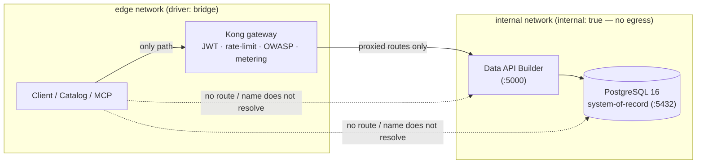

# 🔒 How zero-move is proven in this POC

[Home](../README.md) > [Documentation](README.md) > **Zero-move proof**

> [!WARNING]
> **Illustrative reference · sample/synthetic data only · not an official NASA
> document.** See **[DISCLAIMER.md](DISCLAIMER.md)** before sharing or adapting.

> [!NOTE]
> **TL;DR** — Postgres (system-of-record) and Data API Builder (the auto-API) attach
> **only** to the `internal` Docker network and publish **no host ports**. Kong is the
> single service bridged to both `internal` and `edge`, so the **only** path to the data
> is through the gateway. [`tests/test_zero_move.py`](../tests/test_zero_move.py)
> proves it — not just claims it.

## 📑 Contents

- [Why it is zero-move](#-why-it-is-zero-move)
- [The concrete configuration (`docker-compose.yml`)](#-the-concrete-configuration-docker-composeyml)
- [The data path, visualized](#-the-data-path-visualized)
- [What the test proves (`tests/test_zero_move.py`)](#-what-the-test-proves-teststest_zero_movepy)

## 🧭 Why it is zero-move

The system-of-record data (PostgreSQL) and the auto-API (Data API Builder) attach
**only** to the `internal` Docker network. Clients, the catalog, and the MCP server
attach to the `edge` network. The **only** bridge between them is the Kong gateway.

Therefore the only path to the data is **through the gateway** — there is no route by
which a client can read Postgres or DAB directly. The data is never copied out; the
gateway brokers, authenticates, throttles, and meters every call.

## ⚙️ The concrete configuration (`docker-compose.yml`)

```yaml
networks:
  internal:
    internal: true     # no egress; postgres + dab live here
  edge:
    driver: bridge

postgres: { networks: [internal] }            # no `ports:` — no host mapping
dab:      { networks: [internal] }            # no `ports:` — no host mapping
kong:     { networks: [internal, edge] }      # the ONLY service on both
catalog:  { networks: [edge] }
mcp:      { networks: [edge] }
```

| Element | Effect |
|---|---|
| Postgres & DAB declare **no `ports:`** | They are never published to the host. |
| `internal: true` | That network has **no outbound** route either. |
| Kong on both networks | The single bridge; it proxies `edge → internal` only for exposed routes, and only after JWT + rate-limit + OWASP checks pass. |

> [!NOTE]
> The same isolation applies to the second source (`transportation`) and the seeder —
> they also live on `internal` only and become reachable solely through Kong once the
> onboarding wizard registers them. See [`ADD-A-SOURCE.md`](ADD-A-SOURCE.md).

## 🗺️ The data path, visualized



## ✅ What the test proves (`tests/test_zero_move.py`)

Run via `make test` with the stack up:

1. **Edge cannot reach the SoR.** A throwaway `busybox` container on the `edge` network
   runs `nc -z postgres 5432` and `nc -z dab 5000` — both fail (the names do not even
   resolve on `edge`).
2. **Edge can reach Kong.** The same probe to `kong 8000` succeeds — Kong is the one
   path.
3. **No host ports.** `docker compose port postgres 5432` and `… dab 5000` return no
   published binding.
4. **The data still answers through Kong.** A bearer-authenticated
   `GET /api/SupplyRisk` (with an `analyst` token) returns rows — the governed path
   works.

> [!IMPORTANT]
> If any client could read Postgres or DAB directly, assertions (1) or (3) would fail.
> This is the difference between *claiming* zero-move and *proving* it.
