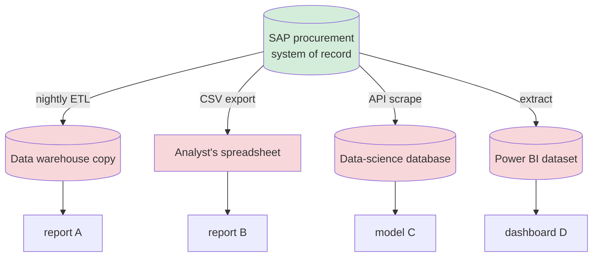
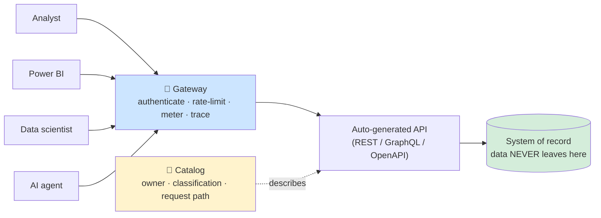
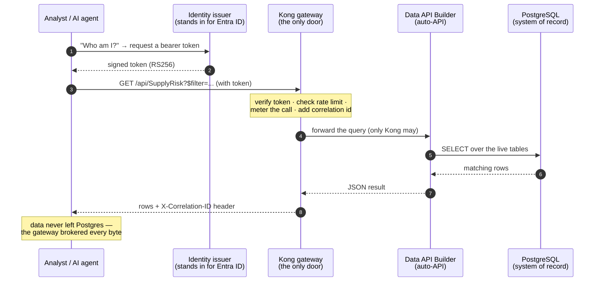
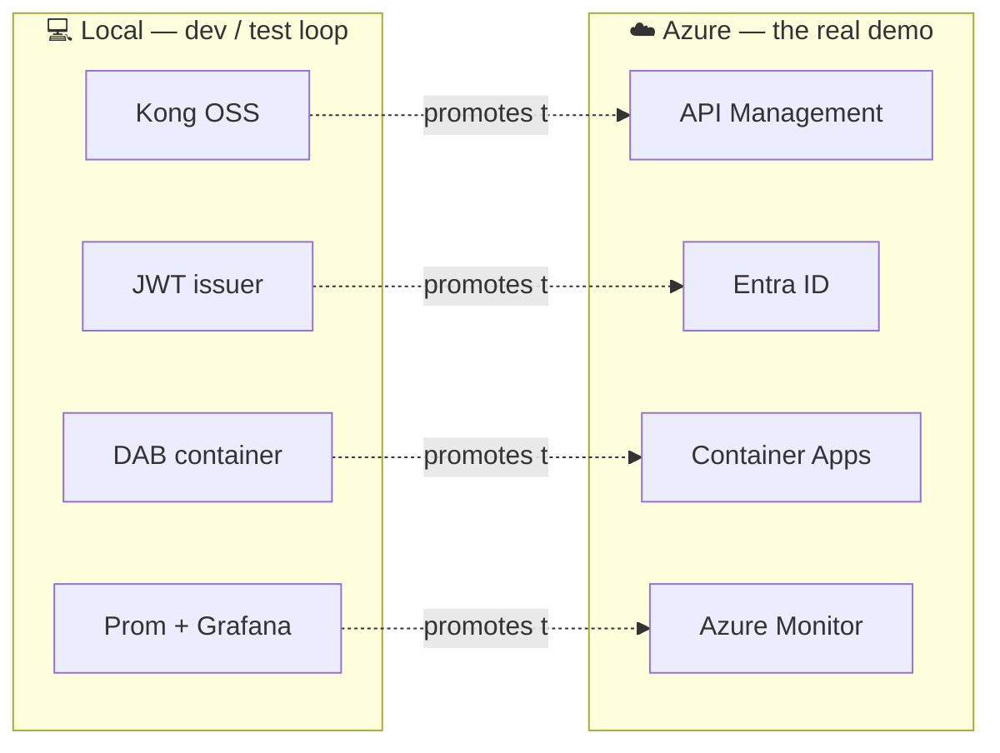

# 💡 The Big Idea — API-First, Zero-Move Data Marketplace

[Home](../../README.md) > [Documentation](../README.md) > [Concepts](./README.md) > **The Big Idea**

> [!WARNING]
> **Illustrative reference · sample/synthetic data only · not an official NASA
> document.** All data in this repository is synthetic. See
> [`../DISCLAIMER.md`](../DISCLAIMER.md) before sharing or adapting.

> [!NOTE]
> **TL;DR** — Enterprises and agencies drown in *copies* of data: every team that
> needs the procurement system's numbers exports a spreadsheet, builds an ETL job, or
> stands up a shadow database. Each copy is a new place the data can leak, go stale, or
> escape governance. The **API-first, zero-move** pattern flips this: you leave the
> data where it lives, wrap it in a **governed API**, put a **gateway** in front that
> authenticates / throttles / meters every call, and publish it to a **catalog** so
> people can find it. Consumers — a human analyst, a Power BI report, or an AI agent —
> get answers **through the gateway**; the data itself **never moves**. This document
> teaches that idea from first principles, using the Artemis supply-chain example this
> repo actually runs.

---

## 📑 Table of Contents

- [Why this document exists](#-why-this-document-exists)
- [The problem: data silos and the cost of copies](#-the-problem-data-silos-and-the-cost-of-copies)
- [The idea: expose data as a governed API; data never moves](#-the-idea-expose-data-as-a-governed-api-data-never-moves)
- [The Artemis example, end to end](#-the-artemis-example-end-to-end)
- [Why an enterprise or agency cares](#-why-an-enterprise-or-agency-cares)
- [The Azure story (and how local maps to it)](#-the-azure-story-and-how-local-maps-to-it)
- [A worked example you can run](#-a-worked-example-you-can-run)
- [Gotchas & troubleshooting](#-gotchas--troubleshooting)
- [Where to next](#-where-to-next)
- [Mini-glossary](#-mini-glossary)

---

## 🎯 Why this document exists

If you have never deployed an API gateway, never used Azure, and have only a passing
sense of what "data governance" means, the rest of this repository can feel like an
alphabet soup — DAB, Kong, JWT, OData, MCP, APIM, Unity Catalog. This document is the
*on-ramp*. It explains the single idea every other file in the repo is in service of,
defines each term the first time it appears, and grounds everything in one concrete
mission question so the abstractions have something to hold onto.

Read this first. Then the [Architecture](../ARCHITECTURE.md) doc shows you the moving
parts, and the [Demo Script](../DEMO-SCRIPT.md) walks you through running them live.

> **In plain terms:** this is the "why are we doing any of this?" chapter. Everything
> else is "how."

---

## 🧩 The problem: data silos and the cost of copies

Picture a large agency. Its procurement system of record — the authoritative database
where purchase orders, vendors, and materials actually live — is an SAP system locked
down by the finance organization. Now imagine all the people who *need* a slice of that
data:

- A **supply-chain analyst** wants to know which critical parts are slipping their
  delivery dates.
- A **program manager** wants a Power BI dashboard refreshed nightly.
- A **data scientist** wants to train a model on historical delays.
- An **AI assistant** is being built to answer "what's at risk on Artemis-3?" in chat.

In the traditional world, each of these needs gets solved by **making a copy**:



Each red box is a **silo** — a second home for the same data — and each one carries a
real cost:

| Cost of a copy | What goes wrong |
|---|---|
| 💸 **Money & effort** | Someone builds and *maintains forever* an ETL pipeline ([Extract, Transform, Load](#-mini-glossary) — the batch job that copies data from one store to another). Pipelines break; people get paged. |
| ⏳ **Staleness** | A copy is a photograph, not a live view. The spreadsheet is right at 2 a.m. and wrong by 9 a.m. when a delivery date changes. |
| 🔓 **Leak surface** | Every copy is a new place the data can be stolen, emailed, or left in a public bucket. For a copy with controlled information, that is a compliance incident. |
| 🕵️ **Lost governance** | The source system knows who is allowed to see vendor pricing. The CSV on someone's laptop does not. Access controls do **not** travel with copies. |
| 🧭 **No discoverability** | Nobody knows the data-science copy exists, so three more teams build a fourth and fifth copy. Knowledge lives in people's heads ("ask Dave"), not in a catalog. |

> [!IMPORTANT]
> **Why this matters:** for a federal agency handling export-controlled
> ([ITAR](#-mini-glossary)) or controlled-unclassified ([CUI](#-mini-glossary))
> procurement data, *each uncontrolled copy is a potential security and compliance
> event.* "Just export it to a spreadsheet" is not a small convenience — it is a
> governance hole. The whole motivation for this pattern is to make the easy path
> also the governed path.

---

## 🌟 The idea: expose data as a governed API; data never moves

The **API-first, zero-move** pattern removes the copies. Three moves make it work:

1. **Leave the data where it lives.** The SAP system (here, a PostgreSQL database)
   stays put as the single **system of record** — the one authoritative source.
   *Nothing gets copied out.* That phrase is the whole point, and the repo proves it
   is literally true (see [zero-move](#-zero-move-the-non-negotiable-part) below).

2. **Wrap it in an API instead of an export.** Rather than shipping bytes to
   consumers, you publish a *door* — an [API](#-mini-glossary) (Application
   Programming Interface): a defined way to ask the source a question and get back
   just the rows you asked for. Consumers send requests; the source answers from the
   live data. The query "which Artemis-3 parts are slipping?" returns *today's*
   answer, not last night's snapshot.

3. **Put a gateway in front and a catalog beside it.** A
   [gateway](#-mini-glossary) is a guard that sits between consumers and the API. It
   checks who you are (authentication), how much you may ask for (rate limits),
   counts your usage (metering), and tags each call so it can be traced. A
   [catalog](#-mini-glossary) is the directory that makes the API *findable* — who
   owns it, how sensitive it is, and exactly which URL to call.

Visually, all those red silos collapse into one governed front door:



> **In plain terms:** instead of mailing everyone a photocopy of the ledger, you put
> the ledger behind a clerk's window. People come to the window, show ID, and ask for
> the one figure they need. The ledger never leaves the room, and the clerk writes
> down every request.

### Why "API-first"?

"API-first" means the **API is the product**, designed up front as the official way to
reach the data — not a bolt-on someone scripts later. A key enabler here is that you do
**not** hand-write that API. A tool called [Data API Builder](#-mini-glossary) (DAB)
reads your database schema and *auto-generates* a full [REST](#-mini-glossary) and
[GraphQL](#-mini-glossary) API, plus its own machine-readable contract
([OpenAPI](#-mini-glossary)). You point it at the tables and permissions you want
exposed; it does the rest. Less hand-written code means fewer bugs and a contract that
stays in sync with the data.

### Zero-move: the non-negotiable part

"Zero-move" is easy to *claim* and hard to *prove*. In a slideware version, someone
draws this exact diagram and you take it on faith. This repo makes it real: the
database and the auto-API sit on a private Docker network with **no published ports**,
so a client literally cannot open a connection to them — the only reachable address is
the gateway. An automated test
([`tests/test_zero_move.py`](../../tests/test_zero_move.py)) asserts it. If someone
broke the isolation, [CI](#-mini-glossary) (the automated checks that run on every
change) would fail.

> [!NOTE]
> This is the difference between an *architecture diagram* and a *runnable proof*.
> The full mechanics are in [`ZERO-MOVE.md`](../ZERO-MOVE.md).

---

## 🛰️ The Artemis example, end to end

Abstractions slide right off the brain, so this repo anchors everything to one mission
question. (Reminder: the Artemis framing and all numbers are **synthetic** — see the
[disclaimer](../DISCLAIMER.md).)

> **The headline question:**
> *"Which Critical, sole-source materials on Artemis-3 have an average delay greater
> than 30 days?"*

Unpack the question, because each term maps to real procurement data the seeder
generates:

- **Critical** — a *criticality* level on a part. A Critical part failing can stop a
  launch; a Routine one is a nuisance. (Stored on the `materials` table.)
- **Sole-source** — only one supplier in the world makes it. If that supplier slips,
  you have no fallback. (A flag on the `vendors` table; treated as *Sensitive* in the
  [classification](#classify-before-you-expose).)
- **Artemis-3** — the specific mission program the part belongs to.
- **Average delay > 30 days** — historically, deliveries of this part land more than a
  month late on average.

A part that is *all four at once* — mission-critical, single-supplier, on the next
crewed mission, and chronically late — is exactly the thing a supply-chain officer
needs to see before it becomes a launch slip. The repo ships four synthetic
SAP-shaped tables (`vendors`, `materials`, `purchase_orders`, and a derived
`supply_risk` table that scores each material 0–100 and tiers it High / Medium / Low)
precisely so this question has a meaningful, ranked answer.

Here is the full path a single answer travels — and what each station does:



Read the steps as a story:

1. The consumer first proves identity by getting a **bearer token** — a signed digital
   ID card — from the local identity issuer. (A [JWT](#-mini-glossary), signed with
   [RS256](#-mini-glossary); the gateway later verifies that signature.)
2. It calls the **SupplyRisk** data product *through the gateway*, encoding the
   question as an [OData](#-mini-glossary) `$filter` — a URL-friendly query language:
   `program eq 'Artemis-3' and criticality eq 'Critical' and sole_source eq true and
   avg_delay_days gt 30`, ordered by `risk_score desc`.
3. The gateway checks the token, enforces the rate limit, **meters** the call so usage
   can be reported per consumer, stamps a **correlation id** (a unique tracking
   number) on it, and only then forwards to the auto-API.
4. The auto-API turns that into a live `SELECT` against Postgres and returns the rows.
5. The consumer prints the ranked answer **plus the correlation id** — the receipt
   proving the answer came *through Kong*, not from a side door.

The same query is exposed to an AI agent through an [MCP](#-mini-glossary) server (the
Model Context Protocol — a standard way for AI assistants to call tools), so a Copilot-
or Claude-style agent reaches the *exact same governed surface* a human does. The agent
never gets a database password; it gets the clerk's window.

### Classify before you expose

One discipline runs *before* any of this: **classification**. The file
[`data/classification.yml`](../../data/classification.yml) labels each table and column
by sensitivity (Routine / Sensitive / Confidential) — for example, a vendor's
`SOLE_SOURCE` flag and a material's `CRITICALITY` are *Sensitive*, and unit cost is
*Confidential*. The seeder stamps these labels onto the database columns and surfaces
them in the catalog, so consumers see *how sensitive* a field is the moment they
discover it.

> **Why this matters:** governing data you have not classified is guesswork. Deciding
> sensitivity *before* exposure is the data-quality discipline that lets the gateway
> and catalog treat confidential records differently from routine ones from the very
> first call. (This is the local stand-in for [Microsoft Purview](#-mini-glossary).)

---

## 🏛️ Why an enterprise or agency cares

Step back from the mechanics. Why would a CIO or a mission-data office adopt this
pattern over "just give the team a database export"? Five reasons, each tying back to a
cost from the silo table above:

| Benefit | What it replaces | Why leadership cares |
|---|---|---|
| 🔒 **One governed door** | Dozens of ungoverned copies | Access rules live in *one* place and apply to *every* consumer — human, BI, or AI. Revoking access is one change, not a scavenger hunt. |
| 🛰️ **Live answers** | Stale nightly snapshots | A risk officer sees *today's* slipping parts, not yesterday's. Decisions ride on current truth. |
| 🧾 **Full auditability** | "Who has the spreadsheet?" | Every call is authenticated, metered, and correlation-tagged. You can answer "who read vendor pricing last Tuesday?" — essential for compliance. |
| 🧭 **Discoverability** | Tribal knowledge ("ask Dave") | The catalog lists each data product with its owner, sensitivity, and request path. New teams *find* the API instead of building copy #6. |
| 🧱 **No lock-in** | Proprietary export formats | The whole stack speaks **open standards** — REST/OData, OpenAPI, OAuth2/JWT, MCP. Any client can consume it; no vendor-specific tool required. |

> [!IMPORTANT]
> **Why this matters for an agency specifically:** in an ITAR/CUI environment, the
> riskiest thing you can do is let data sprawl into uncontrolled copies. This pattern
> makes the *governed* path the *convenient* path — the analyst gets a faster answer by
> going through the gateway than by wrangling an export. When the secure way is also the
> easy way, governance stops being a tax people route around.

---

## ☁️ The Azure story (and how local maps to it)

> [!TIP]
> **Read this section as the primary story.** This repository is an *enterprise*
> proof-of-concept whose real destination is **Azure**, where every component is a
> managed cloud service. Running it locally with Docker is the **develop/test loop** —
> the fast inner cycle where you change code and see it work on your laptop. The
> **Azure deployment is the demo** — the full "art of the possible," at federal
> compliance levels. Each open-source piece you run locally is deliberately the
> *portable analogue* of an Azure managed service, so the same architecture promotes to
> the cloud by swapping components, not rewriting them.

Here is the mapping — local component on the left (what runs on your laptop), Azure
managed service on the right (what runs in the real deployment):

| Concept | Local analogue (dev/test) | Azure managed service (the real demo) |
|---|---|---|
| System of record | PostgreSQL 16 in a container | **Azure Database for PostgreSQL Flexible Server** |
| Auto-generated API | Data API Builder container | **Azure Container Apps** running DAB |
| Governed gateway | **Kong** Gateway OSS (DB-less) | **Azure API Management (APIM)** + Developer Portal |
| Identity / tokens | local RS256 JWT issuer | **Microsoft Entra ID** (OAuth2 / JWT) |
| Classification / labels | `classification.yml` applied at seed | **Microsoft Purview** |
| Observability | **Prometheus + Grafana** | **Azure Monitor** (+ Sentinel for security) |
| Analytics / lakehouse | *documented only* | **Azure Databricks + Unity Catalog + Delta Lake** (FedRAMP High in commercial Azure) |



> **In plain terms:** the local stack is a flight simulator; Azure is the actual
> aircraft. Same controls, same procedures — so what you learn and prove on the
> simulator transfers directly. The detailed mapping, including the data-platform
> layer, lives in [`AZURE-DEPLOYMENT.md`](../AZURE-DEPLOYMENT.md) and the live deploy in
> [`AZURE-LIVE-DEPLOYMENT.md`](../AZURE-LIVE-DEPLOYMENT.md).

> [!NOTE]
> **One thing this pattern deliberately excludes:** Microsoft Fabric / OneLake. They
> are not available in Azure Government / GCC High, so they are not part of this
> architecture — named here only to say *why* they are out of scope.

---

## 🧪 A worked example you can run

Talk is cheap; let's see the idea move. This assumes you have the stack up
(`cp .env.example .env && make demo` brings everything up healthy and seeds the
synthetic data — see the [README](../../README.md) quickstart). The single command
below is the whole pattern in one line.

**Step 1 — ask the headline question through the gateway:**

```bash
python client/query_supply_risk.py --program Artemis-3 --min-delay 30
```

**What you should see** (exact numbers are synthetic and depend on the seed; the
*shape* is what matters):

```text
Q: Which Critical, sole-source materials on Artemis-3 have an average delay > 30 days?

  TIER  RISK AVG_DLY  MATERIAL                     SUPPLIER
  ----- ---- -------  ---------------------------- ------------------------------
  High   100    61.4  Heat-pipe radiator panel     Lunar Dynamics Corp (SYNTHETIC) (CAGE 1A2B3)
  High    94    47.8  Li-ion battery module        Orbital Cells Inc (SYNTHETIC) (CAGE 9Z8Y7)
  ...

  consumer=analyst  results=4  gateway correlation-id=4f1c... 
  Data never left Postgres -- every row was brokered through Kong (JWT-authenticated, rate-limited, metered).
```

**What just happened, step by step:**

1. The script asked the **identity issuer** for a token (`POST /token`), proving it is
   the `analyst` consumer. That token is the gatekeeper's ID check.
2. It called **Kong** at `/api/SupplyRisk` with the OData `$filter` encoding the
   question. Kong verified the token's signature, checked the rate limit, metered the
   call, and stamped it with a **correlation id**.
3. Kong forwarded to **DAB**, which queried **Postgres** live and returned the matching
   high-risk rows — ranked by `risk_score`.
4. For each part, the script made a *second* governed call (PurchaseOrder → Vendor,
   also through Kong) to name the supplier.
5. The closing line prints that **correlation id** — your receipt that the answer was
   brokered through the gateway — and reminds you the data never left Postgres.

**Step 2 — prove the gateway is really the only door.** Try to skip it:

```bash
# No token at all → rejected at the edge; the request never even reaches DAB
curl -i http://localhost:8000/api/SupplyRisk
```

**Expected:** `HTTP/1.1 401 Unauthorized`. The gateway refuses an unauthenticated
caller *before* the request touches the auto-API — exactly the governance guarantee.

> **Why this step matters:** it demonstrates the *negative* case. A door that lets
> anyone in is not a door. The 401 is the pattern doing its job. The 200/401/429 auth
> behavior (and an OWASP over-broad-query block) is covered in
> [`SECURITY.md`](../SECURITY.md) and tested in
> [`tests/test_gateway_auth.py`](../../tests/test_gateway_auth.py).

---

## 🔧 Gotchas & troubleshooting

| Symptom | Likely cause | Fix |
|---|---|---|
| `Connection refused` to `localhost:8000` | The stack is not up | Run `make demo` (or `make up && make seed`) and wait for healthchecks. |
| Port already in use (8000 / 8081 / 3000) | Another service is bound to that port on your machine | Override the host port in `.env` (e.g. `KONG_PROXY_PORT`, `GRAFANA_PORT`) and re-run. |
| `(no materials matched ...)` in the output | Filters too strict for this seed | Try `--min-delay 0` or `--include-non-sole-source` to widen the query. |
| `401` even *with* a token | Token expired, or the issuer's public key isn't loaded into Kong | Re-mint the token; confirm the identity service is healthy. |
| `429 Too Many Requests` | You hit the rate limit | That's the gateway working — wait for the `Retry-After` window. |
| You can reach Postgres / DAB directly | The zero-move isolation is broken | This should be impossible by design; if it happens, `tests/test_zero_move.py` should fail — investigate the compose `networks:` block. |

---

## 🔭 Where to next

Now that the *idea* is clear, follow the thread into the mechanics:

- **[Architecture](../ARCHITECTURE.md)** — the components, the two Docker networks, the
  full zero-move flow, and the federation/control-plane that fronts *multiple* sources.
- **[Zero-move proof](../ZERO-MOVE.md)** — exactly how network isolation makes "data
  never moves" a tested fact, not a claim.
- **[Security](../SECURITY.md)** — the token flow and the OWASP API Top-10 controls
  enforced at the gateway.
- **[Demo Script](../DEMO-SCRIPT.md)** — a ~10-minute live walkthrough you can present.
- **[Add a source](../ADD-A-SOURCE.md)** — publish a *new* API through the same gateway
  at runtime (the API-Management pattern).
- **[Azure deployment](../AZURE-DEPLOYMENT.md)** → **[live deploy](../AZURE-LIVE-DEPLOYMENT.md)**
  → **[APIM edition](../APIM-EDITION.md)** — promote the whole pattern to Azure.

---

## 📖 Mini-glossary

Terms are defined the first time they appear above; this is the quick-reference recap.

| Term | Plain-language definition |
|---|---|
| **API** (Application Programming Interface) | A defined way for software to ask a system a question and get a structured answer back — a "door" to data or functionality. |
| **API-first** | Treating the API as the official product/entry point to data, designed up front rather than bolted on later. |
| **Zero-move** | The data is never copied out of its system of record; consumers get answers *through* a governed API while the data stays put. |
| **System of record (SoR)** | The single authoritative store where data actually lives (here, PostgreSQL standing in for SAP). |
| **Gateway** | A guard between consumers and an API that authenticates, rate-limits, meters, and traces every call (here, **Kong**; on Azure, **API Management**). |
| **Catalog** | A discoverable directory of data products — owner, sensitivity, request path — so APIs are found, not rediscovered. |
| **DAB** (Data API Builder) | A Microsoft tool that auto-generates a REST + GraphQL + OpenAPI API from a database schema, so you don't hand-write the API. |
| **REST** | A common style of web API using URLs and HTTP verbs (GET/POST/…) to read and write resources. |
| **GraphQL** | An alternative query API where the client asks for exactly the fields it wants in one request. |
| **OpenAPI** | A machine-readable contract describing an API's endpoints, inputs, and outputs — what a catalog publishes and tools consume. |
| **OData** | A URL-based query convention (`$filter`, `$orderby`, `$select`) for asking an API for specific subsets of data. |
| **JWT** (JSON Web Token) | A compact, signed "ID card" a consumer presents to prove who it is; the gateway verifies the signature. |
| **RS256** | The signing algorithm (RSA + SHA-256) used for the tokens here; the issuer signs, the gateway verifies with the public key. |
| **OAuth2 / Entra ID** | The standard auth framework for issuing tokens; **Microsoft Entra ID** is Azure's managed identity service. |
| **MCP** (Model Context Protocol) | An open standard letting AI agents call tools/data through a governed interface — how the agent reaches this API. |
| **Metering** | Counting each consumer's calls (and token usage) so usage can be reported and limited per consumer. |
| **Correlation id** | A unique tracking number the gateway stamps on each request, so an answer can be traced back through the gateway. |
| **Classification** | Labeling data by sensitivity (Routine / Sensitive / Confidential) *before* exposing it (the **Microsoft Purview** discipline). |
| **ETL** (Extract, Transform, Load) | The batch process that copies data from one store to another — the thing zero-move avoids. |
| **ITAR / CUI** | U.S. export-controlled (ITAR) and Controlled Unclassified Information (CUI) — sensitivity regimes that make uncontrolled copies a compliance risk. |
| **APIM** (Azure API Management) | Azure's managed enterprise gateway — the cloud equivalent of Kong here. |
| **CI** (Continuous Integration) | Automated checks (lint + tests) that run on every change to catch regressions — including the zero-move test. |
| **Microsoft Fabric / OneLake** | A Microsoft analytics platform deliberately **excluded** here because it is not available in Azure Government / GCC High. |
| **Synthetic data** | Machine-generated, fictional data that resembles real data in shape but contains no real records — all data in this repo is synthetic. |

---

> [!WARNING]
> **Reminder:** all data, vendor names, and figures in this repository are
> **synthetic** and for illustration only. This is not an official NASA document. See
> [`../DISCLAIMER.md`](../DISCLAIMER.md).
