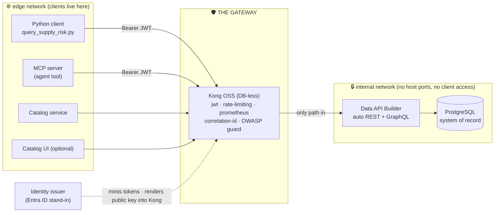
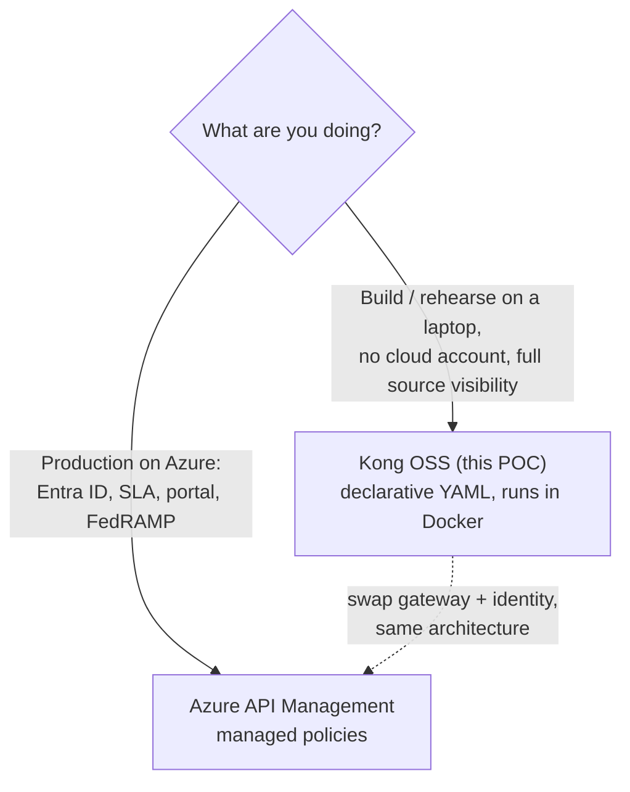

# 🛡️ API Gateways — from Kong OSS to Azure API Management

[Home](../../README.md) > [Documentation](../README.md) > **Concepts · API gateways**

> [!NOTE]
> **TL;DR** — An **API gateway** is a single, governed front door that sits between
> your data/API and everyone who calls it. It checks *who* is calling
> (authentication), *how much* they may call (rate limiting), *what* they took
> (metering), *where* the call goes (routing), and *what happened* (observability).
> In this proof-of-concept the gateway is **Kong OSS**, running locally in Docker.
> The **primary, enterprise story is Azure**, where the same role is played by the
> managed **Azure API Management (APIM)** service. This page teaches the *why*, then
> walks the Kong build, then maps every Kong plugin to its APIM policy so you can see
> the local stack is a faithful rehearsal for the cloud.

> [!WARNING]
> All data, vendor names, and scenarios in this repository are **synthetic** — see
> [`DISCLAIMER.md`](../DISCLAIMER.md). This is an illustrative reference, not an
> official NASA document.

---

## 📑 Table of contents

- [Why a gateway exists at all](#-why-a-gateway-exists-at-all)
- [The five jobs of a gateway](#-the-five-jobs-of-a-gateway)
- [Where the gateway sits in this POC](#-where-the-gateway-sits-in-this-poc)
- [Kong OSS — the local build, plugin by plugin](#-kong-oss--the-local-build-plugin-by-plugin)
- [Worked example: one request through the gateway](#-worked-example-one-request-through-the-gateway)
- [Azure API Management — the managed equivalent](#-azure-api-management--the-managed-equivalent)
- [The plugin → policy map (the heart of this page)](#-the-plugin--policy-map-the-heart-of-this-page)
- [Kong vs APIM: which, when, and why](#-kong-vs-apim-which-when-and-why)
- [Gotchas & troubleshooting](#-gotchas--troubleshooting)
- [Where to next](#-where-to-next)
- [Mini-glossary](#-mini-glossary)

---

## 🤔 Why a gateway exists at all

Imagine you have a database full of valuable records — in this POC, synthetic
**Artemis** SAP-procurement data living in **PostgreSQL** (the *system of record*,
abbreviated **SoR**: the one authoritative place the data lives). Now twenty teams,
two AI agents, and a dashboard all want to read slices of it.

You have two ways to let them in:

1. **Give everyone a database connection.** Fast to start, a disaster to operate.
   Every consumer now knows your schema, your host, and your password. You have no
   single place to say "this caller is allowed, that one isn't," "nobody may pull the
   whole table at once," or "show me who read what last Tuesday." Security, metering,
   and auditing are scattered across twenty clients you don't control. And the moment
   the data physically *moves* into all those clients, you've lost the **zero-move**
   guarantee this whole project is built on (see [`ZERO-MOVE.md`](../ZERO-MOVE.md)).

2. **Put one front door in front of the data and make everyone use it.** That front
   door is the **API gateway**. The database is locked away on a private network; the
   *only* route to a single byte of data is *through* the gateway. Now there is
   exactly one place to enforce identity, limits, metering, and logging — for every
   caller, uniformly.

> **In plain terms:** a gateway is a bouncer, a turnstile, a meter, a receptionist,
> and a security camera — combined into one box that stands at the only door.

> **Why this matters:** the enterprise pattern NASA OCIO is pursuing is *"keep data
> where it lives, broker every call."* The gateway is what makes "broker every call"
> literally true instead of a slogan. The data never leaves Postgres; the gateway
> hands out governed *answers*, not copies of the table.

---

## 🧰 The five jobs of a gateway

Every capability in this POC's gateway maps to one of five jobs. Hold onto these
five — the rest of the page is just "how Kong does each, and how APIM does each."

| # | Job | The question it answers | What goes wrong without it |
|---|---|---|---|
| 1 | **Authentication** | *Who is calling?* | Anyone on the network reads everything. |
| 2 | **Rate limiting** | *How much may they call?* | One client (or a runaway agent) hammers the SoR until it falls over. |
| 3 | **Metering** | *Who took how much?* | No usage accounting, no chargeback, no abuse detection. |
| 4 | **Routing** | *Where does this call go?* | Callers must know internal hostnames; you can't move backends. |
| 5 | **Observability** | *What actually happened?* | No latency data, no per-consumer traffic, no audit trail. |

> [!TIP]
> A useful sixth, hybrid job is **policy enforcement** — applying security rules
> (like the **OWASP API Security Top 10** controls) at the edge. It rides on top of
> the five above: routing decides *which* requests get the policy, authentication
> identifies *who* the policy applies to.

---

## 🗺️ Where the gateway sits in this POC

The architecture is a left-to-right flow: **expose → façade → govern → consume**.
The gateway is the *govern* station, and it is the **only** crossing point between
the public side and the data side.



Two things to notice, because they *are* the proof:

- **Postgres and DAB are on an `internal` Docker network with no host ports.** A
  client on the `edge` network cannot reach them at all. The gateway bridges both
  networks; nothing else does. This is verified by
  [`tests/test_zero_move.py`](../../tests/test_zero_move.py).
- **DAB** (*Data API Builder* — Microsoft's tool that auto-generates a REST + GraphQL
  API over a database, covered in the previous concept) does **not** do
  authentication. It trusts that whatever reaches it is already allowed. That trust
  is only safe *because* the gateway is the sole way to reach it.

> **Why this matters:** separation of concerns. DAB's job is "turn the database into
> an API." The gateway's job is "decide who may use that API and how." Each does one
> thing well, and the network topology makes the division non-optional.

---

## 🔧 Kong OSS — the local build, plugin by plugin

[**Kong Gateway**](https://developer.konghq.com/gateway/) is a popular open-source
API gateway. In this POC it runs **DB-less**, meaning its entire configuration is one
declarative YAML file ([`services/gateway/kong.yml`](../../services/gateway/kong.yml))
instead of a backing database — easy to read, review, and version-control. Kong's
features are delivered as **plugins** you attach to a service or route.

> **In plain terms:** "DB-less declarative" is to Kong what a `docker-compose.yml` is
> to Docker — the whole setup is one file you can read top to bottom and check into
> git.

Here is the actual config, mapped to the five jobs. Each plugin below is copied from
the real file.

### Routing — `services` and `routes`

A **service** is the upstream Kong forwards to; **routes** are the public paths that
map to it.

```yaml
services:
  - name: artemis-dab
    url: http://dab:5000          # the upstream — reachable only on the internal net
    routes:
      - name: artemis-openapi
        paths: [/api/openapi]      # public discovery — no token required
        strip_path: false
      - name: artemis-procurement-api
        paths:                     # the governed data routes
          - /api/Material
          - /api/Vendor
          - /api/PurchaseOrder
          - /api/SupplyRisk
          - /graphql
        strip_path: false
```

> [!NOTE]
> The OpenAPI **contract** (`/api/openapi`) is deliberately a *separate, unprotected*
> route: a data product must be *discoverable* without a token (you can read the menu
> before you order). The actual **data** routes carry the auth + limit plugins. This
> is the "classify and catalog before you gate the data" discipline in action.

### Authentication — the `jwt` plugin (Job 1)

Attached to the data route only:

```yaml
- name: jwt
  config:
    key_claim_name: client_id     # which consumer is this? read it from the token
    run_on_preflight: false       # let CORS answer the browser's preflight first
    claims_to_verify: [exp]       # reject expired tokens
```

A **JWT** (*JSON Web Token* — a signed, tamper-evident token the caller presents as
`Authorization: Bearer <token>`) is minted by the local **identity issuer**
([`services/identity/issuer.py`](../../services/identity/issuer.py)), which stands in
for **Microsoft Entra ID**. On startup the issuer renders its **RS256 public key**
into Kong's config, so Kong can verify that a token was genuinely signed by the
issuer and has not expired. No valid signature → the request is rejected with **401**
at the edge, and *never reaches DAB or Postgres*.

> **In plain terms:** RS256 is signature-by-keypair. The issuer signs with a *private*
> key only it holds; Kong verifies with the matching *public* key. Kong can confirm
> "yes, the issuer made this" without ever being able to forge a token itself.

### Rate limiting — the `rate-limiting` plugin (Job 2)

```yaml
- name: rate-limiting
  config:
    minute: __RATE_LIMIT__        # rendered from RATE_LIMIT_PER_MINUTE (.env) → 60
    policy: local
    limit_by: consumer            # the quota is per-caller, not global
    hide_client_headers: false    # tell the caller how many calls remain
```

Each consumer gets **60 calls/minute** (set by `RATE_LIMIT_PER_MINUTE` in `.env`).
Exceed it and Kong returns **429 Too Many Requests** plus a `Retry-After` header,
*before* the SoR is touched. `limit_by: consumer` is what makes it per-caller — the
`analyst` overspending does not throttle the `artemis-agent`.

### Metering — the `prometheus` plugin (Job 3)

```yaml
plugins:
  - name: prometheus
    config:
      per_consumer: true          # break metrics down by who called
      status_code_metrics: true
      latency_metrics: true
      bandwidth_metrics: true
```

Kong exposes a `/metrics` endpoint that **Prometheus** scrapes and **Grafana**
charts. `per_consumer: true` is the key — it answers *"who took how much,"* the
foundation for chargeback and abuse detection. (Prometheus + Grafana here are the
local analogue of **Azure Monitor / Application Insights**.)

### Observability — the `correlation-id` plugin (Job 5)

```yaml
- name: correlation-id
  config:
    header_name: X-Correlation-ID
    generator: uuid#counter
    echo_downstream: true         # send the id back to the caller too
```

Every request gets a unique **correlation id**, echoed back in the response. The
Python client prints it — which is the visible *proof* that an answer came *through*
the gateway and not from a side door. (You'll see this in the worked example.)

### Policy enforcement — the OWASP guard (`pre-function`)

A small Lua snippet enforces one **OWASP API Security Top 10** control —
**API4:2023, Unrestricted Resource Consumption** — by blocking over-broad pulls:

```lua
local args = kong.request.get_query()
local first = args["$first"]
if first and tonumber(first) and tonumber(first) > 200 then
  return kong.response.exit(400, {
    message = "Over-broad query blocked (OWASP API4): $first exceeds 200",
    max_first = 200
  })
end
```

A caller may page through the data (`$first` up to 200 rows), but an attempt to
siphon the whole dataset in one request is rejected with **400**, again before the
SoR is touched. The full OWASP mapping lives in [`SECURITY.md`](../SECURITY.md).

> [!NOTE]
> The config also strips inbound `X-MS-CLIENT-PRINCIPAL*` / `X-MS-API-ROLE` headers
> via a `request-transformer`. This guarantees every call reaches DAB as the
> `anonymous` role, so DAB's **field-level redaction** of Confidential columns (unit
> cost, net price) can't be bypassed by a forged identity header. Defense in depth:
> the gateway can't be tricked into asking DAB for the privileged view.

---

## 🧪 Worked example: one request through the gateway

This is the end-to-end demo, condensed to three calls that exercise the gateway's
three security verdicts. Run the stack first:

```bash
cp .env.example .env
make demo        # brings the stack up healthy, seeds data, runs the client
```

### 1. No token → 401 (rejected at the edge)

```bash
curl -i "http://localhost:8000/api/SupplyRisk?\$filter=program%20eq%20'Artemis-3'"
```

Expected (abridged):

```http
HTTP/1.1 401 Unauthorized
{"message":"Unauthorized"}
```

**What happened & why:** the `jwt` plugin saw no `Authorization` header and stopped
the request *at Kong*. DAB and Postgres never heard about it — exactly the zero-move,
deny-by-default behavior we want.

### 2. Valid token → 200 (the governed answer)

The supported path is the bundled client, which gets a token from the issuer and
calls *through* Kong:

```bash
python client/query_supply_risk.py --program Artemis-3 --min-delay 30 --consumer analyst
```

Expected (shape — exact rows come from the seeded synthetic data):

```text
  Critical sole-source Artemis-3 materials slipping > 30 days
  TIER  RISK AVG_DLY  MATERIAL                     SUPPLIER
  ----- ---- -------  ---------------------------- ------------------------------
  High    92   118.0  Cryo Valve Assembly          Orion Cryogenics (SYNTHETIC)
  High    88    96.0  RS-25 Turbopump Seal         Stennis Fluid Systems (SYNTHETIC)
  ...

  consumer=analyst  results=N  gateway correlation-id=4f2a...­e91
```

**What happened & why:** the issuer minted an RS256 JWT with `client_id=analyst`;
Kong verified the signature and `exp`, mapped the call to the `analyst` consumer (for
per-consumer metering), forwarded to DAB, and stamped a **correlation id**. That
printed id is your receipt that the answer came *through* the gateway. The Confidential
cost/price columns are absent because DAB redacted them at the source.

### 3. Over the limit → 429 (back-pressure, not collapse)

Fire more than 60 calls in a minute as one consumer:

```bash
for i in $(seq 1 70); do
  curl -s -o /dev/null -w "%{http_code}\n" \
    -H "Authorization: Bearer $TOKEN" \
    "http://localhost:8000/api/SupplyRisk" ;
done | sort | uniq -c
```

Expected:

```text
     60 200
     10 429
```

**What happened & why:** the `rate-limiting` plugin allowed 60, then returned **429**
with a `Retry-After` header for the rest — protecting the SoR from a runaway client,
per consumer.

> **Why this matters:** three lines of `curl` demonstrate the whole governance story
> — *deny by default, allow the authenticated, throttle the greedy* — and in all
> three cases the database was shielded. That is the gateway earning its keep.

---

## ☁️ Azure API Management — the managed equivalent

> [!IMPORTANT]
> **Read the framing.** Local Docker + Kong is the **dev/test loop** — it lets you
> build and rehearse the pattern on your laptop. The **primary enterprise story is
> Azure**, where you deploy the *same architecture* and let Microsoft run the gateway
> for you as **Azure API Management (APIM)**. Everything Kong does by hand, APIM does
> as a managed service with a portal, an SLA, and FedRAMP authorization.

[**Azure API Management**](https://learn.microsoft.com/azure/api-management/api-management-key-concepts)
is Microsoft's managed API gateway. The mental model is identical to Kong — a front
door that authenticates, limits, meters, routes, and observes — but instead of
plugins in a YAML file, you write **policies**: an XML pipeline with `<inbound>`,
`<backend>`, `<outbound>`, and `<on-error>` stages. The reference policy for this POC
lives in [`infra/azure/modules/apim.bicep`](../../infra/azure/modules/apim.bicep) and
is a deliberate 1:1 of the Kong config:

```xml
<policies>
  <inbound>
    <base />
    <validate-azure-ad-token tenant-id="__TENANT_ID__">
      <audiences><audience>api://artemis-api</audience></audiences>
    </validate-azure-ad-token>
    <rate-limit-by-key calls="60" renewal-period="60"
        counter-key="@(context.Subscription?.Id ?? context.Request.IpAddress)" />
    <set-header name="X-Correlation-ID" exists-action="skip">
      <value>@(context.RequestId.ToString())</value>
    </set-header>
  </inbound>
  <backend><base /></backend>
  <outbound><base /></outbound>
  <on-error><base /></on-error>
</policies>
```

Notice the line-by-line parity: `validate-azure-ad-token` is the `jwt` plugin (now
backed by **Entra ID** instead of a local issuer), `rate-limit-by-key` is
`rate-limiting`, and the `X-Correlation-ID` header is the `correlation-id` plugin.
The architecture didn't change — only the *operator* did, from you to Azure.

What APIM additionally gives you, beyond parity (see
[`APIM-CAPABILITIES.md`](../APIM-CAPABILITIES.md) for the full list):

- a built-in **Developer Portal** (the managed twin of this POC's catalog UI),
- **products & subscription keys** for self-service consumer onboarding,
- an **AI gateway** (`llm-token-limit`, `llm-emit-token-metric`) to meter LLM/agent
  traffic the same way you meter API calls, and
- a **self-hosted gateway** option — a managed control plane with the data plane
  running *inside* your boundary (on-prem or Azure Government), which is the
  residency/zero-move enabler for ITAR/CUI workloads.

---

## 🔁 The plugin → policy map (the heart of this page)

This single table is the payoff: every governance control in the local build has a
named Azure analogue, so the Kong demo is a faithful rehearsal for the APIM deploy.

| Job | Kong OSS plugin (built here) | Azure API Management policy | Identity / backing service on Azure |
|---|---|---|---|
| **Authentication** | `jwt` (RS256, local issuer) | `validate-azure-ad-token` | **Microsoft Entra ID** |
| **Rate limiting** | `rate-limiting` (`limit_by: consumer`) | `rate-limit-by-key` (or `quota-by-key`) | per-subscription key |
| **Metering** | `prometheus` (`per_consumer: true`) | `emit-metric` + native analytics | **Azure Monitor / App Insights** |
| **Routing** | `services` + `routes` (YAML) | API + operation definitions | APIM `serviceUrl` → backend |
| **Observability** | `correlation-id` | `set-header` X-Correlation-ID + request tracing | **Log Analytics / Sentinel** |
| **OWASP / size guard** | `pre-function` (`$first > 200`), `request-size-limiting` | `validate-content`, `set-variable`, `choose`, size policies | [OWASP-with-APIM guidance](https://learn.microsoft.com/azure/api-management/mitigate-owasp-api-threats) |
| **Header hygiene** | `request-transformer` (strip principal headers) | `set-header` / `<set-header exists-action="delete">` | — |
| **Caching** | `proxy-cache` | `cache-lookup` / `cache-store` | built-in / external Redis |
| **Catalog / discovery** | catalog service + UI (analogue) | **Developer Portal** + API Center | managed self-service portal |
| **LLM/agent metering** | *(not in OSS build)* | `llm-token-limit`, `llm-emit-token-metric` | AI gateway |

> **Why this matters:** when a stakeholder asks *"does the laptop demo actually
> represent what we'd run in Azure Government?"* the honest answer is **yes, control
> for control** — this table is the receipt. The only things that change on the way
> to Azure are who operates the gateway and which identity provider issues the tokens.

---

## ⚖️ Kong vs APIM: which, when, and why

> [!NOTE]
> Per repo policy the comparison is **vendor-neutral**: Kong (OSS) is the *built*
> path, APIM (managed) is the *Azure* path. No third-party gateways are compared.



| Dimension | Kong OSS (built here) | Azure API Management (Azure path) |
|---|---|---|
| **Who operates it** | You (self-hosted in Docker/K8s) | Microsoft (managed service) |
| **Configuration** | Declarative YAML + Lua plugins | XML policy pipeline + Bicep IaC |
| **Identity** | Local RS256 issuer (Entra stand-in) | Native **Entra ID** |
| **Cost** | Free (compute only) | Tiered; Developer tier ~30–45 min to provision |
| **Self-service portal** | Catalog UI (we built the analogue) | Built-in **Developer Portal** |
| **Compliance / SLA** | DIY | FedRAMP-authorized, SLA-backed |
| **Best for** | Dev loop, edge/residency, no lock-in | Enterprise production, Gov, AI-gateway story |

The point of the POC is precisely that you **don't have to choose blindly**: build and
prove the pattern on Kong for free, then deploy the identical architecture to APIM
when you want a managed, compliant, enterprise front door.

---

## 🧨 Gotchas & troubleshooting

> [!WARNING]
> **Port collisions on a busy dev box.** The gateway binds host port **8000**
> (proxy), **8001** (admin), with the catalog on **8080** and Grafana on **3000** —
> all common ports other tools grab. If `make demo` fails to start or `curl
> localhost:8000` connects to the *wrong* service, remap the host ports in `.env`
> (`KONG_PROXY_PORT`, `KONG_ADMIN_PORT`, `CATALOG_PORT`, `GRAFANA_PORT`) before
> bringing the stack up, and point `KONG_URL` at the new proxy port.

| Symptom | Likely cause | Fix |
|---|---|---|
| `401` even with a token | Token expired, or Kong's rendered public key is stale | The issuer renders its key into Kong on startup — restart the stack so they re-sync. |
| `401` on a *browser* call | CORS preflight hit the `jwt` plugin | Expected to be handled: `run_on_preflight: false` + the `cors` plugin answer the `OPTIONS` first. |
| `429` immediately | A previous run already spent the per-minute quota | Wait for `Retry-After` seconds, or raise `RATE_LIMIT_PER_MINUTE` in `.env`. |
| `400 Over-broad query blocked` | `$first` exceeded 200 (OWASP guard) | Page the data: use `$first<=200` and `$after` cursors. This is working as intended. |
| Connection refused on 8000 | Stack not up, or port remapped/collided | `make demo` / `docker compose --profile core ps`; check the port note above. |
| Confidential columns missing | DAB redacted them for the `anonymous` role | Working as intended — see field-level redaction in [`SECURITY.md`](../SECURITY.md). |
| No data in Grafana | No traffic since the dashboard loaded | Run the client a few times, then refresh; metrics are per-consumer. |

---

## 🧭 Where to next

- **[`ZERO-MOVE.md`](../ZERO-MOVE.md)** — how the network isolation behind the gateway
  is *proven*, not just asserted.
- **[`SECURITY.md`](../SECURITY.md)** — the full token flow, the OWASP API Top 10
  table, and field-level redaction at the data API.
- **[`APIM-CAPABILITIES.md`](../APIM-CAPABILITIES.md)** — everything the managed APIM
  gateway adds over the OSS build (Developer Portal, AI gateway, products).
- **[`APIM-EDITION.md`](../APIM-EDITION.md)** — deploy the APIM edition and click
  through the Developer Portal.
- **[`AZURE-DEPLOYMENT.md`](../AZURE-DEPLOYMENT.md)** — the managed-target mapping and
  reference Bicep, including [`apim.bicep`](../../infra/azure/modules/apim.bicep).
- **[`ARCHITECTURE.md`](../ARCHITECTURE.md)** — the whole flow and the Azure↔OSS map.

---

## 📖 Mini-glossary

| Term | Plain-language meaning |
|---|---|
| **API gateway** | The single governed front door between an API/data and its callers. |
| **Kong OSS** | The open-source gateway built in this POC, configured DB-less via one YAML file. |
| **Azure API Management (APIM)** | Microsoft's *managed* gateway — the Azure equivalent of Kong. |
| **Plugin** (Kong) / **Policy** (APIM) | A unit of gateway behavior (auth, limit, etc.) — Kong calls them plugins, APIM calls them policies. |
| **JWT** | JSON Web Token — a signed bearer token proving who is calling. |
| **RS256** | Sign-with-private-key, verify-with-public-key signature scheme used for the JWTs. |
| **Entra ID** | Microsoft's cloud identity provider; the local issuer stands in for it. |
| **DAB** | Data API Builder — auto-generates the REST/GraphQL API the gateway fronts. |
| **SoR** | System of record — the authoritative data store (here, PostgreSQL). |
| **Rate limiting** | Capping how many calls a consumer may make in a window (here 60/min). |
| **Metering** | Counting per-consumer usage (calls, latency, bytes) for accounting/abuse detection. |
| **Correlation id** | A unique id stamped on each request, proving it traversed the gateway. |
| **Zero-move** | The principle that data never leaves its SoR; the gateway brokers governed answers. |
| **OWASP API Security Top 10** | The standard list of the most critical API security risks. |

---

> [!NOTE]
> **Synthetic data only.** Every figure, vendor, and material above is generated, not
> real NASA procurement data. See [`DISCLAIMER.md`](../DISCLAIMER.md).
