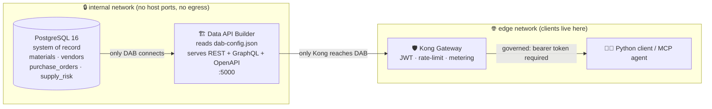

# 🏗️ Data API Builder — auto-generating an API over your database

[Home](../../README.md) > [Documentation](../README.md) > [Concepts](./README.md) > **Data API Builder**

> [!WARNING]
> **Illustrative reference · sample/synthetic data only · not an official NASA
> document.** Every vendor, material, and purchase order here is machine-generated.
> See **[DISCLAIMER.md](../DISCLAIMER.md)** before sharing or adapting.

> [!NOTE]
> **TL;DR** — **Data API Builder (DAB)** is a free Microsoft container that reads a
> small JSON config file and *automatically* serves a full REST **and** GraphQL **and**
> OpenAPI surface over an existing database — no API code to write, test, or maintain.
> In this proof-of-concept (POC) it sits directly on top of **PostgreSQL** and is the
> only thing allowed to read the procurement tables. Everything downstream — the Kong
> gateway, the catalog, the Python client, the agent tool — talks to *DAB's* generated
> API, never to the database. On Azure, the very same container and the very same
> [`dab-config.json`](../../services/dab/dab-config.json) run on **Azure Container Apps**
> in front of a managed database, so what you learn locally transfers one-to-one.

---

## 📑 Table of contents

- [🎯 Why this exists: the problem DAB solves](#-why-this-exists-the-problem-dab-solves)
- [🧩 What Data API Builder actually is](#-what-data-api-builder-actually-is)
- [🔌 Where DAB sits in this POC](#-where-dab-sits-in-this-poc)
- [⚙️ How DAB is configured: a tour of `dab-config.json`](#️-how-dab-is-configured-a-tour-of-dab-configjson)
- [🧪 Worked example: query the auto-API end to end](#-worked-example-query-the-auto-api-end-to-end)
- [🔭 Discovery: the auto-generated OpenAPI contract](#-discovery-the-auto-generated-openapi-contract)
- [🛡️ The redaction boundary (a subtle, important detail)](#️-the-redaction-boundary-a-subtle-important-detail)
- [☁️ The Azure story: DAB on Container Apps](#️-the-azure-story-dab-on-container-apps)
- [🩹 Gotchas & troubleshooting](#-gotchas--troubleshooting)
- [➡️ Where to next](#️-where-to-next)
- [📖 Glossary](#-glossary)

---

## 🎯 Why this exists: the problem DAB solves

Imagine the enterprise reality this POC is modeling. NASA's procurement data lives in
an **SAP** system — a relational **system of record** (**SoR**: the one authoritative
place a given fact lives). An analyst wants to ask, "*which critical, sole-source parts
on Artemis-3 are slipping?*" But the analyst cannot be handed a database login: that
would let them read everything, run expensive queries, and copy data out — the opposite
of governance.

> **In plain terms:** a raw database connection is all-or-nothing. You can't put a
> turnstile, a rate limit, or a "you may read these columns but not those" rule on a
> bare SQL socket. You need an **API** — a controlled front door — in front of the data.

The traditional answer is to *write* that API by hand: a web service with an endpoint
for materials, one for vendors, one for purchase orders; pagination; filtering;
serialization; OpenAPI docs; tests; and a team to maintain it forever. For a marketplace
that wants to expose *dozens* of data products, hand-writing an API per source is the
bottleneck. It is slow, it drifts out of sync with the schema, and every source becomes
a bespoke snowflake.

**Data API Builder removes that bottleneck.** You point it at a database and describe —
in one JSON file — which tables to expose and who may do what. DAB generates the entire
REST + GraphQL + OpenAPI surface at startup. There is no API source code in this repo for
the procurement API, because there is no hand-written API. That is the whole point.

> **Why this matters:** the marketplace pattern is "expose → façade → catalog →
> consume." DAB is the **façade** station — the thing that turns a sleepy database into a
> queryable, documented, standards-based API *without* a custom engineering project per
> source. Cut the cost of exposing a source and you can expose many sources. See
> [`docs/ADD-A-SOURCE.md`](../ADD-A-SOURCE.md) for how a *second* source joins the
> marketplace the same way.

---

## 🧩 What Data API Builder actually is

**Data API Builder (DAB)** is an open-source (MIT-licensed) Microsoft product shipped as
a container image, `mcr.microsoft.com/azure-databases/data-api-builder`. Given a
connection to a supported database (PostgreSQL, Azure SQL / SQL Server, MySQL, Cosmos DB)
and a config file, it serves three things automatically:

| It generates | What that gives a consumer | Open standard? |
| --- | --- | --- |
| **REST endpoints** (one per entity) | `GET /api/Material`, `/api/SupplyRisk`, … with **OData**-style `$filter`, `$select`, `$orderby`, `$first` query options | ✅ OData-flavored REST |
| **A GraphQL endpoint** | A single `/graphql` endpoint with a typed schema, queries, and relationships | ✅ GraphQL |
| **An OpenAPI document** | A machine-readable contract at `/api/openapi` describing every entity and field | ✅ OpenAPI |

> **In plain terms:** you write *configuration*, not *code*. The config says "expose the
> `materials` table as an entity called `Material`, read-only, and hide the unit-cost
> column." DAB does the rest — routing, query parsing, SQL generation, pagination,
> serialization, and docs.

**Acronyms used above**, defined once:

- **REST** — an HTTP API style where each *resource* (here, each table/entity) has a URL
  you `GET` to read.
- **GraphQL** — a query language where the client asks for exactly the fields it wants
  from a single endpoint. See [`docs/GRAPHQL.md`](../GRAPHQL.md) for the GraphQL view of
  the same data.
- **OData** — a convention for putting query options in the URL: `$filter` (which rows),
  `$select` (which columns), `$orderby` (sort), `$first` (page size). DAB speaks an
  OData-style dialect on its REST surface.
- **OpenAPI** — a standard JSON/YAML format that describes an HTTP API so tools (and
  humans) can discover it without reading code.

---

## 🔌 Where DAB sits in this POC

DAB is the second station in the zero-move flow. The database stays put; DAB is the only
process allowed to read it; Kong is the only process allowed to reach DAB; clients reach
only Kong.



The network isolation is enforced in [`docker-compose.yml`](../../docker-compose.yml):
Postgres and DAB attach **only** to the `internal` network, which is declared
`internal: true` (no outbound egress) and publishes **no host ports**. Kong is the single
service bridged to both `internal` and `edge`. That is what makes "zero-move" a *proven*
property and not a slogan — see [`docs/ZERO-MOVE.md`](../ZERO-MOVE.md) and the test
[`tests/test_zero_move.py`](../../tests/test_zero_move.py).

> **Why this matters:** DAB being unreachable except through Kong is the linchpin of the
> governance story. If a consumer could hit DAB directly on `:5000`, they would bypass
> the JWT check, the rate limit, the metering, and the OWASP guard. The network topology
> guarantees they cannot.

---

## ⚙️ How DAB is configured: a tour of `dab-config.json`

Everything DAB does in this POC is declared in one file:
[`services/dab/dab-config.json`](../../services/dab/dab-config.json). Let's read it
top-to-bottom — each block teaches one DAB concept.

### 1️⃣ The data source — *where* the data lives

```json
"data-source": {
  "database-type": "postgresql",
  "connection-string": "@env('DAB_CONNECTION_STRING')",
  "options": {}
}
```

`database-type` tells DAB which SQL dialect to generate. The connection string is **not**
hard-coded — `@env('DAB_CONNECTION_STRING')` pulls it from an environment variable at
runtime. Compose injects it in [`docker-compose.yml`](../../docker-compose.yml):

```text
DAB_CONNECTION_STRING=Host=postgres;Port=5432;Database=procurement;Username=artemis;Password=…
```

> **In plain terms:** the *same* config file works locally and in Azure because the only
> environment-specific thing — the connection string — is read from the environment, not
> baked in. This is exactly how the Azure Container Apps deployment swaps in a managed
> database connection without editing the file (see the [Azure section](#️-the-azure-story-dab-on-container-apps)).

### 2️⃣ The runtime — *how* the API behaves

```json
"runtime": {
  "rest":    { "enabled": true, "path": "/api" },
  "graphql": { "enabled": true, "path": "/graphql", "allow-introspection": true },
  "host": {
    "cors": { "origins": ["*"], "allow-credentials": false },
    "authentication": { "provider": "StaticWebApps" },
    "mode": "development"
  }
}
```

- `rest.path: "/api"` → REST entities live under `/api/...` (so `/api/SupplyRisk`).
- `graphql.path: "/graphql"` with **introspection** on → tools can auto-discover the
  GraphQL schema.
- `authentication.provider: "StaticWebApps"` → DAB trusts a specific set of identity
  headers to decide a caller's *role*. **This is deliberate and load-bearing** — it is
  what lets Kong control which DAB role a request runs as. We return to it in the
  [redaction boundary](#️-the-redaction-boundary-a-subtle-important-detail) section.
- `mode: "development"` → richer error messages and introspection, appropriate for a
  demo. In production you would set `production` to reduce information disclosure.

> [!TIP]
> `allow-introspection: true` and `mode: "development"` are great for a demo and for the
> catalog UI, but both leak schema detail. When you promote to a real environment, turn
> introspection off and set `mode: "production"`.

### 3️⃣ The entities — *which* tables become API resources

This is the heart of the file. Each key under `entities` is a logical API name mapped to
a physical table, with REST + GraphQL toggles and **permissions**. Here is the
`SupplyRisk` entity (the one the headline query hits), trimmed for clarity:

```json
"SupplyRisk": {
  "source": { "object": "supply_risk", "type": "table" },
  "rest":    { "enabled": true },
  "graphql": { "enabled": true, "type": { "singular": "SupplyRisk", "plural": "SupplyRisks" } },
  "permissions": [
    { "role": "anonymous", "actions": ["read"] }
  ]
}
```

What each piece means:

| Field | Meaning in this POC |
| --- | --- |
| `source.object: "supply_risk"` | The Postgres table this entity reads from. |
| `source.type: "table"` | It's a plain table (DAB also supports `view` and `stored-procedure`). |
| `rest` / `graphql` `enabled` | Expose this entity on both surfaces. |
| `graphql.type` | The GraphQL type names — `SupplyRisk` / `SupplyRisks`. |
| `permissions[].role: "anonymous"` | The role applied when no privileged identity header is present. |
| `permissions[].actions: ["read"]` | **Read-only.** No create/update/delete is ever generated. |

> **Why read-only matters:** a *marketplace* data product is for *consuming* the SoR, not
> mutating it. By granting only `read`, DAB never generates a write path — there is no
> `POST`/`PATCH`/`DELETE` for a consumer to find or abuse. Governance by omission.

### 4️⃣ Field-level permissions — *which columns* a role may see

Two entities go further and **exclude** sensitive columns from the `anonymous` role. From
`Material` and `PurchaseOrder`:

```json
"Material": {
  "source": { "object": "materials", "type": "table" },
  "permissions": [
    { "role": "anonymous",
      "actions": [ { "action": "read", "fields": { "exclude": ["std_unit_cost_usd"] } } ] },
    { "role": "authenticated", "actions": ["read"] }
  ]
}
```

```json
"PurchaseOrder": {
  "source": { "object": "purchase_orders", "type": "table", "key-fields": ["ebeln", "ebelp"] },
  "permissions": [
    { "role": "anonymous",
      "actions": [ { "action": "read", "fields": { "exclude": ["netpr", "netwr"] } } ] },
    { "role": "authenticated", "actions": ["read"] }
  ]
}
```

Read this carefully — it encodes the project's **classify-before-expose** discipline:

- The **`anonymous`** role can read materials but **not** `std_unit_cost_usd` (unit
  cost), and can read purchase orders but **not** `netpr` / `netwr` (net price / net
  value). Those are the columns the classification manifest
  [`data/classification.yml`](../../data/classification.yml) labels as sensitive.
- The **`authenticated`** role *would* see the un-redacted columns — but, as we'll see,
  no gateway call ever reaches DAB *as* `authenticated`. That makes redaction the
  guaranteed default, not an accident.
- `PurchaseOrder` also declares `key-fields: ["ebeln", "ebelp"]` because that table has a
  **composite primary key** (order number + line item). DAB needs to know the key to
  generate stable per-item URLs.

> **In plain terms:** DAB lets you say "this role may read these columns but never those."
> Classification (in `classification.yml`) decides *what* is sensitive; this config
> *enforces* it at the API boundary, before the data leaves the database.

The full file declares four entities, all read-only:

| Entity | Table | Redacted from `anonymous` |
| --- | --- | --- |
| `Material` | `materials` | `std_unit_cost_usd` |
| `Vendor` | `vendors` | *(none)* |
| `PurchaseOrder` | `purchase_orders` | `netpr`, `netwr` |
| `SupplyRisk` | `supply_risk` | *(none — it's a derived risk view)* |

---

## 🧪 Worked example: query the auto-API end to end

Let's prove DAB really did generate a working OData REST API. We'll ask the POC's
headline question: *which **Critical**, **sole-source** materials on **Artemis-3** have an
**average delay > 30 days**?* — ranked by risk.

> [!NOTE]
> All calls below go **through Kong** (`http://localhost:8000`), never to DAB directly —
> DAB has no host port. The `KONG_URL` and `IDENTITY_URL` defaults match
> [`client/query_supply_risk.py`](../../client/query_supply_risk.py). The exact row
> values come from the seeded synthetic data (`seed=42`); your numbers will match the
> seed, not the example text.

### Step 1 — get a bearer token (stands in for Microsoft Entra ID)

```bash
curl -s http://localhost:8081/token \
  -H 'content-type: application/json' \
  -d '{"consumer":"analyst"}'
```

**Expected (shape):**

```json
{ "access_token": "eyJhbGciOiJSUzI1Ni␣…", "token_type": "Bearer", "expires_in": 3600 }
```

*What this did:* the local identity issuer (`services/identity/issuer.py`) signed an
RS256 JWT for the `analyst` consumer. Kong will validate it against the issuer's published
public key. In Azure this step is a call to **Entra ID** for an OAuth2 token — same bearer
pattern.

### Step 2 — call DAB's `SupplyRisk` entity through Kong with an OData filter

```bash
TOKEN=$(curl -s http://localhost:8081/token -H 'content-type: application/json' \
  -d '{"consumer":"analyst"}' | python -c "import sys,json;print(json.load(sys.stdin)['access_token'])")

curl -s -G "http://localhost:8000/api/SupplyRisk" \
  --data-urlencode "\$filter=program eq 'Artemis-3' and criticality eq 'Critical' and sole_source eq true and avg_delay_days gt 30" \
  --data-urlencode "\$orderby=risk_score desc" \
  -H "Authorization: Bearer $TOKEN" \
  -i | sed -n '1,12p'
```

**Expected (shape — headers then body):**

```text
HTTP/1.1 200 OK
X-Correlation-ID: 7b1f…-…-…           ← stamped by Kong: proof the call went through the gateway
X-RateLimit-Remaining-Minute: 59      ← Kong is metering this consumer
Content-Type: application/json

{ "value": [
    { "matnr": "…", "maktx": "… (SYNTHETIC)", "program": "Artemis-3",
      "criticality": "Critical", "sole_source": true,
      "avg_delay_days": 4x.x, "risk_score": 8x, "risk_tier": "High" },
    …
] }
```

*What this did, line by line:*

1. **`$filter=program eq 'Artemis-3' and criticality eq 'Critical' and sole_source eq true
   and avg_delay_days gt 30`** — DAB parsed this OData expression and translated it into a
   parameterized SQL `WHERE` clause against the `supply_risk` table. You did not write any
   SQL; DAB generated it from the URL.
2. **`$orderby=risk_score desc`** → `ORDER BY risk_score DESC`. The highest-risk parts
   come first.
3. The response envelope is `{ "value": [ … ] }` — the OData convention for a collection.
4. The **`X-Correlation-ID`** header is added by Kong's `correlation-id` plugin. Its
   presence is the visible proof the request was brokered by the gateway, not pulled
   straight from the database.

> [!TIP]
> Why `--data-urlencode` and the leading `\$`? The `$` would otherwise be eaten by your
> shell, and spaces in the filter must be percent-encoded as `%20`. The Python client
> handles this for you by building the query string into the URL directly — DAB's OData
> parser rejects the `+`-for-space encoding that a naive params dict produces (see the
> comment in [`client/query_supply_risk.py`](../../client/query_supply_risk.py)).

### Step 3 — the friendly path: let the client do it

```bash
python client/query_supply_risk.py --program Artemis-3 --min-delay 30
```

**Expected (shape):**

```text
🔎 Artemis-3 supply risk (Critical, sole-source, avg delay > 30d) — via Kong (corr-id 7b1f…)
  #1  MATNR …  "… (SYNTHETIC)"  risk 8x (High)  avg delay 4x.xd  — supplier: … (SYNTHETIC) (CAGE …)
  #2  …
✅ Data never left Postgres; brokered through Kong.
```

*What this did:* the client fetched a token (Step 1), called `SupplyRisk` through Kong
(Step 2), then **enriched** each high-risk part with its supplier by calling
`PurchaseOrder` → `Vendor` — also through Kong — and printed the gateway correlation id.
Three different DAB entities, one governed path, zero direct database access.

> **Why this matters:** an analyst answered a real mission question by composing
> auto-generated endpoints over OData filters. Nobody wrote a "supply risk" API. DAB
> generated it; Kong governed it; the answer is sourced, dated, and traceable to a
> correlation id.

---

## 🔭 Discovery: the auto-generated OpenAPI contract

A marketplace data product must be *findable without tribal knowledge*. DAB emits an
**OpenAPI** document describing every entity and field automatically:

```bash
curl -s http://localhost:8000/api/openapi | python -m json.tool | sed -n '1,20p'
```

**Expected (shape):**

```json
{
  "openapi": "3.0.1",
  "info": { "title": "Data API builder - REST Endpoint", "version": "…" },
  "paths": {
    "/Material": { "get": { … } },
    "/SupplyRisk": { "get": { … } },
    …
  }
}
```

*What this did:* DAB introspected the database and its own config to produce a complete
API contract. The catalog service ([`services/catalog/app.py`](../../services/catalog/app.py))
serves this — proxied through Kong — alongside the owner, classification, and request
path, so a newcomer can discover the data product without asking anyone.

> [!NOTE]
> Look closely at Kong's routing in [`services/gateway/kong.yml`](../../services/gateway/kong.yml):
> `/api/openapi` is a **public** route (no token) because the *contract* is metadata that
> aids discovery, while `/api/Material`, `/api/Vendor`, `/api/PurchaseOrder`,
> `/api/SupplyRisk`, and `/graphql` are the **governed** routes (JWT + rate-limit + OWASP
> guard). Publishing the contract openly while gating the data is exactly the marketplace
> discipline: *advertise what exists, control who reads it.*

In Azure, this discovery role is played by **Microsoft Purview** (catalog +
classification) and the **API Center / APIM developer portal** (the published API
contract). The mechanism differs; the discipline is identical.

---

## 🛡️ The redaction boundary (a subtle, important detail)

Recall the config grants the **`authenticated`** role un-redacted columns and the
**`anonymous`** role the redacted view. With `provider: "StaticWebApps"`, DAB decides a
caller's role from special inbound headers (`X-MS-CLIENT-PRINCIPAL`, `X-MS-API-ROLE`,
etc.). A clever client could *forge* those headers to try to get the privileged role and
read unit costs and net prices.

The POC closes this hole **at the gateway**. Kong's `request-transformer` plugin
([`services/gateway/kong.yml`](../../services/gateway/kong.yml)) **strips** any
client-supplied identity headers before proxying to DAB:

```yaml
- name: request-transformer
  config:
    remove:
      headers:
        - X-MS-CLIENT-PRINCIPAL
        - X-MS-CLIENT-PRINCIPAL-ID
        - X-MS-CLIENT-PRINCIPAL-NAME
```

> **In plain terms:** no matter what a client sends, every request reaches DAB as the
> `anonymous` role. So the field-level exclusions (`std_unit_cost_usd`, `netpr`, `netwr`)
> are *guaranteed*, not merely default. The redaction is enforced by the gateway, layered
> on top of DAB's own permission model — defense in depth.

> **Why this matters:** it shows the division of labor the whole architecture rests on —
> **DAB enforces read-only + field-level rules; Kong enforces identity, rate, metering,
> and which DAB role you may act as.** Neither alone is enough; together they are the
> governed surface. See [`docs/SECURITY.md`](../SECURITY.md) for the full threat model.

---

## ☁️ The Azure story: DAB on Container Apps

Here is the payoff and the reason this POC is Azure-first: **the local DAB container and
the local `dab-config.json` are the production artifacts.** To run the same façade in
Azure, you deploy the *same image* to **Azure Container Apps (ACA)** in front of a managed
database. Nothing about the entities, permissions, or query semantics changes.

> **In plain terms:** locally, `docker compose` runs the DAB container against Postgres.
> In Azure, **Container Apps** is the serverless host that runs that exact container, and
> a managed **Azure Database for PostgreSQL Flexible Server** (or Azure SQL) is the
> system of record. The dev loop and the cloud deployment use the same building blocks.

### Local component → Azure managed service

| Local (this POC) | Azure-Gov managed equivalent | What carries over unchanged |
| --- | --- | --- |
| DAB container in Compose | **Azure Container Apps** running `mcr.microsoft.com/azure-databases/data-api-builder` | The image; `dab-config.json` at `/App/dab-config.json` |
| `DAB_CONNECTION_STRING` env var | ACA **secret** (`secretref`) → `DATABASE_CONNECTION_STRING` env var | The `@env(...)` indirection in the config |
| PostgreSQL 16 container | **Azure Database for PostgreSQL Flexible Server** (or Azure SQL) | The relational SoR; DAB still just reads it |
| Kong in front of DAB | **Azure API Management** in front of ACA | JWT validation, rate-limit, metering policies |
| Local RS256 issuer | **Microsoft Entra ID** | The bearer-token pattern |
| `internal` Docker network | ACA ingress set to **internal** + VNet integration | DAB unreachable except via the gateway |

### How the deploy works (per Microsoft Learn)

The official path is straightforward and mirrors the local setup:

1. **Build a custom image** that bakes `dab-config.json` into `/App/dab-config.json` —
   exactly what [`services/dab/Dockerfile`](../../services/dab/Dockerfile) already does —
   and push it to **Azure Container Registry (ACR)**.
2. **Create a Container App** from that image with **target port 5000** (DAB's listen
   port — the same port the local healthcheck hits).
3. **Inject the connection string as a secret**, surfaced to the container as the
   `DATABASE_CONNECTION_STRING` environment variable via `secretref` — the cloud analogue
   of the local `@env('DAB_CONNECTION_STRING')` indirection.
4. **Use a system-assigned managed identity** so the Container App pulls from ACR and (for
   Azure SQL) connects to the database **without storing any password** — the connection
   string carries no credentials.

> [!TIP]
> The single most important takeaway: because the connection string is read from the
> environment, **the config file is environment-agnostic.** The same JSON that runs
> locally runs in commercial Azure at FedRAMP High. You change *where* it runs and *what
> database it points at* — never the API definition.

> [!NOTE]
> **Posture note (Azure-Gov).** The primary deployment target is **commercial (global)
> Azure at FedRAMP High**, where the full managed stack — APIM + Container Apps + managed
> PostgreSQL/SQL + Entra + Purview + Azure Databricks with managed Unity Catalog — is
> available. The managed-Unity-Catalog / Databricks-SQL gap is the
> **Azure-Government (ITAR/strict-CUI) exception**, not the default. DAB on Container Apps
> is available in both. See [`docs/AZURE-DEPLOYMENT.md`](../AZURE-DEPLOYMENT.md) and the
> live walkthrough in [`docs/AZURE-LIVE-DEPLOYMENT.md`](../AZURE-LIVE-DEPLOYMENT.md).

> [!WARNING]
> **Microsoft Fabric / OneLake are explicitly excluded** — they are not available in
> Azure Government / GCC High. The data-platform layer uses **Azure Databricks + ADLS
> Gen2 + Delta Lake + Synapse** instead. DAB is unaffected: it fronts the operational SoR,
> not the analytics lakehouse.

---

## 🩹 Gotchas & troubleshooting

| Symptom | Likely cause | Fix |
| --- | --- | --- |
| `400 Bad Request` on a filter with spaces | Shell or client encoded spaces as `+`; DAB's OData parser rejects `+` | Percent-encode spaces as `%20` (use `--data-urlencode`); the Python client builds the URL directly to avoid this |
| `$` vanished from your `curl` filter | The shell expanded `$filter` as a variable | Escape it (`\$filter`) or single-quote the URL |
| Got more columns than expected / saw `netpr` | A forged `X-MS-*` identity header reached DAB | Confirm requests go **through Kong** — the `request-transformer` strips those headers; DAB direct is not a supported path |
| DAB healthcheck fails on startup | DAB can't reach Postgres yet | Compose uses `depends_on: condition: service_healthy`; check the `DAB_CONNECTION_STRING` and that the seeder ran |
| Empty `{ "value": [] }` for the headline query | Wrong seed, or data not loaded | Re-run `make seed` (deterministic at `seed=42`); confirm ≈11 High-tier rows exist |
| `401 Unauthorized` calling `/api/SupplyRisk` | No/invalid bearer token | Fetch a token from the issuer first; only `/api/openapi` is token-free |
| GraphQL introspection blocked | `mode: "production"` or introspection disabled | For the demo keep `mode: "development"` and `allow-introspection: true` |

---

## ➡️ Where to next

- **[`docs/ZERO-MOVE.md`](../ZERO-MOVE.md)** — how DAB's network isolation is *proven*,
  not just claimed.
- **[`docs/GRAPHQL.md`](../GRAPHQL.md)** — the GraphQL view of the same auto-generated
  surface.
- **[`docs/ADD-A-SOURCE.md`](../ADD-A-SOURCE.md)** — onboarding a *second* data source the
  same config-driven way.
- **[`docs/SECURITY.md`](../SECURITY.md)** — the JWT/OAuth2 flow and OWASP API controls at
  the gateway, including the redaction boundary in depth.
- **[`docs/ARCHITECTURE.md`](../ARCHITECTURE.md)** — the full Azure ↔ OSS mapping and the
  end-to-end flow.
- **[`docs/AZURE-DEPLOYMENT.md`](../AZURE-DEPLOYMENT.md)** — the managed-services target
  architecture in detail.
- The config itself: **[`services/dab/dab-config.json`](../../services/dab/dab-config.json)**
  and the container build **[`services/dab/Dockerfile`](../../services/dab/Dockerfile)**.

---

## 📖 Glossary

| Term | Definition |
| --- | --- |
| **Data API Builder (DAB)** | Open-source Microsoft container that auto-generates REST + GraphQL + OpenAPI over a database from a config file. |
| **Entity** | A logical API resource in DAB config, mapped to a table, view, or stored procedure. |
| **System of record (SoR)** | The single authoritative source for a piece of data — here, the Postgres procurement tables (modeling SAP). |
| **REST** | HTTP API style where each resource has a URL you `GET` to read. |
| **GraphQL** | Query language letting a client request exactly the fields it needs from one endpoint. |
| **OData** | URL convention for query options: `$filter`, `$select`, `$orderby`, `$first`. DAB's REST surface speaks an OData-style dialect. |
| **OpenAPI** | Standard machine-readable description of an HTTP API, used for discovery and tooling. |
| **Introspection** | A GraphQL feature letting clients query the schema itself; convenient but schema-revealing. |
| **Role (anonymous / authenticated)** | DAB permission scope; this POC always reaches DAB as `anonymous` (redacted) because Kong strips identity headers. |
| **Field-level permission** | DAB rule including/excluding specific columns per role (here, hiding cost/price columns). |
| **Azure Container Apps (ACA)** | Serverless container host on Azure; runs the DAB image in the cloud deployment. |
| **Azure Container Registry (ACR)** | Azure-hosted private registry for the custom DAB image. |
| **Managed identity** | Azure identity attached to a resource so it authenticates to other services without stored secrets. |
| **`@env(...)`** | DAB config function that reads a value (e.g., the connection string) from an environment variable at runtime. |

---

> _All data in this POC is **synthetic** and machine-generated for demonstration. It is
> not real NASA procurement data. See [`docs/DISCLAIMER.md`](../DISCLAIMER.md)._
