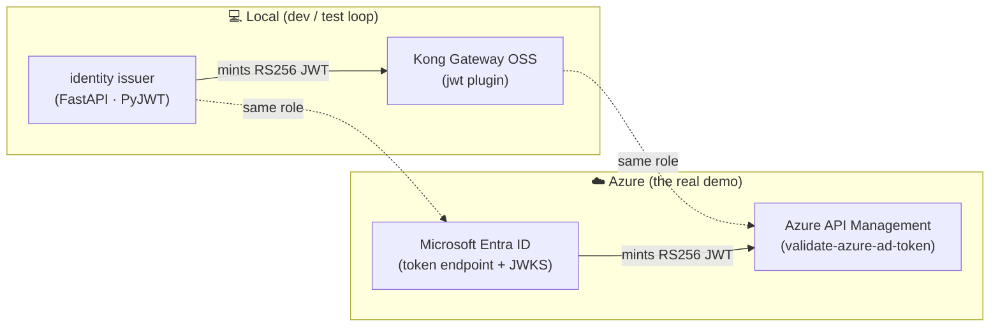
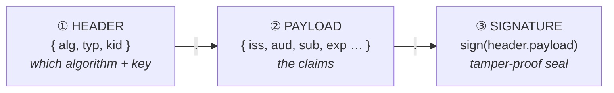
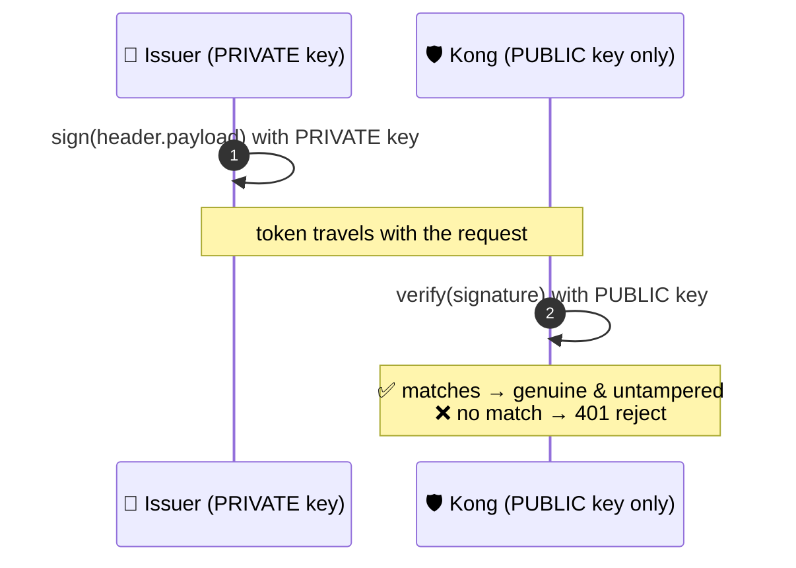
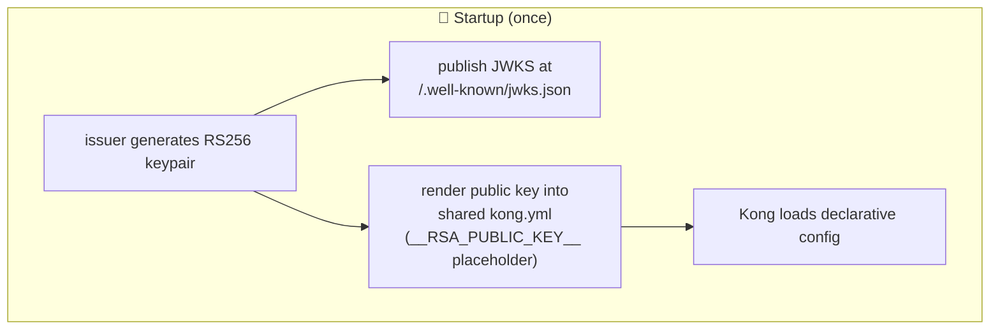
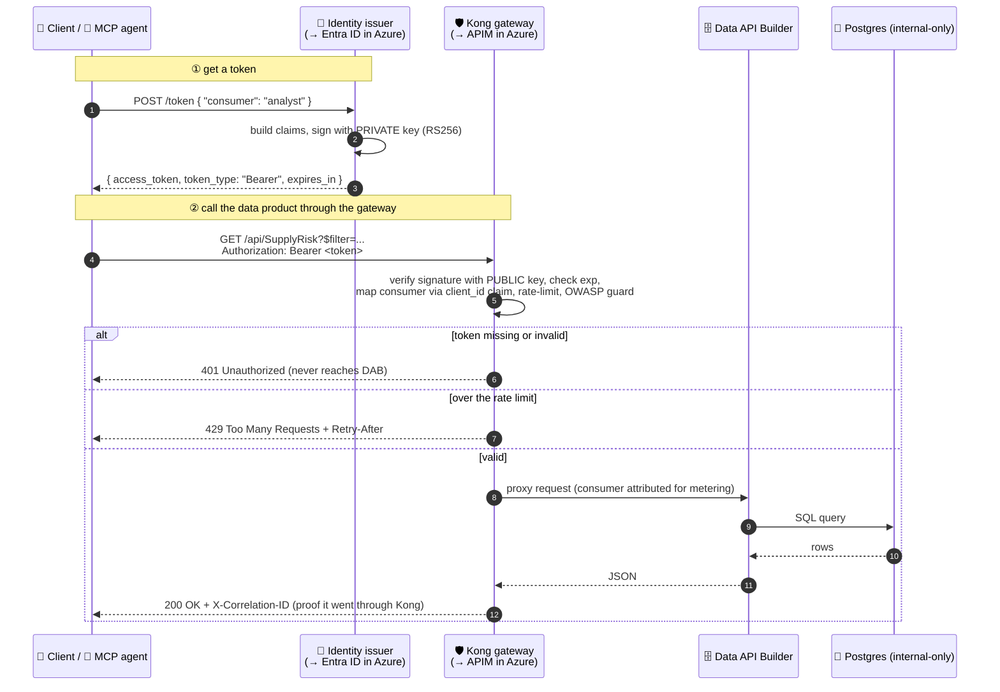
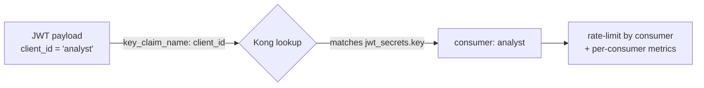

# 🔐 Identity for APIs: OAuth2, JWT, RS256, and the Gateway Handshake

[Home](../../README.md) > [docs](../README.md) > [concepts](./README.md) > **04 · Identity (JWT / OAuth2)**

> [!NOTE]
> **TL;DR** — Every governed call in this proof-of-concept (POC) carries a **bearer
> token**: a short-lived, cryptographically-signed credential. The token is a **JWT**
> (JSON Web Token). It is signed with **RS256** (RSA + SHA-256) by an **identity
> issuer**, and **Kong** (the gateway) verifies that signature *before* the request is
> ever allowed near the data. In Azure, the local issuer becomes **Microsoft Entra ID**
> and Kong becomes **Azure API Management (APIM)** — the *pattern is identical*, only
> the products change. This page teaches that pattern from zero: what a bearer token is,
> what a JWT actually contains, why RS256/JWKS matter, and exactly how a token is minted,
> presented, and validated. We finish by decoding a real token field-by-field.

> [!IMPORTANT]
> All data and identities in this repo are **synthetic** — no real NASA data, no real
> users, no real secrets. See [`docs/DISCLAIMER.md`](../DISCLAIMER.md). The keys here are
> generated locally at runtime and never committed.

---

## 📑 Contents

- [Why identity exists at all](#-why-identity-exists-at-all-the-problem)
- [The vocabulary, defined once](#-the-vocabulary-defined-once)
- [Azure first: where this runs for real](#-azure-first-where-this-runs-for-real)
- [What a JWT actually is](#-what-a-jwt-actually-is-three-base64-chunks)
- [RS256 and why it beats a shared password](#-rs256-and-why-it-beats-a-shared-password)
- [JWKS: how the verifier gets the key](#-jwks-how-the-verifier-gets-the-public-key)
- [The full handshake, end to end](#-the-full-handshake-end-to-end)
- [Worked example: mint, present, validate](#-worked-example-mint-present-validate)
- [Decoded-JWT walkthrough (field by field)](#-decoded-jwt-walkthrough-field-by-field)
- [How Kong maps a token to a consumer](#-how-kong-maps-a-token-to-a-consumer)
- [The local issuer ↔ Microsoft Entra ID map](#-the-local-issuer--microsoft-entra-id-map)
- [Gotchas / troubleshooting](#-gotchas--troubleshooting)
- [Where to next](#-where-to-next)

---

## 🎯 Why identity exists at all (the problem)

Imagine the enterprise story behind this POC: a NASA-style procurement database holds
sensitive Artemis supply-chain records. Analysts and automated agents need to ask it
questions — *"which critical, sole-source parts on Artemis-3 are running late?"* — but the
database must **never** be exposed directly, and we must always know **who** asked, **how
much** they asked for, and be able to **cut them off** if they abuse it.

That is three distinct needs, and they map to three distinct security questions:

| Question | Security term | In plain terms |
| --- | --- | --- |
| *Who are you?* | **Authentication** | Prove your identity. |
| *What are you allowed to do?* | **Authorization** | Decide what that identity may access. |
| *Can I prove later who did what?* | **Accountability / audit** | Attribute every call to an identity. |

> **In plain terms:** authentication is showing your badge at the door; authorization is
> whether the badge opens *this particular* door; accountability is the badge reader's log
> that records every swipe.

A naive design would put a username and password on every request. That fails badly: the
password travels on every call (more chances to leak it), the data service has to store
and check passwords (now *it* is a juicy target), and rotating a leaked password means
touching every client. The industry settled on a better shape decades ago, and it is what
we use here: **OAuth2 bearer tokens**.

> **Why this matters:** in this POC the entire "zero-move" promise — data never leaves
> Postgres, every access is brokered — depends on the gateway being able to *trust* the
> caller without ever seeing a password. Tokens make that possible. If you understand
> tokens, you understand how the gateway can be the single, enforceable front door.

---

## 📖 The vocabulary, defined once

Every term below is used throughout this doc and the rest of the repo. Read it once; refer
back as needed.

| Term | Stands for | One-line definition |
| --- | --- | --- |
| **OAuth2** | Open Authorization 2.0 | The industry-standard framework for issuing and using access tokens instead of passwords. |
| **Bearer token** | — | A token where "whoever *bears* (holds) it, may use it" — like cash. Sent in the `Authorization: Bearer <token>` HTTP header. |
| **JWT** | JSON Web Token (say "jot") | A specific, self-describing token format: signed JSON you can decode and verify offline. |
| **Claim** | — | One fact inside a JWT (e.g. *who* the token is for, *when* it expires). |
| **Issuer** (IdP) | Identity Provider | The service that mints tokens and signs them. Here: a tiny local service; in Azure: **Microsoft Entra ID**. |
| **RS256** | RSA Signature with SHA-256 | An *asymmetric* signing algorithm: a **private** key signs, a **public** key verifies. |
| **JWKS** | JSON Web Key Set | A public document that publishes the issuer's public key(s) so verifiers can fetch them. |
| **kid** | Key ID | A label on the token and in the JWKS so a verifier knows *which* public key to use. |
| **Gateway** | — | The single policy-enforcing front door. Here: **Kong OSS**; in Azure: **API Management**. |
| **Consumer** | — | A registered caller identity at the gateway (here: `analyst`, `artemis-agent`). |

> [!TIP]
> "Bearer" is the key intuition. A bearer token is like a movie ticket: the usher does not
> care *who* you are, only that the ticket is genuine and not expired. That is why tokens
> are **short-lived** and travel over **HTTPS** — a stolen ticket is only useful until it
> expires.

---

## ☁️ Azure first: where this runs for real

This POC runs locally under `docker compose` so you can develop and test the *whole*
pattern on a laptop. But the **primary story is Azure** — local OSS components are stand-ins
chosen so each one has a clean managed-service analogue. Identity is the layer where that
mapping is sharpest:



The crucial point for a newcomer: **OAuth2 + JWT + RS256 is not Kong-specific or
Azure-specific.** It is an open standard. The local issuer mints exactly the kind of token
Entra mints; Kong validates it exactly the way APIM validates an Entra token. So everything
you learn locally transfers directly to the Azure deployment — which is precisely why the
POC is built this way. (See [`docs/AZURE-DEPLOYMENT.md`](../AZURE-DEPLOYMENT.md) for the
managed mapping and [`infra/azure/modules/apim.bicep`](../../infra/azure/modules/apim.bicep)
for the real APIM policy.)

> **Why this matters:** when you demo this to a stakeholder, you can run the laptop
> version live, then point at the Bicep and say "the Azure version is the same policy,
> validating a real Entra token." No conceptual gap.

---

## 🧩 What a JWT actually is: three Base64 chunks

A JWT is just a string with **three parts separated by dots**:

```text
<header> . <payload> . <signature>
```

Each part is **Base64URL-encoded** (a URL-safe variant of Base64 — it is *encoding*, not
*encryption*, so anyone can decode and read it; the security comes from the signature, not
secrecy of the payload).



1. **Header** — metadata: the signing algorithm (`alg`), the type (`typ: JWT`), and the
   key id (`kid`) telling the verifier which public key to use.
2. **Payload** — the **claims**: structured facts about the token (who it's for, who issued
   it, when it expires, and any custom fields).
3. **Signature** — a cryptographic seal over `header.payload`. Change a single character in
   the header or payload and the signature no longer matches — the token is rejected.

> **In plain terms:** the header and payload are like the printed text on a check; the
> signature is the bank's anti-fraud watermark. You can read the check freely, but you
> cannot alter the amount without invalidating the watermark.

> [!WARNING]
> A JWT is **signed, not encrypted** (unless you add JWE, which we do not). Never put
> secrets — passwords, raw PII — in a JWT payload. Anyone who holds the token can read it.
> What they *cannot* do is forge or tamper with it.

---

## 🔑 RS256 and why it beats a shared password

There are two families of token-signing algorithms, and the choice has real architectural
consequences:

| | **HS256 (symmetric)** | **RS256 (asymmetric)** — *what we use* |
| --- | --- | --- |
| Keys | **One** shared secret | A **keypair**: private (sign) + public (verify) |
| Who can sign | Anyone who has the secret | **Only** the holder of the private key |
| Who can verify | Anyone who has the secret | **Anyone** with the public key |
| Risk if verifier is breached | Verifier's secret can also *forge* tokens | Verifier only has the **public** key — cannot forge anything |

This POC uses **RS256** deliberately. The issuer holds the **private** key and is the only
party that can *mint* tokens. Kong holds only the **public** key, so it can *verify*
tokens but could never forge one — even if Kong were fully compromised, an attacker still
could not mint a valid token. That separation is exactly how Microsoft Entra ID works:
Entra signs with private keys it never shares, and every relying party (including APIM)
verifies with Entra's published public keys.



In code, the issuer generates a 2048-bit RSA keypair at startup and signs with the private
half ([`services/identity/issuer.py:78`](../../services/identity/issuer.py) generates the
key; line 197 signs the token with `algorithm="RS256"`). The Kong config is given only the
**public** key ([`services/gateway/kong.yml:140`](../../services/gateway/kong.yml), the
`rsa_public_key` field).

> **Why this matters:** "the verifier cannot forge tokens" is the property that lets you
> put the gateway at the untrusted edge of the network. The blast radius of a compromised
> gateway is bounded — it cannot manufacture identities.

---

## 📡 JWKS: how the verifier gets the public key

If Kong needs the issuer's public key to verify tokens, how does it *get* it? Two ways,
both standard:

1. **JWKS endpoint** — the issuer publishes its public key(s) as JSON at a well-known URL,
   `/.well-known/jwks.json`. A verifier fetches it, matches on `kid`, and caches it. This
   is how Entra ID and APIM work in production (Entra publishes a JWKS; APIM/`validate-azure-ad-token`
   fetches it automatically).
2. **Static configuration** — the public key is placed directly into the verifier's config.

This POC does both, and the reason is instructive. The issuer publishes a real JWKS at
`/.well-known/jwks.json` (and the raw PEM at `/public.pem`) so the *pattern* is faithful —
see [`services/identity/issuer.py:170`](../../services/identity/issuer.py). But because
Kong runs DB-less from a declarative file, the issuer **also renders the live public key
straight into Kong's config at startup**, so Kong has the key without a network round-trip.



The mechanic: `kong.yml` ships with a literal placeholder `__RSA_PUBLIC_KEY__`
([`services/gateway/kong.yml:140`](../../services/gateway/kong.yml)). At startup the issuer
reads the template, substitutes the live public key, and writes the effective config to a
shared volume ([`services/identity/issuer.py:95`](../../services/identity/issuer.py), the
`_render_kong` function). This is why **no key material is ever committed to git** — the key
is generated fresh and injected at runtime.

> [!NOTE]
> The JWKS itself (`services/identity/issuer.py:120`–`138`) encodes the RSA public key as
> its modulus (`n`) and exponent (`e`) in Base64URL — that is just the standard wire format
> for an RSA public key inside a JWKS. The `kid` (`artemis-local-key-1`) ties a key in the
> set to the `kid` stamped in each token's header, so a verifier always knows which key to
> use even when several are published during a rotation.

---

## 🔄 The full handshake, end to end

Now assemble the pieces into the actual request lifecycle. This is what happens every time
the client or the MCP agent asks a question:



Note what is **enforced at the edge**: a missing/invalid/expired token never reaches Data
API Builder (DAB) or Postgres — Kong returns `401` itself. This is the heart of the
"zero-move, gateway-is-the-only-door" design: Postgres and DAB sit on an internal Docker
network with no published path; the JWT check is the lock on the only door. (See
[`docs/ZERO-MOVE.md`](../ZERO-MOVE.md) and `tests/test_zero_move.py`.)

---

## 🧪 Worked example: mint, present, validate

Bring the stack up first (see [`README.md`](../../README.md) quickstart):

```bash
cp .env.example .env
make demo
```

> [!TIP]
> Default host ports here are `8081` (issuer) and `8000` (Kong proxy). If those collide on
> your machine, remap them in `.env` (`ISSUER_PORT`, `KONG_PROXY_PORT`) before
> `make demo`, and substitute your ports in the commands below.

### Step 1 — Mint a token

```bash
curl -s -X POST http://localhost:8081/token \
  -H 'Content-Type: application/json' \
  -d '{"consumer": "analyst"}'
```

Expected output (the token is abbreviated — yours will be a long string):

```json
{
  "access_token": "eyJhbGciOiJSUzI1NiIsImtpZCI6ImFydGVtaXMtbG9jYWwta2V5LTEiLCJ0eXAiOiJKV1QifQ.eyJpc3MiOiJodHRwczovL2lzc3Vlci5sb2NhbCIsImF1ZCI6ImFydGVtaXMtYXBpIiwic3ViIjoiYW5hbHlzdCIsImNsaWVudF9pZCI6ImFuYWx5c3QiLCJpYXQiOjE3...","token_type": "Bearer",
  "expires_in": 3600,
  "consumer": "analyst"
}
```

**What just happened:** you asked the issuer (standing in for Entra ID) for a token for the
`analyst` consumer. It built the claims, signed them RS256 with its private key, and
returned a 1-hour bearer token. Notice it never asked for a password — in the real Azure
flow, Entra would have authenticated the caller first; here the POC trusts the named
consumer to keep the demo simple.

### Step 2 — Call the data product *through Kong* with the token

```bash
TOKEN=$(curl -s -X POST http://localhost:8081/token \
  -H 'Content-Type: application/json' \
  -d '{"consumer":"analyst"}' | python -c "import sys,json;print(json.load(sys.stdin)['access_token'])")

curl -s -i "http://localhost:8000/api/SupplyRisk?\$filter=program%20eq%20'Artemis-3'&\$first=2" \
  -H "Authorization: Bearer $TOKEN"
```

Expected (headers + a JSON body):

```http
HTTP/1.1 200 OK
Content-Type: application/json
X-Correlation-ID: 7c3f...-3      ← proof the call went through Kong
RateLimit-Remaining: 59

{ "value": [ { "matnr": "...", "program": "Artemis-3", "risk_score": ... } ] }
```

**What just happened:** Kong received the request, **verified the RS256 signature** with the
issuer's public key, confirmed the token had not expired, mapped the call to the `analyst`
consumer (via the `client_id` claim), counted it against that consumer's rate limit, and
only *then* proxied to DAB. The `X-Correlation-ID` header is Kong's fingerprint — its
presence proves the data was brokered, not fetched directly.

### Step 3 — Prove the door is locked (no token → 401)

```bash
curl -s -o /dev/null -w "%{http_code}\n" \
  "http://localhost:8000/api/SupplyRisk?\$first=1"
```

Expected output:

```text
401
```

**What just happened:** with no `Authorization` header, Kong rejected the request *at the
edge* with `401 Unauthorized`. DAB and Postgres never saw it. This is the same behavior
APIM's `validate-azure-ad-token` policy gives you in Azure.

> [!TIP]
> The Python client [`client/query_supply_risk.py`](../../client/query_supply_risk.py)
> does exactly Steps 1–2 programmatically: `get_token()` mints the token, then every data
> call goes to `KONG_URL` with `Authorization: Bearer <token>`. It never knows the Postgres
> address — it *can't*, by design.

---

## 🔬 Decoded-JWT walkthrough (field by field)

Let's crack open a token. You can decode any JWT yourself — split on the dots and Base64URL-decode
the first two parts:

```bash
# Decode the HEADER (first dot-segment) of a token in $TOKEN
echo "$TOKEN" | cut -d. -f1 | base64 -d 2>/dev/null; echo
# Decode the PAYLOAD (second dot-segment)
echo "$TOKEN" | cut -d. -f2 | base64 -d 2>/dev/null; echo
```

> [!NOTE]
> Base64URL drops the `=` padding, so `base64 -d` may print a warning or need padding
> added; the JSON is still readable. Online decoders like jwt.io do this for you, but
> **never paste a real production token into a third-party site.** These synthetic POC
> tokens are safe.

### The header

```json
{
  "alg": "RS256",
  "kid": "artemis-local-key-1",
  "typ": "JWT"
}
```

| Field | Value | What it tells the verifier |
| --- | --- | --- |
| `alg` | `RS256` | Verify the signature using RSA + SHA-256. Kong is configured to expect exactly this — a token claiming `alg: none` or `HS256` is rejected. |
| `kid` | `artemis-local-key-1` | Use the public key with this id. It matches the `kid` in the JWKS, so the verifier picks the right key even mid-rotation. |
| `typ` | `JWT` | The token type. |

### The payload (the claims)

This is exactly what the issuer builds in
[`services/identity/issuer.py:188`](../../services/identity/issuer.py):

```json
{
  "iss": "https://issuer.local",
  "aud": "artemis-api",
  "sub": "analyst",
  "client_id": "analyst",
  "iat": 1718000000,
  "nbf": 1718000000,
  "exp": 1718003600
}
```

| Claim | Stands for | Meaning | Why it's checked |
| --- | --- | --- | --- |
| `iss` | Issuer | Who minted the token (`https://issuer.local`; in Azure, your Entra tenant). | A verifier accepts tokens only from issuers it trusts. |
| `aud` | Audience | Who the token is *for* (`artemis-api`). | A token minted for a different API must be rejected here — prevents token reuse across services. |
| `sub` | Subject | The principal the token represents (the `analyst` consumer). | The "who" for audit/accountability. |
| `client_id` | — | **Custom claim** — the consumer id Kong keys on for metering. | This POC's bridge between identity and per-consumer rate-limiting (see next section). |
| `iat` | Issued At | Unix timestamp when minted. | Lets verifiers reason about token age. |
| `nbf` | Not Before | Token is invalid before this time. | Guards against premature use. |
| `exp` | Expiry | Unix timestamp when the token dies (here `iat + 3600`s). | **Kong explicitly verifies `exp`** — an expired token → `401`. This is why bearer tokens are safe to pass around: they self-destruct. |

> **In plain terms:** `iss` is the bank that printed the check, `aud` is the payee name,
> `sub` is the account holder, and `exp` is the "void after" date. A verifier checks all of
> these *plus* the signature before honoring the token.

> [!IMPORTANT]
> In `kong.yml`, the `jwt` plugin sets `claims_to_verify: [exp]`
> ([`services/gateway/kong.yml:44`](../../services/gateway/kong.yml)) — so even a perfectly
> signed token is rejected once expired. In Azure, `validate-azure-ad-token` checks `exp`
> *and* the configured `audiences` automatically.

### The signature

The third segment is the RS256 signature over `base64url(header) + "." + base64url(payload)`.
You cannot read it — it is raw bytes. Kong recomputes the expected signature using the
public key and compares. Equal → genuine; not equal → forged or tampered → `401`.

---

## 🗺️ How Kong maps a token to a consumer

A subtle but important design point. Kong needs to attribute each call to a **consumer** so
it can meter and rate-limit *per caller* (so the `analyst` and the `artemis-agent` have
separate quotas and separate Grafana lines). How does Kong know which consumer a token
belongs to?

It is told to look at the **`client_id`** claim:

```yaml
# services/gateway/kong.yml — the jwt plugin
- name: jwt
  config:
    key_claim_name: client_id   # ← read the consumer id from THIS claim
    claims_to_verify:
      - exp
```

And each registered consumer's `jwt_secrets.key` matches the value that will appear in that
claim ([`services/gateway/kong.yml:135`](../../services/gateway/kong.yml)):

```yaml
consumers:
  - username: analyst
    jwt_secrets:
      - key: analyst            # ← matches client_id="analyst"
        algorithm: RS256
        rsa_public_key: "__RSA_PUBLIC_KEY__"
  - username: artemis-agent
    jwt_secrets:
      - key: artemis-agent
        algorithm: RS256
        rsa_public_key: "__RSA_PUBLIC_KEY__"
```



So both consumers trust the *same* issuer public key — Kong distinguishes them purely by the
`client_id` claim. The issuer guarantees `client_id == sub == the consumer name` for the two
allowed consumers ([`services/identity/issuer.py:49`](../../services/identity/issuer.py),
the `ALLOWED_CONSUMERS` set, and line 192 where the claim is set).

> **Why this matters:** this is identity *driving* governance. The same token that proves
> "you are the analyst" is what the gateway uses to enforce "the analyst gets 60 calls a
> minute, metered separately." Authentication and metering share one source of truth.

---

## 🔁 The local issuer ↔ Microsoft Entra ID map

Everything you have seen locally has a one-to-one managed equivalent. This is the table to
remember when you move to Azure:

| Concern | Local (this POC) | Azure (the real demo) |
| --- | --- | --- |
| **Token issuer** | FastAPI issuer minting RS256 JWTs | **Microsoft Entra ID** token endpoint |
| **Public-key publication** | `/.well-known/jwks.json` + rendered into `kong.yml` | Entra's published JWKS (fetched automatically) |
| **Token validation** | Kong `jwt` plugin | APIM `validate-azure-ad-token` policy |
| **Audience check** | `aud: artemis-api` | `<audience>api://artemis-api</audience>` ([`infra/azure/modules/apim.bicep`](../../infra/azure/modules/apim.bicep)) |
| **Expiry check** | `claims_to_verify: [exp]` | Built into `validate-azure-ad-token` |
| **Per-caller rate limit** | `rate-limiting` `limit_by: consumer` | `rate-limit-by-key` keyed on subscription/caller |
| **Signing keys** | Local RSA keypair, runtime-generated | Entra-managed keys, auto-rotated |

> **In plain terms:** locally you *run* a tiny identity provider so you can see every moving
> part; in Azure you *consume* a fully-managed one (Entra) and let APIM do the validation.
> The token shape, the claims, the RS256 signature, the JWKS handshake — all unchanged.

> [!NOTE]
> One thing Azure gives you for free that the POC simplifies: in production, Entra
> authenticates the *human or service principal* (with MFA, conditional access, etc.) before
> issuing a token. The local issuer skips that step and trusts the named consumer — fine for
> a demo, never for production. The *consumption* side (validate signature, check `aud`/`exp`,
> meter per caller) is identical.

---

## 🪤 Gotchas / troubleshooting

| Symptom | Likely cause | Fix |
| --- | --- | --- |
| `401 Unauthorized` on a data route | No `Authorization` header, malformed `Bearer <token>`, or expired token. | Re-mint the token (Step 1); ensure the header is exactly `Authorization: Bearer <token>`. |
| `401` even with a fresh token | Kong's rendered public key doesn't match the issuer's current key (e.g. issuer regenerated its key but Kong didn't reload). | Restart the stack so the issuer re-renders `kong.yml` and Kong reloads it. |
| `429 Too Many Requests` | You exceeded the per-consumer minute cap (`RATE_LIMIT_PER_MINUTE`, default 60). | Wait for `Retry-After` seconds, or raise the cap in `.env`. Not an auth error. |
| `400 Over-broad query blocked` | You asked for `$first > 200` — the OWASP guard, *not* auth. | Page with `$first <= 200`. See [`docs/SECURITY.md`](../SECURITY.md). |
| Token decodes but signature "looks wrong" | You tried to verify HS256-style with a shared secret. | RS256 verifies with the **public** key (`/public.pem` or the JWKS `n`/`e`), never a secret. |
| Connecting straight to `dab:5000` or Postgres works in a test | You're inside the internal Docker network. | From a *client*, it must not — that's what `tests/test_zero_move.py` enforces. |

> [!WARNING]
> Treat even synthetic tokens as bearer credentials in the habit you build: send them only
> over HTTPS in real deployments, keep TTLs short, and never log full tokens. The POC uses
> a 1-hour TTL (`TOKEN_TTL_SECONDS`) to model this.

---

## 🧭 Where to next

- 🛡️ **[`services/gateway/README.md`](../../services/gateway/README.md)** — the full Kong
  plugin chain (jwt, rate-limit, OWASP guard, correlation-id, cors, cache).
- 🔐 **[`services/identity/README.md`](../../services/identity/README.md)** — the issuer's
  endpoints, config, and Kong-rendering mechanic.
- 🚫 **[`docs/ZERO-MOVE.md`](../ZERO-MOVE.md)** — why the JWT check is the lock on the only
  door, and how the test proves it.
- 🔒 **[`docs/SECURITY.md`](../SECURITY.md)** — the OWASP API controls layered on top of auth.
- ☁️ **[`docs/AZURE-DEPLOYMENT.md`](../AZURE-DEPLOYMENT.md)** &
  **[`infra/azure/modules/apim.bicep`](../../infra/azure/modules/apim.bicep)** — the Entra +
  APIM realization of this exact pattern.
- 🏛️ **[`docs/ARCHITECTURE.md`](../ARCHITECTURE.md)** — where identity sits in the whole
  zero-move data-marketplace design.

---

> [!IMPORTANT]
> Reminder: all identities, keys, and data in this repo are **synthetic** and generated for
> demonstration only. See [`docs/DISCLAIMER.md`](../DISCLAIMER.md).
