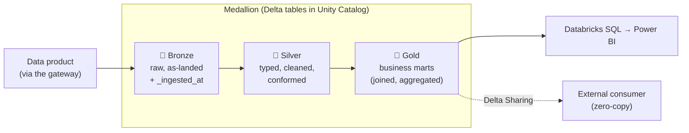
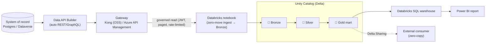

# 🏞️ The Lakehouse, Explained — Delta Lake, Medallion, Unity Catalog & Delta Sharing on Azure Databricks

[Home](../../README.md) > [Documentation](../README.md) > [Concepts](./README.md) > **The lakehouse (Azure Databricks)**

> [!WARNING]
> **Illustrative reference · sample/synthetic data only · not an official NASA
> document.** Every vendor, material, price, and date in this guide is fabricated.
> See **[DISCLAIMER.md](../DISCLAIMER.md)** before sharing or adapting.

> [!NOTE]
> **TL;DR** — A *lakehouse* is one place that does both cheap storage (a data
> *lake*) and reliable, governed tables (a data *warehouse*). On Azure it is
> **Azure Databricks** sitting on **ADLS Gen2** storage. Data is stored as
> **Delta Lake** tables, refined in three tiers — **Bronze → Silver → Gold**
> (the *medallion*) — governed by **Unity Catalog**, queried by **Databricks
> SQL**, and shared without copying via **Delta Sharing**. In this POC the
> lakehouse is **just another governed consumer**: it reads the data product
> *through the gateway* (zero-move) and never touches the source database
> directly.

---

## 📑 Table of contents

- [Why this chapter exists](#-why-this-chapter-exists)
- [The problem: lakes, warehouses, and why we want both](#-the-problem-lakes-warehouses-and-why-we-want-both)
- [Azure Databricks: the managed lakehouse](#-azure-databricks-the-managed-lakehouse)
- [Delta Lake: tables you can trust on cheap storage](#-delta-lake-tables-you-can-trust-on-cheap-storage)
- [The medallion: Bronze → Silver → Gold](#-the-medallion-bronze--silver--gold)
- [Unity Catalog: one governance layer over everything](#-unity-catalog-one-governance-layer-over-everything)
- [Databricks SQL: serving the Gold mart](#-databricks-sql-serving-the-gold-mart)
- [Delta Sharing: zero-copy data sharing](#-delta-sharing-zero-copy-data-sharing)
- [How THIS POC feeds the lakehouse — zero-move through the gateway](#-how-this-poc-feeds-the-lakehouse--zero-move-through-the-gateway)
- [Worked example: build the medallion end-to-end](#-worked-example-build-the-medallion-end-to-end)
- [Gotchas & troubleshooting](#-gotchas--troubleshooting)
- [Where to next](#-where-to-next)

---

## 🎯 Why this chapter exists

The earlier concept chapters got a single governed answer out of the system — a
client or AI agent asks *"which Critical, sole-source Artemis-3 materials are
running more than 30 days late?"* and the gateway returns the answer without the
data ever leaving its source. That is great for **one question at a time**.

But an enterprise mission program does not run on one question. It runs on
**dashboards, trend reports, what-if analysis, and machine-learning models** —
work that needs to scan millions of rows, join many tables, and let dozens of
analysts query at once. That is the job of a **data platform**, and the modern
form of a data platform is the **lakehouse**.

This chapter teaches the lakehouse from zero, then shows the one idea that ties
it back to the rest of this POC: **the lakehouse consumes the *data product*
through the gateway, not the database**. So the zero-move guarantee you proved
for the CLI and the AI agent holds for the entire analytics platform too.

> **Why this matters (the enterprise story):** "Deploy to Azure to show the full
> art of the possible" means more than a working API. It means an analyst opens
> Power BI, a data scientist trains a model, and a partner agency receives a live
> feed — all from the *same governed product*, all auditable, and none of it
> requiring a bulk copy of sensitive procurement data. The lakehouse is where
> that story becomes a platform.

---

## 🧩 The problem: lakes, warehouses, and why we want both

To understand a lakehouse you first need the two things it merges. Historically
organizations had to choose between them, and the choice hurt.

A **data lake** is just a giant, cheap folder of files in cloud object storage —
on Azure that storage is **ADLS Gen2** (*Azure Data Lake Storage Generation 2*, a
blob store with a folder hierarchy). You can throw anything into it: CSVs, JSON,
Parquet, images, logs. It is dirt cheap and scales infinitely.

- **In plain terms:** a data lake is a hard drive in the sky. Wonderful for
  hoarding raw data; terrible at answering "did this number change correctly?"
- **The catch:** plain files have **no transactions**. If two jobs write the same
  folder at once, or a job crashes halfway, readers can see half-written
  garbage. There is no `UPDATE`, no `DELETE`, no schema enforcement, no "undo".

A **data warehouse** is the opposite: a managed database tuned for analytics
(think Azure Synapse, Snowflake, or classic SQL Server marts). It gives you
reliable transactions (**ACID** — *Atomicity, Consistency, Isolation,
Durability*, the four properties that make a database trustworthy), fast SQL,
and strict schemas.

- **The catch:** warehouses are expensive, they store data in a proprietary
  format you can only reach through that vendor's engine, and they are awkward
  for raw/unstructured data and machine learning.

| Property | 🪣 Data lake (files on ADLS) | 🏛️ Data warehouse (e.g. Synapse) | 🏞️ Lakehouse (Databricks) |
|---|---|---|---|
| Storage cost | Very low | High | **Very low** (uses the lake) |
| ACID transactions | ❌ None | ✅ Yes | ✅ **Yes** (via Delta) |
| Open file format | ✅ Yes | ❌ Proprietary | ✅ **Yes** (Parquet/Delta) |
| Good for ML / raw data | ✅ Yes | ❌ Awkward | ✅ **Yes** |
| Fast governed SQL | ❌ No | ✅ Yes | ✅ **Yes** (Databricks SQL) |
| Schema enforcement | ❌ No | ✅ Yes | ✅ **Yes** |

> **In plain terms:** a **lakehouse** keeps the lake's cheap open storage **and**
> bolts on the warehouse's reliability and SQL. You stop choosing. That "bolt-on"
> is **Delta Lake**, and the managed product that runs it on Azure is **Azure
> Databricks**.

---

## ☁️ Azure Databricks: the managed lakehouse

**Azure Databricks** is a first-party Azure service (jointly engineered by
Microsoft and Databricks) that provides the compute and governance for a
lakehouse, with your data living in **your own ADLS Gen2 storage account**. You
do not run servers; you create a *workspace*, attach *compute* (clusters or SQL
warehouses) when you need it, and it auto-stops when idle.

A few terms you will meet immediately:

| Term | What it is | In plain terms |
|---|---|---|
| **Workspace** | The Databricks environment for a team — notebooks, jobs, catalogs, compute | Your "instance" of Databricks |
| **Cluster** | A pool of VMs that run notebook/Spark code | The engine for ETL and ML |
| **SQL warehouse** | Compute tuned for SQL queries (serverless or pro) | The engine BI tools connect to |
| **Notebook** | A document of mixed markdown + runnable code cells | Where you write the pipeline |
| **Spark** | The distributed engine under the hood (process huge datasets in parallel) | The "scan millions of rows" muscle |

> [!NOTE]
> **Posture for this POC (read this — it is a hard constraint).** The managed
> platform — **Azure Databricks with managed Unity Catalog + Databricks SQL +
> Delta Lake + Delta Sharing on ADLS Gen2** — runs in **commercial Azure at
> FedRAMP High**, and that is the **default**. The managed-Unity-Catalog /
> Databricks-SQL gap applies **only** to **Azure Government** (ITAR / strict-CUI),
> where OSS Unity Catalog or Microsoft Purview is the fallback. **Microsoft
> Fabric / OneLake are explicitly excluded** — they are not available in Azure
> Government / GCC, so this pattern uses Databricks + ADLS + Delta instead. See
> [`AZURE-DEPLOYMENT.md`](../AZURE-DEPLOYMENT.md).

This repo already targets a real, Unity-Catalog-enabled workspace so you do not
have to provision one to learn:

| Property | Value (reference workspace) |
|---|---|
| Workspace | `dbw-btfabric-dev` (premium / Unity Catalog) |
| URL | `https://adb-7405607213468698.18.azuredatabricks.net` |
| Reference catalog | `dbw_btfabric_dev` |

The reference infrastructure-as-code to stand up a *new* one
([`infra/azure/modules/databricks.bicep`](../../infra/azure/modules/databricks.bicep))
provisions exactly three things — a **premium workspace** (premium tier is
required for Unity Catalog), an **ADLS Gen2 storage account** (with
`isHnsEnabled: true`, the hierarchical namespace that makes it Gen2), and an
**access connector** (a managed identity Databricks uses to reach the storage).

---

## 🔼 Delta Lake: tables you can trust on cheap storage

**Delta Lake** is the open table format that turns a folder of files into a
real, transactional table. A Delta table on disk is just **Parquet data files**
(Parquet is a compressed, columnar file format — great for analytics) plus a
**transaction log** (a `_delta_log/` folder of JSON commit records).

That transaction log is the magic. Because every change is recorded as an atomic
commit, Delta gives the lake the warehouse properties it was missing:

- **ACID transactions** — a reader never sees a half-written job; concurrent
  writes are coordinated.
- **`UPDATE` / `DELETE` / `MERGE`** — you can correct and upsert data, not just
  append (impossible on raw files).
- **Schema enforcement & evolution** — bad-shaped data is rejected; intended
  schema changes are tracked.
- **Time travel** — query the table *as of* a past version or timestamp
  (`SELECT ... VERSION AS OF 3`), which makes audits and "what changed?" trivial.

> **In plain terms:** Delta is "git for your tables." Every write is a tracked
> commit, you can roll back, and two people editing at once do not corrupt the
> file.

> **Why this matters:** for a procurement audit you must be able to say *exactly*
> what the supply-risk numbers were on a given date and prove nothing was
> silently changed. Delta's transaction log + time travel give you that for free.

In this POC, every table the notebook writes is Delta. You can see it directly in
the ingestion code — the `.write.format("delta")` call is what makes it a Delta
table rather than a loose file:

```python
# databricks/notebooks/01_zero_move_medallion.ipynb — landing Bronze
(
    df.withColumn("_ingested_at", F.current_timestamp())
    .write.format("delta")              # <- this is what makes it Delta, not raw files
    .mode("overwrite")
    .option("overwriteSchema", "true")
    .saveAsTable(f"{CATALOG}.bronze.{table}")
)
```

---

## 🥉🥈🥇 The medallion: Bronze → Silver → Gold

Raw data is messy; dashboards need clean, joined, business-ready tables. The
**medallion architecture** is the standard pattern for getting from one to the
other in disciplined, named stages. Each stage is a set of Delta tables, and each
adds quality:



| Tier | Purpose | What it looks like here | In plain terms |
|---|---|---|---|
| 🥉 **Bronze** | Land the source exactly as received, add lineage columns | `bronze.vendors`, `bronze.materials`, `bronze.supply_risk`, `bronze.purchase_orders` (each gets `_ingested_at`) | "Photocopy the incoming mail before touching it" |
| 🥈 **Silver** | Type, clean, rename, conform | `silver.supply_risk`, `silver.purchase_orders`, `silver.vendors` — strings `CAST` to `INT`/`DOUBLE`/`DATE`/`BOOLEAN`, columns renamed (`ebeln → po_number`) | "Tidy the data into a consistent shape" |
| 🥇 **Gold** | Business-ready marts: joined + aggregated for a question | `gold.artemis_supply_risk` (materials × suppliers × risk) and `gold.delay_trend` (monthly trend) | "The exact table the dashboard reads" |

You can see the discipline directly in the notebook. Silver does the casting and
renaming so downstream SQL is identical regardless of where Bronze came from:

```sql
-- Silver: raw SAP-shaped strings become typed, business-named columns
CREATE OR REPLACE TABLE ${CATALOG}.silver.supply_risk AS
SELECT
  CAST(matnr AS STRING)          AS material_id,
  CAST(criticality AS STRING)    AS criticality,
  CAST(sole_source AS BOOLEAN)   AS sole_source,
  CAST(avg_delay_days AS DOUBLE) AS avg_delay_days,
  CAST(risk_score AS INT)        AS risk_score
FROM ${CATALOG}.bronze.supply_risk;
```

Gold then joins the three Silver tables into the single mart Power BI consumes:

```sql
-- Gold: the supply-risk mart (materials × suppliers × risk), the dashboard's source
CREATE OR REPLACE TABLE ${CATALOG}.gold.artemis_supply_risk AS
SELECT r.program, r.material_name, r.criticality, r.sole_source,
       r.avg_delay_days, r.risk_score, r.risk_tier,
       v.vendor_name, v.cage_code,
       COALESCE(p.total_value_usd, 0) AS total_committed_usd
FROM ${CATALOG}.silver.supply_risk r
LEFT JOIN ( /* aggregated purchase orders per material */ ) p ON r.material_id = p.material_id
LEFT JOIN ${CATALOG}.silver.vendors v ON p.vendor_id = v.vendor_id;
```

> **Why three tiers and not one big query?** Each tier is independently
> debuggable, re-runnable, and reusable. If a dashboard number looks wrong you can
> inspect Silver to see if the *data* is bad or Gold to see if the *logic* is bad.
> Bronze is your untouched evidence. Many Gold marts can be built from the same
> Silver — you clean once, serve many.

---

## 🛡️ Unity Catalog: one governance layer over everything

So far we have tables. **Unity Catalog (UC)** is what makes them *governed*. It is
Databricks' central governance layer — a single place that controls **who can see
and do what**, plus **discovery, lineage, and auditing** across every workspace in
your account.

UC organizes everything in a **three-level namespace**:

```text
catalog . schema . table
   │         │        └── e.g. artemis_supply_risk
   │         └────────────  e.g. gold  (also: bronze, silver)
   └──────────────────────  e.g. dbw_btfabric_dev
```

That is why every table reference in this POC is three parts, like
`dbw_btfabric_dev.gold.artemis_supply_risk`. The notebook creates the
**schemas** (the medallion tiers) inside an existing catalog:

```python
# databricks/notebooks/01_zero_move_medallion.ipynb
spark.sql(f"USE CATALOG {CATALOG}")
for layer in ("bronze", "silver", "gold"):
    spark.sql(f"CREATE SCHEMA IF NOT EXISTS {CATALOG}.{layer}")
```

What Unity Catalog gives you that loose tables never could:

- **Fine-grained access control** — grant `SELECT` on `gold` to analysts while
  Bronze stays locked to the data-engineering team; even row- and column-level
  rules.
- **Data lineage** — UC tracks that `gold.artemis_supply_risk` was built from the
  three `silver` tables, which came from `bronze`. Auditors can trace any number
  back to its source.
- **Discovery + documentation** — tables carry comments, so the mart shows up
  with a description (the notebook runs `COMMENT ON TABLE ... IS 'Synthetic
  Artemis supply-risk mart ...'`).
- **Audit logs** — every query and grant is recorded.

> **In plain terms:** Unity Catalog is the lakehouse's bouncer, librarian, and
> security camera in one — it decides who gets in, helps people find the right
> table, and records everything.

| Local OSS analogue in this POC | Azure managed equivalent | What it governs |
|---|---|---|
| `data/classification.yml` applied at seed (column sensitivity labels) | **Microsoft Purview** / **Unity Catalog** | Classify data *before* exposure |
| Postgres column comments + catalog service entry | **Unity Catalog** table comments + lineage | Discovery & documentation |

> **Why this matters:** governance does not stop at the API gateway. The same
> *classify-before-exposure* posture you set with `classification.yml` continues
> into the lakehouse via Unity Catalog — so a sensitive column is controlled
> whether it is read by the CLI, the AI agent, **or** an analyst in Databricks.

---

## 🏬 Databricks SQL: serving the Gold mart

Notebooks and clusters are for *building* data. **Databricks SQL** is for
*serving* it. A **SQL warehouse** is compute optimized for SQL queries that
business tools — **Power BI**, Tableau, or the built-in SQL editor — connect to
over a standard endpoint. Serverless warehouses **auto-stop when idle**, so you
are not billed while nobody is querying.

The Gold mart is the same answer the CLI and AI agent return — now queryable in
SQL by anyone with access:

```sql
-- databricks/sql/dbsql_samples.sql — the headline mission question, in Databricks SQL
USE CATALOG dbw_btfabric_dev;   -- change to your Unity Catalog

SELECT program, material_name, vendor_name, risk_tier, risk_score,
       avg_delay_days, total_committed_usd
FROM gold.artemis_supply_risk
WHERE program = 'Artemis-3' AND criticality = 'Critical' AND sole_source = TRUE
  AND avg_delay_days > 30
ORDER BY risk_score DESC;
```

Power BI then connects to the warehouse's **Server hostname + HTTP path**, imports
`gold.artemis_supply_risk` and `gold.delay_trend`, and builds the supply-risk
report — see [`POWERBI-GUIDE.md`](../POWERBI-GUIDE.md). More sample queries
(risk distribution, sole-source exposure, monthly trend) live in
[`databricks/sql/dbsql_samples.sql`](../../databricks/sql/dbsql_samples.sql).

| Local OSS analogue | Azure managed equivalent |
|---|---|
| Prometheus + Grafana (per-consumer metering & latency) | **Azure Monitor + Microsoft Sentinel** |
| Catalog service (FastAPI) | **Databricks SQL** + **Unity Catalog** discovery |

---

## 🔗 Delta Sharing: zero-copy data sharing

The final piece extends zero-move *out of your organization*. **Delta Sharing**
is an **open protocol** for sharing live Delta tables with other people, teams, or
agencies **without copying the data**. You publish a *share*; the recipient
queries it directly from their own tools and always sees current data — no
nightly export, no FTP drop, no stale snapshot.

```sql
-- The notebook does this best-effort (skips gracefully if sharing isn't enabled)
CREATE SHARE IF NOT EXISTS artemis_supply_risk_share;
ALTER SHARE artemis_supply_risk_share ADD TABLE ${CATALOG}.gold.artemis_supply_risk;
-- grant to a recipient; they query it WITHOUT a copy.
```

> **In plain terms:** instead of mailing someone a spreadsheet (instantly stale,
> now uncontrolled), you give them a live, revocable window onto the table. They
> read; they never hold a copy.

> **Why this matters:** "zero-move" started at the API gateway — clients read the
> product, not the database. Delta Sharing carries the **same principle to the
> analytics layer**: a partner agency consumes the Gold supply-risk mart with no
> bulk copy leaving your boundary, and you can revoke access at any time. It is
> the natural Azure-managed counterpart to the open standards (OData, OpenAPI,
> OAuth2/JWT, MCP) the API tier already uses.

---

## 🔁 How THIS POC feeds the lakehouse — zero-move through the gateway

Here is the idea that ties the whole repo together: **the lakehouse is just
another governed consumer.** Azure Databricks reads the **data product through the
gateway** — the same authenticated, metered, audited surface the CLI, the MCP
agent, and the UI use. The system of record never moves.



The notebook ([`databricks/notebooks/01_zero_move_medallion.ipynb`](../../databricks/notebooks/01_zero_move_medallion.ipynb))
has a `source_mode` widget with two paths — and comparing them is the most
instructive part of the whole demo:

| | `postgres` mode (privileged ETL) | `gateway` mode (governed consumer) |
|---|---|---|
| Read path | direct JDBC to the deployed cloud SoR | **through the gateway** (bearer token, paged `$first`/`$after`, rate-limited) |
| `purchase_orders` | full (10k rows) | a **governed sample** (the gateway prevents bulk dumps) |
| `total_committed_usd` | populated | **$0 — redacted** (`netwr`/`netpr` never cross the gateway) |
| Gold rows / headline | 600 / 6 | 600 / 6 — **same risk picture** |

> [!IMPORTANT]
> **Governance follows the data product into the lakehouse — and this is
> verifiable.** In `gateway` mode the dollar fields come back **redacted to $0**
> because the gateway's field-level redaction (`SECURITY.md`) applies to the
> analytics platform exactly as it does to the CLI and the AI agent. The notebook
> even re-adds the redacted columns as `NULL` so the Silver/Gold SQL is identical
> in both modes — proving the *logic* is the same and only the *governance* differs.

Two details make the zero-move claim airtight in `gateway` mode:

1. **It reuses only the cursor, never the internal URL.** Data API Builder returns
   a `nextLink` that points at the *internal* host. The notebook extracts just the
   `$after` cursor and **re-issues the next page through the gateway** — it never
   follows the internal link. (See `_after_cursor()` in the notebook.)
2. **It takes a governed sample of the giant table.** `purchase_orders` (~10k
   rows) is sampled to ~200 rows through the gateway on purpose: a governed read
   surface exists to *prevent* bulk database dumps. Full-fidelity dollar measures
   are only available via the privileged `postgres` ETL path.

> **Why this matters:** this is the "art of the possible" payoff. You can put a
> full analytics platform — dashboards, trends, sharing — on top of sensitive
> data **without** ever bulk-copying that data, and the governance you defined at
> the gateway is provably enforced all the way to Power BI.

---

## 🧪 Worked example: build the medallion end-to-end

This is the exact, copy-pasteable path the [Databricks
walkthrough](../DATABRICKS-WALKTHROUGH.md) automates. It runs **today** against
the deployed cloud system of record (`postgres` mode), which guarantees a working
medallion + Power BI mart without standing up anything new.

> [!TIP]
> **Local dev/test loop vs. the Azure demo.** Locally you develop and test against
> Kong + the RS256 issuer on your laptop. For the *real* demo you point the same
> notebook at Azure (Databricks workspace, API Management / Container Apps, an
> Entra token). The code does not change — only the widget values do. Run it
> locally to develop; deploy to Azure for the show.

### Step 1 — authenticate and confirm your catalogs

```bash
WS=$(az databricks workspace show \
  --subscription 363ef5d1-0e77-4594-a530-f51af23dbf8c \
  -g rg-btfabric-tut57-dev -n dbw-btfabric-dev --query workspaceUrl -o tsv)

pip install databricks-sdk databricks-cli
databricks auth login --host "https://$WS"   # Entra OAuth — no PAT needed
databricks unity-catalog catalogs list       # confirm a catalog you can write to
```

**What this did and why:** it logged the Databricks CLI in with your Azure
identity (Entra OAuth, not a long-lived token) and listed the Unity Catalog
catalogs you can write to. You need a writable catalog for the medallion schemas.

### Step 2 — store the source secret (never inline)

```bash
databricks secrets create-scope artemis             # if it doesn't exist
databricks secrets put-secret artemis pg_password   # paste the deployed PG password
```

**What this did and why:** secrets go in a **Databricks secret scope**, not in the
notebook or a widget. The notebook reads the password with
`dbutils.secrets.get(...)` so the credential never appears in code or logs.

### Step 3 — run the medallion notebook (one command)

```bash
az login
export PG_ADMIN_PASSWORD='<deployed Postgres password>'
python databricks/run_notebook.py \
  --host adb-7405607213468698.18.azuredatabricks.net \
  --catalog dbw_btfabric_dev --source-mode postgres \
  --pg-host artemis-pg-n1.postgres.database.azure.com
```

**What this did and why:** [`run_notebook.py`](../../databricks/run_notebook.py)
imports the notebook into your workspace, sets the secret, runs it on a single-node
Unity-Catalog cluster, and prints a validation query. It creates the
`bronze`/`silver`/`gold` schemas, lands Bronze Delta, refines to Silver, and
builds `dbw_btfabric_dev.gold.artemis_supply_risk` and `gold.delay_trend`.

**Expected output** (the notebook's `dbutils.notebook.exit(...)` summary):

```json
{
  "catalog": "dbw_btfabric_dev",
  "gold_table": "dbw_btfabric_dev.gold.artemis_supply_risk",
  "gold_rows": 600,
  "headline_rows": 6,
  "headline_material": "<a synthetic material name>"
}
```

`gold_rows: 600` means the mart has a row per material; `headline_rows: 6` means
six Critical, sole-source, >30-day-late Artemis-3 materials — **the same answer
the CLI and AI agent return**, now sitting in Delta in Unity Catalog.

### Step 4 — verify in Databricks SQL

```sql
SHOW TABLES IN dbw_btfabric_dev.gold;

SELECT * FROM dbw_btfabric_dev.gold.artemis_supply_risk
WHERE program='Artemis-3' AND criticality='Critical'
  AND sole_source=true AND avg_delay_days>30
ORDER BY risk_score DESC;
```

**What this did and why:** it confirms the Gold tables exist in Unity Catalog and
returns the ranked high-risk materials directly from Delta — the table Power BI
will connect to.

### Step 5 (optional) — try the governed `gateway` path

```bash
python databricks/run_notebook.py \
  --host adb-7405607213468698.18.azuredatabricks.net \
  --catalog dbw_btfabric_dev --source-mode gateway \
  --gateway-url https://kong.<aca-domain> \
  --identity-url https://identity.<aca-domain>
```

**What this did and why:** the runner **mints a bearer token** from the identity
issuer and ingests *through the gateway* — no Postgres password needed. Compare
the two Gold marts: same 600 rows / 6 headline, but `total_committed_usd` is **$0
(redacted)** because the gateway never lets the dollar fields cross. That visible
difference is governance, proven.

---

## ⚠️ Gotchas & troubleshooting

| Symptom | Likely cause | Fix |
|---|---|---|
| `Cannot write Delta into '<catalog>' managed storage (permission/403?)` | The catalog exists but your identity/compute can't write *data* to its managed storage — the notebook's **write-probe** caught it. (`CREATE SCHEMA` is metadata-only and would have passed.) | Run `databricks unity-catalog catalogs list` and pass a catalog whose managed storage you can write to — e.g. your workspace catalog `dbw_btfabric_dev`. In the reference workspace, `artemis` 403s but `dbw_btfabric_dev` works. |
| Catalog creation fails | Catalog creation depends on the metastore's storage; the notebook intentionally creates **schemas**, not catalogs | Use an existing catalog; do not try to create one in the notebook |
| Cell stuck on **"Waiting"** in the notebook editor | A stale front-end state (common after a widget change or interrupt); the backend has usually already finished | **Reload the page** to see the true committed cell state and outputs |
| `total_committed_usd` is all `$0` | You ran `gateway` mode — `netwr`/`netpr` are redacted at the gateway by design | Use `postgres` mode for full-fidelity dollar measures |
| `purchase_orders` has far fewer rows than expected | `gateway` mode takes a **governed sample** to prevent bulk dumps | Expected behavior; use `postgres` mode for the full 10k |
| Delta Sharing step prints "not enabled / insufficient privilege — skipped" | Delta Sharing is not enabled on the metastore, or you lack the privilege | Optional feature; safe to ignore, or enable sharing on the metastore |
| Premium-tier / Unity Catalog errors when provisioning a new workspace | Standard-tier workspaces do not support Unity Catalog | Use **premium** tier (the reference Bicep already does) |

> [!WARNING]
> **Do not delete the reference workspace's resource group.** The notebook uses a
> *pre-existing* workspace (`dbw-btfabric-dev` in `rg-btfabric-tut57-dev`). To
> clean up, drop only what the notebook created (`DROP SCHEMA ... bronze/silver/gold
> CASCADE`) — never the resource group. Serverless SQL warehouses auto-stop when
> idle. See the teardown section of [`DATABRICKS-WALKTHROUGH.md`](../DATABRICKS-WALKTHROUGH.md#8--teardown-stop-billing).

---

## ➡️ Where to next

- **Run it step by step:** [`DATABRICKS-WALKTHROUGH.md`](../DATABRICKS-WALKTHROUGH.md)
  — the full gateway → medallion → Unity Catalog → Databricks SQL runbook.
- **Visualize the Gold mart:** [`POWERBI-GUIDE.md`](../POWERBI-GUIDE.md) — connect
  Power BI and build the supply-risk report.
- **See where the lakehouse sits in the whole system:** [`ARCHITECTURE.md`](../ARCHITECTURE.md)
  — components, zero-move flow, and the full Azure ↔ OSS mapping.
- **Understand the zero-move guarantee it inherits:** [`ZERO-MOVE.md`](../ZERO-MOVE.md)
  — how zero-move is *proven*, not just claimed.
- **The Azure target mapping & reference IaC:** [`AZURE-DEPLOYMENT.md`](../AZURE-DEPLOYMENT.md)
  and [`infra/azure/modules/databricks.bicep`](../../infra/azure/modules/databricks.bicep).
- **Terms you met here** are collected in the [Glossary](../GLOSSARY.md) *(if
  present in your build)* — Delta Lake, medallion, Unity Catalog, ADLS Gen2,
  Delta Sharing, SQL warehouse.

---

> [!NOTE]
> **Synthetic data only — ITAR/CUI-safe.** Nothing in this guide is real NASA
> procurement data. See [`DISCLAIMER.md`](../DISCLAIMER.md).
