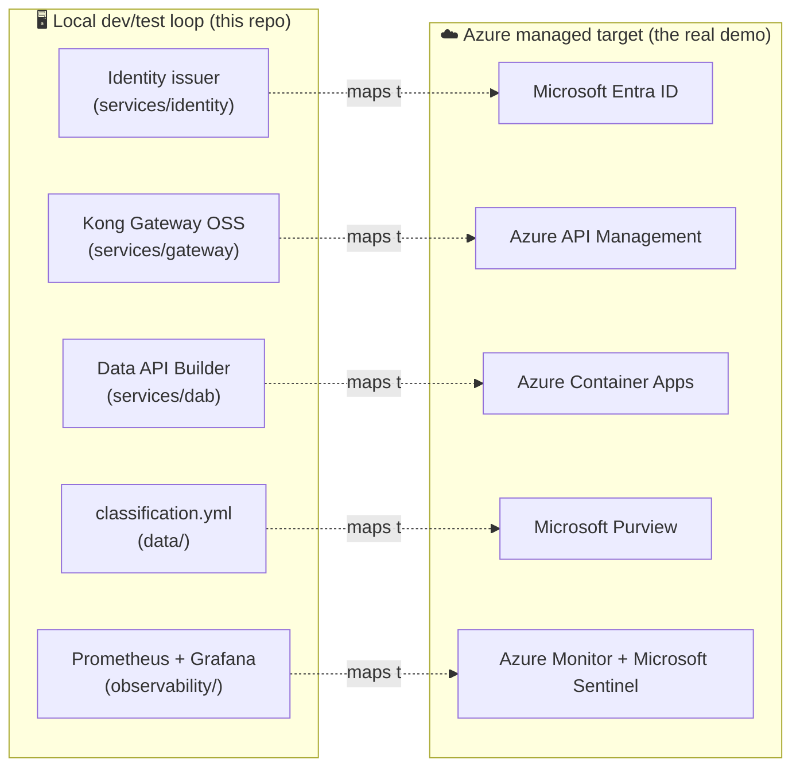
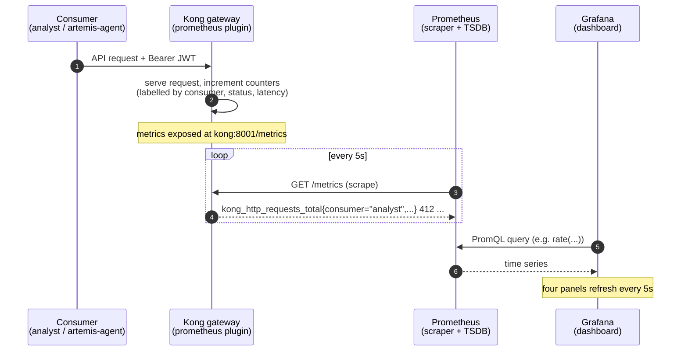
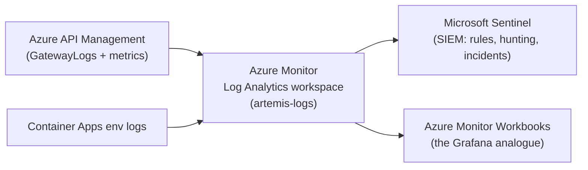
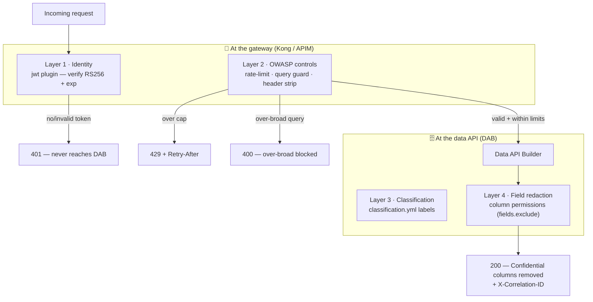

# 🔭 Observability & Security — a teaching guide

[Home](../../README.md) > [Documentation](../README.md) > [Concepts](.) > **06 · Observability & Security**

> [!NOTE]
> **TL;DR** — Two questions every enterprise API must answer: *"What is happening to my
> data right now?"* (**observability**) and *"Who is allowed to see what, and how do I
> stop the bad actors?"* (**security**). This POC answers both at the **gateway** — the
> single doorway every request passes through. Locally that doorway is **Kong** with a
> **Prometheus + Grafana** dashboard; the security controls are mapped one-to-one to the
> **OWASP API Security Top 10**. The whole shape is designed to lift into **Azure** —
> **API Management** for the gateway, **Azure Monitor + Microsoft Sentinel** for
> observability, **Entra ID** for identity, and **Microsoft Purview** for classification.
> Read the Azure mapping first; the local stack is the dev/test loop that proves it.

> [!WARNING]
> All data and scenarios in this repository are **synthetic** — see
> [`DISCLAIMER.md`](../DISCLAIMER.md). This is an illustrative reference, not an official
> NASA document, and the numbers below are from generated sample data.

---

## 📚 Contents

- [Why this chapter exists](#-why-this-chapter-exists)
- [The Azure picture first (read this before the local stack)](#-the-azure-picture-first-read-this-before-the-local-stack)
- [Part 1 · Observability](#-part-1--observability)
  - [What observability means here](#what-observability-means-here)
  - [The metrics pipeline, step by step](#the-metrics-pipeline-step-by-step)
  - [Worked example — make the dashboard light up](#-worked-example--make-the-dashboard-light-up)
  - [Reading the four panels](#reading-the-four-panels)
  - [Azure analogue — Azure Monitor + Sentinel](#azure-analogue--azure-monitor--sentinel)
- [Part 2 · The security model](#-part-2--the-security-model)
  - [Defense in depth: the four layers](#defense-in-depth-the-four-layers)
  - [Layer 1 · Identity (who are you?)](#layer-1--identity-who-are-you)
  - [Layer 2 · The OWASP API Top 10 at the gateway](#layer-2--the-owasp-api-top-10-at-the-gateway)
  - [Layer 3 · Classify before exposure](#layer-3--classify-before-exposure)
  - [Layer 4 · Field-level redaction at the data API](#layer-4--field-level-redaction-at-the-data-api)
  - [Worked example — prove every control](#-worked-example--prove-every-control)
- [Gotchas & troubleshooting](#-gotchas--troubleshooting)
- [Where to next](#-where-to-next)
- [Glossary of terms used here](#-glossary-of-terms-used-here)

---

## 🎯 Why this chapter exists

Imagine you have done the hard part: you have a database full of valuable procurement
data and you have published it as an API so other teams can use it without copying it
around (that "don't copy the data" idea is the **zero-move** pattern — see
[`ZERO-MOVE.md`](../ZERO-MOVE.md)). You are not done. The moment an API is real, two
operational worries appear:

1. **You cannot manage what you cannot see.** Is anyone using it? Which team? Is it slow?
   Is something hammering it? Without answers you are flying blind. The discipline of
   answering these questions from telemetry is **observability**.
2. **An open door is a liability.** An unauthenticated, unmetered, unredacted API is a
   breach waiting to happen. You need to know *who* is calling (**authentication**),
   stop abuse (**rate limiting**, **query guards**), and make sure sensitive fields never
   leave the building (**classification** and **redaction**).

> **In plain terms:** observability is the *instrument panel*; security is the *locks,
> guards, and seatbelts*. This chapter teaches both, and — critically — shows you the
> exact file and line where each one is implemented, so the ideas are never abstract.

**Why this matters (the enterprise story):** a NASA mission program wants to ask a
supply-chain question ("which Artemis-3 parts are at risk?") against authoritative SAP
procurement data without that data being copied into a dozen spreadsheets. The whole value
proposition collapses if the program office cannot *trust* the door (security) or *audit*
the door (observability). These two concerns are what turn a demo into something a
government program would actually run.

---

## ☁️ The Azure picture first (read this before the local stack)

This is an **enterprise proof-of-concept**, and its primary story is *"deploy to Azure to
show the full art of the possible."* The local Docker stack exists so you can develop and
test the pattern on your laptop; the real demo runs on Azure managed services. So before
we look at Kong and Prometheus, anchor every local component to the Azure service it
stands in for:



| Concern | Local OSS component (dev/test) | Azure managed service (the demo) | Why the analogy holds |
|---|---|---|---|
| **Who are you?** (identity) | RS256 JWT issuer, `services/identity/issuer.py` | **Microsoft Entra ID** | Both mint signed, short-lived tokens the gateway validates. |
| **The single doorway** (gateway) | **Kong Gateway OSS**, `services/gateway/kong.yml` | **Azure API Management (APIM)** | Both terminate the edge, validate tokens, rate-limit, and emit metrics. |
| **Serving the API** | **Data API Builder (DAB)**, `services/dab/` | **Azure Container Apps** | DAB runs as a container; on Azure it is a Container App behind APIM. |
| **Classification** | `data/classification.yml` | **Microsoft Purview** | Both label sensitivity *before* exposure and surface it in a catalog. |
| **Observability** | **Prometheus + Grafana**, `observability/` | **Azure Monitor (Log Analytics) + Microsoft Sentinel** | Both collect per-consumer call/latency telemetry; Sentinel adds SIEM. |

> [!TIP]
> **SIEM** = *Security Information and Event Management* — a system that collects logs and
> security events and lets you write detection rules and run investigations. Microsoft
> Sentinel is Azure's SIEM. There is no local OSS equivalent in this POC; the dashboard is
> the local stand-in for the *visibility* half, and Sentinel is what you add in Azure for
> the *detection* half. See [`SECURITY.md`](../SECURITY.md#-monitoring--siem-azure) and
> [`AZURE-DEPLOYMENT.md`](../AZURE-DEPLOYMENT.md).

Keep this table in mind as you read — every local thing below has an Azure twin.

---

## 📊 Part 1 · Observability

### What observability means here

Observability is the practice of understanding a system's internal state purely from the
signals it emits. Those signals traditionally come in three kinds — **metrics** (numbers
over time, e.g. "412 requests in the last minute"), **logs** (timestamped text records),
and **traces** (the path of one request across services). This POC focuses on **metrics**,
because metrics are what answer the enterprise questions of *usage, performance, and
metering* at a glance.

> **In plain terms:** a metric is a number you can graph. "Requests per second for the
> `analyst` consumer" is a metric. The dashboard is just a wall of those graphs.

The metric that matters most here is **per-consumer** traffic. Because every call carries a
JWT whose `client_id` claim identifies the caller (`analyst` or `artemis-agent`), the
gateway can attribute *every* request to a consumer. That is what makes **metering**
possible — and metering is the foundation of chargeback, quotas, and abuse detection.

### The metrics pipeline, step by step

There are three moving parts, and they form a simple chain. The gateway *produces*
numbers, Prometheus *collects* them, and Grafana *draws* them.



**1 · Kong produces the metrics.** The `prometheus` plugin is enabled globally in
[`services/gateway/kong.yml`](../../services/gateway/kong.yml) with `per_consumer: true`,
`status_code_metrics: true`, and `latency_metrics: true`. Those flags are what give us
per-consumer, per-status, and latency numbers (without `per_consumer` you would see *total*
traffic but could not tell `analyst` from `artemis-agent`). Kong exposes them as plain text
at `kong:8001/metrics`.

**2 · Prometheus collects them.** Prometheus is a time-series database that works by
**scraping** — it periodically fetches the `/metrics` page and stores every number with a
timestamp. The scrape target and interval live in
[`observability/prometheus.yml`](../../observability/prometheus.yml): it scrapes
`kong:8001` every `5s`. (A 5-second interval is fast — fine for a live demo where you want
the graph to move while you talk; production typically uses 15–60s.)

**3 · Grafana draws them.** Grafana is the visualization layer. It is wired to Prometheus
as its default data source in
[`observability/grafana/provisioning/datasources/datasource.yml`](../../observability/grafana/provisioning/datasources/datasource.yml),
and the dashboard itself is provisioned from
[`observability/grafana/dashboards/artemis-gateway.json`](../../observability/grafana/dashboards/artemis-gateway.json)
— so it appears automatically, no clicking required. Each panel runs a **PromQL** query
(Prometheus's query language) against the stored series.

> [!NOTE]
> Notice the chain only works *because every request goes through Kong*. That is the same
> property that makes zero-move and security enforceable: the single doorway is also the
> single, trustworthy place to measure. One choke point, three benefits — governance,
> metering, and security.

### 🧪 Worked example — make the dashboard light up

This walks you from a cold stack to a moving dashboard. Commands are run from the repo
root on a machine with Docker.

**Step 1 — bring the stack up, including the observability profile.**

```bash
cp .env.example .env
make demo          # builds + starts core, prints the Artemis-3 answer through Kong
```

`make demo` starts the `core` services. To include Prometheus + Grafana, start the
`observability` profile too (the Makefile's demo path and compose profiles are described
in [`docs/DEMO-SCRIPT.md`](../DEMO-SCRIPT.md)):

```bash
docker compose --profile core --profile observability up -d
```

**Expected output (abridged):**

```text
✔ Container artemis-postgres    Healthy
✔ Container artemis-dab         Healthy
✔ Container artemis-kong        Healthy
✔ Container artemis-prometheus  Started
✔ Container artemis-grafana     Started
```

*What just happened:* Postgres and DAB came up on the isolated `internal` network; Kong
bridged `internal` and `edge`; Prometheus and Grafana joined `edge` so they can scrape
Kong's admin port. Healthchecks (`depends_on: condition: service_healthy`) mean Kong only
starts once DAB is actually ready.

**Step 2 — generate some traffic so there is something to graph.** Get a token, then make
a handful of calls as each consumer:

```bash
# Get a short-lived JWT for the 'analyst' consumer from the local issuer
TOKEN=$(curl -s -X POST http://localhost:8081/token \
  -H 'content-type: application/json' \
  -d '{"client_id":"analyst"}' | python -c "import sys,json;print(json.load(sys.stdin)['access_token'])")

# Make a few governed calls through Kong (port 8000)
for i in $(seq 1 20); do
  curl -s -o /dev/null -w "%{http_code}\n" \
    "http://localhost:8000/api/SupplyRisk?\$first=5" \
    -H "Authorization: Bearer $TOKEN"
done
```

**Expected output:**

```text
200
200
200
... (20 lines of 200)
```

*What just happened:* you minted a token, then drove 20 successful (`200`) requests
through the gateway as `analyst`. Kong incremented its per-consumer counters on each one.

**Step 3 — confirm Kong is actually emitting metrics.** Peek at the raw scrape endpoint:

```bash
curl -s http://localhost:8001/metrics | grep kong_http_requests_total | head -3
```

**Expected output (values will differ):**

```text
kong_http_requests_total{service="artemis-dab",route="artemis-procurement-api",code="200",consumer="analyst",...} 20
```

*What just happened:* this is the raw material Grafana graphs. The `consumer="analyst"`
label is the per-consumer metering in action — proof that the gateway can attribute every
call to a caller.

**Step 4 — open the dashboard.**

```text
http://localhost:3000/d/artemis-gateway
```

Grafana allows anonymous viewing (`GF_AUTH_ANONYMOUS_ENABLED: "true"` in
`docker-compose.yml`), so no login is needed to see the board. Within ~5 seconds the
"Requests per consumer" line for `analyst` rises, and "Total requests per consumer" shows
your 20 calls.

> [!WARNING]
> **Port collisions are common on a busy dev box.** Ports `8000`, `8001`, `8080`, and
> `3000` are frequently already bound (other gateways, Jenkins, another Grafana). If
> `docker compose up` fails to bind, remap the host ports in `.env`
> (`KONG_PROXY_PORT`, `KONG_ADMIN_PORT`, `PROMETHEUS_PORT`, `GRAFANA_PORT`) — the
> in-container ports stay the same, so only the `localhost:<port>` you type changes.

### Reading the four panels

The dashboard, `artemis-gateway.json`, has exactly four panels. Each maps to an enterprise
question. The PromQL is shown so you can see there is no magic — just queries over the
counters Kong emits.

| Panel | Question it answers | PromQL (from the dashboard) |
|---|---|---|
| **Requests per consumer (rate /s)** | *Who is using the API, and how hard?* | `sum by (consumer) (rate(kong_http_requests_total{service="artemis-dab"}[1m]))` |
| **Total requests per consumer** | *What is the running total per consumer?* (metering) | `sum by (consumer) (kong_http_requests_total{service="artemis-dab"})` |
| **Request latency (p50 / p95, ms)** | *Is it fast? Is the tail slow?* | `histogram_quantile(0.95, sum by (le) (rate(kong_request_latency_ms_bucket{service="artemis-dab"}[5m])))` |
| **HTTP status codes (rate /s)** | *Are calls succeeding? Any 401/429/400 spikes?* | `sum by (code) (rate(kong_http_requests_total{service="artemis-dab"}[1m]))` |

> **In plain terms:** `rate(...[1m])` means "per-second average over the last minute".
> `histogram_quantile(0.95, ...)` means "the latency the slowest 5% of requests exceed" —
> the **p95**, the number that tells you whether *some* users are having a bad time even if
> the average looks fine.

**Why this matters:** the status-code panel is where security and observability meet. When
you later trigger a `401` (no token), a `429` (rate limit), or a `400` (over-broad query),
they show up *here* as colored bars — so the same dashboard that proves usage also proves
your controls are firing.

### Azure analogue — Azure Monitor + Sentinel

On Azure you do not run Prometheus and Grafana; the managed services subsume them:



- **Azure Monitor / Log Analytics** ingests APIM `GatewayLogs` and Container Apps logs —
  the managed analogue of the Prometheus/Grafana path. The deploy provisions a workspace
  named `artemis-logs`.
- **Microsoft Sentinel** is enabled on that workspace, giving the demo a real SIEM surface
  (analytics rules, hunting queries, incident workflows) over the same gateway/app
  telemetry — something the local OSS stack cannot show.

This is documented and wired in [`SECURITY.md`](../SECURITY.md#-monitoring--siem-azure)
and the Bicep under [`infra/azure/`](../../infra/azure/). The teaching point: **the local
metrics dashboard is the dev/test rehearsal; Azure Monitor + Sentinel is the production
performance.**

---

## 🔐 Part 2 · The security model

### Defense in depth: the four layers

Security here is not one switch — it is four cooperating layers, each handling a class of
threat. A request is checked at every layer on its way to the data, and sensitive data is
stripped on its way back. Crucially, the layers are arranged so that the *cheapest, most
dangerous* attacks are rejected *earliest* (at the edge, before reaching the database).



| Layer | Threat it addresses | Where it lives | The control |
|---|---|---|---|
| **1 · Identity** | Anonymous / forged callers | `services/identity`, Kong `jwt` plugin | RS256 JWT verification at the edge |
| **2 · OWASP controls** | Abuse, scraping, misconfig | `services/gateway/kong.yml` | rate-limit, query guard, header strip, size limit |
| **3 · Classification** | Ungoverned sensitive data | `data/classification.yml`, seeder | label *before* exposure (Purview discipline) |
| **4 · Field redaction** | Leaking confidential columns | `services/dab/dab-config.json` | per-role `fields.exclude` column permissions |

### Layer 1 · Identity (who are you?)

**The problem:** an API with no identity is an open door — anyone can read everything, and
you cannot meter or attribute anything. **The solution:** every caller must present a
short-lived, cryptographically signed token, and the gateway must verify it before any data
is touched.

This POC uses **OAuth2 bearer tokens** in the form of **RS256 JWTs**. Decoding the jargon:

- **JWT** (*JSON Web Token*) — a compact, signed bundle of claims (`iss`, `aud`, `sub`,
  `client_id`, `exp`). Think of it as a tamper-evident ID badge.
- **RS256** — the badge is signed with the issuer's **private** key and verified with its
  **public** key (asymmetric crypto). The gateway only needs the *public* key, so it can
  verify without being able to mint tokens.
- **`exp`** — an expiry timestamp; tokens are short-lived so a leaked token is useless
  quickly.

The flow (implemented by [`services/identity/issuer.py`](../../services/identity/issuer.py)
and enforced by the `jwt` plugin in `kong.yml`):

```mermaid
sequenceDiagram
    autonumber
    participant C as Consumer
    participant I as Identity issuer<br/>(Entra ID stand-in)
    participant K as Kong gateway
    participant D as Data API Builder
    C->>I: POST /token { client_id }
    I-->>C: short-lived RS256 JWT
    Note over I,K: issuer renders its public key into Kong's config at startup
    C->>K: request + Bearer JWT
    alt no / invalid / expired token
        K-->>C: 401 (request never reaches DAB)
    else valid token
        K->>K: verify signature + exp; map client_id → consumer; meter
        K->>D: forward
        D-->>K: rows
        K-->>C: 200 + X-Correlation-ID
    end
```

The two `consumers` in `kong.yml` (`analyst`, `artemis-agent`) both trust the *same*
issuer public key; Kong distinguishes them by the token's `client_id` claim
(`key_claim_name: client_id`). That single fact is what powers per-consumer metering in
Part 1 — **identity and observability are the same plumbing.**

> [!TIP]
> The issuer's private key is **generated at runtime into a Docker volume and never
> committed** — and a `detect-private-key` pre-commit hook enforces that. On Azure this
> whole layer becomes **Entra ID** plus APIM's `validate-azure-ad-token` policy; the
> reference is in [`infra/azure/modules/apim.bicep`](../../infra/azure/modules/apim.bicep).

### Layer 2 · The OWASP API Top 10 at the gateway

The **OWASP API Security Top 10** is an industry-standard list (maintained by the Open
Worldwide Application Security Project) of the ten most critical API risks. Treating it as
a checklist is how you make sure you have not forgotten an obvious attack class. This POC
maps each risk to a concrete control, almost all enforced at the gateway *before* the
request reaches the data.

| OWASP risk (2023) | Control in this POC | Where |
|---|---|---|
| **API1** Broken Object Level Auth | Read-only entities; no mutation paths; sensitive fields classified | `dab-config.json`, `classification.yml` |
| **API2** Broken Authentication | `jwt` plugin validates RS256 signature + `exp`; unauthenticated → **401** | `kong.yml` |
| **API3** Broken Object Property Auth | `anonymous` role redacts Confidential columns via `fields.exclude` | `dab-config.json` |
| **API4** Unrestricted Resource Consumption | `rate-limiting` (per-consumer) **and** the `pre-function` guard blocking `$first > 200` | `kong.yml` |
| **API5** Broken Function Level Auth | Only explicit entity routes are published; everything else is unrouted | `kong.yml` |
| **API6** Unrestricted Access to Business Flows | Per-consumer quota + metering; the OWASP guard caps bulk pulls | `kong.yml` |
| **API8** Security Misconfiguration | DB-less reviewable config; SoR has no host ports; secrets via `.env` | `kong.yml`, `docker-compose.yml` |
| **API9** Improper Inventory Management | The catalog publishes contract, owner, classification, request path — no shadow APIs | `services/catalog` |
| **API10** Unsafe Consumption | Access only via the documented OpenAPI contract; correlation id on every call | `kong.yml`, `services/catalog` |

Three controls are worth seeing in the actual config, because they are the ones you can
*trigger* in a demo:

**The query guard (API4).** A `pre-function` plugin runs a tiny Lua snippet on every
governed request and rejects an over-broad pull before it reaches the database:

```lua
-- OWASP API4:2023 (Unrestricted Resource Consumption): block over-broad extraction.
local args = kong.request.get_query()
local first = args["$first"]
if first and tonumber(first) and tonumber(first) > 200 then
  return kong.response.exit(400, { message = "Over-broad query blocked (OWASP API4): $first exceeds 200", max_first = 200 })
end
```

> **In plain terms:** a legitimate consumer pages through data (`$first=200` at a time). An
> attacker tries `$first=99999` to siphon the whole table in one shot. This guard turns
> that into an instant `400` — the database never even sees the request.

**The header-strip (defends the redaction boundary).** DAB's `StaticWebApps` auth provider
would honor inbound `X-MS-CLIENT-PRINCIPAL` / `X-MS-API-ROLE` headers and serve the
privileged, *un-redacted* role. A `request-transformer` plugin **strips those headers on
every call**, so a client can never spoof its way into the privileged role:

```yaml
- name: request-transformer
  config:
    remove:
      headers:
        - X-MS-CLIENT-PRINCIPAL
        - X-MS-API-ROLE
        # ...and the other X-MS-CLIENT-PRINCIPAL-* variants
```

This is why field-level redaction (Layer 4) is *guaranteed* rather than accidental —
the gateway removes the only way to ask for the un-redacted view.

**The correlation id (API10, traceability).** A `correlation-id` plugin stamps and echoes
`X-Correlation-ID` on every call. That id is your proof a response came *through* Kong (not
around it) and your handle for tracing a single request across logs.

> [!NOTE]
> On Azure, APIM provides managed equivalents of all of these — see
> [Mitigate OWASP API threats with API Management](https://learn.microsoft.com/azure/api-management/mitigate-owasp-api-threats)
> and [`SECURITY.md`](../SECURITY.md#️-owasp-api-security-top-10-2023--controls-at-the-gateway).

### Layer 3 · Classify before exposure

**The discipline:** you decide *how sensitive each field is before you ever expose it* —
not after a leak. This is the **Microsoft Purview** pattern, applied locally with a plain
YAML manifest, [`data/classification.yml`](../../data/classification.yml). Every table and
column gets one of three labels:

| Label | Meaning | Example fields |
|---|---|---|
| **Routine** | Safe to share broadly | `MATNR` (material id), `MAKTX` (description) |
| **Sensitive** | Governed, but visible | `CRITICALITY`, `SOLE_SOURCE`, `RISK_SCORE` |
| **Confidential** | Must not leave the SoR for a marketplace consumer | `STD_UNIT_COST_USD`, `NETPR`, `NETWR` |

The seeder applies these labels to the system of record as Postgres `COMMENT ON COLUMN`s
**at seed time** and emits them into the catalog entry. So when a consumer browses the
catalog, the sensitivity of each field is already visible — governance happens *before* the
first API call, not as an afterthought.

> **Why this matters:** classification without enforcement is just a sticky note. The next
> layer is what turns the **Confidential** label into an actual wall.

### Layer 4 · Field-level redaction at the data API

This is where a label becomes a guarantee. **Data API Builder** applies **per-role column
permissions**, so the columns marked **Confidential** never leave the system of record for
an ordinary marketplace consumer. The redaction happens *at the data API, at the source* —
not bolted onto the gateway response — which is the principle of **least privilege at the
source**.

In [`services/dab/dab-config.json`](../../services/dab/dab-config.json) the default
`anonymous` role reads with `fields.exclude`:

```json
{ "role": "anonymous", "actions": [
    { "action": "read", "fields": { "exclude": ["std_unit_cost_usd"] } }
]},
{ "role": "authenticated", "actions": ["read"] }
```

| Entity | Confidential column removed from the default consumer |
|---|---|
| `Material` | `std_unit_cost_usd` (unit cost) |
| `PurchaseOrder` | `netpr`, `netwr` (net price / net value) |

Two subtle, important points:

1. **The row is still returned — only the confidential *columns* are withheld.** So the
   headline supply-risk answer (which parts are at risk) is unaffected, while cost/price
   data is masked. Redaction is *surgical*, not all-or-nothing.
2. **The boundary is enforced, not hoped for.** A privileged `authenticated` role *could*
   read the full record, but the only way to assert that role is via the `X-MS-*` headers
   that Layer 2's `request-transformer` strips. So through the gateway, every call is
   `anonymous`, and redaction always holds. [`tests/test_redaction.py`](../../tests/test_redaction.py)
   proves both the redaction and the anti-spoofing defense.

> [!NOTE]
> An earlier design tried to rewrite the response body *at the gateway*. That was rejected:
> redaction belongs at the data API (least privilege at the source), not as a fragile
> string-rewrite on the way out. This is the DAB-native equivalent of column-level masking
> in Microsoft Purview / Azure SQL.

### 🧪 Worked example — prove every control

Each command targets one control. Reuse the `$TOKEN` from Part 1.

**1 · No token → 401 (Layer 1, API2).**

```bash
curl -s -o /dev/null -w "%{http_code}\n" "http://localhost:8000/api/SupplyRisk?\$first=1"
```

```text
401
```

*The request was rejected at the edge — it never reached DAB or Postgres.*

**2 · Valid token → 200 with a correlation id (Layer 1 + API10).**

```bash
curl -s -D - -o /dev/null \
  "http://localhost:8000/api/SupplyRisk?\$first=1" \
  -H "Authorization: Bearer $TOKEN" | grep -i "HTTP/\|X-Correlation-ID"
```

```text
HTTP/1.1 200 OK
X-Correlation-ID: 7f3a...-...-4c21
```

*Verified token; the correlation id proves the call traversed Kong.*

**3 · Over-broad query → 400 (Layer 2, API4 guard).**

```bash
curl -s "http://localhost:8000/api/Material?\$first=99999" \
  -H "Authorization: Bearer $TOKEN"
```

```text
{"message":"Over-broad query blocked (OWASP API4): $first exceeds 200","max_first":200}
```

*The siphon attempt was blocked before reaching the database.*

**4 · Confidential column is absent (Layers 3 + 4).**

```bash
curl -s "http://localhost:8000/api/Material?\$first=1" \
  -H "Authorization: Bearer $TOKEN" | python -m json.tool
```

```text
{
  "value": [
    { "matnr": "...", "maktx": "...", "program": "...", "criticality": "...", "std_lead_time_days": 21 }
  ]
}
```

*Note what is **missing**: there is no `std_unit_cost_usd` key. The Confidential column was
redacted at the data API. The Routine fields are all present — redaction is surgical.*

**5 · Over the rate cap → 429 (Layer 2, API4 metering).** Burst as `artemis-agent`:

```bash
AGENT=$(curl -s -X POST http://localhost:8081/token -H 'content-type: application/json' \
  -d '{"client_id":"artemis-agent"}' | python -c "import sys,json;print(json.load(sys.stdin)['access_token'])")
for i in $(seq 1 90); do
  curl -s -o /dev/null -w "%{http_code} " "http://localhost:8000/api/Material?\$first=1" \
    -H "Authorization: Bearer $AGENT"
done; echo
```

```text
200 200 200 ... 429 429 429
```

*Once the per-minute cap is exceeded the gateway returns `429` with a `Retry-After`
header.* Flip back to the Grafana status-code panel — you will see the `429` bars appear,
closing the loop between security and observability.

> [!TIP]
> You do not have to run these by hand. The same assertions are encoded as tests:
> [`tests/test_gateway_auth.py`](../../tests/test_gateway_auth.py) (401/200/400/429 +
> correlation id) and [`tests/test_redaction.py`](../../tests/test_redaction.py)
> (column redaction + anti-spoofing). Run `pytest tests/test_gateway_auth.py -v` against a
> live stack.

---

## 🧯 Gotchas & troubleshooting

| Symptom | Likely cause | Fix |
|---|---|---|
| Grafana panels say "No data" | No traffic generated yet, or the `observability` profile is not running | Make a few calls (Part 1 Step 2); confirm `docker compose ps` shows `prometheus` + `grafana` |
| `docker compose up` fails to bind a port | `8000/8001/9090/3000` already in use on your box | Remap host ports in `.env` (`KONG_PROXY_PORT`, `KONG_ADMIN_PORT`, `PROMETHEUS_PORT`, `GRAFANA_PORT`) |
| Every call returns `401` even with a token | Token expired (`exp`), or issuer restarted and rotated its key | Re-fetch a fresh token from `:8081/token`; if the issuer restarted, Kong reloads the new public key automatically |
| Confidential column still appears | You called DAB **directly**, not through Kong | There is no host path to DAB by design (it is `internal`-only). Always call `localhost:8000` (Kong). |
| `429` immediately on the first call | A previous burst exhausted the per-minute window | Wait out the `Retry-After`, or use the other consumer; the cap is per-consumer |
| Prometheus target shows "down" | Kong admin port not reachable on `edge` | Check `kong:8001` is up: `curl localhost:8001/status`; ensure both are on the `edge` network |

> [!WARNING]
> If something *looks* like security software is blocking a container or port, **stop and
> raise it through IT** — never disable or modify endpoint protection to make the demo run.
> Use port remapping and exclusions requested via policy instead.

---

## 🧭 Where to next

- 🧱 [`ZERO-MOVE.md`](../ZERO-MOVE.md) — how the network isolation that makes the gateway
  the *only* door is proven (the foundation both observability and security rest on).
- 🔐 [`SECURITY.md`](../SECURITY.md) — the reference (non-teaching) version of the security
  model, with the full token-flow sequence and Azure Key Vault / managed-identity details.
- 🏛️ [`ARCHITECTURE.md`](../ARCHITECTURE.md) — how these pieces sit in the whole system.
- ☁️ [`AZURE-DEPLOYMENT.md`](../AZURE-DEPLOYMENT.md) and
  [`AZURE-LIVE-DEPLOYMENT.md`](../AZURE-LIVE-DEPLOYMENT.md) — taking gateway + identity +
  observability to APIM, Entra ID, Container Apps, Azure Monitor, and Sentinel.
- 🎛️ [`APIM-CAPABILITIES.md`](../APIM-CAPABILITIES.md) — what managed APIM adds over the OSS
  gateway for these controls.
- ▶️ [`DEMO-SCRIPT.md`](../DEMO-SCRIPT.md) — the ~10-minute presenter walkthrough that runs
  all of the above live.

---

## 📖 Glossary of terms used here

| Term | Plain-language definition |
|---|---|
| **Observability** | Understanding a system's state from the signals (metrics/logs/traces) it emits. |
| **Metric** | A number tracked over time (e.g. requests/sec) — the thing a dashboard graphs. |
| **Scrape** | Prometheus periodically fetching a service's `/metrics` page to collect numbers. |
| **PromQL** | Prometheus's query language used by Grafana panels to compute series. |
| **p50 / p95** | The median / 95th-percentile latency — p95 reveals the slow tail most users' averages hide. |
| **Consumer** | A named API caller (`analyst`, `artemis-agent`) identified by its token's `client_id`. |
| **Metering** | Counting calls per consumer — the basis of quotas, chargeback, and abuse detection. |
| **JWT** | JSON Web Token: a compact, signed bundle of claims used as a bearer credential. |
| **RS256** | Asymmetric token signing — private key signs, public key verifies. |
| **OWASP API Top 10** | The industry-standard list of the ten most critical API security risks. |
| **Classification** | Labeling each field's sensitivity (Routine / Sensitive / Confidential) before exposure. |
| **Redaction** | Removing confidential columns from a response so they never leave the source. |
| **SIEM** | Security Information and Event Management — log/event aggregation with detection rules (Sentinel). |
| **Correlation id** | A unique id stamped on each request to trace it and prove it went through the gateway. |
| **SoR (System of Record)** | The authoritative source — here, the isolated Postgres database. |

> [!NOTE]
> Reminder: every dataset, vendor, part, and price shown here is **synthetic**. See
> [`DISCLAIMER.md`](../DISCLAIMER.md).
