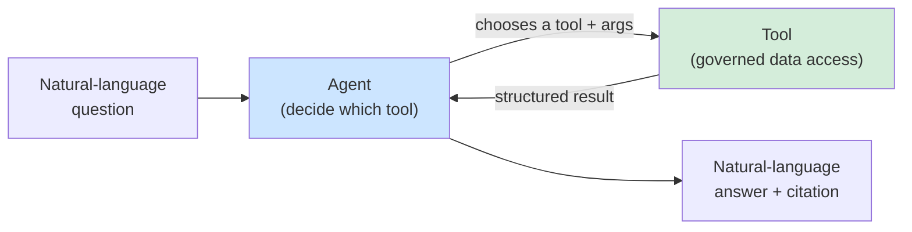
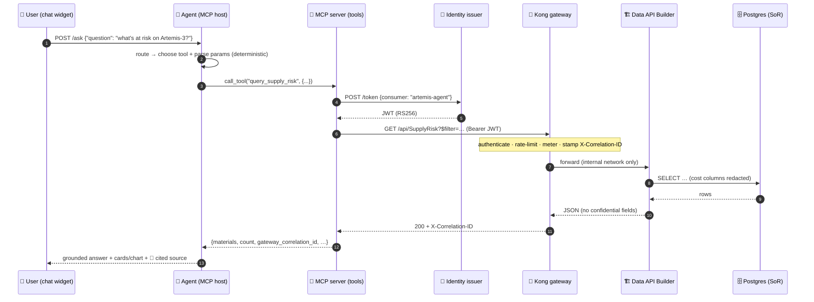

# 🤖 MCP & Grounded Agents — a teaching guide

[Home](../../README.md) > [Documentation](../README.md) > [Concepts](./README.md) > **07 · MCP & Agents**

> [!NOTE]
> **TL;DR** — An **agent** is a program that turns plain-language questions into actions.
> A **grounded** agent is one that can only answer from a specific, trusted source of
> data — it cannot make things up. This POC ships a **mission agent** that is grounded on
> the *governed* Artemis supply-chain data product: it reaches that data **only** through
> the same Kong → Data API Builder → Postgres path every other consumer uses, by calling
> tools over the **Model Context Protocol (MCP)** — the open standard Microsoft Copilot and
> Azure AI Foundry use to call tools. Because the agent can only see what the gateway
> serves, **governance still applies**: rate limits, metering, correlation ids, and
> field-level redaction all hold. Every answer **cites its source** (the MCP tool + the
> gateway correlation id), and anything off-topic gets a polite, space-flavored refusal.
> In Azure this same pattern runs on **Microsoft Entra Agent ID / Copilot Studio / Azure
> AI Foundry** calling the **same MCP tools**.

> [!WARNING]
> All data and scenarios in this repository are **synthetic** — see
> [`DISCLAIMER.md`](../DISCLAIMER.md). This is an illustrative reference, not an official
> NASA document, and every material, vendor, price, and risk score below is generated by
> [`data/synthetic_data.py`](../../data/synthetic_data.py).

---

## 📑 On this page

- [Why this chapter exists](#-why-this-chapter-exists)
- [The Azure picture first (read this before the local stack)](#-the-azure-picture-first-read-this-before-the-local-stack)
- [What is an agent? (from first principles)](#-what-is-an-agent-from-first-principles)
- [What is MCP? (the Model Context Protocol)](#-what-is-mcp-the-model-context-protocol)
- [What does "grounded" mean — and why it matters](#-what-does-grounded-mean--and-why-it-matters)
- [How THIS repo's mission agent works](#-how-this-repos-mission-agent-works)
  - [The end-to-end flow](#the-end-to-end-flow)
  - [The two tools the agent can call](#the-two-tools-the-agent-can-call)
  - [Deterministic routing (no hallucination)](#deterministic-routing-no-hallucination)
- [Why grounding + governance is the whole point](#-why-grounding--governance-is-the-whole-point)
- [The off-topic refusal (a feature, not a bug)](#-the-off-topic-refusal-a-feature-not-a-bug)
- [Worked example — a question, end to end, with a cited source](#-worked-example--a-question-end-to-end-with-a-cited-source)
- [Where this lives in the repo](#-where-this-lives-in-the-repo)
- [Gotchas & troubleshooting](#-gotchas--troubleshooting)
- [Where to next](#-where-to-next)
- [Glossary of terms used here](#-glossary-of-terms-used-here)

---

## 🎯 Why this chapter exists

The other primers built a governed front door for data: a gateway that authenticates,
rate-limits, meters, and redacts ([`02 API Gateways`](02-api-gateways.md)), an
auto-generated API over the system of record ([`03 Data API Builder`](03-data-api-builder.md)),
and a token-based identity layer ([`04 Identity`](04-identity-jwt-oauth.md)). All of that
serves *humans and apps*. But the question every enterprise is asking in 2026 is:

> **"Can my AI assistant answer questions about this data — safely?"**

The fear is well-founded. A naïve approach — paste the whole database into a chatbot's
context — throws away every control you just built. The model would "know" the
confidential cost columns, ignore rate limits, and have no audit trail. Worse, a
language model left to its own devices will **hallucinate**: confidently invent a vendor
or a delivery delay that does not exist.

This chapter shows the opposite approach, the one this POC implements: an agent that is
**grounded** on the governed data product and reaches it **only through the same gateway
as everyone else**. The agent gains no special privilege. It is just one more well-behaved
consumer — one that happens to speak natural language on the front and the **open MCP
standard** on the back. This is the "AI grounded on governed data" story, and it is the
direct answer to that enterprise question.

> [!TIP]
> **In plain terms:** the earlier chapters built a vault with a single guarded door. This
> chapter puts an AI receptionist in front of that door. The receptionist is helpful and
> speaks English — but it still has to walk through the same door, show the same badge,
> and obey the same rules as anyone else. It can never reach behind the counter.

---

## 🌐 The Azure picture first (read this before the local stack)

Per the [Azure-first framing](./README.md#-azure-first-framing-read-this-before-the-primers),
learn the concept on the local OSS analogue, then read it as the managed Azure service it
stands in for. The agent path maps cleanly onto Azure's first-party AI surface:

| Concept | Local OSS analogue (what you run) | Azure managed equivalent (the real story) |
|---|---|---|
| The agent / chat host | **`services/agent`** (a FastAPI MCP *host*) | **Copilot Studio** · **Azure AI Foundry** agents · **Microsoft 365 Copilot** |
| Tool protocol | **MCP** (streamable-HTTP) | **MCP** — the same open standard Copilot & Foundry speak |
| The tools themselves | **`services/mcp`** (`query_supply_risk`, `material_detail`) | The **same MCP server**, hosted on **Azure Container Apps** |
| Agent identity | local consumer `artemis-agent` + JWT | **Microsoft Entra Agent ID** (agents are first-class identities) |
| Optional phrasing LLM | `AGENT_LLM=azure-openai` (off by default) | **Azure OpenAI** in Foundry |
| The governed door | **Kong** → **DAB** → **Postgres** | **Azure API Management** → **DAB on ACA** → **Azure Database for PostgreSQL** |

> [!IMPORTANT]
> **The load-bearing idea:** the tools the local agent calls are the *exact same tools*
> Copilot or Foundry would call — MCP is the lingua franca. Swapping the local agent for
> Copilot Studio does not change the data path, the governance, or the contract. You swap
> the host, not the architecture. The deployed reference agent runs on Azure Container
> Apps at
> `https://agent.icyocean-479340e8.centralus.azurecontainerapps.io`.

---

## 🧠 What is an agent? (from first principles)

Strip away the hype and an **agent** is a small loop:

1. **Receive** a goal stated in natural language ("what's at risk on Artemis-3?").
2. **Decide** which tool (if any) can help, and with what arguments.
3. **Call** that tool, get a structured result.
4. **Respond** by turning the result back into language a human can read.

The decision step (2) is what separates an agent from an ordinary program. A normal app
has its calls hard-wired by a developer; an agent *chooses* which tool to invoke based on
the request. That choice can be made by a large language model (LLM), or — as in this POC
— by **deterministic rules** (see [below](#deterministic-routing-no-hallucination)).

The crucial part for governance is the word **tool**. An agent does not have hands; it has
*tools*. If the only tool you give it reaches data through a governed gateway, then the
agent — no matter how clever — can never reach data any other way. **Tools are the
agent's entire universe of capability.** Constrain the tools and you constrain the agent.



---

## 🔌 What is MCP? (the Model Context Protocol)

An agent needs a standard way to *discover* and *call* tools, no matter who wrote them.
Before MCP, every AI platform invented its own plugin format, so a tool built for one host
would not work in another. The **Model Context Protocol (MCP)** is the open standard — now
adopted across Microsoft Copilot, Azure AI Foundry, Claude, and others — that fixes this.
It defines two roles:

| Role | What it is | In this repo |
|---|---|---|
| **MCP server** | Publishes a set of **tools** (named functions with typed arguments and a docstring the agent reads to decide *when* to use them). | [`services/mcp/server.py`](../../services/mcp/server.py) — exposes `query_supply_risk` and `material_detail`. |
| **MCP host** (a.k.a. client) | Connects to one or more servers, lists their tools, and calls them on the agent's behalf. | [`services/agent/agent.py`](../../services/agent/agent.py) — connects over streamable-HTTP and calls those tools. |

A tool definition is just a typed function with a description. The MCP server here declares
its tools with the `@mcp.tool()` decorator; the function's signature *is* the contract and
its docstring tells any host what the tool is for:

```python
@mcp.tool()
def query_supply_risk(
    program: str = "Artemis-3",
    min_delay: int = 30,
    criticality: str = "Critical",
    sole_source_only: bool = True,
) -> dict:
    """Find high supply-risk materials for an Artemis program, through the gateway.

    The call is authenticated, rate-limited, and metered by Kong; the data never
    leaves Postgres.
    """
```

> [!NOTE]
> **Why MCP and not a bespoke REST call?** Because MCP is *portable*. The exact same
> server can be plugged into Claude Desktop, Microsoft Copilot, Azure AI Foundry, or this
> repo's own agent with **zero code changes** — the host discovers the tools at runtime.
> That portability is the whole pitch: *you publish one governed tool; every AI host can
> safely use it.* The server even supports a `stdio` transport (`MCP_TRANSPORT=stdio`) so a
> desktop host can launch it locally, in addition to the streamable-HTTP transport the
> container runs.

---

## 🛡️ What does "grounded" mean — and why it matters

A **grounded** agent is one whose answers are constrained to come from a specific, trusted
source — and which *attributes* each answer to that source. It is the opposite of a
free-floating chatbot that answers from its training data (and may invent details).

Three properties make this agent grounded:

1. **Tool-only data access.** The agent has *no* database connection and *no* knowledge of
   Artemis data baked in. Its only way to learn a fact is to call an MCP tool — which
   reaches Postgres exclusively through the Kong gateway. If the gateway would not serve a
   field, the agent never sees it.
2. **Citation on every answer.** Each response carries a `sources` block naming the MCP
   tool used and the **gateway correlation id** stamped on that request. You can take that
   id straight to Grafana / Azure Monitor and find the exact metered call. An answer with
   no citation is, by construction, not a grounded answer.
3. **Refusal outside scope.** Ask it something the data product can't answer and it
   declines rather than guessing (see [the off-topic refusal](#-the-off-topic-refusal-a-feature-not-a-bug)).

> [!IMPORTANT]
> **Grounding turns governance from a hope into a guarantee.** Because the agent can only
> see what the gateway serves, every control from the earlier chapters is *automatically*
> inherited: the confidential cost columns are redacted ([`06 Observability &
> Security`](06-observability-and-security.md#layer-4--field-level-redaction-at-the-data-api)),
> the call counts against the consumer's rate limit and is metered, and the correlation id
> makes it auditable. The agent cannot exceed what the gateway serves — not because we
> asked it nicely, but because there is no other door.

---

## ⚙️ How THIS repo's mission agent works

### The end-to-end flow

In the UI, a floating chat widget ([`AgentChat.jsx`](../../frontend/src/components/AgentChat.jsx))
POSTs the user's question to the agent's `/ask` endpoint. The agent decides which tool to
call, invokes it on the MCP server, and the MCP server fetches a bearer token from the
identity issuer and calls **Kong** — never the database directly. The structured result
flows back and the chat renders it richly: ranked **material cards**, a **bar chart** for
stats questions, or a **detail card** for a single material. Clicking any card opens the
governed [drill-down detail modal](./README.md) — the same nested gateway calls a human
analyst would make.



> [!NOTE]
> **Read the diagram for what is missing.** There is no arrow from the agent to Postgres.
> The agent's reach stops at the MCP tool; the tool's reach stops at Kong. That is
> [zero-move](01-the-big-idea.md) and the [gateway-only path](02-api-gateways.md) holding
> firm even for AI.

### The two tools the agent can call

The agent's entire capability is these two tools — nothing more:

| Tool | What it answers | How it composes the answer |
|---|---|---|
| **`query_supply_risk`** | "Which materials on a program are slipping past *N* days?" (lists + ranks + a chart for stats questions) | One governed `GET /api/SupplyRisk` with an OData `$filter` + `$orderby` through Kong. |
| **`material_detail`** | "Tell me everything about *this* material / NSN / supplier." | **Several** governed calls composed at the gateway: `SupplyRisk` → `PurchaseOrder` → `Vendor`. Net price/value and unit cost come back **redacted**. |

The agent picks between them by inspecting the question: if it mentions a specific material,
NSN, or supplier, it calls `material_detail`; otherwise it runs `query_supply_risk`, and if
the question is statistical ("stats", "by tier", "how many") it broadens the filter so the
**bar chart** shows a fuller picture.

### Deterministic routing (no hallucination)

A subtle but important design choice: the agent's routing is **deterministic** — plain
regular-expression rules in [`agent.py`](../../services/agent/agent.py) decide which tool to
call and how to parse the program, criticality, and delay threshold. It does **not** rely on
an LLM to choose.

| Why deterministic? | Payoff for a live demo |
|---|---|
| **Reliable** — the same question always routes the same way. | No "it worked yesterday" surprises on stage. |
| **Free** — no model inference cost or API key required. | The demo runs fully local with nothing but Docker. |
| **Never hallucinates a tool call** — it can only call the two real tools with parsed args. | Every answer is provably grounded. |

> [!TIP]
> An LLM is **optional** and additive, not foundational. Set `AGENT_LLM=azure-openai` with
> the `AZURE_OPENAI_*` environment variables and an LLM will *phrase* the grounded answer
> more naturally — but it **still only sees the gateway data** and **still must cite it**.
> The LLM polishes the words; it never widens the agent's reach. Grounding is enforced by
> the tool boundary, not by the model's good behavior.

---

## 🔒 Why grounding + governance is the whole point

It is worth stating plainly what the agent **cannot** do, because that list is the value
proposition:

- **It cannot exceed what the gateway serves.** No tool reaches Postgres directly; every
  call is an authenticated, rate-limited, metered request through Kong. The agent inherits
  the consumer's quota — hammer it and you get `429`, same as any consumer.
- **It cannot reveal redacted fields.** Unit cost and net price/value are stripped at the
  data API ([Layer 4](06-observability-and-security.md#layer-4--field-level-redaction-at-the-data-api)).
  The agent literally never receives those columns, so it cannot leak them — and it says so
  in the answer ("Net price/value and unit cost are **redacted at the gateway**").
- **It cannot dodge the audit trail.** Every tool result carries the gateway
  **correlation id**, which the chat surfaces as a citation and which lands in Grafana /
  Azure Monitor. There is no un-logged path.
- **It cannot answer from imagination.** With no data baked in and deterministic routing,
  an on-topic answer *must* come from a real tool call or it does not happen.

> [!IMPORTANT]
> This is the difference between "an AI that has read our database" (a liability) and "an
> AI that is one more governed consumer of our data product" (an asset). The gateway you
> built for humans and apps governs the AI **for free** — that is the dividend of the
> API-first, zero-move pattern.

---

## 🚫 The off-topic refusal (a feature, not a bug)

A grounded agent should *decline* anything outside its data product rather than
free-associate. Ask the mission agent for the weather on Mars and it does not pretend to
know — it returns a short, space-flavored refusal that ends by pointing you to a Microsoft
rep who can help you build an agent for *that* job:

> 🚀 Negative, Houston. My flight plan only covers the Artemis supply-chain data product —
> through the governed gateway. "the weather on Mars" is way outside my orbit. But if you'd
> like an agent (or app) that *does* do that — grounded on your own governed data — your
> friendly **Microsoft** rep would be thrilled to help you build it. 🛰️

The mechanics are simple and deterministic: an `ON_TOPIC` regex gates every request. If the
question does not mention the supply-chain domain (Artemis, supply, risk, materials,
vendors, delay, NSN, …) and is not a `help` request, the agent never touches a tool — it
just returns one of several sarcastic refusals. This matters for two reasons:

1. **Scope honesty.** A refusal is more trustworthy than a confident wrong answer. The
   agent's silence outside its lane *is* the grounding guarantee made visible.
2. **No wasted governed calls.** Off-topic questions never burn a token, a rate-limit slot,
   or a metered gateway call. Grounding protects the data product *and* its budget.

> [!NOTE]
> A `help` / "what can you do?" question is treated as on-topic-but-toolless: the agent
> describes its capabilities and suggests example questions, again without calling a tool.

---

## 🧪 Worked example — a question, end to end, with a cited source

Follow one real question through the whole machine.

**1 · The user asks** (in the chat widget):

> *"What's at risk on Artemis-3?"*

**2 · The agent routes it.** No specific material/NSN is named, and it is not a stats
question, so the agent picks `query_supply_risk` and parses defaults: `program=Artemis-3`,
`criticality=Critical`, `min_delay=30`, `sole_source_only=true`.

**3 · The MCP tool runs the governed call.** It fetches a JWT for consumer `artemis-agent`
from the identity issuer, then issues a single request through Kong:

```http
GET /api/SupplyRisk?$filter=program eq 'Artemis-3' and avg_delay_days gt 30
        and criticality eq 'Critical' and sole_source eq true&$orderby=risk_score desc
Authorization: Bearer eyJhbGciOiJSUzI1Ni␣…
```

Kong authenticates the token, counts the call against the consumer's quota, meters it,
stamps an `X-Correlation-ID`, and forwards to DAB → Postgres on the internal network. DAB
returns the rows **with the cost columns already redacted**.

**4 · The agent shapes a grounded answer** (illustrative, from synthetic data):

> 🛰️ Through the gateway I found **3** Critical sole-source material(s) on **Artemis-3**
> slipping >30 days. Highest risk: Li-ion battery module (high/91, 47d); Heat-pipe radiator
> panel (high/88, 41d); Cryo transfer valve (medium/74, 36d).
>
> 🔗 **Source:** MCP `query_supply_risk` · gw `a1b2c3d4-…` · 3 rows

The chat renders the three materials as clickable **cards** under the text (and a **bar
chart** if you'd asked for stats). Clicking a card calls `material_detail` and opens the
centered drill-down modal, which composes `SupplyRisk → PurchaseOrder → Vendor` — each its
own governed, correlation-stamped gateway call — and notes that unit cost and net
price/value are redacted.

**5 · You can verify the grounding.** Take that `gw a1b2c3d4-…` correlation id to the
Grafana dashboard (or Azure Monitor in the cloud) and you will find the exact metered call,
attributed to consumer `artemis-agent`. The answer is not a story the model told; it is a
traceable read of the governed data product.

> [!TIP]
> Now try the contrast: ask *"What's the weather on Mars?"* The agent returns its
> [refusal](#-the-off-topic-refusal-a-feature-not-a-bug) with **no** source block — because
> no tool was called. The presence or absence of a citation is the tell.

---

## 🗂️ Where this lives in the repo

| Path | Role |
|---|---|
| [`services/agent/agent.py`](../../services/agent/agent.py) | The agent — an MCP *host*; `/ask` endpoint, deterministic routing, refusal logic, answer shaping. |
| [`services/mcp/server.py`](../../services/mcp/server.py) | The MCP *server* — the `query_supply_risk` and `material_detail` tools that reach data only through Kong. |
| [`frontend/src/components/AgentChat.jsx`](../../frontend/src/components/AgentChat.jsx) | The chat widget — sends questions, renders cards / chart / detail card, shows the cited source. |
| [`frontend/src/components/ProductDetail.jsx`](../../frontend/src/components/ProductDetail.jsx) | The drill-down modal opened when a card is clicked (the nested governed calls). |
| [`services/gateway/kong.yml`](../../services/gateway/kong.yml) | The gateway routes (`/api/SupplyRisk`, `/api/PurchaseOrder`, `/api/Vendor`) the tools call. |

---

## ⚠️ Gotchas & troubleshooting

> [!WARNING]
> **Common trip-ups**
>
> - **"The agent said it couldn't reach the data product."** The MCP server or gateway is
>   still warming up. The agent degrades gracefully (it never crashes) and asks you to
>   retry — give the stack a moment after `docker compose up`.
> - **"Why didn't it answer my off-topic question?"** That's the grounding working, not a
>   failure. A grounded agent declines anything outside its data product — by design.
> - **"It found no matching material."** `material_detail` matches a name fragment against
>   the highest-risk page (DAB has no OData `contains()`), so try an exact NSN
>   (`NSN-4002-901834`) or a clearer name like "battery module" / "radiator panel".
> - **"I expected the LLM to phrase it."** Routing and answers are deterministic by
>   default; the Azure OpenAI phrasing upgrade is opt-in via `AGENT_LLM=azure-openai`.
> - **"Where are the cost columns in the detail card?"** Redacted at the gateway — the same
>   governance every consumer gets. See [`06 Observability & Security`](06-observability-and-security.md#layer-4--field-level-redaction-at-the-data-api).

---

## 🧭 Where to next

- 🚪 [`02 API Gateways`](02-api-gateways.md) — the door the agent's tools walk through
  (authenticate · rate-limit · meter · correlation-id).
- 🔑 [`04 Identity`](04-identity-jwt-oauth.md) — how the MCP server mints the token it
  presents to Kong as consumer `artemis-agent`.
- 🔭 [`06 Observability & Security`](06-observability-and-security.md) — find the agent's
  metered calls in Grafana by correlation id, and the redaction it inherits.
- 💡 [`01 The Big Idea`](01-the-big-idea.md) — the zero-move pattern the agent never breaks.
- 🔌 [`services/mcp`](../../services/mcp) — the MCP server source, the open-standard tools
  any host (Copilot, Foundry, Claude) could call.
- ☁️ [`AZURE-LIVE-DEPLOYMENT.md`](../AZURE-LIVE-DEPLOYMENT.md) — the agent + MCP server on
  Azure Container Apps; the live reference agent.
- ▶️ [`DEMO-SCRIPT.md`](../DEMO-SCRIPT.md) — the ~10-minute presenter walkthrough that runs
  the agent live.

---

## 📖 Glossary of terms used here

| Term | Plain-language definition |
|---|---|
| **Agent** | A program that turns a natural-language goal into tool calls, then phrases the result back as language. |
| **MCP (Model Context Protocol)** | An open standard for publishing and calling **tools** so any AI host can use them; spoken by Copilot, Foundry, Claude, and this repo's agent. |
| **MCP server** | A process that publishes tools (typed functions with descriptions). Here: `services/mcp`. |
| **MCP host (client)** | A process that connects to MCP servers and calls their tools on the agent's behalf. Here: `services/agent`. |
| **Tool** | A named, typed function the agent may call — its *entire* universe of capability. |
| **Grounded agent** | An agent whose answers can only come from a trusted source and that cites that source. |
| **Hallucination** | When a language model confidently invents facts not present in any source — what grounding prevents. |
| **Deterministic routing** | Choosing the tool + arguments with fixed rules (regex) rather than a model, for reliability and zero cost. |
| **Correlation id** | A unique id stamped on each gateway request; surfaced as the agent's citation and traceable in Grafana / Azure Monitor. |
| **Citation / source block** | The `sources` field on each answer naming the MCP tool + correlation id that produced it. |
| **Redaction** | Removing confidential columns (unit cost, net price/value) at the data API so the agent never receives them. |
| **Consumer** | The named API caller (`artemis-agent`) whose token, quota, and metering the agent's calls count against. |
| **Azure AI Foundry / Copilot Studio** | Microsoft's managed agent platforms that call the *same* MCP tools in the Azure deployment. |
| **Microsoft Entra Agent ID** | Azure identity for AI agents as first-class principals — the managed analogue of the local `artemis-agent` consumer. |

> [!NOTE]
> Reminder: every dataset, vendor, part, price, and risk score shown here is **synthetic**.
> See [`DISCLAIMER.md`](../DISCLAIMER.md).
