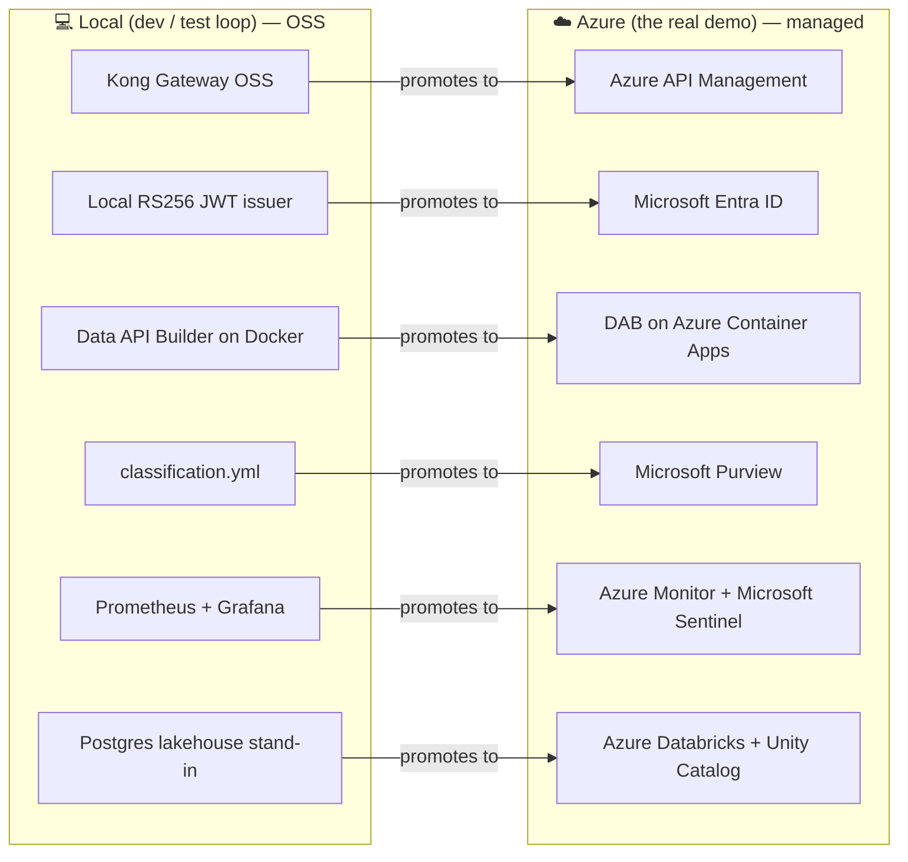
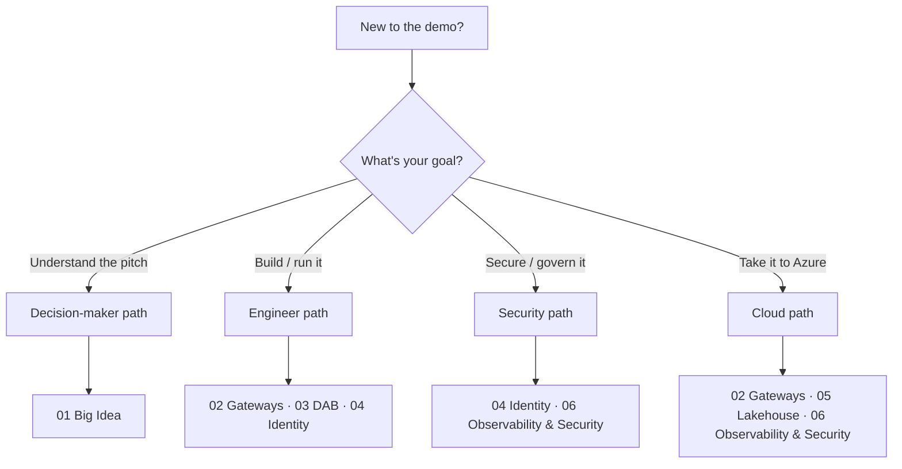
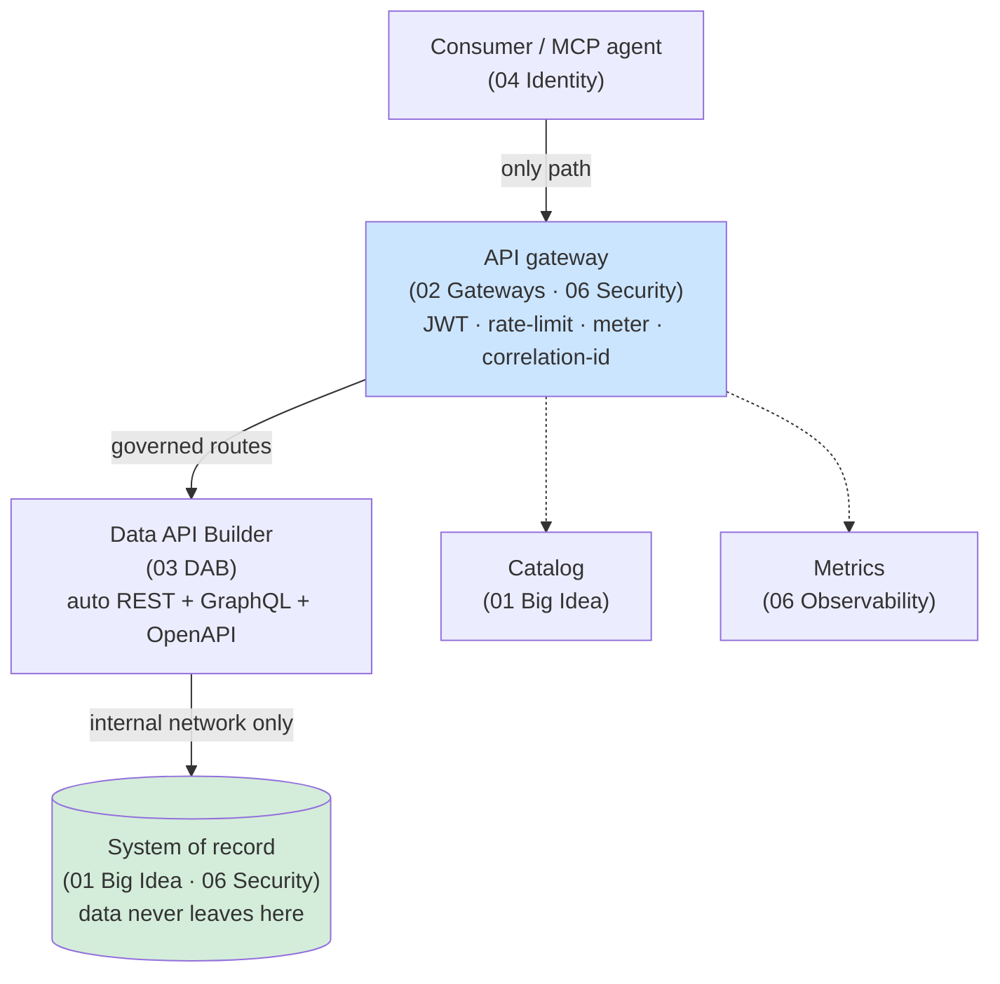

# 📚 Concept primers — the ideas behind the demo

[Home](../../README.md) > [Documentation](../README.md) > **Concept primers**

> [!WARNING]
> **Illustrative reference · sample / synthetic data only · not an official NASA
> document.** Every record in this repo is generated by
> [`data/synthetic_data.py`](../../data/synthetic_data.py); there is no real
> mission data here. Read **[DISCLAIMER.md](../DISCLAIMER.md)** before sharing or
> adapting any of it.

> [!NOTE]
> **TL;DR — what this folder is.** The rest of the `docs/` tree tells you *how to
> run* the demo. This folder explains *why each piece exists* and *what problem it
> solves*, for an engineer who has never touched an API gateway, a JWT, Data API
> Builder, or Azure. Read the primers here **first** if the demo feels like a wall
> of unfamiliar acronyms; then go run it. Each primer teaches one idea, defines its
> terms, and points to the exact code and the managed **Azure** service it maps to.

---

## 📑 On this page

- [Why these primers exist](#-why-these-primers-exist)
- [The one big idea: API-first, zero-move data marketplace](#-the-one-big-idea-api-first-zero-move-data-marketplace)
- [Azure-first framing (read this before the primers)](#-azure-first-framing-read-this-before-the-primers)
- [The primers (what you will learn in each)](#-the-primers-what-you-will-learn-in-each)
- [Reading paths by role](#-reading-paths-by-role)
- [How the concepts fit together](#-how-the-concepts-fit-together)
- [Local OSS → Azure managed cheat-sheet](#-local-oss--azure-managed-cheat-sheet)
- [Gotchas & where to next](#-gotchas--where-to-next)

---

## 🎯 Why these primers exist

This proof-of-concept (POC) demonstrates a single enterprise pattern: **give people
and AI agents governed access to data through APIs, without ever copying the data out
of its system of record.** That sentence hides a lot of moving parts — an API
gateway, an identity issuer, an auto-generated data API, a catalog, classification
rules, and observability — and most engineers have met only a few of them.

The runbooks ([`DEMO-DAY.md`](../DEMO-DAY.md), [`DEMO-SCRIPT.md`](../DEMO-SCRIPT.md))
assume you already know what a JWT is and why a gateway sits in front of a database.
These primers remove that assumption. Each one is a short, self-contained lesson:
**the problem first, then the term, then the worked example, then where it lives in
this repo and in Azure.**

> [!TIP]
> **In plain terms:** the `docs/` root is the *operator's manual*; `docs/concepts/`
> is the *textbook*. If you can already explain "zero-move" and "API-first" to a
> colleague, skip straight to [`DEMO-DAY.md`](../DEMO-DAY.md). If you can't, start
> here.

---

## 💡 The one big idea: API-first, zero-move data marketplace

Three words carry the whole story. Define them once and the rest of the demo falls
into place:

| Term | Plain-terms definition | Why it matters here |
|---|---|---|
| **API-first** | The *only* sanctioned way to reach the data is a documented API — not a database login, not a file drop, not a nightly export. The contract (its shape, owner, and rules) comes before any consumer. | A consumer (analyst, app, or AI agent) integrates once against a stable contract instead of learning the database's internals. |
| **Zero-move** | The data stays in its system of record; no copy is shipped to the consumer. The consumer asks a question and gets an answer *through the API*, but the rows live in exactly one place. | Copies are where governance, classification, and freshness go to die. No copy = one place to secure, label, and audit. |
| **Data marketplace** | A discoverable, governed catalog of data products — each with an owner, a classification, a request path, and a rate limit — that consumers can find and use self-service. | Turns "email the DBA and hope" into "find it in the catalog, present a token, get rows." |

> [!NOTE]
> **Why this matters (the enterprise story):** a NASA-shaped mission program has SAP
> procurement data, transportation data, and more, each owned by a different team and
> each sensitive in different ways. Copying it all into one lake to "make it
> accessible" creates a second thing to secure and a stale snapshot. API-first +
> zero-move lets every consumer — including a Copilot-style AI agent — reach the
> *live* governed surface without anyone ever shipping the underlying records.

---

## 🌐 Azure-first framing (read this before the primers)

> [!IMPORTANT]
> **This is an enterprise Azure proof-of-concept.** The primary story is *"deploy to
> Azure to show the full art of the possible."* You run the stack locally with Docker
> as the **develop / test loop** — it is fast, free, and needs nothing but Docker —
> and you **deploy to Azure for the real demo**, where every local open-source (OSS)
> component is replaced by its managed Azure service.

Every primer is written against this mental model: **learn the concept on the local
OSS analogue, then read it as the Azure managed service it stands in for.** That
mapping is the spine of the whole POC.

> [!TIP]
> **In plain terms:** the OSS tools are *training wheels you can run on your laptop*.
> The pattern you learn is identical to the managed Azure version — you swap the
> implementation, not the architecture. The full swap table lives in
> [`AZURE-DEPLOYMENT.md`](../AZURE-DEPLOYMENT.md) and is summarized
> [below](#-local-oss--azure-managed-cheat-sheet).

---

## 🧩 The primers (what you will learn in each)

> [!NOTE]
> The primers are **six numbered chapters**, ordered so each builds on the last. Read
> them top to bottom for the full arc, or jump to the one you need. The **"grounded
> in"** column points to the deep-dive doc and the exact code each chapter draws on, so
> you can always go deeper.

| # | Primer | What you will learn (one line) | Grounded in |
|---|---|---|---|
| 1 | [`01-the-big-idea.md`](01-the-big-idea.md) | The whole pattern from first principles: **API-first** (a documented API is the only sanctioned path to data), **zero-move** (data stays in its system of record), and **data marketplace** (a governed, discoverable catalog). Why copies are costly and how zero-move removes them. | [`ARCHITECTURE.md`](../ARCHITECTURE.md) · [`ZERO-MOVE.md`](../ZERO-MOVE.md) · [`tests/test_zero_move.py`](../../tests/test_zero_move.py) |
| 2 | [`02-api-gateways.md`](02-api-gateways.md) | What an API gateway is, why the gateway (not the database) is the only path to data, the jobs it does on every call (authenticate, rate-limit, meter, route, stamp a correlation id), and how local **Kong OSS** maps one-for-one onto **Azure API Management**. | [`services/gateway/kong.yml`](../../services/gateway/kong.yml) · [`APIM-EDITION.md`](../APIM-EDITION.md) · [`APIM-CAPABILITIES.md`](../APIM-CAPABILITIES.md) |
| 3 | [`03-data-api-builder.md`](03-data-api-builder.md) | How Microsoft **Data API Builder (DAB)** generates a full REST + GraphQL + OpenAPI surface over a database with *no hand-written API code*, how to read `dab-config.json`, and how field-level redaction works. | [`GRAPHQL.md`](../GRAPHQL.md) · [`services/dab`](../../services/dab) |
| 4 | [`04-identity-jwt-oauth.md`](04-identity-jwt-oauth.md) | What an OAuth2 bearer token / JWT is, how RS256 signing + a JWKS let the gateway trust a token, the full mint → present → validate handshake, and why the local issuer stands in for **Microsoft Entra ID**. | [`SECURITY.md`](../SECURITY.md) · [`services/identity`](../../services/identity) |
| 5 | [`05-lakehouse-databricks.md`](05-lakehouse-databricks.md) | The lakehouse from zero: **Delta Lake**, the **Bronze/Silver/Gold medallion**, **Unity Catalog**, **Databricks SQL**, and **Delta Sharing** — and how the lakehouse is just another governed consumer reading *through* the gateway. | [`DATABRICKS-WALKTHROUGH.md`](../DATABRICKS-WALKTHROUGH.md) · [`databricks`](../../databricks) |
| 6 | [`06-observability-and-security.md`](06-observability-and-security.md) | Metrics vs logs vs traces and the Kong → Prometheus → Grafana pipeline, plus defense-in-depth security as four layers (identity, OWASP gateway controls, classify-before-exposure, field-level redaction). Includes the OWASP API Top 10 mapping. | [`SECURITY.md`](../SECURITY.md) · [`observability`](../../observability) · [`data/classification.yml`](../../data/classification.yml) |

> [!TIP]
> Two reference companions sit beside the primers: the
> [`GLOSSARY.md`](../GLOSSARY.md) (every term and SAP field name in one place) and the
> [`API.md`](../API.md) contract reference (the exact routes, token flow, and status
> contract). Multi-source federation and the onboarding wizard are covered in
> [`ADD-A-SOURCE.md`](../ADD-A-SOURCE.md); the MCP agent path in
> [`services/mcp`](../../services/mcp).

---

## 🧭 Reading paths by role

Different readers need different doors. Pick the path that matches you.

| If you are a… | Read these primers, in order | Then run |
|---|---|---|
| **Decision-maker / architect** (wants the "why") | [`01 The Big Idea`](01-the-big-idea.md) | [`DEMO-DAY.md`](../DEMO-DAY.md) |
| **Application engineer** (wants to consume the API) | [`02 API Gateways`](02-api-gateways.md) → [`03 Data API Builder`](03-data-api-builder.md) → [`04 Identity`](04-identity-jwt-oauth.md) | [`DEMO-SCRIPT.md`](../DEMO-SCRIPT.md) |
| **Security / governance** (wants the controls) | [`04 Identity`](04-identity-jwt-oauth.md) → [`06 Observability & Security`](06-observability-and-security.md) | [`SECURITY.md`](../SECURITY.md) · [`ZERO-MOVE.md`](../ZERO-MOVE.md) |
| **Cloud / platform engineer** (wants Azure) | [`02 API Gateways`](02-api-gateways.md) → [`05 The Lakehouse`](05-lakehouse-databricks.md) → [`06 Observability & Security`](06-observability-and-security.md) | [`AZURE-LIVE-DEPLOYMENT.md`](../AZURE-LIVE-DEPLOYMENT.md) |

---

## 🗺️ How the concepts fit together

Every primer is one box in the same end-to-end flow. Seeing the whole picture first
makes each lesson land faster.

> [!NOTE]
> **Why this matters:** notice there is **no arrow from the consumer to the system of
> record**. That single missing arrow *is* zero-move. Every primer in the security and
> foundations sections exists to keep that arrow from ever being drawn.

---

## 🔁 Local OSS → Azure managed cheat-sheet

Keep this open while you read any primer — it is the Rosetta Stone between the laptop
demo and the Azure demo. (Full, authoritative table:
[`AZURE-DEPLOYMENT.md`](../AZURE-DEPLOYMENT.md).)

| Concept | Local OSS analogue (what you run) | Azure managed service (the real demo) |
|---|---|---|
| API gateway | **Kong Gateway OSS** (DB-less) | **Azure API Management** |
| Identity / tokens | Local **RS256 JWT issuer** + JWKS | **Microsoft Entra ID** |
| Auto-generated data API | **Data API Builder** on Docker | **Data API Builder on Azure Container Apps** |
| System of record | **PostgreSQL 16** (internal network) | **Azure Database for PostgreSQL — Flexible Server** |
| Classify before exposure | `data/classification.yml` at seed | **Microsoft Purview** |
| Observability + SIEM | **Prometheus + Grafana** | **Azure Monitor** + **Microsoft Sentinel** |
| Secrets | `.env` + runtime-generated key | **Azure Key Vault** + managed identity |
| Data platform | Postgres / medallion stand-in | **Azure Databricks + Unity Catalog + Delta Lake** |

> [!IMPORTANT]
> **One deliberate exclusion:** this design does **not** use Microsoft Fabric / OneLake
> (it is not available in Azure Government / GCC for this scenario). The managed data
> platform here is Azure Databricks with managed Unity Catalog + Databricks SQL + Delta
> Lake + Delta Sharing on ADLS Gen2, which runs in commercial Azure at FedRAMP High. See
> [`AZURE-DEPLOYMENT.md`](../AZURE-DEPLOYMENT.md) for the posture and the
> Azure-Government exception.

---

## ⚠️ Gotchas & where to next

> [!WARNING]
> **Common newcomer trip-ups**
>
> - **"I'll just connect to Postgres directly to check the data."** You can't — and
>   that's the point. Postgres and DAB publish **no host ports** and sit on an
>   egress-disabled `internal` Docker network. The only door is the gateway. See
>   [`01 The Big Idea`](01-the-big-idea.md) / [`ZERO-MOVE.md`](../ZERO-MOVE.md).
> - **"The API returned a 401 / 429."** That's the security model working, not a bug —
>   no token → `401` at the edge; over your rate limit → `429` with `Retry-After`. See
>   [`SECURITY.md`](../SECURITY.md).
> - **"Where are the cost columns?"** Confidential columns (unit cost, net price) are
>   redacted at the data API for the default consumer — by design. See
>   [`06 Observability & Security`](06-observability-and-security.md) /
>   [`SECURITY.md`](../SECURITY.md).
> - **"This is Kong, not Azure."** Correct — Kong is the local *develop / test* loop.
>   The Azure demo swaps it for API Management; the pattern is identical. See
>   [`APIM-EDITION.md`](../APIM-EDITION.md).

**Where to next:**

- Ready to see it run? → [`DEMO-DAY.md`](../DEMO-DAY.md) (full end-to-end runbook) or
  [`DEMO-SCRIPT.md`](../DEMO-SCRIPT.md) (~10-minute local walkthrough).
- Want the architecture in one page? → [`ARCHITECTURE.md`](../ARCHITECTURE.md).
- Want the legal / data notice? → [`DISCLAIMER.md`](../DISCLAIMER.md).
- Back to the full documentation index → [`docs/README.md`](../README.md).
