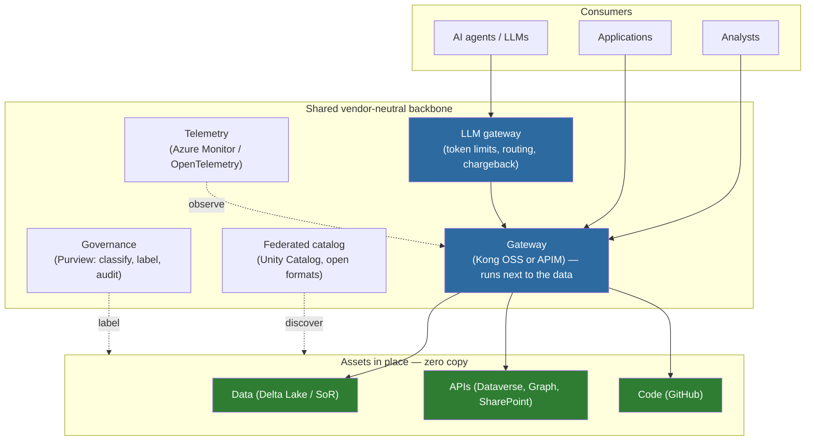

# One Platform for Data, APIs, and Code

### Microsoft as the secure interoperability layer for an API-first, multi-model, zero-move mission enterprise

*An illustrative NASA-mission use case — API-First Data Marketplace (reference architecture).*

> ⚠️ **Illustrative reference · sample data only · not an official NASA document.**
> This paper presents a **generic** API-first, zero-move data-marketplace use case for a
> mission enterprise. It is an educational architecture illustration — **not** affiliated
> with, endorsed by, or approved by NASA, and not a proposal, commitment, or statement of
> work. All names, vendors, prices, quantities, dates, and scenarios are **synthetic and
> fabricated**; **no real NASA, ITAR, CUI, or procurement-sensitive data** is included.
> Product and architecture choices are examples — verify against current vendor docs.
> Provided "as is," without warranty. See [`../DISCLAIMER.md`](../DISCLAIMER.md).

---

## 📑 Table of Contents

- [Executive summary](#-executive-summary)
- [Context — the directive, the stakes, and the real blocker](#-context--the-directive-the-stakes-and-the-real-blocker)
- [Making mission data AI-ready — the real first move](#-making-mission-data-ai-ready--the-real-first-move)
- [The shared backbone (vendor-neutral)](#️-the-shared-backbone-vendor-neutral)
- [Track A — API-first data exposure](#-track-a--api-first-data-exposure)
- [Track B — Software assurance and code modernization](#-track-b--software-assurance-and-code-modernization)
- [The LLM gateway as the unifying runtime](#-the-llm-gateway-as-the-unifying-runtime)
- [A cost-range model you can populate per source](#-a-cost-range-model-you-can-populate-per-source)
- [Phased path and the two first pilots](#️-phased-path-and-the-two-first-pilots)
- [Resourcing](#-resourcing)
- [Next steps](#-next-steps)
- [References](#-references)

---

## 📌 Executive summary

The agency is building an **API-first, multi-model, zero-move data ecosystem**
across distributed centers. The right architectural insight is already in hand:
keep data where it lives, catalog the metadata, connect compute where it is
needed, and avoid vendor lock-in with open formats and an open-source-leaning
gateway. The blocker is not access control — it is that mission data is
un-inventoried and inconsistently labeled, and that decades of in-house code are
un-scanned and un-modernized. Those two problems — **dirty data and un-inventoried
code** — are the real work.

Microsoft's proposition is deliberately not "one AI." It is **one platform that
catalogs and governs three asset classes — data, APIs, and code — over a shared,
vendor-neutral backbone**, with large language models acting as both the scaling
lever and a governed consumption surface. We are the secure interoperability,
orchestration, and governance layer that makes a multi-vendor ecosystem work, on
open standards (OData v4, the Model Context Protocol, OAuth 2.0), with the **least
possible burden** on the systems the agency already runs.

This paper sets out one program with two interlocked tracks over a shared backbone:

- **Track A — API-first data exposure.** Expose mission data in place through
  governed APIs, with an open-source gateway path and a managed gateway path
  presented honestly side by side. Microsoft surfaces — Dataverse, GitHub,
  SharePoint, and Microsoft 365 Graph — are first-class API-first sources.
- **Track B — Software assurance and code modernization.** Consolidate source
  control into a single governed inventory; scan and triage vulnerabilities with
  AI assistance; refactor legacy code to expose APIs; publish security specs and
  API contracts as catalog entries; enforce API risk controls at the gateway; and
  establish supply-chain integrity.

A shared **LLM gateway** unifies both tracks and addresses the cost trajectory of
today's token-broker approach: token governance, multi-model routing, per-org
chargeback, audit, and prompt-injection guardrails. We recommend **two parallel,
contained first pilots** — a software-assurance pilot on consolidated source
control (Track B) and the Artemis supply-chain procurement workstream (Track A) —
as the program's first measurable outcomes, on a phased path into the next fiscal
year. Azure infrastructure costs in this program are validated against live Azure
list pricing; staffing is presented as a capability model with no dollar figures.

> **The frame for the whole program:** build one platform that catalogs and governs
> data, APIs, and code — and let Microsoft be the connective tissue that makes the
> multi-model, zero-move ecosystem interoperate, securely and uniformly, without
> moving the data.

**Two arguments no alternative can rebut.** First, **the agency's identity is
already Microsoft Entra ID** — the same identity substrate sits under every layer
of this program: the gateway's token validation, the LLM gateway's per-consumer
metering, the agents that consume APIs, and the zero-trust wrap over the whole
fabric. That is not a feature; it is the moat. Whichever gateway, catalog, or model
the agency chooses, the identity and authorization spine is already Microsoft, so
the least-burden claim is real rather than aspirational. Second, **the agency
already owns the API surfaces that the directive will require it to expose** —
Dataverse, GitHub, SharePoint, and Microsoft 365 Graph. There is nothing to
acquire; these are existing investments that simply need to be turned on as
governed, discoverable APIs.

> Stated plainly: **we do not need to win the gateway.** We win on the identity that
> is already in place, the API surfaces the agency already owns, the LLM economics
> at the gateway, and the code-assurance layer around it. The gateway can be
> open-source and divestable — and Microsoft is still indispensable.

## 📋 Context — the directive, the stakes, and the real blocker

An Administrator-level directive will ask every organization to expose its mission
data through governed APIs, discoverable in an enterprise catalog, with access
controls — an **enterprise entitlement** led and coordinated by the OCIO and
targeted at a subsequent program phase. Resources accompany the directive; mission
organizations are not asked to self-fund participation.

The priorities are the Ignition-Day missions — Artemis III, Moon Base, and SR-1
Freedom — and the data sets that serve them. But the program's leadership has been
candid that the obstacle is not identity or access control, which largely work
today. The obstacle is **data quality and governance**: data is spread across
silos, inconsistently labeled, and hard to interrogate, which is exactly why
forward-deployed integration efforts struggle to tease apart what is truly
sensitive from what is shareable. In parallel, **software assurance** — scanning
in-house code for vulnerabilities and modernizing it — has emerged as a top-priority
cybersecurity need that competes with, and complements, the API-first push.

A credible program therefore leads with governance and inventory, not with a
gateway purchase. The gateway matters, but it is the smaller, well-understood part;
the effort concentrates in building APIs on systems that do not yet expose one, in
remediating data quality, and in inventorying and assuring code.

## 🗄️ Making mission data AI-ready — the real first move

The first move is not a gateway; it is making the data trustworthy enough to
expose. A useful way to frame it: you would not open the doors of a house you
inherited and sell everything inside before you inventoried it — you would walk the
rooms, catalog what is there, and mark what is a protected heirloom versus what
anyone can take. The same discipline applies to mission data: **inventory and
classify before you expose anything.** This is also where forward-deployed
integration efforts that wire data directly into a single vendor's platform get
stuck — they create a new silo without first establishing what the data is, who
owns it, and how sensitive it is. The program's first investment is the opposite:
make the data discoverable and correctly labeled *once*, so it can be consumed
anywhere, by any tool, under the right controls.

Concretely, the AI-ready data work has five parts, and Microsoft has a defined
answer for each:

- **Authoritative source and lineage.** Designate the system of record for each
  data set and trace where copies and derivations came from, so consumers know
  which version is canonical. Microsoft Purview provides data lineage and a unified
  catalog across the estate. [13][14]
- **A metadata-entry standard.** Much of the "dirty data" problem is that records
  were entered without a consistent standard, so the same field means different
  things in different centers. Fixing this is a standards-and-stewardship exercise,
  not a tooling purchase — but the catalog is where the standard is enforced and
  measured going forward.
- **Bootstrapping a catalog when existing labels are wrong.** Where prior labeling
  is incomplete or incorrect, Purview data quality (profiling, rules across six
  dimensions, and scoring rolled up from column to data-product to governance
  domain) and classification/auto-labeling re-establish a trustworthy baseline,
  rather than trusting labels that were never applied to a standard. [15][16]
- **A data-steward workflow.** Classification is a human-in-the-loop discipline: a
  steward reviews proposed classifications, resolves authoritative-source
  conflicts, and signs off before a data product is published. The catalog makes
  that workflow inspectable and auditable.
- **Classify before exposure, at the gateway boundary.** Only after a data product
  is inventoried, lineage-traced, and labeled does it become a catalog entry the
  gateway will serve — so confidential records are governed differently from
  routine ones from the first call.

> **Build on what is already deployed, do not restart.** The agency has already run
> a Microsoft Purview crawl of its estate. The recommendation is not a new tool or a
> restart — it is to operationalize that investment: turn the crawl results into
> authoritative-source designations, a metadata standard, and a steward workflow,
> and make the catalog the enforcement point. This is the step that unblocks
> everything downstream, including efforts elsewhere in the agency that are stalled
> precisely because the data was never inventoried and labeled to a standard.

> _Figure: The shared backbone — one platform across data, APIs, and code, with the gateway next to the data — see docs/architecture.png._

## 🏗️ The shared backbone (vendor-neutral)

Both tracks ride one backbone. It is described in capability terms so it holds
regardless of which gateway or catalog the agency ultimately selects.

| Backbone capability | What it does | How it stays vendor-neutral |
|---|---|---|
| **Gateway** | One governed front door that brokers, secures, rate-limits, and observes every API across platforms — running *next to the data*. | Open-source self-hosted (Kong on AKS) **or** managed (Azure API Management) — same pattern, honest trade-offs (Track A). |
| **Federated catalog** | Discover data, APIs, and code without moving anything; metadata first, compute where needed. | Open metadata catalog (Unity Catalog) and open formats (Delta Lake, Delta Sharing). |
| **Governance** | Classify, label, and audit data and APIs; enforce sensitivity at the boundary. | Microsoft Purview for catalog and classification; sensitivity labels travel with the data. |
| **Telemetry** | Uniform observability, usage metering, and audit across centers. | Azure Monitor, Log Analytics, Application Insights — open export via OpenTelemetry. |
| **LLM gateway** | Govern model consumption: token limits, multi-model routing, per-org chargeback, prompt-injection guardrails. | APIM AI gateway extends the same gateway; routes to any model provider over open schemas. |

The backbone honors the agency's stated posture: **zero copy** (the gateway brokers
calls to data in place; no bulk migration to expose or govern), **open-source
preference** (open formats and an OSS gateway option), and **divestability** (open
metadata and storage formats the agency can move away from).

**Divestability is a demonstrated exit, not a promise.** Lock-in avoidance is a
hard requirement, so every layer of the backbone has a defined way out:

| Layer | How you leave |
|---|---|
| **Data format** | Data is stored in **Delta Lake**, an open format on open ADLS Gen2 — readable by any engine, with no proprietary conversion to exit. |
| **Cross-center sharing** | **Delta Sharing** is an open protocol; recipients consume shared data on any platform, not a vendor's client. |
| **Catalog / metadata** | **Unity Catalog is open source** and self-hostable on agency-controlled compute; the metadata is not trapped in a managed service. |
| **APIs** | An API governed by Azure API Management **exports as an OpenAPI specification**; the contracts and policies port to the open-source Kong gateway. |
| **Microsoft surfaces** | **Dataverse** is reachable through its open **OData v4 Web API**, so its data is exportable by any standards-based client, not just Microsoft tools. |

This converts the divestability *claim* into a demonstrated *exit* for each
component — which is precisely what de-risks committing to the program. [17][18][19][20][2]

## 🔌 Track A — API-first data exposure

Track A exposes mission data, in place, through governed and discoverable APIs.

**Two gateway paths, presented honestly.** The agency leans toward an open-source,
self-hosted gateway to avoid lock-in. We present both paths side by side rather
than steer to a product:

- **Open-source path — Kong Gateway, self-hosted on Azure Kubernetes Service.**
  Maximum divestability and configurability; the agency owns patching, plugin
  CVE management, and operations. This is the right fit where avoiding lock-in is
  paramount and the team has the operational capacity.
- **Managed path — Azure API Management.** A fully managed gateway with native
  identity integration, a documented zero-trust posture, built-in observability,
  and an AI gateway for token and cost governance — at the cost of a managed
  dependency. This is the right fit where operational burden and CVE management
  should be Microsoft's responsibility, not the agency's. [1]

Either way the *pattern* is identical: the gateway sits in front of the system of
record, validates identity, throttles and meters, and publishes the API to a
catalog. The agency can even run both — Kong where divestability dominates, APIM
where managed governance and the LLM gateway dominate — under one catalog.

**Microsoft surfaces as first-class API-first sources.** The agency already owns
significant Microsoft assets that must become API-accessible. Each is an open,
standards-based surface:

- **Dataverse** exposes an **OData v4 RESTful Web API**; you discover the entire
  schema by appending `$metadata` to the service root, which returns the
  authoritative CSDL document describing every table, column, relationship, action,
  and function. Authentication is OAuth 2.0 with Microsoft Entra ID; non-interactive
  callers use an application user bound to a least-privilege role. This directly
  answers the question of how Dataverse is reached by API and how its contents are
  discovered. [2][3][4]
- **Microsoft 365 Graph** is a single endpoint for people-centric M365 data —
  mail, calendar, files, Teams, SharePoint and more — over REST/OData; it surfaces
  and governs that M365 content alongside the mission systems (for example, the
  contracting-officer correspondence and documents that give a procurement record
  its human context), without exporting it. SAP itself is reached through its own
  SAP connectors — see the *Artemis Worked Example* — not through Graph. [5]
- **SharePoint** lists and document libraries are reachable through the same Graph
  surface, governed at the gateway.
- **GitHub** is the code surface — addressed in depth in Track B.

**Onboarding is the cost lever — make it a factory.** Most systems do not yet
expose an API. The largest body of work, and the largest cost, is building APIs on
the underlying sources and remediating the data quality that has to precede them.
The program's central investment should be a **repeatable onboarding factory** — a
paved path to expose, label, catalog, and govern a new source — not bespoke
one-off integrations.

## 🔒 Track B — Software assurance and code modernization

Code is where the data lives and how the missions run. Track B treats code as a
governed asset class alongside data and APIs.

- **Consolidated source control as the inventory.** A single governed source-control
  enterprise replaces a fragmented estate of disconnected accounts, giving central
  identity, policy, and enterprise-wide visibility — the inventory that software
  assurance and modernization require. *(This is the agency's GitHub-consolidation
  workstream, led by the GitHub team; it is referenced here as the Track B
  foundation, not reproduced.)*
- **AI-assisted vulnerability scanning and triage.** GitHub Advanced Security
  provides code scanning (CodeQL), secret scanning with push protection, and
  dependency review across the enterprise from one console; Microsoft Defender for
  Cloud adds DevOps and code-to-cloud posture management. This is the platform for
  the agency's in-house code-scanning priority. [6][7][11][12]
- **LLM-assisted refactoring to expose APIs.** AI coding assistance accelerates
  modernizing legacy code to expose interfaces — turning un-API'd systems into
  governed API surfaces that Track A then onboards.
- **Security specs and API contracts as catalog entries.** Software bills of
  materials and OpenAPI definitions become first-class, discoverable catalog
  entries alongside data products — code, APIs, and data in one catalog.
- **API risk controls at the gateway.** The OWASP API Security Top 10 (2023) risks
  are enforced at the gateway — Microsoft publishes an explicit mapping of APIM
  policies (JWT/Entra-token validation, rate-limit, quota, IP filtering, mTLS, and
  LLM content safety) to each risk — the same gateway that fronts the data. [1][8][10]
- **Supply-chain integrity.** Signed builds, build provenance and artifact
  attestations, and CVE-to-API traceability close the loop from a vulnerability to
  the API and the mission that depend on it.

## ⚡ The LLM gateway as the unifying runtime

Both tracks generate model traffic — agents reading data through Track A, AI
assistance scanning and modernizing code in Track B. Today's token-broker approach
works but is on a cost trajectory the program expects to outgrow as coding usage
scales. The answer is to put an **LLM gateway** in front of every model, whoever
provides it:

- **Token governance** — per-consumer token-per-minute limits and renewable
  quotas, so a few heavy users cannot exhaust the budget.
- **Multi-model routing** — one governed interface to many models from many
  providers; pick the right model per use case without changing client code.
- **Per-org chargeback** — usage metered and attributed per organization, so cost
  is visible and allocable across centers.
- **Audit and guardrails** — per-consumer token metrics, content safety, and
  prompt-injection protections at the boundary.

Azure API Management's AI gateway provides exactly these controls as an extension
of the same gateway that fronts the data and APIs — token-limit and token-metric
policies, semantic caching, and content safety, over open model schemas. [1][9]
This directly addresses the cost trajectory of the current approach while keeping
model choice open.

> _Validated Azure pricing — generated live by `tools/azure_pricing.py` (Azure Retail Prices API)._

> **Staffing carries no dollar figures.** Azure infrastructure consumption is priced
> above against live Azure list pricing. Staffing and professional-services cost is
> a function of the data-set inventory, modernization depth, and contract vehicle —
> it is presented as a capability model in the companion *Resourcing Framework*, not
> as a dollar range here.

## 💡 A cost-range model you can populate per source

A point quote for "connecting all the data sets" is not credible before the
inventory exists — the spread between an easy source and a hard one is enormous.
Instead of a number, here is a **model**: the cost to onboard any one source is a
function of three variables the agency can assess per source, today, without
Microsoft quoting a figure.

| Variable | LOW end | HIGH end |
|---|---|---|
| **Endpoint exists?** | The source already exposes a usable API/OData endpoint — wrap and govern it at the gateway. | No endpoint — an API must be built on the underlying system before it can be exposed. |
| **Data-quality / labeling state?** | Clean, inventoried, correctly labeled — ready to catalog as-is. | Dirty, un-inventoried, or mislabeled — needs profiling, authoritative-source designation, and a steward pass first. |
| **Modernization depth?** | Modern, maintainable code/system — no refactor to expose an interface. | Legacy code that must be modernized (AI-assisted) to expose an interface at all. |

**Read it as a band, not a point.** A source at the LOW end of all three —
existing endpoint, clean data, modern system — is a thin, repeatable
gateway-onboarding job. A source at the HIGH end of all three — no endpoint, dirty
data, legacy code — carries the full weight of API construction, data remediation,
and modernization. Most sources fall in between, and their position is knowable
once the inventory exists.

> **How to use this.** Score each prioritized source on the three variables, place
> it on the LOW→HIGH band, and the program can self-estimate a low/high cost range
> across the portfolio *before* any external quote — and see immediately that the
> single largest lever is the **onboarding factory** (it collapses the HIGH end
> toward the LOW end by making API construction, data remediation, and
> modernization repeatable rather than bespoke). The *Resourcing Framework*
> develops this model into a per-source scoring sheet. Azure *infrastructure*
> consumption is priced above against live Azure list pricing; staffing and
> services carry no dollar figures.

## 🗺️ Phased path and the two first pilots

We recommend **two parallel, contained, measurable first pilots — one per track —**
rather than tying the first deliverable to a single in-flight effort:

| Phase | Window | Outcome |
|---|---|---|
| **Foundation** | Current year, existing budget | Stand up the shared backbone (gateway, catalog, identity integration, telemetry); establish the governance and authorization workflow; design the onboarding factory. |
| **First pilots (parallel)** | Into a subsequent program phase | **Track B:** software-assurance pilot on consolidated source control — inventory and scan in-house code. **Track A:** Artemis supply-chain (SAP procurement) → governed API façade → catalog entry → consumable downstream. |
| **Scale** | A subsequent program phase | Apply the proven factory and governance patterns center-by-center across the enterprise; extend to additional Ignition-Day data sets. |

The two pilots are chosen for the same reason: each is contained and measurable,
each exercises identity + gateway + telemetry end to end, and together they prove
the program across all three asset classes — data, APIs, and code.

The same onboarding-factory pattern serves the other enterprise use cases the OCIO
is sequencing — including the facilities / asset-management (Maximo-style)
workstream — so prioritizing the two pilots does not drop that audience's
priority; it builds the paved path that facilities and the other Ignition-Day data
sets then ride.

## 🤝 Resourcing

Resourcing is presented as a **capability model** — five role families (platform
engineering, data stewardship and governance, security engineering, modernization
engineering, and product/program management) and three staffing patterns (in-house,
partner-led, blended) with a decision method per workstream. It carries **no vendor
names and no dollar figures**. See the companion *Resourcing Framework*.

## 🚀 Next steps

1. **Confirm the framing** — one platform across data, APIs, and code; Microsoft as
   the interoperability layer, not "the one AI."
2. **Endorse the two parallel first pilots** as the program's first measurable
   outcomes.
3. **Commission the follow-ons** — the Artemis worked example (synthetic procurement
   data), an APIM-as-LLM-gateway demonstration, and a resourcing scope against the
   prioritized data-set inventory.

## 🔗 References

Sources are official Microsoft documentation, except where an open-source
component is cited to its own project site (Unity Catalog). URLs were verified
during research. Competitor capabilities are described generically and without
benchmark claims; products are named only as integration or migration targets.

1. What is Azure API Management?  https://learn.microsoft.com/azure/api-management/api-management-key-concepts
2. Use the Microsoft Dataverse Web API (overview)  https://learn.microsoft.com/power-apps/developer/data-platform/webapi/overview
3. Web API service documents ($metadata / CSDL)  https://learn.microsoft.com/power-apps/developer/data-platform/webapi/web-api-service-documents
4. Use OAuth authentication with Microsoft Dataverse  https://learn.microsoft.com/power-apps/developer/data-platform/authenticate-oauth
5. Overview of Microsoft Graph  https://learn.microsoft.com/graph/overview
6. Set up code scanning — GitHub Advanced Security  https://learn.microsoft.com/azure/devops/repos/security/github-advanced-security-code-scanning
7. Overview of Microsoft Defender for Cloud DevOps security  https://learn.microsoft.com/azure/defender-for-cloud/defender-for-devops-introduction
8. API Management policy reference  https://learn.microsoft.com/azure/api-management/api-management-policies
9. AI gateway capabilities in Azure API Management  https://learn.microsoft.com/azure/api-management/genai-gateway-capabilities
10. Recommendations to mitigate OWASP API Security Top 10 threats using API Management  https://learn.microsoft.com/azure/api-management/mitigate-owasp-api-threats
11. Set up secret scanning — GitHub Advanced Security  https://learn.microsoft.com/azure/devops/repos/security/github-advanced-security-secret-scanning
12. Set up dependency scanning — GitHub Advanced Security  https://learn.microsoft.com/azure/devops/repos/security/github-advanced-security-dependency-scanning
13. Data governance with Microsoft Purview  https://learn.microsoft.com/purview/data-governance-overview
14. Microsoft Purview Unified Catalog  https://learn.microsoft.com/purview/unified-catalog
15. Data quality in Microsoft Purview Unified Catalog  https://learn.microsoft.com/purview/unified-catalog-data-quality
16. Sensitivity labels in the Microsoft Purview Data Map (auto-labeling)  https://learn.microsoft.com/purview/data-map-sensitivity-labels
17. What is Delta Lake in Azure Databricks?  https://learn.microsoft.com/azure/databricks/delta/
18. What is OpenSharing? (Delta Sharing — open protocol)  https://learn.microsoft.com/azure/databricks/delta-sharing/
19. Unity Catalog open-source project (Apache-2.0)  https://unitycatalog.io
20. az apim api — Azure CLI reference (includes `api export` to OpenAPI)  https://learn.microsoft.com/cli/azure/apim/api

*Competitor-anonymized and cleared for external sharing — it discloses no sensitive
internals and names no competitor. Microsoft Fabric and OneLake are intentionally
excluded — they are not available in Azure Government / GCC. The data platform is **Azure Databricks (with managed Unity Catalog,
Databricks SQL, Delta Lake, and Delta Sharing), Azure Synapse, ADLS Gen2, Azure
SQL, and Data API Builder, running in commercial (global) Azure under FedRAMP
High** — the authorization boundary the agency has already accepted for Databricks.
Data classification drives the boundary: unclassified / CUI-adjacent workloads run
in commercial Azure at FedRAMP High; only an ITAR / strict-CUI subset would move to
Azure Government / GCC High, where managed Unity Catalog and Databricks SQL are not
yet available and the open-source Unity Catalog or Microsoft Purview would provide
the catalog instead. Unity Catalog is open-source-rooted, and Delta Lake / Delta
Sharing are open formats, so the divestability commitment holds either way.*
