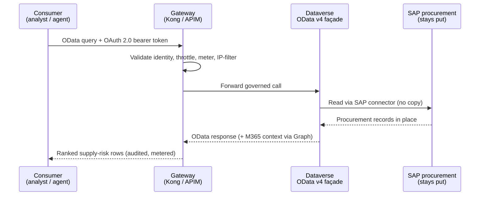

# Artemis Supply-Chain — A Worked Example

### Synthetic SAP procurement → governed API façade → catalog entry → downstream consumable, with zero data movement

*An illustrative NASA-mission use case — API-First Data Marketplace (reference architecture).*

> ⚠️ **Illustrative reference · sample data only · not an official NASA document.**
> This paper presents a **generic** API-first, zero-move data-marketplace use case for a
> mission enterprise. It is an educational architecture illustration — **not** affiliated
> with, endorsed by, or approved by NASA, and not a proposal, commitment, or statement of
> work. All names, vendors, prices, quantities, dates, and scenarios are **synthetic and
> fabricated**; **no real NASA, ITAR, CUI, or procurement-sensitive data** is included.
> Product and architecture choices are examples — verify against current vendor docs.
> Provided "as is," without warranty. See [`../DISCLAIMER.md`](../DISCLAIMER.md).

---

> **Synthetic data — not real NASA procurement.** No public Artemis procurement
> data exists, so this example is built entirely on a **clearly-synthetic**,
> SAP-shaped dataset (generated deterministically; every supplier name carries a
> `(SYNTHETIC)` suffix). It is safe for external sharing and contains no CUI or
> ITAR content. The point is to prove the *pattern* end to end on realistic data.

## 📑 Table of Contents

- [What this example proves](#-what-this-example-proves)
- [The synthetic dataset](#-the-synthetic-dataset)
- [The pattern, step by step](#-the-pattern-step-by-step)
- [Why this is the right first pilot](#-why-this-is-the-right-first-pilot)
- [Reproducing the dataset](#-reproducing-the-dataset)
- [References](#-references)

---

## 📋 What this example proves

The agency's first Track-A pilot is the **Artemis supply-chain (procurement)**
workstream — already in flight, with data owners identified, on an Ignition-Day
priority. The procurement system of record is SAP. This worked example shows the
full API-first, zero-move pattern on that source:

**SAP procurement (stays put) → governed API façade → enterprise catalog entry →
consumed by a downstream agent or analyst — without copying the data.**

It answers the concrete question the program needs answered: *how do we expose a
real system of record as a discoverable, governed API that downstream tools and
agents can use, while the data never leaves its system of record?*

> _Figure: Artemis supply-chain — zero-move API pattern over an SAP procurement source — see docs/architecture.png._

## 🗄️ The synthetic dataset

The generator produces four SAP-shaped tables and a data dictionary. Representative
scale and shape:

| File | Rows | SAP analogue | Purpose |
|---|---|---|---|
| `artemis_vendors.csv` | 26 | LFA1 (vendor master) | Suppliers, CAGE codes, sole-source + small-business flags, past performance |
| `artemis_materials.csv` | 60 | MARA (material master) | Parts by family / program / criticality, standard lead time + unit cost |
| `artemis_purchase_orders.csv` | 240 | EKKO/EKPO (PO header/line) | Orders with promised vs. actual delivery, delay days, pad-anomaly flag |
| `artemis_supply_risk.csv` | 59 | derived | Per-material risk score/tier from sole-source + criticality + delay history |

The dataset deliberately encodes the supply-chain story the program cares about —
**sole-source exposure, lead-time slips, and launch-pad anomaly shocks** — across
the Ignition-Day programs (SR1-Freedom, Moon-Base, Artemis-3, Gateway,
EGS-Ground). Of 60 materials, 14 are sole-sourced and 11 land in the **High** risk
tier. Representative derived risk rows:

| Material | Program | Criticality | Sole-source | POs | Late | Avg delay (days) | Risk | Tier |
|---|---|---|---|---|---|---|---|---|
| Solar array wing | SR1-Freedom | Critical | ✓ | 3 | 2 | 50.3 | 100 | High |
| Turbopump impeller | EGS-Ground | Critical | ✓ | 2 | 2 | 60.0 | 100 | High |
| Mobile launcher umbilical | Artemis-3 | Critical | ✓ | 6 | 4 | 34.8 | 99 | High |
| MLI blanket set | Artemis-3 | Critical | | 2 | 2 | 78.0 | 75 | High |
| Cryo transfer line | SR1-Freedom | Essential | ✓ | 3 | 2 | 58.3 | 75 | High |

This is exactly the question an Administrator wants answered before a launch
window: *which critical, single-supplier parts on this program are slipping?*

## 🔄 The pattern, step by step



### 1 — Expose: the gateway fronts SAP in place

The procurement source stays exactly where it is. The API gateway runs *next to
the data* — a self-hosted gateway (Kong on AKS, or the Azure API Management
self-hosted gateway) needing only outbound TCP 443 — and publishes a read API over
the procurement tables. At the gateway every call is identity-validated, throttled,
metered, and IP-filtered before it ever reaches the backend. No bulk migration
occurs; the gateway brokers the call. [1][2]

### 2 — Façade and enrich: Dataverse as the OData surface

The procurement records are projected into a **Dataverse** façade that exposes them
as an **OData v4 RESTful Web API** — a governed, relational/enrichment surface that
also carries the Microsoft-365 context the program wants (for example, linking a PO
to the contracting officer's mailbox/contacts via Microsoft Graph, instead of
wiring email crawling directly into the procurement system). A consumer discovers
the entire schema by appending `$metadata` to the service root, which returns the
authoritative CSDL document describing every table, column, and relationship. [3][4]

**How you actually reach SAP in reality.** The synthetic data above stands in for a
live SAP procurement system; in production the façade is fed by the standard,
supported SAP-on-Azure integration paths — never by copying SAP into a third-party
platform. For modern SAP (S/4HANA, and SuccessFactors / Ariba / Concur), **SAP OData
services** are the cleanest path — the **Power Platform SAP OData connector** consumes
them as REST/OData, projected straight into the Dataverse OData façade. For classic ERP
(R/3, ECC) and where BAPI/RFC/IDoc is the integration surface, the **Logic Apps SAP
connector** (or the Power Platform SAP ERP connector) calls **BAPIs, RFCs/tRFC, and
IDocs** through the **on-premises data gateway** with the SAP .NET connector (NCo),
authenticating with Microsoft Entra ID (Kerberos or X.509 SSO) so the caller's identity
propagates to SAP. **RISE with SAP on Azure** uses the same pattern — RISE exposes SAP
OData over HTTPS, and RFC/BAPI calls traverse the on-premises data gateway over private
connectivity.

The Microsoft-365 context is a **separate, composed** step, not a single SAP-to-Graph
connector: SAP itself is reached only through the SAP connectors above, while
**Microsoft Graph** independently supplies the M365-side context (the contracting
officer's mail, contacts, and related documents). The two are joined in the Dataverse
façade — so a PO gains its M365 context **without** copying SAP anywhere and without
wiring email crawling into the procurement system. Each verified component is cited on
its own; the SAP-data-with-M365-context outcome is an architecture composition of those
components, not one product. Every SAP path lands in the same Dataverse OData v4 façade
the consumer below queries. [8][9][10][11][12]

A downstream analyst or agent then issues an ordinary OData query — no proprietary
client, just HTTPS + an OAuth 2.0 bearer token — to answer the launch-readiness
question:

```http
GET https://{org}.api.crm.dynamics.com/api/data/v9.2/artemis_supplyrisks
    ?$select=matnr,maktx,program,criticality,sole_source,avg_delay_days,risk_tier
    &$filter=program eq 'Artemis-3'
            and criticality eq 'Critical'
            and sole_source eq true
            and avg_delay_days gt 30
    &$orderby=risk_score desc
Accept: application/json
OData-MaxVersion: 4.0
OData-Version: 4.0
Authorization: Bearer <token>
```

The same query, against the same governed surface, works for a Python data job
(via the official Dataverse SDK or raw `httpx` + an MSAL-acquired token) or for an
AI agent reaching the API as a governed tool through the Model Context Protocol —
the consumer changes; the contract does not. [5][6]

### 3 — Catalog: publish the API and the data product

The API is published to the enterprise catalog as a discoverable entry — with its
OpenAPI contract, owner, classification, and a request path — so a mission team can
*find* the supply-risk API without tribal knowledge and request access through a
real owner. The data product's metadata (the four tables, their lineage, and their
sensitivity labels) is cataloged in **Microsoft Purview**, classified before
exposure so confidential procurement records are governed differently from routine
ones — addressing the program's core data-quality-and-labeling concern up front. [7]

### 4 — Consume: downstream tools and agents, governed centrally

Now the data product is consumable: a Copilot Studio or Foundry agent answers
"which critical sole-source parts on Artemis-3 are slipping and who supplies them,"
joining `materials × supply_risk × vendors` **through the gateway** — never
touching SAP directly, never copying the data. Token usage is metered per consumer
at the LLM gateway; access is enforced by Microsoft Entra ID; every call is audited.

## ✨ Why this is the right first pilot

- **Zero-move proof point.** The SAP source never moves; the gateway brokers,
  meters, and secures, and Dataverse enriches via API. The agency adopts the
  capability without a data-migration project.
- **Contained and measurable.** Data owners are already identified; the success
  metric is concrete — a discoverable, governed supply-risk API answering a real
  launch-readiness question.
- **Repeatable.** Every step — expose, façade, catalog, consume — is a reusable
  station in the onboarding factory. The next source follows the same path.
- **Governance-first.** Classification and labeling happen *before* exposure, which
  is exactly the discipline the broader program depends on.

## 🔧 Reproducing the dataset

The synthetic dataset is generated deterministically (seeded) so the worked example
is reproducible and verifiable, and regenerates identically on any machine:

```python
from app.services.media.customer_brief.synthetic_data import (
    generate_artemis_procurement,
)

result = generate_artemis_procurement("output/nasa_api_first/artemis_data", seed=42)
# -> vendors/materials/purchase_orders/supply_risk CSVs + a Markdown data dictionary
```

## 🔗 References

1. Self-hosted gateway overview (Azure API Management)  https://learn.microsoft.com/azure/api-management/self-hosted-gateway-overview
2. API Management policy reference  https://learn.microsoft.com/azure/api-management/api-management-policies
3. Use the Microsoft Dataverse Web API (overview)  https://learn.microsoft.com/power-apps/developer/data-platform/webapi/overview
4. Web API service documents ($metadata / CSDL)  https://learn.microsoft.com/power-apps/developer/data-platform/webapi/web-api-service-documents
5. Use OData to query data (Dataverse Web API)  https://learn.microsoft.com/power-apps/developer/data-platform/webapi/query/overview
6. About MCP servers in Azure API Management  https://learn.microsoft.com/azure/api-management/mcp-server-overview
7. Use OAuth authentication with Microsoft Dataverse  https://learn.microsoft.com/power-apps/developer/data-platform/authenticate-oauth
8. Connect to SAP from your app using the SAP OData connector (Power Platform)  https://learn.microsoft.com/power-platform/sap/connect/sap-odata-connector
9. Connect to SAP from workflows in Azure Logic Apps (IDoc / BAPI / RFC via NCo)  https://learn.microsoft.com/azure/logic-apps/connectors/sap
10. Connect Power Platform and SAP (SAP ERP RFC/BAPI vs OData; Entra auth, incl. via APIM)  https://learn.microsoft.com/power-platform/sap/connect/connect-power-platform-and-sap
11. Integrate Azure services with SAP RISE (RISE OData over HTTPS; RFC/BAPI via on-prem gateway)  https://learn.microsoft.com/azure/sap/workloads/rise-integration-services
12. Overview of Microsoft Graph (M365-side context: mail, contacts, files)  https://learn.microsoft.com/graph/overview

*Microsoft Fabric and OneLake are intentionally excluded (not available in Azure
Government / GCC). The data platform is Azure Databricks (managed Unity Catalog,
Delta Lake, Delta Sharing) in commercial Azure at FedRAMP High, Azure Synapse, ADLS
Gen2, Azure SQL, and Data API Builder.*
