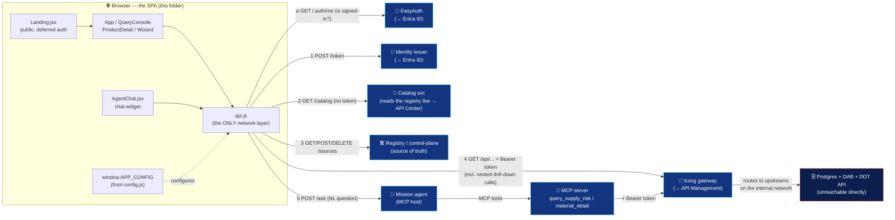
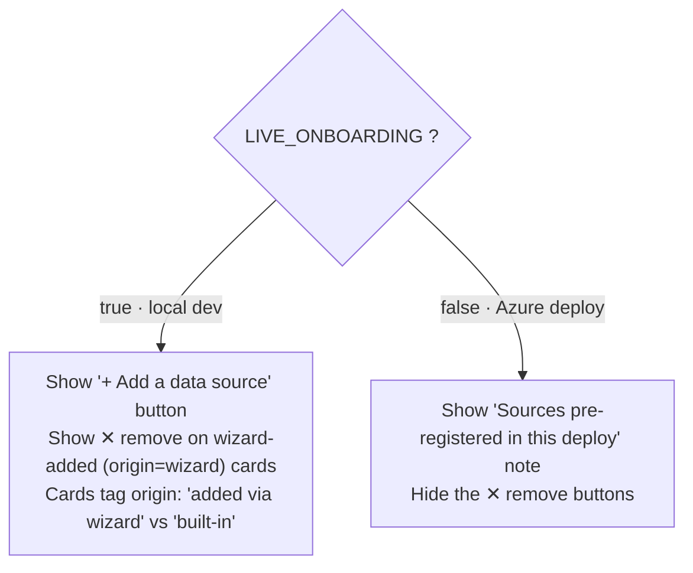
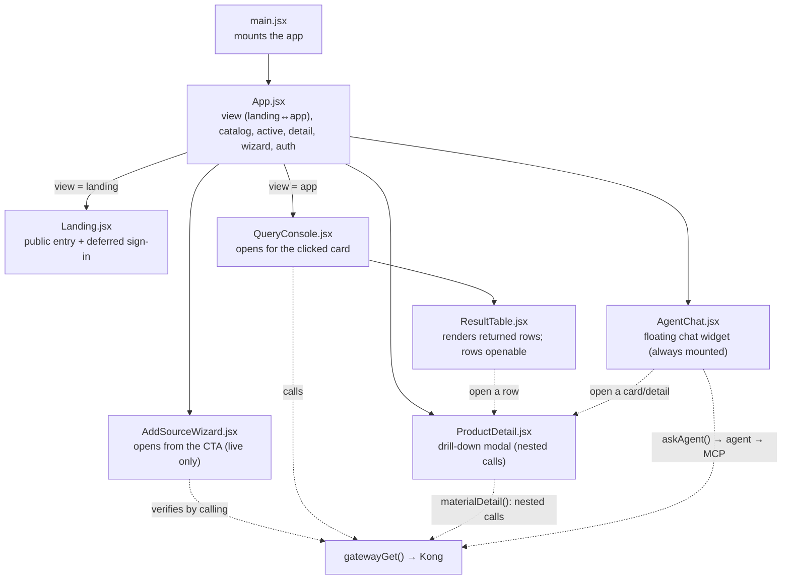

<!-- breadcrumb -->
[nasa-api-first-poc](../README.md) › **frontend**

# 🛰️ Marketplace SPA — the human face of the API-first gateway

> [!NOTE]
> **TL;DR** — This folder is a small [Vite](https://vitejs.dev/)-built [React](https://react.dev/) single-page app (SPA) that *demonstrates* the whole point of the platform: a visitor lands on a **public landing page**, signs in with Microsoft (or explores anonymously), browses a catalog of governed data products, and **queries them live — and every single data call goes through the [Kong](https://konghq.com/) gateway**, never directly to a database. They can **drill into any result row** (which composes several nested governed calls into one product record) and **chat with a grounded mission agent** that answers Artemis supply-chain questions *only* from governed data over MCP, citing its source and the gateway correlation id. The UI holds no secrets and talks to no source directly; it asks the identity issuer for a token, then calls Kong with that token. You develop it with `npm run dev` (hot-reload at `:5173`) and demo it with `make ui` (built + served by nginx in Docker). The same code runs in Azure; only a tiny runtime config file changes.

> [!WARNING]
> **Synthetic data only.** Everything this UI displays is **synthetic** — not real NASA, DOT, or any agency records. It is ITAR/CUI-safe sample data generated for the proof-of-concept. See [`docs/DISCLAIMER.md`](../docs/DISCLAIMER.md).

---

## 📚 Table of contents

- [Why this UI exists (read this first)](#-why-this-ui-exists-read-this-first)
- [The Azure story, and what the local UI stands in for](#-the-azure-story-and-what-the-local-ui-stands-in-for)
- [Architecture at a glance](#-architecture-at-a-glance)
- [The golden rule: every data call goes THROUGH Kong](#-the-golden-rule-every-data-call-goes-through-kong)
- [Project layout](#-project-layout)
- [Runtime config: `config.js` and `window.APP_CONFIG`](#-runtime-config-configjs-and-windowapp_config)
- [The three runtime flags: `authEnabled`, `liveOnboarding`, `agent`](#-the-three-runtime-flags-authenabled-liveonboarding-agent)
- [Component-by-component walkthrough](#-component-by-component-walkthrough)
- [`make ui` vs `npm run dev` — two ways to run](#-make-ui-vs-npm-run-dev--two-ways-to-run)
- [Worked example: query Artemis-3 supply risk through the gateway](#-worked-example-query-artemis-3-supply-risk-through-the-gateway)
- [Accessibility (Section 508 / WCAG 2.1 AA)](#-accessibility-section-508--wcag-21-aa)
- [Gotchas & troubleshooting](#-gotchas--troubleshooting)
- [Where to next](#-where-to-next)

---

## 🎯 Why this UI exists (read this first)

Imagine you are explaining the platform to an executive who has never seen it. You can *say* "we put every data product behind one governed gateway, so nothing moves and everything is authenticated, rate-limited, and metered." That sentence is abstract. This UI makes it **visible and clickable** in about ten seconds:

1. The visitor lands on a **public landing page**, reads the value prop, and signs in with Microsoft (or just explores).
2. They see a **marketplace** of data products (cards), click one, and press **"Run through gateway"**.
3. Rows come back — *and* the screen prints the HTTP status and the gateway's **correlation id**, the unique id [Kong](https://konghq.com/) stamps on every request so it can be traced end-to-end.
4. They **click a row to drill in** — and the screen composes a full product record from *several* nested governed calls, each with its own correlation id, with sensitive cost fields **redacted at the gateway**.
5. They **ask the mission agent** a question in plain English and get a grounded, **source-cited** answer (the same MCP tools Copilot/Foundry would call) — off-topic questions are politely refused, never hallucinated.
6. With the live-onboarding wizard, they can **publish a brand-new data source** and watch it answer through the gateway moments later — no database change, no downtime.

**In plain terms:** the SPA is a *salesperson and a proof* at the same time. It tells the story (zero-move, governed-at-the-edge, add-a-source-in-seconds) and then proves each claim by making a real, traceable call.

**Why this matters:** the architectural claim of this whole repo is that data **never moves** — clients reach it *only* through the gateway. A demo where the browser quietly talked straight to a database would silently contradict that claim. So the UI is deliberately built to have **exactly one path to data: through Kong.** That discipline lives in [`src/api.js`](src/api.js) and is the single most important thing to understand here.

> **Define-on-first-use**
> - **SPA (single-page application):** a web app that loads one HTML page and then updates the view with JavaScript instead of navigating to new pages.
> - **Gateway:** a single front door that all API traffic passes through; it authenticates, rate-limits, logs, and routes requests to the real backend ("upstream"). Here that is Kong.
> - **Zero-move:** the data stays in its system of record; consumers query it in place through the gateway rather than copying ("moving") it into a new store.

---

## ☁️ The Azure story, and what the local UI stands in for

This is an **enterprise proof-of-concept**, and its primary message is *"deploy to Azure to show the full art of the possible."* Local Docker is the **dev/test loop** — you run it locally to build and test, and you deploy to Azure for the real demo. The beauty of this SPA is that **the exact same compiled bundle runs in both places**; only the small runtime [`config.js`](#-runtime-config-configjs-and-windowapp_config) file changes.

Every local open-source component this UI talks to is the stand-in for an Azure managed service:

| The UI calls this locally | …which stands in for this Azure managed service | Why the mapping holds |
| --- | --- | --- |
| **Kong gateway** (`config.kong`) | **Azure API Management (APIM)** | Both are the one governed front door: JWT validation, rate-limit, metering, routing. |
| **Local RS256 JWT issuer** (`config.identity`) | **Microsoft Entra ID** | Both mint signed bearer tokens the gateway validates. The local issuer uses the same RS256 pattern. |
| **Catalog / registry FastAPI services** (`config.catalog`, `config.registry`) | **Azure Container Apps** (the API host) + **Azure API Center** (the catalog) | Container Apps hosts the small services; API Center is the managed catalog of published APIs. |
| **The grounded mission agent + MCP server** (`config.agent`) | **Azure AI Foundry / Copilot agents calling MCP tools** (on **Azure Container Apps**) | Same shape — an AI host invokes governed MCP tools that reach data only through the gateway; the local agent uses the *same open MCP standard* Copilot/Foundry would. |
| **The onboarding wizard's "publish a source"** | **Publishing an API in Azure API Management / API Center** | Same gesture — register an existing upstream and govern it — done through the managed plane in Azure. |

> [!TIP]
> When you demo, narrate the mapping out loud: *"This card list is our catalog — in Azure that's API Center. This 'Run through gateway' button hits Kong — in Azure that's API Management. This token came from a local issuer — in Azure that's Entra ID."* The UI is the storyboard; Azure is the production set.

---

## 🗺️ Architecture at a glance



The arrows from `api.js` are the **only** kinds of network calls the browser makes. Most (auth probe, token, catalog, registry) are control-plane conveniences. The **data** call (4) *always* carries a bearer token and *always* targets Kong. The **agent** call (5) is itself NL-in/answer-out — the agent never returns raw browser-fetched data; it reaches data *only* by calling its MCP tools, which call Kong with their own token and correlation id. So even the AI path obeys the golden rule: **there is no arrow from the browser to a database, and none from the agent either.**

---

## 🔒 The golden rule: every data call goes THROUGH Kong

All network access is centralized in one file, [`src/api.js`](src/api.js), so the rule is easy to audit. Here is the function that fetches data:

```js
// src/api.js — GET through the gateway with a bearer token.
export async function gatewayGet(path, consumer = "analyst") {
  const token = await getToken(consumer);                       // ① mint a token
  const r = await fetch(`${CFG.kong}${path}`, {                 // ② call KONG, not a DB
    headers: { Authorization: `Bearer ${token}` },              // ③ present the token
  });
  const correlationId = r.headers.get("X-Correlation-ID");      // ④ read the trace id
  let raw = null;
  try { raw = await r.json(); } catch { raw = null; }
  // ⑤ DAB collection endpoints return { value: [...] }; by-key endpoints can return the
  //    bare entity. Normalize BOTH to a rows array so the drill-down detail isn't empty.
  const rows = Array.isArray(raw?.value)
    ? raw.value
    : raw && typeof raw === "object" && !("error" in raw) ? [raw] : [];
  return { status: r.status, rows, correlationId, raw };
}
```

Walk through what each step *teaches*:

1. **`getToken(consumer)`** — the UI never hard-codes a credential. It asks the identity issuer (`CFG.identity`) for a fresh signed token for a named consumer (`analyst` or `artemis-agent`). This is the local stand-in for an app getting a token from **Entra ID**.
2. **`fetch(\`${CFG.kong}${path}\`)`** — the data request goes to **Kong's base URL** (`CFG.kong`, e.g. `http://localhost:8000`). Note what is *absent*: there is no Postgres host, no database port, no SQL. The browser literally does not know where the data lives.
3. **`Authorization: Bearer <token>`** — without this header the gateway returns **401** before the request ever reaches a source. The token is how Kong identifies the consumer for auth, rate-limiting, and metering.
4. **`X-Correlation-ID`** — Kong stamps every response with a trace id. The UI surfaces it so a presenter can say "this exact call is now traceable in Grafana." (Grafana/Prometheus here stand in for **Azure Monitor + Sentinel**.)

Step ⑤ is worth a note: the backend speaks **OData**, an open REST query standard, which wraps *collection* results in a top-level `value` array (so `raw.value` is the list of rows). But a **by-key** lookup like `/api/Material/matnr/MAT-0001` returns the bare entity object, not a `{value:[…]}` envelope. The drill-down detail (below) leans heavily on those by-key calls, so `gatewayGet` normalizes **both** shapes into a `rows` array — an envelope becomes its `value`, a single entity becomes a one-element list, and an error body (or `null`) becomes `[]`. That one helper keeps every caller — the query console, the wizard's verify step, and every nested drill-down hop — uniform.

> [!NOTE]
> **Why centralizing matters.** Because *only* `api.js` calls `fetch`, you can prove the zero-move property by reading one file. The repo even has a test, [`tests/test_zero_move.py`](../tests/test_zero_move.py), that proves Postgres and Data API Builder are unreachable from the client network — the network topology enforces what the code promises.

---

## 🧱 Project layout

```text
frontend/
├─ index.html              # HTML shell; loads /config.js BEFORE the app, mounts #root
├─ package.json            # deps (react, react-dom) + scripts (dev/build/preview)
├─ vite.config.js          # Vite + React plugin; dev server on :5173
├─ public/
│  ├─ config.js            # ⚙️ runtime config → sets window.APP_CONFIG (the source of truth)
│  ├─ nasa-logo.svg        # NASA "meatball" logo (masthead + landing page)
│  └─ img/products/        # per-material engineering renders for the drill-down (optional)
├─ src/
│  ├─ main.jsx             # React entry: mounts <App/> into #root (StrictMode)
│  ├─ App.jsx              # routes landing ↔ marketplace; holds catalog/active/detail state
│  ├─ api.js               # 🔒 the ONLY network layer — all data goes through Kong
│  ├─ labels.js            # SAP column → human label map + primary-column ordering
│  ├─ styles.css           # design system + all accessibility CSS
│  └─ components/
│     ├─ Landing.jsx       # 🆕 public landing page: value prop + deferred Entra sign-in
│     ├─ QueryConsole.jsx  # query a selected product THROUGH the gateway; shows correlation id
│     ├─ ResultTable.jsx   # renders any list of row objects as an accessible, openable table
│     ├─ ProductDetail.jsx # 🆕 drill-down modal: composes nested governed calls into one record
│     ├─ AgentChat.jsx     # 🆕 grounded mission-agent chat widget (NL → MCP → gateway → cited)
│     ├─ AddSourceWizard.jsx # 4-step "publish an existing API" flow (live-onboarding only)
│     └─ Emblem.jsx        # original SVG mission emblem (legacy; the live UI uses nasa-logo.svg)
├─ Dockerfile             # multi-stage: Vite build → nginx serves static files
└─ nginx.conf             # SPA fallback + "never cache config.js"
```

> [!TIP]
> Two folders you will see locally are **not** in source control: `node_modules/` (installed deps) and `dist/` (the Vite build output) are both git-ignored. Treat `dist/` as a throwaway artifact — the **source of truth for runtime config is [`public/config.js`](public/config.js)**, which Vite copies into `dist/` at build time.

> [!NOTE]
> **`labels.js` — readable column names.** The data products expose raw SAP-shaped field names (`matnr`, `maktx`, `avg_delay_days`, `netwr`…). [`src/labels.js`](src/labels.js) maps each to a human label (*Material #*, *Material*, *Avg delay (days)*, *Net value (USD)*) and lists `PRIMARY_COLS` so the most useful columns lead the results table. `labelFor(col)` falls back to a title-cased version of the raw name for any field not in the map, so a wizard-added source still renders sensibly. This is why the tables now read like a supply-chain dashboard instead of a database dump.

---

## ⚙️ Runtime config: `config.js` and `window.APP_CONFIG`

A normal React build "bakes in" environment values at compile time. That would force you to **rebuild the app for every environment** (local, Azure dev, Azure demo). This SPA avoids that with a classic, robust pattern: **runtime configuration via a global object.**

In [`index.html`](index.html), a tiny script loads *before* the app bundle:

```html
<!-- index.html -->
<script src="/config.js"></script>          <!-- runs FIRST, defines window.APP_CONFIG -->
...
<script type="module" src="/src/main.jsx"></script>  <!-- the React app, runs AFTER -->
```

That `/config.js` is [`public/config.js`](public/config.js). Vite copies anything in `public/` to the web root verbatim, so the file ships next to `index.html`:

```js
// public/config.js — runtime config (browser-side URLs to the gateway / issuer / catalog).
window.APP_CONFIG = {
  kong: "http://localhost:8000",      // the gateway — ALL data calls go here
  identity: "http://localhost:8081",  // token issuer (→ Entra ID)
  catalog: "http://localhost:8080",   // catalog service (→ API Center)
  registry: "http://localhost:8095",  // control-plane for live onboarding
  agent: "http://localhost:8110",     // grounded mission agent (MCP host) — POST /ask
  liveOnboarding: true,               // show the live "add/remove a source" controls? (see below)
  authEnabled: false,                 // is this deploy behind Entra EasyAuth? (see below)
};
```

[`src/api.js`](src/api.js) reads it on load, with a sane fallback so the dev server still works even if the file is missing:

```js
// src/api.js
const CFG = window.APP_CONFIG || {
  kong: "http://localhost:8000",
  identity: "http://localhost:8081",
  catalog: "http://localhost:8080",
  registry: "http://localhost:8095",
  agent: "http://localhost:8110",
};
export const ENDPOINTS = CFG;  // also rendered in the page footer for transparency
```

**In plain terms:** you build the app **once**. To point it at Azure, you don't recompile — you **swap one small JavaScript file**. The `nginx.conf` even sends `Cache-Control: no-store` for `/config.js` specifically, so a redeploy's new config is never served stale from a browser cache:

```nginx
# frontend/nginx.conf
location = /config.js {
    add_header Cache-Control "no-store";   # runtime config — never cache it
}
location / {
    try_files $uri $uri/ /index.html;      # SPA fallback: deep links resolve to the app
}
```

> [!NOTE]
> **How to point the UI at Azure (or remapped local ports).** Mount a different `config.js` into the nginx container's web root (`/usr/share/nginx/html/config.js`) with the Azure URLs (`https://<your-apim>.azure-api.net`, the Entra-issued token endpoint, etc.) and `liveOnboarding: false`. Same image, new environment. If your machine already uses ports `8000/8080/8081`, remap the host ports and update these URLs to match.

---

## 🚦 The three runtime flags: `authEnabled`, `liveOnboarding`, `agent`

The same compiled bundle behaves like a polished local dev tool **or** a public Azure demo depending on three values in `config.js`. Each is read once in [`src/api.js`](src/api.js) and drives a clean piece of graceful degradation — the app *adapts* to what the environment supports instead of erroring when a capability is absent.

| Flag | Read as | Local default | Azure deploy | Controls |
| --- | --- | --- | --- | --- |
| **`authEnabled`** | `AUTH_ENABLED = CFG.authEnabled === true` | `false` | `true` | Whether the landing page shows the **"Sign in with Microsoft"** (Entra EasyAuth) button. |
| **`liveOnboarding`** | `LIVE_ONBOARDING = CFG.liveOnboarding !== false` | `true` | `false` | Whether the live **add/remove a source** controls (wizard + ✕ on added cards) are shown. |
| **`agent`** | `CFG.agent` (a URL) | `http://localhost:8110` | the agent's Container Apps URL | Where the **mission-agent chat** POSTs its `/ask` questions. |

> [!IMPORTANT]
> Note the deliberately *different* defaults. `authEnabled` is `=== true` (opt-**in** — anonymous unless the deploy turns auth on), while `liveOnboarding` is `!== false` (opt-**out** — the full local experience unless the deploy turns it off). So a stripped-down `config.js` that omits both flags still gives a developer the complete, unauthenticated, fully-interactive local app — only the Azure deploy, which sets `authEnabled:true` and `liveOnboarding:false`, flips to the public-demo posture.

### 🔑 `authEnabled` — deferred authentication and the public landing page

Earlier builds auto-redirected to Entra on load. The frontend's EasyAuth is now **`AllowAnonymous`**, so a visitor first lands on a **public landing page** (the DOT-style pattern): real NASA logo, value prop, and *then* a choice — **Sign in with Microsoft** or **Explore the demo**. Auth no longer fires on page load.

`authEnabled` is read deliberately *not* by probing `/.auth/me` — on Container Apps that path returns the SPA's own HTML when anonymous, so a JSON probe can't reliably answer "is this deploy gated?". The flag answers it instead. The app *separately* makes a best-effort `GET /.auth/me` (via `authStatus()`) to learn whether the visitor is **already signed in** and as whom, so the masthead can show `✓ <name> · sign out`. If that probe returns non-JSON (the anonymous case), the app simply reports "gated, not signed in" and keeps the sign-in button available.

### 🔀 `liveOnboarding` — the live add/remove story

The add/remove-a-source controls need two local-only capabilities: the **registry/control-plane** must have a writable *shared base-config volume*, and **Kong's admin port** must be reachable so a new route can be **hot-added** (config reloaded, no restart). The **Azure Container Apps** deploy has neither — one ingress port per app, no shared volume — so sources are **pre-registered** at deploy time and `liveOnboarding:false` hides the live controls.

What the flag changes in the UI ([`src/App.jsx`](src/App.jsx)):



> [!NOTE]
> **Live add/remove in Azure, via the registry as source of truth.** Even in Azure the demo can show *add then remove*: the seeded **DOT** source is pre-registered yet **removable**, and the wizard re-adds it. This works because the **catalog reads the registry live** (so a removal/re-add is reflected immediately) and the `/dot` Kong route is **pre-baked**, so a re-added DOT routes straight away. The registry runs single-replica in Azure (its source list is ephemeral). The card's `origin` tag (`built-in` vs `added via wizard`) is what gates the ✕ button — only wizard-added cards are removable.

### 🤖 `agent` — where the chat widget points

`config.agent` is the base URL of the grounded mission agent. The chat widget ([`AgentChat.jsx`](src/components/AgentChat.jsx)) calls `askAgent(question)` → `POST {agent}/ask`. Locally that's `http://localhost:8110`; in Azure it's the agent's Container Apps URL (live demo: <https://agent.xxxxxxxx-xxxxxxxx.centralus.azurecontainerapps.io>). If the agent is unreachable the widget shows a friendly "couldn't reach the agent — is the stack up?" message rather than crashing.

This is the project's **graceful degradation** rule made visible three times over: a missing identity provider, a missing control-plane volume, or an unreachable agent each *softens a feature* rather than breaking the page — exactly "services degrade gracefully, never crash on a missing dependency."

---

## 🧩 Component-by-component walkthrough

The data flows top-down through a small, readable tree. There is no router and no global state library — just React state lifted into [`App.jsx`](src/App.jsx), which also acts as a two-screen "router" (`view: "landing" | "app"`).



### 🚀 `main.jsx` — the entry point

Three lines of substance: create a React root on the `#root` div from `index.html` and render `<App/>` inside `<React.StrictMode>`. StrictMode is a development-only wrapper that double-invokes certain functions to surface accidental side-effects; it has no effect in the production build.

### 🏛️ `App.jsx` — the page, the source of truth, and the two-screen router

`App` owns the whole screen and the small amount of state everything else reads:

| State | Meaning |
| --- | --- |
| `view` | `"landing"` or `"app"` — which of the two screens is showing (a tiny built-in router) |
| `auth` | `{ gated, signedIn, name }` from `authStatus()` — drives the sign-in/sign-out chrome |
| `data` | the catalog (`{ products: [...] }`), loaded when `view` becomes `"app"` via `listCatalog()` |
| `active` | the product whose `QueryConsole` is open (or `null`) |
| `detail` | `{ row, consumer }` for the open `ProductDetail` drill-down modal (or `null`) |
| `wizard` | whether the Add-Source modal is open |
| `err` | a catalog-load error message, shown in an alert region |

On mount, `App` calls `authStatus()` (best-effort "am I signed in?") and renders the **`Landing`** screen first; the catalog is only fetched once the visitor enters the marketplace (`view === "app"` triggers `refresh()` → `listCatalog()`, an **unauthenticated** call — browsing the menu doesn't need a token; *ordering* the data does). Each product renders as a **card** that is a real, keyboard-operable button (`role="button"`, `tabIndex={0}`, Enter/Space handler). Cards show owner, domain, the gateway **path**, an **origin** tag (`built-in` vs `added via wizard`), a colored **classification chip** (`Confidential`/`Sensitive`/`Routine`), and an OpenAPI link. Clicking a card sets `active`, which mounts the `QueryConsole` below the grid.

The masthead carries the **NASA logo** (`/nasa-logo.svg`, which doubles as a "back to home/landing" button), the brand, a signed-in/sign-out indicator when applicable, and either the **+ Add a data source** button or the **"Sources pre-registered in this deploy"** note, chosen by `LIVE_ONBOARDING`. A persistent **banner** restates the synthetic-data + zero-move message, and three explainer **panels** ("Zero-move", "Governed at the edge", "Drill-down detail") reinforce the narrative. The **footer** prints the configured endpoint URLs — a transparency touch so a viewer can see exactly where the UI is pointed. `App` also always mounts the floating **`AgentChat`** widget and conditionally mounts the **`ProductDetail`** modal whenever `detail` is set (opened from a result row *or* from an agent card).

### 🚀 `Landing.jsx` — the public front door (deferred auth)

The first thing a visitor sees. It is **public/anonymous** — no auto-redirect to Entra on load. It shows the NASA logo, the eyebrow/title/lede value prop, a row of highlight tiles (Zero data movement · Governed at the edge · Drill-down detail · Lakehouse + Power BI), and the synthetic-data banner. Its call-to-action adapts to `auth`:

- **Gated but not signed in** (`auth.gated && !auth.signedIn`) → a primary **"Sign in with Microsoft"** button (links to `/.auth/login/aad`) plus a secondary **"Explore the demo →"** that enters anonymously.
- **Signed in** → a `✓ Signed in as <name>` note, an **"Enter the marketplace →"** button, and a quiet **Sign out** link.
- **Not gated** (local default) → just **"Explore the demo →"**, styled as the primary CTA.

"Enter" doesn't navigate — it calls `onEnter()` (which sets `view = "app"` in `App`), so the SPA swaps screens in place.

### 📦 `ProductDetail.jsx` — drill-down via nested governed calls

Clicking any material row (in the results table *or* an agent card) opens a **centered floating modal** that composes a *full* product record. On open it calls `materialDetail(matnr)` in [`api.js`](src/api.js), which fires **several governed gateway calls** and stitches them together:

```text
Material (by key) ─┐
SupplyRisk (by key)─┼─ Promise.all ─→ then PurchaseOrder (top-5 by delay)
                    ┘                   └─→ Vendor (by the first PO's lifnr)
```

Every hop goes through Kong with **its own correlation id**, and the modal surfaces all of them — the visible proof that even an assembled, multi-entity view stayed governed end-to-end. The modal shows a **blueprint visual** (a per-material render from `/img/products/{matnr}.png`, or an inline SVG schematic fallback), a risk banner, Material and Supplier fact lists, a recent-purchase-orders table, and a footer noting how many calls were composed. Crucially it calls out that **net price/value and unit cost are *redacted at the gateway*** — the same field-level governance every consumer gets, made tangible. It's a clean a11y modal: `role="dialog"`, `aria-modal="true"`, Escape-to-close, focus moved into the dialog on open and **restored** on close, and backdrop-click to dismiss.

### 🤖 `AgentChat.jsx` — the grounded mission-agent widget

A floating chat widget (a 🚀 FAB that toggles a resizable panel) that is the headline "AI grounded on governed data over the open MCP standard" story. The user types a natural-language question; `askAgent()` does `POST {agent}/ask`; the **agent service is an MCP *host*** that calls the MCP server's tools (`query_supply_risk`, `material_detail`), which reach data **only through Kong**. The panel renders the agent's *structured* reply richly:

- **`render.kind === "materials"`** → ranked, clickable **material cards** (click → the `ProductDetail` drill-down) and, for stats/analytics questions, a **bar chart** (`render.chart`).
- **`render.kind === "detail"`** → a single **detail card** (with a per-material image + fallback glyph) that opens the full drill-down.
- Plain-text answers render through a tiny `**bold**` + line-break markdown helper (agent text is server-authored/trusted).

Every grounded answer shows a **source citation** line: the MCP **tool** name and the **gateway correlation id** (`🔗 Source: MCP query_supply_risk · gw <id>`). Off-topic questions ("What's the weather on Mars?") get a sarcastic, space-themed **refusal** from the agent that points the user to a Microsoft rep — the agent **never hallucinates** an answer outside the governed data. Routing on the server is **deterministic** (reliable and free for a live demo); an Azure OpenAI phrasing upgrade is optional. These are the same MCP tools Copilot / Azure AI Foundry would call. The widget is a11y-aware: `role="dialog"`, an `aria-live="polite"` log, Escape-to-close, and labeled controls.

### 🛰️ `Emblem.jsx` — original mission badge (legacy)

A self-contained SVG: a deep-blue gradient disc with a red rim, a small star field, an orbit ellipse, and a trajectory swoosh with a "craft" dot. It is **original artwork, not the NASA logo** — it carries `role="img"` and an `aria-label`. The live UI now uses the official NASA "meatball" logo (`/nasa-logo.svg`) in the masthead and landing page; `Emblem.jsx` remains in the tree as the endorsement-safe alternative if you prefer not to display an agency logo.

### 🔭 `QueryConsole.jsx` — the heart of the demo

When you click a card, this panel opens and lets you **run a query through the gateway** for that product.

- For the **Artemis supply-risk** product (`id === "artemis-supply-risk"`) it shows real query controls — *Program*, *Min avg delay (days)*, *Criticality*, *sole-source only*, and a *Consumer* selector — and builds an OData query with `supplyRiskPath(...)`.
- For **any other** source it derives a sample path from the product's `sample_url` (stripping the host) or `request_path`, so the very same console works for a source added by the wizard.

The **Consumer** selector (`analyst` vs `artemis-agent`) is a teaching device: switching it changes *which token is minted*, so you can show **per-consumer** rate-limiting and metering in Grafana. Pressing **Run through gateway** calls `gatewayGet(samplePath, consumer)` and then renders three things: the **HTTP status**, the **gateway correlation-id**, and the rows in a `ResultTable`. The results live in a container marked `aria-live="polite"` so assistive tech announces them when they arrive. For the Artemis product, the console passes an `onOpenDetail(row, consumer)` callback into the table, so each returned row becomes a **drill-down trigger** that opens the `ProductDetail` modal (carrying the same consumer, so the nested calls are metered under the same identity).

### 🛠️ `AddSourceWizard.jsx` — publish an existing API in four steps

A modal dialog (steps: **Identify → Connect → Govern → Review & publish**) pre-filled with a synthetic **DOT bridge-inventory** source. Its core lesson: you publish an *existing* API through the gateway — **the source is never modified; the gateway just learns a new upstream.** On **Publish** it `POST`s the spec to the registry (which hot-adds the Kong route), then **immediately proves it** by calling the new source's sample path through `gatewayGet` and showing the resulting status + correlation id + row count. That "publish, then prove through the gateway in the same breath" loop is the whole pitch made tangible.

It's also a tidy accessibility example: `role="dialog"`, `aria-modal="true"`, `aria-labelledby` tied to the title, a backdrop click to close, and an **Escape-to-close** listener registered at the *document* level (the comment explains why — a keydown on a non-focusable backdrop `div` never fires, so you must listen globally while the dialog is open).

### 📊 `ResultTable.jsx` — render any rows, accessibly, with human labels

Deliberately generic: it takes `rows`, reads the column names from the **first** row's keys, and renders a table — so it works for Artemis rows, DOT bridge rows, or any future source without changes. Two refinements over a plain dump: headers use the **human-friendly labels** from [`labels.js`](src/labels.js) (`labelFor`), and the most useful columns (`PRIMARY_COLS`) are ordered first while `_ingested_at` is hidden. It adds an `aria-label`ed, focusable scroll region and an `sr-only` `<caption>` announcing the row count, uses `scope="col"` headers, and pretty-prints booleans as `yes`/`no`. The `renderCell` helper adds small semantic touches like coloring a `risk_tier` or a "deficient" status.

When the table is given an `onOpen` callback **and** the rows carry a `matnr`, it becomes **openable**: a leading cell holds a real `🔎 <button>` (keyboard/screen-reader accessible) and the whole `<tr>` is also clickable for mouse convenience — clicking either opens that material's drill-down. The `<tr>` keeps its native row semantics (no `role` override), so table navigation still works for assistive tech.

---

## 🏃 `make ui` vs `npm run dev` — two ways to run

These two commands look similar but serve **different jobs**. Knowing which to reach for is the single most common point of confusion.

| | `npm run dev` (Vite dev server) | `make ui` (Docker + nginx) |
| --- | --- | --- |
| **Purpose** | **Develop** the UI — fast feedback loop | **Demo** the UI — production-like, in the stack |
| **What runs** | Vite dev server (HMR) | Multi-stage Docker: `vite build` → nginx serves `dist/` |
| **URL** | `http://localhost:5173` | `http://localhost:${FRONTEND_PORT:-5173}` (host → container `:80`) |
| **Hot reload** | ✅ instant on save | ❌ rebuild the image to see changes |
| **`config.js` source** | `public/config.js` served by Vite | baked into the image at build, served by nginx (`no-store`) |
| **Needs the backend?** | yes, to actually fetch data (run `make up`) | yes — runs alongside it via the `frontend` Compose profile |
| **Defined in** | [`package.json`](package.json) → `"dev": "vite"` | [`Makefile`](../Makefile) → `--profile frontend up -d --build` |

The `make ui` target ([`Makefile`](../Makefile)) is exactly:

```bash
ui: ## Start the catalog UI (browser SPA at :5173)
	$(COMPOSE) --profile frontend up -d --build
	@echo "Catalog UI: http://localhost:$${FRONTEND_PORT:-5173}"
```

It activates the **`frontend` Docker Compose profile**, which builds the image from [`frontend/Dockerfile`](Dockerfile) and runs an nginx container on the `edge` network, publishing host `${FRONTEND_PORT:-5173}` → container `:80`. Because it's a *profile*, the UI is **opt-in** — a plain `make up` brings up the core platform without it.

> [!TIP]
> **Mental model:** `npm run dev` is your **workbench** (edit, save, see it instantly). `make ui` is the **showroom** (the built artifact, served like production, sitting next to the real gateway). Develop on the workbench; demo from the showroom. For either to return data, the backend must be up — start it with `make up` first.

---

## 🧪 Worked example: query Artemis-3 supply risk through the gateway

This is the canonical demo moment. We'll do it with `npm run dev` so you can also watch the network tab.

> [!NOTE]
> **Heads-up on local ports.** This walkthrough uses the defaults `8000` (Kong) and `8081` (issuer). If those ports are already taken on your machine, remap the published host ports in your `.env`/compose and update `public/config.js` to match before you start.

**Step 1 — bring up the backend.** From the repo root:

```bash
cp .env.example .env
make up
```

*What this did:* started the core platform (Postgres + Data API Builder on the locked-down `internal` network, and Kong + the identity/catalog/registry services on the `edge` network). Data is now reachable **only** through Kong.

**Step 2 — start the dev server.** From this folder:

```bash
cd frontend
npm install      # first time only
npm run dev
```

Expected output (abridged):

```text
  VITE v5.4.11  ready in 420 ms

  ➜  Local:   http://localhost:5173/
  ➜  Network: http://192.168.x.x:5173/
```

*What this did:* started Vite with hot-module reload. Open `http://localhost:5173`. The catalog grid populates from an **unauthenticated** `GET /catalog` (browsing the menu is free).

**Step 3 — run the query.** Click the **Artemis supply-risk** card. In the console, leave the defaults (`Program = Artemis-3`, `Min avg delay = 30`, `Criticality = Critical`, *sole-source only* ✓, `Consumer = analyst`) and press **Run through gateway**. The request line shows the OData path the UI built:

```text
GET /api/SupplyRisk?$filter=program eq 'Artemis-3' and avg_delay_days gt 30 and criticality eq 'Critical' and sole_source eq true&$orderby=risk_score desc
```

Under the hood, `gatewayGet` first did `POST http://localhost:8081/token` to mint an `analyst` token, then `GET http://localhost:8000/api/SupplyRisk?...` with `Authorization: Bearer <token>`.

**Expected result on screen:**

```text
HTTP 200 · gateway correlation-id: 7b1f3c9a-...-e2
```

…followed by a table of the riskiest Artemis-3 supply lines (sole-source, critical, most-delayed first). *What this proved:* the browser asked **Kong** — not a database — for the data; Kong validated the token, applied the analyst rate limit, fetched from the in-place source, and returned rows **plus a traceable correlation id**.

**Step 4 — show the negative case.** This is the most convincing part. In the browser dev-tools console, fetch Kong **without** a token:

```js
await fetch("http://localhost:8000/api/SupplyRisk").then(r => r.status)
```

**Expected output:**

```text
401
```

*What this proved:* no token → **401 before the request ever reaches a source.** Now switch the **Consumer** dropdown to `artemis-agent`, run again, and point at Grafana (`make obs`) to see traffic attributed **per consumer** — the metering story, made real.

**Step 5 — drill into a row (nested governed calls).** Click the 🔎 on any returned row (or the row itself). A centered modal opens and **composes a full record** — Material → SupplyRisk → PurchaseOrder → Vendor — each hop a separate governed Kong call. The modal lists **all the correlation ids** it used and notes that **net price/value + unit cost are redacted at the gateway**. *What this proved:* even a rich, multi-entity product view never bypassed governance, and field-level redaction holds for every consumer.

**Step 6 — ask the mission agent (AI grounded on governed data).** Click **🚀 Ask the mission agent** and try *"What's at risk on Artemis-3?"*. The answer comes back as ranked, clickable material cards (click one → the same drill-down) with a **source citation** — the MCP tool name and the gateway correlation id. Then ask *"What's the weather on Mars?"* and watch it **refuse** (sarcastically, on-topic-only). *What this proved:* the agent answers **only** from governed gateway data over MCP — the same tools Copilot/Foundry would call — and it never fabricates an answer outside that data.

---

## ♿ Accessibility (Section 508 / WCAG 2.1 AA)

Government-facing software must meet **Section 508**, which in practice means **WCAG 2.1 AA**. This UI was built to that bar from the start, and the work is concentrated in [`src/styles.css`](src/styles.css) and the components. Here is what's in place and *why each technique exists*:

| Technique | Where | What problem it solves |
| --- | --- | --- |
| **Skip link** ("Skip to main content") | [`index.html`](index.html) + `.skip-link` in CSS | Lets keyboard users jump past the masthead straight to `#main` instead of tabbing through everything. It's visually hidden until focused. |
| **Visible keyboard focus** | `:focus-visible { outline: 3px solid cyan }` | A clear focus ring on every interactive element so keyboard users always know where they are. |
| **Cards are real buttons** | `App.jsx` cards: `role="button"`, `tabIndex={0}`, Enter/Space handler | A clickable `<article>` would be invisible to keyboard/AT users; this makes each card focusable and operable without a mouse. |
| **`aria-label`s on icon-only controls** | remove (`✕`) buttons, the emblem, the table region | Gives screen-reader users meaningful names instead of "button" or unlabeled graphics. |
| **Live regions** | `aria-live="assertive"` on the catalog error; `aria-live="polite"` around query results | Announces async outcomes (an error, or rows arriving) without the user having to hunt for them. |
| **Accessible modals** | `AddSourceWizard` + `ProductDetail`: `role="dialog"`, `aria-modal="true"`, label/`aria-labelledby`, **Escape to close** | Identifies each modal as a dialog, names it, and supports the expected keyboard dismissal. `ProductDetail` also **moves focus in** on open and **restores** it on close. |
| **Openable result rows** | `ResultTable`: a real `🔎 <button>` per row with `aria-label` | Lets keyboard/SR users trigger the drill-down without relying on the mouse-only whole-row click. |
| **Chat widget** | `AgentChat`: `role="dialog"`, `aria-live="polite"` log, labeled input/FAB, Escape to close | Announces streamed agent replies and keeps the chat keyboard-operable. |
| **Semantic table** | `ResultTable`: `<caption class="sr-only">`, `scope="col"`, focusable scroll region | Screen readers announce the row count and associate headers with cells; the scrollable area is keyboard-reachable. |
| **`prefers-reduced-motion`** | CSS media query disables transitions/animations | Respects users who get motion sickness or have vestibular disorders. |
| **`.sr-only` utility** | CSS | The standard pattern for text that's available to screen readers but not shown visually (e.g. the table caption). |

> [!TIP]
> Try it without a mouse: load the page, press <kbd>Tab</kbd> once (the skip link appears), <kbd>Enter</kbd> to jump to the grid, <kbd>Tab</kbd> to a card, <kbd>Enter</kbd>/<kbd>Space</kbd> to open its console — everything is reachable and the focus ring always shows where you are.

> **Why this matters:** the enterprise story isn't just "fast and governed" — for a public-sector platform, **accessible is non-negotiable.** Shipping the demo already at 508/AA shows the pattern is production-credible, not a toy.

---

## 🩹 Gotchas & troubleshooting

> [!WARNING]
> **"Error loading catalog" banner / nothing in the grid.** The backend isn't up or the URLs in `config.js` don't match. Run `make up` from the repo root and confirm `window.APP_CONFIG.catalog` points at a reachable catalog service.

- **CORS errors in the console.** The browser calls Kong/issuer/catalog **directly** (not same-origin), so those services must send permissive CORS headers (they do in the local stack). If you remap ports or change hosts, keep `config.js` in sync with where the services actually listen.
- **Queries 401 even though you didn't expect it.** `gatewayGet` always mints and presents a token; a 401 means the issuer is down/unreachable, or the token isn't valid for that route. Check `CFG.identity` and that `make up` finished healthy.
- **The "Add a data source" button is missing.** That's by design when `liveOnboarding: false` (the Azure-style config). Set it `true` (or omit it) in `config.js` for the local wizard.
- **The "Sign in with Microsoft" button is missing on the landing page.** That's by design when `authEnabled: false` (the local default — there's no Entra EasyAuth locally). Only the Azure deploy, which sets `authEnabled: true`, shows it. Locally you just click **Explore the demo →**.
- **The mission-agent chat says "I couldn't reach the agent."** The agent service (`config.agent`, default `:8110`) isn't up or the URL is wrong. Bring the stack up (`make up`) and confirm `window.APP_CONFIG.agent` points at a reachable agent. In Azure, set it to the agent's Container Apps URL.
- **A drill-down modal shows "Error" or empty sections.** The drill-down fires *several* by-key gateway calls (`/api/Material/matnr/…`, `/api/SupplyRisk/matnr/…`, `/api/Vendor/lifnr/…`); if any return a non-entity body the modal degrades gracefully (missing sections, fallback blueprint glyph) rather than crashing. Check the correlation ids it prints against Grafana to see which hop failed.
- **Edited `config.js` but the page didn't change.** In `make ui`/nginx, `config.js` is served `no-store` so it shouldn't cache — but the *built bundle* is baked at image-build time. After editing `public/config.js` for the Docker path, rebuild: `make ui` (it runs `--build`). In `npm run dev`, just save and refresh.
- **Stale `dist/`.** `dist/` is git-ignored and regenerated by `vite build`; never hand-edit it. The committed source of truth for config is `public/config.js`.

---

## 🧭 Where to next

- **The gateway it all flows through:** see the Kong configuration and zero-move proof — [`tests/test_zero_move.py`](../tests/test_zero_move.py).
- **The catalog & registry it reads:** the FastAPI services under [`services/`](../services/) (catalog, registry/control-plane, identity issuer).
- **The query language:** the OData/REST surface auto-generated by Data API Builder — see [`docs/API.md`](../docs/API.md) if present, or the OpenAPI link on each card.
- **Run the whole thing for a live audience:** [`docs/DEMO-SCRIPT.md`](../docs/DEMO-SCRIPT.md) (presenter walkthrough).
- **Deploy to Azure (the real demo):** the architecture and Azure mapping in [`docs/ARCHITECTURE.md`](../docs/ARCHITECTURE.md) and the Bicep under [`infra/azure/`](../infra/azure/).
- **The disclaimer & data provenance:** [`docs/DISCLAIMER.md`](../docs/DISCLAIMER.md) and [`data/README.md`](../data/README.md).

---

> [!NOTE]
> **Reminder:** all figures, names, and records shown by this UI are **synthetic** sample data for a proof-of-concept — not real NASA, DOT, or any agency data. ITAR/CUI-safe.
